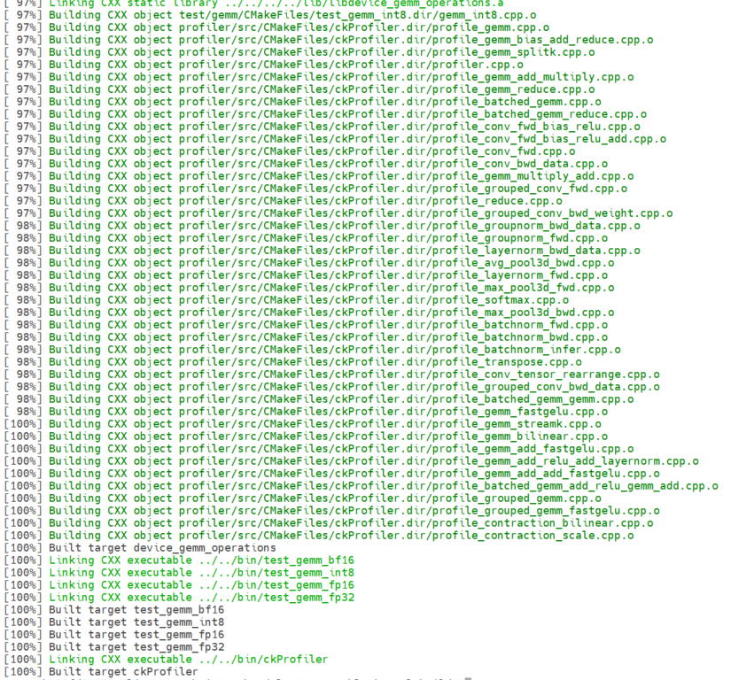
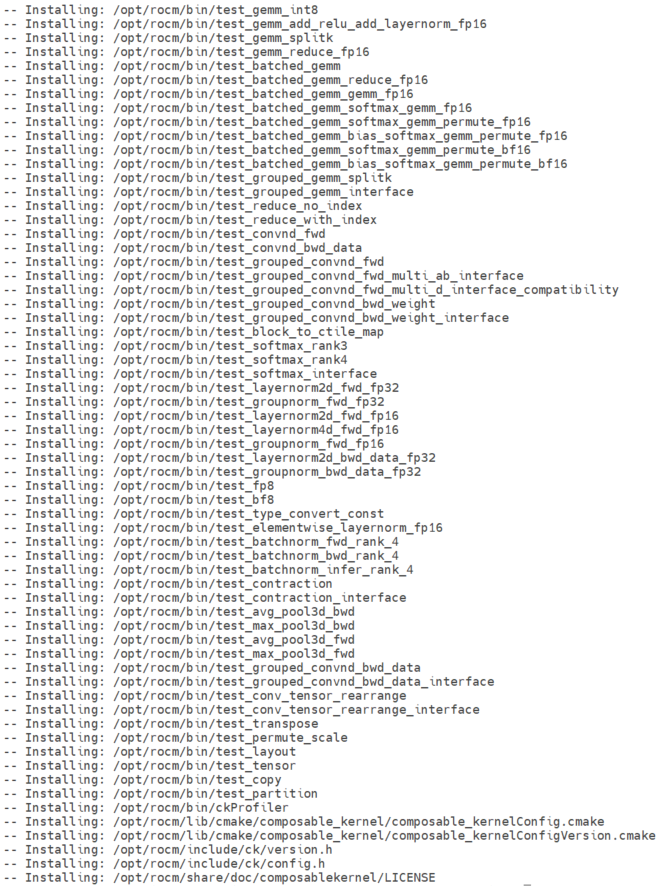
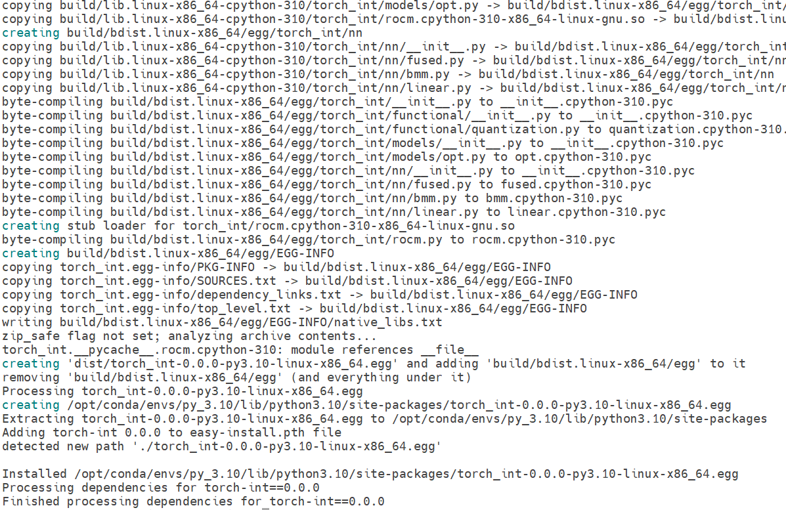

## Code example for 'SmoothQuant model inference on AMD Instinct MI300X using Composable Kernel' blogpost

### Run a Docker Container

The testing was done in a publicly available Docker image from Docker Hub:
[`rocm/pytorch:rocm6.1_ubuntu22.04_py3.10_pytorch_2.1.2`](https://hub.docker.com/layers/rocm/pytorch/rocm6.1_ubuntu22.04_py3.10_pytorch_2.1.2/images/sha256-f6ea7cee8aae299c7f6368187df7beed29928850c3929c81e6f24b34271d652b)

### Install ROCm&trade; Composable Kernel

```bash
git clone https://github.com/ROCm/composable_kernel.git
cd composable_kernel
mkdir build
cd build
cmake -D CMAKE_PREFIX_PATH=/opt/rocm -D CMAKE_CXX_COMPILER=/opt/rocm/bin/hipcc -D CMAKE_BUILD_TYPE=Release -D GPU_TARGETS="gfx942" ..
make -j 
make -j install
```

The successful process looks like this:




### Install torch-int

```bash
cd src
# libutility.a is generated after the installation of CK 
cp /opt/rocm/lib/libutility.a ./
python setup.py install
```

The successful process looks like this



### Install other dependencies

```bash
pip install transformers=4.33.2
pip install datasets
pip install icecream
...
```

## Usage

```bash
cd examples
CUDA_VISIBLE_DEVICES=0 python smoothquant_opt_real_int8_demo.py
```
