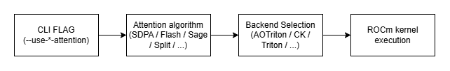
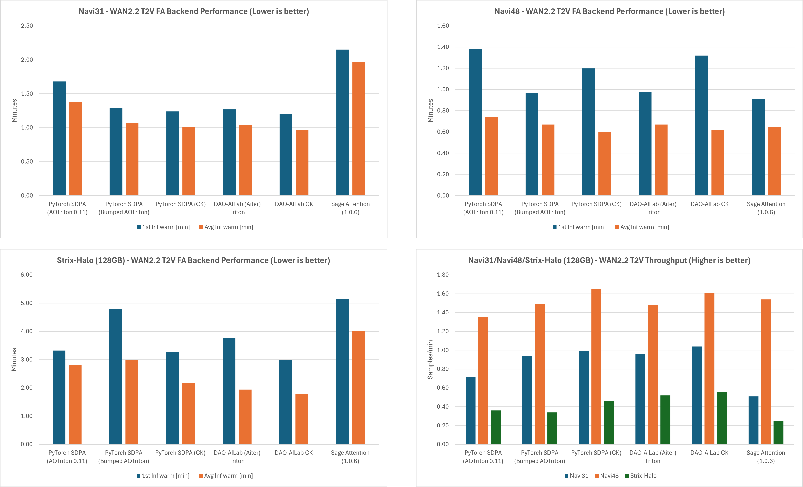
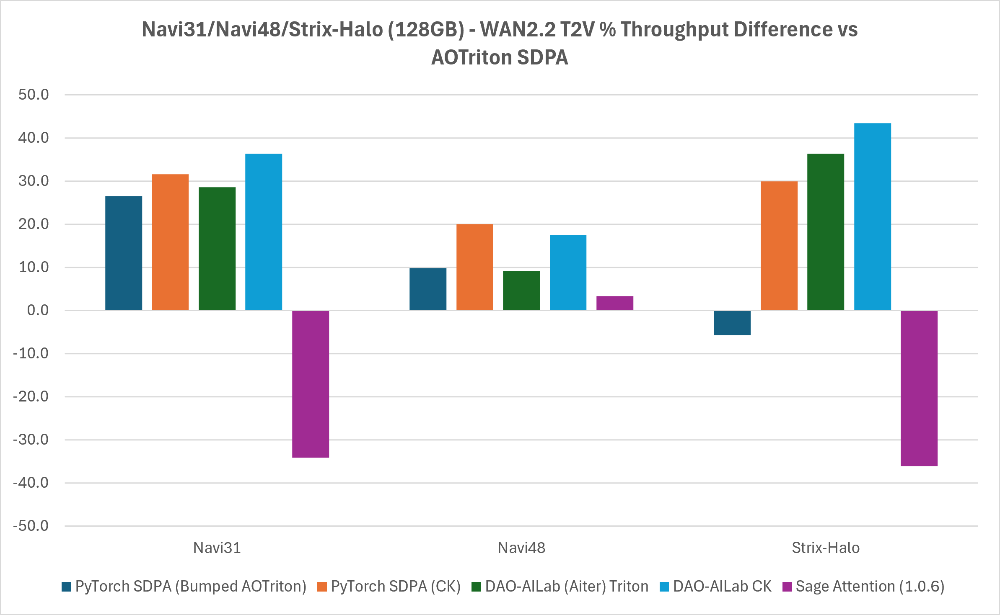
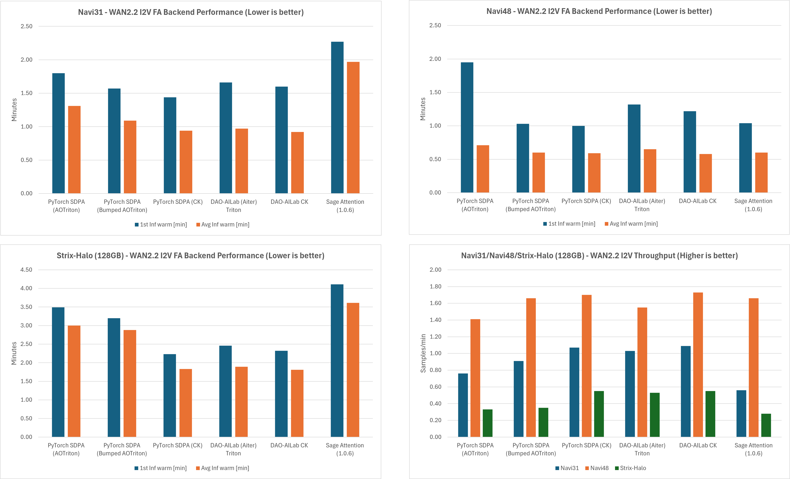
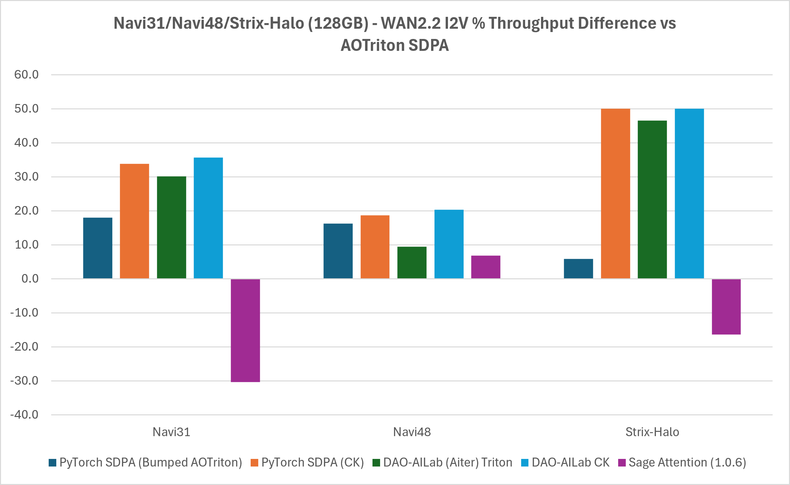

<!---
Copyright (c) 2026 Advanced Micro Devices, Inc. (AMD)

Permission is hereby granted, free of charge, to any person obtaining a copy
of this software and associated documentation files (the "Software"), to deal
in the Software without restriction, including without limitation the rights
to use, copy, modify, merge, publish, distribute, sublicense, and/or sell
copies of the Software, and to permit persons to whom the Software is
furnished to do so, subject to the following conditions:

The above copyright notice and this permission notice shall be included in all
copies or substantial portions of the Software.

THE SOFTWARE IS PROVIDED "AS IS", WITHOUT WARRANTY OF ANY KIND, EXPRESS OR
IMPLIED, INCLUDING BUT NOT LIMITED TO THE WARRANTIES OF MERCHANTABILITY,
FITNESS FOR A PARTICULAR PURPOSE AND NONINFRINGEMENT. IN NO EVENT SHALL THE
AUTHORS OR COPYRIGHT HOLDERS BE LIABLE FOR ANY CLAIM, DAMAGES OR OTHER
LIABILITY, WHETHER IN AN ACTION OF CONTRACT, TORT OR OTHERWISE, ARISING FROM,
OUT OF OR IN CONNECTION WITH THE SOFTWARE OR THE USE OR OTHER DEALINGS IN THE
SOFTWARE.
--->

# Understanding Attention Algorithms and Their Backends for Image and Video Generation

ComfyUI has become a widely adopted tool for running modern generative AI workloads, from text-to-image and video generation to more advanced pipelines like WAN2.2. Its node-based workflow makes it accessible without requiring deep coding knowledge, but under the hood it still relies heavily on one of the most important building blocks in modern AI models: **attention**.

For users running on AMD GPUs with ROCm™, choosing the right attention implementation can have a **significant impact on performance, memory usage, and stability**. However, this choice is far from straightforward. ComfyUI exposes multiple attention flags, each mapping to different algorithms and backend implementations (AOTriton, CK Tile, rocBLAS/hipBLASLt, Triton), often with non-obvious priority rules and interactions.

The challenge is not just what attention algorithm to use, but understanding:

- how ComfyUI selects attention under the hood
- how that maps to ROCm backends
- and what actually performs optimally in practice

This blog breaks down these layers and offers a practical guide to help you make informed decisions when running ComfyUI for image and video generation on Linux-based systems with AMD RDNA™ architecture GPUs.

For background and setup across AMD platforms, refer to the earlier ROCm blogs [Running ComfyUI on AMD Instinct GPU](https://rocm.blogs.amd.com/software-tools-optimization/comfyui-on-amd/README.html), [Getting Started with ComfyUI on AMD Radeon™ RX 9000 Series GPUs](https://rocm.blogs.amd.com/artificial-intelligence/comfyui-radeon-9000/README.html), and [Running ComfyUI in Windows with ROCm on WSL](https://rocm.blogs.amd.com/software-tools-optimization/rocm-on-wsl/README.html).

## Quick recommendations

If you were to take one thing from this blog, let it be the following section which summarizes **practical recommendations** based on common usage scenarios:

| **Scenario** | **Recommended Option** | **Why** |
|----|----|----|
| **Default / Stable setup** | `--use-pytorch-cross-attention` (SDPA) | Safe, well-integrated, automatically selects optimized AOTriton backend. **Note:** CK backend is experimentally enabled for the purposes of this blog. Officially, it is not available for RDNA architectures (see --use-pytorch-cross-attention chapter). |
| **Maximum performance (throughput)** | `--use-flash-attention` (CK Tile backend) | In our benchmarks, typically delivered the highest throughput on the tested configurations. |
| **xformers already installed** | Keep disabled or explicitly override. | xformers has higher priority and may silently override other choices. **Note:** Not stable (see `--disable-xformers` chapter) |
| **Memory constrained workloads** | `--use-split-cross-attention` or `--use-quad-cross-attention` | Reduces memory footprint by avoiding full attention computation. |
| **Debugging / fallback** | PyTorch math (implicit fallback) | Most stable but slowest path. |
| **Avoid xformers interference** | `--use-pytorch-cross-attention` or `--disable-xformers` | Flags that explicitly disable xformers. For example, xformers will override the `--use-flash-attention` flag. |

Quick recommendations **takeaways**

- **PyTorch SDPA** is the safest default on AMD due to AOTriton integration.
- **Flash Attention (CK Tile)** typically gives optimal raw performance.
- **xformers can silently override your choice**, so be explicit when needed.
- **Split/quad attention trades performance for memory safety.**

These choices can significantly impact generation throughput, memory usage, and overall stability. In some cases, selecting the right attention backend can significantly impact performance on AMD GPUs.

_Note:_ PyTorch SDPA (CK) and the modified PyTorch/AOTriton builds used in this blog are experimental and not officially supported on RDNA at the time of writing.

## Attention Selection Overview

At a high level, selecting an attention implementation in ComfyUI is not determined solely by the CLI flag. The final implementation depends on ComfyUI priority rules, installed packages, AMD/ROCm availability checks, and backend dispatch.

| **Attention implementation** | **CLI flag / activation** | **Available Out-of-the-box?** | **ROCm backend path** | **Typical use case** | **Notes** |
|----|----|----|----|----|----|
| Sage Attention | `--use-sage-attention` | No | Triton | Experimental / research | Requires sageattention package. Not officially supported on AMD. On gfx12xx, additional patching may be required due to Triton compilation issues. In the measured workloads, Sage Attention was generally slower than PyTorch SDPA on Navi31 and Strix-Halo, and had stability issues on Navi48. |
| xformers | Auto-detected if installed | No | CK Tile | Implicit path | High-priority path. If installed, xformers may be selected automatically and can silently override other choices. It should be handled carefully because it was observed to be unstable in some tested scenarios. |
| Flash Attention | `--use-flash-attention` | No | CK Tile by default; Aiter/Triton optional with `FLASH_ATTENTION_TRITON_AMD_ENABLE=TRUE` | Maximum throughput | Requires DAO-AILab/flash-attention package. In the benchmarks, CK-backed Flash Attention delivered the highest throughput in most cases. Make sure xformers is disabled or bypassed when you want this path to be selected. |
| PyTorch SDPA | `--use-pytorch-cross-attention`, or auto-detected on supported configurations | Yes | AOTriton by default; CK experimentally possible with `TORCH_ROCM_FA_PREFER_CK=1` or `torch.backends.cuda.preferred_rocm_fa_library("ck")` | Stable default | Safest and most integrated option on AMD. In ComfyUI, `--use-pytorch-cross-attention` also bypasses xformers for cross attention. CK-backed PyTorch SDPA was experimentally enabled for this analysis but is not officially supported for RDNA architectures. |
| Split Attention | `--use-split-cross-attention` | Yes | Pure PyTorch implementation; batched matrix operations dispatch through rocBLAS/hipBLASLt | Memory-constrained workloads | Computes attention in slices to reduce memory pressure. This trades performance for memory safety and also suppresses AMD auto-detection of PyTorch/AOTriton attention. |
| Sub-quadratic Attention | `--use-quad-cross-attention`, or default fallback when no higher-priority implementation is active | Yes | Pure PyTorch implementation; batched matrix operations dispatch through rocBLAS/hipBLASLt | Fallback / extreme memory constraints | Lowest-priority path. Useful when other optimized attention implementations are unavailable or unsuitable, but generally not the performance-oriented choice. |

## Choosing the Right Attention

Before diving into individual flags, the image below highlights how ComfyUI resolves attention internally:

- **Attention flag** selects a high-level algorithm (e.g. PyTorch SDPA, Flash Attention).

- The algorithm maps to a **backend implementation** (AOTriton, CK Tile, Triton, rocBLAS/hipBLASLt).

- The backend determines **performance characteristics** such as throughput and memory usage.



Understanding this mapping is important because the CLI flag ultimately determines which attention algorithm and which ROCm backend is used, directly impacting performance.

ComfyUI provides multiple attention flags:

- `--use-split-cross-attention`
- `--use-quad-cross-attention`
- `--use-pytorch-cross-attention`
- `--use-sage-attention` (sageattention package must be installed)
- `--use-flash-attention` (flash-attention package must be installed)
- `--disable-xformers`

These options are **mutually exclusive**, and their behavior depends on installed libraries and internal priority rules. For example, `--use-sage-attention` requires sageattention package to be installed, while `--use-flash-attention` needs corresponding DAO-AILab/flash-attention. Also, Linux supports all of the listed backends, while some of them might have limited support on Windows.

These flags are passed as CLI arguments when launching ComfyUI:

python ComfyUI/main.py `--use-\*-attention`

Apart from that, there are settings for controlling attention precision and up casting. These won’t be covered in this blog:

- `--force-upcast-attention`
- `--dont-upcast-attention`

### Attention priority

ComfyUI chooses the global attention implementation based on the priority order in [ComfyUI/comfy/ldm/modules/attention.py at master · Comfy-Org/ComfyUI](https://github.com/Comfy-Org/ComfyUI/blob/master/comfy/ldm/modules/attention.py#L776-L796):

| **Priority** | **Implementation** | **Condition** |
|----|----|----|
| 1 | Sage attention | sageattention installed + `--use-sage-attention` |
| 2 | xformers | ROCm xformers installed (auto, no flag needed) |
| 3 | Flash attention | DAO-AILab/flash-attention installed + `--use-flash-attention` |
| 4 | PyTorch SDPA | `--use-pytorch-cross-attention` (overrides xformers) OR auto-detected: supported arch + PyTorch ≥ 2.7 + AOTriton present + no `--use-split/quad` flag |
| 5 | Split attention | `--use-split-cross-attention` (if 1-4 all absent) |
| 6 | Sub-quadratic attention | Default |

### **VAE Decoder Attention**

The VAE decoder follows a separate attention selection path: [ComfyUI/comfy/ldm/modules/diffusionmodules/model.py at master · Comfy-Org/ComfyUI](https://github.com/Comfy-Org/ComfyUI/blob/master/comfy/ldm/modules/diffusionmodules/model.py#L329). On AMD GPUs, PyTorch SDPA is intentionally disabled for VAE due to stability issues at high resolutions. As a result, VAE attention typically falls back to xformers (if available) or split attention.

| **Priority** | **Implementation** | **Condition** |
|----|----|----|
| 1 | xformers | ROCm xformers installed and if not disabled via `--disable-xformers`. Falls back to slice_attention on NotImplementedError: [ComfyUI/comfy/ldm/modules/diffusionmodules/model.py at master · Comfy-Org/ComfyUI](https://github.com/Comfy-Org/ComfyUI/blob/master/comfy/ldm/modules/diffusionmodules/model.py#L303). |
| 2 | PyTorch SDPA | **Important:** `pytorch_attention_enabled_vae()` unconditionally returns False on AMD to avoid crashes at high resolution, so this path is not used on AMD regardless of `ENABLE_PYTORCH_ATTENTION` |
| 3 | Split attention | Fallback when PyTorch attention or xformers is disabled. Uses Batched matrix multiplication implementation (falls back to rocBLAS/hipBLASLt) |

### ComfyUI AMD/ROCm specifics

The most important AMD/ROCm specifics are:

- ComfyUI will automatically enable **PyTorch SDPA** attention with compatible PyTorch/ROCm versions: [ComfyUI/comfy/model_management.py at master · Comfy-Org/ComfyUI](https://github.com/Comfy-Org/ComfyUI/blob/master/comfy/model_management.py#L480).

- FP8 operations are enabled for newer AMD architectures: [ComfyUI/comfy/model_management.py at master · Comfy-Org/ComfyUI](https://github.com/Comfy-Org/ComfyUI/blob/master/comfy/model_management.py#L515)

- TORCH_ROCM_AOTRITON_ENABLE_EXPERIMENTAL=1 is **set** by default within ComfyUI: [ComfyUI/main.py at master · Comfy-Org/ComfyUI](https://github.com/Comfy-Org/ComfyUI/blob/master/main.py#L68), which enables experimental memory efficient attention (backed by AOTriton on AMD). In practice we need to pass --use-pytorch-cross-attention to get this behavior.

- **`--use-split-cross-attention`** and **`--use-quad-cross-attention`** suppress AMD auto-detection of PyTorch/AOTriton attention.

- Without xformers and without a supported architecture, the default path is sub-quadratic attention.

### Attention backends overview

The following table shows how different attention implementations map to backend implementations on AMD/ROCm:

| **Attention** | **Backend** |
|----|----|
| Sage attention | Triton |
| xformers | CK Tile |
| Flash attention | CK Tile - default |
|   | (Aiter) Triton - force with `FLASH_ATTENTION_TRITON_AMD_ENABLE=TRUE` |
| PyTorch SDPA | Flash attention (AOTriton, CK) (AOTriton by default, or CK if `TORCH_ROCM_FA_PREFER_CK=1` or `torch.backends.cuda.preferred_rocm_fa_library("ck")` is set) |
|   | Memory efficient attention (AOTriton, CK) (AOTriton by default, or CK if `TORCH_ROCM_FA_PREFER_CK=1` or `torch.backends.cuda.preferred_rocm_fa_library("ck")` is set) |
|   | Math (C++) |
| Split Cross attention | Pure PyTorch implementation (e.g. einsum - falls back to rocBLAS/hipBLASLt) |
| Sub-quadratic attention | Pure PyTorch implementation (e.g. batched matrix multiplication - falls back to rocBLAS/hipBLASLt) |

- PyTorch SDPA Flash attention and Memory efficient attention share the same backends for AMD/ROCm, essentially making them the same.

## More on Attention

With Attention priority and Attention backends we have covered all ComfyUI attention algorithms from a high-level perspective. Therefore, the following paragraphs deep dive into the attention algorithms behind different CLI flags by following the Attention priority discussed previously. Also, ComfyUI AMD/ROCm specifics will be covered.

### **`--use-sage-attention`**

**Note:** sageattention works out-of-the-box for gfx1100 and gfx1151. For gfx12xx the patch needs to be applied as there are triton compilation errors. These are known bugs:

- <https://github.com/kijai/ComfyUI-WanVideoWrapper/issues/2007>

- <https://github.com/triton-lang/triton-windows/issues/24>

This PR solves the gfx12xx issue: <https://github.com/thu-ml/SageAttention/pull/365>

Sage attention is a quantization technique that boosts the transformer attention performance by using INT8 quantization and matrix smoothing.

Currently, sageattention is not an officially supported package from AMD, it is limited to CUDA stack and should be used for experimental purposes. There are community and partial AMD efforts to enable the Triton route through Sage attention.

As sage-attention is not available out-of-the-box, this package needs to be installed with the following command:

```console
pip install "sageattention\<2"
```

Passing `low_precision_attention=False`, will bypass sage-attention and fallback to attention_pytorch and if sage-attention raises **any exception**, it logs an error and falls back to attention_pytorch.

### **`--disable-xformers`**

**Note:** For mGPU T2V WAN2.2 workload, xformers produces Memory access faults on Navi48 VAE Decoder phase.

If xformers library is detected, it will be used automatically if not disabled by this flag. Therefore, no special activation flag is needed to use xformers as based on the priority chain, ComfyUI selects xformers second (after sage attention).

Using any of the following flags will bypass xformers:

- `--use-pytorch-cross-attention`

- `--use-sage-attention` (sageattention package must be installed)

Attention_xformers calls memory-efficient attention and lets the xformers library determine which ROCm library or backend is used. ([ComfyUI/comfy/ldm/modules/attention.py at master · Comfy-Org/ComfyUI](https://github.com/Comfy-Org/ComfyUI/blob/master/comfy/ldm/modules/attention.py#L505)). Also, --use-pytorch-cross-attention explicitly sets XFORMERS_IS_AVAILABLE = False ([ComfyUI/comfy/model_management.py at master · Comfy-Org/ComfyUI](https://github.com/Comfy-Org/ComfyUI/blob/master/comfy/model_management.py#L458-L460)) and it is the flag that actively disables xformers.

xformers is not available out-of-the-box. Therefore, to install it, follow the install from source instructions from the xformers repository: [ROCm/xformers: Hackable and optimized Transformers building blocks, supporting a composable construction](https://github.com/ROCm/xformers).

### **`--use-flash-attention`**

This flag will utilize Flash attention 2 algorithm described in the following paper: [FlashAttention-2: Faster Attention with Better Parllelism and Work Partitioning](https://tridao.me/publications/flash2/flash2.pdf). Usually, this implementation produces strong results on AMD GPUs.

For `--use-flash-attention`, DAO-AILab/flash-attention package needs to be installed and additionally for DAO-AILab (Aiter) Triton, Aiter needs to be installed: [ROCm/aiter: AI Tensor Engine for ROCm](https://github.com/ROCm/aiter) (Or follow the aiter checkout steps when building DAO-AILab/flash-attention):

``` console
python -m pip install --no-build-isolation git+https://github.com/ROCm/aiter.git
```

To build DAO-AILab/flash-attention, follow the Readme.md from the official DAO-AILab/flash-attention repository: <https://github.com/Dao-AILab/flash-attention#amd-rocm-support>.

Building DAO-AILab/flash-attention **without** `FLASH_ATTENTION_TRITON_AMD_ENABLE` provides the option to toggle between CK Tile and Triton FA with `FLASH_ATTENTION_TRITON_AMD_ENABLE=TRUE`.

For peak throughput, enable `FLASH_ATTENTION_TRITON_AMD_AUTOTUNE="TRUE"` to search for optimal settings, which incurs a one-time warmup cost. Alternatively, if not autotuning, `FLASH_ATTENTION_FWD_TRITON_AMD_CONFIG_JSON` may be used to set a single triton config overriding the hardcoded defaults for attn_fwd.

### **`--use-pytorch-cross-attention`**

Lets PyTorch internally choose one of the three available implementations:

- Flash Attention (AOTriton, CK)
- Memory efficient (AOTriton, CK)
- Math (C++ implementation)

Both Flash Attention and Memory Efficient Attention dispatch to the same ROCm kernel library, which is AOTriton by default or CK if `TORCH_ROCM_FA_PREFER_CK=1` or `torch.backends.cuda.preferred_rocm_fa_library("ck")` is set. Math, or pure C++ implementation, is a PyTorch SDPA that does not use kernel fusion, tiling, or memory optimizations. Currently, **CK** PyTorch cross attention is **not supported for RDNA** architectures. Flash Attention is not to be confused with the DAO-AILab/flash-attention package. Even though they share a similar name, Flash Attention in this context refers to PyTorch SDPA Flash Attention 2 implementation.

In this analysis, we used an internal experimental build of PyTorch 2.10 with CK-enabled SDPA on Navi31, Navi48, and Strix-Halo. This configuration is not officially supported on RDNA architectures and is used here solely for experimental comparison.

Also, for this blog, we evaluated a newer Triton version within AOTriton (0.11.1b) and compared it against the official AOTriton configuration. Specifically, we used the Triton version from AOTriton 0.12 (ROCm/triton at aotriton/0.12), as our experiments showed that upgrading the Triton dependency can provide measurable performance benefits.

### **`--use-split-cross-attention`**

This is ComfyUI's pure PyTorch attention implementation that helps avoid out‑of‑memory (OOM) errors by computing attention in slices rather than all at once: [ComfyUI/comfy/ldm/modules/attention.py at master · Comfy-Org/ComfyUI](https://github.com/Comfy-Org/ComfyUI/blob/master/comfy/ldm/modules/attention.py#L328). It is one of the last resorts in the priority chain and should be used when there is a need for reduced memory pressure. Split cross-attention is available out-of-the-box without the need to install any additional packages.

On AMD/ROCm, PyTorch dispatches the underlying batched matrix multiplications (e.g., einsum) down through its own ROCm backend to **rocBLAS/hipBLASLt**. Also, for AMD, passing this flag suppresses the auto-enabling of PyTorch attention (`ENABLE_PYTORCH_ATTENTION`) on supported arches: [ComfyUI/comfy/model_management.py at master · Comfy-Org/ComfyUI](https://github.com/Comfy-Org/ComfyUI/blob/master/comfy/model_management.py#L506).

### **`--use-quad-cross-attention`**

`--use-quad-cross-attention` activates sub-quadratic attention, which is an implementation of the algorithm from the paper ["Self-attention Does Not Need O(n²) Memory"](https://arxiv.org/abs/2112.05682v2). Sub-quadratic attention is the default fallback when none of sage/xformers/flash/pytorch/split attention are active or available and should be used when split cross-attention produces out-of-memory issues. Quad cross-attention is available out-of-the-box without need to install any additional packages.

For AMD, passing this flag suppresses the auto-enabling of PyTorch attention (`ENABLE_PYTORCH_ATTENTION`) on supported arches: [ComfyUI/comfy/model_management.py at master · Comfy-Org/ComfyUI](https://github.com/Comfy-Org/ComfyUI/blob/master/comfy/model_management.py#L506).

As with split-cross-attention, the quad-cross-attention will be dispatched to **rocBLAS/hipBLASLt** as it is using PyTorch batched matrix multiplication functions.

## WAN2.2 14B T2V & I2V benchmark results

**DISCLAIMER**: Performance results are based on AMD testing using the WAN2.2 workflows, hardware platforms, software versions, and configurations described in this article. Actual results will vary depending on model, workload, software stack, system configuration, backend selection, and optimization settings.

Key findings from benchmarks:

- In our measurements, Flash attention with CK delivered the highest throughput on the tested workloads.
- Gains range from **~20% up to 40–50%** depending on workload and hardware
- PyTorch SDPA (AOTriton) offers stable performance but lower peak throughput
- Sage attention produces significantly worse results than PyTorch SDPA (AOTriton) on Navi31 and Strix-Halo, while it fails with Memory access faults on Navi48
- Differences are more pronounced on larger models and unified-memory systems (e.g., Strix Halo)
- In these tests, RDNA4 (Navi48) delivered roughly ~60% higher throughput than RDNA3 (Navi31) under the same workload and backend.

The experiments were run on two different workflows:

- [comfyui_txt2video_Wan2.2-Lightning-T2V-A14B-4steps-lora-HIGH-fp16](./workflows/comfyui_txt2video_Wan2.2-Lightning-T2V-A14B-4steps-lora-HIGH-fp16.json)

- [comfyui_image2video_wan2.2-i2v-scale-fp8-lightx-workflow](./workflows/comfyui_image2video_wan2.2-i2v-scale-fp8-lightx-workflow.json)
  - This workflow needs to be modified for the ComfyUI to be able to change the FA algorithm. The default value is hardcoded to SDPA, change it to “comfy” to control the FA with `--use-flash-attention`, change it to “sageattn” to use it with `--use-sage-attention`.

### comfyui_txt2video_Wan2.2-Lightning-T2V-A14B-4steps-lora-HIGH-fp16

The figures below show the performance of different Flash Attention backends on Navi 31, Navi 48, and Strix Halo (128 GB), including throughput and percentage throughput differences relative to PyTorch AOTriton SDPA for the WAN 2.2 T2V workload:




For more detailed information, refer to the table below:

| **GPU Architecture** | **Flash attention backend** | **First inference time \[min\]** | **Average inference time \[min\]** | **Throughput \[samples/min\]** | **Throughput percentage difference (vs. AOTriton SDPA) \[%\]** |
|----|----|----|----|----|----|
| **Navi31** | PyTorch SDPA (AOTriton) | (1.75) 1.68 | (1.39) 1.38 | (0.72) 0.72 | N/A |
|   | PyTorch SDPA (bumped AOTriton) | (1.40) 1.29 | (1.07) 1.07 | (0.94) 0.94 | 26.506 |
|  | PyTorch SDPA (CK) | (1.36) 1.24 | (1.03) 1.01 | (0.97) 0.99 | 31.5789 |
|   | DAO-AILab (Aiter) Triton | (1.30) 1.27 | (1.04) 1.04 | (0.96) 0.96 | 28.5714 |
|   | DAO-AILab CK | (1.31) 1.20 | (0.97) 0.97 | (1.04) 1.04 | **36.3636** |
|   | Sage Attention (1.0.6) | (2.24) 2.15 | (1.97) 1.97 | (0.51) 0.51 | -34.1463 |
| **Navi48** | PyTorch SDPA (AOTriton) | (4.23) 1.38 | (0.77) 0.74 | (1.31) 1.35 | N/A |
|   | PyTorch SDPA (bumped AOTriton) | (2.27) 0.97 | (0.67) 0.67 | (1.49) 1.49 | 9.85915 |
|  | PyTorch SDPA (CK) | (2.61) 1.20 | (0.61) 0.60 | (1.64) 1.65 | **20.000** |
|   | DAO-AILab (Aiter) Triton | (2.45) 0.98 | (0.70) 0.67 | (1.43) 1.48 | 9.18728 |
|   | DAO-AILab CK | (5.63) 1.32 | (0.60) 0.62 | (1.68) 1.61 | 17.5676 |
|   | Sage Attention (1.0.6) | (5.37) 0.91 | (0.65) 0.65 | (1.55) 1.54 | 3.30033 |
| **Strix-Halo (128GB)** | PyTorch SDPA (AOTriton) | (4.98) 3.32 | (2.83) 2.8 | (0.35) 0.36 | N/A |
|   | PyTorch SDPA (bumped AOTriton) | (6.70) 4.80 | (3.08) 2.98 | (0.33) 0.34 | -5.71429 |
|  | PyTorch SDPA (CK) | (6.07) 3.28 | (2.19) 2.18 | (0.46) 0.46 | 30.0000 |
|   | DAO-AILab (Aiter) Triton | (4.33) 3.76 | (1.99) 1.94 | (0.50) 0.52 | 36.3636 |
|   | DAO-AILab CK | (5.25) 3.00 | (1.8) 1.79 | (0.56) 0.56 | **43.4783** |
|   | Sage Attention (1.0.6) | (7.74) 5.15 | (3.82) 4.02 | (0.26) 0.25 | -36.0656 |

### comfyui_image2video_wan2.2-i2v-scale-fp8-lightx-workflow

The figures below show the performance of different Flash Attention backends on Navi 31, Navi 48, and Strix Halo (128 GB), including throughput and percentage throughput differences relative to PyTorch AOTriton SDPA for the WAN 2.2 I2V workload:




For more detailed information, refer to the table below:

| **GPU Architecture** | **Flash attention backend** | **First inference time \[min\]** | **Average inference time \[min\]** | **Throughput \[samples/min\]** | **Throughput percentage difference (vs. AOTriton SDPA) \[%\]** |
|----|----|----|----|----|----|
| **Navi31** | PyTorch SDPA (AOTriton) | (2.14) 1.80 | (1.31) 1.31 | (0.76) 0.76 | N/A |
|   | PyTorch SDPA (bumped AOTriton) | (1.91) 1.57 | (1.10) 1.09 | (0.91) 0.91 | 17.9641 |
|  | PyTorch SDPA (CK) | (1.77) 1.44 | (0.96) 0.94 | (1.04) 1.07 | 33.8798 |
|   | DAO-AILab (Aiter) Triton | (1.80) 1.66 | (0.98) 0.97 | (1.02) 1.03 | 30.1676 |
|   | DAO-AILab CK | (1.56) 1.60 | (0.91) 0.92 | (1.10) 1.09 | **35.6757** |
|   | Sage Attention (1.0.6) | (2.63) 2.27 | (1.97) 1.97 | (0.55) 0.56 | -30.3030 |
| **Navi48** | PyTorch SDPA (AOTriton) | (10.63) 1.95 | (1.28) 0.71 | (0.78) 1.41 | N/A |
|   | PyTorch SDPA (bumped AOTriton) | (3.81) 1.03 | (0.61) 0.60 | (1.65) 1.66 | 16.2866 |
|  | PyTorch SDPA (CK) | (3.44) 1.00 | (0.59) 0.59 | (1.69) 1.70 | 18.6495 |
|   | DAO-AILab (Aiter) Triton | (3.23) 1.32 | (0.66) 0.65 | (1.53) 1.55 | 9.45946 |
|   | DAO-AILab CK | (3.29) 1.22 | (0.58) 0.58 | (1.72) 1.73 | **20.3822** |
|   | Sage Attention (1.0.6) | (3.23) 1.04 | (0.61) 0.60 | (1.65) 1.66 | 6.85358 |
| **Strix-Halo (128GB)** | PyTorch SDPA (AOTriton) | (6.0) 3.49 | (3.16) 3.00 | (0.32) 0.33 | N/A |
|   | PyTorch SDPA (bumped AOTriton) | (5.71) 3.20 | (2.93) 2.88 | (0.34) 0.35 | 5.88235 |
|  | PyTorch SDPA (CK) | (5.11) 2.23 | (1.83) 1.83 | (0.55) 0.55 | **50.0000** |
|   | DAO-AILab (Aiter) Triton | (5.09) 2.46 | (1.89) 1.89 | (0.53) 0.53 | 46.5116 |
|   | DAO-AILab CK | (4.85) 2.32 | (2.28) 1.81 | (0.44) 0.55 | **50.0000** |
|   | Sage Attention (1.0.6) | (6.62) 4.11 | (3.43) 3.61 | (0.29) 0.28 | -16.3934 |

*Note:* Entries in the tables in parentheses “(XY)” are the numbers from cold start runs, while the numbers without parentheses “XY” are the numbers from the second run with the warm cache.

*Note:* Because MIOpen does not ship a kernel database for RDNA, cold runs were run with the following environment variables:

``` console
export COMFYUI_ENABLE_MIOPEN=1
export MIOPEN_FIND_MODE=1
export MIOPEN_FIND_ENFORCE=4
export MIOPEN_SEARCH_CUTOFF=ON
export TORCH_BLAS_PREFER_HIPBLASLT=1
```

while for the second run, some of the environment variables were unset to let MIOpen use the database entries:

``` console
unset MIOPEN_FIND_MODE
unset MIOPEN_FIND_ENFORCE
unset MIOPEN_SEARCH_CUTOFF
```

### Result interpretation

At a high level, performance is driven by three factors: hardware generation, backend selection, and workload constraints. Therefore, these results provide a useful snapshot of how both **hardware evolution** and **software maturity** impact attention-heavy diffusion workloads on AMD platforms.

**Hardware scaling (from RDNA3 to RDNA4).**\
Keeping the workload and backend constant, RDNA4 (Navi48) delivers roughly **+60% higher throughput** compared to RDNA3 (Navi31). This is the clearest signal in the data: newer GPU architectures translate directly into meaningful gains for attention-dominated workloads, independent of software improvements.

**Software stack maturity.**\
Even on specific hardware, moving across different attention backends and software versions results in significant performance differences. Depending on the configuration, throughput improves by:

- up to **+20% on Navi48**

- up to **+36% on Navi31**

- up to **+50% on Strix Halo**

This highlights that the ROCm attention stack is still evolving rapidly, with backend selection playing a major role in overall performance.

**Composable Kernels (CK) as the winner.**\
Across nearly all tested configurations, **CK-backed implementations** (either via PyTorch SDPA-CK or DAO-AILab Flash Attention with CK) were typically the fastest in our measurements. This consistency confirms that hand-tuned kernel implementations remain the dominant factor for peak performance.

**Strix Halo: trading throughput for capacity.**\
While Strix Halo shows approximately **3× lower raw throughput** compared to Navi48, which is expected due to its APU design, it enables workloads that would otherwise not fit on discrete GPUs, thanks to its **128GB unified memory**.\
In this context, the key metric shifts from how fast it runs to whether it runs at all. Importantly, software improvements still scale well here, with up to **+50% gains** when comparing AOTriton with CK, indicating that the same optimization trends apply even in memory-bound scenarios.

**Current performance insights and optimization opportunities.**\
The results highlight several opportunities for continued optimization and refinement:

- **Cold-start latency** (3–11 minutes on Navi48), primarily driven by MIOpen kernel database tuning rather than steady-state execution performance. Thankfully, warm database runs eliminate most of this overhead, indicating strong runtime efficiency once the system is initialized.

- **Sage Attention** shows room for further tuning in this context, suggesting opportunities to improve its performance for these workloads or explore alternative optimizations.

- The observed performance of the **bumped AOTriton on Strix-Halo** highlights an interesting area for deeper analysis, which may unlock additional performance gains with further investigation.

## Summary

In this blog, you learned how ComfyUI attention algorithms map to ROCm backends and how those backend choices influence performance, memory usage, and stability on AMD GPUs. You also learned how to select optimal attention configuration for your workload using practical recommendations, implementation comparisons, and benchmark-driven performance analysis. Across all measured configurations, the dominant driver of throughput is the choice of backend (CK \> AOTriton-bumped \> AOTriton); silicon generation (RDNA4 over RDNA3) compounds those gains.

While multiple attention paths are available, their behavior is shaped by a combination of ComfyUI priority rules, installed libraries, and the underlying ROCm backend. In practice, this means that seemingly small configuration choices, such as leaving xformers enabled, can significantly affect which attention implementation is actually used.

From both analysis and benchmarking, a few clear patterns emerge:

- **PyTorch SDPA (AOTriton)** provides the most reliable and easiest-to-use default, with good performance.

- **PyTorch SDPA (CK)** provides mixed results. In the case of I2V workload the results are similar or even the same as DAO-AILab/flash-attention (CK backend), while in the case of T2V it even performs slightly better than DAO-AILab/flash-attention (CK backend) on Navi48. Nevertheless, it is not yet officially supported.

- **DAO-AILab/flash-attention (CK backend)** delivers the highest throughput, with improvements ranging from **~20% up to 40–50%** depending on the model and hardware.

- **xformers must be handled carefully**, as it is not stable and can silently override other attention choices.

- **Split and sub-quadratic attention** remain important fallbacks for memory-constrained scenarios, trading performance for stability.

- **Sage attention** produces significantly worse results than PyTorch SDPA (AOTriton) for Navi31 and Strix-Halo and therefore is not recommended. Additionally, on gfx12xx there are known issues with the sageattention package and <https://github.com/thu-ml/SageAttention/pull/365> needs to be included. Nevertheless, Sage attention, in certain cases, outperforms only PyTorch SDPA (AOTriton).

These findings highlight an important takeaway: **the CLI flag alone does not determine performance - the full stack, from flag to backend, must be considered**.

For most users, the following guidelines are a good starting point:

- Use `--use-pytorch-cross-attention` for a stable, well-integrated default.
- Use `--use-flash-attention` (with xformers disabled) when maximizing throughput.
- Use split or sub-quadratic attention when memory pressure becomes a limiting factor.

Ultimately, optimal configuration still depends on the specific workload, model size, and GPU architecture. For optimal results, benchmarking on your target setup remains essential.

_Note:_ CK-based PyTorch SDPA and modified AOTriton configurations used here are experimental and not officially supported on RDNA architectures at the time of writing.

## Disclaimers

Performance results are based on AMD testing using the WAN2.2 workflows, hardware platforms, software versions, and configurations described in this article. Actual results will vary depending on model, workload, software stack, system configuration, backend selection, and optimization settings.
The information presented in this document is for informational purposes only and may contain technical inaccuracies, omissions, and typographical errors. The information contained herein is subject to change and may be rendered inaccurate for many reasons, including but not limited to product and roadmap changes, component and motherboard version changes, new model and/or product releases, product differences between differing manufacturers, software changes, BIOS flashes, firmware upgrades, or the like. Any computer system has risks of security vulnerabilities that cannot be completely prevented or mitigated. AMD assumes no obligation to update or otherwise correct or revise this information.
However, AMD reserves the right to revise this information and to make changes from time to time to the content hereof without obligation of AMD to notify any person of such revisions or changes.
THIS INFORMATION IS PROVIDED ‘AS IS.” AMD MAKES NO REPRESENTATIONS OR WARRANTIES WITH RESPECT TO THE CONTENTS HEREOF AND ASSUMES NO RESPONSIBILITY FOR ANY INACCURACIES, ERRORS, OR OMISSIONS THAT MAY APPEAR IN THIS INFORMATION. AMD SPECIFICALLY DISCLAIMS ANY IMPLIED WARRANTIES OF NON-INFRINGEMENT, MERCHANTABILITY, OR FITNESS FOR ANY PARTICULAR PURPOSE. IN NO EVENT WILL AMD BE LIABLE TO ANY PERSON FOR ANY RELIANCE, DIRECT, INDIRECT, SPECIAL, OR OTHER CONSEQUENTIAL DAMAGES ARISING FROM THE USE OF ANY INFORMATION CONTAINED HEREIN, EVEN IF AMD IS EXPRESSLY ADVISED OF THE POSSIBILITY OF SUCH DAMAGES.
AMD, the AMD Arrow logo, AMD Radeon™, Radeon™, RDNA™, AMD Instinct™, Radeon Instinct™, CDNA, ROCm™ and combinations thereof are trademarks of Advanced Micro Devices, Inc. Other product names used in this publication are for identification purposes only and may be trademarks of their respective companies.
Linux® is the registered trademark of Linus Torvalds in the U.S. and other countries.
Python is a trademark of the Python Software Foundation.
PyTorch, the PyTorch logo and any related marks are trademarks of The Linux Foundation.
© 2026 Advanced Micro Devices, Inc. All rights reserved

Third-party content is licensed to you directly by the third party that owns the content and is not licensed to you by AMD. ALL LINKED THIRD-PARTY CONTENT IS PROVIDED “AS IS” WITHOUT A WARRANTY OF ANY KIND. USE OF SUCH THIRD-PARTY CONTENT IS DONE AT YOUR SOLE DISCRETION AND UNDER NO CIRCUMSTANCES WILL AMD BE LIABLE TO YOU FOR ANY THIRD-PARTY CONTENT. YOU ASSUME ALL RISK AND ARE SOLELY RESPONSIBLE FOR ANY DAMAGES THAT MAY ARISE FROM YOUR USE OF THIRD-PARTY CONTENT.
