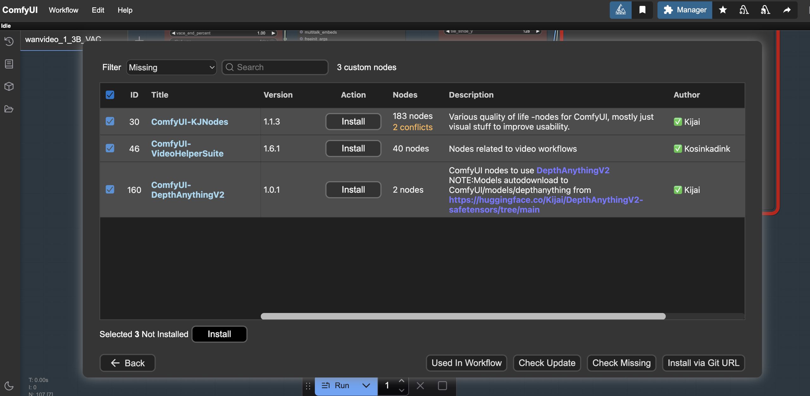
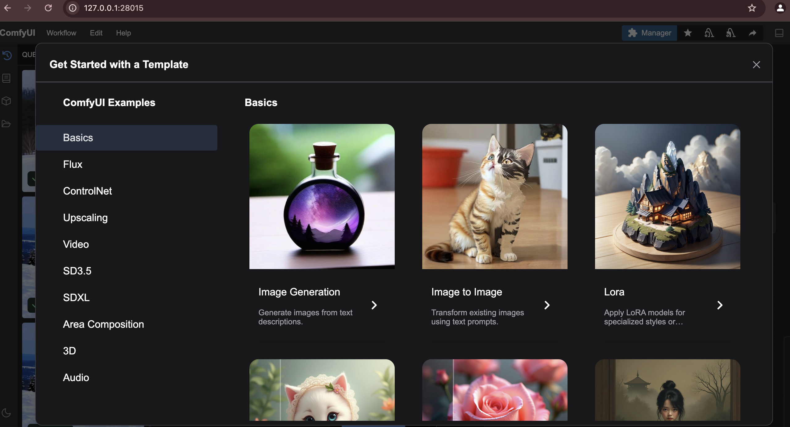
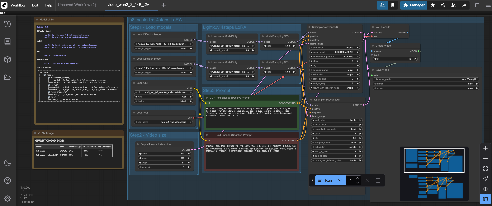
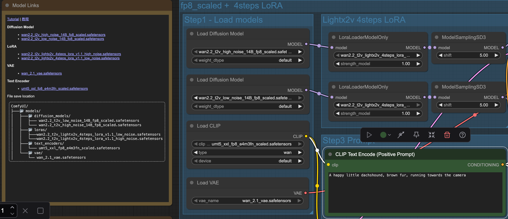
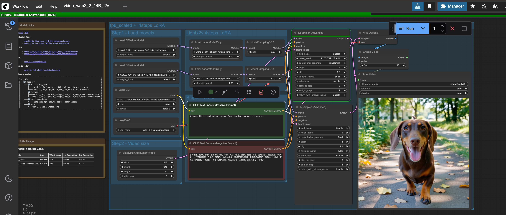

<!---
Copyright (c) 2025 Advanced Micro Devices, Inc. (AMD)

Permission is hereby granted, free of charge, to any person obtaining a copy
of this software and associated documentation files (the "Software"), to deal
in the Software without restriction, including without limitation the rights
to use, copy, modify, merge, publish, distribute, sublicense, and/or sell
copies of the Software, and to permit persons to whom the Software is
furnished to do so, subject to the following conditions:

The above copyright notice and this permission notice shall be included in all
copies or substantial portions of the Software.

THE SOFTWARE IS PROVIDED "AS IS", WITHOUT WARRANTY OF ANY KIND, EXPRESS OR
IMPLIED, INCLUDING BUT NOT LIMITED TO THE WARRANTIES OF MERCHANTABILITY,
FITNESS FOR A PARTICULAR PURPOSE AND NONINFRINGEMENT. IN NO EVENT SHALL THE
AUTHORS OR COPYRIGHT HOLDERS BE LIABLE FOR ANY CLAIM, DAMAGES OR OTHER
LIABILITY, WHETHER IN AN ACTION OF CONTRACT, TORT OR OTHERWISE, ARISING FROM,
OUT OF OR IN CONNECTION WITH THE SOFTWARE OR THE USE OR OTHER DEALINGS IN THE
SOFTWARE.
--->

# Running ComfyUI on AMD Instinct

Building workflows for generative AI tasks can of course be done purely in code.
However, as the interest in GenAI has soared together with its use in people's daily lives, more and more people start to search for and explore tools and software for building GenAI workflows that do not require extensive programming knowledge.
One such tool is [ComfyUI](https://www.comfy.org/), which provides users with a simple drag and drop UI for building GenAI workflows.
This blog post will briefly cover what ComfyUI is, and how you can get it up and running on your AMD Instinct hardware.

If you are interested in running ComfyUI in Windows on a AMD Radeon™ graphics card, we highly recommend reading this blog about [running ComfyUI in Windows using WSL](https://rocm.blogs.amd.com/software-tools-optimization/rocm-on-wsl/README.html).

## ComfyUI

[ComfyUI](https://www.comfy.org/) is a graphical node-based interface for creating images, videos and audio.
It requires minimal coding and lets the user create diffusion workflows by dragging and dropping nodes in a visual interface.
It is open source, and can be installed on Windows, Mac OS and Linux.
To use a stable diffusion model in ComfyUI, simply install ComfyUI, download the model and build your workflow using the model in the UI.
Workflows can be saved and loaded as JSON files.
The key building blocks of the ComfyUI are the nodes.
There are various different node types available in ComfyUI, and the type of a node determines the type of operation performed in the workflow.
Operations could be loading model checkpoints, encoding the prompt, generating image/video, saving image/video, etc.
Nodes are connected through links that determine what information gets passed from one node to the next in the workflow.
By connecting nodes together and modifying their parameters, both simple and complex workflows can be built for tasks such as image/video generation, video editing, super resolution and much more.
Workflows can either be created from scratch, or by using the wide variety of templates available.
Further, in addition to the core nodes and functionality of ComfyUI, there exists a wide community of users who build their own workflows and nodes that can be imported and used.
It is also possible to create your own custom nodes.
There are various tutorials and blogs covering potential use cases for ComfyUI which an interested reader of this blog might be interested in diving deeper into, for instance [this YouTube Series](https://www.youtube.com/playlist?list=PL-pohOSaL8P9kLZP8tQ1K1QWdZEgwiBM0).

## Platform/Hardware

* **AMD Instinct™ GPUs**: This was tested on an AMD Instinct MI300X GPU.
Ensure that you are using an AMD Instinct GPU or compatible hardware with ROCm support and that your system meets the [official requirements](https://rocm.docs.amd.com/projects/install-on-linux/en/latest/reference/system-requirements.html).

## Software

* **ROCm 6.3**: Install and verify ROCm by following the [ROCm install guide](https://rocm.docs.amd.com/projects/install-on-linux/en/latest/install/quick-start.html).
After installation, confirm your setup using:

  ```bash
  rocm-smi
  ```

  This command lists your AMD GPUs with relevant details.
* **Docker** : Ensure Docker is installed and configured correctly.
Follow the Docker installation guide for your operating system.

## Setup

### Setting up the environment

Start by creating a `Dockerfile` with the following content:

```docker
FROM rocm/pytorch-training:v25.2
ENV COMFYUI_PATH=/workload/ComfyUI
RUN git clone https://github.com/comfyanonymous/ComfyUI.git $COMFYUI_PATH && \
    git clone https://github.com/ltdrdata/ComfyUI-Manager $COMFYUI_PATH/custom_nodes/comfyui-manager && \
    git clone https://github.com/rgthree/rgthree-comfy.git $COMFYUI_PATH/custom_nodes/rgthree-comfy
RUN pip install --upgrade pip
RUN pip install -r $COMFYUI_PATH/requirements.txt && \
    pip install --upgrade --no-deps --force-reinstall torch torchvision torchaudio --index-url https://download.pytorch.org/whl/rocm6.3/ && \
    pip install -r $COMFYUI_PATH/custom_nodes/comfyui-manager/requirements.txt
CMD ["/bin/bash"]
```

**NOTE**: In case there are any additional custom nodes you would like to install during the setup, this can be done in the `Dockerfile` by cloning the repo and `pip` installing the requirements.

Next, build the image with

```bash
docker build --file Dockerfile --tag comfyui-rocm .
```

This will pull the `rocm/pytorch-training:v25.2` image and install ComfyUI along with the ComfyUI Node Manager, the [rgthree-comfy](https://github.com/rgthree/rgthree-comfy) custom nodes and the required dependencies.
Once the image is built, launch a container based on the image with:

```bash
docker run -d --rm\
  --device=/dev/kfd \
  --device=/dev/dri \
  --group-add=video \
  --name comfyui-rocm-container \
  -p 8188:8188 \
  comfyui-rocm \
  tail -f /dev/null
```

```bash
docker exec -it comfyui-rocm-container bash
```

#### Clean up once finished working

1. **Stop** running container:

   ```bash
   docker stop comfyui-rocm-container
   ```

2. **Remove** stopped container:

   ```bash
   docker rm comfyui-rocm-container
   ```

### Launching the ComfyUI server

To start the ComfyUI server, giving you access to the graphical interface for building workflows, simply launch the python script for starting it with

```bash
python $COMFYUI_PATH/main.py
```

This will start the server on the default port, which is `8188`.
This can however be changed by changing the value of the environment variable `COMFYUI_PORT_HOST` to something else.

### Downloading models

ComfyUI enables users to easily use models and build both simple and complex workflows with them.
However, in order to use a model it must first be downloaded.
This can be done from the UI directly, however from experience the simplest and most stable way is to simply download the models from a model repository, for instance [Huggingface](https://huggingface.co/) or [Civitai](https://civitai.green/), from the command line with commands such as `curl`.
When downloading models through the command line, one should make sure to save the models to the directories expected by ComfyUI:

* `$COMFYUI_PATH/models/diffusion_models` for the diffusion models.
* `$COMFYUI_PATH/models/unet` for Unet models.
* `$COMFYUI_PATH/models/vae` for VAE models.
* `$COMFYUI_PATH/models/text_encoders` for text encoders.
* `$COMFYUI_PATH/models/clip` for CLIP models.
* `$COMFYUI_PATH/models/checkpoints` for model checkpoints.

Saving models to these directories makes it possible to use them in the standard ComfyUI nodes.
To download the required models for the **Wan2.2 Inference** workflow template, see the section [Example: Wan 2.2 Inference Workflow](#example-wan-22-inference-workflow).

### Downloading custom nodes

ComfyUI comes with a rich library of nodes and templates, however in addition to the core ComfyUI nodes and templates there is also a vast community using ComfyUI that builds custom nodes.
These nodes can be imported and installed in two ways, either from the command line or using the [ComfyUI Manager](https://github.com/Comfy-Org/ComfyUI-Manager).
To install nodes from the command line, simply clone a custom node repo into the `custom_nodes` directory and optionally install the dependencies of the node pack.

```bash
git clone <URL TO REPO> $COMFYUI_PATH/custom_nodes/<NAME OF NODE PACK>
pip install -r $COMFYUI_PATH/custom_nodes/<NAME OF NODE PACK>/requirements.txt
```

**NOTE**: For the newly installed nodes to appear in the UI the server needs to be restarted.

Installing nodes with the ComfyUI Manager is simply done in the UI by selecting the custom nodes to install from the navigator and restarting the server as shown in the image below.



## Example: Wan 2.2 Inference Workflow

Let's look at an example of building a ComfyUI Workflow for the task of video generation using the 14B Wan 2.2 model.
Start by downloading the required models:

```bash
# Diffusion Models
curl -L https://huggingface.co/Comfy-Org/Wan_2.2_ComfyUI_Repackaged/resolve/main/split_files/diffusion_models/wan2.2_t2v_high_noise_14B_fp8_scaled.safetensors -o $COMFYUI_PATH/models/diffusion_models/wan2.2_t2v_high_noise_14B_fp8_scaled.safetensors
curl -L https://huggingface.co/Comfy-Org/Wan_2.2_ComfyUI_Repackaged/resolve/main/split_files/diffusion_models/wan2.2_t2v_low_noise_14B_fp8_scaled.safetensors -o $COMFYUI_PATH/models/diffusion_models/wan2.2_t2v_low_noise_14B_fp8_scaled.safetensors

# Loras
curl -L https://huggingface.co/Comfy-Org/Wan_2.2_ComfyUI_Repackaged/resolve/main/split_files/loras/wan2.2_t2v_lightx2v_4steps_lora_v1.1_high_noise.safetensors -o $COMFYUI_PATH/models/loras/wan2.2_t2v_lightx2v_4steps_lora_v1.1_high_noise.safetensors
curl -L https://huggingface.co/Comfy-Org/Wan_2.2_ComfyUI_Repackaged/resolve/main/split_files/loras/wan2.2_t2v_lightx2v_4steps_lora_v1.1_low_noise.safetensors -o $COMFYUI_PATH/models/loras/wan2.2_t2v_lightx2v_4steps_lora_v1.1_low_noise.safetensors

# Text Encoder
curl -L https://huggingface.co/Comfy-Org/Wan_2.1_ComfyUI_repackaged/resolve/main/split_files/text_encoders/umt5_xxl_fp8_e4m3fn_scaled.safetensors -o $COMFYUI_PATH/models/text_encoders/umt5_xxl_fp8_e4m3fn_scaled.safetensors

# VAE 
curl -L https://huggingface.co/Comfy-Org/Wan_2.2_ComfyUI_Repackaged/resolve/main/split_files/vae/wan_2.1_vae.safetensors -o $COMFYUI_PATH/models/vae/wan_2.1_vae.safetensors
```

Next, start the server with `python $COMFYUI_PATH/main.py`.

Once the server is running, go to the URL [127.0.0.1:8188](http://127.0.0.1:8188) in your browser, unless you have changed from the default port `8188` to something else.

**NOTE**: In case you are running ComfyUI remotely on a server, i.e. not on the same machine as you are trying to open a browser from, change the IP address to that of the server or use a solution such as port forwarding.

Once greeted by the UI, navigate to the "Workflow -> Browse Templates -> Video" and import the "Wan 14B Text to Video" template.
Below you can see how the catalogue of templates look as well as the template used in this example.




Once the template has loaded you might see some warnings about models missing.
To solve that simply click the nodes where models need to be chosen and select the corresponding model you just downloaded for each node, as can be seen in the image below.



To trigger a run of the workflow, simply write a prompt in the "CLIP Text Encode" nodes for positive and negative prompts and hit the blue "Run" button.

You can see the progress of the workflow at the top of the UI in the green progress bar as shown in the image below.



## Summary

By following the steps outlined in this blog, you should now be able to start working with ComfyUI on AMD Instinct GPUs.
As shown, getting a ComfyUI server running on AMD Instinct GPUs is neither difficult nor particularly time consuming.
With this ComfyUI server, you can start building your own workflows either from scratch or by browsing the vast catalogue created by the ComfyUI community.

This blog is a part of our team's ongoing efforts to deliver ease-of-use and maximum performance in the video generation domain. You may also be interested in learning how to fine-tune Wan2.2 on a single AMD Instinct MI300X GPU from [this blog](https://rocm.blogs.amd.com/artificial-intelligence/finetuning-wan-part1/README.html). For key optimization techniques, check out [FastVideo and TeaCache](https://rocm.blogs.amd.com/artificial-intelligence/fastvideo-v1/README.html), or add [video editing](https://rocm.blogs.amd.com/artificial-intelligence/video-editing-models/README.html) into your toolbox.

## Disclaimers

Third-party content is licensed to you directly by the third party that owns the
content and is not licensed to you by AMD. ALL LINKED THIRD-PARTY CONTENT IS
PROVIDED “AS IS” WITHOUT A WARRANTY OF ANY KIND. USE OF SUCH THIRD-PARTY CONTENT
IS DONE AT YOUR SOLE DISCRETION AND UNDER NO CIRCUMSTANCES WILL AMD BE LIABLE TO
YOU FOR ANY THIRD-PARTY CONTENT. YOU ASSUME ALL RISK AND ARE SOLELY RESPONSIBLE
FOR ANY DAMAGES THAT MAY ARISE FROM YOUR USE OF THIRD-PARTY CONTENT.
