<!---
Copyright (c) 2024 Advanced Micro Devices, Inc. (AMD)

Permission is hereby granted, free of charge, to any person obtaining a copy
of this software and associated documentation files (the "Software"), to deal
in the Software without restriction, including without limitation the rights
to use, copy, modify, merge, publish, distribute, sublicense, and/or sell
copies of the Software, and to permit persons to whom the Software is
furnished to do so, subject to the following conditions:

The above copyright notice and this permission notice shall be included in all
copies or substantial portions of the Software.

THE SOFTWARE IS PROVIDED "AS IS", WITHOUT WARRANTY OF ANY KIND, EXPRESS OR
IMPLIED, INCLUDING BUT NOT LIMITED TO THE WARRANTIES OF MERCHANTABILITY,
FITNESS FOR A PARTICULAR PURPOSE AND NONINFRINGEMENT. IN NO EVENT SHALL THE
AUTHORS OR COPYRIGHT HOLDERS BE LIABLE FOR ANY CLAIM, DAMAGES OR OTHER
LIABILITY, WHETHER IN AN ACTION OF CONTRACT, TORT OR OTHERWISE, ARISING FROM,
OUT OF OR IN CONNECTION WITH THE SOFTWARE OR THE USE OR OTHER DEALINGS IN THE
SOFTWARE.
--->

# Deep Dive Into the MI300’s Compute and Memory Partition Modes

This blog introduces the inner compute and memory architecture of the [AMD Instinct MI300](https://www.amd.com/en/products/accelerators/instinct/mi300.html), showing you how to use the MI300’s different partitions modes to supercharge your performance critical applications.
We will first present a brief introduction to the MI300 architecture, explaining how the MI300’s compute and memory partitions can be used to your advantage. We will then detail the compute partitioning modes and the memory partitioning modes, and use two case studies to demonstrate and benchmark the performance of the different modes. For convenience this blog uses the MI300X as a case-in-point example.

## MI300: Architecture and Compute & Memory Partitions

The MI300 architecture is composed of a series of networking and compute
chiplets. In MI300, there are 2 different chiplet
categories that are critical in the understanding of the architecture, the XCD
(Accelerator Complex Die) and the IOD (I/O Die). A single MI300X is composed of
8 XCDs and 4 IODs. Each pair of XCDs are 3D-stacked on the top of an IOD, which
are then connected using inter-die interconnect. Each XCD has its own L2 cache,
and each IOD contains a network which can connect all the XCDs to the rest of
the device. Additionally, there will be some amount of higher-capacity DRAM
memory attached to the device. In MI300X, this is implemented as HBM
(High-Bandwidth Memory). While memory is typically exposed as a single big blob
to the programmer, it is physically implemented as several individual "stacks".
MI300X has 8 HBM stacks (2 per IOD).

For programming simplicity, these disparate elements are exposed to the
programmer as a single logical device. However, for applications that are performance
critical it may be worthwhile for a programmer to give up some of the niceties
of this big-blob view of the device and instead begin to treat the device as
what it really is, a set of disparate elements. Towards this end, we present
modes which allow the programmer to selectively change the logical view of the
device. Primarily, these modes expose the discrete architectural elements
separately. In the case of MI300X, we have memory partitioning modes, which
change the view of the memory, and compute partitioning modes which change the
view of the compute. To achieve this, the AMD Instinct MI300 Series family of
GPUs supports Single Root IO Virtualization (SR-IOV) that provides isolation of
Virtual Functions (VFs), and protects a VF from accessing information or state
of the Physical Function (PF) or another VF.

We present experiments in the latter half of this post displaying the benefits
that can be achieved through utilization of the compute and memory partitioning
modes. For instance, we show that localization of memory accesses using NPS4 mode
enable it to achieve ~10% higher bandwidths in stream benchmarks and the reduction
in power consumption allows the GPU to maintain higher maintained memory clock
for a GEMM benchmark.

## Quick Start Guide

The AMD System Management Interface (amd-smi) is a command-line utility that enables
users to monitor and manage AMD GPUs within the ROCm software stack. It allows for the
configuration of compute and memory partitioning modes on MI300 series GPUs,
through the mechanisms shown below.

```console
amd-smi     set --compute-partition {CPX, SPX, TPX}   Set one of the following the compute partition modes: CPX, SPX, TPX
            set --memory-partition {NPS1, NPS4}       Set one of the following the memory partition modes: NPS1, NPS4                  
            reset --compute-partition                 Reset compute partitions on the specified GPU
            reset --memory-partition                  Reset memory partitions on the specified GPU
```

Sample usage:

```shell
amd-smi set --gpu all --compute-partition CPX
amd-smi set --gpu all --memory-partition NPS4
```

## Compute Partitioning Modes

Compute partitioning modes or Modular Chiplet Platform (MCP), refer to the
logical partitioning of XCDs into devices in the ROCm stack. The names are
derived from the number of logical partitions that are performed on the 8 XCDs.
In the default mode, SPX (Single Partition X-celerator), all 8 XCDs are viewed
as a single logical compute element, meaning that `amd-smi` utility will show a single
"MI300X" device. In CPX (Core Partitioned X-celerator) mode you will see each
XCD appear as a separate logical GPU, i.e., 8 separate GPUs in `amd-smi` per
MI300X. CPX mode can be viewed as having explicit scheduling privileges to each
individual compute element (XCD).

### Workgroup Scheduling Behavior

- In the SPX mode, workgroups launched to the device are distributed in round
  robin fashion across the XCDs in the device. Meaning that the programmer cannot
   have explicit control over which XCD a workgroup is assigned to.
- In CPX mode, workgroups will be launched to a single XCD, meaning the
  programmer has explicit control over work placement onto the XCDs.

| 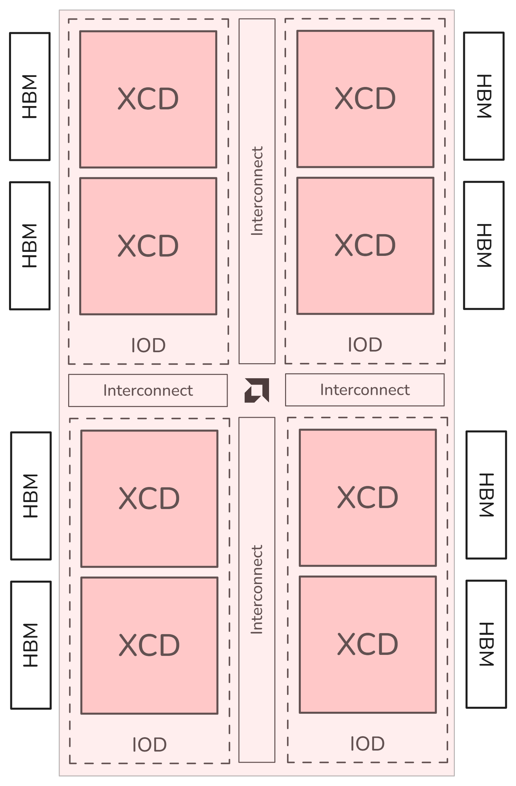        | 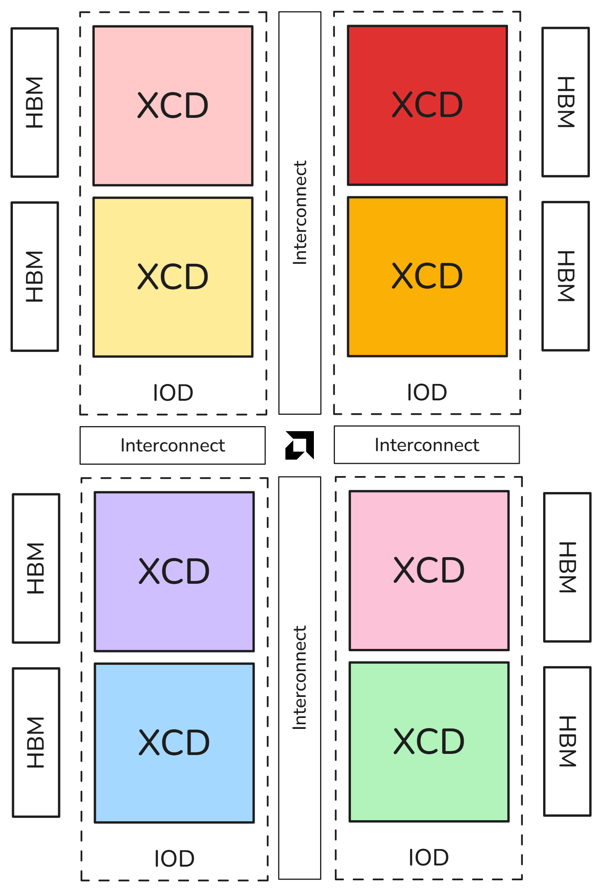         |
| ----------------------------------------- | ------------------------------------- |
| **SPX:** All XCDs appear as one logical device. | **CPX:** Each XCD appears as one logical device. |

## Memory Partitioning Modes

While compute partitioning modes change the space on which you can assign work
to compute units, the memory partitioning modes (known as Non-Uniform Memory
Access (NUMA) Per Socket (NPS)) change the number of NUMA domains that a device
exposes. In other words, it changes the number of HBM stacks which are
accessible to a compute unit, and thus the size of its memory space. However,
for MI300, there can only be up to as many memory partitions as we have compute
partitions, i.e., the number of memory partitions must be less than or equal to
the number of compute partitions. NPS4 (viewing pairs of HBM stack as a disparate
element), for example is only enabled when in CPX mode (viewing each XCD as a
disparate element).

- In NPS1 mode (compatible with CPX and SPX), the entire memory is
  accessible to all XCDs.
- In NPS4 mode (compatible with CPX), each quadrant of the memory is
  accessible to the XCDs in that quadrant.

| 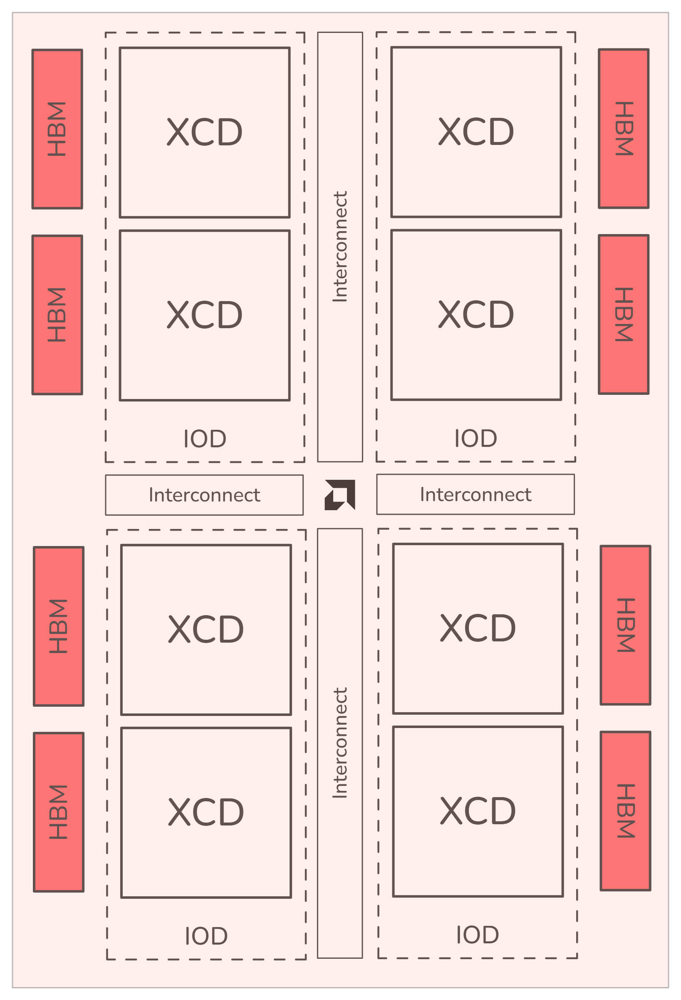 | 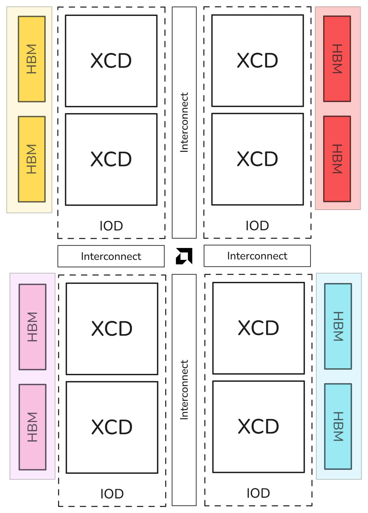 |
| ------------------------------ | ------------------------------ |
| **NPS1:** All HBM stacks appear as one partition. | **NPS4:** Pairs of HBM stacks appear as a partition. |

## Compute and Memory Partitioning Modes for MI300A

While the MI300X discrete GPU incorporates 8 identical XCDs, the MI300A APU
comprises of a mix of CPUs, GPUs and memory all on a single package.
Specifically, the MI300A has 3 "Zen4" x86-based CPU dies that are tightly
coupled with 6 XCDs and shares a single pool of memory in the form of 8 HBM
stacks as shown in the Figure below. Similar to MI300X, the MI300A also has
several compute and memory partitioning modes, but these are only applicable to
the XCDs in the system. The compute partition modes for MI300A are SPX (single
partition mode where all XCDs operate as a single compute entity), TPX (triple
partition mode where each partition consists of a pair of XCDs) and CPX-6 (core
partition mode where each XCD operates independently resulting in 6 individual
GPUs). The associated memory partition modes include NPS1 and NPS4, with
the constraint that there can be up to as many memory partitions as as there are
compute partitions.

| 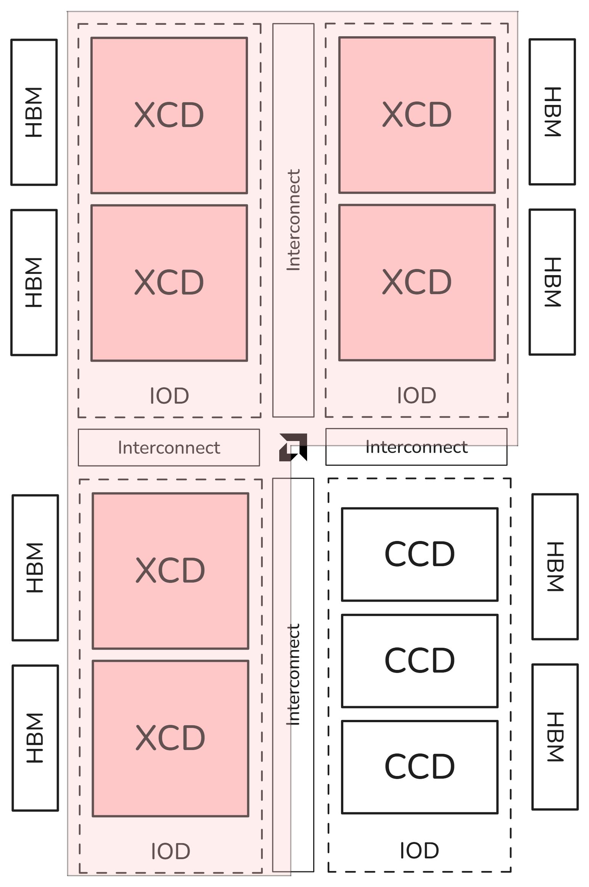 | 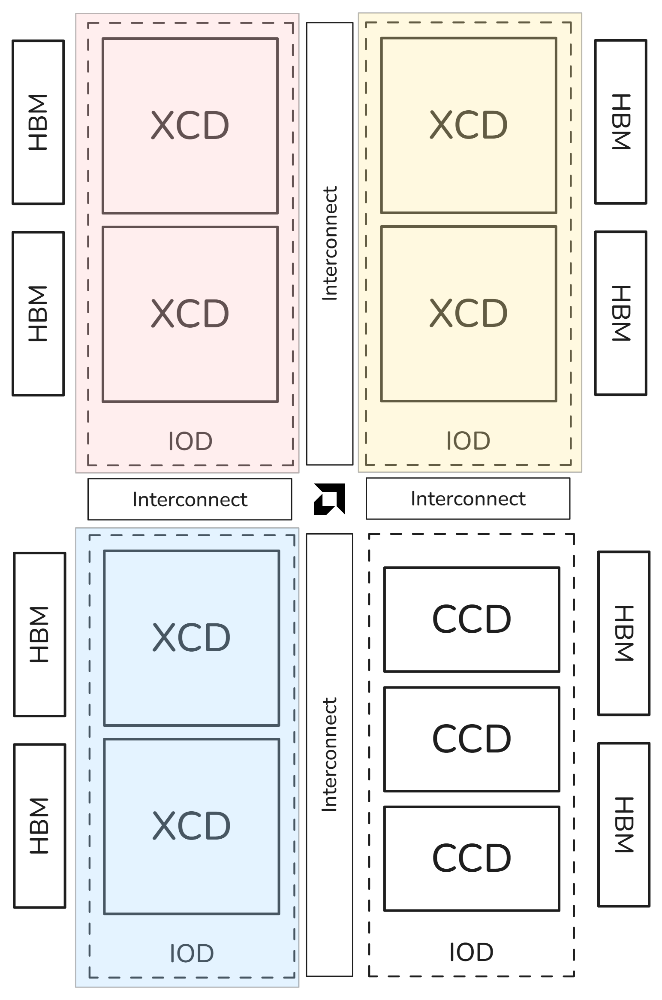 | 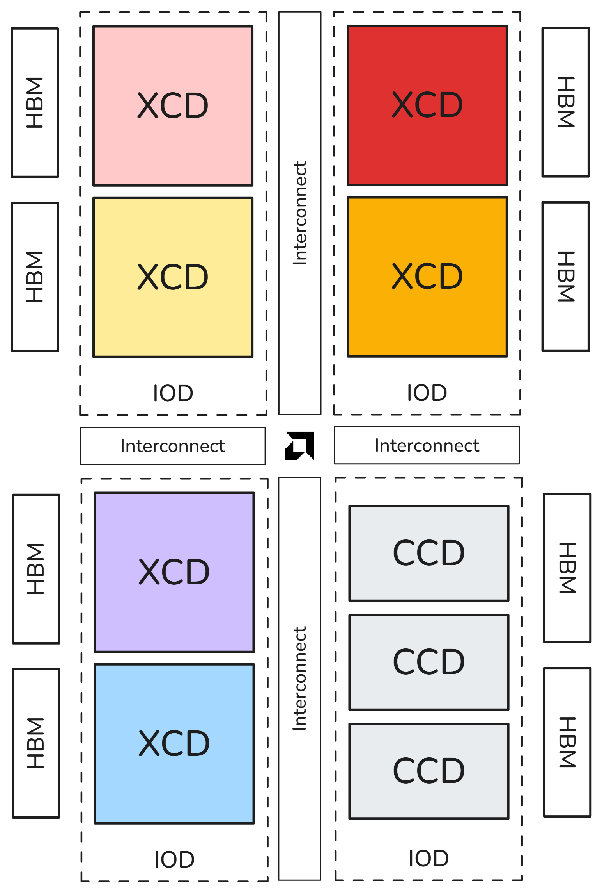 |
| ------------------------------ | ------------------------------ | ------------------------------- |
| **SPX:** All XCDs appear as one logical device. | **TPX:** Three logical partitions. | **CPX:** Each XCD appears as one logical device. |

## Compatibility Matrix

|      | SPX (MI300X/MI300A) | TPX (MI300A) | CPX (MI300X) / CPX-6 (MI300A) |
| ---- | :-----------------: | :----------: | :---------------------------: |
| NPS1 |          ✔         |      ✔       |               ✔               |
| NPS4 |                     |      ✔       |               ✔               |

## Working with Partitioned Devices

Using MI300X in CPX mode as an example, a system will now report `64` GPUs with
`amd-smi` starting from `0` to `63`. The following output also prints out the
physical Universally Unique Identifier (UUID) of the GPU, `gpu_uuid`, which is
same across all virtual partitions for a given physical GPU.

```console
amd-smi list --csv
gpu,gpu_bdf,gpu_uuid
0,0000:0c:00.0,c0ff74a1-0000-1000-80b1-06985c515c91
1,0000:0c:00.0,c0ff74a1-0000-1000-80b1-06985c515c91
2,0000:0c:00.0,c0ff74a1-0000-1000-80b1-06985c515c91
3,0000:0c:00.0,c0ff74a1-0000-1000-80b1-06985c515c91
4,0000:0c:00.0,c0ff74a1-0000-1000-80b1-06985c515c91
5,0000:0c:00.0,c0ff74a1-0000-1000-80b1-06985c515c91
6,0000:0c:00.0,c0ff74a1-0000-1000-80b1-06985c515c91
7,0000:0c:00.0,c0ff74a1-0000-1000-80b1-06985c515c91
...
56,0000:df:00.0,bbff74a1-0000-1000-80b0-9363b4d6f06e
57,0000:df:00.0,bbff74a1-0000-1000-80b0-9363b4d6f06e
58,0000:df:00.0,bbff74a1-0000-1000-80b0-9363b4d6f06e
59,0000:df:00.0,bbff74a1-0000-1000-80b0-9363b4d6f06e
60,0000:df:00.0,bbff74a1-0000-1000-80b0-9363b4d6f06e
61,0000:df:00.0,bbff74a1-0000-1000-80b0-9363b4d6f06e
62,0000:df:00.0,bbff74a1-0000-1000-80b0-9363b4d6f06e
63,0000:df:00.0,bbff74a1-0000-1000-80b0-9363b4d6f06e
```

`amd-smi` also supports useful commands like `amd-smi static --partition`, which
for each GPU prints the memory and compute partition mode. For example,
the following MI300X system is in CPX, NPS1 partition for all GPUs.

```console
amd-smi static --partition
GPU: 0
    PARTITION:
        COMPUTE_PARTITION: CPX
        MEMORY_PARTITION: NPS1

GPU: 1
    PARTITION:
        COMPUTE_PARTITION: CPX
        MEMORY_PARTITION: NPS1

GPU: 2
    PARTITION:
        COMPUTE_PARTITION: CPX
        MEMORY_PARTITION: NPS1
...
```

To target specific logical devices, `HIP_VISIBLE_DEVICES` can be used, with IDs
now ranging from `0` to `63` instead of `0` to `7`:

```shell
export HIP_VISIBLE_DEVICES=9,10,11,63
```

## Performance Evaluation

For performance evaluation of partitioned memory and compute modes, we consider
two case studies:

1. A Parallel Stream Microbenchmark
2. A General Matrix Multiplication (GEMM) Benchmark

> ! **Important Note:** We implemented simple Stream and GEMM kernels using
> Triton, they are not intended to represent the peak performance achievable
> using MI300X. There might be more throughput/bandwidth left that is further
> extractable through performance engineering.

### Stream Microbenchmark

A streaming microbenchmark can be used to determine the maximum achievable
memory bandwidth of the NPS1 and NPS4 mode. For this simple experiment, we
provide a Triton `copy_kernel` below, which simply loads values from a
1-dimensional tensor `x_ptr`, and stores it in a 1-D tensor `y_ptr`. On a
MI300X, we first look at the performance (bandwidth) of this kernel in CPX/NPS4
mode.

In CPX/NPS4 compute/memory partitioning mode, the total data is split across 4
memory domains (2 HBM stacks per memory domain, one memory domain per IOD) and
there is no inter-IOD traffic, as each XCD is capable of reads only from its
local HBM stacks. This then result in more localized accesses to the memory. Due
to this improved localization of memory reads, we're able to achieve a higher
peak bandwidth. The total achieved bandwidth of an MI300X in CPX/NPS4 mode
performing reads across all 8 XCDs is approximately 4177 GB/s (sum of all
bandwidths in Figure 1a.), as opposed to 3630 in SPX/NPS1, we also note in
Figure 1b. that when one less XCD is used, specifically only one XCD of the two
per I/O die, the entire available bandwidth of the I/O die is available for that
one single XCD to take advantage of. We then observe that XCD #6 achieves over 1
TB/s bandwidth on its own, while the other XCDs which share bandwidth with the
other XCD on their IOD only achieve half of the bandwidth of XCD #6. We can
leverage this principle, for example, in latency or bandwidth bound applications
that are not as sensitive to a reduction in total compute and can efficiently map
to a single XCD with improved performance, as that single XCD can take full
advantage of the whole 1+ TB/s bandwidth.

```py
@triton.jit
def copy_kernel(
    x_ptr, y_ptr, n_elements, BLOCK_SIZE: tl.constexpr, dtype: tl.constexpr
):
    pid = tl.program_id(0)
    offsets = pid * BLOCK_SIZE + tl.arange(0, BLOCK_SIZE)
    mask = offsets < n_elements
    x = tl.load(x_ptr + offsets, mask=mask).to(dtype)
    tl.store(y_ptr + offsets, x, mask=mask)
```

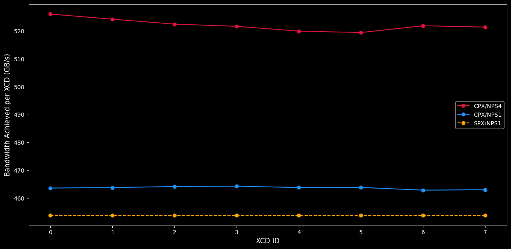

**Figure 1a.** Bandwidth of streaming benchmark running concurrently on all 8
XCDs of one physical GPU 0. CPX/NPS4 achieves higher bandwidth due to improved
localization of memory accesses to local HBM stacks.

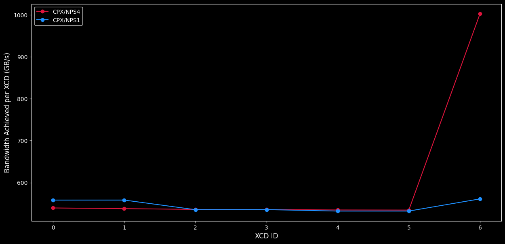

**Figure 1b.** Bandwidth of streaming benchmark running concurrently on 7 out of
8 XCDs of one physical GPU 0. XCD 6 is able to achieve superior bandwidth
because the other XCD on it's IOD is not streaming data, allowing it to utilize
the entire bandwidth.

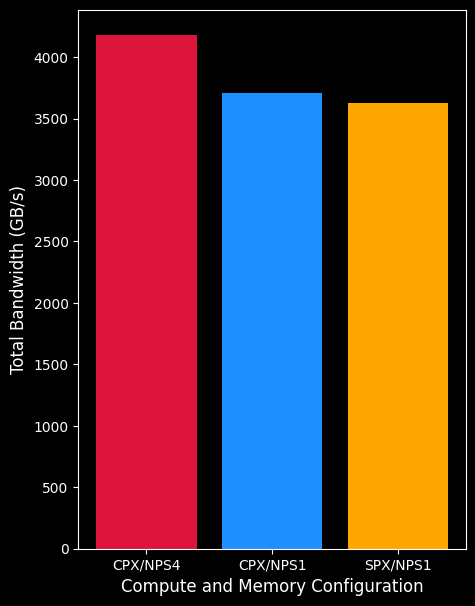

**Figure 2.** The total achieved bandwidth (across the entire system) for the
different modes. CPX/NPS4 is able to achieve significantly higher bandwidth due
to localization of accesses to main memory. CPX/NPS1 achieves higher memory
bandwidth than SPX/NPS1.

### General Matrix Multiplication (GEMM) Benchmark

This section will look at a more computation bound kernel: General Matrix Matrix
Multiply (GEMM), defined as $C = \alpha AB + \beta C$, where $\alpha$ and
$\beta$ are scalars, $A$, $B$ are input matrices, and $C$ is the output matrix.
For this particular GEMM, we choose a size in the compute bound region and range
the number of XCDs. For these plots, we present CPX/NPS4 and CPX/NPS1 results in
which we run progressively more XCD concurrently. Also included in the plots are
results from SPX/NPS1 baseline in which 8 XCDs are always run.

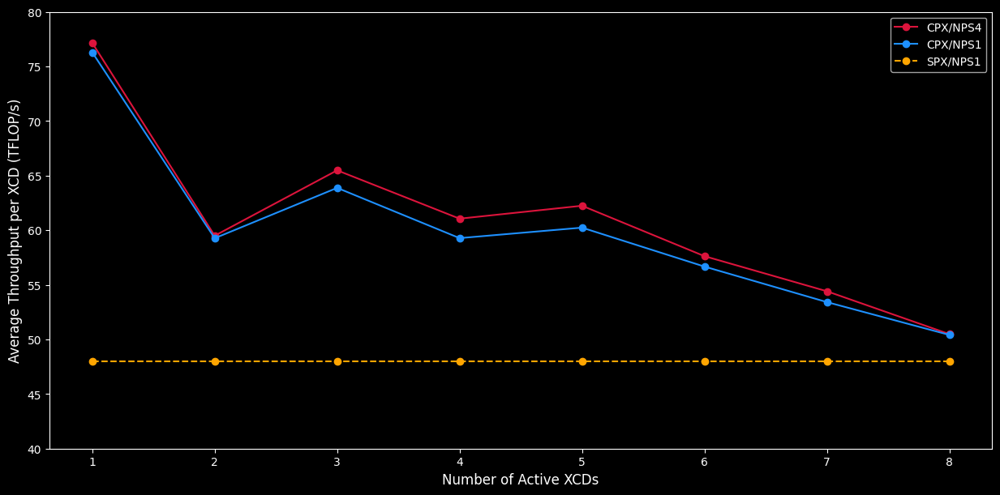

**Figure 3.** The plot shows the average throughput (TFLOPS) per XCD when each
XCD in CPX runs a separate GEMM operation, and a single MI300X runs a GEMM
operation in SPX. The Y-axis represents the average throughput per XCD, while
the X-axis indicates the number of concurrently running XCDs, from 1 to 8 (SPX
always runs all 8 XCDs). As more XCDs run concurrently, the throughput per XCD
decreases due to competition for shared resources like bandwidth (as discussed
earlier) and, importantly, power. CPX/NPS4 is able to achieve higher throughput
than both CPX/NPS1 and SPX/NPS1 due to its improved localized memory acceses,
allowing its clocks to run at higher rates. In this section, we'll delve deeper
into how power constraints affect this performance drop.

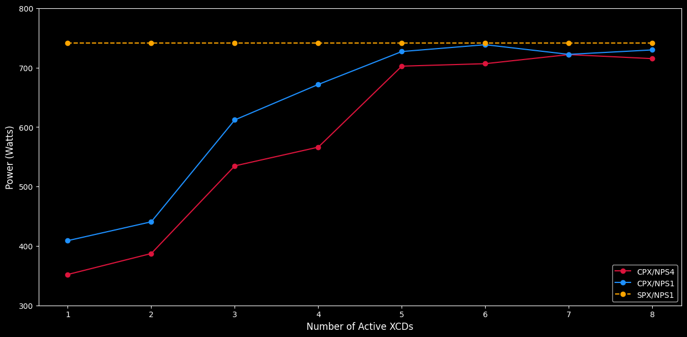

**Figure 4.** We show a plot of total socket power (y-axis) versus the number of
concurrently running XCDs (x-axis) on the MI300X. While performance increases
with more XCDs, the graph reveals nuances: a nonlinear pattern between odd and
even numbers of XCDs, and power saturation at 5 concurrent XCDs (explained
below). From comparing the three modes, we can see that CPX/NPS4 achieves power
saturation least quickly, due to the increase in localized accesses. CPX/NPS1
consumes more power than CPX/NPS4 but less than SPX/NPS1.

#### Diving Deeper

The nonlinear pattern is linked to the IOD (Input/Output Die). In NPS4 mode,
running one XCD activates one IOD and its two associated stacks, while inactive
parts consume minimal power (leakage). Adding a second XCD keeps the same IOD
active, increasing power by about 50W from 1 to 2 XCDs. However, moving from 2
to 3 XCDs activates another set of IOD/HBM stacks, causing a steeper power
increase than from 1 to 2 XCDs. This larger increase on odd numbers (up to 5,
where power reaches the device's TDP limit) occurs because we're turning on an
additional IOD/HBM/XCD simultaneously.

On the right side of the graph, power saturates at 5 XCDs due to the TDP limit,
introducing a trade-off between parallelism (number of active devices) and
frequency. In this "power-limited" scenario, the device employs Dynamic Voltage
Frequency Scaling (DVFS) to adjust frequency and stay within the TDP. Thus, when
moving from 5 to 6 XCDs, the frequency of either the compute or memory (they may
move independently) decreases to accommodate more parallelism without exceeding
power limits. Consequently, the total socket power remains stable at the TDP. To
fully understand the impact on the device, we need to examine the average
operating frequency during this workload.

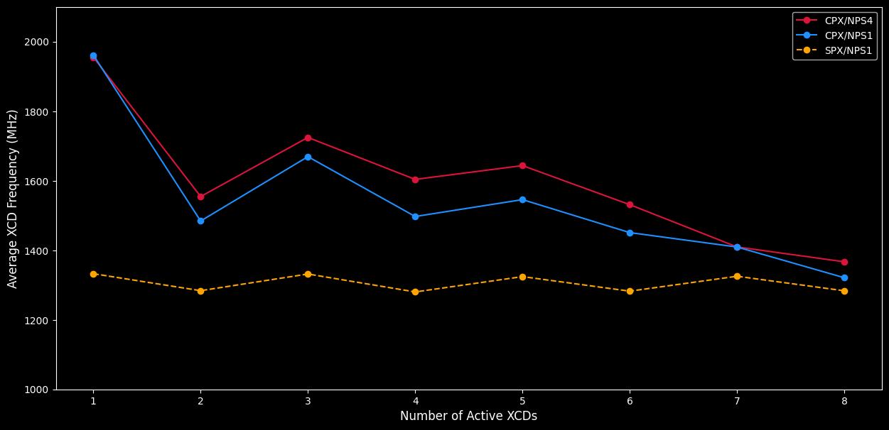

**Figure 5**. A plot of the average frequency (y-axis) of a device running the
same workload in CPX/NPS4 mode, plotted against the number of concurrently
running XCDs (x-axis). This plot mirrors the earlier "Performance per XCD" graph
because an XCD's performance is closely linked to its operating frequency.
CPX/NPS4 is able to run at a consistently higher compute clock speed than both
CPX/NPS1 and SPX/NPS1 due to power savings from increased localized accesses.
Both CPX/NPX4 and CPX/NPS1 are able to run at a faster compute clock than
SPX/NPS1 due to improved use of the caches in CPX mode.

**Non Power-Limited Scenario (Under 5 XCDs):** In this region, there's an
even/odd pattern in frequency drops. A steep decline occurs from 1 to 2 XCDs due
to power and frequency limits per IOD (Input/Output Die) and per device. With
one XCD, the IOD's power isn't fully utilized, allowing higher frequencies.
Adding a second XCD increases the load on the same IOD, causing a significant
frequency drop due to per-IOD constraints. Introducing a third XCD activates
another IOD with available power headroom, resulting in a smaller frequency
change. This pattern continues up to 5 XCDs.

**Power-Limited Scenario (5 XCDs and Above):** At 5 XCDs, the device reaches its
per-socket power limit, as previously discussed. Beyond this point, the socket's
power constraint becomes the dominant factor affecting frequency. The frequency
decrease becomes more linear rather than exhibiting the earlier even/odd
pattern. As more XCDs are added, the socket must allocate power more
conservatively among them. This necessitates lowering the operating frequency of
each XCD, which in turn decreases the performance per XCD.

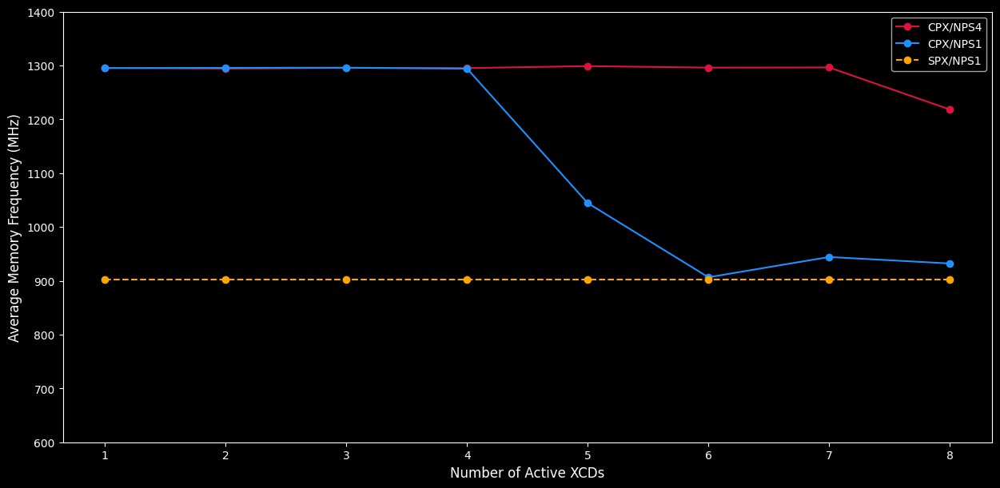

**Figure 6.** Here we plot the Average Memory Frequency, as measured using
`amd-smi`, vs the number of active XCDs. While the workload run is not "memory
bound", it is still important to evaluate this metric as it will determine the
effective bandwidth you are able to get on your device. The power is, of course,
shared between the XCD, the IOD, and the memory, so we can see that once we
reach the most power bound scenario in our experiment the device will also
throttle the frequency of the memory, effecting the bandwidth of the device.
CPX/NPS4 is able to consistently achieve a higher memory frequency than both
modes utilizing NPS1. NPS4 consumes less power, due to more localized memory
accesses, therefore it is able to maintain a less throttled frequency state.
Because the memory system it being less utilized than the compute, the DVFS
policy dynamically chooses to throttle the memory clock moreso than the compute
clock.

## Deployment Through Docker

Alternatively, docker supports attaching a device to the docker container, this
is typically done using the `--device=/dev/dri` command to allow the container
to see all GPUs in the system. However, since MI300 exposes each XCD as a
separate render device, the numbering differs slightly.
`ls /dev/dri | grep renderD` prints out all the render IDs, with each associated
to an individual XCD. In my example, the render IDs start from `renderD128` and
go all the way to `renderD191`. One way to utilize this information is by first
understanding physical GPU's first physical XCD begins at `D128`. Given this,
the next physical GPU will be a #XCD/device offset from the first, so in MI300X
the next physical GPU is `D128+8=136`, Device 2 would then be`D136+8=144` and so
on. All the IDs in between 128 and 136 are CPX partitions of a single MI300X.

**Example 1:** CPX 0 of physical GPU 0:

```shell
docker run -it --network=host --device=/dev/kfd \
  --device=/dev/dri/renderD128 \
  --group-add video --cap-add=SYS_PTRACE --security-opt seccomp=unconfined -v $HOME:$HOME -w $HOME rocm/pytorch
```

**Example 2:** All CPX devices of physical GPU 0 (MI300X):

```shell
docker run -it --network=host --device=/dev/kfd \
  --device=/dev/dri/renderD128 \
  --device=/dev/dri/renderD129 \
  --device=/dev/dri/renderD130 \
  --device=/dev/dri/renderD131 \
  --device=/dev/dri/renderD132 \
  --device=/dev/dri/renderD133 \
  --device=/dev/dri/renderD134 \
  --device=/dev/dri/renderD135 \
  --group-add video --cap-add=SYS_PTRACE --security-opt seccomp=unconfined -v $HOME:$HOME -w $HOME rocm/pytorch
```

**Example 3:** CPX 0 from each physical GPU (MI300X):

```shell
docker run -it --network=host --device=/dev/kfd \
  --device=/dev/dri/renderD128 \
  --device=/dev/dri/renderD136 \
  --device=/dev/dri/renderD144 \
  --device=/dev/dri/renderD152 \
  --device=/dev/dri/renderD160 \
  --device=/dev/dri/renderD168 \
  --device=/dev/dri/renderD176 \
  --device=/dev/dri/renderD184 \
  --group-add video --cap-add=SYS_PTRACE --security-opt seccomp=unconfined -v $HOME:$HOME -w $HOME rocm/pytorch
```

## Considerations on when to use what modes

| Single (Monolithic) Partition View                                                                          | Partitioned Memory and Compute View                                                                                    |
| ----------------------------------------------------------------------------------------------------------- | ---------------------------------------------------------------------------------------------------------------------- |
| Automatic placement of memory and compute; single-GPU programming over multiple memory and compute domains. | Gives the programmer more control over scheduling and memory placement.                                                |
| Coherent view of memory, no explicit communication required.                                                | Can achieve higher bandwidth and lower latency to memory, with additional small savings for kernel launch in CPX mode. |
| Simpler programming model and programmability.                                                              | Can save power, and achieve closer to peak efficiency of the device.                                                   |

## Summary

In this blog we explained how you can use [AMD Instinct MI300’s](https://www.amd.com/en/products/accelerators/instinct/mi300.html) compute and memory partitions to optimize your performance-critical applications. We introduced the MI300's architecture and detailed its different compute and memory partitioning modes. We then demonstrated how to evaluate the partitioned memory and compute modes in practice by benchmarking them in two case studies.

## Disclaimers

Third-party content is licensed to you directly by the third party that owns the content and is not licensed to you by AMD. ALL LINKED THIRD-PARTY CONTENT IS PROVIDED “AS IS” WITHOUT A WARRANTY OF ANY KIND. USE OF SUCH THIRD-PARTY CONTENT IS DONE AT YOUR SOLE DISCRETION AND UNDER NO CIRCUMSTANCES WILL AMD BE LIABLE TO YOU FOR ANY THIRD-PARTY CONTENT. YOU ASSUME ALL RISK AND ARE SOLELY RESPONSIBLE FOR ANY DAMAGES THAT MAY ARISE FROM YOUR USE OF THIRD-PARTY CONTENT.
