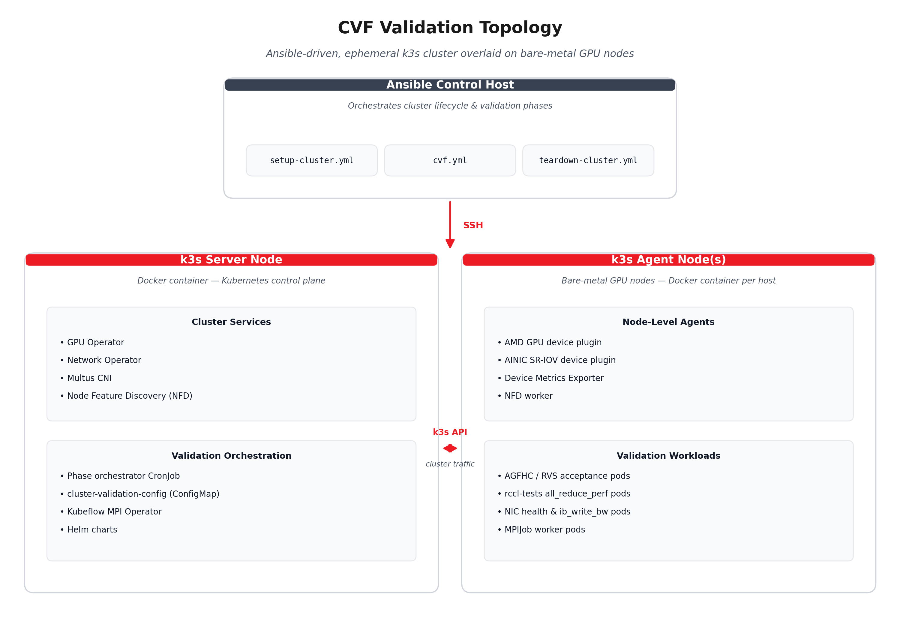

<!---
Copyright (c) 2026 Advanced Micro Devices, Inc. (AMD)

Permission is hereby granted, free of charge, to any person obtaining a copy
of this software and associated documentation files (the "Software"), to deal
in the Software without restriction, including without limitation the rights
to use, copy, modify, merge, publish, distribute, sublicense, and/or sell
copies of the Software, and to permit persons to whom the Software is
furnished to do so, subject to the following conditions:

The above copyright notice and this permission notice shall be included in all
copies or substantial portions of the Software.

THE SOFTWARE IS PROVIDED "AS IS", WITHOUT WARRANTY OF ANY KIND, EXPRESS OR
IMPLIED, INCLUDING BUT NOT LIMITED TO THE WARRANTIES OF MERCHANTABILITY,
FITNESS FOR A PARTICULAR PURPOSE AND NONINFRINGEMENT. IN NO EVENT SHALL THE
AUTHORS OR COPYRIGHT HOLDERS BE LIABLE FOR ANY CLAIM, DAMAGES OR OTHER
LIABILITY, WHETHER IN AN ACTION OF CONTRACT, TORT OR OTHERWISE, ARISING FROM,
OUT OF OR IN CONNECTION WITH THE SOFTWARE OR THE USE OR OTHER DEALINGS IN THE
SOFTWARE.
--->

# Closing the GPU Cluster Validation Gap: A Kubernetes-Native Approach with CVF

As GPU clusters scale from dozens to thousands of accelerators, the assumption that every node is healthy at boot time becomes increasingly risky. Silent hardware degradation — a marginal XGMI link, a missing SR-IOV Virtual Function, or an under-performing RDMA rail — can turn a single node into a straggler that slows an entire distributed training job.

This blog introduces the Cluster Validation Framework (CVF), part of the AMD GPU Operator ecosystem, and explains how it provides a Kubernetes-native pipeline for validating AMD GPU clusters before nodes enter production. CVF combines node eligibility, GPU hardware acceptance, intra-node mesh bandwidth checks, NIC health validation, per-rail RDMA testing, and multi-node RCCL scale-out verification inside an ephemeral k3s cluster, keeping destructive validation workloads separate from the production control plane.

## Executive Takeaways

- CVF validates the full stack before production scheduling: GPU silicon, XGMI mesh, AINIC firmware and VFs, RDMA networking, and RCCL collectives.
- The pipeline runs in an ephemeral k3s cluster, keeping destructive validation workloads separate from the production control plane.
- Each phase writes Kubernetes node labels that gate later phases, support fleet dashboards, and inform production scheduling policies.
- ConfigMap-driven thresholds and phase controls make the workflow practical for both single-node bring-up and fleet-scale acceptance.

## The Reliability Problem Nobody Planned for

Training a 405-billion-parameter model on 16,384 GPUs, Meta recorded 419 unexpected interruptions over 54 days during the Llama 3 training campaign—about one failure every three hours. GPU and HBM3 memory faults caused over 47% of these interruptions. A year earlier, their OPT-175B run on 992 A100s logged over 100 host replacements in 60 days, with the longest stable period lasting just 2.8 days.

These issues are not unique to Meta. As GPU clusters exceed a few hundred accelerators, silent hardware degradation—marginal XGMI links, flaky PCIe lanes, NIC firmware mismatches, asymmetric RDMA throughput—becomes the main operational risk. A single slow node in a data-parallel training job forces all other nodes to wait at the collective barrier, turning a 0.1% hardware problem into a 10%+ throughput loss.

The industry has developed per-node diagnostic tools and runtime straggler detection systems, but these share a key limitation: they either operate at the single-node level without coordinating a multi-node pipeline or detect problems reactively—after workloads are running and affected.

What's missing is a unified, Kubernetes-native validation pipeline that tests the full stack—from GPU silicon health through intra-node mesh bandwidth to multi-node RDMA fabric performance—before a node joins a production workload. The Cluster Validation Framework (CVF), part of the AMD GPU Operator ecosystem, addresses this gap.

## Architectural Overview

CVF implements a six-phase validation pipeline, Phase 0 through Phase 5, inside a containerized k3s cluster deployed onto bare-metal GPU nodes. The validation infrastructure is deliberately self-contained and does not require access to a production Kubernetes control plane.

The high-level validation topology is shown below.



Each bare-metal node runs a Docker container that hosts a k3s instance. The server container bootstraps the Kubernetes control plane, and agent containers join it. Into this ephemeral cluster, Ansible installs the AMD GPU Operator for driver lifecycle, device plugin, and metrics exporter support. It can also install the AMD Network Operator for AINIC driver lifecycle and SR-IOV device plugin support. The validation phases then execute as Kubernetes Jobs and MPIJobs against this infrastructure.

> **Architectural insight:** By running validation inside a purpose-built k3s cluster rather than against the production control plane, CVF can exercise destructive test patterns — GPU stress tests, XGMI link hammering, and HBM error injection — without risking production workload disruption.

## The Six Phases in Detail

| Phase | Purpose | Primary output |
|-------|---------|----------------|
| **Phase 0** | Select eligible GPU and NIC nodes using NFD labels. | Hardware-derived input gates. |
| **Phase 1** | Run GPU hardware acceptance recipes. | `amd.com/gpu-hw-acceptance` |
| **Phase 2** | Measure intra-node GPU mesh bandwidth. | `amd.com/gpu-mesh-validation` |
| **Phase 3** | Validate NIC health, firmware baseline, RDMA readiness, and device count. | `amd.com/nic-health` |
| **Phase 4** | Measure per-rail RDMA bandwidth between nodes. | `amd.com/rail-bandwidth` |
| **Phase 5** | Run multi-node RCCL scale-out validation. | `amd.com/cluster-validation-status` |

### Phase 0 — Node Selection

Before any test runs, Phase 0 identifies eligible nodes using NFD-managed labels. By default, nodes carrying `feature.node.kubernetes.io/amd-gpu=true` enter the GPU validation pipeline. Nodes with `feature.node.kubernetes.io/amd-nic=true` additionally enter the NIC and fabric phases. This ties eligibility directly to hardware discovery: NFD detects the GPU or NIC and applies the label automatically.

```yaml
# configs/config.json — node targeting
"node-selector-labels": "feature.node.kubernetes.io/amd-gpu=true"
```

Because these are standard NFD labels, operators who need to exclude a node despite detected hardware can remove the label manually or use an admission webhook to override NFD. By default, hardware presence drives eligibility with no extra labeling step.

### Phase 1 — GPU Hardware Acceptance

Phase 1 deploys AMD GPU Field Health Check (AGFHC) containers as Kubernetes Jobs on each eligible node. This phase is configurable: it is skipped by default and can be enabled when the operator is ready to run hardware acceptance. Once enabled, AGFHC executes three recipe categories in sequence.

| Recipe | What it tests | Typical duration |
|--------|---------------|------------------|
| `xgmi-lvl1` | XGMI inter-die link integrity, CRC error counters, and link retraining events | ~5.5 min |
| `pcie-lvl1` | PCIe Gen5 x16 link width/speed, replay counters, and correctable error rates | ~6 min |
| `hbm-lvl1` | HBM3 stress patterns, including walking-1 and moving-inversion, plus ECC error detection | ~5 min |

Each recipe runs as a separate Job with its own timeout:

```json
{
  "timeouts": {
    "phase1-stages-secs": {
      "phase1-xgmi-lvl1": 1200,
      "phase1-pcie-lvl1": 1200,
      "phase1-hbm-lvl1": 1200,
      "phase1-gpu-stress": 3600
    }
  }
}
```

AGFHC differs from the open-source ROCm Validation Suite (RVS) in scope. RVS provides module-level GPU diagnostics — GEMM stress, P2P bandwidth probing, and BabelStream memory bandwidth — and is useful for development-time validation. AGFHC wraps these checks into fleet-oriented recipes that produce structured PASS/FAIL results with error codes suitable for automated triage. Both can be used in Phase 1; AGFHC is the recommended path for production acceptance.

The result of Phase 1 is a node label:

```text
amd.com/gpu-hw-acceptance: passed   # or failed
```

A node that fails any recipe is labeled accordingly and excluded from subsequent phases. This creates a hard gate: no node with degraded silicon reaches the mesh or fabric tests.

### Phase 2 — Intra-node GPU Mesh Bandwidth

Phase 2 launches an `all_reduce_perf` workload from `rccl-tests` across all GPUs within a single node. This compiled C++/HIP binary exercises the full XGMI mesh by running RCCL AllReduce collectives with increasing message sizes.

The test measures aggregate bus bandwidth across the intra-node GPU mesh and compares it against a configurable threshold:

```yaml
# cluster-validation-config.yaml
PHASE2_BW_THRESHOLD: "100"  # GB/s
```

On an 8-GPU MI300X node with SPX partition mode, a healthy XGMI mesh typically delivers ~250–300 GB/s on the AllReduce benchmark. The 100 GB/s default threshold provides margin for partition mode variations, since DPX and QPX configurations show different effective bandwidth.

> ⚠️ **Why this matters:** A single degraded XGMI link between two GCDs in an MI300X can reduce intra-node AllReduce bandwidth by 15–30%, making the node a straggler in any data-parallel training job. Phase 2 catches this before the node enters the collective.

Result label:

```text
amd.com/gpu-mesh-validation: passed   # or failed, with measured BW
```

### Phase 3 — NIC Health

Phase 3 validates the RDMA network fabric at the device level. For each AMD Pensando Pollara 400G AINIC on the node, it checks:

- **PCI link:** Gen5 x16 active, with no width degradation.
- **Firmware version:** matches the expected baseline.
- **RDMA capability:** `ibv_devinfo` confirms RoCEv2 support and the correct GID table.
- **Link state:** physical link is up and the correct speed is negotiated.

```yaml
# cluster-validation-config.yaml
PHASE3_EXPECTED_NIC_COUNT: "8"     # expected AINICs per node
```

Firmware version is validated against the version embedded in the workload image tag, so there is no separate firmware configuration key. The expected baseline is pinned at image build time.

The NIC count check is an often-overlooked but critical validation. SR-IOV configurations can silently lose Virtual Functions if a PF reset occurs during boot, and a node that reports `amd.com/vnic: 7` instead of `8` can cause an MPIJob to hang while waiting for resource allocation. Phase 3 catches this class of misconfiguration.

### Phase 4 — Per-rail RDMA Bandwidth

Phase 4 measures point-to-point RDMA bandwidth on each AINIC rail pair between nodes. In a rail-optimized network topology, each GPU is wired to a dedicated NIC, and each NIC connects to a dedicated leaf switch. Phase 4 verifies that every rail delivers the expected throughput:

```yaml
# cluster-validation-config.yaml
PHASE4_RAIL_COUNT: "8"              # number of parallel rails
PHASE4_BW_THRESHOLD: "380"          # Gbps per rail pair
```

The test uses `ib_write_bw` or an equivalent RDMA verbs workload to measure unidirectional bandwidth per rail. A Multus CNI `NetworkAttachmentDefinition` maps each test pod to its corresponding AINIC VF:

```yaml
# configs/nad-per-rail.yaml — one NAD per rail
apiVersion: k8s.cni.cncf.io/v1
kind: NetworkAttachmentDefinition
metadata:
  name: amd-host-device-nad-rail-0
spec:
  config: |
    {
      "cniVersion": "0.3.1",
      "type": "host-device",
      "device": "enp68s0v0"
    }
```

The NAD uses the `host-device` CNI plugin to attach the AINIC VF directly to the test pod's network namespace. Each rail gets its own NAD pointing to the corresponding VF device, ensuring traffic isolation during bandwidth measurement.

### Phase 5 — Multi-node RCCL Scale-out

Phase 5 is the full-stack validation: a multi-node RCCL AllReduce and AllGather test that exercises GPUs, the XGMI mesh, NIC fabric, and the RDMA transport simultaneously. It deploys as a Kubernetes MPIJob through the Kubeflow MPI Operator:

```text
MPIJob
├── Launcher Pod (1 replica)
│   ├── init: wait-for-worker-pods
│   └── container: mpirun rccl-launcher
└── Worker Pods (N replicas)
    ├── annotations: k8s.v1.cni.cncf.io/networks (Multus)
    ├── resources: amd.com/gpu: 8, amd.com/vnic: 8
    └── container: rccl-worker
```

The launcher pod waits for all worker pods to reach Ready state, then executes:

```bash
mpirun --allow-run-as-root \
  -np $((WORKERS * GPUS_PER_WORKER)) \
  --hostfile /etc/mpi/hostfile \
  --mca btl_tcp_if_include eth0 \
  -x NCCL_IB_GID_INDEX=1 \
  -x NCCL_NET_PLUGIN=none \
  all_reduce_perf -b 1K -e 2G -f 2 -g 1
```

Key environment variables control the RDMA transport:

| Variable | Purpose |
|----------|---------|
| `NCCL_IB_GID_INDEX` | RoCE GID index: `1` for IPv4-routable, `0` for link-local |
| `NCCL_IB_HCA` | NIC selection filter, for example `ionic_0,ionic_1,...` or `^` to auto-select |
| `NCCL_NET_PLUGIN` | RCCL network plugin; `none` uses the built-in IB verbs transport |

The test sweeps message sizes from 1 KB to 2 GB, doubling at each step, and reports aggregate bus bandwidth.

> ✅ **Phase 5 success criteria:** A passing result means GPUs, the XGMI mesh, NIC firmware, SR-IOV VFs, RDMA transport, IP addressing, and MPI coordination are functioning correctly end to end. It is the most comprehensive — and most fragile — validation in the pipeline.

## ConfigMap-driven Orchestration

The entire validation pipeline is parameterized through a Kubernetes ConfigMap, `cluster-validation-config`, that the orchestrator CronJob reads at each phase transition. This design enables runtime tuning without redeploying the cluster:

```bash
# Skip phases for partial validation
kubectl patch configmap cluster-validation-config \
  -p '{"data":{"SKIP_GPU_HW_ACCEPTANCE":"true"}}'

# Adjust bandwidth thresholds
kubectl patch configmap cluster-validation-config \
  -p '{"data":{"PHASE2_BW_THRESHOLD":"90"}}'

# Change GPU count for partition mode testing
kubectl patch configmap cluster-validation-config \
  -p '{"data":{"GPU_PER_WORKER":"4"}}'
```

This operational flexibility matters during fleet deployment. An operator validating 200 nodes can set aggressive thresholds during initial acceptance, relax them during burn-in, and restore production thresholds for final sign-off — all without rebuilding images or restarting the cluster.

## Node Labeling Lifecycle

CVF uses Kubernetes node labels as its persistence and coordination layer. Each phase writes its result as a label on the validated node:

```text
Phase 0:  feature.node.kubernetes.io/amd-gpu=true   (input gate, NFD-managed)
Phase 1:  amd.com/gpu-hw-acceptance=passed
Phase 2:  amd.com/gpu-mesh-validation=passed
Phase 3:  amd.com/nic-health=passed
Phase 4:  amd.com/rail-bandwidth=passed
Phase 5:  amd.com/cluster-validation-status=passed
```

These labels serve three purposes:

- **Phase gating:** a node that fails Phase 1 is excluded from Phases 2–5.
- **Workload scheduling:** production schedulers can require `amd.com/cluster-validation-status=passed` as a node affinity constraint, ensuring only fully validated nodes receive training jobs.
- **Fleet dashboards:** `kubectl get nodes -L amd.com/gpu-hw-acceptance,amd.com/gpu-mesh-validation` provides an at-a-glance fleet health view.

```bash
$ kubectl get nodes -L amd.com/gpu-hw-acceptance,amd.com/gpu-mesh-validation
NAME     STATUS   GPU-HW-ACCEPTANCE   GPU-MESH-VALIDATION
node-01  Ready    passed              passed
node-02  Ready    passed              passed
node-03  Ready    failed              —
node-04  Ready    passed              passed
```

Node-03 failed Phase 1 hardware acceptance and never entered mesh testing. An operator can query the failure details, remediate the hardware, clear the label, and re-trigger validation — all through standard Kubernetes primitives.

## The Gap CVF Closes

The industry landscape for GPU cluster validation is fragmented:

- **Per-node diagnostics exist but do not compose.** NVIDIA DCGM runs Level 3 diagnostics — memory bandwidth, PCIe throughput, NVLink, and thermal checks — for 12 minutes per node, but it explicitly does not support multi-node NCCL testing. RVS provides module-level GPU stress tests. Neither tool orchestrates a complete pipeline or writes results into a scheduling-aware label.

- **Straggler detection is reactive.** Amazon Guard, Google Cluster Director, and Meta Hardware Sentinel detect stragglers after they affect training jobs. Guard improves FLOPs utilization by up to 1.7x by detecting and mitigating stragglers mid-flight. Falcon reduces training slowdown by 61.5% through non-intrusive profiling. These systems are valuable, but they operate on already-running workloads.

- **Fleet-scale acceptance testing is ad hoc.** Together AI published a practitioner's guide describing hierarchical acceptance testing — basic functionality, integration, then performance — but its tooling is internal. Microsoft's OCP-based CTAM/CPACT framework standardizes compliance testing across vendors and reduces onboarding effort by more than 70%, but it focuses on manageability interfaces rather than workload-level validation.

CVF occupies the gap between per-node diagnostics and production monitoring: proactive, workload-representative validation that runs before a node enters the production pool. Its Kubernetes-native design — Jobs, ConfigMaps, node labels, and Multus NADs — integrates with existing fleet management tooling instead of requiring a separate orchestration layer.

## Deployment Model

CVF deploys as a containerized k3s cluster overlaid onto bare-metal nodes. The Dockerfile pre-packages:

- **k3s v1.35.0:** lightweight Kubernetes
- **Multus CNI v4.2.2:** multi-NIC support for RDMA rails
- **NFD v0.18.3:** GPU and NIC feature detection
- **Helm:** operator chart installation

A typical multi-node validation workflow is:

```bash
# 1. Configure target nodes and operator versions
vim ansible/inventory.yml
vim configs/config.json

# 2. Deploy the ephemeral validation cluster
cd ansible
ansible-playbook playbooks/setup-cluster.yml

# 3. Run validation (all phases, or selective)
ansible-playbook playbooks/cvf.yml

# 4. Check results
./gpu-cluster.sh node-status

# 5. Teardown — leave bare metal clean for production
ansible-playbook playbooks/teardown-cluster.yml
```

The cluster is designed to be ephemeral. After validation completes and results are extracted, the entire k3s infrastructure tears down cleanly, leaving the bare-metal nodes ready for their production Kubernetes deployment, such as RKE2, OpenShift, Anthos, or another platform.

For air-gapped environments — common in enterprise GPU deployments — CVF includes an in-cluster registry option on NodePort `32321`, eliminating external image pull dependencies during validation.

## Compute Partition Testing

MI300X supports multiple compute partition modes — SPX, DPX, QPX, and CPX — each paired with a memory partition mode such as NPS1, NPS2, or NPS4. Different partitioning configurations expose different effective GPU counts and bandwidth profiles.

CVF integrates with GPU partition management through a dedicated Ansible playbook:

```bash
# Set all GPUs to DPX/NPS2 mode before validation
ansible-playbook playbooks/set-gpu-compute-mode.yml \
  -e compute_mode=DPX -e memory_mode=NPS2
```

This enables operators to validate that a fleet performs correctly under the partition mode planned for production workloads — a step that is easy to skip during initial bring-up but expensive to discover during training.

## What Changes at Scale

At small cluster sizes, typically 2–8 nodes, CVF behaves like a sequential acceptance checklist. At fleet scale, typically 100+ nodes, three properties become critical:

- **Parallelism:** Phases 1–3 run independently on each node. A 200-node validation completes Phases 1–3 in the same wall-clock time as a 2-node validation, bounded only by the longest-running node.
- **Selective re-validation:** when a node fails and is remediated, only that node needs to re-run the failed phase. The ConfigMap-driven orchestrator and label-based gating enable targeted re-runs without cluster-wide resets.
- **Threshold tuning:** fleet-scale deployment typically reveals a bandwidth distribution across nodes. Configurable thresholds allow operators to set acceptance criteria based on observed fleet statistics rather than absolute numbers, adapting to real-world silicon variation.

## Getting Started

The CVF code is available in the AMD GPU Operator repository. The minimum hardware requirement is a single node with an AMD Instinct GPU and the `amdgpu` kernel module loaded. Phases 3–5 additionally require AMD Pensando AINICs with SR-IOV enabled.

```bash
git clone https://github.com/ROCm/gpu-operator.git
cd gpu-operator/example/gpu-validation-cluster

# Single-node quick start
./gpu-cluster.sh build
./gpu-cluster.sh run server
./gpu-cluster.sh status
```

For multi-node deployments, configure `ansible/inventory.yml` and `configs/config.json`, then use the Ansible playbooks for automated cluster lifecycle management.

## Summary

GPU cluster reliability cannot be solved with single-node diagnostics alone. A node can pass local checks and still become the weakest link in a large-scale collective if its XGMI mesh is slower than its peers or one RDMA rail is under-performing. In this blog, you explored how CVF addresses this by treating validation as a gated pipeline: each phase depends on the previous result, outcomes are written into Kubernetes-native node labels, and the workflow culminates in a multi-node RCCL test that exercises the full stack end to end. Because CVF runs in an ephemeral k3s cluster and is driven by ConfigMaps and Ansible playbooks, it fits into existing fleet bring-up workflows while giving operators a repeatable way to ensure every node earns its place in the production pool before it receives real training workloads. Keep an eye on the ROCm Blogs for more hands-on guides and deep dives on running validated AMD GPU clusters in production.

## Disclaimers

The information presented in this document is for informational purposes only and may contain technical inaccuracies, omissions, and typographical errors. The information contained herein is subject to change and may be rendered inaccurate for many reasons, including but not limited to product and roadmap changes, component and motherboard version changes, new model and/or product releases, product differences between differing manufacturers, software changes, BIOS flashes, firmware upgrades, or the like. Any computer system has risks of security vulnerabilities that cannot be completely prevented or mitigated. AMD assumes no obligation to update or otherwise correct or revise this information.

However, AMD reserves the right to revise this information and to make changes from time to time to the content hereof without obligation of AMD to notify any person of such revisions or changes.
THIS INFORMATION IS PROVIDED ‘AS IS.” AMD MAKES NO REPRESENTATIONS OR WARRANTIES WITH RESPECT TO THE CONTENTS HEREOF AND ASSUMES NO RESPONSIBILITY FOR ANY INACCURACIES, ERRORS, OR OMISSIONS THAT MAY APPEAR IN THIS INFORMATION. AMD SPECIFICALLY DISCLAIMS ANY IMPLIED WARRANTIES OF NON-INFRINGEMENT, MERCHANTABILITY, OR FITNESS FOR ANY PARTICULAR PURPOSE. IN NO EVENT WILL AMD BE LIABLE TO ANY PERSON FOR ANY RELIANCE, DIRECT, INDIRECT, SPECIAL, OR OTHER CONSEQUENTIAL DAMAGES ARISING FROM THE USE OF ANY INFORMATION CONTAINED HEREIN, EVEN IF AMD IS EXPRESSLY ADVISED OF THE POSSIBILITY OF SUCH DAMAGES.
AMD, the AMD Arrow logo, and combinations thereof are trademarks of Advanced Micro Devices, Inc. Other product names used in this publication are for identification purposes only and may be trademarks of their respective companies. © Advanced Micro Devices, Inc. All rights reserved
