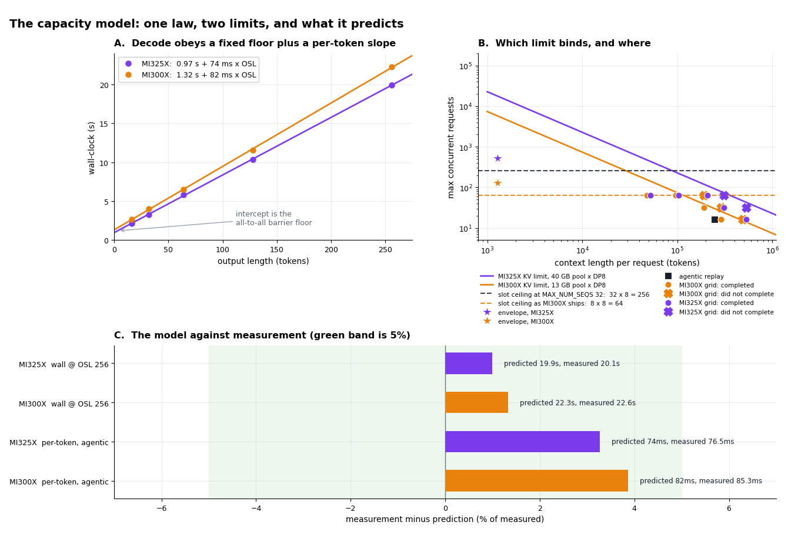
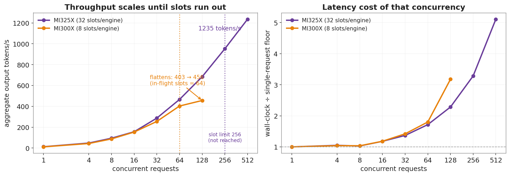
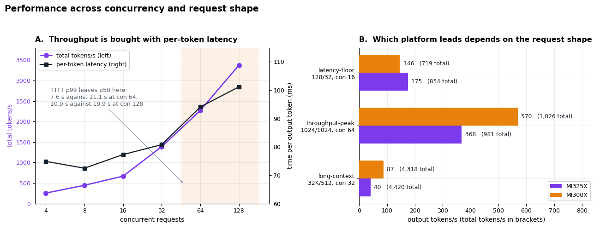
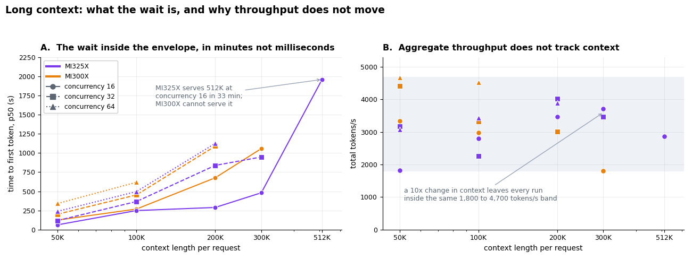
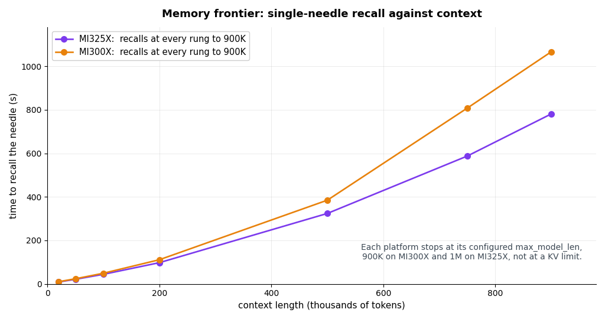
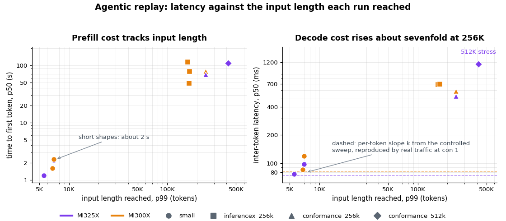

# DI Series: Serving Kimi-K3 MXFP4 Wide-EP Disaggregated on AMD Instinct MI300X and MI325X

*This post is part of the AMD Disaggregated Inference (DI) Blogs Series, which takes frontier open models
from a single-node demo to production, multi-node serving on AMD Instinct™ GPUs*

Kimi-K3 in MXFP4 (Microscaling FP4) occupies **1453.7 GiB** of weights, while an eight-GPU AMD Instinct™
MI300X node provides approximately **1504 GiB** of usable high-bandwidth memory. A single resident weight
replica therefore leaves roughly 50 GiB across the entire node (for the key-value (KV) cache, the
activations, and the communication heap combined). That margin is insufficient in practice: a conventional
single-node deployment cannot allocate a KV pool large enough to generate tokens at useful sequence
lengths.

This is the first of three constraints. MXFP4, the quantization format that makes a 2.8-trillion-parameter
Mixture-of-Experts (MoE) model tractable, has no native matrix-multiply instruction on the CDNA 3 (gfx942)
architecture common to MI300X and MI325X. A serving stack pointed at the checkpoint does not fail, but it
cannot use the format directly either, so the experts have to be requantized into a format the matrix
engine accelerates, and that choice decides whether the memory saving survives. The third constraint is
architectural: Kimi-K3 is a hybrid in which only 24 of its 93 layers use Multi-head Latent Attention
(MLA), and the remaining 69 use gated-delta recurrent Kimi Delta Attention (KDA). The prefill-to-decode
handoff must therefore transport a recurrent state alongside the KV cache, over a path that a
pure-attention model never exercises, and that path was found to contain two correctness defects.

A single deployment shape resolves all three constraints. Prefill and decode execute on separate GPU
pools, the 896 routed experts are sharded sixteen ways, the attention stack that cannot be expert-sharded
is split two ways and replicated eight ways, and the AMD **MoRI** stack provides both the expert
all-to-all and the remote direct memory access (RDMA) cache transfer within vLLM. This post establishes
why that shape follows from the memory arithmetic and not from preference, identifies the kernel
substitution that makes an MXFP4 checkpoint execute efficiently on gfx942, and documents how the two
concurrency defects were diagnosed and corrected before any performance measurement was accepted. It then
characterizes the deployment: recall accuracy at long context, a concurrency envelope on both platforms,
replay of recorded agentic traces with **AgentX**, and a capacity model that converts a service-level
agreement (SLA) into a node count, a context ceiling, and a concurrency limit before hardware commitment.

**About this series.** This post is the second in the AMD Disaggregated Inference (DI) Blog Series, which
takes open frontier models from a single-node demo to multi-node serving on AMD Instinct™ GPUs. The first
post, [Scaling GLM-5.1-FP8 to 64 MI300X
GPUs](https://rocm.blogs.amd.com/software-tools-optimization/di-glm-wideep/README.html), covers the same
disaggregated wide expert-parallel approach on a different model. Each post in the series follows one
model from the memory arithmetic that decides its deployment shape through to measured serving behavior,
and more are to follow.

**In this post you will learn** how to serve a 1.4 TiB MXFP4 mixture-of-experts checkpoint across two
prefill and two decode nodes. Specifically, you will see:

- Why the memory budget forces that deployment shape, rather than leaving it to preference.
- Which kernel substitution makes MXFP4 run efficiently on an architecture with no native MXFP4
  instruction.
- How two concurrency-correctness defects were found and fixed before any performance number was
  accepted.
- How to turn a service-level agreement into a node count, a context ceiling, and a concurrency limit,
  using a capacity model you can compute before committing hardware.

## At a Glance

The following points summarize the main results in this post:

- **Enabled:** Kimi-K3 MXFP4 served as **2P2D disaggregated, wide expert-parallel (EP16)** in vLLM on both
  MI300X (192 GB, ConnectX-7) and MI325X (256 GB, Broadcom Thor2 RoCE).

- **Two correctness defects found and fixed:** a MoRIIO RDMA KV write-race and a KDA recurrent-state
  recycle bug. After both fixes, distinct-needle recall under concurrency is **57 of 57 on both
  platforms**.

- **The MXFP4-on-gfx942 wall is solved** via an int4-SiTU (SiTUv2 a8w4) MoE path, because the native MXFP4
  kernel does not exist on this architecture.

- **A decode-side capacity model, validated:** per-token decode speed is *comparable* across the two
  platforms, at 74 against 82 ms/token, so compute is not what separates them. Capacity is, and it is
  worth being precise about which capacity: MI325X rides the concurrency floor to **concurrency 512 (1235
  tokens/s)** while MI300X plateaus at **concurrency 64**. That plateau is the **in-flight sequence-slot
  count**, `MAX_NUM_SEQS` times the eight data-parallel lanes, and a controlled run proves the mechanism:
  raising `MAX_NUM_SEQS` from 8 to 32 on the same MI300X pool moves the knee and lifts throughput at
  concurrency 128 by **28%**, so it is a setting, not a hardware limit. The **KV pool** takes over as the
  binding constraint at long context, where it sets a 3.1x concurrency gap.

- **Context frontier:** both platforms recall a needle at **900K tokens**, and neither ceiling is set by
  KV capacity. Each stops at its configured `max_model_len`, 1,000,000 on MI325X and 900,000 on MI300X,
  with the MI300X decode pool holding more tokens than the limit it was given.

- **Validated on long-context agentic traffic, not only on synthetic shapes:** multi-turn session traces
  replay to a **244K-token input p99 on both platforms** and **414K on MI325X**, with sessions running to
  103 and 144 turns and prefix reuse near 90%, and every profile completing with no in-window wire errors.
  At concurrency 1 the same replay reproduces the per-token cost the capacity model predicts to within 3
  to 5%, so the model holds under real traffic and not only under fixed request shapes.

A single request moves through the deployment in three acts, and Figure 1 below animates one.

**Act 1, prefill.** Eight concurrent requests each own one data-parallel lane, because a lane is an
independent replica rather than a slice of one request. The 24 MLA and 69 KDA layers cannot be
expert-sharded, so every prompt token is processed inside its own lane: the two GPUs of a lane split the
work with tensor parallelism (TP2) and reduce across the pair, giving TP2 x DP8 = 16 attention ranks at
53.3 GiB per GPU. Attention writes the cache as it goes. The router then assigns each token the experts it
needs, and the tokens queue at the boundary. The 896 routed experts are sharded 16 ways (EP16), 56 experts
and 84.2 GiB per GPU, so a token must travel to whichever GPU owns its expert. That is the **MoRI-EP**
all-to-all: dispatch to the owners, then combine the partial results back to the home lane. Three of every
sixteen tokens find their expert inside their own lane and never leave it. All of this repeats for 93
layers.

**Act 2, transfer.** The finished cache, 13.8 MiB per request at an input length of 1024 tokens, crosses
to the decode pool. **MoRIIO** performs a one-sided GPU-Direct RDMA write carrying both the MLA latent KV
cache and the KDA recurrent state, at 14,098 bytes per token. That single hop is the disaggregation tax
inside time to first token, and completing it frees the prefill GPUs for the next prompt.

**Act 3, decode.** The decode pool runs the same TP2 x DP8 attention and the same EP16 experts, but the
rhythm inverts: one token per sequence per step, each new token appended to the cache and fed back as the
next input, at roughly 74 ms per step on MI325X. Whatever high-bandwidth memory (HBM) is left after
weights, heap, and graph capture becomes the KV pool, 40 GB on MI325X and 13 GB on MI300X. Much of this
post is about what that number does and does not determine.

```{video} videos/fig1_request_journey.mp4
:alt: Animated walkthrough in three acts. Act one, prefill, shows eight requests each in their own data-parallel lane, attention kept inside the lane with a TP2 reduction, the KV cache filling, then MoRI-EP all-to-all dispatch across all 16 GPUs and combine back. Act two shows MoRIIO streaming the cache over RDMA to the decode pool. Act three shows decode emitting one token per sequence per step and appending each to the cache.
:width: 1100
:controls:
:loop:
```

*Figure 1. One request's journey through the 2P2D deployment, animated in three acts: prefill, the cache
transfer, and decode. The stage indicator at the top tracks which act is running, and the line along the
bottom explains each step as it happens. The token routing shown is illustrative and not captured from a
live trace.*

## Why Disaggregate, and Why Wide Expert Parallelism

Large language model (LLM) inference has two phases with opposite personalities. **Prefill** ingests the
prompt: it is compute-bound, processes all prompt tokens in parallel, and runs in bursts. **Decode** emits
the answer one token at a time: it is latency-bound and memory-bandwidth-bound, and it runs as a long
stream. Co-locating both on the same GPUs forces one set of kernels and one scheduling regime to serve two
workloads with different bottlenecks, and the bursty prefill interferes with the steady decode stream.

**Prefill-decode (PD) disaggregation** (the "DI" in this series) puts prefill and decode on *separate*
pools of GPUs and streams the KV cache between them. Each pool can then be tuned for its own phase: the
prefill pool runs a high-throughput all-to-all and eager execution, while the decode pool runs a
low-latency all-to-all and captures graphs.

**Wide expert parallelism** is the other half. Kimi-K3 routes each token to 16 of 896 experts, and there
are two ways to place them. Tensor-parallel placement splits each expert general matrix multiply (GEMM)
into N smaller fragments, which are memory-bound, and every layer pays an all-reduce that does not
amortize with batch size. Expert-parallel placement gives each GPU a full-size subset of experts and
routes tokens to wherever their experts live, so the GEMMs stay full-size and attention batches well.
That's why this recipe is wide-EP, with the experts EP16-sharded in every viable layout.

EP16 also fixes the shape of the deployment. Sixteen expert ranks across 8-GPU nodes means two nodes per
pool, so **2P2D**, two prefill nodes and two decode nodes, is the smallest disaggregated wide-EP
configuration that can hold the model at all. It is a floor, not a tuned ratio, and one of the results
below suggests the prefill half of it is the side under more pressure.

The all-to-all adds a fixed per-wave latency floor set by fabric bandwidth. Because that floor is fixed
and not per-request, concurrency is close to free while requests keep fitting, which is the property the
rest of this post tests. What stops them fitting is the more interesting question, and the answer is not
the one the memory arithmetic suggests.

## The Model: A KDA, MLA, and MoE Hybrid

The following table lists the model properties that shape every decision in this post:

| Property | Value |
| --- | --- |
| Total parameters | ~2.8 T (896 routed experts, top-16 active, + 2 shared) |
| Weights on disk | **1453.7 GiB** (measured from the safetensors index) |
| Layers | 93 total = **24 MLA** (full attention) + **69 KDA** (gated-delta recurrent) |
| MLA latent | `kv_lora_rank` 512 + RoPE 64 = 576 elements/token, so KV **grows** with context |
| KDA state | fixed-size recurrent + convolution state per layer, which **does not grow** with tokens |
| Weight format | MXFP4 on the 896 routed experts (92.7% of the bytes); everything else native bf16 |
| Target architecture | gfx942 (MI300 and MI325 series) |

Two consequences follow. Only **24 of 93 layers accumulate per-token KV**; the 69 KDA layers hold a
*fixed-size* recurrent state regardless of context length. This is why the memory wall is specifically a
*context* wall on the attention layers, and why Kimi-K3 reaches such long contexts at all:
[MLA](#additional-resources) already compresses KV to a 512-dim latent, roughly 16x smaller than storing
full multi-head keys and values. Second, MXFP4 covers only the routed experts; the remaining **106.5 GiB
is native bf16** (attention, shared experts, embeddings, norms) and it does *not* shard with expert
parallelism. Under any model-replicating layout it is paid per data-parallel rank. That non-shardable
remainder is what forces the attention-parallelism choice derived below.

## Three Engineering Challenges

Three challenges blocked a working deployment: the model does not fit on a single node, MXFP4 has no
native kernel on gfx942, and the hybrid architecture violates correctness under concurrency. Each is
treated below with the diagnosis that identified it and the change that resolved it.

### Challenge 1: The Model Does Not Fit One Node

The constraint is arithmetic. An MI300X node provides 8 x 192 GB, approximately **1504 GiB usable**,
against a checkpoint of **1453.7 GiB**, so a single resident weight copy leaves roughly **50 GiB**
node-wide for the KV cache, activations and communication heap combined. A 1P1D topology, each role
holding a full replica, is therefore not realizable.

What makes it tractable is that the checkpoint is not uniformly quantized. Measured from the safetensors
index:

| Component | Precision | Size |
| --- | :--: | --: |
| MoE routed experts, packed weights plus U8 scales | MXFP4 | **1347.1 GiB** (92.7%) |
| MLA attention, 24 layers | bf16 | 67.4 GiB |
| Shared experts, 2 | bf16 | 22.6 GiB |
| KDA, 69 layers, plus norms and dense layer 0 | bf16 | 11.3 GiB |
| Embeddings and lm_head | bf16 | 4.4 GiB |

That split decides the deployment. The 92.7% in MXFP4 shards cleanly, so distributing the experts EP16
across 16 GPUs cuts the per-GPU expert footprint to **84.2 GiB** and releases the rest as KV pool. The
**106.5 GiB** balance, the four bf16 rows plus router gates, is the harder case: it does not shrink and it
does not shard by expert.

#### How the Parallelism Fits: TP2 X DP8 to EP16

With the experts placed by EP16, the per-GPU budget is:

```text
per-GPU = 84.2 (experts, EP16, constant) + 106.5 / TP  (replicated attention + dense, split by
tensor-parallel degree) + 16          (MoRI-EP shared-memory heap) + ~28         (activations + CUDA-graph
capture + reserved + fragmentation) + KV cache
```

The expert term is invariant under wide-EP, so the only free axis is the tensor-parallel degree TP that
divides the replicated 106.5 GiB, with DP following as 16 / TP. Table 1 works the four layouts through.
The overhead figures in it are not estimates: the 16 GiB heap and the roughly 28 GiB of activations, graph
capture, reserve, and fragmentation are anchored to a live TP8 with DP2 decode pool that measured 158.8
GiB per GPU, which back-solves the non-weight cost. Read the table for where each layout lands:

| Layout (per pool) | 106.5 / TP | Weights/GPU | + heap + overhead | KV headroom | Verdict |
| --- | ---: | ---: | ---: | ---: | --- |
| TP1 with DP16 | 106.5 | **190.7 GiB** | 234.7 | **−43 GiB** | ❌ impossible (MI300X) |
| **TP2 x DP8** | 53.3 | **137.4 GiB** | 181.4 | **~10 GiB** | ✅ **recommended** |
| TP4 with DP4 | 26.6 | 110.8 GiB | 154.8 | ~37 GiB | ✅ safe fallback |
| TP8 with DP2 | 13.3 | 97.5 GiB | 141.5 | ~50 GiB | ✅ conservative baseline |

*Table 1. Attention-parallelism sizing on MI300X, against its 192 GiB cap. Weights per GPU, overhead, and
the KV headroom that remains, for each tensor-parallel width.*

Among the layouts that fit, TP2 x DP8 is preferable for serving throughput, for three reasons that derive
from the hybrid architecture:

1. **69 of 93 layers are KDA recurrent layers.** Tensor-sharding them forces a cross-GPU synchronization
   of the recurrent state on *every decode step*; keeping them data-parallel makes each sequence's state
   fully GPU-local. Maximizing DP is therefore the single largest decode-throughput lever, and by layer
   count it dominates.
2. **DP8 gives 8 independent sequence streams per pool**, versus 2 at TP8 with DP2, roughly 4x the
   attention and decode throughput ceiling.
3. **TP2's all-reduce is cheap**: a 2-GPU intra-node xGMI reduction once per attention layer, not a 16-way
   collective.

This is a trade, not a free choice: TP8 with DP2 leaves the most KV headroom, about 50 GiB against TP2's
10, so on memory alone it would be the long-context layout. TP2 x DP8 wins on throughput and is the only
layout fitting both the 192 GiB and the 256 GiB envelope, which is what permits a like-for-like platform
comparison. It is the layout in Figure 1 and behind every measurement below.

### Challenge 2: MXFP4 Does Not Run Natively on gfx942

MXFP4 is the format that makes the model fit, but CDNA 3 (gfx942) provides **no scaled-MXFP4 matrix
engine**, so the hardware cannot multiply MXFP4 blocks directly. Executing this checkpoint at all requires
requantizing the experts into a format the matrix engine does accelerate, and the format chosen decides
whether the memory and bandwidth saving that MXFP4 exists to provide survives into the serve.

Profiling, rather than inference, established the size of that gap. A traced baseline run contained no
MXFP4, NVFP4, or FP8 GEMM kernel at any point, so the FP4 path was never exercised, and the KV cache was
written unquantized. On gfx942, loading an MXFP4 checkpoint and executing MXFP4 arithmetic are distinct
propositions, and the rest of this section is about closing that gap.

Of the two available paths, the native MXFP4 W4A16 route pays dequantization on the critical path for no
benefit. The alternative, and the one used here, is **int4-SiTU**. The MoE experts are requantized to
packed int4 (`uint4b8`, per-1x32 group scale) and executed through AITER's SiTUv2 int4 kernel, a path
gfx942 *does* accelerate, with the SiLU activation fused into the int4 stage-1 epilogue. On the live serve
the engine reports `Using AITER_MXFP4_BF16 for Kimi-K3 SiTU MXFP4 MoE`, confirming the fast path is
selected.

Reaching that path required two pieces of kernel work that any gfx942 MXFP4 bring-up is likely to
encounter: the tuned FlyDSL a8w4 configurations shipped for **gfx950 only** (zero gfx942 rows in the tuned
table), and forcing the hardware W4A4 path crashes LLVM code generation
(`Do not know how to expand this operator's operand` on a 128-bit buffer-to-LDS load). The resolution is
the int4 requant path plus a cap on `max-num-batched-tokens` so the heuristic kernel's profiling shape
stays inside what it can compile. This is the same *class* of "no low-precision kernel for this
architecture" wall that the separate GLM-5.2 MXFP4 enablement hit on gfx950, a recurring pattern in
low-precision MoE enablement, and one to anticipate when bringing MXFP4 to a new AMD target.

> **One caveat.** Some AITER builds emit a warning that the packed-int4 path may
> ignore the fused SiTUv2 activation (rebuild with [ROCm/aiter#4471](#additional-resources)). On the
> validated build used here, the accuracy gate passes 57/57, so the path is functionally correct, but
> the activation-fusion optimization may not be fully active. This is flagged rather than claiming
> the fully-fused fast path unconditionally.

### Challenge 3: Concurrency Correctness in a Hybrid Architecture

The hybrid architecture exposes two concurrency defects a pure-attention model never hits, because the
prefill-to-decode handoff ships *both* the growing MLA KV latent *and* the KDA recurrent state. They are
independent hazards:

- *Defect A, the KV write-race (transport layer).* **Symptom:** distinct-needle recall at concurrency 8
  returned 3/8 with garbled output. **Root cause:** in MoRIIO WRITE mode, decode admits a request when a
  ZMQ `write_done` arrives, but on RoCE, an RDMA-WRITE *completing on the wire* does not guarantee the KV
  is visible in the *receiver's* HBM, so decode read stale KV. **Fix:** after the writes complete and
  before signaling done, issue a tiny RDMA *read of every written region*, a read-after-write barrier that
  makes prior writes globally visible and is deterministic where a guessed delay was not. Gated by
  `K3_WRITE_READBACK=1`.

- *Defect B, the KDA state recycle (the concurrency root cause).* **Symptom:** after the write-race was
  addressed, sustained concurrency (con=32) recall still fell to ~65% and *self-healed at con=1*, the
  signature of state accumulation, not a transport race. **Root cause:** Kimi-K3's 69 KDA layers keep a
  per-slot recurrent state in the KV-cache pool; vLLM zeroes recycled blocks *for attention*, but the
  zeroing was gated to `AttentionSpec` and *excluded* `MambaSpec`, so a recycled KDA slot handed a
  finished request's state to the next one, which the contractive gate then amplified. **Fix:** a
  zero-on-recycle channel for mamba blocks, run eager outside CUDA-graph capture so the FULL cudagraph
  family and the int4 MoE path are untouched (issue #35219).

The sequence is worth recording, because the first fix was necessary but not sufficient. The write-race
barrier resolved the transport hazard, but concurrency correctness was closed only by the KDA
state-recycle zeroing. With both applied, the distinct-needle gate passes 57 of 57 at 50K context across
concurrency 1, 8, 16 and 32 on both platforms, with no cross-contamination. A pure-attention model would
have required neither change.

## Accuracy First: Does the Model Still Say the Right Thing?

Before any performance number, the deployment has to be correct, and a 1.4 TiB model requantized to int4
and streamed across an RDMA fabric has many ways to be subtly wrong. The gate used here is a
needle-in-a-haystack (NIAH) recall test: bury a distinct token ("`HELIOTROPE-7492`") at a controlled depth
in a long document and ask the model to retrieve it, greedy-decoded. Two variants answer different
questions. The distinct-needle gate, which puts many requests in flight at once and checks that each
recovers *its own* needle, tests the serving stack; it is the concurrency result reported in Challenge 3.
The single-needle ladder below walks one request up the context range to find where recall stops, which
tests the model.

It runs from 20K to 900K tokens with the needle at depth 0.5, mid-document and away from either edge. A
separate sweep at depths 0.1, 0.5, and 0.9 across 50K, 100K, and 200K recalls 9 of 9 on both platforms, so
position within the haystack does not affect recall here.

**Both platforms pass every rung, to 900K tokens**, and recall does not decay as context grows, which is
the property a long-context deployment has to have. What grows is time, close to linearly, because a
single long request is prefill-dominated. Figure 6, in the long-context section below, plots that curve
and takes up the question of where each platform stops. Those times are effectively time-to-first-token:
the expected answer is a single keyword and every request ended at a natural stop well inside the 64-token
cap, so each one is prefill over the whole context plus a handful of decoded tokens.

## A Decode-Side Capacity Model That Sizes the Deployment

With the model serving correctly, decode obeys a simple law, and that law is what turns sizing into
arithmetic. Every term in what follows is a decode-pool quantity: the per-token cost, the KV pool that
sets concurrency, the in-flight slot count, and the context ceiling. That is the half of a disaggregated
serve this post can model, and it answers the deployment question of *what fits*. It does not answer *how
long the first token takes*, which belongs to the prefill pool and is left outside the model for a reason
given below. The model makes two predictions that can be checked against measurement, one for latency and
one for concurrency, and both are checked below. Measure wall-clock time for a single request as the
output sequence length (OSL) varies, holding input length fixed:

```text
wall(OSL) = C0 + k · OSL
```

**C0** is a fixed per-wave floor, one MoRI all-to-all barrier round-trip, independent of how many tokens
are emitted. **k** is the per-token decode cost: compute plus memory bandwidth. The following table lists
the measured fits at an input sequence length (ISL) of 1024 and concurrency 1, with `ignore_eos` set so
every request emits exactly OSL tokens:

| Platform | Fit | C0 (floor) | k (slope) |
| --- | --- | ---: | ---: |
| MI325X + Thor2 | `wall = 0.97 + 0.074 · OSL` | 0.97 s | **74 ms/token** |
| MI300X + CX-7 | `wall = 1.32 + 0.082 · OSL` | 1.32 s | **82 ms/token** |

Both fits are linear to better than 0.999, so this is the decode mechanism and not a curve pressed onto
the data, and the platforms are **comparable**: MI300X costs about 11% more per token.

Figure 2 collects the whole model. Panel A is the law above, and the intercept it exposes is the
all-to-all barrier every wave pays regardless of how many tokens it emits. Panel B plots the two limits
against context length. The sloped lines are the KV-capacity limit, which falls as each request holds more
cache; the horizontals are the in-flight slot ceilings, which do not move with context. Where a sloped
line sits above the horizontal, slots bind and the answer is a configuration change; where it crosses
below, the pool binds and the answer is hardware. That crossover lands between 50K and 200K, which is
exactly where this deployment operates. The measured points fall where the model says they should: the
envelope stars sit in the slot-bound regime at roughly 1280 tokens per request, the agentic replay sits
below both limits, and the capacity grid straddles the KV lines. Panel C is the check, and all four
predictions land inside 5%, all on the same side, with measurement slightly above prediction as a model
that ignores second-order contention should.



*Figure 2. The decode-side capacity model in three panels. **A**, wall-clock against output length at
concurrency 1. **B**, the KV-capacity and slot limits against context length, on log axes, with the
measured operating points. **C**, each model prediction against its measurement, where the green band is
5%. Coincident grid points in panel B are nudged 4% apart along the context axis so both platforms stay
legible.*

**From law to sizing calculator.** One measured constant anchors everything: the KV cost per token is
**14,098 bytes/token** (the fp8 MLA latent), which matches the first-principles figure of 24 MLA layers x
576 elements/token x 1 byte to within 2%. With `kv_tok` in hand, the following three outputs follow:

- **Max concurrency at context L:** `N_max = KV_pool x DP / (kv_tok x L)`, capped in practice by the
  in-flight slot count and the measured knee. This is the output the KV pool governs directly, and it
  scales with the pool ratio of 3.1x. The multiplier is the data-parallel degree, 8, and not the 16 GPUs
  of a pool, because the MLA latent is replicated rather than tensor-sharded: both GPUs of a TP2 pair hold
  the same latent, so a pair contributes one pool's worth of capacity and not two. The decode engines
  report this directly at startup. Each MI300X GPU allocates 916,875 KV tokens and each MI325X GPU
  2,836,158, so a single GPU covers a full-length sequence on either platform, which it could not if the
  latent were split across the pair. Those counts also re-derive `kv_tok` from the other direction: 40 GB
  over 2,836,158 tokens is 14,104 bytes per token, against the 14,098 above. At 200K the formula gives 113
  concurrent sequences on MI325X and 37 on MI300X.

- **Meets the latency SLA?** `wall = C0 + k · OSL`; the maximum servable OSL at a latency budget T is
  `(T − C0) / k`.

- **Context ceiling:** *not* a KV-capacity result for a single request. The per-GPU counts above are
  larger than either platform's configured `max_model_len`, so the ceiling is the setting, and a recall
  ladder passes at every rung up to it on both.

Consider a worked example: serve 200K-context sessions, 32 concurrent, with 256-token replies. The
following table walks the calculation through on both platforms:

| Step | MI325X | MI300X |
| --- | --- | --- |
| Context ceiling (measured and configured) | 900K validated, `max_model_len` 1,000,000 ✓ | 900K validated, `max_model_len` 900,000 ✓ |
| wall @ OSL 256 | `0.97 + 0.074·256` = **19.9 s** | `1.32 + 0.082·256` = **22.3 s** |
| `N_max` @ 200K | **113** | **37** |
| In-flight slots | 32 x 8 = 256 | 8 x 8 = 64 |
| Meets 32 concurrent? | ✓ (3.5x headroom on KV) | ✓ (1.2x headroom on KV) |

The latency output is **validated**, within 1.5% of measurement and independently reproduced by the
agentic replay, as panel C of Figure 2 shows. The `N_max` output can be tested the same way, by walking
context against concurrency until the serve stops completing requests. Each cell below is a wave of
requests at a fixed input length, 64 output tokens, and `ignore_eos`. Table 2 sets the prediction against
the outcome:

| Context | MI300X `N_max` | MI300X highest served | MI300X lowest failed | MI325X `N_max` | MI325X highest served | MI325X lowest failed |
| ---: | ---: | :--: | :--: | ---: | :--: | :--: |
| 50K | 147 | 64 | none reached | 454 | 64 | none reached |
| 100K | 73 | 64 | none reached | 227 | 64 | none reached |
| 200K | **37** | **32** | **64** | 113 | 64 | none reached |
| 300K | **24** | **16** | **32** | 76 | 32 | *64 (stall)* |
| 512K | **14** | none | **16** | 44 | 16 | *32 (stall)* |

*Table 2. The capacity grid against the concurrency `N_max` predicts. Each cell is a wave at a fixed input
length with 64 output tokens. Where no failure is listed, concurrency 64 was the highest tested and the
predicted limit sits far above it.*

On MI300X every boundary the grid reached falls where `N_max` says it should: 37 predicted at 200K, with
32 completing and 64 not; 24 at 300K, with 16 completing and 32 not; and 14 at 512K, below even the lowest
concurrency tested, which is why nothing completes there. Four of four completing cells sit under the KV
limit and three of three failures sit above it, which is the prediction being right in both directions
rather than merely not being contradicted. The two MI325X cells marked *stall* are the exceptions. Both
fail well inside the limit, at 64 against a predicted 76 and 32 against 44, and both logged idle GPUs with
no request completing, which is the signature of a stall rather than of a pool running out. They are
reported as measured and are not explained by this model.

`N_max` is therefore a bound to size against and not merely an upper bound to quote. It remains a
decode-side bound: it says what the KV pool admits, and says nothing about how long the prefill pool takes
to fill it. Those waits are real and they are long. Serving 200K at concurrency 32 on MI300X keeps every
request inside the KV budget and still takes 31 minutes of wall-clock, because two prefill nodes have 6.4M
tokens to get through.

**Why there is no matching prefill law here.** The obvious thing to want is a second formula predicting
time to first token from context length and concurrency, and the grid has 21 cells to fit it on. The fits
are not good enough to publish next to a law that holds to 1.5%. A fixed ingest rate, meaning first-token
time proportional to the prompt tokens a wave puts in front of the pool, explains about two thirds of the
variance and misses individual cells by up to 58%. Allowing a request's own prefill and its queue wait to
carry separate coefficients does better on one platform and worse on the other. The best form tried, a
power law in context and concurrency with exponents shared across both platforms, still averages 14% error
and reaches 45%. Prefill time on a 2P2D shape depends on how a wave packs into the engine's prefill
chunks, which none of these forms represent, so the honest position is that capacity is modeled here and
first-token latency is measured and reported instead. Figure 5 reports it.

## Performance: Concurrency, Throughput, and Latency

How far concurrency scales, what sets that ceiling, how throughput moves with request shape, and where the
time goes in each half of the disaggregated serve.

### The Concurrency Envelope

Every request in this sweep has an input sequence length (ISL) of **1024 tokens** and an output sequence
length (OSL) of **256 tokens**, with `ignore_eos` set so each one emits exactly 256. Concurrency is then
swept from 1 to 512, watching for the point where wall-clock breaks off its single-request floor. Figure 3
plots both halves of that question:



*Figure 3. The concurrency envelope, both platforms. **Left**, aggregate output throughput against
concurrency. **Right**, wall-clock as a multiple of the single-request floor, which is 20.1 s on MI325X
and 22.6 s on MI300X.*

MI325X rides that floor across the whole range tested: 512 times the load costs 5.1x the wall-clock while
aggregate output throughput rises 96x, to **1235 tokens/s**, with no plateau reached, so its ceiling lies
beyond concurrency 512 and was not located here. MI300X reaches its limit at about **concurrency 64**, and
the signature is unambiguous: throughput flattens, 403 to 456 tokens/s for a doubling of concurrency,
while wall-clock climbs from 1.8x to 3.2x the floor. Concurrency is close to free while a request finds a
free in-flight slot, and the curve bends once it has to queue.

One measurement note on that sweep. The harness also reports a completed-request count, and that counter
is unreliable: it scores completeness from streamed events, which coalesce under load, so it marks
finished requests incomplete. An instrumented rerun returned `finish_reason = length` for every request at
concurrency 1, 16 and 32, with no exceptions and end-to-end times of 20 to 27 seconds against an
1800-second timeout. Completion is therefore 100% through that range, and because the throughput figures
derive from the same token counter, they are lower bounds rather than overstatements.

**Where the time goes inside those numbers.** Aggregate throughput says what the pool delivers; it does
not say what a caller waits. Replaying the same ISL 1024 and OSL 256 shape with per-request
instrumentation on MI325X separates the two halves of that wait, time to first token (TTFT) and time per
output token (TPOT). Table 3 splits the wait:

| con | TTFT p50 | TTFT p99 | TPOT | out tokens/s | total tokens/s |
| ---: | ---: | ---: | ---: | ---: | ---: |
| 4 | 1.2 s | 1.2 s | **74.9 ms** | 51 | 257 |
| 8 | 2.2 s | 2.2 s | 72.5 ms | 89 | 447 |
| 16 | 3.2 s | 3.2 s | 77.3 ms | 134 | 670 |
| 32 | 6.4 s | 6.4 s | 80.8 ms | 278 | 1,388 |
| 64 | 7.6 s | 11.1 s | 94.1 ms | 454 | 2,272 |
| 128 | 10.9 s | 19.9 s | **101.2 ms** | 675 | 3,374 |

*Table 3. Latency and throughput inside the envelope, MI325X, same request shape as Figure 3. TPOT is
derived as end-to-end time minus TTFT, divided by the 255 tokens after the first. Total tokens per second
counts input and output together, at 1280 tokens per request.*

Two things in Table 3 are worth drawing out. TPOT at concurrency 4 is 74.9 ms against the 74.0 ms slope
fitted from the controlled output-length sweep, so the capacity model reappears in an independent
measurement. And concurrency is not free in the way aggregate throughput alone suggests: from concurrency
4 to 128 the pool delivers 13x more output tokens per second, but TPOT inflates 1.35x and TTFT climbs from
1.2 to 10.9 seconds at the median and to 19.9 seconds at p99. That is prefill queueing ahead of the first
token, not slower decoding. Because total tokens per second counts the input too, it runs about 5x the
output figure, and it is the number to quote for a prefill-heavy deployment. These per-request timings
exist only for MI325X, since no MI300X run at this shape recorded them, so the cross-platform comparison
stays on Figure 3 where both platforms have matched data.

### What Sets the Knee

The gap between the two platforms invites a KV-pool explanation, but the arithmetic does not support one
at these lengths. At ISL 1024 and OSL 256 a sequence holds roughly 1280 tokens, or about 18 MB of
key-value cache, so the decode pool could in principle hold tens of thousands of them: about 35,000
concurrent sequences on MI325X and about 11,500 on MI300X. The binding constraint is instead the number of
**in-flight sequence slots**: `MAX_NUM_SEQS` per engine multiplied by the eight data-parallel lanes:

| Platform | `MAX_NUM_SEQS` | in-flight slots | observed behaviour |
| --- | ---: | ---: | --- |
| MI325X | 32 | 32 x 8 = **256** | no plateau within the range tested |
| MI300X | 8 | 8 x 8 = **64** | plateaus at **64** |

That the MI300X plateau lands exactly on its slot count is suggestive but, on its own, only a coincidence.
So it was tested directly: hold the hardware, the 13 GB KV pool and the request shape fixed, raise
`MAX_NUM_SEQS` from 8 to 32, and see whether the knee moves. It does, as Table 4 shows.

| con | `MAX_NUM_SEQS` = 8 | `MAX_NUM_SEQS` = 32 |
| ---: | ---: | ---: |
| 32 | 255 tokens/s | 245 tokens/s |
| 64 | **403 (knee)** | 386 tokens/s |
| 128 | 456 (plateau, +13%) | **586 (+52%, still climbing)** |

*Table 4. The same MI300X pool at two slot ceilings, ISL 1024 and OSL 256, with every request completing
in both runs.*

Table 4 reports that intervention. At `MAX_NUM_SEQS = 8` throughput gains only 13% for the doubling from
concurrency 64 to 128, the signature of a queue. At 32 the plateau is gone: the same doubling gains 52%,
reaching 586 tokens/s and still rising at the concurrency 128 cap, which puts the next knee near 32 x 8 =
256. The knee is therefore set by in-flight slots and is a configuration choice, not a property of the
     silicon. The larger setting is also marginally slower at low concurrency, 245 against 255 tokens/s at
     concurrency 32, so the slot ceiling is a throughput-versus-latency trade rather than a free win.

This makes the limiter a measured result and no longer an inference, and it changes the practical advice:
MI300X's concurrency 64 plateau is not where the hardware gives up, it is where the recipe was set.
Raising the ceiling recovers 28% more throughput at concurrency 128 on the same pool.

The KV pool is still the reason the shipped recipes differ: 13 GB cannot safely admit 32 concurrent
long-context sequences, so the conservative MI300X default is 8. The distinction matters because it tells
you which knob to reach for. At short context the knob is `MAX_NUM_SEQS`, which costs nothing to change.
At long context the pool itself binds, and that is where hardware is the answer.

### Throughput Across Request Shapes

A throughput-class matrix rounds out the picture at larger request shapes than the envelope's fixed 1024
and 256. Table 5 lists three synthetic classes, a latency-floor shape, a throughput-peak shape, and a
long-context shape, measured on both platforms. Every request completed in all six runs:

| class | ISL and OSL | con | MI300X out tokens/s | MI300X total tokens/s | MI325X out tokens/s | MI325X total tokens/s |
| --- | --- | ---: | ---: | ---: | ---: | ---: |
| latency-floor | 128/32 | 16 | 146 | 719 | 175 | 854 |
| throughput-peak | 1024/1024 | 64 | **570** | 1026 | 368 | 981 |
| long-context | 32K/512 | 32 | 87 | **4318** | 40 | **4420** |

*Table 5. Throughput classes on both platforms, at identical request shapes, with every request
completing.*

The long-context shape is the striking one. Dominated by the 32K-token prefill ingested per request, it
reaches 4318 total tokens/s on MI300X and 4420 on MI325X, far above either platform's output-token rate,
and that is what a prefill-heavy workload looks like measured end to end. The two platforms also do not
order consistently across the three classes. MI325X leads at the latency-floor shape, 175 against 146
output tokens/s, and is marginally ahead on long-context total throughput. MI300X leads clearly at the
throughput-peak shape, 570 against 368 output tokens/s at concurrency 64. No single platform ranking
survives a change of request shape, which is why this post reports an envelope and a class matrix instead
of one headline number.

Figure 4 draws both of those axes together. In panel A, aggregate throughput rises 13x between concurrency
4 and 128 while the per-token cost rises with it, from 74.9 to 101.2 ms, and the shading marks where the
first-token tail leaves the median behind: 7.6 s against 11.1 s at concurrency 64, and 10.9 s against 19.9
s at 128. That divergence is the part a median-only report hides. Panel B shows why the metric has to
match the workload. MI300X is 1.5x ahead on the throughput-peak shape and 2.2x ahead on long-context
output, yet those same long-context runs are within 2% of each other on total throughput, at 4,318 against
4,420.



*Figure 4. The two performance axes side by side. **Panel A** is the interior of the MI325X envelope from
Table 3, with the shaded region marking where the time-to-first-token tail separates from the median.
**Panel B** is Table 5 drawn to scale, where bar length is output tokens per second and the bracketed
figure is total tokens per second.*

### Latency: TTFT and TPOT in a Disaggregated Serve

Disaggregation splits latency across two machines, so the two halves are reported separately. TTFT is
prefill compute *plus* the MoRIIO KV-cache transfer from prefill to decode, the disaggregation tax.
Inter-token latency (ITL), equivalently time per output token (TPOT), is steady-state decode on the decode
pool alone.

Both halves come from the `small` **agentic** profile replayed at concurrency 1, which streams token by
token and so measures them directly, on the same instrument for both platforms. MI325X reaches first token
in **1.17 s** at a median input of 1,792 tokens and then sustains **76.5 ms** per token. MI300X takes
**1.65 s** at 2,080 tokens and **85.3 ms**. Inputs come from a trace corpus rather than a fixed length, so
the median input differs between the two and the TTFT figures should be read with that in mind; the
per-token figure is unaffected, because it measures steady-state decode after prefill completes. These are
the concurrency-1 rows of Table 7, reported here because the latency question belongs to this section, and
the sample behind the MI300X figure is 13 completed requests.

Taking them from the replay instead of from the fitted constants matters: the floor `C0` and slope `k`
come from the output-length sweep, so quoting them back as measured TTFT and TPOT would make the later
cross-check circular. A separate instrument keeps that comparison, where ITL is set against `k` in the
agentic section, independent.

Those figures are the short-context case. The capacity grid behind Table 2 measured the same two
quantities at every cell it ran, and at long context they look different. Figure 5 reports them.

Read panel A for the absolute size of the wait, which is what it measures reliably. First-token latency
runs from about a minute at 50K and concurrency 16 to 33 minutes for MI325X at 512K, a cell Table 2
records as served. Do not read it for the ratio between the curves. MI325X sits below MI300X at every
shared cell, but the MI300X cells all come from a single allocation, and a second MI300X allocation
measured the same 200K concurrency-16 shape 2.1x faster. Within this campaign the platforms differ by
1.14x at concurrency 1 and 2.34x at concurrency 16 on the same probes, so the gap under load sits
somewhere between roughly 1.1x and 2.3x, and this data does not place it. Panel B carries a cleaner
result: aggregate throughput does not track context at all, and a tenfold change in context length leaves
every run inside the same 1,800 to 4,700 tokens per second band, which is what a prefill-bound stage looks
like from the outside. No line is fitted through panel A because none is good enough. First-token latency
does correlate with the prompt work a wave puts in front of the prefill pool, at a Pearson correlation of
0.83 on MI300X and 0.78 on MI325X, but a fixed-rate model misses individual cells by as much as 58%.



*Figure 5. The 21 capacity-grid cells, reporting what Table 2 reduced to a served-or-failed verdict.
**Panel A**, first-token latency against context. **Panel B**, aggregate throughput against the same axis.
No line is fitted through panel A; the scaling is shown rather than modeled.*

The practical reading is that capacity and latency are separate questions. A cell can sit inside the KV
bound, complete every request, and still make a user wait half an hour for the first token.

## Long Context: How Far One Request Can Go

Concurrency is one axis; context length is the other, and it is bounded by different physics. The third
limit is how much context a single request can reach. Recall itself is covered in the accuracy section.
What this section adds is the shape of the curve and where each platform stops. Both platforms recall at
every rung to 900K, and on both the stopping point is the configured `max_model_len` rather than anything
physical: 1,000,000 on MI325X, 900,000 on MI300X. The KV pool is not what stops either one. The MI300X
decode pool reports 916,875 tokens per GPU, which is more than the 900,000 it was configured to accept, so
the last rung tested is the largest request the serve was allowed to admit and not the largest it could
hold.

Figure 6 plots the curve. Both platforms scale close to linearly, which is the signature of a
prefill-dominated single request, and the MI300X curve sits above the MI325X one by a roughly constant
factor. That gap is prefill and not decode, so it is not the decode graph-capture difference in the
configuration table: prefill runs eager with no capture on both platforms, and a request on this ladder
decodes about 19 tokens, which puts the entire per-token difference at 0.15 s of the 285 s separating the
two 900K rungs. What is left is memory bandwidth and fabric, which this measurement does not separate.



*Figure 6. Needle-recall time against context length, both platforms, to 900K tokens. The MI300X 750K and
900K rungs come from a later run that measured about 12% slower throughout.*

## Agentic Evaluation with AgentX

Synthetic sweeps use fixed shapes; real traffic does not. To test whether the capacity model survives real
load, multi-turn agentic session traces are replayed with the [AgentX](#additional-resources) suite,
merged in ROCm/MAD and wrapping the `aiperf` `inferencex-agentx-mvp` scenario. Each workload builds or
downloads a session corpus and replays it against the live router, with sessions arriving on independent
lanes so that turn boundaries, think-time gaps, and prefix reuse survive into the serve.

Two kinds of corpus are used, and they carry different guarantees. The `small` and `conformance` corpora
are synthesized against a declared profile and can therefore be verified against it: a pre-gate compares
the generated corpus with its own profile across 13 axes, four distribution metrics at three percentiles
plus the median cache-hit rate, and all three passed 13 of 13 before any number was taken from them. The
`inferencex_256k` corpus is a recorded InferenceX trace replayed as captured, so the generator pre-gate
does not apply to it.

Three regimes are probed:

- **`small`** (input 2 to 7K), at concurrency 1 for the clean cross-check against the single-stream slope
  `k`, and at concurrency 16 to confirm ITL inflates as the envelope predicts and not arbitrarily.
- **`inferencex_256k`**, a recorded InferenceX trace filtered to 200K input or less: realistic
  long-context traffic with heavy prefix-cache reuse.
- **`conformance_256k`** and **`conformance_512k`**, synthesized near-ceiling and beyond-ceiling stress.
  Only MI325X runs the 512K profile; it was not attempted on MI300X.

What each corpus contains is what makes the results readable, and Table 6 lays it out:

| Profile | Sessions | Turns | Input p50 / p99 | Output p50 / p99 | Cache reuse | Platforms |
| --- | ---: | ---: | ---: | ---: | ---: | :-- |
| `small` | 200 | 479 | 1,849 / 7,000 | 129 / 468 | 85% | both |
| `inferencex_256k` | 984 | 10,035 | recorded, filtered to 200K | recorded | 85 to 99% | MI300X |
| `conformance_256k` | 200 | 1,778 | 74,140 / **245,000** | 306 / 16,193 | 88% | both |
| `conformance_512k` | 300 | 6,917 | 61,490 / **520,000** | 176 / 7,151 | 88% | MI325X |

*Table 6. What each replay corpus contains. Sessions and turns are the whole corpus as laid onto the
replay lanes, and the token counts are measured on the generated corpus against the distribution its own
profile declares. The recorded InferenceX corpus declares no target distribution, so its cells report what
the trace carries.*

Three details in Table 6 shape how the results read. Turn depth is what makes this agentic traffic rather
than a set of long single prompts: `conformance_256k` reaches 103 turns at p99 and `conformance_512k`
reaches 144, against 6 for the short corpus. The output tails are long and heavily skewed, a p50 of 306
tokens against a p99 of 16,193 on `conformance_256k`, which is why output throughput on these profiles is
set by the traces and not by the serve. And two sessions of `conformance_512k` sit above the 524,288-token
context limit and are dropped at load, so 298 sessions and 6,663 turns of it actually reach the lanes.

Concurrency 1 is the cross-check, and it lands: real-trace ITL reproduces the slope fitted from the
controlled output-length sweep on both platforms, 76.5 ms against a fitted 74 ms on MI325X and 85.3 ms
against 82 ms on MI300X, agreeing to within 3% and 5%. A per-token cost extracted from a synthetic sweep
reappearing under real multi-turn traffic is what makes the capacity model a mechanism and not a fit
artifact.

With that anchor in place, the replay runs span input p99 from roughly 6K to 414K. Figure 7 puts them all
on one pair of axes. Time to first token tracks input length across two orders of magnitude, which is the
prefill-bound signature, and inter-token latency holds near the fitted slope at concurrency 1 before
rising to roughly 0.5 to 0.7 s at 160K to 244K and 1.14 s at 414K, because every decode step attends over
a larger cache.



*Figure 7. Latency against the input length each replay run actually reached, every run on one pair of
axes, both scales logarithmic. Color is platform, marker is corpus, and the dashed lines are the fitted
per-token slope `k`.*

Table 7 gives the per-run figures behind that plot:

| Platform | Profile | con | requests | input p99 | TTFT p50 | ITL p50 | active tokens/s | cache hit |
| --- | --- | ---: | ---: | ---: | ---: | ---: | ---: | ---: |
| MI325X | `small` | 1 | 64 | 5,553 | 1.2 s | **76.5 ms** | 166 | 42% |
| MI300X | `small` | 1 | 13 | 6,772 | 1.6 s | **85.3 ms** | 188 | 39% |
| MI325X | `small` | 16 | 808 | 7,024 | 2.2 s | 97.7 ms | 2,139 | 36% |
| MI300X | `small` | 16 | 690 | 7,024 | 2.3 s | 118.4 ms | 1,812 | 37% |
| MI300X | `inferencex_256k` | 2 | 1 | 160,574 | 115.2 s | 693 ms | 339 | 99% |
| MI300X | `inferencex_256k` | 4 | 6 | 166,418 | 49.3 s | 710 ms | 543 | 86% |
| MI300X | `inferencex_256k` | 8 | 16 | 166,589 | 78.6 s | 699 ms | 1,609 | 96% |
| MI300X | `conformance_256k` | 16 | 30 | **244,090** | 79.1 s | 589 ms | 3,010 | 55% |
| MI325X | `conformance_256k` | 16 | 25 | **244,239** | 69.9 s | 523 ms | 2,448 | 56% |
| MI325X | `conformance_512k` | 16 | 35 | **414,631** | 109.3 s | 1,141 ms | 3,561 | 35% |

*Table 7. Every replay run in full. The requests column is how many turns completed inside the 900 s
measurement window. Throughput is active total tokens per second, which excludes the inter-turn think-time
gaps the traces carry.*

Four cautions apply when reading Table 7. The request counts are small on the long-context rows because
one 244K-token turn costs roughly 80 s of prefill before it emits anything, so the two `inferencex_256k`
rows at concurrency 2 and 4, which completed 1 and 6 requests, are individual observations rather than
percentiles. The like-for-like cross-platform comparison is the `conformance_256k` pair, which replays the
same corpus at concurrency 16 and reaches a matched input p99 near 244K; read it at the percentile and not
the mean, because real traces carry a length distribution and the two runs drew different means.
Throughput is not comparable between rows with different output-length distributions or cache-hit rates.
And the non-zero error counts in the raw artifacts are not wire errors: they are grace-period session
cancellations at the measurement cutoff, where a very large session is truncated rather than failed, plus
two tail traces above 524,288 tokens that the context gate dropped by design. Nothing wedged in any of
these runs, and every run completed with no in-window wire errors on either platform.

Three things follow from the replay runs:

- **Under load, ITL inflates by the predicted factor.** At concurrency 16 the short corpus reaches 97.7 ms
  on MI325X and 118.4 ms on MI300X, 1.28x and 1.39x their concurrency-1 values: the same `k` scaled by
  decode-batch contention, with MI325X inflating less on its larger headroom.
- **Long-context agentic load runs clean.** Multi-turn traffic at a 244K input p99 on both platforms, and
  414K on MI325X, made continuous progress with no in-window wire errors, so nothing about the synthetic
  long-context probes carried over into realistic replay.
- **Long-context agentic traffic is prefill-bound.** TTFT dominates while each turn emits few tokens, so
  output tokens per second is low by design and is not a throughput ceiling.

## Lessons Learned

Four lessons generalize beyond this model, and every one of them is about measurement rather than serving.

**Verify the instrument before characterizing the platform.** The concurrency envelope's harness reports a
completed-request count, and under load that counter read as low as 37% on runs where the tokens
demonstrably arrived, because it infers completeness from streamed events that coalesce under load. Taken
at face value it supports a confident and wrong conclusion about the platform. The check that caught it
was arithmetic: aggregate throughput times wall-clock came within 90 to 100% of the forced output length
at every rung, and a run cannot deliver 97% of its expected tokens while 44% of its requests fail. An
instrumented rerun then confirmed `finish_reason = length` on every request.

**A probe's construction can manufacture a model failure.** The single-needle ladder originally reported
intermittent recall at 100K. The cause was the haystack: filler built by repeating one sentence is
adversarial for linear attention and produces misses even at concurrency 1. The same rung with
non-repetitive filler recalls every time. Any NIAH result against a hybrid-attention model should state
how its haystack was built.

**A failure that does not survive a fresh serve is not a platform property.** Two of the sharpest results
here were retracted by rerunning them. A 750K recall attempt wedged on every try, with decode GPUs pinned
and no tokens emitted, and 200K at concurrency 32 took the prefill API-server processes down while decode
KV usage sat at 6%. Both looked like hard limits, and both were written up as such. On clean serves, both
the 750K and 900K rungs pass, and 28 of 32 requests complete at 200K and concurrency 32. Neither diagnosis
was wrong about what happened; both were wrong about what it meant. A failure observed once on one serve
is a fact about that serve until a second serve reproduces it, and the cost of skipping that second serve
is a published claim that has to be withdrawn.

**Cite from preserved artifacts, not from reports.** An earlier summary of the recall ladder carried times
that matched no surviving run, and they were quoted for weeks before anyone tried to locate the output.
The fix is procedural: publish from an artifact that ships, and treat a number whose artifact cannot be
found as unmeasured.

## Reproducibility

The recipe is packaged in [ROCm/MAD PR #241](https://github.com/ROCm/MAD/pull/241): a Dockerfile with all
component pins baked in, four-node launch scripts (workers, then masters, then router), and the accuracy,
performance, and NIAH probes, all driven by environment variables. Bring-up order is workers before
masters before router; the decode pool uses `mori_low_latency` with FULL_AND_PIECEWISE (MI325X) or
PIECEWISE (MI300X), and the prefill pool uses `mori_high_throughput` with eager execution. The MoE path is
selected with `AITER_SITUV2_A8W4=1`, and the KV write-race barrier with `K3_WRITE_READBACK=1`.

The synthetic measurements in this post can be regenerated instead of taken on trust, because the probes
behind them ship in that same pull request: the concurrency envelope, the output-length sweep, the
performance classes, the single-needle NIAH ladder, and the distinct-needle concurrency gate. Each takes
the router URL from the environment and the request shape from the command line, so reproducing a given
table means running the matching probe against a serve brought up with the recipe above. The agentic
replay comes from a different open-source location, not from a packaged probe: the AgentX suite is merged
in ROCm/MAD under `scripts/common/agentx`, and the four profiles reported here ship with it, so those runs
are reproducible from the profile definitions and the recorded trace corpus they reference. The raw
measurement artifacts behind the tables are not published with this post.

### An Operational Note on Draining High-Concurrency Waves

One behaviour is worth passing on because it costs time to rediscover. When a high-concurrency wave is
killed from the client side instead of allowed to drain, the MoRI-IO fabric on this 2P2D deployment can be
left in a state where it no longer completes concurrent KV transfers, while single-request traffic keeps
working normally. The signature is specific: concurrency 1 passes, every higher rung reports `ok=0`, the
GPUs sit near 0% with a silent router, and the prefill side logs
`MoRI-IO Deferred write task ... expired after 60.0s (remote blocks never arrived)`. It reproduced three
times, including on an otherwise quiet serve, and it appeared only after a concurrency-512 wave had to be
hard-killed.

The practical consequences are small but worth knowing. Relaunch the serve after any hard-killed wave
instead of trusting the next sweep, because a serve that reports ready at concurrency 1 can still be
degraded for concurrent work. Cap concurrency ladders at the rung you actually need, which is why the
MI300X envelope here stops at 128. And when a sweep reports a sudden floor of `ok=0` above concurrency 1,
suspect fabric state from a previous run before concluding anything about capacity: the same recipe
sustained concurrency 32 and 64 cleanly at a larger request shape immediately beforehand.

## Summary

This post brings a 1.4 TiB MXFP4 mixture-of-experts model to AMD Instinct and turns "can it run" into
"here is exactly what it costs." The model does not fit one node, so the 896 experts are sharded EP16
across a 2P2D disaggregated deployment and the non-shardable attention is split with TP2 x DP8, the only
layout that fits both 192 GB and 256 GB. MXFP4 does not run natively on gfx942, so the int4-SiTU path that
the hardware actually accelerates is used. The hybrid KDA and MLA architecture hid two concurrency bugs;
both were found and fixed, and distinct-needle recall under concurrency is 57 of 57 on both platforms.

The payoff is a decode-side capacity model you can compute before you deploy. Per-token decode speed is
comparable across MI300X and MI325X, at 74 against 82 ms/token, so compute is not the axis that separates
them. What separates them is capacity, and the useful result is that three different limits bind in three
different regimes. Short-context concurrency is bounded by in-flight sequence slots, so MI300X plateaus at
exactly concurrency 64 while MI325X rides the floor to concurrency 512 and 1235 tokens/s. That plateau is
a configuration setting, not a hardware limit, and raising `MAX_NUM_SEQS` on MI300X moves the knee and
buys 28% more throughput at concurrency 128. Long-context concurrency is bounded instead by the KV pool, a
3.1x gap that the per-token arithmetic predicts exactly. The context ceiling is 900K on both platforms,
set by the configured `max_model_len` rather than by KV bytes, which the measured per-GPU KV pool confirms
on each.

None of that would mean much if it only held for fixed request shapes, so the last check is real traffic:
multi-turn agentic sessions, over a hundred turns deep in places, replayed to a 244K input p99 on both
platforms and 414K on MI325X. They run clean, the per-token cost reappears within 3 to 5% of the fitted
slope, and inter-token latency grows with context the way the model says it should, from about 77 ms at
short shapes to 590 ms at 256K and 1141 ms at 512K.

So the deployment question, *which GPU, how many nodes, how much context, how much concurrency*, becomes a
calculation instead of a guess, and it also tells you when the answer is a configuration change instead of
a purchase. Work that stays inside 200K context at concurrency 32, or 300K at 16, is well served by
MI300X, and the slot ceiling at short context is a setting to raise there, not a reason to buy. A step
beyond that in either direction is where MI325X's larger KV pool is the answer, because that is the one
limit no configuration change can move.

This post is part of the AMD Disaggregated Inference (DI) Blog Series, which follows open frontier models
from a single-node demo through to multi-node serving on AMD Instinct GPUs, one model at a time. If this
deployment is useful to you, the first post in the series, [Scaling GLM-5.1-FP8 to 64 MI300X
GPUs](https://rocm.blogs.amd.com/software-tools-optimization/di-glm-wideep/README.html), applies the same
disaggregated wide expert-parallel approach to a different model, and more posts are to follow.

## Additional Resources

The following posts, code, pull requests, and issues back the work in this post:

- [AMD ROCm Blog: DI Series, Scaling GLM-5.1-FP8 to 64 MI300X
  GPUs](https://rocm.blogs.amd.com/software-tools-optimization/di-glm-wideep/README.html): the first post
  in this series, covering the sibling disaggregated wide-EP study. The following code, pull requests, and
  issues back the work in this post:

- [ROCm/MAD PR #241](https://github.com/ROCm/MAD/pull/241): the Kimi-K3 disaggregated recipe (this work).
- [AgentX](https://github.com/ROCm/MAD/tree/develop/scripts/common/agentx): the agentic-replay benchmark
  suite used for the evaluation in this post, merged and open source in ROCm/MAD. The [profiles
  directory](https://github.com/ROCm/MAD/tree/develop/scripts/common/agentx/profiles) contains the four
  profiles reported here, `small`, `inferencex_256k`, `conformance_256k` and `conformance_512k`, so the
  replay shapes can be read directly instead of described. Contributed by ROCm/MAD PR #213, which wraps
  the `aiperf` `inferencex-agentx-mvp` harness.
- vLLM MoRIIO RDMA read-after-write barrier: `raviguptaamd/vllm@206fffe`.
- vLLM issue #35219: mamba and KDA recycled-block zeroing.
- [ROCm/aiter](https://github.com/ROCm/aiter) PR #4471: SiTUv2 activation in the int4 stage-1 epilogue.
- [ROCm/mori](https://github.com/ROCm/mori): MoRI-EP all-to-all and the MoRIIO connector.

The following papers and specifications describe the techniques and formats this deployment relies on:

- Multi-head Latent Attention: DeepSeek-V2 and DeepSeek-V3, arXiv:2405.04434 (the MLA KV compression
  Kimi-K3 uses).
- Gated DeltaNet: Yang et al., arXiv:2412.06464 (the fixed-state recurrent class of the KDA layers).
- DistServe: Zhong et al., OSDI 2024, arXiv:2401.09670 (the prefill-decode disaggregation principle).
- Wide expert parallelism: DeepSeek-V3, arXiv:2412.19437 (large-EP dispatch and combine all-to-all).
- PagedAttention and vLLM: Kwon et al., SOSP 2023, arXiv:2309.06180 (the serving engine and KV pool).
- OCP Microscaling Formats (MX) Specification v1.0: the MXFP4 block format the weights ship in.
- Hugging Face model card: `moonshotai/Kimi-K3`.

## System Configuration

The following sections list the hardware, serving knobs, and software pins used for every measurement in
this post.

### Hardware

The following table lists the hardware used on each platform:

| Component | MI325X | MI300X |
| --- | --- | --- |
| Accelerator | AMD Instinct MI325X (gfx942) | AMD Instinct MI300X (gfx942) |
| HBM per GPU | 256 GB | 192 GB HBM3 |
| GPUs per pool | 16 (2 nodes x 8) | 16 (2 nodes x 8) |
| Fabric | Broadcom BCM57608 "Thor2" 400G RoCE v2 (bnxt_re), 8 rails | NVIDIA ConnectX-7 (mlx5), RoCE and InfiniBand |
| Intra-node | xGMI | xGMI |

### Serving Configuration (Per Platform)

Both platforms run the same image and the same recipe, but several serving knobs differ, and in every case
the reason is the memory budget, not a tuning preference. The following table lists the knobs that differ
and why:

| Knob | MI325X | MI300X | Why it differs |
| --- | --- | --- | --- |
| Prefill CUDA graph | eager, no capture | eager, no capture | Same on both. Prefill is compute-bound and bursty, so graph capture buys nothing. |
| **Decode CUDA graph** | **`FULL_AND_PIECEWISE`** | **`PIECEWISE`** | Memory. Capturing the full graph family alongside weights, KV pool and communication heap does not fit in 192 GB: the MI300X recipe caps its capture list at batch size 32 because the 40, 48, 56 and 64 entries ran out of memory during capture. With 256 GB the whole family captures. |
| Prefill all-to-all | `mori_high_throughput` | `mori_high_throughput` | Same on both. Throughput-optimized dispatch and combine for the prompt burst. |
| Decode all-to-all | `mori_low_latency` | `mori_low_latency` | Same on both. Latency-optimized for the token stream. |
| KV pool | 40 GB | 13 GB | Whatever HBM remains after 137.5 GiB per GPU of weights, the MoRI heap, and graph capture. |
| `max_model_len` | 1,000,000 | 900,000 | Trimmed on MI300X so the KV reserve fits the smaller pool. |
| MoRI shared heap | 16 GiB | 6 to 8 GiB | Reduced on MI300X to leave room for weights and graph capture; the later allocation ran 6 GiB. |

The decode CUDA-graph split is the most consequential of these. It is not a preference: the full graph
family is affordable on 256 GB and is not on 192 GB. That is the same memory arithmetic that opens this
post, reappearing at the level of a single launch flag. Graph capture also competes directly with the KV
pool, so the 40 GB against 13 GB difference in the table above and the capture mode beside it are two
readings of one budget.

### Software

The following table lists the software pins used for every measurement in this post:

| Component | Pin |
| --- | --- |
| vLLM | `raviguptaamd/vllm@206fffe` (branch `v4-disagg-situ-restore-mambafix`, off `184535a92`) |
| MoRI | `624002c897a3` (built from source) |
| AITER and FlyDSL | `0.1.19` and `0.2.4` (int4-SiTU, SiTUv2 a8w4) |
| Base image | `rocm/vllm-dev:ci_base-dedbf6be` (ROCm 7.2, cp312) |
| Router | vllm-router (PD-disaggregation discovery) |
| Model | `moonshotai/Kimi-K3` (MXFP4, 96 safetensors shards, native max 1,048,576 tokens) |

## Disclaimers

The information presented in this document is for informational purposes only and may contain technical
inaccuracies, omissions, and typographical errors. The information contained herein is subject to change
and may be rendered inaccurate for many reasons, including but not limited to product and roadmap changes,
component and motherboard version changes, new model and/or product releases, product differences between
differing manufacturers, software changes, BIOS flashes, firmware upgrades, or the like. Any computer
system has risks of security vulnerabilities that cannot be completely prevented or mitigated. AMD assumes
no obligation to update or otherwise correct or revise this information. However, AMD reserves the right
to revise this information and to make changes from time to time to the content hereof without obligation
of AMD to notify any person of such revisions or changes. THIS INFORMATION IS PROVIDED “AS IS.” AMD MAKES
NO REPRESENTATIONS OR WARRANTIES WITH RESPECT TO THE CONTENTS HEREOF AND ASSUMES NO RESPONSIBILITY FOR ANY
INACCURACIES, ERRORS, OR OMISSIONS THAT MAY APPEAR IN THIS INFORMATION. AMD SPECIFICALLY DISCLAIMS ANY
IMPLIED WARRANTIES OF NON-INFRINGEMENT, MERCHANTABILITY, OR FITNESS FOR ANY PARTICULAR PURPOSE. IN NO
EVENT WILL AMD BE LIABLE TO ANY PERSON FOR ANY RELIANCE, DIRECT, INDIRECT, SPECIAL, OR OTHER CONSEQUENTIAL
DAMAGES ARISING FROM THE USE OF ANY INFORMATION CONTAINED HEREIN, EVEN IF AMD IS EXPRESSLY ADVISED OF THE
POSSIBILITY OF SUCH DAMAGES. AMD, the AMD Arrow logo, ROCm, Instinct, and combinations thereof are
trademarks of Advanced Micro Devices, Inc. Other product names used in this publication are for
identification purposes only and may be trademarks of their respective companies. © 2026 Advanced Micro
Devices, Inc. All rights reserved.

Third-party content is licensed to you directly by the third party that owns it and is not licensed to you
by AMD. Benchmark results are preliminary and measured on AMD Instinct™ MI300X and MI325X (gfx942); actual
performance may vary based on configuration, software versions, drivers, and optimizations.
