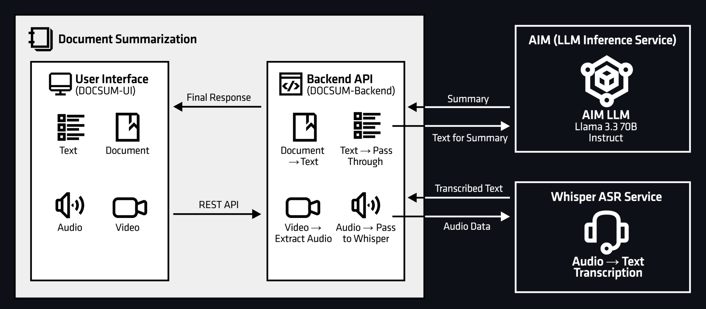
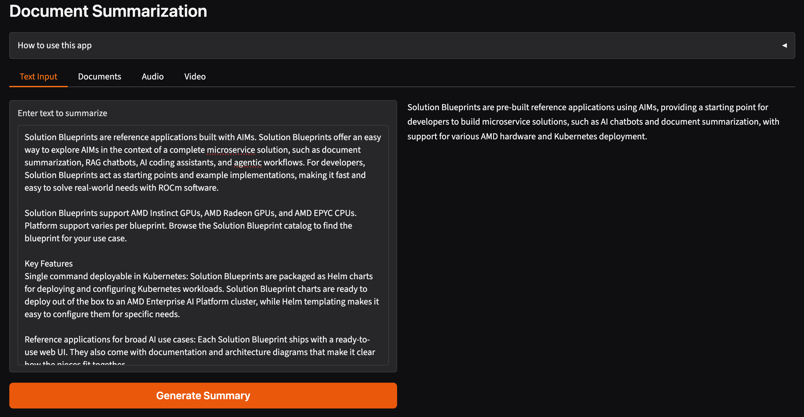

<!---
Copyright (c) 2026 Advanced Micro Devices, Inc. (AMD)

Permission is hereby granted, free of charge, to any person obtaining a copy
of this software and associated documentation files (the "Software"), to deal
in the Software without restriction, including without limitation the rights
to use, copy, modify, merge, publish, distribute, sublicense, and/or sell
copies of the Software, and to permit persons to whom the Software is
furnished to do so, subject to the following conditions:

The above copyright notice and this permission notice shall be included in all
copies or substantial portions of the Software.

THE SOFTWARE IS PROVIDED "AS IS", WITHOUT WARRANTY OF ANY KIND, EXPRESS OR
IMPLIED, INCLUDING BUT NOT LIMITED TO THE WARRANTIES OF MERCHANTABILITY,
FITNESS FOR A PARTICULAR PURPOSE AND NONINFRINGEMENT. IN NO EVENT SHALL THE
AUTHORS OR COPYRIGHT HOLDERS BE LIABLE FOR ANY CLAIM, DAMAGES OR OTHER
LIABILITY, WHETHER IN AN ACTION OF CONTRACT, TORT OR OTHERWISE, ARISING FROM,
OUT OF OR IN CONNECTION WITH THE SOFTWARE OR THE USE OR OTHER DEALINGS IN THE
SOFTWARE.
--->

# Multi-Accelerator Support for AIMs and AMD Solution Blueprints

With the latest release of AMD enterprise AI reference stack, Version 2.2 [Release notes](https://enterprise-ai.docs.amd.com/en/latest/release-notes.html), we're now introducing **Multi-accelerator support**. [AMD Inference Microservices (AIMs)](https://enterprise-ai.docs.amd.com/en/latest/aims/overview.html) now run across AMD Instinct™ GPUs (MI300X, MI325X, MI350X, MI355X), AMD Radeon™ Pro GPUs (W7900 and R9700), and AMD EPYC™ CPUs (EPYC 9965). That same coverage also extends to the [AMD Solution Blueprints](https://enterprise-ai.docs.amd.com/en/latest/solution-blueprints/catalog.html).

This blog introduces:

- The new AIMs for **AMD Instinct™ GPUs**, **AMD EPYC™ Server Processors**, and **AMD Radeon™ GPUs**
- The expanded **AMD Solution Blueprint** support for AMD EPYC and AMD Radeon

In addition, we will walk you through the [Document Summarization Solution Blueprint](https://enterprise-ai.docs.amd.com/en/latest/solution-blueprints/catalog.html) across all three accelerator types.

## AMD Inference Microservices

AIMs provide standardized, portable inference microservices for serving AI models on AMD hardware. Distributed as Docker images, AIMs abstract away the complexities involved in model serving through an intelligent orchestration layer that automatically configures runtime environments, detects available accelerators, and selects a performance profile.

The following AIMs are new in this release.

::::{tab-set}

:::{tab-item} AMD Instinct (GPU, default)
:sync: instinct

- [google/gemma-4-31b-it](https://hub.docker.com/r/amdenterpriseai/aim-google-gemma-4-31b-it)
- [google/medgemma-27b-it](https://hub.docker.com/r/amdenterpriseai/aim-google-medgemma-27b-it)
- [mistralai/Mistral-Small-24B-Instruct-2501](https://hub.docker.com/r/amdenterpriseai/aim-mistralai-mistral-small-24b-instruct-2501)
:::

:::{tab-item} AMD EPYC (CPU)
:sync: epyc

- [unsloth/gpt-oss-20b-BF16](https://hub.docker.com/r/amdenterpriseai/aim-epyc-unsloth-gpt-oss-20b-bf16)
- [meta-llama/Llama-3.1-8B-Instruct](https://hub.docker.com/r/amdenterpriseai/aim-epyc-meta-llama-llama-3-1-8b-instruct)
- [google/gemma-4-E4B-it](https://hub.docker.com/r/amdenterpriseai/aim-epyc-google-gemma-4-e4b-it)
- [Qwen/Qwen3-30B-A3B](https://hub.docker.com/r/amdenterpriseai/aim-epyc-qwen-qwen3-30b-a3b)
- [Qwen/Qwen3-8B](https://hub.docker.com/r/amdenterpriseai/aim-epyc-qwen-qwen3-8b)
- [Qwen/Qwen3.5-4B](https://hub.docker.com/r/amdenterpriseai/aim-epyc-qwen-qwen3-5-4b)
- [Qwen/Qwen3.5-9B](https://hub.docker.com/r/amdenterpriseai/aim-epyc-qwen-qwen3-5-9b)
- [Qwen/Qwen3.6-35B-A3B](https://hub.docker.com/r/amdenterpriseai/aim-epyc-qwen-qwen3-6-35b-a3b)
:::

:::{tab-item} AMD Radeon (GPU)
:sync: radeon

- [Qwen/Qwen3-VL-8B-Instruct](https://hub.docker.com/r/amdenterpriseai/aim-radeon-qwen-qwen3-vl-8b-instruct)
- [Qwen/Qwen3.5-9B](https://hub.docker.com/r/amdenterpriseai/aim-radeon-qwen-qwen3-5-9b)
- [google/gemma-3n-E4B-it](https://hub.docker.com/r/amdenterpriseai/aim-radeon-google-gemma-3n-e4b-it)
- [meta-llama/Llama-3.1-8B-Instruct](https://hub.docker.com/r/amdenterpriseai/aim-radeon-meta-llama-llama-3-1-8b-instruct)
- [zai-org/GLM-4.7-Flash](https://hub.docker.com/r/amdenterpriseai/aim-radeon-zai-org-glm-4-7-flash)
:::

::::

For the complete list of supported models per accelerator, see the [accelerator support page](https://enterprise-ai.docs.amd.com/en/latest/aims/accelerator_support.html). The source code is also publicly available in the [AIM build repository](https://github.com/amd-enterprise-ai/aim-build/tree/main).

## AMD Solution Blueprints

[AMD Solution Blueprints](https://enterprise-ai.docs.amd.com/en/latest/solution-blueprints/catalog.html) are reference applications built with AIMs. They offer an easy way to explore AIMs in the context of a complete microservice solution, such as document summarization, RAG chatbots, AI coding assistants, and agentic workflows. For developers, Solution Blueprints act as starting points and example implementations, making it fast and easy to solve real-world needs with ROCm™ software. Browse the full set of AMD Solution Blueprints, including per-accelerator support, in the [Solution Blueprint catalog](https://enterprise-ai.docs.amd.com/en/latest/solution-blueprints/catalog.html).

AMD Solution Blueprints are packaged as [Helm charts](https://helm.sh/) for deployment on a Kubernetes cluster. For development or further exploration, the source code is publicly available in the [Solution Blueprints GitHub repository](https://github.com/amd-enterprise-ai/solution-blueprints/tree/main/solution-blueprints/document-summarization).

In this blog we deploy the [Document Summarization Solution Blueprint](https://enterprise-ai.docs.amd.com/en/latest/solution-blueprints/document-summarization/README.html) which supports all three accelerators.

### Document Summarization Solution Blueprint

The Document Summarization (DocSum) Solution Blueprint uses LLMs to generate summaries from varied document types. It can process and summarize PDFs, DOCX files, and plain text, as well as multimedia files (both audio and video), across a variety of domains such as customer service, scientific research, and legal text. Figure 1 shows the architecture.



<p style="text-align:center">
<em>Figure 1: Document Summarization Architecture.</em>
</p>

The Solution Blueprint deploys the following AIM by default:

- Instinct: `Llama 3.3 70B Instruct`
- Radeon: `Qwen3-VL 8B Instruct`
- EPYC: `Llama 3.1 8B Instruct`

### Prerequisites

To deploy to the Kubernetes cluster, ensure the following prerequisites are met:

- [kubectl](https://kubernetes.io/docs/tasks/tools/): Installed and configured to communicate with the cluster
- [Helm](https://helm.sh/docs/intro/install/): Installed on your local machine
- Kubernetes namespace:
  - We will use a namespace called `demo`
  - You can create a namespace using `kubectl create namespace "demo"`.

This blog post was validated on clusters powered by AMD Instinct MI300X GPUs, AMD EPYC™ 9965 CPUs and AMD Radeon AI PRO R9700S GPUs and with [AMD AI Workbench](https://enterprise-ai.docs.amd.com/en/latest/workbench/overview.html) installed.

#### Hugging Face Token

AIM images are hosted publicly on Docker Hub and do not require authentication to pull. However, certain models are gated on Hugging Face and require an access token to download. Store your token as a Kubernetes secret so it can be referenced securely by the deployment.

Create a secret for the `demo` namespace:

```bash
kubectl create secret generic hf-token \
    --from-literal="hf-token=YOUR_HUGGINGFACE_TOKEN" \
    -n demo
```

```text
secret/hf-token created
```

### Deployment

AMD Solution Blueprints are packaged as OCI-compliant Helm charts in the Docker Hub registry and can be deployed to a Kubernetes cluster with a single command. Define the `name` (deployment name) and the `namespace` (Kubernetes namespace), then pipe the output of `helm template` to `kubectl apply -f -`.

The chart ships defaults for three platforms, selected with `--set global.platform=<platform>`: `instinct` (GPU, the default), `epyc` (CPU), and `radeon` (GPU). Each sets a matching AIM image and resource profile. You can inspect them by using: `helm show values oci://registry-1.docker.io/amdenterpriseai/aimsb-docsum --jsonpath '{.llm.platformDefaults}'`.

Click on each tab to see the deployment instruction for each accelerator.

::::{tab-set}

:::{tab-item} AMD Instinct (GPU, default)
:sync: instinct

To deploy the Solution Blueprint, run the command below. We generate the deployment manifest and save it to a file called `manifest.yaml` for easier debugging.

```bash
name="my-deployment"
namespace="demo"
helm template $name oci://registry-1.docker.io/amdenterpriseai/aimsb-docsum \
  --set llm.env_vars.HF_TOKEN.name=hf-token \
  --set llm.env_vars.HF_TOKEN.key=hf-token \
  > manifest.yaml
kubectl apply -f manifest.yaml -n $namespace
```

:::

:::{tab-item} AMD EPYC (CPU)
:sync: epyc

To deploy the blueprint, run the command below. We generate the deployment manifest and save it to a file called `manifest.yaml` for easier debugging.

```bash
name="my-deployment"
namespace="demo"
helm pull oci://registry-1.docker.io/amdenterpriseai/aimsb-docsum --untar
helm template $name ./aimsb-docsum \
  --set global.platform=epyc \
  --set llm.cpus=188 \
  --set llm.memory=128 \
  --set llm.env_vars.HF_TOKEN.name=hf-token \
  --set llm.env_vars.HF_TOKEN.key=hf-token \
  > manifest.yaml
kubectl apply -f manifest.yaml -n $namespace
```

**Performance note:** On multi-socket EPYC nodes, configure the kubelet for NUMA alignment (CPU Manager `static`, Topology Manager `single-numa-node`, Memory Manager `Static`); otherwise the LLM's CPUs and memory can land on different NUMA nodes and vLLM runs effectively single-threaded.
:::

:::{tab-item} AMD Radeon (GPU)
:sync: radeon

To deploy the blueprint, run the command below. We generate the deployment manifest and save it to a file called `manifest.yaml` for easier debugging. Note that this deploys `Qwen3-VL 8B Instruct`, which is a public model, so a Hugging Face token is not required.

```bash
name="my-deployment"
namespace="demo"
helm template $name oci://registry-1.docker.io/amdenterpriseai/aimsb-docsum \
  --set global.platform=radeon \
  > manifest.yaml
kubectl apply -f manifest.yaml -n $namespace
```

:::

::::

To check the status of the deployment, run:

```bash
kubectl get pods -n $namespace
```

Wait until all pods report `Running` and `Ready`. Summarization requires the LLM (and Whisper for media paths) to be up.

### Connect to UI

To connect to the UI, port-forward to 5173. The UI is then available at [http://localhost:5173](http://localhost:5173) in your browser.

```bash
kubectl port-forward services/aimsb-docsum-${name}-ui 5173:5173 -n $namespace
```

```{note}
If your cluster has a Gateway API–compatible gateway (for example, Kubernetes Gateway or Istio), you can enable HTTPRoute creation to route traffic through the gateway. Use `--set http_route.enabled=true` in the `helm template` command to enable HTTPRoute creation.

The URL to access the blueprint via HTTPRoute is formed by the service name and the hostname of the gateway. Use this command to produce the URL by querying the hostname from the cluster:

`echo "https://aimsb-docsum-$name$(kubectl get gtw -A -o jsonpath='{.items[*].spec.listeners[?(@.name=="https")].hostname}' | tr -d \*)/"`

```

Once connected, use the application as follows:

1. Choose a source: Upload one or more supported files (Text, Documents, Audio, or Video)
2. Click "Generate Summary" to submit the request and wait for the summarization to finish
3. Review the generated summary in the UI



### Clean Up

When you are finished, remove the deployed resources with `kubectl delete` using the same manifest file:

```bash
kubectl delete -f manifest.yaml -n $namespace
```

## Summary

This blog highlighted the new AIMs on each accelerator and showed that **AMD Solution Blueprints** now run on AMD Instinct GPUs, AMD Radeon GPUs, and AMD EPYC Server Processors. Using the Document Summarization Solution Blueprint as an end-to-end example, we walked through rendering a Helm chart to a manifest, deploying it on Kubernetes, and connecting to the UI, with platform-specific defaults for Instinct, EPYC, and Radeon.

To explore further, see the [accelerator support page](https://enterprise-ai.docs.amd.com/en/latest/aims/accelerator_support.html) for available AIMs and the [Solution Blueprint catalog](https://enterprise-ai.docs.amd.com/en/latest/solution-blueprints/catalog.html) for available Solution Blueprints.

## Additional resources

- [AMD enterprise AI documentation](https://enterprise-ai.docs.amd.com/en/latest/index.html)
- [AIMs overview](https://enterprise-ai.docs.amd.com/en/latest/aims/overview.html)
- [Deploy and Customize AMD Solution Blueprints](https://rocm.blogs.amd.com/artificial-intelligence/custom-blueprint/README.html)
- [High Performance Computing Tuning Guide for AMD EPYC™ 9005 Series Processor](https://docs.amd.com/v/u/en-US/58479_amd-epyc-9005-tg-hpc)

## Disclaimers

The information presented in this document is for informational purposes only and may contain technical inaccuracies, omissions, and typographical errors. The information contained herein is subject to change and may be rendered inaccurate for many reasons, including but not limited to product and roadmap changes, component and motherboard version changes, new model and/or product releases, product differences between differing manufacturers, software changes, BIOS flashes, firmware upgrades, or the like. Any computer system has risks of security vulnerabilities that cannot be completely prevented or mitigated. AMD assumes no obligation to update or otherwise correct or revise this information.
However, AMD reserves the right to revise this information and to make changes from time to time to the content hereof without obligation of AMD to notify any person of such revisions or changes.
THIS INFORMATION IS PROVIDED ‘AS IS.” AMD MAKES NO REPRESENTATIONS OR WARRANTIES WITH RESPECT TO THE CONTENTS HEREOF AND ASSUMES NO RESPONSIBILITY FOR ANY INACCURACIES, ERRORS, OR OMISSIONS THAT MAY APPEAR IN THIS INFORMATION. AMD SPECIFICALLY DISCLAIMS ANY IMPLIED WARRANTIES OF NON-INFRINGEMENT, MERCHANTABILITY, OR FITNESS FOR ANY PARTICULAR PURPOSE. IN NO EVENT WILL AMD BE LIABLE TO ANY PERSON FOR ANY RELIANCE, DIRECT, INDIRECT, SPECIAL, OR OTHER CONSEQUENTIAL DAMAGES ARISING FROM THE USE OF ANY INFORMATION CONTAINED HEREIN, EVEN IF AMD IS EXPRESSLY ADVISED OF THE POSSIBILITY OF SUCH DAMAGES.
AMD, the AMD Arrow logo, AMD Instinct, AMD Radeon, AMD EPYC, ROCm and combinations thereof are trademarks of Advanced Micro Devices, Inc. Other product names used in this publication are for identification purposes only and may be trademarks of their respective companies.
© 2026 Advanced Micro Devices, Inc. All rights reserved
