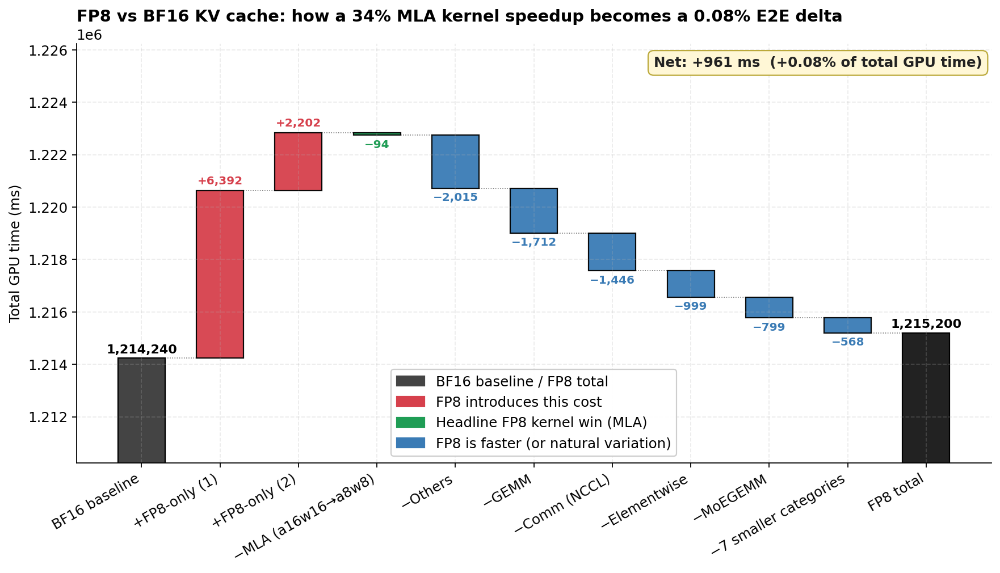
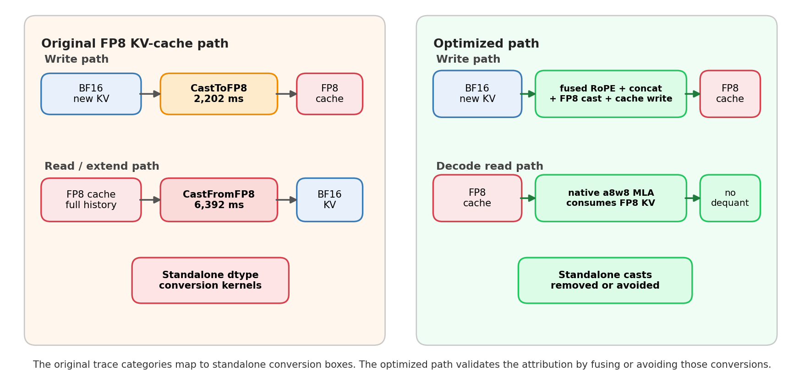

<!---
Copyright (c) 2026 Advanced Micro Devices, Inc. (AMD)

Permission is hereby granted, free of charge, to any person obtaining a copy
of this software and associated documentation files (the "Software"), to deal
in the Software without restriction, including without limitation the rights
to use, copy, modify, merge, publish, distribute, sublicense, and/or sell
copies of the Software, and to permit persons to whom the Software is
furnished to do so, subject to the following conditions:

The above copyright notice and this permission notice shall be included in all
copies or substantial portions of the Software.

THE SOFTWARE IS PROVIDED "AS IS", WITHOUT WARRANTY OF ANY KIND, EXPRESS OR
IMPLIED, INCLUDING BUT NOT LIMITED TO THE WARRANTIES OF MERCHANTABILITY,
FITNESS FOR A PARTICULAR PURPOSE AND NONINFRINGEMENT. IN NO EVENT SHALL THE
AUTHORS OR COPYRIGHT HOLDERS BE LIABLE FOR ANY CLAIM, DAMAGES OR OTHER
LIABILITY, WHETHER IN AN ACTION OF CONTRACT, TORT OR OTHERWISE, ARISING FROM,
OUT OF OR IN CONNECTION WITH THE SOFTWARE OR THE USE OR OTHER DEALINGS IN THE
SOFTWARE.
--->

# When a Faster Kernel Doesn't Speed Up Serving: Profiling FP8 KV Cache on AMD Instinct MI308X

This case study starts with a result that didn't add up. We enabled FP8 KV cache (`--kv-cache-dtype fp8_e4m3`) on a Kimi-K2.5-W4A8 (MoE + MLA) deployment on 8× AMD Instinct MI308X. At first glance, the trace had several encouraging signs: the MLA decode kernel ran **34% faster**[^perf] than the BF16 baseline, going from 0.190 ms/call to 0.125 ms/call, and several existing categories such as GEMM, communication, and elementwise work moved slightly lower.

The workload-level result went the other way: total GPU time across the same workload was slightly higher, by **+961 ms (+0.08%)**.

| Metric | FP8 | BF16 | Diff |
|---|---:|---:|---:|
| Target MLA decode kernel time per call | 0.125 ms | 0.190 ms | **−34%** |
| Existing categories combined | 1,206,606 ms | 1,214,240 ms | **−7,633 ms** |
| New FP8-only categories | 8,594 ms | 0 ms | **+8,594 ms** |
| Total GPU time | 1,215,200 ms | 1,214,240 ms | **+961 ms (+0.08%)** |

This blog walks through what the trace says about that gap. The short answer is that local wins are not enough if the configuration also introduces new cost paths. In this run, the existing categories collectively moved down by about **7.6 seconds**, including the 94 ms MLA win. But FP8 introduced two new categories that did not exist in the BF16 trace, and those new categories cost about **8.6 seconds** of GPU time.

The profiler did record the relevant events; the hard part was understanding what those events meant. Based on our experience, we found it helpful to combine a **paired trace diff** to identify what changed, **semantic analysis** to turn raw events into meaningful information, such as kernel categories, and **source validation** to confirm why those categories exist. An LLM can help propose the grouping, but the final evidence must remain reviewable: explicit rules, numeric trace deltas, and source-code checks.

## Setup

| Component | Configuration |
|---|---|
| Model | Kimi-K2.5-W4A8 (MoE, MLA architecture) |
| Hardware | 8× AMD Instinct MI308X (gfx942), TP=8 |
| Backend | SGLang (commit `g4179fdb17`) + aiter attention backend |
| Software | ROCm 7.2.0 |
| CUDA Graph | **Enabled** (production-like, not a debug profile) |
| Workload | concurrency=40, warmup=10, end-to-end profiling |
| Comparison | `--kv-cache-dtype bf16` (default) vs `--kv-cache-dtype fp8_e4m3` |
| BF16 attention kernel | `mla_dec_stage1_bf16_a16w16_subQ16_mqa16` |
| FP8 attention kernel  | `mla_a8w8_qh16_qseqlen1_gqaratio16` |

## Why a Single Top-Kernel View Is Not Enough

If we only inspect one FP8 trace, the story is easy to misread. The headline MLA kernel is faster, and large GPU-time categories such as MoE GEMM, GEMM, and communication also improve in the FP8 run. At the same time, the trace contains many copy-like or elementwise-looking events. A conventional top-kernel view can show all of those facts, but it does not tell us which events are new because of FP8 KV cache, which ones are normal workload variation, or which copy-like events belong to the KV-cache read/write path.

The risk is choosing the wrong optimization target. We might conclude that FP8 mostly worked and that the remaining issue is a generic copy-kernel problem. In this case, that is not precise enough. The real question is:

> What did FP8 KV cache actually change in the workload — once the targeted kernels got faster, did a new bottleneck show up, or did the configuration itself introduce new cost paths?

To answer that, we read the trace in three passes:

1. **Paired trace diff**: compare FP8 against BF16 under the same workload.
2. **Semantic analysis**: turn raw profiler events into meaningful information, such as kernel categories.
3. **Source validation**: check that the new categories map to the FP8 KV-cache code path.

An LLM can help with the semantic step by inspecting long kernel names and suggesting source paths, but it is not the source of truth. The conclusion still has to be backed by explicit category rules, numeric trace deltas, and source-code evidence.

## Step 1: Paired Trace Diff

The first observation comes from the benchmark summary.

```text
FP8  total GPU time : 1,215,200 ms
BF16 total GPU time : 1,214,240 ms
Delta               :    +961 ms  (+0.08%)
```

If we only look at the FP8 trace, the natural reaction is to inspect the largest GPU-time categories first: MoE GEMM, GEMM, communication, and other high-volume kernels. That is useful, but it can point the investigation in the wrong direction. The largest kernels are not necessarily the kernels introduced by FP8 KV cache.

The paired trace diff changes the question from "what is slow in FP8?" to "what changed from BF16 to FP8?" That distinction matters here. As the waterfall in Figure 1 below shows, the large existing categories mostly move slightly lower in the FP8 run, while the suspicious signal is that FP8 has extra copy-like categories that do not exist in BF16. At this stage, the diff tells us where to look, but not yet what those copy-like events mean.



**Figure 1.** Going from the BF16 baseline to FP8 KV cache, several existing categories move slightly lower, but two FP8-only categories dominate the added cost. The semantic analysis below identifies what those categories are.

Reading that diff correctly means weighting each change by its share of total GPU time, not by its local speedup. The MLA decode kernel is the clearest example. It did get faster, and both runs use the same number of MLA calls (2,928); only the kernel implementation differs.

| Kernel | Calls | Total time (ms) | Avg per call (ms) |
|---|---:|---:|---:|
| `mla_a8w8_qh16_qseqlen1_gqaratio16` (FP8) | 1,464 | 183 | 0.125 |
| `mla_dec_stage1_bf16_a16w16_subQ16_mqa16` (BF16) | 1,464 | 278 | 0.190 |
| **Difference** | | **−95 ms** | **−34%** |

*Note: this table isolates the single FP8/BF16 MLA decode kernel (1,464 calls each). The category table in Step 2 reports the full MLA category (2,928 calls), so its totals (190 ms / 285 ms, −94 ms) are slightly larger and rounded differently.*

The 34% per-call speedup is real. With 8-bit KV instead of 16-bit, the attention kernel reads half the KV-cache memory bandwidth per token, which is exactly the kind of saving FP8 KV cache is designed to deliver.

But the share-weighted impact on E2E GPU time is:

```text
MLA share of total GPU time         ≈ 190 ms / 1,215,200 ms ≈ 0.0156%
MLA savings vs BF16                  = 94 ms
MLA savings as fraction of total     = 94 / 1,214,240 ≈ 0.0077%
```

A reasonable rule of thumb when reading kernel-level results is:

> The E2E impact of a per-kernel speedup is roughly *(speedup) × (share of total time)*, not *(speedup)*.

For MLA in this run, that product is `34% × 0.02% ≈ 0.007%`. The kernel got faster; the workload barely noticed.

## Step 2: Semantic Analysis of Profiler Events

Classifying GPU events into categories is only the first part of semantic analysis. The harder and more valuable part is interpreting what an event represents and why it exists — for example, recognizing that a generic `aten::copy_` is actually a KV-cache dtype conversion, or that an event appears only because a specific feature was enabled.

In today's workflow, an LLM agent is very effective here: it can inspect the raw profiler output, decode long or opaque kernel symbols, and propose semantic labels for copy-like events. We recommend using one for this step. This matters because people reading a top-kernel table tend to start from kernel names and leave ambiguous events under broad buckets such as `Elementwise` or `Others`, missing that they belong to a specific FP8 KV-cache conversion path.

The point is that this is not a one-off LLM judgment. Each grouping the LLM proposes is written down as an explicit, repeatable name-based rule (re-running it on the same trace gives the same result), and we adopt it only once the matching path can be found in the source code. We then apply that rule set uniformly to every event in both the BF16 and FP8 traces and compare per-category time — which is exactly how the table below is produced.

The classification follows the LLM-serving rule set used elsewhere on this stack, with two extra rules added so that the FP8↔BF16 dtype casts surface as their own categories instead of getting hidden inside `Elementwise` or `Others`. These two extra categories are exactly the two FP8-only bars highlighted in Figure 1: `CastFromFP8` (the read path) and `CastToFP8` (the write path).

| Category | Example kernels |
|---|---|
| `MoEGEMM` | `moe_gemm1_0`, `moe_gemm2_0` |
| `MLA` | `aiter::mla_a8w8_qh16_qseqlen1_gqaratio16`, `mla_dec_stage1_bf16_a16w16_subQ16_mqa16` |
| `GEMM` | `Cijk_*`, `wvSpltK_*`, `bf16gemm_*` |
| `Comm (NCCL)` | `cross_device_reduce_2stage`, RCCL kernels |
| `RMSNorm` | `Rmsnorm_*` |
| `Elementwise` | element-wise activation / copy kernels |
| `KVCacheWrite` | KV cache write kernels (excluding dtype casts) |
| **`CastFromFP8`** | `aten::copy_` from FP8 KV tensor → BF16 (read path) |
| **`CastToFP8`** | `aten::copy_` from BF16 tensor → FP8 KV (write path) |

The 16-row table below is the entire trace, reduced to one row per category.

| Category | FP8 Count | FP8 Time (ms) | FP8 % | BF16 Count | BF16 Time (ms) | BF16 % | Diff (FP8 − BF16) |
|---|---:|---:|---:|---:|---:|---:|---:|
| MoEGEMM | 101,744 | 427,891 | 35.21% | 102,720 | 428,690 | 35.31% | −799 |
| GEMM | 409,856 | 364,708 | 30.01% | 413,824 | 366,420 | 30.18% | −1,712 |
| Others | 256,816 | 166,533 | 13.70% | 257,912 | 168,548 | 13.88% | −2,015 |
| Comm (NCCL) | 105,128 | 138,714 | 11.41% | 106,144 | 140,160 | 11.54% | −1,446 |
| RMSNorm | 207,736 | 62,435 | 5.14% | 209,720 | 62,638 | 5.16% | −203 |
| Quant | 101,744 | 17,877 | 1.47% | 102,720 | 17,881 | 1.47% | −4 |
| Elementwise | 282,016 | 11,302 | 0.93% | 321,192 | 12,301 | 1.01% | −999 |
| **CastFromFP8** | **92,704** | **6,392** | **0.53%** | **0** | **0** | **0.00%** | **+6,392** |
| MoESorting | 200,608 | 5,253 | 0.43% | 202,560 | 5,295 | 0.44% | −42 |
| TopK | 50,872 | 4,900 | 0.40% | 51,360 | 4,919 | 0.41% | −19 |
| KVCacheWrite | 50,256 | 4,041 | 0.33% | 50,752 | 4,151 | 0.34% | −109 |
| **CastToFP8** | **50,256** | **2,202** | **0.18%** | **0** | **0** | **0.00%** | **+2,202** |
| ActMul | 51,720 | 1,974 | 0.16% | 52,216 | 1,980 | 0.16% | −6 |
| ReduceOP | 16,216 | 788 | 0.06% | 18,360 | 973 | 0.08% | −185 |
| MLA | 2,928 | **190** | 0.02% | 2,928 | **285** | 0.02% | **−94** |
| **Total** | | **1,215,200** | 100% | | **1,214,240** | 100% | **+961** |

Two facts jump out of this table:

- **`CastFromFP8` and `CastToFP8` did not exist in the BF16 trace.** Their counts in BF16 are zero. Any GPU time spent in those rows is, by definition, a cost introduced by the FP8 KV cache configuration.
- **MLA accounts for 0.02% of total GPU time.** Even though MLA is the kernel that conceptually motivates FP8 KV cache (smaller KV → less attention bandwidth), it sits near the bottom of the table by absolute time.

This is the point where semantic analysis matters. The discovery is not merely that copy-like kernels exist. The discovery is that those copy-like events are attributable to two FP8 KV-cache conversion paths:

```text
CastFromFP8 = FP8 KV cache read path  -> BF16
CastToFP8   = BF16 new KV write path  -> FP8 cache
```

Together they cost 8,594 ms, while the MLA saving is only 94 ms. The FP8 attention kernel improved, and several existing categories also moved lower, but the new dtype-conversion categories erased those gains and left the FP8 run with a net +961 ms delta.

## Step 3: Source Validation for `CastFromFP8` and `CastToFP8`

We are grateful for the LLM's help with the semantic analysis in Step 2, but we are also aware that today's LLMs can still get things wrong. That is why Step 2 keeps insisting on one rule: a category is only trusted once its matching path can be found in the source code. Here, for `CastFromFP8` and `CastToFP8`, we trace each one back to the exact line of SGLang code that emits it — using an LLM to supervise the LLM and confirm the categories are real, and then re-checking the same paths by hand. Without this step, the categories would be a plausible guess rather than an attribution.

Switching KV cache to FP8 introduces two new GPU operations that did not exist before: dequantizing FP8 KV back to BF16 when reading, and quantizing BF16 KV to FP8 when writing. Both are recorded in the trace as `aten::copy_` events between FP8 and BF16 tensors and are kept as their own kernel categories so that they do not get hidden inside `Elementwise` or `Others`.

### `CastFromFP8` — FP8 → BF16, the Larger Cost

| Metric | Value |
|---|---|
| GPU time | **6,392 ms** |
| Calls | 92,704 |
| Average per call | 0.069 ms |
| Triggered in | `forward_extend`, when the prefill/extend path needs BF16 KV for `flash_attn_varlen_func` |

Every extend step has to read the full history KV cache and cast it back to BF16, because `flash_attn_varlen_func` (the prefill attention kernel used by the aiter backend) cannot consume FP8 input. The call count (92,704) is large because this happens once per layer, on every extend step, against the full history of KV cache.

The corresponding source path is explicit in the SGLang aiter MLA backend:

```python
if self.kv_cache_dtype == fp8_dtype:
    dtype = q.dtype
    kvc   = kvc.to(dtype)    # FP8 → BF16
    k_pe  = k_pe.to(dtype)   # FP8 → BF16
```

> Source: [SGLang `aiter_backend.py`, lines 1866–1870, as of commit `21c4fc63`](https://github.com/sgl-project/sglang/blob/21c4fc63/python/sglang/srt/layers/attention/aiter_backend.py#L1866-L1870) (aiter MLA attention backend), licensed under the Apache License 2.0. The snippet above is abbreviated for clarity. This per-layer upcast was later removed upstream in [PR #24129](https://github.com/sgl-project/sglang/pull/24129), which routes KV through the native FP8 path — the same direction as the optimized path in this post.

These `.to(dtype)` calls turn into independent `aten::copy_` GPU kernels — one full read + one full write of the KV cache for every layer, on every extend step. That is exactly the shape of `CastFromFP8` in the trace.

### `CastToFP8` — BF16 → FP8, the Smaller Cost

| Metric | Value |
|---|---|
| GPU time | **2,202 ms** |
| Calls | 50,256 |
| Average per call | 0.044 ms |
| Triggered in | `set_kv_buffer`, when freshly computed BF16 KV is written into the FP8 KV cache |

Every decode/extend step produces new KV in BF16 (from the projection output) and quantizes it to FP8 before storing it.

The write-side cast also runs as its own kernel because there is no fused-write path in the original implementation: the write side goes through `aten::copy_` between BF16 and FP8 tensors, rather than letting the upstream attention-projection kernel emit FP8 directly.

### Combined Cost

The two cast categories together account for **8,594 ms** of GPU time, which is:

- About **45×** the entire MLA category (190 ms) in the FP8 run.
- About **9×** larger than the absolute MLA savings (94 ms).

In other words, the dtype cast that exists *only because* we enabled FP8 KV cache is much more expensive than the kernel speedup that motivated FP8 KV cache. Figure 2 below traces where these two casts sit in the KV-cache read/write path, and how the optimized path eliminates them.



**Figure 2.** FP8 KV-cache read/write paths before and after cast elimination. The original path exposes `CastToFP8` and `CastFromFP8` as standalone conversion kernels; the optimized path fuses or avoids those conversions.

## The Ledger: How the Casts Erased the Wins

With the three-pass attribution complete, the categories are trustworthy and we can do the bookkeeping. Adding up every per-category diff between FP8 and BF16 produces a clean balance sheet:

```text
FP8 vs BF16 — total GPU time delta (ms)

  Costs introduced by FP8 KV cache:
    +CastFromFP8 (FP8 → BF16, extend reads):    +6,392
    +CastToFP8   (BF16 → FP8, KV writes):       +2,202
                                              ────────
                                       Subtotal: +8,594

  Savings:
    −Others:                                    −2,015
    −GEMM:                                      −1,712
    −Comm (NCCL):                               −1,446
    −Elementwise:                                 −999
    −MoEGEMM:                                     −799
    −7 smaller categories (RMSNorm, MoESorting,
     KVCacheWrite, ReduceOP, TopK, ActMul,
     Quant):                                     −568
    −MLA   (a16w16 → a8w8, the headline win):     −94
                                              ────────
                                       Subtotal: −7,633

  Net delta:                                      +961  (+0.08%)
```

The headline MLA improvement is the smallest line on the savings side.

The numerical conclusion is: FP8 KV cache moved cost from one place (slightly less attention bandwidth) to another, larger place (two new dtype-cast categories), so the net E2E effect is approximately zero.

The optimization target is now clear. The problem is not "copy kernels" in general. It is the FP8 KV-cache conversion path that created `CastFromFP8` and `CastToFP8`.

## From Attribution to Optimization Targets

The profiling attribution gives us a concrete optimization map instead of a generic "optimize copy kernels" conclusion. Each optimization below targets a specific row in the ledger above.

| Direction | What changes | Approximate budget |
|---|---|---:|
| Fuse the FP8 KV write into the attention-projection epilogue | `aten::copy_` for BF16→FP8 disappears; the projection kernel emits FP8 directly | at most **2,202 ms** if the entire `CastToFP8` row is eliminated |
| FP8-native prefill attention | A `flash_attn_varlen_func` variant that accepts FP8 KV input removes the BF16 dequant in the extend path | at most **6,392 ms** if the entire `CastFromFP8` row is eliminated |
| Larger batch / longer decode | Increases MLA's share of GPU time so the 34% kernel speedup translates into a larger E2E share | scales with workload |
| Reduce the number of extends (chunked prefill, prefix cache) | Lowers `CastFromFP8` call count, since each extend re-reads the full history KV | scales with `extend_count × history_len` |

In principle, the first two together could recover up to 8,594 ms, but these are theoretical upper bounds. The last two are workload-shape changes; they do not remove the cast cost, but they amortize it.

## Summary

In this blog, we walked through a profiling puzzle on AMD Instinct MI308X: enabling FP8 KV cache on a Kimi-K2.5-W4A8 (MoE + MLA) deployment made the MLA decode kernel 34% faster per call (0.190 ms → 0.125 ms), yet total GPU time over the same workload barely moved (+961 ms, +0.08%). We showed that a single FP8 trace hides the reason, and that a paired, category-level attribution surfaces it clearly: two FP8-only dtype-cast paths, `CastFromFP8` and `CastToFP8` (≈8,594 ms together), quietly cancel out the 94 ms MLA win. More importantly, we turned that finding into a concrete optimization map — fusing the FP8 write and adopting FP8-native prefill attention — instead of settling for a vague "optimize the copy kernels" conclusion.

We hope you can take the three-pass workflow (paired trace diff, semantic analysis, and source validation) back to your own kernels and configuration changes, so that you can tell a real end-to-end win from a local speedup that a new cost path silently erases — and know exactly which line of code to target next.

We are already building on this work: upcoming blogs will measure the two optimization directions in practice — fusing the BF16→FP8 write into the attention-projection epilogue, and running an FP8-native prefill attention path — and revisit the same trace to confirm how much of the 8,594 ms actually comes back. Follow the ROCm Blogs channel to see whether these changes finally turn the 34% kernel win into an end-to-end serving win.

### How We Attributed It — a Three-Pass Workflow

- **Paired trace diff.** Compare FP8 against a BF16 baseline under the identical workload, instead of reading one trace in isolation, so the net-new cost becomes visible.
- **Semantic analysis.** Turn raw `aten::copy_` events into meaningful categories — the step that separates "there are copy kernels" from "these copies are the FP8 KV-cache conversion path." An LLM is very effective here, as long as each grouping is captured as a repeatable rule rather than a one-off judgment.
- **Source validation.** Trace every category back to the exact line of SGLang code that emits it and re-check by hand, turning a label into an *attribution* rather than a plausible guess.

### What Generalizes

- A top-kernel table from a single trace cannot explain the impact of a configuration change.
- A kernel speedup only matters in proportion to the share of total time it held in the first place.
- A category that appears *only* in the new trace, with no counterpart in the old one, is the prime suspect.

LLM assistance accelerates the semantic step, but the conclusion stays reviewable through paired diffs, explicit category rules, numeric deltas, and source-code evidence. It is precisely this step-by-step attribution that yields a concrete optimization direction, instead of a vague "optimize copy kernels" conclusion that says little.

[^perf]: Testing conducted by AMD as of April 2, 2026. Configuration: 8× AMD Instinct™ MI308X (gfx942), TP=8; ROCm 7.2.0; SGLang (commit `g4179fdb17`) with the aiter attention backend; CUDA Graph enabled; model Kimi-K2.5-W4A8 (MoE + MLA architecture); end-to-end profiling workload with concurrency=40 and warmup=10. The comparison is between `--kv-cache-dtype bf16` (default) and `--kv-cache-dtype fp8_e4m3` on the same system. All figures (including the 34% per-call MLA decode kernel speedup and the +961 ms / +0.08% total GPU-time delta) are from internal AMD profiling runs on this single configuration. Actual results may vary based on configuration, workload, model, software and driver versions, and system setup. Projected savings in the "From Attribution to Optimization Targets" section are theoretical upper bounds.

## Disclaimers

The information presented in this document is for informational purposes only and may contain technical inaccuracies, omissions, and typographical errors. The information contained herein is subject to change and may be rendered inaccurate for many reasons, including but not limited to product and roadmap changes, component and motherboard version changes, new model and/or product releases, product differences between differing manufacturers, software changes, BIOS flashes, firmware upgrades, or the like. Any computer system has risks of security vulnerabilities that cannot be completely prevented or mitigated. AMD assumes no obligation to update or otherwise correct or revise this information.
However, AMD reserves the right to revise this information and to make changes from time to time to the content hereof without obligation of AMD to notify any person of such revisions or changes.
THIS INFORMATION IS PROVIDED ‘AS IS.” AMD MAKES NO REPRESENTATIONS OR WARRANTIES WITH RESPECT TO THE CONTENTS HEREOF AND ASSUMES NO RESPONSIBILITY FOR ANY INACCURACIES, ERRORS, OR OMISSIONS THAT MAY APPEAR IN THIS INFORMATION. AMD SPECIFICALLY DISCLAIMS ANY IMPLIED WARRANTIES OF NON-INFRINGEMENT, MERCHANTABILITY, OR FITNESS FOR ANY PARTICULAR PURPOSE. IN NO EVENT WILL AMD BE LIABLE TO ANY PERSON FOR ANY RELIANCE, DIRECT, INDIRECT, SPECIAL, OR OTHER CONSEQUENTIAL DAMAGES ARISING FROM THE USE OF ANY INFORMATION CONTAINED HEREIN, EVEN IF AMD IS EXPRESSLY ADVISED OF THE POSSIBILITY OF SUCH DAMAGES.
AMD, the AMD Arrow logo, AMD Instinct, AMD ROCm, and combinations thereof are trademarks of Advanced Micro Devices, Inc. Other product names used in this publication are for identification purposes only and may be trademarks of their respective companies.
© 2026 Advanced Micro Devices, Inc. All rights reserved
