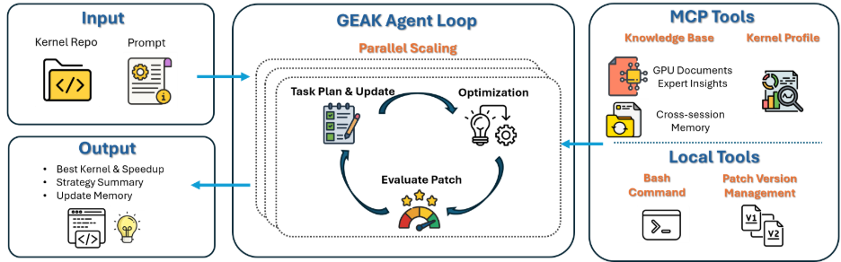

<!---
Copyright (c) 2026 Advanced Micro Devices, Inc. (AMD)

Permission is hereby granted, free of charge, to any person obtaining a copy
of this software and associated documentation files (the "Software"), to deal
in the Software without restriction, including without limitation the rights
to use, copy, modify, merge, publish, distribute, sublicense, and/or sell
copies of the Software, and to permit persons to whom the Software is
furnished to do so, subject to the following conditions:

The above copyright notice and this permission notice shall be included in all
copies or substantial portions of the Software.

THE SOFTWARE IS PROVIDED "AS IS", WITHOUT WARRANTY OF ANY KIND, EXPRESS OR
IMPLIED, INCLUDING BUT NOT LIMITED TO THE WARRANTIES OF MERCHANTABILITY,
FITNESS FOR A PARTICULAR PURPOSE AND NONINFRINGEMENT. IN NO EVENT SHALL THE
AUTHORS OR COPYRIGHT HOLDERS BE LIABLE FOR ANY CLAIM, DAMAGES OR OTHER
LIABILITY, WHETHER IN AN ACTION OF CONTRACT, TORT OR OTHERWISE, ARISING FROM,
OUT OF OR IN CONNECTION WITH THE SOFTWARE OR THE USE OR OTHER DEALINGS IN THE
SOFTWARE.
--->

# GEAK Agent-Driven Optimization of the DeepSeekV4 MLA Kernel

Optimizing LLM inference kernels requires more than a single kernel rewrite. Developers need to migrate reference implementations, analyze profiling results, validate correctness, and iterate quickly across different workload shapes. In this blog, we use DeepSeekV4 MLA as a case study to show how GEAK automates this workflow, from PyTorch-to-Triton migration to kernel-level optimization and SGLang end-to-end(E2E) validation on AMD GPUs.

This work demonstrates that GEAK can automatically drive the kernel optimization loop across implementation generation, profiling analysis, issue localization, optimization iteration, and fix validation. On a representative MI355 Deepseek V4 workload with ISL/OSL=8k/1k, TP=8, and Concurrency=32, the optimized MLA kernel improved E2E throughput by 2.10x and reduced TTFT by 3.71x.

## Background

### GEAK Overview

GEAK is an open-source, AMD-developed agent-driven framework for GPU kernel development and optimization, available at [AMD-AGI/GEAK](https://github.com/AMD-AGI/GEAK/tree/GEAK_v3.2). It automates the kernel optimization workflow by taking a kernel repository and an optimization prompt as input, then iteratively identifying optimization opportunities, modifying the kernel implementation, and evaluating the resulting patches.

GEAK combines an agent loop with MCP and local tools. The figure below shows how GEAK takes a kernel repository and an optimization prompt as input, then iteratively optimizes kernels and evaluates patches.

### DeepSeekV4 MLA Optimization Objective

The PyTorch reference implementation of DeepSeekV4 MLA attention served as the functional and performance baseline for this project. Rather than redesigning the algorithm, our goal was to transform the existing implementation into a high-performance Triton kernel and integrate it reliably into the SGLang inference framework.

The work followed a straightforward optimization flow:

1. Establish the PyTorch baseline;
2. Let GEAK drive the PyTorch-to-Triton migration for both the prefill and decode paths;
3. Let GEAK apply roofline-guided optimization across multiple iterations;
4. Integrate the optimized kernel into SGLang and validate both kernel-level and E2E performance under real workloads.

Throughout this process, we focused on three requirements: robust functional correctness, continuous performance improvement on the MI355 platform, and stable E2E gains after SGLang integration.

## Baseline Implementation and Configuration

### Codebase

The original reference implementation is based on [`FlashMLA/tests/ref.py`](https://github.com/deepseek-ai/FlashMLA/blob/main/tests/ref.py).
The test cases are based on:

* Prefill: [`FlashMLA/tests/test_flash_mla_sparse_prefill.py`](https://github.com/deepseek-ai/FlashMLA/blob/main/tests/test_flash_mla_sparse_prefill.py)
* Decode: [`FlashMLA/tests/test_flash_mla_sparse_decoding.py`](https://github.com/deepseek-ai/FlashMLA/blob/main/tests/test_flash_mla_sparse_decoding.py)

### Configurations

The baseline configurations are summarized below. For the full configuration table, see Appendix.

* For prefill, the benchmark covers eight settings across `h_q=64/128`, `d_qk=512`, `s_q=4096`, `s_kv=8K/32K/48K/64K`, and `topk=512/1024`.
* For decode, the benchmark covers 24 dual-scope configurations and 2 peak-performance cases with only the main scope enabled.
  * For 24 dual-scope configs, the main scope uses `s_kv=16K` with `topk=128`, `block_size=256`, while the extra scope covers `extra_s_k=16K` with `extra_topk=512/1024`.
  * For the 2 peak-performance cases, the main scope uses `s_kv=32K` with `topk=16K`, `block_size=64`.
  * The configurations also vary `h_q=64/128`, `extra_block_size=2/64`, and `batch sizes` values from 2 to 256.

## MLA Kernel Optimization Process

Results are based on AMD testing using the configurations described herein. Performance may vary based on hardware, software versions, workload characteristics, and model configuration.

GEAK automated the main kernel optimization loop for this project. It generated and iterated on Triton kernel implementations, ran profiling and regression validation, localized performance issues, and verified fixes across both prefill and decode paths. This shifted the workflow from manual trial-and-error to a systematic, agent-driven optimization process.

### Prefill Kernel

The prefill optimization focused on block-level tiling, sparse KV access patterns, and compiler optimization.

In the discussion below, `Config 1` and `Config 2` refer to the two prefill configuration groups listed in the appendix. Each group covers four `s_kv` values, resulting in eight prefill configurations in total.

The initial Triton kernel was roughly on par with the baseline for `CONFIG 1`, but only reached 0.67x on `CONFIG 2`. Profiling showed that the main bottlenecks came from sparse KV gather, register pressure, and control-flow overhead.

The first optimization round focused on fusing the sparse attention data path into the Triton kernel. GEAK integrated vectorized KV gather, `topk_length` masking, and attention sink logits handling into the kernel, reducing intermediate tensor materialization and redundant global memory traffic. It then explored tile size, `num_warps`, and `num_stages` configurations to balance memory throughput, parallelism, and register usage. With these changes, the speedup improved to 6.85x on `Config 1` and 4.75x on `Config 2`.

In the second round, GEAK continued the optimization by upgrading to Triton 3.6.0, expanding the autotune search space, and introducing a hybrid bf16/fp32 accumulation strategy. With these changes, the final speedup reached 9.13x on `Config 1` and 6.92x on `Config 2`.

For correctness validation, the 304 test cases from [FlashMLA/tests/test_flash_mla_sparse_prefill.py](https://github.com/deepseek-ai/FlashMLA/blob/main/tests/test_flash_mla_sparse_prefill.py) were reused, and all tests passed the numerical accuracy checks.

### Decode Kernel

The decode path has a more complex execution pattern than prefill. It runs token by token, typically under low-batch and high-concurrency workloads, and needs to retrieve sparse KV blocks from both the main and extra scopes.

Because of this, decode performance is not dominated by the attention computation alone. A large part of the cost comes from the surrounding data path, including sparse gather, dequantization, tensor layout conversion, kernel launch overhead, and coordination between the two KV scopes.

GEAK optimized the decode kernel through four major iterations. The initial Triton version underperformed the baseline, with a geomean speedup of only 0.66x across the 26 decode test configurations. After the full optimization process, the geomean speedup improved to 4.94x.

The first iteration focused on kernel fusion. Fragmented Torch-side operations, including gather and dequantization, were fused into the Triton kernel. This reduced intermediate tensor materialization, enabled vectorized memory access, reused precomputed address offsets, and removed redundant operations such as unnecessary reshapes.

The second iteration focused on simplifying the dual-scope path for the main and extra KV scopes. Instead of handling the two scopes with separate or partially duplicated logic, the tensor layout and memory access pattern were reorganized so both scopes could share a more unified kernel path. This reduced redundant branches, repeated scheduling, and unnecessary data movement between the two scopes.

The third iteration focused on workload-specific kernel configuration. Different vectorization and blocking choices, such as `BLOCK_N`, were evaluated to better match the target decode shapes. Launch and scheduling overhead were also reduced so the kernel could scale more effectively across batch sizes and retrieval sizes. At this stage, the geomean speedup reached over 3.7x.

The final iteration targeted the remaining critical-path overhead and low-occupancy cases. Base pointers were computed ahead of time to reduce repeated address calculations, redundant code paths were simplified, unnecessary branches were removed, and extra data movement and recomputation were eliminated. For shapes with insufficient parallelism, the split-K strategy was expanded to expose more parallel work and improve occupancy. Together with additional autotune configuration optimization, this brought the final geomean speedup across the 26 decode configurations to a stable 4.94x.

For correctness validation, the 4,748 test cases from [FlashMLA/tests/test_flash_mla_sparse_decoding.py](https://github.com/deepseek-ai/FlashMLA/blob/main/tests/test_flash_mla_sparse_decoding.py) were reused, and all tests passed the numerical accuracy checks.

## Roofline-Guided Optimization

During optimization, `rocprof-compute` was used for roofline analysis, and the results were correlated with key low-level metrics, including arithmetic intensity, bandwidth utilization, occupancy, register spills, and bank conflicts.

This analysis helped us avoid several misleading optimization directions:

* Reducing memory traffic did not always improve performance. Some changes reduced global memory accesses but increased VGPR usage, which in turn caused register spills or lower occupancy and led to performance regressions.
* For peak-performance cases, further operator fusion was often less effective than exposing more parallelism and reducing register pressure.

Grounding each optimization step in profiler evidence reduced trial-and-error cost and shifted the workflow from experience-driven tuning to data-driven optimization.

## E2E Validation

Results are based on AMD testing using the configurations described herein. Performance may vary based on hardware, software versions, workload characteristics, and model configuration.

The SGLang baseline for DeepSeekV4 MLA used a TileLang implementation. The TileLang baseline was replaced with the optimized Triton sparse MLA kernel, and E2E performance was compared under the same evaluation setup. The integration PR is available here: [sglang#26208](https://github.com/sgl-project/sglang/pull/26208).

Across multiple concurrency levels, we observed consistent improvements in both performance and accuracy validation:

* Under the 8k/1k, TP=8, Concurrency=2/4/8/16/32 setup, TPUT, TTFT, and ITL all improved.
* E2E throughput improved by approximately 16% to 110% across different concurrency levels, with larger gains at higher concurrency.
* Accuracy validation passed. For example, GSM8K changed from 0.936 to 0.942, which is within the expected range and showed no correctness regression.

A representative result is shown below for ISL/OSL=8k/1k, TP=8, and Concurrency=32:

| Metric | Baseline | Optimized | Improvement |
|:---:|:---:|:---:|:---:|
| TPUT | 3002.29 tok/s | 6293.05 tok/s | 2.10x |
| TTFT | 34620.41 ms | 9321.49 ms | 3.71x |
| ITL | 32.16 ms | 28.63 ms | 1.12x |

## Summary

This DeepSeekV4 MLA work shows that optimizing a complex inference kernel requires a full engineering loop, from implementation generation and profiling to regression validation, issue localization, and fix verification. In this project, GEAK automated this optimization loop, driving the PyTorch-to-Triton migration, iterative kernel optimization, profiling analysis, and validation across both prefill and decode paths.

By automating these steps, GEAK significantly improved optimization productivity and accelerated performance convergence. This case study demonstrates that GEAK has moved beyond agent-assisted development and can now drive automated kernel optimization for complex LLM inference workloads.

## Appendix

### Prefill (8 configs)

| Config | s_q | d_qk | h_q | topk | s_kv |
|---:|---:|---:|---:|---:|---|
| Config 1 | 4096 | 512 | 64 | 512 | 8192, 32768, 49152, 65536 |
| Config 2 | 4096 | 512 | 128 | 1024 | 8192, 32768, 49152, 65536 |

### Decode (26 configs)

| Config | h_q | s_kv (main) | topk (main) | extra_s_k | extra_topk | Total Retrieval | block_size | extra_block_size | batch_size |
|---|---:|---:|---:|---:|---:|---:|---:|---:|---|
| Config 1 | 64 | 16K | 128 | 16K | 512 | 640 | 256 | 64 | 2/64/74/128/148/256 |
| Config 2 | 128 | 16K | 128 | 16K | 1024 | 1152 | 256 | 64 | 2/64/74/128/148/256 |
| Config 3 | 64 | 16K | 128 | 16K | 1024 | 1152 | 256 | 2 | 2/64/74/128/148/256 |
| Config 4 | 128 | 16K | 128 | 16K | 1024 | 1152 | 256 | 2 | 2/64/74/128/148/256 |
| Peak perf Config 2 | 64 | 32K | 16K | N/A | N/A | 16K | 64 | N/A | 148 |
| Peak perf Config 1 | 128 | 32K | 16K | N/A | N/A | 16K | 64 | N/A | 148 |

## Disclaimers

The information presented in this document is for informational purposes only and may contain technical inaccuracies, omissions, and typographical errors. The information contained herein is subject to change and may be rendered inaccurate for many reasons, including but not limited to product and roadmap changes, component and motherboard version changes, new model and/or product releases, product differences between differing manufacturers, software changes, BIOS flashes, firmware upgrades, or the like. Any computer system has risks of security vulnerabilities that cannot be completely prevented or mitigated. AMD assumes no obligation to update or otherwise correct or revise this information.

However, AMD reserves the right to revise this information and to make changes from time to time to the content hereof without obligation of AMD to notify any person of such revisions or changes.

THIS INFORMATION IS PROVIDED “AS IS.” AMD MAKES NO REPRESENTATIONS OR WARRANTIES WITH RESPECT TO THE CONTENTS HEREOF AND ASSUMES NO RESPONSIBILITY FOR ANY INACCURACIES, ERRORS, OR OMISSIONS THAT MAY APPEAR IN THIS INFORMATION. AMD SPECIFICALLY DISCLAIMS ANY IMPLIED WARRANTIES OF NON-INFRINGEMENT, MERCHANTABILITY, OR FITNESS FOR ANY PARTICULAR PURPOSE. IN NO EVENT WILL AMD BE LIABLE TO ANY PERSON FOR ANY RELIANCE, DIRECT, INDIRECT, SPECIAL, OR OTHER CONSEQUENTIAL DAMAGES ARISING FROM THE USE OF ANY INFORMATION CONTAINED HEREIN, EVEN IF AMD IS EXPRESSLY ADVISED OF THE POSSIBILITY OF SUCH DAMAGES.

AMD, the AMD Arrow logo, AMD Instinct, ROCm, and combinations thereof are trademarks of Advanced Micro Devices, Inc. Other product names used in this publication are for identification purposes only and may be trademarks of their respective companies.

© 2026 Advanced Micro Devices, Inc. All rights reserved.
