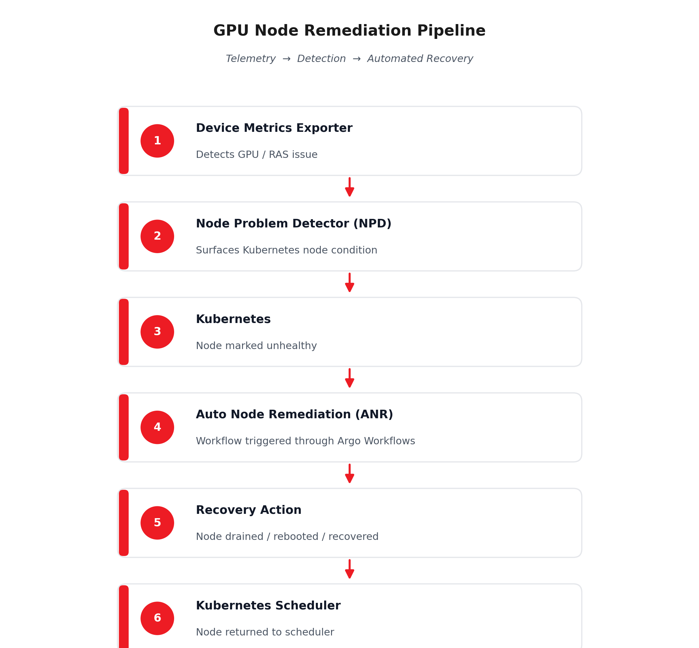

<!---
Copyright (c) 2026 Advanced Micro Devices, Inc. (AMD)

Permission is hereby granted, free of charge, to any person obtaining a copy
of this software and associated documentation files (the "Software"), to deal
in the Software without restriction, including without limitation the rights
to use, copy, modify, merge, publish, distribute, sublicense, and/or sell
copies of the Software, and to permit persons to whom the Software is
furnished to do so, subject to the following conditions:

The above copyright notice and this permission notice shall be included in all
copies or substantial portions of the Software.

THE SOFTWARE IS PROVIDED "AS IS", WITHOUT WARRANTY OF ANY KIND, EXPRESS OR
IMPLIED, INCLUDING BUT NOT LIMITED TO THE WARRANTIES OF MERCHANTABILITY,
FITNESS FOR A PARTICULAR PURPOSE AND NONINFRINGEMENT. IN NO EVENT SHALL THE
AUTHORS OR COPYRIGHT HOLDERS BE LIABLE FOR ANY CLAIM, DAMAGES OR OTHER
LIABILITY, WHETHER IN AN ACTION OF CONTRACT, TORT OR OTHERWISE, ARISING FROM,
OUT OF OR IN CONNECTION WITH THE SOFTWARE OR THE USE OR OTHER DEALINGS IN THE
SOFTWARE.
--->

# AMD GPU Operator v1.5.0: DRA Support, Automated GPU Node Recovery, and Expanded Kubernetes Infrastructure Control

GPU Operator v1.5.0 introduces several major infrastructure capabilities for Kubernetes-based AMD GPU deployments, including support for Kubernetes Dynamic Resource Allocation (DRA), automated GPU node remediation workflows, and Node Problem Detector (NPD) integration.

This release also expands deployment flexibility significantly through:

- Independent Kernel Module Management (KMM) installation and watching controls
- Configurable kubelet socket paths
- Global image pull secret injection
- Host networking support
- Custom package repository support for driver builds

In addition, the managed stack is updated to ROCm 7.2.1 and includes multiple Device Metrics Exporter enhancements, including new ECC metrics, per-process Compute Unit occupancy telemetry, configurable health polling, and lower-latency Unix socket communication between GPU Agent and the exporter.

In this blog, you'll get a practical look at what's new in AMD GPU Operator v1.5.0 and why this release matters for teams running AMD GPUs on Kubernetes. You'll walk through how Dynamic Resource Allocation (DRA) changes the way GPUs are scheduled through DeviceClass and ResourceSlice, how Auto Node Remediation brings Device Metrics Exporter, Node Problem Detector, and Argo Workflows together into a real recovery loop, and how the new KMM, kubelet socket, and image pull secret controls make the Operator far easier to fit into existing cluster setups. You'll also see the Device Metrics Exporter improvements that give you sharper visibility into GPU behavior, including per-process CU occupancy, deferred ECC counters, and a leaner Unix socket path between the GPU Agent and exporter.

## Dynamic Resource Allocation (DRA) Support

Prior to v1.5.0, GPU Operator exposed AMD GPUs exclusively through the Kubernetes Device Plugin framework. GPUs were advertised through the kubelet device plugin API and exposed as allocatable resources directly to the scheduler.

GPU Operator v1.5.0 introduces support for Kubernetes Dynamic Resource Allocation (DRA) through the [AMD GPU DRA Driver](https://github.com/ROCm/k8s-gpu-dra-driver).

DRA changes how accelerators are represented and allocated inside Kubernetes. Instead of statically advertising devices directly through kubelet, DRA introduces Kubernetes-native resource allocation objects such as `DeviceClass` and `ResourceSlice`, enabling scheduler-driven allocation workflows and more flexible resource negotiation.

The AMD GPU DRA Driver publishes GPU resources through the DRA framework instead of the traditional device plugin API, enabling:

- Scheduler-aware GPU allocation
- Fine-grained device selection through `DeviceClass`
- CEL-expression-based resource selection
- GPU sharing between containers within the same pod

Unlike the traditional Device Plugin model, DRA enables multiple containers within a pod to coordinate access to the same GPU resources. This is particularly useful for tightly coupled AI workflows where inference containers, preprocessing pipelines, or sidecar services need shared accelerator access.

DRA support is configured through the `DeviceConfig` CR:

```yaml
spec:
  draDriver:
    enable: true
    image: rocm/k8s-gpu-dra-driver:latest

  devicePlugin:
    enableDevicePlugin: false
```

Readers can deploy the AMD GPU DRA Driver in either of two ways:

- **Enable DRA through GPU Operator:** set `spec.draDriver.enable: true` in the `DeviceConfig` CR and let GPU Operator deploy and manage the DRA driver components.
- **Install the DRA driver standalone:** follow the Helm installation commands in the [AMD GPU DRA Driver v1.0.0 release notes](https://github.com/ROCm/k8s-gpu-dra-driver/releases/tag/v1.0.0).

Once applied, GPU Operator automatically:

1. Deploys the AMD GPU DRA Driver
2. Creates the required `DeviceClass` objects
3. Detects the highest supported DRA API version available on the cluster
4. Publishes GPU resources through the DRA framework

The operator dynamically negotiates between:

- `resource.k8s.io/v1`
- `resource.k8s.io/v1beta2`
- `resource.k8s.io/v1beta1`

allowing the same deployment to work across:

- Kubernetes 1.32–1.35
- OpenShift 4.21

without requiring manual API version selection.

GPU Operator also validates that DRA and the traditional Device Plugin are mutually exclusive on the same `DeviceConfig`:

```yaml
spec:
  draDriver:
    enable: true

  devicePlugin:
    enableDevicePlugin: true   # Invalid configuration
```

This validation is important because both systems expose GPU resources differently. Running both simultaneously would create conflicting allocation paths and duplicate device advertisement inside Kubernetes.

For OpenShift environments, GPU Operator automatically creates the required RBAC resources and SecurityContextConstraints (SCCs) for the DRA Driver deployment.

DRA support requires:

- Kubernetes 1.32+
- `DynamicResourceAllocation` feature gate enabled
- `amdgpu` kernel module loaded on worker nodes
- CDI enabled in the container runtime

CDI is enabled by default in:

- containerd 2.0+
- CRI-O

Operationally, DRA support aligns AMD GPU infrastructure with Kubernetes' newer resource allocation model instead of relying exclusively on static kubelet device advertisement.

## Automated GPU Node Remediation (ANR) and Node Problem Detector (NPD)

GPU Operator v1.5.0 introduces Auto Node Remediation (ANR), enabling automatic recovery workflows for unhealthy GPU worker nodes.

In distributed AI environments, GPU node instability is particularly disruptive because training workloads often rely on tightly synchronized collective communication patterns. A single unhealthy worker can interrupt all-reduce operations, degrade training throughput, or force entire workloads to restart.

Prior to v1.5.0, remediation typically required manual operational steps:

- Identifying unhealthy nodes
- Draining workloads
- Rebooting systems
- Returning nodes back into service

GPU Operator now automates this workflow through integration between:

- **Device Metrics Exporter (DME)**
- **Node Problem Detector (NPD)**
- **Argo Workflows**

Operationally, the remediation pipeline works as follows:



This integration allows GPU telemetry to directly influence Kubernetes node lifecycle management instead of remaining isolated inside monitoring dashboards or Prometheus metrics.

Examples of GPU-related conditions that can now be surfaced through NPD include:

- Inband RAS errors reported through Device Metrics Exporter
- GPU health degradation conditions
- Repeated ECC error accumulation
- Exporter-detected hardware fault conditions

Once surfaced as Kubernetes node conditions, these events can trigger:

- Auto Node Remediation workflows
- Scheduler avoidance policies
- Cluster-wide alerting systems
- Infrastructure automation pipelines

ANR behavior is configured through the `DeviceConfig` CR:

```yaml
spec:
  remediation:
    maxParallelWorkflows: 1
    recoveryPolicy: reboot
    drainPolicy: always
```

The release introduces several operational controls around remediation behavior:

### `maxParallelWorkflows`

Limits the number of simultaneous remediation events occurring in the cluster, preventing cascading node recovery operations during broader infrastructure instability.

### `recoveryPolicy`

Controls how unhealthy nodes are recovered:

- reboot
- reset
- custom recovery behavior

### `drainPolicy`

Controls workload eviction behavior prior to remediation.

### Sequential and Time-Window Conditions

Prevent multiple nodes from entering remediation simultaneously within defined intervals.

### Custom Taints

Allow unhealthy nodes to be isolated from scheduler placement during recovery workflows.

The remediation pipeline also improves workflow reliability operationally by:

- Pulling workflow state directly from the Argo API server
- Avoiding race conditions caused by delayed pod state observation
- Failing workflows immediately when steps enter `ImagePullBackOff`
- Handling reboot-step failures gracefully

ANR support is validated on:

- Vanilla Kubernetes
- OpenShift

and requires Argo Workflows v4.0.3.

NPD integration also supports multiple authentication models, including:

- Bearer token authentication
- RBAC HTTP authentication
- Root CA validation
- mTLS-protected metrics endpoints

This simplifies integration into enterprise Kubernetes environments with stricter security controls.

## Expanded KMM and Deployment Flexibility

GPU Operator v1.5.0 significantly expands deployment flexibility for heterogeneous Kubernetes environments.

One of the most important changes is the separation of:

- **KMM installation**
- **KMM resource watching**

Prior to v1.5.0, setting:

```yaml
kmm.enabled=false
```

disabled both:

- KMM installation
- GPU Operator KMM integration

This made it difficult to integrate GPU Operator into environments where KMM was already deployed and managed externally.

v1.5.0 introduces independent controls:

```yaml
kmm:
  enabled: false
  watch: true
```

This allows GPU Operator to:

- Consume existing KMM resources
- Avoid reinstalling KMM
- Integrate with externally managed KMM deployments

Additional supported deployment patterns now include:

### Skip KMM Entirely

```yaml
kmm:
  enabled: false
  watch: false
```

### Install KMM without GPU Operator Integration

```yaml
kmm:
  enabled: true
  watch: false
```

This is particularly useful in environments where:

- Kernel modules are managed externally
- Infrastructure teams already operate centralized KMM deployments
- GPU Operator should not own the kernel module lifecycle

The release also adds configurable kubelet socket paths for:

- Device Plugin
- Metrics Exporter

through:

```yaml
spec:
  devicePlugin:
    kubeletSocketPath: /custom/device-plugins

  metricsExporter:
    podResourceAPISocketPath: /custom/pod-resources
```

This improves compatibility with:

- MicroK8s
- k3s
- Custom kubelet layouts

GPU Operator v1.5.0 also introduces support for custom package repository URLs and custom GPG key URLs during in-cluster driver image builds:

```yaml
spec:
  driver:
    imageBuild:
      packageRepoURL: https://mirror.example.com/repo
      gpgKeyURL: https://mirror.example.com/gpg.key
```

This is particularly useful for:

- Air-gapped environments
- Mirrored repositories
- Restricted-network deployments

Additional deployment flexibility improvements include:

- Optional `hostNetwork` support for Device Plugin and Metrics Exporter
- Global image pull secret injection across all operator-managed workloads

Global image pull secrets can now be configured centrally:

```yaml
spec:
  commonConfig:
    imageRegistrySecrets:
      - regcred
```

This propagates registry credentials automatically across:

- DRA Driver
- Metrics Exporter
- Device Plugin
- Driver build/sign pods
- ANR workflows
- Node Labeller
- Test runner workloads

reducing duplicated registry configuration in private-registry environments.

## Device Metrics Exporter Enhancements

GPU Operator v1.5.0 also includes several significant Device Metrics Exporter (DME) enhancements.

GPU Agent communication now uses a Unix Domain Socket:

```text
/var/run/gpuagent.sock
```

instead of TCP/IP.

This reduces:

- Local IPC overhead
- Unnecessary network stack traversal
- Local attack surface

while improving communication efficiency between the GPU Agent and exporter.

The release also introduces:

### `GPU_PROCESS_CU_OCCUPANCY`

Per-process Compute Unit occupancy telemetry with `process_id` labeling.

This provides visibility into:

- Process-level GPU utilization
- Workload occupancy distribution
- GPU contention patterns

for multi-process AI and HPC workloads.

### `GPU_ECC_DEFERRED_*`

Deferred ECC counters for ECC-supported blocks.

These metrics help identify:

- Latent hardware degradation
- Deferred ECC accumulation trends
- Early hardware instability indicators

before they escalate into fatal GPU failures.

### Configurable Sampling and Health Polling

Profiler sampling intervals are now configurable:

```yaml
samplingInterval: 1000
```

allowing operators to balance:

- Telemetry granularity
- Exporter overhead
- Prometheus storage growth

Health polling intervals are also configurable through duration strings:

```yaml
PollingRate: 5m
```

Supported values range from:

- 30 seconds
- up to 24 hours

### `KFD_PROCESS_ID` Disabled by Default

`KFD_PROCESS_ID` labeling is now disabled by default to reduce Prometheus cardinality overhead.

In large GPU clusters, enabling process-level labels can significantly increase:

- TSDB growth
- Prometheus memory consumption
- Query execution overhead

because each GPU/process combination generates unique metric series across every scrape interval.

Operators requiring process-level attribution can still re-enable the label through the exporter ConfigMap.

## Example End-to-End Operational Workflow

Consider a multi-node MI300 training cluster running Kubernetes 1.34 with DRA enabled.

1. GPUs are exposed through the AMD GPU DRA Driver instead of the traditional Device Plugin
2. Node Feature Discovery labels GPU-capable worker nodes
3. Device Metrics Exporter continuously surfaces GPU health and RAS telemetry
4. Node Problem Detector converts hardware fault conditions into Kubernetes node conditions
5. Auto Node Remediation automatically drains and reboots unhealthy nodes
6. Kubernetes reschedules workloads onto healthy GPU workers

This creates a tighter operational loop among telemetry, scheduling, remediation, and workload recovery than was possible in previous GPU Operator releases.

than previous GPU Operator releases.

## Summary

GPU Operator v1.5.0 significantly expands the operational scope of AMD GPU infrastructure in Kubernetes.

DRA support introduces a newer Kubernetes-native GPU allocation model built around `DeviceClass` and scheduler-driven resource allocation. ANR and NPD integration move GPU failure handling into automated remediation workflows tied directly to Kubernetes node health state.

Combined with enhanced telemetry from Device Metrics Exporter and updated ROCm 7.2.1 stack support, v1.5.0 strengthens how platform teams deploy, monitor, and recover GPU infrastructure in production AI and HPC clusters.

## Additional Resources

- GPU Operator Documentation: [https://instinct.docs.amd.com/projects/gpu-operator/en/latest/](https://instinct.docs.amd.com/projects/gpu-operator/en/latest/)
- AMD GPU DRA Driver: [https://github.com/ROCm/k8s-gpu-dra-driver](https://github.com/ROCm/k8s-gpu-dra-driver)
- AMD GPU DRA Driver v1.0.0 Release: [https://github.com/ROCm/k8s-gpu-dra-driver/releases/tag/v1.0.0](https://github.com/ROCm/k8s-gpu-dra-driver/releases/tag/v1.0.0)

## Disclaimers

The information presented in this document is for informational purposes only and may contain technical inaccuracies, omissions, and typographical errors. The information contained herein is subject to change and may be rendered inaccurate for many reasons, including but not limited to product and roadmap changes, component and motherboard version changes, new model and/or product releases, product differences between differing manufacturers, software changes, BIOS flashes, firmware upgrades, or the like. Any computer system has risks of security vulnerabilities that cannot be completely prevented or mitigated. AMD assumes no obligation to update or otherwise correct or revise this information.

However, AMD reserves the right to revise this information and to make changes from time to time to the content hereof without obligation of AMD to notify any person of such revisions or changes.
THIS INFORMATION IS PROVIDED ‘AS IS.” AMD MAKES NO REPRESENTATIONS OR WARRANTIES WITH RESPECT TO THE CONTENTS HEREOF AND ASSUMES NO RESPONSIBILITY FOR ANY INACCURACIES, ERRORS, OR OMISSIONS THAT MAY APPEAR IN THIS INFORMATION. AMD SPECIFICALLY DISCLAIMS ANY IMPLIED WARRANTIES OF NON-INFRINGEMENT, MERCHANTABILITY, OR FITNESS FOR ANY PARTICULAR PURPOSE. IN NO EVENT WILL AMD BE LIABLE TO ANY PERSON FOR ANY RELIANCE, DIRECT, INDIRECT, SPECIAL, OR OTHER CONSEQUENTIAL DAMAGES ARISING FROM THE USE OF ANY INFORMATION CONTAINED HEREIN, EVEN IF AMD IS EXPRESSLY ADVISED OF THE POSSIBILITY OF SUCH DAMAGES.
AMD, the AMD Arrow logo, [insert all other AMD trademarks used in the material here per AMD Trademarks] and combinations thereof are trademarks of Advanced Micro Devices, Inc. Other product names used in this publication are for identification purposes only and may be trademarks of their respective companies. [Insert any third party trademark attribution here per AMD's Third Party Trademark List.]
© Advanced Micro Devices, Inc. All rights reserved
