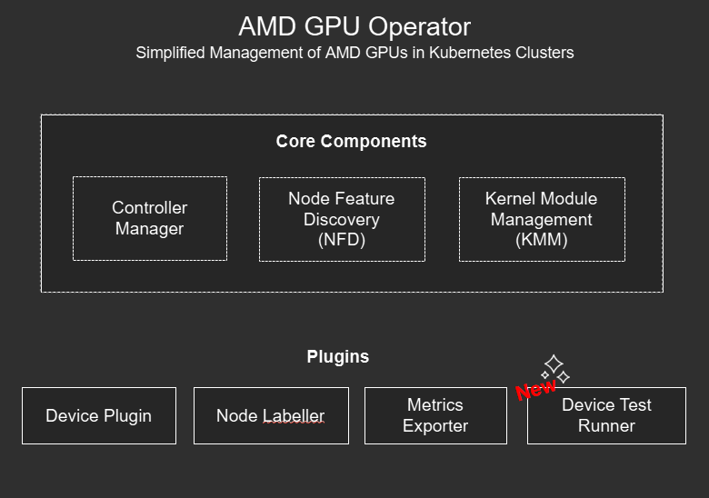

<!---
Copyright (c) 2025 Advanced Micro Devices, Inc. (AMD)

Permission is hereby granted, free of charge, to any person obtaining a copy
of this software and associated documentation files (the "Software"), to deal
in the Software without restriction, including without limitation the rights
to use, copy, modify, merge, publish, distribute, sublicense, and/or sell
copies of the Software, and to permit persons to whom the Software is
furnished to do so, subject to the following conditions:

The above copyright notice and this permission notice shall be included in all
copies or substantial portions of the Software.

THE SOFTWARE IS PROVIDED "AS IS", WITHOUT WARRANTY OF ANY KIND, EXPRESS OR
IMPLIED, INCLUDING BUT NOT LIMITED TO THE WARRANTIES OF MERCHANTABILITY,
FITNESS FOR A PARTICULAR PURPOSE AND NONINFRINGEMENT. IN NO EVENT SHALL THE
AUTHORS OR COPYRIGHT HOLDERS BE LIABLE FOR ANY CLAIM, DAMAGES OR OTHER
LIABILITY, WHETHER IN AN ACTION OF CONTRACT, TORT OR OTHERWISE, ARISING FROM,
OUT OF OR IN CONNECTION WITH THE SOFTWARE OR THE USE OR OTHER DEALINGS IN THE
SOFTWARE.
--->

# What's New in the AMD GPU Operator v1.2.0 Release

The GPU Operator v1.2.0 release introduces significant new features, including **GPU health monitoring**, **automated component and driver upgrades**, and a new **device test runner** component for enhanced validation and troubleshooting. These improvements aim to increase reliability, streamline upgrades, and provide enhanced visibility into GPU health.

## Key Features

This new release adds the following enhancements:

- **Automated GPU Operator and GPU Driver Upgrades**
  - Automatic and manual upgrades of the Device Plugin, Node Labeller, Metrics Exporter and Test Runner via configurable upgrade policies
  - Automatic driver upgrades are now supported with node cordon, drain, version tracking and optional node reboot

- **Release of our Source Code**
  - GPU Operator code has been open-sourced under [https://github.com/ROCm/gpu-operator](https://github.com/ROCm/gpu-operator)
  - Device Metrics Exporter code has been open-sourced under [https://github.com/ROCm/device-metrics-exporter](https://github.com/ROCm/device-metrics-exporter)
  - GPUAgent code has been open-sourced under [https://github.com/ROCm/gpu-agent](https://github.com/ROCm/gpu-agent), used by the Device Metrics Exporter

- **Test Runner for GPU Diagnostics**
  - Automated testing of unhealthy GPUs
  - Pre-start job tests embedded in workload pods
  - Manual and scheduled GPU tests with event logging and result tracking

- **GPU Health Monitoring**
  - Real-time health checks via **metrics exporter**
  - Integration with **Kubernetes Device Plugin** for automatic removal of unhealthy GPUs from compute node schedulable resources
  - Customizable health thresholds via K8s ConfigMaps

For a full description of features see the [AMD GPU Operator Release Notes](https://instinct.docs.amd.com/projects/gpu-operator/en/main/releasenotes.html).

<small>*These features are currently only enabled for Ubuntu 22.04 and 24.04, however Red Hat OpenShift support is coming in the next few weeks.</small>

## Operator and Driver Upgrades Made Easier

### GPU Operator Upgrades

One of the main things we set out to do in this release of the GPU Operator was to elevate the GPU Operator capabilities to Level II as defined by the [Operator Framework](https://operatorframework.io/operator-capabilities/). The defining feature of a Level II Operator is the ability to do seamless upgrades. Upgrading the GPU Operator is simple and easy in this new version, by leveraging the `helm upgrade` command and specifying the version you want to upgrade to, helm will take care of all the heavy lifting.

```bash
helm upgrade amd-gpu-operator rocm/gpu-operator-charts -n kube-amd-gpu --version=v1.2.0
```

The upgrade process includes pre-upgrade hooks to detect if there are currently any node driver upgrades in progress to ensure the upgrade only occurs when it is safe to do so. The above upgrade takes care of upgrading the GPU Operator core components, the **Controller Manager**, **Node Feature Discovery (NFD)** and **Kernel Module Management (KMM)**.

### GPU Operator Component Upgrades

What if you want to upgrade the GPU Operator plugin components? The **Device Plugin**, **Node Labeller**, **Device Metrics Exporter** and new **Device Test Runner** can all be upgraded by changing the container image tag reference to a newer version (`v1.2.0` in the below example), making sure to also set the desired upgradePolicy for each component. The below `RollingUpdate` policy ensures that component updates are staggered and only one node is upgraded at a time. If a more user interactive approach is desired the upgradePolicy can be set to `OnDelete` whereby upgrades will only happen if a user deletes the existing pod ([see the  documentation for more details](https://instinct.docs.amd.com/projects/gpu-operator/en/latest/upgrades/componentupgrades.html)).

```yaml
metricsExporter:
        image: rocm/device-metrics-exporter:v1.2.0
        upgradePolicy:
          upgradeStrategy: RollingUpdate
          maxUnavailable: 1
```

### GPU Driver Upgrades

With this release not only do you now have the ability to easily upgrade and downgrade the GPU Operator and it's components, but we have also extended the GPU Driver Lifecycle management to allow for upgrading of GPU Drivers to different ROCm versions. Through this new [Automatic Driver Upgrade](https://instinct.docs.amd.com/projects/gpu-operator/en/latest/drivers/upgrading.html#automatic-upgrade-process) process the GPU Operator now supports node cordon, drain, and driver version tracking to ensure no pods can be scheduled on the nodes getting upgraded. As well, similar to the GPU Operator component upgrades an `upgradePolicy` can be defined to specify the number of nodes to upgrade at one time (`maxParallelUpgrades`), number of nodes that can become offline (either cordoned or failed) during the driver upgrade process (`maxUnavailableNodes`) and whether to automatically perform an optional node reboot (`rebootRequired`). Tracking the driver upgrade process across your entire GPU fleet can be achieved via a new set of [status states](https://instinct.docs.amd.com/projects/gpu-operator/en/latest/drivers/upgrading.html#track-the-upgrade-status-through-cr-status) that can be queried for each node in your cluster.

## We've Gone Open-Source!

This release also marks a new milestone in the development efforts of the GPU Operator, one we have been working hard behind the scenes to get towards. In line with AMD's strong commitment to open-source we are happy to announce that we have now published the source code for the AMD GPU Operator, Device Metrics Exporter and GPU Agent, each in their respective ROCm repositories. The GPU agent is a newly public software agent that is being used by the Metrics Exporter:

- **AMD GPU Operator**: [https://github.com/ROCm/gpu-operator](https://github.com/ROCm/gpu-operator)
- **Device Metrics Exporter**: [https://github.com/ROCm/device-metrics-exporter](https://github.com/ROCm/device-metrics-exporter)
- **GPU Agent**: [https://github.com/ROCm/device-metrics-exporter](https://github.com/ROCm/device-metrics-exporter)

These repositories are licensed under the [Apache License 2.0](https://github.com/ROCm/gpu-operator/blob/main/LICENSE), allowing anyone to customize, enhance and even contribute to the development efforts. In addition, we will continue to respond to any GitHub issues open in these repos and welcome the reporting of any bugs/issues or feedback.

## Device Test Runner

If you haven't heard the AMD GPU Operator family has a new component added to it's ranks, the **Device Test Runner**.



This new test runner component offers hardware validation, diagnostics and benchmarking capabilities for your GPU Worker nodes. The new capabilities include:

- Automatically triggering of configurable tests on unhealthy GPUs

- Scheduling or Manually triggering tests within the Kubernetes cluster

- Running pre-start job tests as init containers within your GPU workload pods to ensure GPU health and stability before execution of long running jobs

- Reporting test results as Kubernetes events

Under the hood the Device Test runner leverages the ROCm Validation Suite (RVS) to run any number of tests including GPU stress tests, PCIE bandwidth benchmarks, memory tests, and longer burn-in tests if so desired. The DeviceConfig custom resource has also been updated to provide new configuration options for the Test Runner:

```bash
  testRunner:
    # To enable/disable the testrunner, disabled by default
    enable: True

    # testrunner image
    image: docker.io/rocm/test-runner:v1.2.0-beta.0

    # image pull policy for the testrunner
    # default value is IfNotPresent for valid tags, Always for no tag or "latest" tag
    imagePullPolicy: "Always"

    # specify the mount for test logs
    logsLocation:
      # mount path inside test runner container
      mountPath: "/var/log/amd-test-runner"

      # host path to be mounted into test runner container
      hostPath: "/var/log/amd-test-runner"
```

For more information on the Device Test Runner check out the [AMD GPU Operator documentation](https://instinct.docs.amd.com/projects/gpu-operator/en/latest/test/auto-unhealthy-device-test.html).

## GPU Health Monitoring

We've intentionally saved the best new AMD GPU Operator feature for last and that is the enhancement we've made to the Device Metrics Exporter and Kubernetes Device Plugin components for the v1.2.0 release of the GPU Operator. The Metric Exporter now has the capability to check for unhealthy GPUs via the monitoring of ECC Errors that can occur when a GPU is not functioning as expected. When an ECC error is detected the Metrics Exporter will now mark the offending GPU as unhealthy and add a node label to indicate which GPU on the node is unhealthy. The Kubernetes Device Plugin also listens to the health metrics coming from the Metrics Exporter to determine GPU status, marking GPUs as schedulable if healthy and unschedulable if unhealthy.

This health check workflow runs automatically on every node the Device Metrics Exporter is running on, with the Metrics Exporter polling GPUs every 30 seconds and the device plugin checking health status at the same interval, ensuring updates within one minute. Users can customize the default ECC error threshold (set to 0) via the `HealthThresholds` field in the metrics exporter ConfigMap. As part of this workflow healthy GPUs are made available for Kubernetes job scheduling, while ensuring no new jobs are scheduled on an unhealthy GPUs.

## Seeing the New GPU Health Monitoring in Action!

While no one wants their GPUs to fail, we understand the need for platform engineers and system administrators to be able to test and plan for GPU failures. As such we have added a new `metricsclient` to the Device Metrics Exporter pod that can be used to inject ECC errors into an otherwise healthy GPU for testing the above health check workflow. This is fairly simple and don't worry this does not harm your GPU as any errors that are being injected are debugging in nature and not real errors. The steps to do this have been outlined below:

### 1. Set Node Name

Use an environment variable to set the Kubernetes node name to indicate which node you want to test error injection on:

```bash
NODE_NAME=<node-name>
```

Replace <node-name> with the name of the node you want to test. If you are running this from the same node you want to test you can grab the hostname using:

```bash
NODE_NAME=$(hostname)
```

### 2. Set Metrics Exporter Pod Name

Since you have to execute the `metricsclient` from directly within the Device Metrics Exporter pod we need to get the Metrics Exporter pod name running on the node:

```bash
METRICS_POD=$(kubectl get pods -n kube-amd-gpu --field-selector spec.nodeName=$NODE_NAME --no-headers -o custom-columns=":metadata.name" | grep '^gpu-operator-metrics-exporter-' | head -n 1)
```

### 3. Check Metrics Client to see GPU Health

Now that you have the name of the metrics exporter pod you can use the metricsclient to check the current health of all GPUs on the node:

```bash
kubectl exec -n kube-amd-gpu $METRICS_POD -c metrics-exporter-container -- metricsclient
```

You should see a list of all the GPUs on that node along with their corresponding status. In most cases all GPUs should report as being `healthy`.

```bash
ID      Health  Associated Workload
------------------------------------------------
1       healthy []
0       healthy []
7       healthy []
6       healthy []
5       healthy []
4       healthy []
3       healthy []
2       healthy []
------------------------------------------------
```

### 4. Inject ECC Errors on GPU 0

In order to simulate errors on a GPU we will be using a json file that specifies a GPU ID along with counters for several ECC Uncorrectable error fields that are being monitored by the Device Metrics Exporter. In the below example you can see that we are specifying `GPU 0` and injecting 1 `GPU_ECC_UNCORRECT_SEM` error and 2 `GPU_ECC_UNCORRECT_FUSE` errors. We use the `metricslient -ecc-file-path <file.json>` command to specify the json file we want to inject into the metrics table. To create the json file and execute the metricsclient command all in in one go run the following:

```bash
kubectl exec -n kube-amd-gpu $METRICS_POD -c metrics-exporter-container -- sh -c 'cat > /tmp/ecc.json <<EOF
{
        "ID": "0",
        "Fields": [
                "GPU_ECC_UNCORRECT_SEM",
                "GPU_ECC_UNCORRECT_FUSE"
        ],
        "Counts" : [
                1, 2
        ]
}
EOF
metricsclient -ecc-file-path /tmp/ecc.json'
```

The metricsclient should report back the current status of the GPUs as well as the new json string you just injected.

```bash
ID      Health  Associated Workload
------------------------------------------------
6       healthy []
5       healthy []
4       healthy []
3       healthy []
2       healthy []
1       healthy []
0       healthy []
7       healthy []
------------------------------------------------
{"ID":"0","Fields":["GPU_ECC_UNCORRECT_SEM","GPU_ECC_UNCORRECT_FUSE"]}
```

### 5. Query the Mericsclient to See the Unhealthy GPU

Since the Metric Exporter will check every 30 seconds for GPU health status you will need to wait this amount of time before executing the following command again to see the unhealthy GPU:

```bash
kubectl exec -n kube-amd-gpu $METRICS_POD -c metrics-exporter-container -- metricsclient
```

You should now see that one of the GPUs, `GPU 0`, in this case has been marked as unhealthy:

```bash
 ID      Health  Associated Workload
------------------------------------------------
0       unhealthy       []
7       healthy []
6       healthy []
5       healthy []
4       healthy []
3       healthy []
2       healthy []
1       healthy []
------------------------------------------------
```

### 6. Checking the Unhealthy GPU Node label

The Metrics Exporter should of also added an unhealthy GPU label to your affected node to identify which GPU is unhealthy. Run the following to check for unhealth gpu node labels:

```bash
kubectl describe node $NODE_NAME | grep unhealthy
```

The command should return back one label indicating `gpu.0.state` as unhealthy:

```yaml
metricsexporter.amd.com.gpu.0.state=unhealthy
```

### 7. Check Number of Allocatable GPUs

In order to confirm that the unhealthy GPU resource has in fact been removed from the Kubernetes Scheduler we can check the number of total GPUs on the node and compare it with the number of allocatable GPUs. To do so run the following:

```bash
kubectl get nodes -o custom-columns=NAME:.metadata.name,"Total GPUs:.status.capacity.amd\.com/gpu","Allocatable GPUs:.status.allocatable.amd\.com/gpu"
```

You should now have one less GPU that is allocatable on your node:

```bash
NAME                     Total GPUs   Allocatable GPUs
amd-mi300x-gpu-worker1   8            7
```

### 8. Clear ECC Errors on GPU 0

Now that we have tested to ensure the Health Check workflow is working we can clear the ECC errors on GPU0 by using the metrics client in a similar fashion to 4. This time we are setting the error counts to 0 for both GPU_ECC_UNCORRECT error fields.

```bash
kubectl exec -n kube-amd-gpu $METRICS_POD -c metrics-exporter-container -- sh -c 'cat > /tmp/delete_ecc.json <<EOF
{
        "ID": "0",
        "Fields": [
                "GPU_ECC_UNCORRECT_SEM",
                "GPU_ECC_UNCORRECT_FUSE"
        ],
        "Counts" : [
                0, 0
        ]
}
EOF
metricsclient -ecc-file-path /tmp/delete_ecc.json'
```

### 9. Check to see GPU 0 Become Healthy Again

After waiting another 30 seconds or so you can check the metrics client again to see that all GPUs are now healthy again:

```bash
kubectl exec -n kube-amd-gpu $METRICS_POD -c metrics-exporter-container -- metricsclient
```

You should see the following:

```bash
ID      Health  Associated Workload
------------------------------------------------
4       healthy []
3       healthy []
2       healthy []
1       healthy []
0       healthy []
7       healthy []
6       healthy []
5       healthy []
------------------------------------------------
```

### 10. Check that all GPUs are Allocatable Again

Lastly check the number of allocatable GPUs on your node to ensure that it matches the total number of GPUs:

```bash
kubectl get nodes -o custom-columns=NAME:.metadata.name,"Total GPUs:.status.capacity.amd\.com/gpu","Allocatable GPUs:.status.allocatable.amd\.com/gpu"
```

Congrats! You have successfully tested the new GPU Health Check Feature. We can't wait to see how this will enhance the montioring and management of your AMD GPU fleet.

## Bonus: Device Metrics Exporter Standalone Debian Package Install

Finally, it's worth mentioning that for those wanting GPU Metrics reporting, but do not want to run Kubernetes or Docker we have released a [Standalone Debian package](https://instinct.docs.amd.com/projects/device-metrics-exporter/en/latest/installation/deb-package.html) that can be installed via apt. This standalone package has the same functionality as it's Kubernetes counterpart. For a full list of supported metrics see our newly published [List of Available Metrics](https://instinct.docs.amd.com/projects/device-metrics-exporter/en/latest/configuration/metricslist.html).

## What's Next for AMD GPUs on Kubernetes?

The next release of the AMD GPU Operator, **v1.2.1**, is just around the corner and is a minor release set to bring Red Hat OpenShift support for the same automated driver upgrades and health check features that the v1.2.0 release, described above, enabled for Ubuntu. While these features aren't enabled just yet for OpenShift they will be soon. As an added bonus the v1.2.1 release will include support for **Red Hat OpenShift 4.18**.

As we continue to enhance our Kubernetes Software offerings we will continue to strive to improve the deployment of AMD Instinct GPUs in large data center, cloud and enterprise cluster deployments. We will also continue to work with our Partners to expand OS & Platform support for these offerings. Some of the future roadmap enhancements will include:

- GPU Partitioning Support on Kubernetes
- Virtualization Support on Kubernetes
- Additional Health Check metrics and thresholds

We have even more new features planned for future releases that we will be sharing in the coming months.

As always, please visit our comprehensive Instinct Docs documentation sites to learn more about each component:

- **AMD GPU Operator**: [Documentation](https://instinct.docs.amd.com/projects/gpu-operator/en/latest/) | [GitHub](https://github.com/ROCm/gpu-operator)
- **Device Metrics Exporter**: [Documentation](https://instinct.docs.amd.com/projects/device-metrics-exporter/en/latest/) | [GitHub](https://github.com/ROCm/device-metrics-exporter)
- **GPU Agent**: [GitHub](https://github.com/ROCm/gpu-agent)

## Disclaimers

Third-party content is licensed to you directly by the third party that owns the
content and is not licensed to you by AMD. ALL LINKED THIRD-PARTY CONTENT IS
PROVIDED “AS IS” WITHOUT A WARRANTY OF ANY KIND. USE OF SUCH THIRD-PARTY CONTENT
IS DONE AT YOUR SOLE DISCRETION AND UNDER NO CIRCUMSTANCES WILL AMD BE LIABLE TO
YOU FOR ANY THIRD-PARTY CONTENT. YOU ASSUME ALL RISK AND ARE SOLELY RESPONSIBLE
FOR ANY DAMAGES THAT MAY ARISE FROM YOUR USE OF THIRD-PARTY CONTENT.
