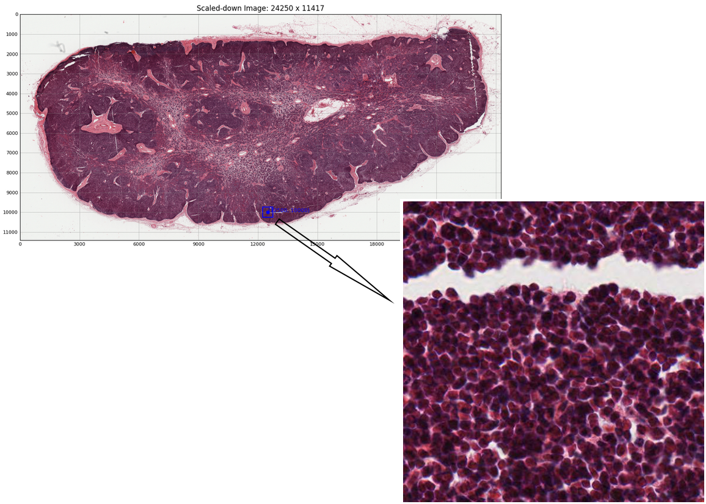
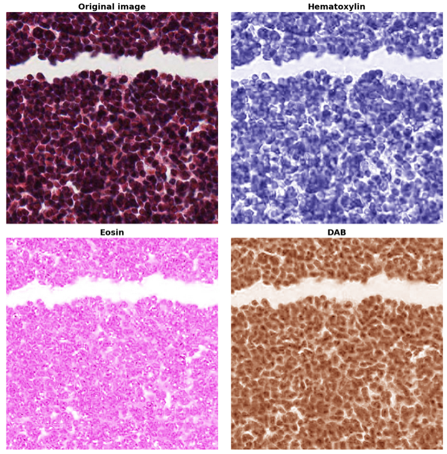
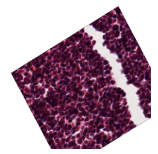
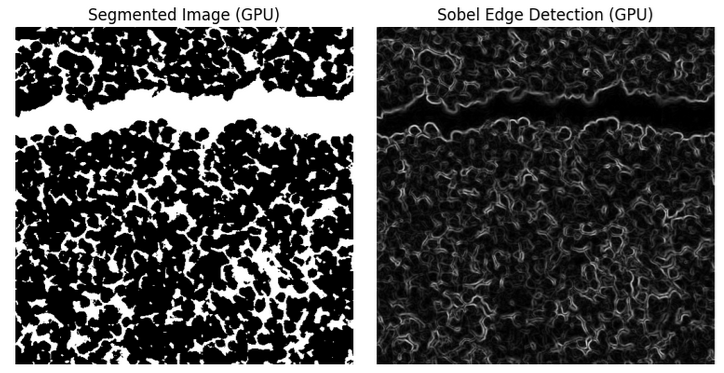
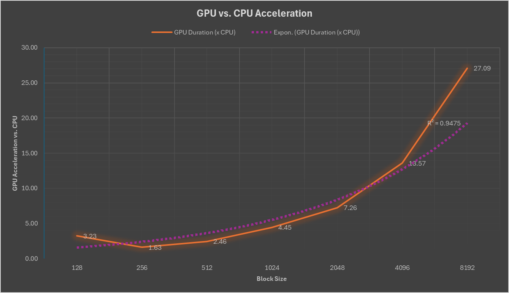

<!---
Copyright (c) 2025 Advanced Micro Devices, Inc. (AMD)

Permission is hereby granted, free of charge, to any person obtaining a copy
of this software and associated documentation files (the "Software"), to deal
in the Software without restriction, including without limitation the rights
to use, copy, modify, merge, publish, distribute, sublicense, and/or sell
copies of the Software, and to permit persons to whom the Software is
furnished to do so, subject to the following conditions:

The above copyright notice and this permission notice shall be included in all
copies or substantial portions of the Software.

THE SOFTWARE IS PROVIDED "AS IS", WITHOUT WARRANTY OF ANY KIND, EXPRESS OR
IMPLIED, INCLUDING BUT NOT LIMITED TO THE WARRANTIES OF MERCHANTABILITY,
FITNESS FOR A PARTICULAR PURPOSE AND NONINFRINGEMENT. IN NO EVENT SHALL THE
AUTHORS OR COPYRIGHT HOLDERS BE LIABLE FOR ANY CLAIM, DAMAGES OR OTHER
LIABILITY, WHETHER IN AN ACTION OF CONTRACT, TORT OR OTHERWISE, ARISING FROM,
OUT OF OR IN CONNECTION WITH THE SOFTWARE OR THE USE OR OTHER DEALINGS IN THE
SOFTWARE.
--->

# Announcing hipCIM: A Cutting-Edge Solution for Accelerated Multidimensional Image Processing

In the rapidly evolving landscape of data science and computational imaging, hipCIM 1.0.0 introduces a
powerful, GPU-accelerated open-source library that redefines multidimensional image processing for
life sciences, biomedical research, and computational imaging. This open-source, accelerated software
library redefines how multidimensional datasets are processed, offering unparalleled capabilities
across scientific fields such as biomedical imaging, geospatial analytics, material sciences, life
sciences, and remote sensing to name a few. With the initial release of hipCIM 1.0.0, AMD enters the
arena, ready to push the boundaries of life science research and stand at the forefront of a new era
in multidimensional image processing.

In this blog, we introduce hipCIM 1.0.0, highlight its GPU-accelerated capabilities, and demonstrate
how it enables high-performance multidimensional image processing across life science and biomedical
applications. For an overview of ROCm-LS, please have a look at the
[Introducing ROCm-LS: Accelerating Life Science Workloads with AMD Instinct™ GPUs](https://rocm.blogs.amd.com/software-tools-optimization/rocm-ls-intro/README.html)
blog.

# What is hipCIM?

[hipCIM](https://github.com/ROCm-LS/hipCIM) is a newly introduced library within
[ROCm-LS](https://instinct.docs.amd.com/latest/life-science/index.html), AMD's life science toolkit.
It is engineered to maximize the potential of GPU acceleration for complex computer vision and
image processing tasks in the life science industry. By leveraging the power of AMD's cutting-edge
hardware, hipCIM empowers developers with advanced functionality for handling high-dimensional imaging
data, making it an indispensable tool for researchers and technologists working on intricate datasets.

## Key Features of hipCIM 1.0.0

The release of hipCIM 1.0.0 brings with it a suite of impressive features designed to tackle the
most demanding image processing tasks:

- **GPU-Accelerated I/O and Processing Primitives:** Accelerate essential operations such as color conversion, feature extraction, filters, morphology, segmentation, and more across N-dimensional images.
- **API Compatibility:** Seamlessly transition from NVIDIA cuCIM to hipCIM without the need for "hipification," maintaining API compatibility to streamline integration and workload migration to AMD GPUs.
- **Versatile API Support:** With support for both Python and C++ APIs, hipCIM is adaptable to myriad development environments and applications.
- **Inspired by Leading Libraries:** hipCIM is designed with the familiar API from scikit-image and OpenSlide in mind, ensuring ease of adoption for users familiar with these libraries.
- **Open Source and Collaborative:** Embrace open development under the Apache-2.0 license, welcoming contributions from the broader community to drive innovation and development.

# Why hipCIM Matters

In an ever evolving world where the complexity and volume of data keep increasing, hipCIM stands as
a robust solution to accelerate computational vision and image processing. Its ability to
leverage GPU acceleration bridges technological gaps, enhancing the ability to perform multidimensional
image analysis with incredible speed without the need to sacrifice precision and accuracy. hipCIM enables research
into life saving treatments, as well as accelerating important and often life altering workloads, enabling
fast and accurate diagnostics for medical professionals.

# Advanced Image Processing with hipCIM on AMD Instinct GPUs

Although hipCIM is currently in early access, it offers a glimpse into the future of GPU-accelerated image
processing. Optimized for AMD Instinct GPUs, hipCIM is poised to revolutionize workflows across
domains, providing critical performance boosts and facilitating sophisticated image manipulation
tasks.

For an in-depth look at hipCIM, please consult the [documentation](https://rocm.docs.amd.com/projects/hipCIM/en/latest/).

## Multidimensional Image Processing and Computer Vision with hipCIM

hipCIM introduces GPU acceleration for a variety of computer vision and image processing tasks. A brief glimpse
into some of the capabilities enabled and accelerated by hipCIM are highlighted below.

### Efficient Image Loading and Metadata Exploration

Data loading often introduces a bottleneck in large image processing workloads. This is especially true
when working with biomedical images, which dwarf traditional images in size to include the essential details
necessary to extract vital information. hipCIM offers the following functionality to address this problem:

- **Image Reading:** Utilize the `CuImage` class to efficiently load high-dimensional images, ensuring rapid access to complex data.
- **Metadata Inspection:** Employ rich APIs to deeply explore image metadata, providing essential insights into image characteristics.

Loading an image is straightforward, as shown in the following example:

```note
Throughout this blog, you will see the term “cucim” used for commands and package calls. This reflects the
fact that hipCIM adopts the well-known cuCIM API on AMD hardware, ensuring compatibility and ease of use
across various computing environments. This API compatibility enables existing cuCIM workloads to be
effortlessly transitioned to run on supported AMD devices, allowing you to use AMD’s ROCm platform for your
data processing tasks.
```

```python
from cucim import CuImage

# Create a CuImage object from the TIFF image file
img = CuImage("sample_images/77917-ome_base.tif")

# Explore metadata
print("Image path: ", img.metadata['cucim']['path'])
print("Image shape: ", img.metadata['cucim']['shape'])
print("Channels: ", img.metadata['cucim']['channel_names'])
```

Running the above code results in the following output (output will vary depending on the input image used):

```text
Image path:  sample_images/77917-ome_base.tif
Image shape:  [45667, 96999, 3]
Channels:  ['R', 'G', 'B']
```

### Advanced Image Manipulation

Once an image has been loaded, more complex operations may be performed on it. Sub-region extraction can
be performed for Whole Slide Imaging. This allows users to flexibly read and extract distinct sub-regions
from larger datasets. Additionally, hipCIM provides the option to use either the CPU or GPU for this process.
The following code snippet and output image show how easy it is to extract a sub-region from a Whole Slide
Image:
  
```python
from cucim import CuImage

# Create a CuImage object from the TIFF image file
img = CuImage("sample_images/77917-ome_base.tif")

# Read in a specific sub-region from the larger image into host (CPU) memory
region = img.read_region(location=[50000, 40000], size=(512, 512))
```



hipCIM also allows array interoperability, allowing users to seamlessly switch between 'CuImage' objects
and Numpy or CuPy arrays, enabling all of the operations contained within these libraries. This switch can
be performed effortlessly, as seen in the following two code snippets:

```python
from cucim import CuImage
import numpy as np

# Create a CuImage object from the TIFF image file
img = CuImage("sample_images/77917-ome_base.tif")

# Read in a specific sub-region from the larger image into host (CPU) memory
region = img.read_region(location=[50000, 40000], size=(512, 512))

# Convert the image to a NumPy array
np_img_arr = np.asarray(region)
```

```python
from cucim import CuImage
import cupy as cp

# Create a CuImage object from the TIFF image file
img = CuImage("sample_images/77917-ome_base.tif")

# Read in a specific sub-region from the larger image into device (GPU) memory
# Note the device="cuda" to load the region on the GPU
region = img.read_region(location=[50000, 40000], size=(512, 512), device="cuda")

# Convert the image to a CuPy array
cupy_arr = cp.asarray(region)
```

### Stain Separation and Color Space Transformations

hipCIM accelerates a number of sophisticated image processing techniques, crucial for biomedical image
analysis. One such technique is stain separation. This allows users to efficiently conduct stain separation
in histopathological images using a scikit-image-compatible filter API, crucial for detailed tissue analysis.
The following code shows how to easily separate different tissue stains (Hematoxylin, Eosin, and DAB). The
resulting output, where different stains highlight different cell components, is shown in the following image.

```python
from cucim import CuImage
from cucim.skimage import color
import cupy as cp

# Create a CuImage object from the TIFF image file
img = CuImage("sample_images/77917-ome_base.tif")

# Read in a specific sub-region into host (CPU) memory
region = img.read_region(location=[50000, 40000], size=(512, 512), device="cuda")

# Transfer the array to the device and leverage 
# hipCIM to convert 4-channel (RGBA) regions to RGB
ihc_rgb = color.rgba2rgb(cp.asarray(region))

# Transform to colorspace where the stains are separated
ihc_hed = color.rgb2hed(ihc_rgb)
null = cp.zeros_like(ihc_hed[:, :, 0])
# --- Hematoxylin
ihc_h = color.hed2rgb(cp.stack((ihc_hed[:, :, 0], null, null), axis=-1))
# --- Eosin
ihc_e = color.hed2rgb(cp.stack((null, ihc_hed[:, :, 1], null), axis=-1))
# --- DAB
ihc_d = color.hed2rgb(cp.stack((null, null, ihc_hed[:, :, 2]), axis=-1))
```



hipCIM further includes a number of image transformation interfaces. It allows users to implement image
resizing using Albumentations' `ImageOnlyTransform` and `Compose`, showcasing hipCIM’s versatile integration
capabilities. The following code and output image provide a quick and easy example of how hipCIM may be
utilized to augment images for a variety of purposes, including model training:

```python
from cucim import CuImage
from albumentations import Compose, RandomRotate90, Affine, Resize, RandomBrightnessContrast, GaussianBlur
import cupy as cp

# Use the Albumentations Compose to apply a sequence of image transformations which in this case 
# is a single Resize transformation. The Compose object sequentially applies the transformations 
# to the input data.
transform = Compose([  
    Resize(256, 256), # Resize to 256x256
    RandomRotate90(p=0.7), # Randomly rotate by 90 degrees with 70% probability
    Affine(p=0.8, scale=0.8, shear=4, translate_percent=0.1, rotate=30), # Geometric transformations like scaling, rotation, & translation
    RandomBrightnessContrast(brightness_limit=0.2, contrast_limit=0.2, p=0.7),  # Adjust brightness and contrast
    GaussianBlur(blur_limit=7, p=0.3),  # Apply Gaussian blur with 30% probability
])  

# Create a CuImage object from the TIFF image file
img = CuImage("sample_images/77917-ome_base.tif")

# Read in a specific sub-region 
region = img.read_region(location=[50000, 40000], size=(512, 512), device="cuda")

# Resize the image using the accelerated transformation
augmented_image = transform(image=image)['image']    
```



### GPU-Accelerated Image Segmentation, Gabor Filters, and Edge Detection

Some other notable operations enabled by hipCIM include:

- **Color Intensity-Based Segmentation:** Rapidly segment histopathological images, isolating regions based on color intensity with GPU efficiency.
- **Edge Detection:** Apply Sobel filtering for precise edge detection, vital for structural analysis within tissue images.
- **Gabor Filters:** Execute texture analysis with Gabor filters, enhancing feature extraction through GPU acceleration.

Filters can be effortlessly applied to images. A quick example along with its output images,
demonstrating the use of a Sobel filter, is shown below.

```python
from cucim import CuImage
from cucim.skimage import filters
import cupy as cp

# Create a CuImage object from the TIFF image file
img = CuImage("sample_images/77917-ome_base.tif")

# Read in a specific sub-region
region = img.read_region(location=[50000, 40000], size=(512, 512), device="cuda")
img_array = cp.array(region)
  
# Grayscale
gray_img = cp.mean(img_array, axis=2)  
  
# Apply a simple thresholding technique to segment the image  
# This can be adjusted based on your specific image needs  
threshold_value = 128  # Modify as needed  
segmented = gray_img > threshold_value  
  
# Apply Sobel filter to detect edges
sobel_x = filters.sobel(gray_img, axis=0)  
sobel_y = filters.sobel(gray_img, axis=1)  
sobel_edges = cp.sqrt(sobel_x**2 + sobel_y**2)
```



## Performance Benefits

We delve into the substantial performance enhancements on AMD Instinct GPUs for processing
large histopathological Whole Slide Images (WSIs) enabled by hipCIM using a representative
workload. The program is designed to read and process these massive images patch by patch,
leveraging both CPU and GPU resources to highlight the differences in processing efficiency.

The program begins by loading a high-resolution WSI using hipCIM. The image is divided into
smaller blocks or patches, which are processed individually. This approach is crucial for
handling the vast data sizes typical of WSIs.

### Image Processing

The following operations were run to compare performance when running on a CPU vs an AMD
MI300X GPU.

- **Color Conversion**: Each patch is checked for an alpha channel and converted to RGB if necessary.
- **Grayscale Conversion**: The RGB image is converted to grayscale to simplify further processing.
- **Gaussian Downscaling**: A Gaussian filter is applied to downscale the image, reducing noise and preparing it for edge detection.
- **Edge Detection**: Sobel edge detection is used to highlight structural features within the image.

For GPU processing, we utilize CuPy and hipCIM's GPU-accelerated functions, while for CPU processing,
we rely on NumPy and scikit-image. The program measures the time taken to process each block size on
both CPU and GPU, storing these durations for comparison. The results obtained on the CPU vs GPU are
compared in the following graph:



The results demonstrate significant performance improvements when utilizing AMD Instinct GPUs,
particularly for larger block sizes, thanks to the accelerated functions provided by hipCIM.

This representative program exemplifies the power of GPU acceleration in the field of digital
pathology, where processing large-scale images quickly and efficiently is paramount. By
leveraging hipCIM and GPU resources, researchers and practitioners can achieve faster processing
times, enabling rapid analysis and insights from histopathological data.

## Application in Life Sciences

hipCIM's capabilities extend deeply into life sciences:

- **Diagnostic Pathology:** Facilitate accurate diagnostics and pathology assessments with refined image processing.
- **Bio-Medical Research:** Support cellular and disease research with advanced, quantitative analytics.
- **Automated Image Analysis:** Integrate seamlessly with AI and machine learning workflows via enhanced data processing capabilities.

# Summary

hipCIM is a powerful GPU-accelerated library designed to transform how researchers process and
analyze high-dimensional imaging data. In this blog, we’ve explored the foundational features,
technical benefits, and real-world applications of hipCIM, demonstrating how it empowers developers
and researchers to accelerate image analysis on AMD platforms. As the foundation for future life
sciences innovation on AMD platforms, hipCIM combines performance, flexibility, and open-source
collaboration to advance the state of the art in image computing. By providing a flexible and
efficient platform for image analysis, hipCIM empowers the scientific community to harness the
full power of GPU acceleration in their pursuit of knowledge and innovation. As we look to future
releases beyond this initial glimpse, hipCIM promises to continue expanding the horizons of image
processing capabilities.

Keep an eye out for upcoming blogs related to AMD's life science offerings and be sure to check out
our [Introducing ROCm-LS: Accelerating Life Science Workloads with AMD Instinct™ GPUs](https://rocm.blogs.amd.com/software-tools-optimization/rocm-ls-intro/README.html)
blog.
  
## Disclaimers

Third-party content is licensed to you directly by the third party that owns the
content and is not licensed to you by AMD. ALL LINKED THIRD-PARTY CONTENT IS
PROVIDED “AS IS” WITHOUT A WARRANTY OF ANY KIND. USE OF SUCH THIRD-PARTY CONTENT
IS DONE AT YOUR SOLE DISCRETION AND UNDER NO CIRCUMSTANCES WILL AMD BE LIABLE TO
YOU FOR ANY THIRD-PARTY CONTENT. YOU ASSUME ALL RISK AND ARE SOLELY RESPONSIBLE
FOR ANY DAMAGES THAT MAY ARISE FROM YOUR USE OF THIRD-PARTY CONTENT.

Histopathological images used herein are sourced from [https://downloads.openmicroscopy.org/images/SVS/77917.svs](https://downloads.openmicroscopy.org/images/SVS/77917.svs)
under the [Creative Commons Attribution 3.0 Unported License](https://www.openmicroscopy.org/site/about/licensing-attribution/licensing).
