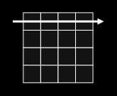
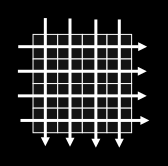
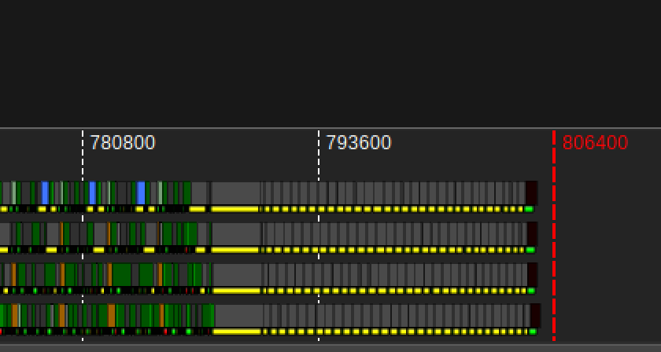
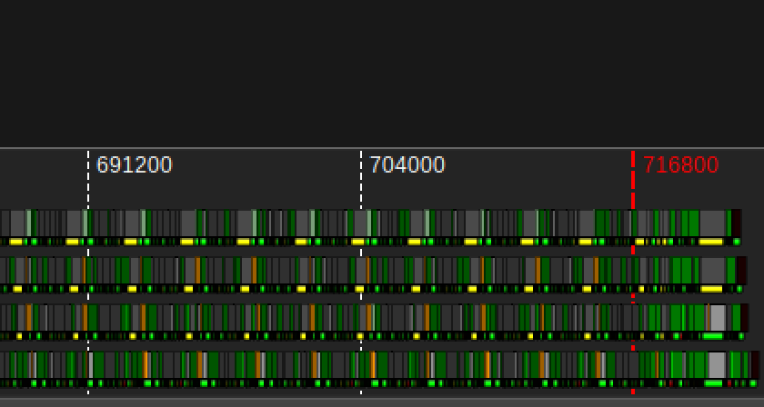

<!---
Copyright (c) 2026 Advanced Micro Devices, Inc. (AMD)

Permission is hereby granted, free of charge, to any person obtaining a copy
of this software and associated documentation files (the "Software"), to deal
in the Software without restriction, including without limitation the rights
to use, copy, modify, merge, publish, distribute, sublicense, and/or sell
copies of the Software, and to permit persons to whom the Software is
furnished to do so, subject to the following conditions:

The above copyright notice and this permission notice shall be included in all
copies or substantial portions of the Software.

THE SOFTWARE IS PROVIDED "AS IS", WITHOUT WARRANTY OF ANY KIND, EXPRESS OR
IMPLIED, INCLUDING BUT NOT LIMITED TO THE WARRANTIES OF MERCHANTABILITY,
FITNESS FOR A PARTICULAR PURPOSE AND NONINFRINGEMENT. IN NO EVENT SHALL THE
AUTHORS OR COPYRIGHT HOLDERS BE LIABLE FOR ANY CLAIM, DAMAGES OR OTHER
LIABILITY, WHETHER IN AN ACTION OF CONTRACT, TORT OR OTHERWISE, ARISING FROM,
OUT OF OR IN CONNECTION WITH THE SOFTWARE OR THE USE OR OTHER DEALINGS IN THE
SOFTWARE.
--->

# An Educational GEMM Ladder for Helios GPUs

AMD Helios will be an important platform for AI. Helios offers 432 GB of HBM4,
23 TB/s of HBM bandwidth per GPU, and 40 PFLOPs of FP4 compute
[AMD Instinct™ MI455X GPU](https://www.amd.com/content/dam/amd/en/documents/products/accelerators/instinct/amd-instinct-mi455x_brochure.pdf).
These capabilities will be especially valuable for large frontier models and long-context
agentic workloads.

In this blog post, we highlight several features of the Helios architecture and build an
educational ladder of BF16 general matrix multiplication (GEMM) kernels that progressively
takes advantage of them. The ladder is inspired by Simon Boehm's CUDA GEMM worklog
[How to Optimize a CUDA Matmul Kernel for cuBLAS-like Performance: a Worklog](https://siboehm.com/articles/22/CUDA-MMM)
and is intended to help kernel developers understand how Helios's new hardware features
affect kernel design.

## A HipKittens Refresher

Both the kernel implementations and optimization ladder in this post use HipKittens, so we
collect the main references here before diving in. The framework is introduced in
[HipKittens: Fast and Furious AMD Kernels](https://arxiv.org/abs/2511.08083), and the
[HipKittens repository](https://github.com/HazyResearch/HipKittens) contains its source and
kernel examples.

## Helios Feature Overview

A Helios GPU contains 256 workgroup processors (WGPs), organized into eight Accelerator
Complex Dies (XCDs). Each WGP has 320 KB of local data share (LDS) and 1024 32-bit registers
per wave. The GPU has 432 GB of HBM4 with 23 TB/s of peak bandwidth. The Helios scale-up
domain includes 72 GPUs per rack with 3.6 TB/s of bandwidth and a unified virtual-memory
abstraction that simplifies intra-node memory access.

| Hardware unit | Description |
| --- | --- |
| Single Instruction Multiple Data processor (SIMD) | A group of 32 lanes with its own set of vector general-purpose registers (VGPRs). |
| Workgroup processor (WGP) | One of the GPU's 256 processors. Previously referred to as a compute unit (CU) on earlier AMD GPU generations. A WGP contains two SIMD pairs, or four SIMDs in total. |
| Shader Engine (SE) | A collection of 16 physically co-located WGPs. |
| Accelerator Complex Die (XCD) | A collection of 32 physically co-located WGPs on a chiplet. |
| I/O Die (IOD) | A base die with four XCDs stacked on top. Each IOD contains 96 MiB of coherent L2 cache. |
| GPU | One AMD Instinct™ MI455X GPU consists of two IODs. |

<p align="center">Table 1. Physical compute hierarchy of a CDNA™ 5 Helios GPU.</p>

| Execution unit | Description |
| --- | --- |
| Thread | The smallest unit of execution on the GPU. |
| Wave | A collection of 32 threads that executes in lockstep. Earlier AMD GPUs used 64 threads per wave. |
| Workgroup | A collection of waves co-scheduled on a WGP. |
| Workgroup cluster | A collection of workgroups running concurrently on a Shader Engine. |
| Grid | The complete collection of workgroups, or workgroup clusters, launched by one kernel. |

<p align="center">Table 2. Logical HIP execution hierarchy on CDNA™ 5.</p>

| Memory | Description |
| --- | --- |
| VGPR | The SIMD-scoped vector register file: 1024 registers, each with 32 lanes of 32-bit values. |
| LDS/L1 | Each WGP has six 64 KB hardware partitions. Up to five (320 KB) can be allocated to LDS, with at least one retained for L1. |
| L2 | Two coherent 96 MB halves, one per IOD, totaling 192 MB per device. |
| High-Bandwidth Memory (HBM) | Eight 54 GB HBM4 stacks, totaling 432 GB. |

<p align="center">Table 3. Physical memory hierarchy of a CDNA™ 5 Helios GPU.</p>

The key changes at each level of the memory hierarchy include:

- **Partitioned LDS.** Each WGP has five 64 KB LDS partitions. LDS remains banked,
  so layouts must avoid bank conflicts. Two 256-byte-per-cycle paths, one per SIMD pair,
  serve LDS. Concurrent accesses to the same partition can cause partition conflicts, so
  high-bandwidth kernels must consider both bank placement within a partition and placement
  across partitions. A single
  256-byte-per-cycle path is already sufficient to saturate the matrix core units.
- **Cache structure, NUMA effects, and memory prefetching.** Earlier AMD GPUs used both a
  per-XCD L2 cache and a global last-level cache (LLC). Helios simplifies this hierarchy to
  a single L2 cache, physically implemented as two coherent 96 MB halves per GPU. The half
  closer to a given processor provides substantially higher bandwidth than the remote half
  (more than 40 TB/s for near L2 versus approximately 20 TB/s for remote L2). Across the
  GPU's eight XCDs, four XCDs reside in each local L2 NUMA domain. Cache hints let kernel
  developers manage L2 behavior, including prefetching global memory into L2 from either
  the device or the host.
- **Tensor Data Movement (TDM) for global HBM.** TDM provides a DMA-style path between
  HBM and LDS. It supports scatter-gather access patterns and exposes its descriptor
  architecture in the ISA. Unlike a hardware-swizzled load, TDM does not rearrange LDS data
  on the fly, so padding or layout design is still required to avoid bank conflicts.

The key changes to the execution model include:

- **Wave size.** Helios uses 32 threads per wave, compared with 64 threads per wave on
  previous AMD GPUs. On earlier generations, a 64-thread wave executed across 16 physical
  SIMD lanes, creating less regular lane ownership and memory-access patterns that kernel
  programmers had to account for when optimizing memory layouts
  [AMD GPUs go brrr](https://hazyresearch.stanford.edu/blog/2025-11-09-amd-brr).[^1]
  Helios pairs 32-thread waves with 32 physical SIMD lanes, enabling more regular lane
  ownership and simplifying memory-layout optimization.
- **Workgroup-cluster launch and multicast.** Helios can guarantee that groups of up to
  16 workgroups are co-located across nearby WGPs, enabling data sharing and synchronization
  across the cluster. Instead of having every workgroup independently request the same data,
  one load can be multicast to multiple WGPs, increasing effective bandwidth through cache
  reuse.

Now let's put these features into action.

[^1]: On the AMD Instinct MI355X GPU, a tile is collectively owned by a 64-thread wave, and
    HipKittens must decide which elements each thread owns. When those threads issue an LDS
    operation, they do not all access LDS simultaneously in a simple thread 0-to-63 order.
    Different `ds_*` instructions split the wave into different, sometimes non-sequential
    phases; for example, HipKittens observed different behavior for `ds_read_b128` and
    `ds_write_b64`.

## Educational GEMM Ladder

Inspired by Simon Boehm's GEMM worklog, we present an educational
GEMM ladder for Helios GPUs. Figure 1 introduces the MI455X hardware hierarchy and shows 
how GEMM tiles map onto it:

```{image} ./images/svg/mi455x-hardware-hierarchy.svg
:align: center
:width: 100%
:alt: MI455X hardware hierarchy from HBM and XCDs to a workgroup processor, SIMD, wave, and thread
```

```{image} ./images/svg/mi455x-gemm-tile-mapping.svg
:align: center
:width: 100%
:alt: A and B matrix tiles mapped to MI455X workgroup processors that accumulate C output tiles
```

<p align="center">Figure 1: The MI455X hierarchy narrows from the GPU to XCDs, WGPs,
SIMDs, waves, and threads (top). GEMM maps A and B tiles to WGPs that accumulate C output
tiles (bottom).</p>

For a large GEMM, the output matrix is divided into tiles that can be computed independently.
Each workgroup, a collection of waves co-scheduled on a WGP, computes one output tile. Every
WGP has its own register file and LDS, as well as circuitry for matrix multiplication,
exponentials, and other arithmetic in data types including BF16, FP8, FP6, and FP4. All WGPs
can also access the GPU's shared cache hierarchy and HBM. Figure 2 summarizes the measured 
performance across the optimization ladder:

```{figure} ./images/svg/ladder-performance.svg
:align: center
:alt: Average relative BF16 GEMM performance at each level of the optimization ladder
Figure 2: Average kernel performance at each rung of the GEMM ladder, normalized to a HipKittens MI355X kernel.
```

Even a kernel midway through the ladder outperforms the well-optimized MI355X GEMM kernel,
and the final Helios kernels approach twice its performance. These tests were run on early-access
GPUs, which continue to receive substantial firmware and software improvements.

Each rung computes $C=AB$, where $A \in \mathbb{R}^{M \times K}$,
$B \in \mathbb{R}^{K \times N}$, and $C \in \mathbb{R}^{M \times N}$. The inputs and
output use BF16 precision. The kernels are written with
[HipKittens: Fast and Furious AMD Kernels](https://github.com/HazyResearch/HipKittens).
For each kernel, we report the
PFLOP/s attained for $M=N=K=8192$, using 500 warm-up iterations and 100 measured iterations
with the L2 cache cleared. The exact benchmarking scripts are available in the HipKittens
repository.

For each rung, we also show the kernel's hot loop—that is, its iteration over the GEMM
K dimension—captured with AMD Advanced Thread Trace (ATT) using the profiling tools in the
[ROCm Systems repository](https://github.com/ROCm/rocm-systems). In these visualizations,
each row depicts one wave's instruction execution over time, and a group of rows shows
execution on one or more of the WGP's four SIMDs.

### Level 0: Naive Baseline ([gemm_naive.cpp](https://github.com/HazyResearch/HipKittens/blob/1602364f4f40b5caeec0ccbbaf9ca31f784f1599/kernels/cdna5/gemm/bf16fp32/gfx1250/00_gemm_naive.cpp#L58-L82))

Each workgroup computes a $64 \times 64$ output tile using four waves. The waves are arranged
in a $2 \times 2$ grid; each wave computes a $32 \times 32$ region of the output tile and
maintains a corresponding register tile for accumulation. The kernel iterates over the K
dimension in chunks of 32. During each iteration, all threads cooperatively load
$64 \times 32$ tiles of A and B from global memory into LDS. After synchronizing, each
wave loads its A and B subtiles from LDS into registers, performs the matrix multiplication,
and accumulates the result in its output tile.

This baseline uses one LDS buffer for A and B and does not overlap data movement with compute.
Every K iteration therefore proceeds serially: load A and B from global memory into LDS,
synchronize, load from LDS into registers and compute, synchronize again, and only then begin
loading the next K tile. The second synchronization is required because the same LDS buffer is
reused in every iteration. As a result, the matrix units are idle during memory movement, and
the memory pipeline is underutilized during computation. The figure below shows the resulting 
serialized schedule:

```{figure} ./images/svg/level0-naive-diagram.svg
:align: center
:width: 100%
:alt: Serial data movement and matrix computation in the naive GEMM kernel
Figure 3: Level 0 serializes global loads, LDS staging, register loads, and WMMA execution.
```

#### Level 0 APIs

| API | Purpose |
| --- | --- |
| [load(A_LDS, A_global)](https://github.com/HazyResearch/HipKittens/blob/1602364f4f40b5caeec0ccbbaf9ca31f784f1599/include/cdna5/ops/warp/memory/tile/global_to_register.cuh#L29-L98) | Uses vector lanes to copy a global tile through registers into LDS. |
| [load(A_reg, A_LDS)](https://github.com/HazyResearch/HipKittens/blob/1602364f4f40b5caeec0ccbbaf9ca31f784f1599/include/cdna5/ops/warp/memory/tile/shared_to_register.cuh#L845-L914) | Loads one wave's LDS fragment into registers. |
| [sync::fence()](https://github.com/HazyResearch/HipKittens/blob/1602364f4f40b5caeec0ccbbaf9ca31f784f1599/include/cdna5/ops/warp/sync/barrier.cuh#L180-L216) | Drains memory traffic before LDS is published or reused. |
| [sync::sync()](https://github.com/HazyResearch/HipKittens/blob/1602364f4f40b5caeec0ccbbaf9ca31f784f1599/include/cdna5/ops/warp/sync/barrier.cuh#L156-L170) | Waits for every wave at the workgroup barrier. |
| [mma_ABt(C, A_reg, B_reg)](https://github.com/HazyResearch/HipKittens/blob/1602364f4f40b5caeec0ccbbaf9ca31f784f1599/include/cdna5/ops/warp/register/tile/mma.cuh#L280-L308) | Accumulates a BF16 $AB^T$ product into FP32 registers. |
| [store(C_global, C_acc)](https://github.com/HazyResearch/HipKittens/blob/1602364f4f40b5caeec0ccbbaf9ca31f784f1599/include/cdna5/ops/warp/memory/tile/global_to_register.cuh#L127-L196) | Converts and writes the FP32 accumulator directly to the global C tile. |

#### Level 0 Pseudocode

```cpp
for each K tile:
    load(A_LDS, A_global);       // A: global -> staging registers -> LDS
    load(B_LDS, B_global);       // B: global -> staging registers -> LDS
    sync::fence();               // Wait for global-to-LDS traffic
    sync::sync();                // Wait for peer waves to publish LDS
    load(A_reg, A_LDS);          // A: LDS -> registers
    load(B_reg, B_LDS);          // B: LDS -> registers
    mma_ABt(C, A_reg, B_reg);    // Accumulate C += A * B^T
    sync::fence();               // Wait for LDS reads
    sync::sync();                // Wait before reusing LDS
```

The trace in Figure 4 shows one SIMD with 12 resident wave tracks from different workgroups;
the scheduler switches among them automatically to maximize resource utilization:

```{figure} ./images/level0-naive-trace.png
:align: center
:alt: Advanced Thread Trace of the naive GEMM kernel
Figure 4: Level 0 ATT trace for SIMD 0. The 12 tracks are resident waves from different
workgroups; register-mediated fills and synchronization leave matrix work sparse.
```

On SIMD0 wave slot 0, early green VALU instructions come from register-mediated A/B fills
and address calculations. Four purple WMMA instructions at cycles 1,218–1,620 map to
`mma_ABt`. The long yellow intervals are consistent with publish and reuse synchronization,
although the color alone does not identify a specific barrier.

### Level 1: Double-Buffered in LDS ([gemm_double_buf.cpp](https://github.com/HazyResearch/HipKittens/blob/1602364f4f40b5caeec0ccbbaf9ca31f784f1599/kernels/cdna5/gemm/bf16fp32/gfx1250/01_gemm_double_buf.cpp#L65-L89))

- **Performance:** Less than 1% faster than Level 0 (25.3% to 25.4% of the MI355X baseline in Figure 2).

The previous kernel severely underutilizes the 320 KB of LDS available per WGP. At a
$64 \times 64$ output tile and `BLOCK_K=32`, Level 0 uses one 8.5 KB stage—only 2.7% of
the budget. Two stages require 17 KB, or 5.3%, so double buffering is a natural next step.

This kernel allocates two LDS buffer sets for A and B and turns the K loop into a two-stage
software pipeline. Initially, a prologue loads and publishes the first A/B tiles; then, each
iteration issues HBM loads into the inactive buffer while WMMA consumes the current one. A
workgroup barrier at the end ensures the next buffer is ready to read and the current buffer
is safe to overwrite before swapping.

**Why it helps:** Double buffering overlaps memory loads with computation, increasing
instruction-level parallelism. The measured performance step stays small here because fills are still
register-mediated and each K block drains fully before handoff. Level 2 keeps the same
staging; with async direct-to-LDS copies, that is when the benefits of this buffering are
realized. The figure below illustrates the double-buffered schedule:

```{figure} ./images/svg/level1-double-buffer-diagram.svg
:align: center
:width: 100%
:alt: Double-buffered LDS pipeline overlapping the next global load with current computation
Figure 5: Level 1 stages the next K tile while the current tile feeds WMMA.
```

#### Level 1 APIs

| API | Purpose |
| --- | --- |
| [allocate_in&lt;segment&lt;0&gt;, Tile, 2&gt;()](https://github.com/HazyResearch/HipKittens/blob/1602364f4f40b5caeec0ccbbaf9ca31f784f1599/include/cdna5/common/util.cuh#L478-L501) | Reserves two tightly packed LDS slots for the current and next operand tiles. |
| [sync::wait_ds&lt;0&gt;()](https://github.com/HazyResearch/HipKittens/blob/1602364f4f40b5caeec0ccbbaf9ca31f784f1599/include/cdna5/ops/warp/sync/barrier.cuh#L206-L216) | Drains the final LDS reads before the kernel exits. |

#### Level 1 Pseudocode

```cpp
A_LDS[2];
B_LDS[2];

load(A_LDS[current], A_global);
load(B_LDS[current], B_global);
sync::fence();
sync::arrive();
sync::wait();                    // Publish the first LDS stage

for each K tile:
    load(A_LDS[next], A_global_clamped);
    load(B_LDS[next], B_global_clamped);

    load(A_reg, A_LDS[current]);
    load(B_reg, B_LDS[current]);
    mma_ABt(C, A_reg, B_reg);

    sync::fence();               // Wait for fills and reads
    sync::arrive();
    sync::wait();                // Hand off one workgroup barrier
    swap(current, next);
```

The trace in Figure 6 shows how the scheduler interleaves the resident waves at this level:

```{figure} ./images/level1-double-buffer-trace.png
:align: center
:alt: Advanced Thread Trace of the double-buffered LDS GEMM kernel
Figure 6: Level 1 ATT trace for SIMD 0. Register-mediated global-to-LDS movement still
dominates VALU issue while the scheduler interleaves 12 resident wave tracks.
```

Like the naive kernel, the scheduler switches among 12 waves from different workgroups. Much
of the SIMD's time is still spent on green VALU work because vector lanes both load data from
global memory into registers and write those registers to LDS. Matrix work remains sparse.

### Level 2: Asynchronous HBM Loads ([gemm_async.cpp](https://github.com/HazyResearch/HipKittens/blob/1602364f4f40b5caeec0ccbbaf9ca31f784f1599/kernels/cdna5/gemm/bf16fp32/gfx1250/02_gemm_async.cpp#L59-L83))

- **Performance:** 48% faster than Level 1.

The AMD Instinct MI455X GPU can copy global memory directly into LDS without passing the data
through the register file. An asynchronous copy is fire-and-forget and retires on `asynccnt`.
The wave checks that counter only when the data becomes a dependency, so the fill no longer
has to lead the iteration or end in a blanket drain.

| Rung | Fill path | Per K block |
| --- | --- | --- |
| Naive | Register-mediated | Two full barriers, two LDS drains, and two global-load drains |
| Double-buffered | Register-mediated | One full barrier, one LDS drain, and one global-load drain |
| Asynchronous | Direct to LDS | One split barrier, one LDS drain, and one asynchronous-copy drain |

Direct-to-LDS loads avoid staging through VGPRs, reducing register pressure and freeing
register space for the larger output tiles introduced in later levels. They also eliminate a
register store-and-writeback path to LDS.

**Why it helps:** Asynchronous loads move data from global memory directly into LDS, avoiding
a round trip through the vector register file. The figure below illustrates how the direct-to-LDS 
copy overlaps the rest of the pipeline:

```{figure} ./images/svg/level2-async-diagram.svg
:align: center
:width: 100%
:alt: Direct-to-LDS asynchronous loads running in parallel with matrix computation
Figure 7: Level 2 runs a direct global-to-LDS copy in the background until its ready gate.
```

#### Level 2 APIs

| API | Purpose |
| --- | --- |
| [load_async(A_LDS&#91;next&#93;, A_global)](https://github.com/HazyResearch/HipKittens/blob/1602364f4f40b5caeec0ccbbaf9ca31f784f1599/include/cdna5/ops/warp/memory/tile/global_to_shared.cuh#L375-L441) | Starts a direct global-to-LDS copy without using VGPRs. |
| [sync::wait_async&lt;0&gt;()](https://github.com/HazyResearch/HipKittens/blob/1602364f4f40b5caeec0ccbbaf9ca31f784f1599/include/cdna5/ops/warp/sync/barrier.cuh#L229-L239) | Drains unordered asynchronous copies before stage handoff. |
| [sync::arrive() / sync::wait()](https://github.com/HazyResearch/HipKittens/blob/1602364f4f40b5caeec0ccbbaf9ca31f784f1599/include/cdna5/ops/warp/sync/barrier.cuh#L136-L155) | Separates workgroup-barrier signaling from waiting. |
| [sched::compiler_fence()](https://github.com/HazyResearch/HipKittens/blob/1602364f4f40b5caeec0ccbbaf9ca31f784f1599/include/cdna5/ops/warp/sched/sched.cuh#L199-L214) | Prevents the compiler from moving work across a handoff. |

#### Level 2 Pseudocode

```cpp
load_async(A_LDS[current], A_global);
load_async(B_LDS[current], B_global);
sync::wait_async<0>();
sched::compiler_fence();
sync::arrive();
sync::wait();                    // Publish the first LDS stage
sched::compiler_fence();

for each K tile:
    load(A_reg, A_LDS[current]);
    load(B_reg, B_LDS[current]);

    load_async(A_LDS[next], A_global_clamped);
    load_async(B_LDS[next], B_global_clamped);

    sync::wait_ds<0>();          // Wait for current LDS reads
    mma_ABt(C, A_reg, B_reg);
    sync::wait_async<0>();       // Wait for next global-to-LDS fills
    sched::compiler_fence();
    sync::arrive();
    sync::wait();
    sched::compiler_fence();
    swap(current, next);
```

The trace in Figure 8 shows nine resident wave tracks. There is significantly less time waiting for
vector work than in earlier levels because the vector lane only issues direct-to-LDS loads
before consuming larger chunks from LDS.

```{figure} ./images/level2-async-trace.png
:align: center
:alt: Advanced Thread Trace of the asynchronous-load GEMM kernel
Figure 8: Level 2 ATT trace for SIMD 0. Nine resident wave tracks show less VALU fill work
after replacing register staging with direct-to-LDS asynchronous loads.
```

### Level 3: Increasing Output Tile Size to 128 x 128 ([gemm_128x128.cpp](https://github.com/HazyResearch/HipKittens/blob/1602364f4f40b5caeec0ccbbaf9ca31f784f1599/kernels/cdna5/gemm/bf16fp32/gfx1250/03_gemm_128x128.cpp#L58-L82))

- **Performance:** 80% faster than Level 2.

For one output tile, GEMM's arithmetic intensity is

$$
\frac{2MNK}{MK + KN + MN}.
$$

When $M=N=K$, this simplifies to $2N/3$. Compute therefore grows cubically with tile
size while the required memory movement grows quadratically. A central GEMM design principle
is to maximize the output tile handled by each WGP while remaining within the available
register and LDS budgets.

Larger tiles also increase data reuse. Four WGPs independently computing adjacent
$64 \times 64$ output tiles must reload shared A and B panels. One WGP computing the same
$128 \times 128$ output region loads each panel once and reuses it across the larger tile,
reducing traffic through the memory hierarchy. The trade-off is that larger tiles can reduce
WGP occupancy for small problems.

Level 3 computes a $128 \times 128$ output tile per WGP. Each wave still owns a
$32 \times 32$ output tile, so the workgroup launches 16 waves.

**Why it helps:** Increasing the output tile size raises arithmetic intensity and reduces
memory traffic through greater per-WGP data reuse. Figure 9 shows the schedule for the 
larger WGP output tile:

```{figure} ./images/svg/level3-128x128-diagram.svg
:align: center
:width: 100%
:alt: Asynchronous double-buffered GEMM schedule for a 128 by 128 WGP output tile
Figure 9: Level 3 increases the WGP output tile while retaining the asynchronous,
double-buffered K-stage pipeline.
```

The trace in Figure 10 contains more matrix instructions per wave because each WGP is
responsible for a larger output tile:

```{figure} ./images/level3-128x128-trace.png
:align: center
:alt: Advanced Thread Trace after increasing the output tile to 128 by 128
Figure 10: Level 3 ATT trace for SIMD 0. Increasing the WGP output tile to
$128 \times 128$ increases the matrix instructions issued by each wave.
```

### Level 4: Increasing Output Tile Size to 256 x 256 ([gemm_256x256.cpp](https://github.com/HazyResearch/HipKittens/blob/1602364f4f40b5caeec0ccbbaf9ca31f784f1599/kernels/cdna5/gemm/bf16fp32/gfx1250/04_gemm_256x256.cpp#L62-L86))

- **Performance:** 25% faster than Level 3.

This kernel computes a $256 \times 256$ output tile per WGP. Each wave owns a
$64 \times 32$ output tile, and the workgroup launches 16 waves—four per SIMD. This
further increases per-WGP reuse through LDS.

#### Level 4 Configuration

```cpp
BLOCK_M = BLOCK_N = 256;
WARPS_M = WARPS_N = 4;
rt_fl<64, 64> C_acc;

// The asynchronous double-buffered K loop is otherwise unchanged.
```

Figure 11 illustrates the schedule with a $256 \times 256$ WGP output tile:

```{figure} ./images/svg/level4-256x256-diagram.svg
:align: center
:width: 100%
:alt: Asynchronous double-buffered GEMM schedule for a 256 by 256 WGP output tile
Figure 11: Level 4 increases the WGP output tile to $256 \times 256$ while retaining
the same conceptual K-stage pipeline.
```

The trace in Figure 12 begins with asynchronous-load issue, followed by large LDS-read blocks
and then dense groups of purple WMMA instructions. These groups reflect the increased matrix
work per wave:

```{figure} ./images/level4-256x256-trace.png
:align: center
:alt: Advanced Thread Trace after increasing the output tile to 256 by 256
Figure 12: Level 4 ATT trace for SIMD 0. A $256 \times 256$ WGP output tile produces
denser groups of WMMA instructions.
```

### Level 5: Deepening the K Stride for WMMA Instructions ([gemm_deepk.cpp](https://github.com/HazyResearch/HipKittens/blob/1602364f4f40b5caeec0ccbbaf9ca31f784f1599/kernels/cdna5/gemm/bf16fp32/gfx1250/05_gemm_deepk.cpp#L62-L86))

- **Performance:** 19% faster than Level 4.

Level 1 introduced double buffering between HBM and LDS, but a GEMM kernel can also stall
while moving data from LDS to registers. Level 5 adds a two-stage register buffer for that
path. HBM-to-LDS loads now bring in $256 \times 128$ tiles of A and
$128 \times 256$ tiles of B, rather than the $256 \times 32$ and
$32 \times 256$ tiles used by Level 4.

Within the outer K loop, an inner loop runs four K=32 substeps. In each substep, a wave loads
a $64 \times 32$ A tile and a $32 \times 64$ B tile into one register-buffer slot while
performing matrix multiplication on the other slot. This overlaps LDS-to-register movement
with computation, in addition to the existing overlap between HBM and LDS.

**Why it helps:** A deeper K loop creates finer-grained pipeline stages and more opportunities
to overlap LDS reads with matrix computation. The figure below illustrates the four-substep 
register pipeline:

```{figure} ./images/svg/level5-deepk-diagram.svg
:align: center
:width: 100%
:alt: Four-substep K pipeline that overlaps LDS reads with WMMA instructions
Figure 13: Level 5 reads ahead across a four-substep K=128 pipeline.
```

#### Level 5 Pseudocode

```cpp
load_async(A_LDS[current], A_global);
load_async(B_LDS[current], B_global);
sync::wait_async<0>();
sched::compiler_fence();
sync::arrive();
sync::wait();
sched::compiler_fence();

for each K stage:
    load(A_reg[0], A_LDS[current][0]);
    load(B_reg[0], B_LDS[current][0]);

    load_async(A_LDS[next], A_global_clamped);
    load_async(B_LDS[next], B_global_clamped);

    for substep = 0 .. 2:
        load(A_reg[next_reg], A_LDS[current][substep + 1]);
        load(B_reg[next_reg], B_LDS[current][substep + 1]);
        sync::wait_ds<DS_SUB>();
        mma_ABt(C, A_reg[current_reg], B_reg[current_reg]);
        swap(current_reg, next_reg);

    sync::wait_ds<0>();
    mma_ABt(C, A_reg[current_reg], B_reg[current_reg]);
    sync::wait_async<0>();
    sched::compiler_fence();
    sync::arrive();
    sync::wait();
    sched::compiler_fence();
    swap(current, next);
```

The trace in Figure 14 shows four resident wave tracks. Instead of large, sequential blocks
of LDS reads and compute, each substep interleaves non-matrix work for the next substep with
matrix work for the current one:

```{figure} ./images/level5-deepk-trace.png
:align: center
:alt: Advanced Thread Trace of the deep K pipeline
Figure 14: Level 5 ATT trace for SIMD 0. Four K=32 substeps interleave LDS reads for the
next substep with WMMA execution for the current substep.
```

### Level 6: Accounting for Partitioned LDS ([gemm_segment.cpp](https://github.com/HazyResearch/HipKittens/blob/1602364f4f40b5caeec0ccbbaf9ca31f784f1599/kernels/cdna5/gemm/bf16fp32/gfx1250/06_gemm_segment.cpp#L64-L88))

- **Performance:** No measurable change for this benchmark shape.

Bank-conflict-free LDS accesses can still serialize through partition conflicts when warps
on different SIMD pairs target the same 64 KB LDS partition. The WGP's five LDS partitions
are served by two 256-byte-per-cycle paths, one per SIMD pair. Level 6 places the A and B
rings in different partitions so simultaneous operand reads avoid partition conflicts and can
use both paths.

For a detailed treatment of the partitioned LDS organization and its conflict behavior, see
[A Deep Dive into LDS Optimizations on AMD Instinct MI450 GPUs](https://rocm.blogs.amd.com/software-tools-optimization/mi450-lds-optimization/README.html).

Only allocation changes: all A subtiles are placed in one blocked array, followed by all B
subtiles in a different partition. The K loop and its one split barrier are unchanged from
Level 5. Figure 15 compares the Level 5 and Level 6 LDS allocation orders:

```{figure} ./images/svg/level6-partition-diagram.svg
:align: center
:alt: Proportional map of the 278 KiB operand ring across five 64 KiB LDS partitions — Level 5 interleaves matching A/B subtiles; Level 6 blocks the A ring before the B ring
Figure 15: The operand ring (278 KiB across five 64 KiB partitions). Level 6 changes only allocation order in `segment&lt;0&gt;`: `[A0][A1]...[B0][B1]...` instead of `[A0][B0][A1][B1]...`, putting matching operands like A₀ and B₀ in different physical partitions.
```

Figure 16 shows that the execution order remains unchanged:

```{figure} ./images/svg/level6-segmented-lds-diagram.svg
:align: center
:width: 100%
:alt: Deep K schedule retained after placing A and B operand rings in different LDS partitions
Figure 16: Level 6 retains Level 5's four-substep execution order; the optimization changes
where the A and B rings reside in LDS.
```

**Why it helps:** Although this rung does not improve the measured $8192^3$ BF16 GEMM,
partition-aware placement reduces serialization for other shapes, workloads, and
lower-precision data types.

#### Level 6 Pseudocode

```cpp
// A and B stages are allocated in separate LDS partitions.
load_async(A_LDS[current], A_global);
load_async(B_LDS[current], B_global);
sync::wait_async<0>();
sched::compiler_fence();
sync::arrive();
sync::wait();
sched::compiler_fence();

for each K stage:
    load(A_reg[0], A_LDS[current][0]);
    load(B_reg[0], B_LDS[current][0]);

    load_async(A_LDS[next], A_global_clamped);
    load_async(B_LDS[next], B_global_clamped);

    for substep = 0 .. 2:
        load(A_reg[next_reg], A_LDS[current][substep + 1]);
        load(B_reg[next_reg], B_LDS[current][substep + 1]);
        sync::wait_ds<DS_SUB>();
        mma_ABt(C, A_reg[current_reg], B_reg[current_reg]);
        swap(current_reg, next_reg);

    sync::wait_ds<0>();
    mma_ABt(C, A_reg[current_reg], B_reg[current_reg]);
    sync::wait_async<0>();
    sched::compiler_fence();
    sync::arrive();
    sync::wait();
    sched::compiler_fence();
    swap(current, next);
```

The trace in Figure 17 shows the unchanged four-group WMMA order:

```{figure} ./images/level6-segmented-trace.png
:align: center
:alt: Advanced Thread Trace of the partitioned-LDS GEMM kernel
Figure 17: Level 6 ATT trace for SIMD 0. Partition-aware LDS placement changes addresses
without changing Level 5's four-group WMMA instruction order.
```

On SIMD0 wave slot 3, the four purple WMMA groups at cycles 2,531–2,941, 3,051–3,642,
3,746–4,293, and 4,385–4,771 match the four `mma_ABt` substeps from Level 5. Partition-aware
placement changes LDS addresses but not the matrix-operation order. The trace cannot reveal
which 64 KB partition a particular LDS access used.

### Level 7: Using TDM Loads ([gemm_tdm.cpp](https://github.com/HazyResearch/HipKittens/blob/1602364f4f40b5caeec0ccbbaf9ca31f784f1599/kernels/cdna5/gemm/bf16fp32/gfx1250/07_gemm_tdm.cpp#L61-L85))

- **Performance:** 38% faster than Level 6.

The Tensor Data Mover is an asynchronous data engine available to each WGP. Device-side TDM
descriptors describe affine patterns with up to five dimensions and direct the engine to load
data into LDS or store it to global memory. This offloads address generation and load
instruction issue from the vector lanes.

TDM moves an entire panel from a device-built descriptor. Only two issuer waves post A and B
while the remaining waves continue computing. Wave 0 posts the A descriptor and wave 1 posts
the B descriptor so that the transfers use different engine parities. The register ring is
unchanged, but `tensorcnt` replaces the asynchronous-copy drain, and one deep panel replaces
four separately filled subtiles. With two LDS stages, `wait_tdm<S-2>` becomes
`wait_tdm<0>`, a full drain.

The kernel also uses padded LDS layouts to produce bank-conflict-free accesses instead of
spending vector instructions rearranging data during the fill. Most per-lane load,
address-generation, and layout work disappears, leaving more issue bandwidth available for
matrix instructions while TDM independently fills the next stage.

**Why it helps:**

1. Only two waves issue tensor loads; the others continue until the data becomes a dependency.
2. Each wave can request one large two-dimensional transfer instead of many 128-bit
   global-to-LDS loads.
3. The engine is launched with only two issue instructions, one from each issuer wave.
4. Address generation, padding, transposition when needed, and zero filling are offloaded to
   a dedicated functional unit.
5. The simpler hazard structure is easier for the compiler to optimize and reduces register
   pressure.

The figure below illustrates the descriptor-driven TDM pipeline:

```{figure} ./images/svg/level7-tdm-diagram.svg
:align: center
:width: 100%
:alt: Tensor Data Mover panels filling LDS while register reads and matrix computation continue
Figure 18: Level 7 replaces lane-issued asynchronous copies with descriptor-driven TDM
panel transfers while preserving the deep register pipeline.
```

#### Level 7 APIs

| API | Purpose |
| --- | --- |
| [tdm::load_async(...)](https://github.com/HazyResearch/HipKittens/blob/1602364f4f40b5caeec0ccbbaf9ca31f784f1599/include/cdna5/ops/warp/memory/tile/tdm.cuh#L201-L257) | Posts one descriptor-driven global-to-LDS panel transfer. |
| [sync::wait_tdm&lt;0&gt;()](https://github.com/HazyResearch/HipKittens/blob/1602364f4f40b5caeec0ccbbaf9ca31f784f1599/include/cdna5/ops/warp/sync/barrier.cuh#L241-L252) | Drains both TDM transfers before the LDS stage is published or reused. |

#### Level 7 Pseudocode

```cpp
if (wave_id == 0)
    tdm::load_async(A_LDS[current], A_global);
if (wave_id == 1)
    tdm::load_async(B_LDS[current], B_global);
sync::wait_tdm<0>();
sched::compiler_fence();
sync::arrive();
sync::wait();
sched::compiler_fence();

for each K stage:
    load(A_reg[0], A_LDS[current][0]);
    load(B_reg[0], B_LDS[current][0]);

    if (wave_id == 0)
        tdm::load_async(A_LDS[next], A_global, count_or_zero);
    if (wave_id == 1)
        tdm::load_async(B_LDS[next], B_global, count_or_zero);

    for substep = 0 .. 2:
        load(A_reg[next_reg], A_LDS[current][substep + 1]);
        load(B_reg[next_reg], B_LDS[current][substep + 1]);
        sync::wait_ds<DS_SUB>();
        mma_ABt(C, A_reg[current_reg], B_reg[current_reg]);
        swap(current_reg, next_reg);

    sync::wait_ds<0>();
    mma_ABt(C, A_reg[current_reg], B_reg[current_reg]);
    sync::wait_tdm<0>();
    sched::compiler_fence();
    sync::arrive();
    sync::wait();
    sched::compiler_fence();
    swap(current, next);
```

The trace in Figure 19 shows the resulting reduction in lane-issued fill work:

```{figure} ./images/level7-tdm-trace.png
:align: center
:alt: Advanced Thread Trace of the Tensor Data Mover GEMM kernel
Figure 19: Level 7 ATT trace for SIMD 0. TDM removes most lane-issued fill work, leaving
the matrix-instruction groups as the dominant activity.
```

On SIMD0 wave slot 0, decoded WMMA groups at cycles 289–533, 638–1,145, and 1,249–1,732
map to the inner loop's three `mma_ABt` calls; cycles 1,826–2,192 map to the final call.
The small green prefix is ordinary VALU work used to build TDM descriptors and offsets.
Descriptor-driven panel movement removes broad lane-issued fill work, leaving matrix groups
as the dominant instruction color. Physical slot labels do not identify source `wave_id`.

### Level 8: Using Split Barriers ([gemm_split_bar.cpp](https://github.com/HazyResearch/HipKittens/blob/1602364f4f40b5caeec0ccbbaf9ca31f784f1599/kernels/cdna5/gemm/bf16fp32/gfx1250/08_gemm_split_bar.cpp#L71-L95))

- **Performance:** 4% faster than Level 7.

A workgroup barrier often prevents one wave from overwriting an LDS buffer while another wave
is still reading it. With a conventional barrier, each wave signals completion and
immediately waits, leaving early waves idle until the slowest wave arrives.

A split barrier separates the signal from the wait. After a wave completes its final LDS
read, its operands are safely held in registers, so it signals that the LDS buffer can be
released. The wave then performs its final register-only WMMA before waiting for its peers.
Compiler fences keep the WMMA inside this interval; moving it outside the signal and wait
would preserve numerical correctness but lose the intended overlap.

**Why it helps:** Split barriers overlap the final K substep with peer-wave arrival, hiding
some synchronization latency with useful computation. The figure below illustrates the 
matrix work placed between barrier arrival and wait:

```{figure} ./images/svg/level8-split-barrier-diagram.svg
:align: center
:width: 100%
:alt: Final matrix work placed between split-barrier arrival and wait operations
Figure 20: Level 8 executes the final K substep while peer waves arrive at the barrier.
```

#### Level 8 Core Scheduling Change

```cpp
sync::wait_ds<0>();
sync::wait_tdm<0>();
sync::arrive();                  // Release the LDS stage
mma_ABt(C, A_reg[final], B_reg[final]);
sync::wait();                    // Wait for peer waves
```

The trace in Figure 21 shows that scheduling interval:

```{figure} ./images/level8-split-barrier-trace.png
:align: center
:alt: Advanced Thread Trace of the split-barrier GEMM kernel
Figure 21: Level 8 ATT trace for SIMD 0. The final WMMA group executes between the
split-barrier signal and wait.
```

On SIMD0 wave slot 0, the barrier signal issues at cycle 1,649, followed by 16 WMMA
instructions at cycles 1,653–1,776 and the barrier wait at cycle 1,784. Slot 1 repeats the
same signal, WMMA, and wait sequence at cycles 1,923–2,058. The final purple block is matrix
work deliberately placed inside the split-barrier window.

### Level 9: Using Workgroup Clusters and Multicast ([gemm_wgc_multicast.cpp](https://github.com/HazyResearch/HipKittens/blob/1602364f4f40b5caeec0ccbbaf9ca31f784f1599/kernels/cdna5/gemm/bf16fp32/gfx1250/09_gemm_wgc_multicast.cpp#L80-L109))

- **Performance:** 7% faster than Level 8.

Workgroup clusters can contain up to 16 workgroups launched concurrently. Workgroups in a
cluster can declare that they will share selected data with other WGPs in that cluster.
Repeated L2 requests are then deduplicated through multicast.

This kernel arranges the workgroups in a $4 \times 4$ cluster. Each A panel is shared down
a cluster column, and each B panel is shared across a cluster row. Four workgroups can
therefore consume one L2 return instead of issuing four independent requests. A square cluster
deduplicates traffic for both operands. The multicast mask must include the requester and may
contain no more than five destinations; an incorrect row or column mask is a correctness
error. Figure 22 illustrates how the cluster shares A and B panels:

| One panel consumed by a cluster row | Panels multicast across rows and columns |
| :---: | :---: |
|  |  |

<p align="center">Figure 22: A $4 \times 4$ cluster reuses A panels down columns and B
panels across rows, reducing repeated L2 requests.</p>

The stage handoff now uses both workgroup and cluster barriers. The final WMMA remains inside
both split-barrier windows: wave 0 signals cluster arrival, and then every wave waits.

**Why it helps:** Workgroup clusters and multicast broadcast shared panels from L2, increasing
effective L2 bandwidth.

The figure below shows the cluster-scoped synchronization in the pipeline:

```{figure} ./images/svg/level9-multicast-diagram.svg
:align: center
:width: 100%
:alt: TDM multicast schedule with workgroup and cluster split-barrier handoffs
Figure 23: Level 9 adds cluster-scoped arrival and wait operations around the final
matrix substep while using TDM to multicast the next operand panels.
```

#### Level 9 APIs

| API | Purpose |
| --- | --- |
| [\_\_cluster\_dims\_\_(4, 4, 1)](https://github.com/HazyResearch/HipKittens/blob/1602364f4f40b5caeec0ccbbaf9ca31f784f1599/kernels/cdna5/gemm/bf16fp32/gfx1250/09_gemm_wgc_multicast.cpp#L74-L83) | Declares a $4 \times 4$ workgroup cluster on the kernel. |
| [cluster::sync() / arrive() / wait()](https://github.com/HazyResearch/HipKittens/blob/1602364f4f40b5caeec0ccbbaf9ca31f784f1599/include/cdna5/ops/warp/cluster/cluster.cuh#L56-L87) | Publishes the prologue and protects later stage handoffs across the cluster. |

#### Level 9 Pseudocode

```cpp
maskA = cluster::mask(0x1111 << cluster_x);
maskB = cluster::mask(0x000F << (4 * cluster_y));

if (wave_id == 0)
    tdm::load_async(A_LDS[current], A_global, maskA);
if (wave_id == 1)
    tdm::load_async(B_LDS[current], B_global, maskB);
sync::wait_tdm<0>();
cluster::sync();

for each K stage:
    load(A_reg[0], A_LDS[current][0]);
    load(B_reg[0], B_LDS[current][0]);

    if (wave_id == 0)
        tdm::load_async(A_LDS[next], A_global, maskA, count_or_zero);
    if (wave_id == 1)
        tdm::load_async(B_LDS[next], B_global, maskB, count_or_zero);

    for substep = 0 .. 2:
        load(A_reg[next_reg], A_LDS[current][substep + 1]);
        load(B_reg[next_reg], B_LDS[current][substep + 1]);
        sync::wait_ds<DS_SUB>();
        mma_ABt(C, A_reg[current_reg], B_reg[current_reg]);
        swap(current_reg, next_reg);

    sync::wait_ds<0>();
    sync::wait_tdm<0>();
    sync::arrive();              // Signal the workgroup barrier
    if (wave_id == 0)
        cluster::arrive();       // Signal the cluster barrier
    mma_ABt(C, A_reg[current_reg], B_reg[current_reg]);
    sync::wait();
    cluster::wait();
    swap(current, next);
```

The trace in Figure 24 shows the final WMMA group inside both barrier windows:

```{figure} ./images/level9-multicast-trace.png
:align: center
:alt: Advanced Thread Trace of the workgroup-cluster multicast GEMM kernel
Figure 24: Level 9 ATT trace for SIMD 0. After the TDM wait, the final WMMA group executes
inside both the workgroup and cluster barrier windows.
```

SIMD0 wave slot 0 has a royal-blue `TDM_WAIT` interval around cycles 1,600–2,050. After the
drain, the workgroup signal issues at cycle 2,069, the cluster signal at 2,082, and 16 WMMA
instructions from the final `mma_ABt` at cycles 2,101–2,221. The purple work after the blue
interval is therefore inside both barrier windows. The physical slot label does not identify
the A issuer; source `wave_id`, not slot number, selects descriptor posters.

### Level 10: Efficient GEMM Epilogues ([gemm_epilogue.cpp](https://github.com/HazyResearch/HipKittens/blob/1602364f4f40b5caeec0ccbbaf9ca31f784f1599/kernels/cdna5/gemm/bf16fp32/gfx1250/10_gemm_epilogue.cpp#L132-L156))

- **Performance:** 8% faster than Level 9.

Level 10 stages the C tile through LDS before writing it to global memory. LDS transforms the
wave-local, column-major accumulator layout into a row-major tile and enables wider,
coalesced stores.

**Why it helps:** Packing the C tile in LDS produces more efficient global-memory store
patterns at the end of the kernel.

The figure below illustrates the LDS-staged output epilogue:

```{figure} ./images/svg/level10-epilogue-diagram.svg
:align: center
:width: 60%
:alt: GEMM pipeline followed by an LDS-staged and coalesced output epilogue
Figure 25: Level 10 stages C through aliased LDS before storing it globally.
```

#### Level 10 APIs

| API | Purpose |
| --- | --- |
| [sched::lock_simd()](https://github.com/HazyResearch/HipKittens/blob/1602364f4f40b5caeec0ccbbaf9ca31f784f1599/include/cdna5/ops/warp/sched/sched.cuh#L100-L124) | Keeps a wave issuing back-to-back WMMAs on one SIMD. |
| [store(C_LDS, C_acc)](https://github.com/HazyResearch/HipKittens/blob/1602364f4f40b5caeec0ccbbaf9ca31f784f1599/include/cdna5/ops/warp/memory/tile/shared_to_register.cuh#L595-L635) | Stages scattered accumulator values into LDS. |
| [store(C_global, C_LDS)](https://github.com/HazyResearch/HipKittens/blob/1602364f4f40b5caeec0ccbbaf9ca31f784f1599/include/cdna5/ops/warp/memory/tile/global_to_shared.cuh#L218-L274) | Writes the assembled C tile as wider, coalesced runs. |

#### Level 10 Pseudocode

```cpp
sched::lock_simd();

for each K stage:
    // Same TDM, multicast, and split-barrier pipeline as Level 9.

sync::wait_ds<0>();
sync::wait_tdm<0>();
sync::arrive();
sync::wait();

store(C_LDS, C_acc);             // C: registers -> LDS
sync::wait_ds<0>();
sync::arrive();
sync::wait();
store(C_global, C_LDS);          // Coalesced C: LDS -> global
```

Figure 26 compares the two epilogues at the same time scale:

| Level 9 direct epilogue | Level 10 LDS-staged epilogue |
| :---: | :---: |
|  |  |
| Narrow stores remain as scattered, per-column transactions after the final matrix work. | Green and orange activity remains interleaved while the waves assemble and stream wider, coalesced stores. |

<p align="center">Figure 26: Direct and LDS-staged GEMM epilogues at the same time scale.</p>

The Level 10 epilogue replaces direct per-wave stores with an explicit
register-to-LDS-to-global gather-and-stream path. LDS reorganizes wave-local accumulator
fragments before the global write, creating a more regular and wider store stream.

### Level 11: One Wave per SIMD ([gemm_one_wave.cpp](https://github.com/HazyResearch/HipKittens/blob/1602364f4f40b5caeec0ccbbaf9ca31f784f1599/kernels/cdna5/gemm/bf16fp32/gfx1250/11_gemm_one_wave.cpp#L90-L114))

**Performance:** 6% faster than Level 10.

Level 11 keeps the $256 \times 256$ workgroup tile but replaces the $4 \times 4$ wave
grid with a $2 \times 2$ grid. Each of the four waves now owns a
$128 \times 128$ output tile, placing one wave on each SIMD. This sacrifices occupancy in
exchange for greater operand reuse within each wave.

The register-operand pipeline expands from two slots to three. Two K=32 substeps are
prefetched before the first WMMA, allowing later LDS loads and matrix operations to be
interleaved even though there are no other resident waves to hide latency. For each K block,
the wave waits for the current TDM stage, prefetches substeps 0 and 1 into two register slots,
executes WMMA for substep 0 while loading a later substep into the free slot, rotates the
three-slot ring through all four substeps, signals the barriers around the final WMMA, and
then advances to the next stage.

**Why it helps:** The larger wave-local tile increases register- and LDS-level data reuse.
Each substep can issue 64 WMMA instructions while the three-slot pipeline maintains overlap.

The figure below illustrates the one-wave-per-SIMD schedule:

```{figure} ./images/svg/level11-one-wave-diagram.svg
:align: center
:width: 100%
:alt: One-wave-per-SIMD pipeline with 64 WMMA instructions per K substep
Figure 27: Level 11 uses a three-slot register pipeline with one wave resident on each SIMD.
```

#### Level 11 Pseudocode

```cpp
sched::lock_simd();

if (wave_id == 0)
    tdm::load_async(A_LDS[current], A_global, maskA);
if (wave_id == 1)
    tdm::load_async(B_LDS[current], B_global, maskB);
sync::wait_tdm<0>();
cluster::sync();

for each K stage:
    load(A_reg[0], A_LDS[current][0]);
    load(B_reg[0], B_LDS[current][0]);
    load(A_reg[1], A_LDS[current][1]);
    load(B_reg[1], B_LDS[current][1]);

    if (wave_id == 0)
        tdm::load_async(A_LDS[next], A_global, maskA, count_or_zero);
    if (wave_id == 1)
        tdm::load_async(B_LDS[next], B_global, maskB, count_or_zero);

    for substep = 0 .. 2:
        if substep + 2 < 4:
            load(A_reg[(substep + 2) % 3],
                 A_LDS[current][substep + 2]);
            load(B_reg[(substep + 2) % 3],
                 B_LDS[current][substep + 2]);
        sync::wait_ds<DS_SUB>();
        mma_ABt(C, A_reg[substep % 3], B_reg[substep % 3]);

    sync::wait_ds<0>();
    sync::wait_tdm<0>();
    sync::arrive();
    if (wave_id == 0)
        cluster::arrive();
    mma_ABt(C, A_reg[final], B_reg[final]);
    sync::wait();
    cluster::wait();
    swap(current, next);
```

Figure 28 shows how the orange LDS activity near cycles 100–350 primes the register ring. The
three long purple groups at cycles 328–787, 901–1,353, and 1,368–1,865 each contain 64
decoded WMMA instructions from an inner-loop `mma_ABt`. Royal blue at cycles 1,869–2,100 is
the TDM drain. After the two barrier signals, the final 64-instruction WMMA group runs at
cycles 2,150–2,596 before the waits:

```{figure} ./images/level11-one-wave-trace.png
:align: center
:alt: Advanced Thread Trace with one wave resident on a SIMD
Figure 28: Level 11 ATT trace for SIMD 0. One wave per SIMD issues 64-instruction WMMA
groups around the TDM drain.
```

### Level 12: Two Waves per SIMD ([gemm_two_waves.cpp](https://github.com/HazyResearch/HipKittens/blob/1602364f4f40b5caeec0ccbbaf9ca31f784f1599/kernels/cdna5/gemm/bf16fp32/gfx1250/12_gemm_two_waves.cpp#L119-L143))

- **Performance:** 6% faster than Level 11.

The final rung keeps the $256 \times 256$ workgroup tile and replaces Level 11's
$2 \times 2$ wave grid with a $4 \times 2$ grid. Each wave owns a
$64 \times 128$ output tile, the workgroup grows from four to eight waves, and two waves
run on each SIMD.

A $64 \times 128$ accumulator requires 256 registers instead of 512. With 256 threads,
each lane has 512 registers available instead of 1024, so the operand ring drops from three
slots to two. Level 11 needed the third slot to keep loads in flight; in Level 12, the second
resident wave hides that latency more effectively.

The operand feed uses `sched_group_barrier` instead of `compiler_fence`. It requests six LDS
reads followed by eight matrix operations, repeated four times to cover the 24 reads and
32 matrix operations in one substep.

**Why it helps:** Two co-resident waves let the hardware scheduler issue work from one wave
while the other is waiting for data, preserving matrix utilization while improving latency
hiding.

The figure below illustrates this schedule:

```{figure} ./images/svg/level12-two-waves-diagram.svg
:align: center
:width: 100%
:alt: Two-wave-per-SIMD schedule that interleaves LDS reads and matrix instructions
Figure 29: Level 12 splits the final substep across workgroup and cluster waits.
```

#### Level 12 Helpers

| Helper | Purpose |
| --- | --- |
| `mma_ABt_base(...)` | Computes one output fragment, allowing the final MMA to be split into groups of 12 and 20 instructions. |
| `pin_interleave(...)` | A kernel helper around `sched_group_barrier` that pins LDS reads and WMMA operations into a specific issue order. |

#### Level 12 Pseudocode

```cpp
sched::lock_simd();

if (wave_id == 0)
    tdm::load_async(A_LDS[current], A_global, maskA);
if (wave_id == 1)
    tdm::load_async(B_LDS[current], B_global, maskB);
sync::wait_tdm<0>();
cluster::sync();

load(A_reg[0], A_LDS[current][0]);
load(B_reg[0], B_LDS[current][0]);

for each K stage:
    if (wave_id == 0)
        tdm::load_async(A_LDS[next], A_global, maskA, count_or_zero);
    if (wave_id == 1)
        tdm::load_async(B_LDS[next], B_global, maskB, count_or_zero);

    for substep = 0 .. 2:
        load(A_reg[(substep + 1) % 2],
             A_LDS[current][substep + 1]);
        load(B_reg[(substep + 1) % 2],
             B_LDS[current][substep + 1]);
        mma_ABt(C, A_reg[substep % 2], B_reg[substep % 2]);
        pin_interleave();

    mma_ABt_base(...) x 12;
    sync::wait_ds<0>();
    sync::wait_tdm<0>();
    sync::arrive();
    if (wave_id == 0)
        cluster::arrive();
    sync::wait();

    load(A_reg[0], A_LDS[next][0]);
    load(B_reg[0], B_LDS[next][0]);
    mma_ABt_base(...) x 20;
    pin_interleave<5, 6>();
    cluster::wait();
    swap(current, next);
```

The trace in Figure 30 shows the WGP cleanly interleaving instructions from the two waves
resident on the SIMD. It begins with interleaved TDM descriptor setup and issue, followed by
a long sequence of WMMA and LDS operations alternating between the waves. This maintains the
strong WMMA utilization of Level 11 while providing more opportunities to hide latency by
switching waves:

```{figure} ./images/level12-two-waves-trace.png
:align: center
:alt: Advanced Thread Trace with two waves resident on a SIMD
Figure 30: Level 12 ATT trace for SIMD 0. Two co-resident waves interleave TDM setup,
LDS reads, and WMMA issue.
```

## Summary

Many kernel-scheduling patterns that delivered high performance on the AMD Instinct MI350
and MI355X GPUs—including four-wave interleaving and eight- or sixteen-wave ping-pong
schedules—translate directly to Helios. Despite the architectural changes described here,
kernel developers can retain the core scheduling ideas from earlier AMD GPU generations
while taking advantage of partitioned LDS, TDM, and workgroup multicast.

We plan to continue updating [HipKittens](https://github.com/HazyResearch/HipKittens) with
additional Helios kernels, optimizations, and technical discussions. Testing was performed by the authors on early-access hardware. Results may vary based on
configuration, usage, software version, firmware, and optimizations.

## Test Configuration

- GPU: AMD Instinct™ MI455X GPU
- Workload: BF16 GEMM with $M=N=K=8192$
- Methodology: 500 warm-up iterations and 100 measured iterations, with L2 cache flush
- Kernel implementation: HipKittens HIP/C++
- Profiling: AMD Advanced Thread Trace with the ROCm Systems Profiler

## Acknowledgements

Finally, we thank the AMD University Partnerships team for supporting this work, including
Hugo Andrade, Preethi Jayadev, and Tom Papatheodore, and AMD's Triton and HipBLASLt/TensileLite teams.
We also thank our AMD colleagues Lei Zhang, Stanley Winata, Xiaohu Guo, Kumar Deepak, Bryant Nelson,
Alex Brown, Brad Nemanich, Brian Shi, Majed Sujon, Ahmed Eltantawy, and Kyle Wang for their feedback
and support on this work.

## Disclaimers

The information presented in this document is for informational purposes only and may contain technical inaccuracies, omissions, and typographical errors. The information contained herein is subject to change and may be rendered inaccurate for many reasons, including but not limited to product and roadmap changes, component and motherboard version changes, new model and/or product releases, product differences between differing manufacturers, software changes, BIOS flashes, firmware upgrades, or the like. Any computer system has risks of security vulnerabilities that cannot be completely prevented or mitigated. AMD assumes no obligation to update or otherwise correct or revise this information. However, AMD reserves the right to revise this information and to make changes from time to time to the content hereof without obligation of AMD to notify any person of such revisions or changes. THIS INFORMATION IS PROVIDED ‘AS IS.” AMD MAKES NO REPRESENTATIONS OR WARRANTIES WITH RESPECT TO THE CONTENTS HEREOF AND ASSUMES NO RESPONSIBILITY FOR ANY INACCURACIES, ERRORS, OR OMISSIONS THAT MAY APPEAR IN THIS INFORMATION. AMD SPECIFICALLY DISCLAIMS ANY IMPLIED WARRANTIES OF NON-INFRINGEMENT, MERCHANTABILITY, OR FITNESS FOR ANY PARTICULAR PURPOSE. IN NO EVENT WILL AMD BE LIABLE TO ANY PERSON FOR ANY RELIANCE, DIRECT, INDIRECT, SPECIAL, OR OTHER CONSEQUENTIAL DAMAGES ARISING FROM THE USE OF ANY INFORMATION CONTAINED HEREIN, EVEN IF AMD IS EXPRESSLY ADVISED OF THE POSSIBILITY OF SUCH DAMAGES. AMD, the AMD Arrow logo, and combinations thereof are trademarks of Advanced Micro Devices, Inc. Other product names used in this publication are for identification purposes only and may be trademarks of their respective companies. © 2026 Advanced Micro Devices, Inc. All rights reserved

Third-party content is licensed to you directly by the third party that owns the content and
is not licensed to you by AMD. ALL LINKED THIRD-PARTY CONTENT IS PROVIDED "AS IS" WITHOUT A
WARRANTY OF ANY KIND. USE OF SUCH THIRD-PARTY CONTENT IS DONE AT YOUR SOLE DISCRETION AND
UNDER NO CIRCUMSTANCES WILL AMD BE LIABLE TO YOU FOR ANY THIRD-PARTY CONTENT. YOU ASSUME ALL
RISK AND ARE SOLELY RESPONSIBLE FOR ANY DAMAGES THAT MAY ARISE FROM YOUR USE OF THIRD-PARTY
CONTENT.
