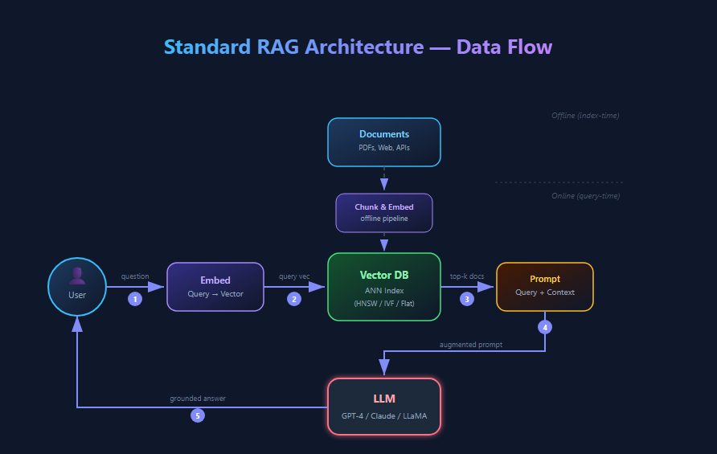
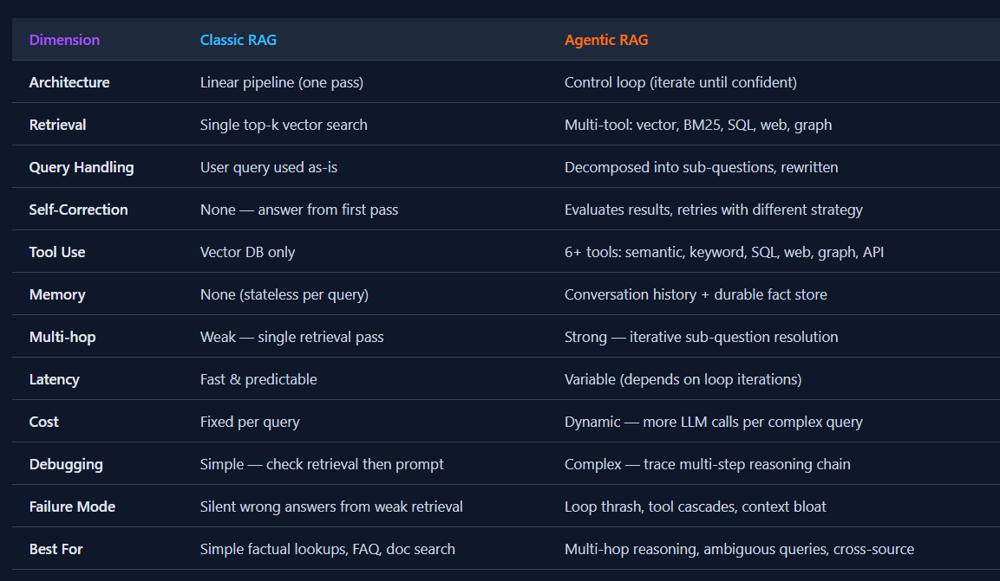
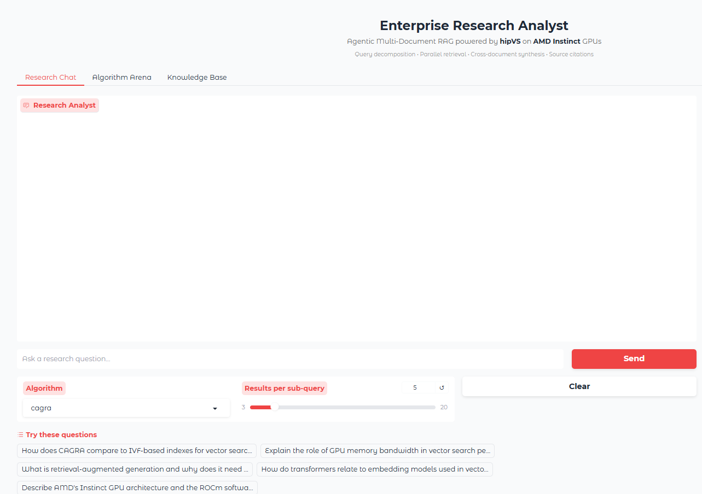
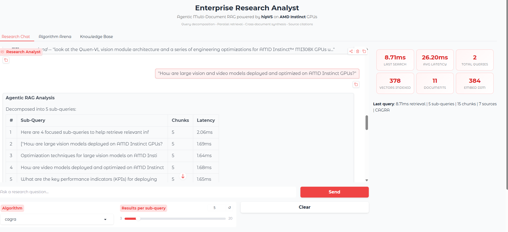
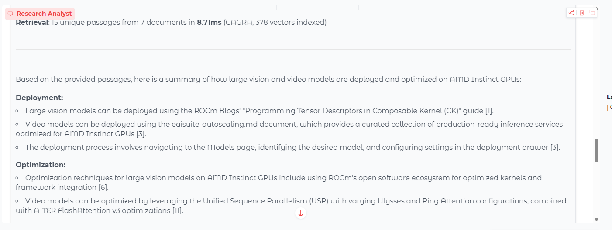
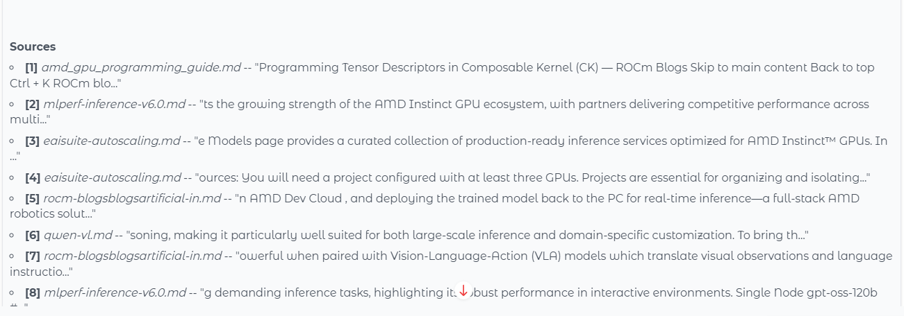
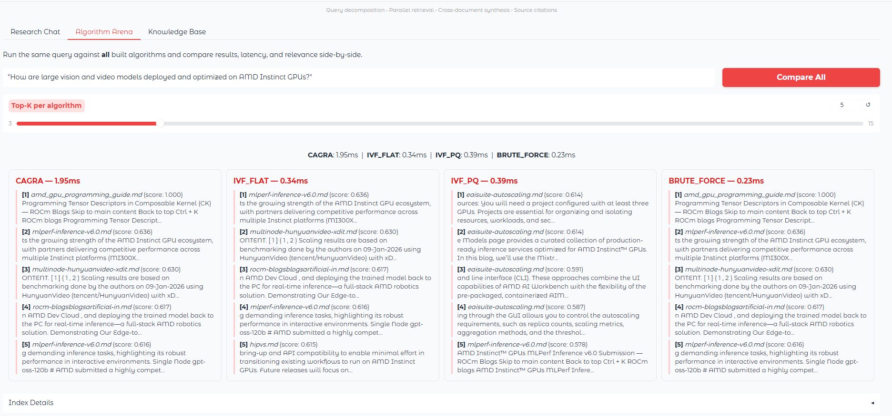
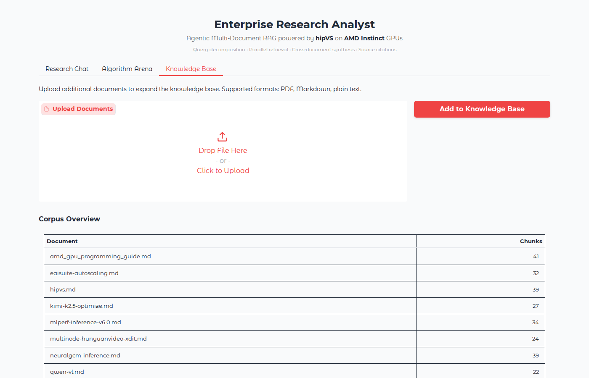

<!---
Copyright (c) 2026 Advanced Micro Devices, Inc. (AMD)

Permission is hereby granted, free of charge, to any person obtaining a copy
of this software and associated documentation files (the "Software"), to deal
in the Software without restriction, including without limitation the rights
to use, copy, modify, merge, publish, distribute, sublicense, and/or sell
copies of the Software, and to permit persons to whom the Software is
furnished to do so, subject to the following conditions:

The above copyright notice and this permission notice shall be included in all
copies or substantial portions of the Software.

THE SOFTWARE IS PROVIDED "AS IS", WITHOUT WARRANTY OF ANY KIND, EXPRESS OR
IMPLIED, INCLUDING BUT NOT LIMITED TO THE WARRANTIES OF MERCHANTABILITY,
FITNESS FOR A PARTICULAR PURPOSE AND NONINFRINGEMENT. IN NO EVENT SHALL THE
AUTHORS OR COPYRIGHT HOLDERS BE LIABLE FOR ANY CLAIM, DAMAGES OR OTHER
LIABILITY, WHETHER IN AN ACTION OF CONTRACT, TORT OR OTHERWISE, ARISING FROM,
OUT OF OR IN CONNECTION WITH THE SOFTWARE OR THE USE OR OTHER DEALINGS IN THE
SOFTWARE.
--->

# From Vector Search to Agentic RAG: Building an Enterprise Research Analyst with hipVS

hipVS and hipRAFT were introduced in this [earlier blog post](https://rocm.blogs.amd.com/software-tools-optimization/hipvs/README.html), which walked through the core vector search APIs. This post takes the next step: it shows what you can **build** with hipVS by walking through an [**Enterprise Research Analyst**](https://github.com/AMD-Ecosystem/hipVS/tree/HEAD/examples/demos/enterprise_research_analyst) demo — an end-to-end working agentic RAG (Retrieval-Augmented Generation) system that uses hipVS as its retrieval backbone. This demo combines multi-document ingestion, LLM-powered query decomposition, parallel GPU-accelerated vector search, and cross-document synthesis with source citations, all running on AMD hardware. Along the way, it highlights the specific hipVS and hipRAFT APIs the demo exercises and shares code snippets you can adapt for your own applications.

The table below provides a list of links for the key hipVS algorithms used in this blog.
>
> | Algorithm | Type | Python API | C++ API |
> |-----------|------|------------|---------|
> | **CAGRA** | Graph-based ANN | [Python](https://rocm.docs.amd.com/projects/hipVS/en/latest/reference/python_api/neighbors_cagra.html) | [C++](https://rocm.docs.amd.com/projects/hipVS/en/latest/reference/cpp_api/neighbors_cagra.html) |
> | **IVF-Flat** | Cluster-based ANN | [Python](https://rocm.docs.amd.com/projects/hipVS/en/latest/reference/python_api/neighbors_ivf_flat.html) | [C++](https://rocm.docs.amd.com/projects/hipVS/en/latest/reference/cpp_api/neighbors_ivf_flat.html) |
> | **IVF-PQ** | Compressed ANN | [Python](https://rocm.docs.amd.com/projects/hipVS/en/latest/reference/python_api/neighbors_ivf_pq.html) | [C++](https://rocm.docs.amd.com/projects/hipVS/en/latest/reference/cpp_api/neighbors_ivf_pq.html) |
> | **Brute-Force** | Exact k-NN | [Python](https://rocm.docs.amd.com/projects/hipVS/en/latest/reference/python_api/neighbors_brute_force.html) | [C++](https://rocm.docs.amd.com/projects/hipVS/en/latest/reference/cpp_api/neighbors_bruteforce.html) |
> | **HNSW** | CPU graph search | [Python](https://rocm.docs.amd.com/projects/hipVS/en/latest/reference/python_api/neighbors_hnsw.html) | [C++](https://rocm.docs.amd.com/projects/hipVS/en/latest/reference/cpp_api/neighbors_hnsw.html) |
>
> **Documentation links:** [hipVS documentation](https://rocm.docs.amd.com/projects/hipVS/en/latest/index.html) &bull; [Python API reference](https://rocm.docs.amd.com/projects/hipVS/en/latest/reference/reference-python.html) &bull; [ROCm docs](https://rocm.docs.amd.com/en/latest/) &bull; [GitHub](https://github.com/AMD-Ecosystem/hipVS)

## What is an Agentic RAG System?

Standard RAG is straightforward: embed a question, search a vector index, feed the results to an LLM, and get an answer. The workflow is illustrated in the figure below.  It works well for simple, single-faceted questions.



However, research questions in real life scenarios are rarely simple. For instance, the question *"How are large vision and video models deployed and optimized on AMD Instinct GPUs?"* requires a deep understanding of vision-language model serving, video generation pipelines, multi-node inference strategies, and the optimizations available in the ROCm ecosystem. A single vector search query rarely captures the breadth required.

**Agentic RAG** solves this by replacing the single-shot retrieve-and-answer pattern with a multi-step pipeline:

1. **Decompose** — an LLM analyzes the question and breaks it into 3-5 focused sub-queries, each targeting a different facet of the problem. This planning step is what makes the system "agentic": it reasons about what information it needs before retrieving anything, much like a human researcher scoping out a literature review.
2. **Multi-retrieve** — each sub-query is embedded and searched independently against the vector index, producing multiple result sets instead of just one. This is fundamentally different from standard RAG's single retrieval pass: the system casts a wider net, covering angles that are hard to capture in a single query pass.
3. **Deduplicate and merge** — because different sub-queries often surface overlapping passages, results are merged by chunk ID and ranked by relevance. Standard RAG has little direct equivalent for this step.
4. **Cross-document synthesis** — the LLM receives evidence from all sub-queries and must reconcile, compare, and cite across multiple sources. This is a harder generation task than standard RAG's "summarize these passages" — the model must weave together information that was retrieved for different reasons into a coherent, cited answer.

The table below summarizes the key differences between the classic RAG and agentic RAG systems.



The second step of the pipeline, multi-retrieve, is where GPU-accelerated vector search becomes critical. An agentic system makes **multiple retrieval calls per user question**, and a CPU-based vector store can quickly turn that fan-out into a major bottleneck in end-to-end latency. Running the same searches on GPU through hipVS keeps the per-query cost low enough that the retrieval phase stays a small fraction of the end-to-end response time.

## System Architecture

The diagram below traces what happens when a user asks the Enterprise Research Analyst a question. Reading top to bottom: the question enters a Gradio web UI, an LLM-driven agent decomposes it into focused sub-queries, each sub-query is embedded on GPU and searched against a pre-built hipVS index, the merged top passages are deduplicated and ranked, and an LLM synthesizes a cited answer that is rendered alongside live performance metrics. **hipVS and hipRAFT sit at the center** of this loop: the entire retrieval fan-out runs on AMD GPU, with hipRAFT providing the underlying resource handle, distance kernels, and clustering primitives that hipVS builds on.


The diagram is organized around three layers:

1. **User Interface (top)** — A Gradio web app with three tabs: **Research Chat**, **Algorithm Arena**, and **Knowledge Base**.

2. **Agentic RAG Engine (wraps the search step)** — Decomposes the question into sub-queries (LLM, with a heuristic fallback), embeds each one on GPU via SentenceTransformer, fans the embeddings out into parallel hipVS searches, deduplicates and ranks the returned chunks, and produces the final response through an LLM (Ollama, OpenAI, or a retrieval-only mode that skips the LLM).

3. **GPU Vector Search, hipVS (center)** — The retrieval primitive the agent calls once per sub-query, against a pre-built index over the GPU-resident embedding matrix. The active algorithm is one of **CAGRA**, **IVF-Flat**, **IVF-PQ**, or **Brute-Force**, switchable from the UI. hipRAFT supplies the `Resources` handle and core utilities; hipVS implements the distance kernels and the k-means clustering used for IVF partitioning.

Index construction over the document corpus (parse, chunk, embed, cache, and build the four hipVS indexes) happens outside this per-question loop. It runs at application startup, and again whenever new files are added through the Knowledge Base tab.

## The Enterprise Research Analyst Demo

The Enterprise Research Analyst was built as a Gradio-based web application with three main interfaces: a Research Chat for agentic Q&A, an Algorithm Arena for comparing hipVS index types, and a Knowledge Base manager for live document uploads.

### Research Chat: Agentic Q&A with Citations

The figure below shows the landing screen of the Enterprise Research Analyst application, a conversational research assistant organized into three tabs — **Research Chat**, **Algorithm Arena**, and **Knowledge Base**. On the Research Chat tab (shown), users type a question (or pick one from the **Try these questions** suggestions at the bottom of the window) and the system decomposes it into sub-queries, retrieves relevant passages on GPU, and synthesizes a cited answer. The **Algorithm** drop-down switches the active retrieval backend — CAGRA (default), IVF-Flat, IVF-PQ, or Brute-Force — and the **Results per sub-query** slider controls how many top-k passages each sub-query retrieves before deduplication.



The figure below shows the Research Chat with an active query. For the question *"How are large vision and video models deployed and optimized on AMD Instinct GPUs?"*, the system decomposed it into multiple focused sub-queries and retrieved numerous unique passages from several source documents using hipVS CAGRA. The **Agentic RAG Analysis** trace table in the centre shows each sub-query with its chunk count and retrieval latency, while the **right-hand metrics panel** displays live performance counters — last search, average latency, total queries, vectors indexed, documents loaded, and embedding dimension.



The figure below shows the system's synthesized answer that becomes visible as you scroll down in this example. A retrieval banner at the top reports the unique passages, source documents, and active index (here, CAGRA over 378 vectors), followed by structured Deployment and Optimization sections with numbered inline citations to the source passages.



The figure below shows the **Sources** block below each synthesized answer when you scroll down to the bottom of the window, where each numbered citation maps to the source document it came from. This gives users a direct path from citations in the synthesized answer back to the underlying passage.



### Algorithm Arena: Compare All Index Types

The Algorithm Arena tab (see the figure below) shows the results of the same query running against **each configured** hipVS index type simultaneously — CAGRA, IVF-Flat, IVF-PQ, and Brute-Force — and displays them side by side. Each card shows the top-5 retrieved passages with source names, relevance scores, and per-algorithm search latency. This makes recall differences between approximate and exact algorithms easy to compare.



This view is particularly useful for understanding how the different algorithms behave on your specific corpus — do they return the same top results? How do the relevance scores differ? It turns the abstract concept of "recall vs. latency trade-off" into something you can see and interact with.

### Knowledge Base: Live Document Upload

The Knowledge Base tab shown in the figure below lets users upload additional documents at runtime. Supported formats include PDF (via pypdf), Markdown, reStructuredText, and plain text. The system parses the uploaded documents, chunks the text, generates embeddings, and rebuilds the hipVS indexes — while the app continues serving queries. The corpus overview table lists indexed documents and their chunk counts.



The Enterprise Research Analyst demo application comes with a built-in sample corpus of technical articles covering vector search, GPU computing, transformers, RAG, AMD hardware, and the ROCm ecosystem, so it works out of the box without needing an external corpus.

## How the Demo Uses hipVS: Key API Patterns

The Enterprise Research Analyst uses several important hipVS Python APIs. The source code included in the demo covers the retrieval path end to end. The key APIs used at each stage are described in detail here.

```{note}
Throughout this demo, you will see `cuvs` in package imports. This reflects the fact that hipVS adopts the well-known cuVS API. This API compatibility helps existing cuVS workloads move to supported AMD devices with comparatively light porting, allowing you to use AMD's ROCm platform for your data processing tasks.
```

### GPU Resource Management

**Key API:** [`cuvs.common.Resources`](https://rocm.docs.amd.com/projects/hipVS/en/latest/reference/python_api/common.html)

Most hipVS workflows begin by creating a `Resources` handle. This object, powered by hipRAFT under the hood, manages GPU streams, memory pools, and synchronization for you. You create it once and pass it to each `build()` and `search()` call — hipVS uses it to schedule GPU work efficiently and avoid redundant allocations. Calling `resources.sync()` after GPU operations ensures results are ready before the CPU reads them.

```python
from cuvs.common import Resources

resources = Resources()
```

### Building Indexes

**Key APIs:**
[`cagra.build()`](https://rocm.docs.amd.com/projects/hipVS/en/latest/reference/python_api/neighbors_cagra.html) &bull;
[`ivf_flat.build()`](https://rocm.docs.amd.com/projects/hipVS/en/latest/reference/python_api/neighbors_ivf_flat.html) &bull;
[`ivf_pq.build()`](https://rocm.docs.amd.com/projects/hipVS/en/latest/reference/python_api/neighbors_ivf_pq.html) &bull;
[`brute_force.build()`](https://rocm.docs.amd.com/projects/hipVS/en/latest/reference/python_api/neighbors_brute_force.html)

The demo builds **four concurrent indexes** from the same embedding data. After the document corpus is chunked and embedded, the embedding matrix is transferred to GPU memory with `cp.asarray()` once and shared across the index builds — without doubling the embedding footprint in memory.

Each `build()` call takes an `IndexParams` configuration and the GPU-resident dataset, then returns a ready-to-search index. The pattern is the same across the four algorithms; it is chiefly the parameters that differ:

- **CAGRA** ([`cagra.IndexParams`](https://rocm.docs.amd.com/projects/hipVS/en/latest/reference/python_api/neighbors_cagra.html#cuvs.neighbors.cagra.IndexParams)) — builds a GPU-optimized graph for approximate nearest neighbor search. Key parameters: `graph_degree` (connectivity of the final graph) and `intermediate_graph_degree` (connectivity during construction, higher means better recall at the cost of build time).
- **IVF-Flat** ([`ivf_flat.IndexParams`](https://rocm.docs.amd.com/projects/hipVS/en/latest/reference/python_api/neighbors_ivf_flat.html#cuvs.neighbors.ivf_flat.IndexParams)) — partitions the vector space into `n_lists` clusters using k-means, then stores full-precision vectors within each cluster. This approach provides high recall at the cost of additional memory usage.
- **IVF-PQ** ([`ivf_pq.IndexParams`](https://rocm.docs.amd.com/projects/hipVS/en/latest/reference/python_api/neighbors_ivf_pq.html#cuvs.neighbors.ivf_pq.IndexParams)) — same cluster-based partitioning as IVF-Flat, but compresses vectors using product quantization (`pq_dim`, `pq_bits`). This approach trades some recall for reduced memory usage.
- **Brute-Force** ([`brute_force.build()`](https://rocm.docs.amd.com/projects/hipVS/en/latest/reference/python_api/neighbors_brute_force.html#cuvs.neighbors.brute_force.build)) — exact k-NN with no approximation. No index parameters needed; useful as a ground-truth baseline.

```python
import cupy as cp
from cuvs.neighbors import brute_force, cagra, ivf_flat, ivf_pq

gpu_data = cp.asarray(embeddings, dtype=cp.float32)
n, dim = embeddings.shape

n_lists = min(100, max(1, n // 10))
pq_dim = min(dim, max(2, dim // 4))

cagra_index = cagra.build(
    cagra.IndexParams(metric="inner_product",
                      graph_degree=min(32, n - 1),
                      intermediate_graph_degree=min(64, n - 1)),
    gpu_data, resources=resources,
)
ivf_flat_index = ivf_flat.build(
    ivf_flat.IndexParams(n_lists=n_lists, metric="inner_product"),
    gpu_data, resources=resources,
)
ivf_pq_index = ivf_pq.build(
    ivf_pq.IndexParams(n_lists=n_lists, metric="inner_product",
                       pq_dim=pq_dim, pq_bits=8),
    gpu_data, resources=resources,
)
bf_index = brute_force.build(
    gpu_data, metric="inner_product", resources=resources,
)
resources.sync()
```

All four algorithms use `inner_product` as the distance metric. Since the embeddings are L2-normalized (which `sentence-transformers` does by default), inner product is equivalent to cosine similarity. Note that `n_lists`, `pq_dim`, `graph_degree`, and `intermediate_graph_degree` are variable — the demo dynamically adjusts these parameters based on corpus size to balance recall and build time. You'll see this logic in the source code's `HipVSIndex` class.

### Searching Indexes

**Key APIs:**
[`cagra.search()`](https://rocm.docs.amd.com/projects/hipVS/en/latest/reference/python_api/neighbors_cagra.html#cuvs.neighbors.cagra.search) &bull;
[`ivf_flat.search()`](https://rocm.docs.amd.com/projects/hipVS/en/latest/reference/python_api/neighbors_ivf_flat.html#cuvs.neighbors.ivf_flat.search) &bull;
[`ivf_pq.search()`](https://rocm.docs.amd.com/projects/hipVS/en/latest/reference/python_api/neighbors_ivf_pq.html#cuvs.neighbors.ivf_pq.search) &bull;
[`brute_force.search()`](https://rocm.docs.amd.com/projects/hipVS/en/latest/reference/python_api/neighbors_brute_force.html#cuvs.neighbors.brute_force.search)

Every `search()` call follows the same pattern: pass a `SearchParams` config, the built index, a GPU-resident query matrix, and `k` (number of neighbors). It returns two GPU arrays — `distances` and `neighbors` (the IDs of the nearest vectors). The entire search runs on GPU; only the final result transfer (`cp.asnumpy()`) touches the CPU.

Each algorithm has its own `SearchParams` with tuning knobs that let you trade accuracy for speed at query time:

- **CAGRA** — `SearchParams()` defaults work well; for large batches you can tune `itopk_size` for finer accuracy control.
- **IVF-Flat / IVF-PQ** — `SearchParams(n_probes=N)` controls how many clusters to search. Higher `n_probes` tends to increase recall but increases latency.
- **Brute-Force** — no search parameters; it always scans every vector.

```python
gpu_query = cp.asarray(query_embedding, dtype=cp.float32)

distances, neighbors = cagra.search(
    cagra.SearchParams(), cagra_index, gpu_query, k=5, resources=resources,
)
resources.sync()

ids = cp.asnumpy(neighbors)[0].tolist()
scores = cp.asnumpy(distances)[0].tolist()
```

The demo's `HipVSIndex.search()` method accepts algorithm names (`cagra`, `ivf_flat`, and so on) and dispatches to the corresponding `search()` API, so layers above the index do not branch on implementation-specific retrieval details. You can flip the active index through configuration rather than refactoring calling code — see the `HipVSIndex` implementation in the repository.

### Multi-Retrieve with Deduplication

**Key APIs:** `cagra.search()` called in a loop, `cp.asarray()` / `cp.asnumpy()` for GPU transfers

The agentic pipeline's core pattern is to run **multiple sub-queries** against the same hipVS index and merge the results. Each sub-query is independently embedded, transferred to GPU, and searched. Because different sub-queries often retrieve overlapping passages, the demo deduplicates by tracking seen chunk IDs and collects distinct passages, sorted by relevance score.

This is the pattern that makes GPU-accelerated search essential: with several sub-queries per user question, the total retrieval phase needs to stay fast. Running the searches on GPU through hipVS keeps that fan-out from becoming the bottleneck. The implementation is in the `ResearchAnalyst` class in the source code.

```python
def multi_retrieve(sub_queries, model, index, resources, top_k=5):
    seen_ids = set()
    unique_results = []
    for sq in sub_queries:
        query_emb = model.encode([sq], normalize_embeddings=True).astype(np.float32)
        gpu_query = cp.asarray(query_emb, dtype=cp.float32)
        distances, neighbors = cagra.search(
            cagra.SearchParams(), index, gpu_query, k=top_k, resources=resources,
        )
        resources.sync()
        for idx, score in zip(cp.asnumpy(neighbors)[0], cp.asnumpy(distances)[0]):
            if idx not in seen_ids:
                seen_ids.add(idx)
                unique_results.append((idx, float(score)))
    unique_results.sort(key=lambda x: x[1], reverse=True)
    return unique_results
```

### Dynamic Index Rebuilding

**Key APIs:** `cagra.build()`, `ivf_flat.build()`, `ivf_pq.build()`, `brute_force.build()` (same build APIs, called again with expanded data)

When users upload new documents through the Knowledge Base tab, the demo parses, chunks, and embeds the new content, concatenates it with the existing embedding matrix using `np.vstack()`, and then calls each of the four `build()` APIs again with the expanded dataset. hipVS performs index construction on GPU, so rebuild operations remain fast enough to keep the application responsive as the corpus grows. The indexes are swapped atomically so search remains available across the swap in typical operation.

```python
all_embeddings = np.vstack([existing_embeddings, new_embeddings])
gpu_data = cp.asarray(all_embeddings, dtype=cp.float32)
cagra_index = cagra.build(cagra_params, gpu_data, resources=resources)
ivf_flat_index = ivf_flat.build(ivf_flat_params, gpu_data, resources=resources)
ivf_pq_index = ivf_pq.build(ivf_pq_params, gpu_data, resources=resources)
bf_index = brute_force.build(gpu_data, metric="inner_product", resources=resources)
resources.sync()
```

## The Full Pipeline: From Question to Cited Answer

Let's walk through a concrete example to see how all the pieces fit together.

**User asks:** *"How are large vision and video models deployed and optimized on AMD Instinct GPUs?"*

**Step 1 — Decomposition.** The LLM (running locally via Ollama or remotely via OpenAI) breaks this into focused sub-queries:

| # | Sub-Query |
|---|-----------|
| 1 | Here are 4 focused sub-queries to help retrieve relevant inf... |
| 2 | "How are large vision models deployed on AMD Instinct GPUs? |
| 3 | Optimization techniques for large vision models on AMD Insti... |
| 4 | How are video models deployed and optimized on AMD Instinct... |
| 5 | What are the key performance indicators (KPIs) for deploying... |

**Step 2 — Retrieval.** Each sub-query is embedded with `all-MiniLM-L6-v2` and searched against the hipVS CAGRA index. The reasoning trace table shows per-sub-query metrics:

| # | Sub-Query | Chunks |
|---|-----------|--------|
| 1 | Here are 4 focused sub-queries to help retrieve relevant inf... | 5 |
| 2 | "How are large vision models deployed on AMD Instinct GPUs? | 5 |
| 3 | Optimization techniques for large vision models on AMD Insti... | 5 |
| 4 | How are video models deployed and optimized on AMD Instinct... | 5 |
| 5 | What are the key performance indicators (KPIs) for deploying... | 5 |

After deduplication, the system has **multiple unique passages from several source documents** (CAGRA index over the vectors shown in the trace).

**Step 3 — Synthesis.** The LLM receives the merged passages with source metadata and generates a structured answer with numbered citations linking each claim back to a source passage:

Based on the provided passages, here is a summary of how large vision and video models are deployed and optimized on AMD Instinct GPUs:

**Deployment:**

- Large vision models can be deployed using the ROCm Blogs' "Programming Tensor Descriptors in Composable Kernel (CK)" guide [1].
- Video models can be deployed using the eaisuite-autoscaling.md document, which provides a curated collection of production-ready inference services optimized for AMD Instinct GPUs [3].
- The deployment process involves navigating to the Models page, identifying the desired model, and configuring settings in the deployment drawer [3].

**Optimization:**

- Optimization techniques for large vision models on AMD Instinct GPUs include using ROCm's open software ecosystem for optimized kernels and framework integration [6].
- Video models can be optimized by leveraging the Unified Sequence Parallelism (USP) with varying Ulysses and Ring Attention configurations, combined with AITER FlashAttention v3 optimizations [11].

Numbered citations map back to source passages, giving users clear traceability from the synthesis to the underlying evidence.

## Demo Architecture: Component-to-API Mapping

Here's how the system's components map to hipVS and hipRAFT APIs:

| Component | What It Does | hipVS / hipRAFT APIs Used |
|-----------|-------------|--------------------------|
| **Document Parser** | Ingests PDF, Markdown, plain text | *(application layer — no hipVS)* |
| **Text Chunker** | Splits documents into overlapping passages (800 chars, 150 overlap) | *(application layer — no hipVS)* |
| **Text Embedder** | Encodes passages into 384-dim normalized vectors | *(sentence-transformers — no hipVS)* |
| **GPU Data Transfer** | Moves embeddings to GPU memory | `cp.asarray()` (CuPy, backed by hipRAFT memory management) |
| **Index Build** | Constructs CAGRA, IVF-Flat, IVF-PQ, and Brute-Force indexes | `cagra.build()`, `ivf_flat.build()`, `ivf_pq.build()`, `brute_force.build()` |
| **Vector Search** | Finds top-K nearest passages for a query | `cagra.search()`, `ivf_flat.search()`, `ivf_pq.search()`, `brute_force.search()` |
| **GPU Sync** | Ensures GPU results are ready before CPU reads them | `resources.sync()` |
| **Result Transfer** | Moves neighbor IDs and distances back to CPU | `cp.asnumpy()` |
| **Query Decomposition** | LLM breaks complex question into sub-queries | *(LLM backend — Ollama / OpenAI)* |
| **Synthesis** | LLM generates cited answer from retrieved passages | *(LLM backend — Ollama / OpenAI)* |
| **Algorithm Arena** | Runs same query against each index type, compares results | The four `search()` APIs dispatched in sequence |
| **Live Upload** | Rebuilds indexes when new documents are added | `np.vstack()` + the four `build()` APIs |

**hipRAFT's role** is mostly invisible at the Python level but important underneath: the `Resources` handle wraps hipRAFT's C++ resource management for GPU streams and pooled memory, and hipRAFT provides foundational types and linear algebra utilities used throughout hipVS. The distance computation kernels (inner product, L2, cosine) and the k-means clustering used by IVF-Flat and IVF-PQ are implemented in hipVS itself, built on top of these hipRAFT primitives.

## What You Can Build with This

The Enterprise Research Analyst is one illustrative example of what you can build with hipVS, and the pattern generalizes to other use cases. The same retrieval-driven structure extends to many applications that combine embeddings, hipVS search, and downstream models. Some examples include:

- **Multi-turn research assistants** that maintain conversation context and refine searches across turns
- **Document comparison tools** that find semantic overlap between large document sets
- **Code search engines** that embed function-level documentation and retrieve relevant implementations
- **Multimodal search** combining CLIP/SigLIP embeddings with hipVS for text-to-image or image-to-image retrieval
- **Real-time recommendation systems** that use user behavior embeddings to surface personalized content

The common thread across these examples is the need for workloads that search high-dimensional vectors at interactive speed, on AMD hardware, with broad API alignment to existing cuVS workflows.

```{note}
**LLM backends.** The demo can be run with [Ollama](https://ollama.com/) (MIT-licensed) using a Llama-family model such as `llama3.2:3b` (subject to the [Meta Llama 3.2 Community License](https://www.llama.com/llama3_2/license/) and the [Acceptable Use Policy](https://www.llama.com/llama3_2/use-policy)) or with the [OpenAI API](https://openai.com/) (subject to OpenAI's terms of service). Users are responsible for complying with the license and acceptable-use terms of whichever backend they choose. AMD does not redistribute these models or services.
```

## Getting Started

If you're new to hipVS, start with our [introductory blog post](https://rocm.blogs.amd.com/software-tools-optimization/hipvs/README.html), which walks through the four core search algorithms with an interactive Jupyter notebook.

For API documentation, installation instructions, and further examples:

- **Demo source code**: [Enterprise Research Analyst on GitHub](https://github.com/AMD-Ecosystem/hipVS/tree/HEAD/examples/demos/enterprise_research_analyst)
- **hipVS documentation**: [ROCm-DS hipVS docs](https://rocm.docs.amd.com/projects/hipVS/en/latest/index.html)
- **hipRAFT documentation**: [ROCm-DS hipRAFT docs](https://rocm.docs.amd.com/projects/hipRaft/en/latest)
- **Installation**: `pip install amd-hipvs` from the AMD ROCm PyPI

## Summary

This blog walked through what it takes to turn a single user question into a cited answer, with the full pipeline running on AMD GPUs. You've seen how agentic decomposition, parallel hipVS retrieval, and synthesis across documents fit together within a small, consistent Python API, and how the same code path drives four different index types without changing the application's architecture.

Here are the key takeaways of this blog:

1. **hipVS powers practical applications as well as benchmarks.** The Enterprise Research Analyst demonstrates agentic RAG with query decomposition, parallel retrieval, and cited synthesis — each stage backed by GPU-accelerated vector search on AMD hardware.

2. **Fast retrieval suits the agentic pattern.** When a system fires several sub-queries per user question, on-GPU search latency materially affects whether the application feels responsive or sluggish.

3. **Four algorithms, one API surface.** The demo builds CAGRA, IVF-Flat, IVF-PQ, and Brute-Force indexes from the same data using the same `build()` / `search()` pattern. Switch algorithms by changing a parameter, not your architecture.

4. **hipRAFT powers the foundation.** GPU resource management, core types, and linear algebra utilities come from hipRAFT, while hipVS builds the distance kernels and k-means clustering on top — largely abstracted behind a clean Python API.

5. **Compatible with the cuVS API.** The demo uses `cuvs.neighbors` imports throughout, function signatures align with the upstream cuVS API, and parameter names are consistent in common cases, so many cuVS-based code paths can run on AMD hardware with minimal modification.

The work shown here is one snapshot of a broader effort. The team is continuing to optimize hipVS across each of the index types in this post, and we are extending compatibility so that workloads built on the Faiss API can target AMD GPUs through hipVS. We are also tightening the cadence of hipVS releases, so new feature work and API improvements reach AMD GPUs faster. Future blogs will revisit these efforts as they mature. Follow the ROCm Blogs and the hipVS repository to see what lands first.

## Acknowledgements

The authors would also like to acknowledge the broader AMD team whose contributions were instrumental in enabling hipVS and hipRAFT:
Philipp Samfass, Dominic Etienne Charrier, Michael Obersteiner, Mohammad NorouziArab, Marco Grond, Bhavesh Lad, Pankaj Gupta, Ritesh Hiremath, Randy Hartgrove, Ramesh Mantha.

## Disclaimers

The information presented in this document is for informational purposes only and may contain technical inaccuracies, omissions, and typographical errors. The information contained herein is subject to change and may be rendered inaccurate for many reasons, including but not limited to product and roadmap changes, component and motherboard version changes, new model and/or product releases, product differences between differing manufacturers, software changes, BIOS flashes, firmware upgrades, or the like. Any computer system has risks of security vulnerabilities that cannot be completely prevented or mitigated. AMD assumes no obligation to update or otherwise correct or revise this information. However, AMD reserves the right to revise this information and to make changes from time to time to the content hereof without obligation of AMD to notify any person of such revisions or changes. THIS INFORMATION IS PROVIDED "AS IS." AMD MAKES NO REPRESENTATIONS OR WARRANTIES WITH RESPECT TO THE CONTENTS HEREOF AND ASSUMES NO RESPONSIBILITY FOR ANY INACCURACIES, ERRORS, OR OMISSIONS THAT MAY APPEAR IN THIS INFORMATION. AMD SPECIFICALLY DISCLAIMS ANY IMPLIED WARRANTIES OF NON-INFRINGEMENT, MERCHANTABILITY, OR FITNESS FOR ANY PARTICULAR PURPOSE. IN NO EVENT WILL AMD BE LIABLE TO ANY PERSON FOR ANY RELIANCE, DIRECT, INDIRECT, SPECIAL, OR OTHER CONSEQUENTIAL DAMAGES ARISING FROM THE USE OF ANY INFORMATION CONTAINED HEREIN, EVEN IF AMD IS EXPRESSLY ADVISED OF THE POSSIBILITY OF SUCH DAMAGES.

AMD, the AMD Arrow logo, AMD Instinct, AMD ROCm, and combinations thereof are trademarks of Advanced Micro Devices, Inc. NVIDIA, CUDA, RAPIDS, and cuVS are trademarks and/or registered trademarks of NVIDIA Corporation in the United States and other countries. PyTorch is a registered trademark of The Linux Foundation. Llama is a trademark of Meta Platforms, Inc. Ollama is a trademark of Ollama, Inc. OpenAI, ChatGPT, and GPT are trademarks of OpenAI, Inc. Other product names used in this publication are for identification purposes only and may be trademarks of their respective companies.

Third-party content is licensed to you directly by the third party that owns the content and is not licensed to you by AMD. ALL LINKED THIRD-PARTY CONTENT IS PROVIDED "AS IS" WITHOUT A WARRANTY OF ANY KIND. USE OF SUCH THIRD-PARTY CONTENT IS DONE AT YOUR SOLE DISCRETION AND UNDER NO CIRCUMSTANCES WILL AMD BE LIABLE TO YOU FOR ANY THIRD-PARTY CONTENT. YOU ASSUME ALL RISK AND ARE SOLELY RESPONSIBLE FOR ANY DAMAGES THAT MAY ARISE FROM YOUR USE OF THIRD-PARTY CONTENT.

© 2026 Advanced Micro Devices, Inc. All rights reserved.
