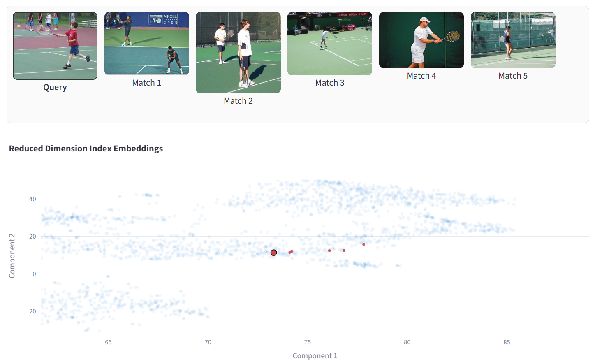

<!---
Copyright (c) 2025 Advanced Micro Devices, Inc. (AMD)

Permission is hereby granted, free of charge, to any person obtaining a copy
of this software and associated documentation files (the "Software"), to deal
in the Software without restriction, including without limitation the rights
to use, copy, modify, merge, publish, distribute, sublicense and/or sell
copies of the Software and to permit persons to whom the Software is
furnished to do so, subject to the following conditions:

The above copyright notice and this permission notice shall be included in all
copies or substantial portions of the Software.

THE SOFTWARE IS PROVIDED "AS IS", WITHOUT WARRANTY OF ANY KIND, EXPRESS OR
IMPLIED, INCLUDING BUT NOT LIMITED TO THE WARRANTIES OF MERCHANTABILITY,
FITNESS FOR A PARTICULAR PURPOSE AND NONINFRINGEMENT. IN NO EVENT SHALL THE
AUTHORS OR COPYRIGHT HOLDERS BE LIABLE FOR ANY CLAIM, DAMAGES OR OTHER
LIABILITY, WHETHER IN AN ACTION OF CONTRACT, TORT OR OTHERWISE, ARISING FROM,
OUT OF OR IN CONNECTION WITH THE SOFTWARE OR THE USE OR OTHER DEALINGS IN THE
SOFTWARE.
--->

# Accelerating Vector Search: hipVS and hipRAFT on AMD

In this blog, you'll get an introductory look at hipVS, AMD’s GPU-accelerated vector search library, and its relationship to hipRAFT, a foundational library used by hipVS and other ROCmDS projects. Using an interactive Jupyter notebook, you'll explore four major vector search methods available in hipVS: Brute-Force KNN, IVF-Flat, IVF-PQ, and CAGRA—each illustrating different trade-offs in accuracy, performance, and memory. You'll see how to build and query vector search indexes using the hipVS API for applications such as semantic search, recommendation systems, and RAG pipelines. Since the API is compatible with NVIDIA's cuVS, migrating workflows to AMD hardware is seamless and requires minimal changes.

## What is vector search?

Vector search is a method for retrieving items based on similarity in a high-dimensional embedding space, where each item and query are represented as numerical vectors. By measuring the distance or closeness between these vectors, it uncovers relationships based on meaning or context embedded in the vector space. This approach is particularly useful for handling unstructured data like text, images and audio, enabling applications such as semantic search, recommendation systems and large language model (LLM) context retrieval.

The figure below shows a demo of vector search on images: the top strip shows a query image (a person hitting a tennis ball) followed by the top five matches, all visually similar tennis scenes. The scatter plot below projects the embedding vectors into 2D; light blue dots are all indexed embeddings, while the query and its nearest neighbors are highlighted in red (the query as a larger outlined dot). The cluster of red points near the query illustrates how semantically similar frames lie close together in the embedding space.



## What is hipVS?

hipVS joins the AMD ROCm™ Data Science Toolkit ([ROCm-DS](https://rocm.docs.amd.com/projects/rocm-ds/en/latest/)), adding GPU-accelerated vector-search capabilities to the ROCm ecosystem. As a HIP port of Nvidia's RAPIDS® cuVS, it is built to deliver high-throughput approximate nearest neighbor (ANN) indexing and search on Instinct-class GPUs. It implements modern ANN methods such as IVF-Flat, IVF-PQ and graph-based approaches like CAGRA, with options for compressed or low-precision embeddings and efficient batched queries.

### What is hipRaft and how does it relate to hipVS?

hipRaft is AMD’s HIP/ROCm port of RAPIDS RAFT, a toolkit of reusable GPU primitives and utilities (resource handles, streams, memory allocators and multi-GPU comms) for building high-performance data-science algorithms. hipVS is built on top of hipRaft, and relies on hipRaft’s resource-handle to coordinate streams and pooled memory, while using its math/graph/nearest-neighbor utilities and communication backends for single and multi-GPU execution. In short, hipRaft supplies the infrastructure and common kernels and hipVS leverages that foundation to implement fast ANN indexes like IVF-Flat, IVF-PQ and CAGRA on ROCm.

Key features of hipVS and hipRAFT include:

- **API Compatibility**: Seamlessly transition from NVIDIA cuVS to hipVS and RAFT to hipRAFT, maintaining API compatibility to streamline integration and workload migration to AMD GPUs.
- **Versatile API Support**: Built for developers, with native APIs in Python and C++ for hipRAFT and C, C++, Python and Rust for hipVS, ensuring seamless integration across diverse workloads.
- **ROCm-DS system**: hipVS and hipRAFT are core components of the ROCm-DS unified suite of open-source libraries for end-to-end GPU acceleration in data science, analytics, and AI.
- **Open Source and Collaborative**: Embrace open development under the Apache-2.0 and MIT license, welcoming contributions from the broader community to drive innovation and development.
- **Foundational GPU Building Blocks for AI & Data Science**: Powers libraries like hipGraph, enabling fast, scalable analytics and ML across various domains.

For more information please refer to the [hipVS documentation](https://rocm.docs.amd.com/projects/hipVS/en/latest/) and [hipRAFT documentation](https://rocm.docs.amd.com/projects/hipRaft/en/latest).

## Applications of hipVS

hipVS can be used in various AI applications. Some of the most well known applications include:

1. **Generative AI & RAG Pipelines**
    - Powers Retrieval Augmented Generation (RAG) by performing lightning-fast vector searches over billions of embeddings.
    - Enables context retrieval, document similarity, and semantic search.
2. **Recommendation Systems**
    - Accelerates user-item similarity and content-based filtering using different search.
    - Supports personalization at scale e.g., e-commerce, streaming, and advertising platforms can match users with the most relevant products or media in real time.
3. **Computer Vision & Multimedia Retrieval**
    - Speeds up image, video, and audio similarity search using deep-learning embeddings.
    - Used for visual search, content deduplication, and media recommendation workflows.
4. **Scientific & Industrial AI**
    - Supports large-scale clustering and similarity mapping in genomics, materials science, manufacturing QA, and autonomous systems.
    - Used for defect detection, pattern recognition, and model validation on high-dimensional data.

## Environment setup

The rest of this blog is an interactive walkthrough using a Jupyter notebook that demonstrates various vector search methods available in hipVS Python API: Brute Force KNN, IVF-Flat, IVF-PQ and CAGRA. Each method balances accuracy, speed and memory differently.

### Requirements

- AMD GPU: See the [ROCm documentation page](https://rocm.docs.amd.com/projects/install-on-linux/en/latest/reference/system-requirements.html) for supported hardware and operating systems.
- ROCm 7.0.2: See the [ROCm installation for Linux](https://rocm.docs.amd.com/projects/install-on-linux/en/latest/index.html) for installation instructions.
- Docker: See [Install Docker Engine on Ubuntu](https://docs.docker.com/engine/install/ubuntu/#install-using-the-repository) for installation instructions.

This blog utilizes a [custom Dockerfile](https://github.com/ROCm/rocm-blogs/tree/release/blogs/software-tools-optimization/hipvs/docker/Dockerfile) that provides all the necessary instructions to build a Docker image, allowing you to run the blog without manually installing any dependencies.

We recommend using the provided Docker container to run the examples in this blog, as it is the easiest and most reliable way to construct the required environment.

### Setting up the Jupyter Notebook environment

- Clone the repo and `cd` into the blog directory:

    ```shell
    git clone https://github.com/ROCm/rocm-blogs.git
    cd rocm-blogs/blogs/software-tools-optimization/hipvs 
    ```

- Build and start the container. For details on the build process, see the [`hipvs/docker/Dockerfile`](https://github.com/ROCm/rocm-blogs/tree/release/blogs/software-tools-optimization/hipvs/docker/Dockerfile).

    ```shell
    cd src/docker
    docker compose build
    docker compose up
    ```
  
- Navigate to [http://127.0.0.1:8888/lab](http://127.0.0.1:8888/lab) in your browser and open the `/src/hipvs.ipynb` notebook.

```{note}
Throughout this notebook, you will see "cuvs" in package imports. This reflects the fact that hipVS adopts the well-known cuVS API. This API compatibility enables existing cuVS workloads to be effortlessly transitioned to run on supported AMD devices, allowing you to use AMD's ROCm platform for your data processing tasks.
```

With the notebook environment set up, you are now ready to explore the various vector search methods available in hipVS. The rest of the blog explores these methods in detail.

## Vector search indexes

Vector search indexes are data structures that organize embeddings to enable efficient similarity search. In approximate nearest neighbor (ANN) search, these indexes make use of various techniques to trade off between search speed, memory usage and accuracy. hipVS provides several vector search indexes, each with its own strengths and use cases. Some common vector search indexes include:

- **Flat/Exact**: This method computes the distance between the query vector and all vectors in the dataset to find the nearest neighbors. It is simple and accurate but can be slow for large datasets.
- **Inverted File (IVF)**: This method partitions the dataset into clusters and only searches within the most relevant clusters for a given query. It is faster than Flat/Exact but may sacrifice accuracy.
- **Product Quantization (PQ)**: This method compresses the dataset vectors into smaller codes, allowing for faster distance computations. It is memory-efficient and fast but may also sacrifice accuracy.
- **Graph-based**: This method constructs a graph where each node represents a vector and edges connect similar vectors. It allows for efficient traversal to find nearest neighbors. It can provide high accuracy and speed, but may require more memory for the graph structure. CAGRA is an example of a graph-based index.

## Encoding model and dataset exploration

The [simplewiki-2020-11-01](http://sbert.net/datasets/simplewiki-2020-11-01.jsonl.gz) dataset is designed for Natural Language Processing (NLP) experimentation and is derived from the Simple English Wikipedia dataset. It contains cleaned articles written in simplified English, packed in a [JSON Lines](https://jsonlines.org/) format. The articles are split into paragraphs and then encoded with a transformers-encoding model.

The `simplewiki` dataset is composed of data in the format below:

```text
{'id': '9822', 'title': 'Ted Cassidy', 'paragraphs': ['Ted Cassidy (July 31, 1932 - January 16, 1979) was an American actor. He was best known for his roles as Lurch and Thing on "The Addams Family".']}
...
{'id': '9850', 'title': 'Crater', 'paragraphs': ["A crater is a round dent on a planet. They are usually shaped like a circle or an oval. They are usually made by something like a meteor hitting the surface of a planet. Underground activity such as volcanoes or explosions can also cause them but it's not as likely."]}
```

Encoding the dataset (and any query) makes use of the [`nq-distilbert-base-v1`](https://huggingface.co/sentence-transformers/nq-distilbert-base-v1) transformers model. This is a sentence-transformers model that maps sentences and paragraphs to a $768$-dimensional dense vector space and can be used for tasks like clustering or semantic search.
You can examine the first entry in the `simplewiki` dataset and a portion of its encoded version with:

```python
simplewiki_save_path = './data/simplewiki-2020-11-01.jsonl.gz'
simplewiki_url = 'http://sbert.net/datasets/simplewiki-2020-11-01.jsonl.gz'

# This is the encoder-transformer model from Hugging Face
model_name = 'sentence-transformers/nq-distilbert-base-v1'
encoder = SentenceTransformer(model_name)

get_simplewiki_dataset(simplewiki_url, simplewiki_save_path)
passages, corpus_embeddings = create_and_encode_passages(simplewiki_save_path, encoder)

print(f'\nNumber of passages: {len(passages)}')
print(f'\nExample of passage:\n{passages[0]}')
print(f'\nExample of embedded passage:\n{corpus_embeddings[0][:10]}')
```

Running the above code should result in the following output:

```text
Number of passages: 509663

Example of passage:
['Ted Cassidy', 'Ted Cassidy (July 31, 1932 - January 16, 1979) was an American actor. He was best known for his roles as Lurch and Thing on "The Addams Family".']

Example of embedded passage:
tensor([-0.7203,  0.7746, -0.8595, -0.3508,  0.6317,  0.0244, -0.6441,  0.9293,
        -0.6116, -0.3703], device='cuda:0')
```

Once you have explored and encoded the dataset, you can begin experimenting with the various vector search methods available in the python hipVS API.

## Vector search using Brute Force KNN

In hipVS, [brute-force KNN (k-nearest neighbors)](https://rocm.docs.amd.com/projects/hipVS/en/latest/reference/python_api/neighbors_brute_force.html) finds the exact neighbors by computing distances or similarities from each query $Q$ to every database (index) vector $x$ on the GPU. This is equivalent to a dense matrix-matrix product $QX^T$. This approach is preferred when precision is required and the dataset fits on the GPU.

---

Let's begin by instantiating a resources object:

```python
# Resources  is a lightweight python wrapper around the corresponding
# C++ Resources class. It stores and manages the runtime state (e.g., memory allocations, device handles, and other context data) needed to ensure safe resource reuse across multiple hipVS calls.
# This instance is passed to each `algorithm.build` method.
resources = Resources()
```

```{note}
Resources is a lightweight Python wrapper around the corresponding C++ class of resources exposed by hipRaft's C++ interface. Refer to the [hipVS documentation](https://rocm.docs.amd.com/projects/hipVS/en/latest/reference/python_api/common.html#cuvs.common.Resources) for details.
```

And then building an index:

```python
bf_index = brute_force.build(corpus_embeddings, metric='sqeuclidean', resources=resources)

# This function is asynchronous so we need to explicitly synchronize the GPU before we can measure the execution time
resources.sync()
```

With the dataset already encoded, proceed to encode your query:

```python
query="What is creating tides?"
question_embedding = encoder.encode(query, convert_to_tensor=True)
```

Execute the search, retrieve the top 5 nearest data points and measure the time taken for the operation:

```python
%%time

top_k=5
distances, neighbors = brute_force.search(bf_index, question_embedding[None], top_k)
```

The output will be similar to

```text
CPU times: user 43.1 ms, sys: 27.8 ms, total: 70.9 ms
Wall time: 69 ms
```

Explore the top-5 items closest to the query with:

```python
for k in range(top_k):
    print(f'Distance: {distances[0][k]}',f'Neighbor: {passages[neighbors[0][k]]}\n')
```

The resulting passages with their respective distance to the query will look like:

```text
Distance: 94.91021728515625 Neighbor: ['Tide', "A tide is the periodic rising and falling of Earth's ocean surface caused mainly by the gravitational pull of the Moon acting on the oceans. Tides cause changes in the depth of marine and estuarine (river mouth) waters. Tides also make oscillating currents known as tidal streams (~'rip tides'). This means that being able to predict the tide is important for coastal navigation. The strip of seashore that is under water at high tide and exposed at low tide, called the intertidal zone, is an important ecological product of ocean tides."]

Distance: 159.54246520996094 Neighbor: ['Tidal energy', "Many things affect tides. The pull of the Moon is the largest effect and most of the energy comes from the slowing of the Earth's spin."]

Distance: 159.74078369140625 Neighbor: ['Storm surge', 'A storm surge is a sudden rise of water hitting areas close to the coast. Storm surges are usually created by a hurricane or other tropical cyclone. The surge happens because a storm has fast winds and low atmospheric pressure. Water is pushed on shore and the water level rises. Strong storm surges can flood coastal towns and destroy homes. A storm surge is considered the deadliest part of a hurricane. They kill many people each year.']

Distance: 178.28079223632812 Neighbor: ['Sea', 'Wind blowing over the surface of a body of water forms waves. The friction between air and water caused by a gentle breeze on a pond causes ripples to form. A strong blow over the ocean causes larger waves as the moving air pushes against the raised ridges of water. The waves reach their greatest height when the rate at which they travel nearly matches the speed of the wind. The waves form at right angles to the direction from which the wind blows. In open water, if the wind continues to blow, as happens in the Roaring Forties in the southern hemisphere, long, organized masses of water called swell roll across the ocean. If the wind dies down, the wave formation is reduced but waves already formed continue to travel in their original direction until they meet land. Small waves form in small areas of water with islands and other landmasses but large waves form in open stretches of sea where the wind blows steadily and strongly. When waves meet other waves coming from different directions, interference between the two can produce broken, irregular seas.']

Distance: 181.4980010986328 Neighbor: ['Tidal force', 'Tidal force is caused by gravity and makes tides happen. This is because the gravitational field changes across the middle of a body (the diameter).']
```

## Vector search using IVF-Flat

[hipVS IVF-Flat](https://rocm.docs.amd.com/projects/hipVS/en/latest/reference/python_api/neighbors_ivf_flat.html) is an ANN index that uses an inverted file (IVF) of clusters. An inverted file (IVF) is a vector-search index that groups dataset vectors into $K$ clusters and stores, for each cluster, a list of vectors assigned to it. In IVF-Flat, vectors are assigned to `n_lists` clusters by $k$-means. At query time hipVS probes the closest `n_probes` clusters and does a brute-force search inside those clusters using the original vector. This trades speed for recall by controlling how many clusters you scan.

---

Creating an IVF-Flat index requires passing a set of parameters such as the number of clusters `n_list`, the metric to be used when performing search, the number of $k$-means iterations to compute the cluster centroids and the fraction of the encoded dataset that will be used for the index creation.

```{note}
Index training (e.g., IVF-Flat, IVF-PQ, or CAGRA) uses either the entire dataset or a representative sample to build search structures like centroids, codebooks, or k-NN graphs. Sampling is often used for large datasets to reduce build time, provided the sample accurately reflects the overall data distribution.

The rest of the dataset (or a subset) can be used as a validation set to tune hyperparameters (`n_list`, `n_probes`) and optimize recall, latency, or memory usage across different configurations.
```

```python
index_params = ivf_flat.IndexParams(n_lists=1024, 
                                    metric='sqeuclidean', 
                                    kmeans_n_iters=20,
                                    kmeans_trainset_fraction=0.5
                                   )
ivf_flat_index = ivf_flat.build(index_params, corpus_embeddings, resources=resources)
resources.sync()
```

Specify the number of clusters to search on (`n_probes`) out of the total number of clusters (`n_lists`), then proceed to encode your query:

```python
# n_probes is the number of clusters we select in the first (coarse) search step.
# This is the only hyper parameter for search.
search_params = ivf_flat.SearchParams(n_probes=30)

query="What is creating tides?"
question_embedding = encoder.encode(query, convert_to_tensor=True)
```

Perform the search, retrieve the top 5 nearest data points and measure the time taken for the operation:

```python
%%time
# Search top 5 nearest neighbors.
top_k=5
distances, indices = ivf_flat.search(search_params, ivf_flat_index, question_embedding[None], k=top_k,)
```

The output will look like:

```text
CPU times: user 47.3 ms, sys: 11.9 ms, total: 59.2 ms
Wall time: 56.5 ms
```

As expected, the search operation completes faster than the Brute Force KNN approach. You can also explore the closest neighbors with:

```python
for k in range(top_k):
    print(f'Distance: {distances[0][k]}',f'Neighbor: {passages[indices[0][k]]}\n')
```

And the output will look like:

```text
Distance: 94.91002655029297 Neighbor: ['Tide', "A tide is the periodic rising and falling of Earth's ocean surface caused mainly by the gravitational pull of the Moon acting on the oceans. (...) and exposed at low tide, called the intertidal zone, is an important ecological product of ocean tides."]

...

Distance: 185.30377197265625 Neighbor: ['Ocean surface wave', 'Ocean surface waves are surface (...) When a wave hits shallow water, it "breaks" because the bottom moves more slowly than the top.']
```

## Vector search using IVF-PQ

[hipVS IVF-PQ](https://rocm.docs.amd.com/projects/hipVS/en/latest/reference/python_api/neighbors_ivf_pq.html) is another GPU-accelerated index method used for ANN search in high dimensional vector spaces. It combines inverted file index (IVF) and product quantization (PQ). Similar to IVF-Flat, it clusters the dataset using $k$-means algorithm and assigns each vector to its closest cluster. During query, instead of comparing against the whole dataset, the search is limited to the vectors within a small number of the closest clusters. Next, the PQ component compresses each vector by splitting it into smaller sub-vectors and mapping each sub-vector to a codeword from a trained codeword, storing vectors as compact codes. This compression allows to perform distance approximations directly on the quantized codes. For more information on product quantization see: [Product quantization for nearest neighbor search](https://inria.hal.science/inria-00514462v2/document).

Creating an IVF-PQ index also requires passing a set of *index* and *search* parameters:

```python
pq_dim = 1
while pq_dim * 2 < corpus_embeddings.shape[1]:
    pq_dim = pq_dim * 2

index_params = ivf_pq.IndexParams(n_lists=1024, metric='sqeuclidean', pq_dim=pq_dim)
index = ivf_pq.build(index_params, corpus_embeddings, resources=resources)

resources.sync()
```

The *search* parameters are:

```python
search_params = ivf_pq.SearchParams()
show_properties(search_params)
```

You can encode the query using:

```python
query="What is creating tides?"
question_embedding = encoder.encode(query, convert_to_tensor=True)
```

Next, perform the search and return the top 5 closest elements from the dataset.

```python
%%time
top_k=5
distances, neighbors = ivf_pq.search(search_params, index, question_embedding[None], top_k, resources=resources)
```

The running time is:

```text
CPU times: user 53.3 ms, sys: 8.19 ms, total: 61.5 ms
Wall time: 60.2 ms
```

Although the search time is lower than the Brute Force KNN algorithm and higher than IVF-Flat, this method achieves a significant reduction in memory usage by storing quantized versions of vectors in the index. The reduced storage requirements make it possible to perform large-scale searches entirely within GPU memory.

The closest elements to the query vector can once again be viewed:

```python
for k in range(top_k):
    print(f'Distance: {distances[0][k]}',f'Neighbor: {passages[neighbors[0][k]]}\n')
```

```text
Distance: 96.26384735107422 Neighbor: ['Tide', "A tide is the periodic rising an (...) is under water at high tide and exposed at low tide, called the intertidal zone, is an important ecological product of ocean tides."]

...

Distance: 180.87840270996094 Neighbor: ['Tidal force', 'Tidal force is caused by gravity and makes tides happen. This is because the gravitational field changes across the middle of a body (the diameter).']
```

## Vector search using CAGRA

hipVS CAGRA is a GPU optimized ANN index that uses graph-based traversal to quickly find nearest neighbors in high dimensional datasets. It builds a $K$-NN graph linking each vector to its closest neighbor and searches by traversing these connections towards the query vector. By leveraging GPU parallel computation, CAGRA delivers high recall and low latency search at large scale. For more details see: [CAGRA: Highly Parallel Graph Construction and
Approximate Nearest Neighbor Search for GPUs](https://arxiv.org/pdf/2308.15136).

---

Start by creating the index and search parameters:

```python
# Set the index parameters
build_params = cagra.IndexParams(metric="sqeuclidean")

# Build the index
index = cagra.build(build_params, corpus_embeddings)

# Set the search parameters
search_params = cagra.SearchParams()
show_properties(search_params)
```

Encode your query:

```python
# Encoding the query
query="What is creating tides?"
question_embedding = encoder.encode(query, convert_to_tensor=True)
```

Perform the search and return the top 5 closest elements to the query:

```python
%%time
# Search and return the top five closest elements 
top_k=5
distances, neighbors = cagra.search(search_params, 
                                    index, 
                                    question_embedding[None], 
                                    top_k)
```

Once again, the output from the previous command breaks down the total runtime:

```text
CPU times: user 3.39 ms, sys: 7.8 ms, total: 11.2 ms
Wall time: 10.3 ms
```

Finally, print the closest elements to the query vector:

```python
for k in range(top_k):
    print(f'Distance: {distances[0][k]}',f'Neighbor: {passages[neighbors[0][k]]}\n')
```

```text
Distance: 94.91004180908203 Neighbor: ['Tide', "A tide is (...) and exposed at low tide, called the intertidal zone, is an important ecological product of ocean tides."]

...

Distance: 181.4979705810547 Neighbor: ['Tidal force', 'Tidal force is (...) This is because the gravitational field changes across the middle of a body (the diameter).']
```

## Summary

In this post we introduced hipVS and hipRAFT on AMD Instinct™ GPUs and walked through four search methods: Brute-Force KNN, IVF-Flat, IVF-PQ and CAGRA using a Jupyter notebook setup. This first public release focuses on functional bring-up and API compatibility to enable minimal effort in transitioning existing workflows to run on AMD Instinct GPUs. Future releases will focus on performance optimizations, additional features and expanded documentation. You are encouraged to explore hipVS and hipRAFT for your vector search needs and provide feedback to help shape its development. Please continue to follow regular updates on hipVS features, benchmarks, and best-practice guides from AMD.

## Acknowledgements

The authors would also like to acknowledge the broader AMD team whose contributions were instrumental in enabling hipVS and hipRAFT:
Philipp Samfass, Dominic Etienne Charrier, Michael Obersteiner, Mohammad NorouziArab, Lior Galanti, Matthew Cordery, Jason Riedy, Marco Grond, Bhavesh Lad, Pankaj Gupta, Bhanu Kiran Atturu, Ritesh Hiremath, Radha Srimanthula, Randy Hartgrove, Amit Kumar, Ram Seenivasan, Saad Rahim, Ehud Sharlin, Ramesh Mantha.

## Disclaimers

Third-party content is licensed to you directly by the third party that owns the
content and is not licensed to you by AMD. ALL LINKED THIRD-PARTY CONTENT IS
PROVIDED “AS IS” WITHOUT A WARRANTY OF ANY KIND. USE OF SUCH THIRD-PARTY CONTENT
IS DONE AT YOUR SOLE DISCRETION AND UNDER NO CIRCUMSTANCES WILL AMD BE LIABLE TO
YOU FOR ANY THIRD-PARTY CONTENT. YOU ASSUME ALL RISK AND ARE SOLELY RESPONSIBLE
FOR ANY DAMAGES THAT MAY ARISE FROM YOUR USE OF THIRD-PARTY CONTENT.
