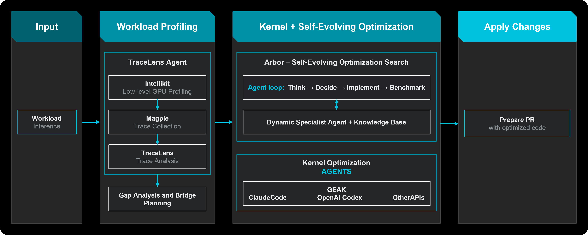

<!---
Copyright (c) 2026 Advanced Micro Devices, Inc. (AMD)

Permission is hereby granted, free of charge, to any person obtaining a copy
of this software and associated documentation files (the "Software"), to deal
in the Software without restriction, including without limitation the rights
to use, copy, modify, merge, publish, distribute, sublicense, and/or sell
copies of the Software, and to permit persons to whom the Software is
furnished to do so, subject to the following conditions:

The above copyright notice and this permission notice shall be included in all
copies or substantial portions of the Software.

THE SOFTWARE IS PROVIDED "AS IS", WITHOUT WARRANTY OF ANY KIND, EXPRESS OR
IMPLIED, INCLUDING BUT NOT LIMITED TO THE WARRANTIES OF MERCHANTABILITY,
FITNESS FOR A PARTICULAR PURPOSE AND NONINFRINGEMENT. IN NO EVENT SHALL THE
AUTHORS OR COPYRIGHT HOLDERS BE LIABLE FOR ANY CLAIM, DAMAGES OR OTHER
LIABILITY, WHETHER IN AN ACTION OF CONTRACT, TORT OR OTHERWISE, ARISING FROM,
OUT OF OR IN CONNECTION WITH THE SOFTWARE OR THE USE OR OTHER DEALINGS IN THE
SOFTWARE.
--->

# Hyperloom - Autonomous Agentic Inference Optimization for AMD GPUs

AMD is excited to introduce [ROCm™ Hyperloom](https://github.com/AMD-AGI/Hyperloom), a new open-source, agentic system aimed at automating the time-consuming task of optimizing end-to-end inference workloads. Using Hyperloom reduces the time to optimize an end-to-end workload from weeks to hours, saving time and enabling valuable resources to be allocated to other critical tasks. By combining various tools into an autonomous optimization loop, Hyperloom allows you to get the best performance out of your model and custom configuration on AMD Instinct GPUs.

In this blog, you’ll learn what Hyperloom is, how its component stack fits together, how the optimization loop operates, and how to get started with Hyperloom to optimize your own inference workloads.

## Why choose Hyperloom

The standard inference optimization workflow requires specialized skills to manually execute every step: profile the workload, analyze the output, identify potential optimizations, implement changes, test for correctness, benchmark, and decide whether to keep or discard the change. A single workload optimization cycle can take weeks of effort to complete and often results in optimizations that aren’t transferable to different workloads or model configurations. Beyond time, the bigger cost is coverage. A human engineer will explore the highest-confidence optimizations first and stop when they hit diminishing returns or due to time constraints.

Hyperloom addresses both of these problems, reducing the time to optimize a full end-to-end workload down from potentially weeks to hours, while systematically exploring the solution space to identify potential optimizations. This comprehensive search may identify obscure and unintuitive fixes, as well as cross-repo patches that an engineer would be unlikely to attempt, while running correctness checks on every candidate before acceptance.

## Hyperloom, a fully autonomous inference optimization engine

Hyperloom is an autonomous AI workload optimization platform that eliminates the manual, time-intensive process of profiling, analyzing, and tuning models. It consists of a closed loop architecture, Profile → Analyze → Plan → Optimize → Validate, that iteratively improves the performance of your inference workloads.

<div align="center">



Figure 1: An overview of the Hyperloom architecture and optimization flow.

</div>

The system runs as a multi-agent architecture, completely automating the entire process. All you have to do is provide your workload and configuration files and let Hyperloom do the rest. Figure 1 provides an overview of the full end-to-end optimization workflow, breaking it down into distinct stages and highlighting the components that are critical in each stage. First, the TraceLens-Agent identifies bottlenecks and potential optimizations using TraceLens, which leverages Magpie and IntelliKit for trace collection and low-level GPU profiling respectively. Next, the self-evolving optimization engine employs GEAK and Arbor in parallel to improve the performance of individual kernels as well as the full end-to-end workload.

### The component stack

Hyperloom integrates and orchestrates five independent, purpose-built components to accomplish its goal. Each of these plays a crucial role in the optimization loop.

#### TraceLens-Agent – Automated GPU Performance Analysis

[TraceLens](https://github.com/AMD-AGI/TraceLens) is a Python SDK that automates performance analysis from GPU trace files, ingesting the outputs from Magpie to generate hierarchical performance breakdowns, roofline estimates, and a prioritized list of optimization opportunities. The TraceLens-Agent extends the library with an agentic analysis layer. Given a profiling artifact, the TraceLens-Agent identifies slow kernels, system bottlenecks, missing fusions; and generates a ranked bridge plan of proposed optimizations and validates that accepted fixes resolve the original bottleneck without introducing regressions.

##### Magpie – GPU Kernel Evaluation and End-to-End Benchmarking

[Magpie](https://github.com/AMD-AGI/Magpie) is a lightweight GPU kernel evaluation framework that serves as the profiling and benchmarking backbone for Hyperloom, assessing kernel correctness, robustness, and performance across diverse execution environments. It runs the workload, generates traces, and produces structured JSON results that the rest of the pipeline consumes.

##### IntelliKit – A Toolbox for Profiling and Validation

[IntelliKit](https://github.com/AMDResearch/intellikit) is a comprehensive suite of LLM-friendly GPU tooling that transforms traditional profiling workflows by providing conversational interfaces to GPU performance data, source mapping, and validation capabilities. Although not directly accessed by Hyperloom, IntelliKit serves Magpie and GEAK by providing low-level GPU profiling tools. The five specialized tools – Kerncap, Metrix, Linex, Nexus, and Accordo – decode complexity into human-readable insights, enable AI agent integration through clean Python APIs with MCP server support, and answer specific developer questions through conversational workflows.

#### GEAK – Autonomous GPU Kernel Optimization

[GEAK](https://github.com/AMD-AGI/GEAK) is an autonomous, agent-driven framework that orchestrates end-to-end GPU kernel optimization through metric-driven patch generation, multi-agent exploration, and iterative improvement cycles backed by profiling and testing. Given a kernel or a live model-serving stack such as SGLang or vLLM, GEAK searches for bottlenecks, generates and tunes implementations across backends such as Triton, FlyDSL, HIP, CK, and TileLang, and validates the result on the actual system. GEAK includes a hierarchical multi-agent architecture: Director → Architect → Expert, with dynamic JS workflow. It also has a knowledge system, as well as long-horizon optimization, self-evolution with knowledge accumulation and in-session and cross-session memory management.

#### Arbor – Self-Evolving Optimization Search

[Arbor](https://arxiv.org/abs/2606.12563) intelligently explores the search space following an iterative Think → Decide → Implement → Benchmark agentic loop. It uses a tree-based cognition layer with dynamic agents, long-horizon campaigns, and self-evolving optimization guided by a curated knowledge base of hardware learnings, pitfalls, and prior campaign artifacts.

#### The Hyperloom Orchestrator – Pulling It All Together

The Hyperloom inference optimizer skill wires the stack into a single end-to-end pipeline. It translates a natural language workload description into CLI parameters, installs dependencies, launches the optimization loop, and monitors progress until the run completes or the time limit is hit. It scores each action within the optimization loop by expected gain and estimated cost, comparing results to real workloads.

#### AgentKernelArena – Comparing AI Agents

[AgentKernelArena](https://github.com/AMD-AGI/AgentKernelArena) is not part of Hyperloom or its optimization loop. It serves as a useful platform for A/B testing and comparing Hyperloom’s optimization agents on standardized tasks. The tool evaluates agents side-by-side in an isolated workspace, and scores them using objective, reproducible metrics that measure compilation, correctness, and performance.

## Getting Started With Hyperloom

Hyperloom is public and available now, allowing you to optimize your workloads on your own AMD GPU node.

### Support Matrix

Hyperloom currently supports the following components:

| Component | Support |
|-----------|---------|
| GPU | MI300X, MI325X, MI355X|
| Operating System | Ubuntu 22.04 and 24.04 |
| ROCm version | 7.2 |
| Inference Frameworks | SGLang >= 0.5.12, vLLM >= 0.21.0|
| Kernel Languages | HIP, Triton, FlyDSL |
| Python | >= 3.10 |

### Running your own Hyperloom session

Follow along with these instructions to get started with Hyperloom. Prepare a dedicated clean directory first, then open that directory in Cursor, Claude Code, or Codex before running the install command.

#### Step 1 – Installing Hyperloom

You can install Hyperloom using pip:

```bash
python3 -m pip install \
  https://github.com/AMD-AGI/Hyperloom/releases/download/v1.0.0a1/hyperloom_inference_optimizer-1.0.0a1-py3-none-any.whl \
  --target .
```

#### Step 2 – Setting up Hyperloom

After installation is completed, set up Hyperloom by running the setup skill in the same workspace as installation:

```bash
/hyperloom-setup
```

This will launch an interactive setup session where you will be prompted to set up Hyperloom for your environment and use case.

#### Step 3 – Running Hyperloom

Once Hyperloom is fully set up, you can run your first optimization! Simply tell your agent to optimize your model using Hyperloom. For example:

```bash
Optimize Minimax M3 MXFP8 with Hyperloom
```

This will start a session where you have the option to get regular updates on Hyperloom’s progress. Once the optimization run reaches the allotted time limit, a comprehensive report will be generated, detailing the optimizations and expected performance gain that Hyperloom was able to achieve.

For detailed documentation, installation instructions, and how-to guides, have a look at the [Hyperloom page on ROCm Docs](https://rocm.docs.amd.com/projects/hyperloom/en/latest/index.html), or follow along with the [Quick-start guide](https://github.com/AMD-AGI/Hyperloom/blob/main/examples/README.md).

## Summary

In this blog, we provided an overview of Hyperloom and its core components, as well as instructions on how to install and get started with Hyperloom. Hyperloom optimizes your full end-to-end inference workloads, automating the full optimization loop from profiling and analysis to kernel optimization and validation. This cuts the optimization time down to hours, a task that previously required weeks of specialized engineering effort, allowing you to allocate your most valuable resources to other critical tasks. For more in-depth information, take a look at the Hyperloom documentation on [GitHub](https://github.com/AMD-AGI/Hyperloom) or [ROCm Docs](https://rocm.docs.amd.com/projects/hyperloom/en/latest/index.html), or view one of the related blogs. Hyperloom is completely open-source and available today – try it out on your workload to get the most out of your Instinct GPU!

## Additional Resources

Explore other recent developments and releases by AMD in the [ROCm.ai: The AI-Native Developer Experience for Building on AMD](https://www.amd.com/en/blogs/2026/rocm-ai-the-ai-native-developer-experience-for-building.html) blog. Or if you would like to learn more about Hyperloom’s components, take a look at the recent [GEAK](https://www.amd.com/en/developer/resources/technical-articles/2026/geak-v4.html) and [TraceLens](https://rocm.blogs.amd.com/software-tools-optimization/tracelens/README.html) blogs, or take a deep dive into [Arbor](https://arxiv.org/abs/2606.12563) or [AgentKernelArena](https://arxiv.org/abs/2605.16819) by looking at their respective publications. Also, have a look at the recent [AgentKernelArena](https://rocm.blogs.amd.com/software-tools-optimization/agent-kernel-arena/README.html) blog to learn more about how you can compare various agents in a standardized environment.

To learn more about Hyperloom, have a look at the [GitHub page](https://github.com/AMD-AGI/Hyperloom) or peruse the [Hyperloom documentation](https://rocm.docs.amd.com/projects/hyperloom/en/latest/index.html).

## Disclaimers

The information presented in this document is for informational purposes only and may contain technical inaccuracies, omissions, and typographical errors. The information contained herein is subject to change and may be rendered inaccurate for many reasons, including but not limited to product and roadmap changes, component and motherboard version changes, new model and/or product releases, product differences between differing manufacturers, software changes, BIOS flashes, firmware upgrades, or the like. Any computer system has risks of security vulnerabilities that cannot be completely prevented or mitigated. AMD assumes no obligation to update or otherwise correct or revise this information.
However, AMD reserves the right to revise this information and to make changes from time to time to the content hereof without obligation of AMD to notify any person of such revisions or changes.
THIS INFORMATION IS PROVIDED ‘AS IS.” AMD MAKES NO REPRESENTATIONS OR WARRANTIES WITH RESPECT TO THE CONTENTS HEREOF AND ASSUMES NO RESPONSIBILITY FOR ANY INACCURACIES, ERRORS, OR OMISSIONS THAT MAY APPEAR IN THIS INFORMATION. AMD SPECIFICALLY DISCLAIMS ANY IMPLIED WARRANTIES OF NON-INFRINGEMENT, MERCHANTABILITY, OR FITNESS FOR ANY PARTICULAR PURPOSE. IN NO EVENT WILL AMD BE LIABLE TO ANY PERSON FOR ANY RELIANCE, DIRECT, INDIRECT, SPECIAL, OR OTHER CONSEQUENTIAL DAMAGES ARISING FROM THE USE OF ANY INFORMATION CONTAINED HEREIN, EVEN IF AMD IS EXPRESSLY ADVISED OF THE POSSIBILITY OF SUCH DAMAGES.
AMD, the AMD Arrow logo, and combinations thereof are trademarks of Advanced Micro Devices, Inc. Other product names used in this publication are for identification purposes only and may be trademarks of their respective companies.
© 2026 Advanced Micro Devices, Inc. All rights reserved
