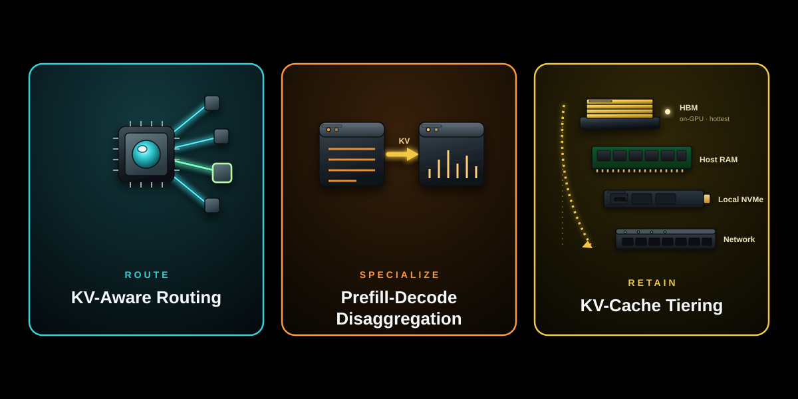
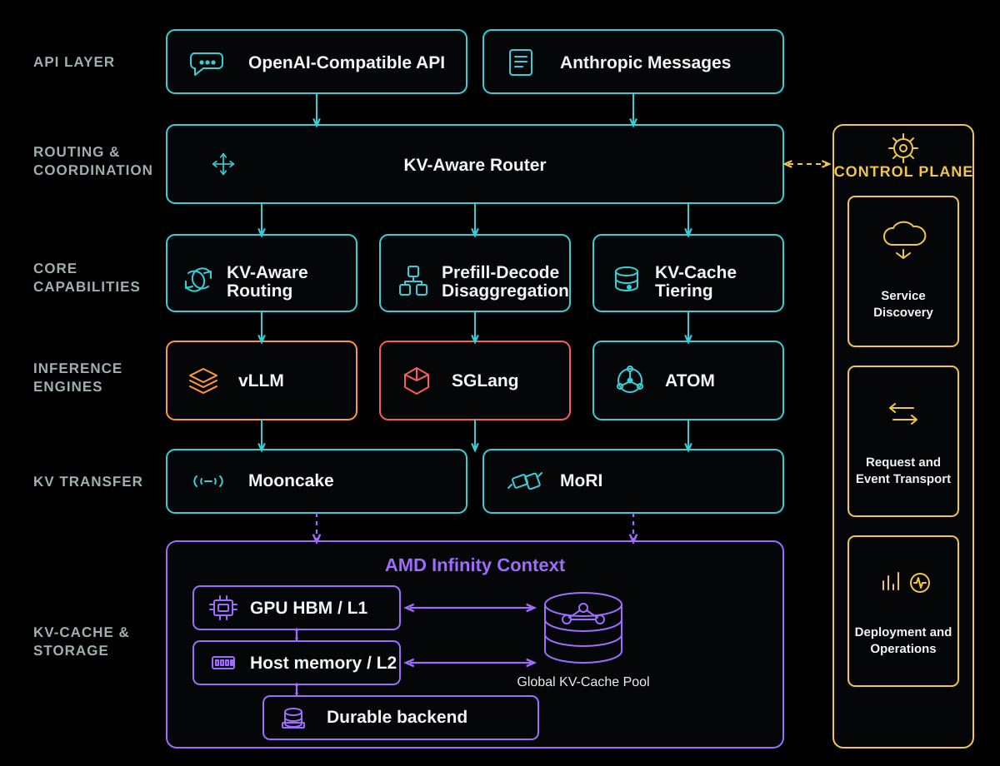
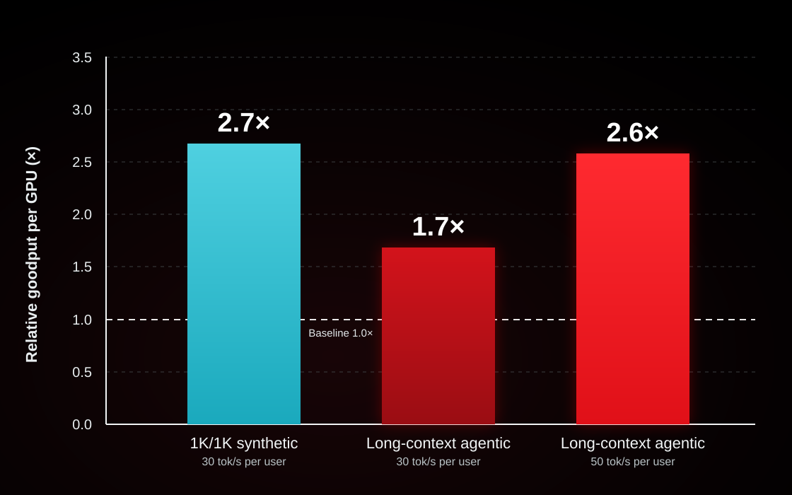

<!---
Copyright (c) 2026 Advanced Micro Devices, Inc. (AMD)

Permission is hereby granted, free of charge, to any person obtaining a copy
of this software and associated documentation files (the "Software"), to deal
in the Software without restriction, including without limitation the rights
to use, copy, modify, merge, publish, distribute, sublicense, and/or sell
copies of the Software, and to permit persons to whom the Software is
furnished to do so, subject to the following conditions:

The above copyright notice and this permission notice shall be included in all
copies or substantial portions of the Software.

THE SOFTWARE IS PROVIDED "AS IS", WITHOUT WARRANTY OF ANY KIND, EXPRESS OR
IMPLIED, INCLUDING BUT NOT LIMITED TO THE WARRANTIES OF MERCHANTABILITY,
FITNESS FOR A PARTICULAR PURPOSE AND NONINFRINGEMENT. IN NO EVENT SHALL THE
AUTHORS OR COPYRIGHT HOLDERS BE LIABLE FOR ANY CLAIM, DAMAGES OR OTHER
LIABILITY, WHETHER IN AN ACTION OF CONTRACT, TORT OR OTHERWISE, ARISING FROM,
OUT OF OR IN CONNECTION WITH THE SOFTWARE OR THE USE OR OTHER DEALINGS IN THE
SOFTWARE.
--->

# Introducing AMD ROCm™ Infera: Scaling Goodput for Agentic AI with Distributed Inference Orchestration

Today we are introducing AMD ROCm™ Infera, a distributed inference reference solution for large-scale deployments. Infera is a conductor for your inference GPU orchestra. Initial internal testing shows that Infera can improve goodput per GPU for realistic agentic workloads by up to 2.6×, as [detailed below](#preliminary-performance). Built for AMD Instinct™ GPUs, Infera is open source from day one, and the code is available at [github.com/AMD-AGI/Infera](https://github.com/AMD-AGI/Infera).

In this blog, you will learn why scaling beyond a single engine instance creates new orchestration challenges, how Infera addresses them, how it integrates with vLLM, SGLang, and ATOM, and what our preliminary performance results and roadmap show for agentic AI on AMD Instinct™ GPUs.

Modern inference engines optimize execution within an engine instance, but production systems rely on many instances for scale, availability, and workload specialization. As deployments grow, teams typically use conventional load balancing or custom logic to distribute requests.

This creates an orchestration gap, especially for agentic workloads. Agentic systems run long, multi-turn loops that repeatedly reuse large prefixes (system prompts, memory, retrieved context, tool outputs) while adding only small increments of new tokens. Contexts can reach tens or hundreds of thousands of tokens, with input-to-output ratios exceeding 100:1. In theory, most of this work should be reused via KV caching.

In practice, reuse breaks down. Systems lack visibility into which instances hold relevant KV cache, memory pressure forces eviction of large prefixes, and requests often land on different instances across turns. This leads to repeating prefill, lost cache locality, degraded latency, and lower throughput, even when systems appear balanced.

Infera addresses this by coordinating engine instances across three dimensions: KV-aware routing, prefill-decode disaggregation, and KV-cache tiering. Rather than replacing inference engines, it manages request placement, execution phases, and reusable KV state across the deployment.

This orchestration increases inference goodput: the rate of inference requests completed within latency targets such as time to first token and inter-token latency. This metric is essential for end-to-end agentic AI performance, where sequential inference calls, tool use, and expanding context compound latency.

## Three Capabilities That Work Together

Infera helps make key decisions in three stages of the distributed inference request lifecycle, as shown in Figure 1:

1. **Route: KV-Aware Routing:** Route the request to an engine instance that balances KV-cache reuse and active work.

2. **Specialize: Prefill-Decode Disaggregation:** Run prefill and decode on specialized engine instances.

3. **Retain: KV-Cache Tiering:** Retain reusable KV state beyond GPU HBM memory for future requests.

<em>Figure 1: Infera capabilities.</em>

### Route: KV-Aware Routing

The first decision is where a request should be run.

Conventional load balancing uses signals such as queue depth or utilization, but it does not account for work an engine instance has already performed. Agentic requests often share long prefixes, including system prompts, retrieved documents, source code, tool results, and growing conversation histories.

Routing a request to an engine instance that already caches much of its prefix enables reuse. Routing the same request to a cold engine instance forces the prompt to be processed again.

Engine instances publish KV-cache events, and the router maintains an in-memory view of the prompt blocks cached by each instance. For an incoming request, it estimates how many blocks each candidate would need to compute, combines that cost with the active prompt blocks already queued on the instance, and selects the lowest-cost option.

This balances locality and active work rather than optimizing either signal in isolation.

This approach increases KV-cache reuse, reduces redundant prefill computation, and lowers time to first token for requests with repeated prefixes, directly improving responsiveness and overall system efficiency.

### Specialize: Prefill-Decode Disaggregation

The next decision is whether to specialize inference engine instances for different phases of the workload.

LLM inference has two phases with distinct characteristics. Prefill processes the prompt and builds the KV cache, making it primarily compute-bound. Decode generates tokens incrementally and is primarily memory-bandwidth-bound. Because the two phases stress the system differently, their scaling requirements can also differ.

Infera separates prefill and decode into specialized instances when the benefits outweigh the KV-transfer cost; otherwise, both phases run in a single instance. With disaggregation, the prefill instance processes the prompt and transfers the resulting KV state to a compatible decode instance.

Across hosts, Infera uses an RDMA-capable transfer path such as Mooncake or MoRI-IO and validates the negotiated transport to avoid unintended TCP fallback and the resulting transfer latency.

Disaggregation allows prefill and decode to operate and scale independently. Its benefits become most visible in larger deployments, where contention, concurrency, throughput, and latency must be managed against end-to-end service-level objectives. By isolating the two phases, Infera can improve latency predictability, sustain higher concurrency, and help more requests meet their SLO targets under load.

### Retain: KV-Cache Tiering

The final decision is how to preserve reusable state.

GPU HBM memory is the fastest place to hold KV cache, but its capacity is limited. Long contexts and concurrent agents can consume that capacity quickly. Evicting older blocks creates room for new work, but it also discards computation that may soon be valuable again.

Infera supports AMD Infinity Context (AIC), which extends effective KV-cache capacity by offloading valuable GPU HBM KV-cache data to local NVMe or remote NFS-backed storage. Through the AIC direct GPU data path, KV-cache data can move between GPU memory and storage without being staged through CPU DRAM, avoiding unnecessary host-side copies and enabling substantially higher transfer bandwidth.

This reduces the amount of costly CPU memory required for KV-cache tiering while preserving reusable prompt state and improving prefill performance.

By extending effective cache capacity and maintaining high cache-hit rates, KV-cache tiering minimizes recomputation, stabilizes latency for long-context workloads, and improves overall goodput in agentic systems.

## Built Around the Inference Engines You Already Use

Infera works with existing inference engines rather than replacing them. It supports vLLM, SGLang, and the AMD ROCm-native ATOM engine. Each engine continues to own model execution within its engine instances, while Infera provides orchestration across them. This separation preserves existing tooling and engine-specific optimization while allowing the engines and Infera to evolve independently. The latest feature support for each engine is detailed in the [docs](https://rocm.docs.amd.com/infera).

## Technical Architecture

Infera introduces a focused orchestration layer to the ROCm inference architecture stack, as shown in Figure 2.

<em>Figure 2: ROCm Infera architecture.</em>

Applications connect to the Infera server through OpenAI-compatible APIs (with an Anthropic-compatible shim), where a built-in router handles scheduling. The server is designed for high concurrency: multiple replicas scale out behind a load balancer, so no single instance becomes a bottleneck, and a failed replica does not disrupt the overall service. For the most demanding routing paths, the same logic is also available as a high-performance Rust router that further increases throughput and reduces coordination overhead.

### Infera Request Flow

Figure 3 details the request flow between components at runtime, including how routing, external KV-cache lookup, prefill execution, KV transfer, and decode generation work together.

<em>Figure 3: The request flow in a prefill-decode disaggregated deployment with external KV-cache storage.</em>

Before serving requests, the prefill and decode engine instances register with the control plane through etcd, enabling the router to discover their roles and capabilities. The request flow then proceeds as follows:

1. **Receive the request.** A client sends a request to Infera through the router.

2. **Select engine instances.** The router chooses a compatible prefill-decode pair based on role, active work, and KV-cache locality.

3. **Check the external KV cache.** Before recomputing the prompt, the prefill instance queries kvd for reusable KV-cache blocks.

4. **Restore cached state.** On a cache hit, AMD Infinity Context (AIC) restores the available KV-cache blocks from local NVMe or remote NFS through a direct GPU path. The prefill instance then computes only the uncached portion of the prompt.

5. **Transfer the completed KV state.** After prefill completes, the KV cache is transferred to the decode instance through a compatible PD connector using Mooncake or MoRI-IO.

6. **Generate and return the response.** The decode instance generates the output tokens and streams the response back to the client through the router.

The inference engines execute the model, while Infera coordinates service discovery, request routing, external KV-cache reuse, and the handoff between prefill and decode engine instances.

## Preliminary Performance

Infera v0.1 is an initial open-source release, and performance evaluation is ongoing. We evaluated a synthetic 1K-input/1K-output workload and a long-context agentic workload. The results below provide an early view of internal testing on AMD Instinct™ MI355X GPUs using Kimi K2.6 MXFP4 and are not a comprehensive characterization across models, workloads, engines, or deployment topologies.

Goodput measures the inference work completed while meeting a defined responsiveness target. Unlike raw throughput, it excludes work delivered too slowly to provide the intended user experience. Figure 4 summarizes the relative goodput-per-GPU gains observed across the evaluated workloads.

### Higher Goodput per GPU Across Workloads

<em>Figure 4: Infera goodput per GPU relative to the corresponding single-instance baseline = 1.0×.</em>

#### Synthetic 1K/1K Workload

On the synthetic 1K/1K workload, an **Infera 20-GPU 1P2D configuration** delivered up to **2.7× higher goodput per GPU**[^1] than a **single-instance** **4-GPU TP4 SGLang baseline** while maintaining **30 output tokens per second per user**.

The improvement comes primarily from prefill-decode disaggregation and Data Parallel Attention (DP Attention). Disaggregation separates prompt processing from token generation, allowing each phase to scale independently. DP Attention increases the aggregate GPU-resident KV-cache capacity across the serving pool. Together, these techniques support more concurrent requests while maintaining responsive token generation.

#### Long-Context Agentic Workload

For the long-context agentic workload, we evaluated a coding-agent workload using the multi-turn dataset from the [vLLM Mooncake Store blog](https://vllm.ai/blog/2026-05-06-mooncake-store) to represent long-running coding and tool-using agent sessions. Each session starts from a 20K-token shared prefix and runs up to 30 turns, adding ~2K input tokens and ~900 output tokens per turn, so the accumulated context reaches ~75K tokens at P50 and ~115K at its maximum.

On the long-context agentic workload, an **Infera 12-GPU prefill-decode (PD) configuration (prefill 4-GPU TP4, decode 8-GPU TP2×DP4)** delivered up to **1.7× higher goodput per GPU**[^2] than a **single-instance 8-GPU TP8 vLLM baseline** while maintaining **30 output tokens per second per user**. At the stricter target of **50 output tokens per second per user**, Infera delivered up to **2.6× higher goodput per GPU**.

As concurrency increased, long-context prompt processing interfered with active token generation in the baseline, causing per-user performance to fall below the target. Infera separated the two phases: dedicated prefill instances processed the growing input context, while decode instances focused on generating output tokens.

These early results show how Infera converts higher concurrency into usable goodput rather than raw throughput alone. Detailed workload definitions, configurations, methodology, and performance reproduction instructions are available in the [benchmarks section of the repository](https://github.com/AMD-AGI/Infera/tree/main/examples). We are continuing to expand our test coverage.

## Roadmap

Infera is currently at **v0.1**, and the initial reference solution should be viewed as a foundation rather than a feature-complete solution. Current limitations are detailed in the Infera [Feature Matrix](https://rocm.docs.amd.com/projects/infera/en/latest/features/feature_matrix.html) and [Compatibility Matrix](https://rocm.docs.amd.com/projects/infera/en/latest/features/compatibility_matrix.html). The public [Infera Roadmap](https://github.com/AMD-AGI/Infera/issues/9) identifies the following priorities.

**Dynamic scaling under Kubernetes.** Add load-driven replica-count autoscaling. Runtime switching between prefill and decode roles is planned as a design and prototype.

**SLO-aware scheduling.** Make TTFT and TPOT targets configurable and add SLO-attainment and goodput reporting.

**Broader AMD Instinct support.** Expand validation beyond MI355X to MI300X, MI325X, and MI455X with clear documentation of validated and expected-to-work platforms.

**Multimodal support.** Add multimodal-aware hashing and routing and explore encode-prefill-decode disaggregation.

**Research directions.** Assess wide expert parallelism, cluster-wide KV-cache sharing across RDMA and NVMe, and xGMI or remote-copy transports for KV movement.

Scope and sequencing may evolve as the architecture matures, and the community provides feedback.

## Summary

In this blog, you learned why scaling agentic AI requires more than adding engine instances: it requires fleet-wide coordination to preserve cache locality, reduce interference between prefill and decode, and keep valuable context available for reuse.

Infera is a conductor for your inference GPU orchestra, coordinating the instance fleet while leaving model execution to vLLM, SGLang, and ATOM. Future posts will go deeper into deployment patterns, benchmark methodology, and practical guidance for building higher-goodput agentic AI serving systems on AMD Instinct GPUs.

## Get Started

- **Code:** [github.com/AMD-AGI/Infera](https://github.com/AMD-AGI/Infera)

- **Docs:** [rocm.docs.amd.com/infera](https://rocm.docs.amd.com/infera)

## Disclaimers

The information presented in this document is for informational purposes only and may contain technical inaccuracies, omissions, and typographical errors. The information contained herein is subject to change and may be rendered inaccurate for many reasons, including but not limited to product and roadmap changes, component and motherboard version changes, new model and/or product releases, product differences between differing manufacturers, software changes, BIOS flashes, firmware upgrades, or the like. Any computer system has risks of security vulnerabilities that cannot be completely prevented or mitigated. AMD assumes no obligation to update or otherwise correct or revise this information. However, AMD reserves the right to revise this information and to make changes from time to time to the content hereof without obligation of AMD to notify any person of such revisions or changes. THIS INFORMATION IS PROVIDED ‘AS IS.” AMD MAKES NO REPRESENTATIONS OR WARRANTIES WITH RESPECT TO THE CONTENTS HEREOF AND ASSUMES NO RESPONSIBILITY FOR ANY INACCURACIES, ERRORS, OR OMISSIONS THAT MAY APPEAR IN THIS INFORMATION. AMD SPECIFICALLY DISCLAIMS ANY IMPLIED WARRANTIES OF NON-INFRINGEMENT, MERCHANTABILITY, OR FITNESS FOR ANY PARTICULAR PURPOSE. IN NO EVENT WILL AMD BE LIABLE TO ANY PERSON FOR ANY RELIANCE, DIRECT, INDIRECT, SPECIAL, OR OTHER CONSEQUENTIAL DAMAGES ARISING FROM THE USE OF ANY INFORMATION CONTAINED HEREIN, EVEN IF AMD IS EXPRESSLY ADVISED OF THE POSSIBILITY OF SUCH DAMAGES. AMD, the AMD Arrow logo, and combinations thereof are trademarks of Advanced Micro Devices, Inc. Other product names used in this publication are for identification purposes only and may be trademarks of their respective companies. © 2026 Advanced Micro Devices, Inc. All rights reserved

### Cautionary Statement

This blog may contain forward-looking statements concerning Advanced Micro Devices, Inc. (AMD), which are made pursuant to the Safe Harbor provisions of the Private Securities Litigation Reform Act of 1995. Forward-looking statements are commonly identified by words such as "would," "may," "expects," "believes," "plans," "intends," "projects" and other terms with similar meaning. Investors are cautioned that any forward-looking statements in this blog are based on current beliefs, assumptions and expectations, speak only as of the date of this blog and involve risks and uncertainties that could cause actual results to differ materially from current expectations. Such statements are subject to certain known and unknown risks and uncertainties, many of which are difficult to predict and generally beyond AMD's control, that could cause actual results and other future events to differ materially from those expressed in, or implied or projected by, the forward-looking information and statements. Investors are urged to review in detail the risks and uncertainties in AMD’s Securities and Exchange Commission filings, including but not limited to AMD’s most recent reports on Forms 10-K and 10-Q.

AMD does not assume, and hereby disclaims, any obligation to update forward-looking statements made in this blog, except as may be required by law.

[^1]: Testing as of July 2026 by AMD on a test system configured with 20× AMD Instinct™ MI355X GPUs running Infera 0.1-rc1 in a 1-prefill / 2-decode (1P2D) disaggregated configuration with DP Attention vs. a single-node system with 4× AMD Instinct™ MI355X GPUs running vanilla SGLang (TP4). The following benchmark(s) were used: InferenceX benchmark_serving.py, Kimi K2.6 (MXFP4), 1K/1K workload (input 1024 / output 1024 tokens, request rate measured at a matched interactivity of ~30 tokens/s/user (median TPOT ≈ 33 ms). System manufacturers may vary configurations, yielding different results.

[^2]: Testing as of July 2026 by AMD on a test system configured with 12× AMD Instinct™ MI355X GPUs running Infera in a prefill-decode-disaggregated configuration consisting of a 4-GPU TP4 prefill instance and an 8-GPU TP2×DP4 decode instance, compared with a single-instance TP8 vLLM baseline using 8× AMD Instinct™ MI355X GPUs. The following benchmark was used: vLLM benchmark_serving_multi_turn.py with Kimi K2.6 MXFP4 and the vLLM Mooncake–Derived Long-Context Agentic Workload. At matched per-user responsiveness targets, Infera delivered up to 1.7× higher goodput per GPU at 30 output tokens/s/user and up to 2.6× higher goodput per GPU at 50 output tokens/s/user. Results are based on three-run medians. System manufacturers may vary configurations, yielding different results.
