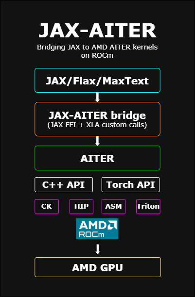

<!---
Copyright (c) 2026 Advanced Micro Devices, Inc. (AMD)

Permission is hereby granted, free of charge, to any person obtaining a copy
of this software and associated documentation files (the "Software"), to deal
in the Software without restriction, including without limitation the rights
to use, copy, modify, merge, publish, distribute, sublicense, and/or sell
copies of the Software, and to permit persons to whom the Software is
furnished to do so, subject to the following conditions:

The above copyright notice and this permission notice shall be included in all
copies or substantial portions of the Software.

THE SOFTWARE IS PROVIDED "AS IS", WITHOUT WARRANTY OF ANY KIND, EXPRESS OR
IMPLIED, INCLUDING BUT NOT LIMITED TO THE WARRANTIES OF MERCHANTABILITY,
FITNESS FOR A PARTICULAR PURPOSE AND NONINFRINGEMENT. IN NO EVENT SHALL THE
AUTHORS OR COPYRIGHT HOLDERS BE LIABLE FOR ANY CLAIM, DAMAGES OR OTHER
LIABILITY, WHETHER IN AN ACTION OF CONTRACT, TORT OR OTHERWISE, ARISING FROM,
OUT OF OR IN CONNECTION WITH THE SOFTWARE OR THE USE OR OTHER DEALINGS IN THE
SOFTWARE.
--->

# JAX-AITER: Bringing AMD’s Optimized AI Kernels to JAX on ROCm™

If you’re building large models in JAX on AMD GPUs, you want fast, reliable kernels without spending weeks tuning them yourself. That’s exactly the need that led us to create JAX-AITER.

When we kicked off the JAX-AITER effort, the goal was clear: bring AMD’s optimized AITER kernels into the JAX ecosystem so researchers and practitioners on ROCm™ could access high‑performance operators without reinventing the wheel. We wanted to connect AITER to JAX cleanly and efficiently—leveraging what already works rather than rebuilding from scratch.

In this blog, you’ll see how the bridge works, how to plug it into your JAX workflow, and how much speedup you can expect today on AMD Instinct™ GPUs.

JAX-AITER is open source and available on GitHub:

<https://github.com/ROCm/jax-aiter>

---

## AITER: AMD’s High-Performance Operator Hub for AI

If you’ve tried writing high-performance GPU kernels, you already know how easy it is to get trapped in the details: memory layouts, tiling strategies, synchronization, numerics, and ROCm‑specific tuning. AITER exists so you don’t have to keep reinventing those wheels.

AITER is AMD’s centralized repository of high‑performance AI operators tuned for ROCm™ GPUs. It provides a unified home for performance‑critical kernel development across multiple backends—Composable Kernel (CK), Triton, HIP, and assembly—so operator teams can collaborate, benchmark, and ship improvements from one place.

### What AITER delivers

- **Scope:** Optimized operators for large language model (LLM) training and inference on ROCm-based hardware, including AMD Instinct™ MI300 and MI350 series accelerators.  
- **Operator coverage:** Attention and fused multi-head attention (FMHA), mixture-of-experts (MoE), matrix multiplication (GEMM), quantization, and distributed communication primitives.  
- **Training and inference:** Not just inference kernels—AITER includes backward paths, plus fused GEMM+communication kernels to work around framework–architecture constraints.  
- **Multi-backend support:** Kernels can originate from Triton, CK, HIP/C++, or assembly, with per‑architecture selection for best performance.  
- **APIs:** C++‑level entry points and Python‑level interfaces, with JIT compilation infrastructure to specialize kernels for target shapes and dtypes.

The strength of AITER is consistency and reuse. Whether it’s attention, normalization, or fused activations, requests flow through the same shared repository. Improvements made once—in memory layouts, tiling, synchronization, or numerics—benefit every framework integration on ROCm.

Historically, AITER was tightly integrated with PyTorch, with APIs that expected `torch::Tensor` types and device contexts. That worked well for PyTorch, but it meant JAX users couldn’t directly access AITER’s optimized kernels without major refactoring. Closing that gap is what inspired JAX-AITER.

---

## Why JAX-AITER?

JAX has become a favorite framework for research thanks to its functional style, composable transformations (like `jit`, `vmap`, and `pmap`), and XLA‑based compilation. If you’re running JAX on AMD GPUs, you should be able to tap into the same optimized operator performance that AITER already provides elsewhere—especially for large-scale distributed training workloads.

However, AITER today is largely organized around PyTorch:

- Most operators expose Python-level APIs built around `torch.Tensor`.  
- Kernels are compiled and loaded as PyTorch extensions via `pybind11` and decorators like `@compile_ops`.  
- Tuning logic and dispatch decisions often assume PyTorch as a dependency.  
- Stream and device context management follow PyTorch’s runtime semantics.

Calling those operators directly from JAX would introduce a lot of friction:

- Mismatched tensor types  
- Conflicting device contexts and streams  
- Overhead from bouncing through PyTorch just to reach AITER’s kernels

In practice, most AITER operators are not plug‑and‑play from JAX without additional decoupling work.

There is one important exception: **multi-head attention (MHA/FMHA)**. These kernels expose a clean, framework‑agnostic C++ API that can be built and used without PyTorch, with entry points like `aiter::mha_fwd` and `aiter::mha_bwd` generated as pure C++ dispatch functions depending only on CK and the HIP toolchain.

In AITER today, the Python tests and usage examples for those kernels are written in PyTorch, so the validation and tuning workflows are still PyTorch‑centric. JAX-AITER recreates that integration and testing layer on top of JAX instead, as illustrated in Figure 1 below.



Figure 1: High-level JAX-AITER architecture, bridging JAX/Flax/MaxText to AITER’s ROCm-optimized kernels via a JAX FFI and C++/Torch API layer.

This design makes multi-head attention (MHA/FMHA) an ideal starting point for a JAX integration:

- The kernels are already tuned for ROCm™ and used in production PyTorch® pipelines.
- They expose standalone C++ APIs that don’t require PyTorch to be present.
- There is a documented build path for compiling them independently of PyTorch.

JAX-AITER builds on that foundation. It:

- Reuses AITER’s ROCm-tuned MHA/FMHA kernels.
- Wraps them in a thin C++/FFI bridge that understands JAX buffers and HIP streams.
- Exposes JAX-native Python functions implemented with `jax.custom_vjp`, so gradients flow correctly through these operators during training.

From a user perspective, JAX-AITER is just an optional extension package. Install it alongside JAX on ROCm, and where you opt in—most notably for attention—you get AITER’s high‑performance kernels. If you prefer to stick with pure JAX implementations, you can simply avoid using the extension, and your existing code will continue to work unchanged.

Beyond MHA, JAX-AITER also integrates several GEMM and custom kernels. Today, those still rely on PyTorch as a dependency: the JAX FFI layer for GEMM and custom ops calls into AITER’s Torch‑based C++ APIs under the hood. Functionally, this already delivers AITER’s performance benefits to JAX, but those paths are not yet fully framework‑agnostic in the same way MHA/FMHA are.

As more AITER operators gain clean, framework-neutral C++ entry points over time—and as we progressively remove PyTorch from the call path—the same integration pattern can extend beyond attention to cover GEMM, normalization, and other core building blocks in the JAX ecosystem without requiring PyTorch at all.

If you want to explore the code and build it yourself, start here:

<https://github.com/ROCm/jax-aiter>

---

## How JAX-AITER Is Designed

At a high level, JAX-AITER acts as a bridge between the JAX runtime and AITER’s GPU kernels. The architecture is simple but effective, with three main layers that map cleanly onto how JAX and AITER operate.

### Frontend: JAX-Friendly APIs

On the Python side, JAX-AITER provides user-facing functions such as `flash_attn` and `flash_attn_varlen`. These are designed to feel like normal JAX primitives:

- You call them from your model code just like any other JAX function.
- They compose with `jit`, `vmap`, and `pmap`.
- They participate in autodiff and work in training loops.

Under the hood, these functions are implemented using `jax.custom_vjp`. That gives JAX-AITER explicit control over the forward and backward passes: the forward call dispatches into AITER’s kernels, and the backward call wires directly to AITER’s backward kernels.

Here’s a simplified example of how you’d use JAX-AITER for attention:

```python
from jax_aiter.mha import flash_attn

# q, k, v: JAX DeviceArrays on an AMD GPU
out, lse = flash_attn(q, k, v, dropout_p=0.0)
```

You can drop this into an existing JAX transformer or LLM model to replace a reference attention implementation. If you jit your model, JAX-AITER participates in the compiled graph via JAX FFI custom calls.

### Bridge: C++ / FFI Layer

The bridge layer is a thin C++ wrapper that connects JAX’s FFI to AITER’s operator entry points. Its responsibilities include:

- Mapping JAX device buffers to the pointers and descriptors expected by AITER.
- Synchronizing HIP streams between JAX and AITER to ensure correct execution ordering and memory visibility.
- Avoiding unnecessary host/device transfers or intermediate allocations.

For MHA/FMHA, this layer calls the framework‑agnostic C++ APIs provided by AITER’s attention kernels. For GEMM and some custom kernels that we currently support, the same bridge layer calls into AITER’s Torch-based C++ APIs—so PyTorch® remains a dependency on those paths for now.

If you’re familiar with JAX’s FFI, JAX-AITER essentially implements a set of FFI custom calls that hand off raw device pointers and metadata to AITER and then return control to the JAX runtime once the kernels are enqueued.

### Backend: AITER Kernels

At the bottom of the stack, JAX-AITER reuses AITER’s ROCm™‑tuned kernels without modification:

- For MHA/FMHA, JAX-AITER directly uses the standalone C++ entry points that do not require PyTorch.
- For GEMM and custom ops, JAX-AITER reaches AITER kernels via their existing Torch‑centric interfaces, with a roadmap to move to fully framework‑neutral entry points over time.

This layered design enables zero-copy buffer sharing between JAX and AITER: the bridge hands device pointers and metadata directly to AITER’s kernels, avoiding extra copies or host round‑trips. You get the same optimized kernels that other frameworks use on ROCm, but callable from your JAX model code.

---

## Multi-Head Attention as a First Target

Multi-head attention (MHA) is a major performance hotspot in transformer models. It’s used heavily in language and sequence models and often accounts for a large fraction of FLOPs and memory bandwidth at scale. That’s why MHA was the first end‑to‑end integration JAX-AITER tackled.

With JAX-AITER, you can invoke AITER’s attention kernels directly from JAX:

```python
from jax_aiter.mha import flash_attn, flash_attn_varlen

# Fixed-length attention
out, lse = flash_attn(q, k, v, dropout_p=0.0)

# Variable-length (packed or ragged) attention
out_varlen, lse_varlen = flash_attn_varlen(q, k, v, cu_seqlens, dropout_p=0.0)
```

The implementation supports both:

- Standard (fixed-length) attention, and
- Variable-length attention via `flash_attn_varlen`, suitable for packed or ragged batches.

Backward passes are implemented via `jax.custom_vjp`, so gradients flow through these ops as expected during training. Under the hood, everything runs natively on ROCm™ and uses the attention kernels provided by AITER. JAX-AITER routes JAX device buffers through the FFI bridge into those optimized kernels, without rewriting the core attention implementation.

If you already have a JAX attention implementation, you can:

1. Identify the attention call site in your model.
2. Swap it out for `flash_attn` or `flash_attn_varlen`.
3. Wrap the model in `jit` and run on an AMD Instinct™ GPU.

From there, you can benchmark end‑to‑end training or inference to see how JAX-AITER impacts your workload.

---

## Benchmark Setup: How We Measured JAX-AITER

To understand how much this bridge helps in practice, we compared JAX-AITER’s attention against a reference implementation written directly in JAX, using the same inputs and hardware.

All benchmarks were run on AMD Instinct™ MI350 GPUs with a consistent setup for both versions:

- We varied batch size, sequence length, number of heads, and head dimension to cover realistic transformer workloads.
- For each configuration, we executed 10 runs and reported the median latency to reduce noise.
- The baseline used a straightforward JAX implementation of attention.
- JAX-AITER invoked the AITER-backed `flash_attn` through the FFI bridge.
- Each iteration was synchronized with `block_until_ready()` so measured times reflect actual device execution rather than asynchronous dispatch.

If you want to reproduce these results, you can follow a similar pattern: implement a JAX reference attention, call JAX-AITER’s `flash_attn` with identical inputs, and measure the median latency over multiple runs.

---

## Performance Results: Pure JAX vs. JAX-AITER

We evaluated JAX-AITER’s attention against a JAX reference implementation across a range of batch sizes, sequence lengths, head counts, and head dimensions. For each configuration, we ran 10 iterations and reported the median latency, as shown in the table below.

| batch_size | seq_len | num_heads | head_dim | causal | dtype | pure_jax_ms | jax_aiter_ms | speedup |
|-----------:|--------:|----------:|---------:|:------:|:-----:|------------:|-------------:|:-------:|
|          2 |    1024 |         8 |       64 | False  | bf16  |       0.163 |        0.084 |  1.94x  |
|          2 |    1024 |         8 |      192 | False  | bf16  |       0.221 |        0.106 |  2.07x  |
|          2 |    1024 |         8 |      224 | False  | bf16  |       0.285 |        0.278 |  1.02x  |
|          2 |    1024 |         8 |      256 | False  | bf16  |       0.283 |        0.120 |  2.35x  |
|          1 |    2048 |         8 |      192 | False  | bf16  |       0.401 |        0.144 |  2.77x  |
|          2 |    2048 |        16 |      192 | False  | bf16  |       1.125 |        0.245 |  4.59x  |
|          1 |    2048 |         8 |      256 | False  | bf16  |       0.430 |        0.173 |  2.48x  |
|          4 |    2048 |         8 |      224 | False  | bf16  |       1.275 |        0.868 |  1.47x  |
|          1 |    4096 |         8 |      192 | False  | bf16  |       1.123 |        0.239 |  4.69x  |
|          2 |    4096 |        16 |      192 | False  | bf16  |       4.221 |        0.742 |  5.69x  |
|          1 |    4096 |         8 |      224 | False  | bf16  |       1.283 |        0.832 |  1.54x  |
|          2 |    4096 |         8 |      256 | False  | bf16  |       2.659 |        0.528 |  5.03x  |
|          4 |    4096 |        32 |       64 | False  | bf16  |       8.594 |        0.888 |  9.68x  |
|          1 |    8192 |         8 |       64 | False  | bf16  |       2.230 |        0.301 |  7.39x  |
|          1 |    8192 |         8 |      192 | False  | bf16  |       5.003 |        0.744 |  6.71x  |
|          1 |    8192 |         8 |      224 | False  | bf16  |       4.453 |        3.069 |  1.45x  |
|          1 |    8192 |         8 |      256 | False  | bf16  |       5.119 |        0.961 |  5.33x  |
|          2 |    2048 |         8 |      192 |  True  | bf16  |       0.654 |        0.156 |  4.19x  |
|          1 |    4096 |         8 |      256 |  True  | bf16  |       1.308 |        0.272 |  4.81x  |
|          2 |    4096 |        16 |      192 |  True  | bf16  |       4.150 |        0.474 |  8.75x  |
|          4 |    2048 |        32 |      192 | False  | bf16  |       4.277 |        0.820 |  5.23x  |
|          8 |    1024 |         4 |      256 | False  | bf16  |       0.477 |        0.126 |  3.80x  |

Across the configurations we tested, JAX-AITER was faster than the JAX baseline in almost all cases, with speedups ranging from roughly 1× (near parity) up to 9.68×. Larger sequence lengths and higher head counts tend to see the biggest gains, while some smaller or less kernel-friendly shapes are closer to neutral.

Overall:

- **Median speedup:** 4.39×  
- **Mean speedup:** 4.23×

If your models use similar shapes—especially longer sequences and more heads—you can expect comparable improvements by switching your attention implementation to JAX-AITER on ROCm™.

---

## Key Engineering Challenges and How We Solved Them

Getting to these results took more than just calling into a C++ API. Integrating JAX and AITER uncovered a few real engineering challenges.

### Dealing with PyTorch® Dependencies

AITER currently assumes PyTorch almost everywhere:

- Many operators expose APIs that expect `torch::Tensor`.
- Compilation, loading, and tuning flows are PyTorch‑centric.

To keep the JAX-AITER stack manageable:

- For MHA/FMHA, we call the framework‑agnostic C++ APIs, so those paths don’t require PyTorch at all.
- For GEMM and some custom ops, we still go through Torch-based C++ entry points, so PyTorch remains in the stack there (for now).

The roadmap is to progressively replace those Torch-dependent entry points with clean C++ interfaces so that JAX-AITER can eventually run entirely without PyTorch.

### Managing Streams and Device Contexts

JAX and AITER each manage their own HIP streams. If you simply pass pointers across without coordinating streams and devices, you risk subtle ordering and visibility bugs.

The JAX-AITER FFI layer:

- Ensures that we are on the correct device and context before calling AITER.
- Synchronizes HIP streams as needed between JAX and AITER.
- Avoids unnecessary synchronization that could degrade performance.

The result is a clean handoff that behaves like a native JAX op from the user’s perspective.

### Integrating with JAX Autodiff

AITER provides forward and backward kernels; JAX has its own autodiff system. To bridge the two:

- We wrapped MHA/FMHA in `jax.custom_vjp`.
- The custom VJP implementation calls AITER’s backward kernels directly in the backward pass.

This way, JAX sees the operation as a single differentiable unit, and you can use JAX-AITER kernels in training loops and higher‑order transformations without special handling.

### Keeping the Build System Simple

We wanted JAX-AITER to be easy to build and CI‑friendly, without dragging in the full PyTorch build system.

The current setup:

- Uses a simple `Makefile` to build the native bridge components and static libraries.
- Uses a small Python build script for JIT‑related pieces.

The result is a compact, self-contained library that links statically against ROCm and AITER, exposes lightweight `.so` modules for each operator, and runs without importing PyTorch on the MHA/FMHA paths.

---

## Getting Started with JAX-AITER

If you’d like to try JAX-AITER on your own models, here’s a high‑level workflow you can follow.

### Clone the repository

```bash
git clone https://github.com/ROCm/jax-aiter.git
cd jax-aiter
```

### Set up your ROCm + JAX environment

Make sure you have:

- ROCm installed and configured for your AMD Instinct™ GPUs.
- A ROCm-enabled JAX build.

Refer to the ROCm and JAX documentation for installation instructions tailored to your platform.

### Build JAX-AITER

Follow the build instructions in the repository (for example):

```bash
# Example; consult the repo README for the exact steps
make
pip install .
```

### Swap in JAX-AITER attention

In your JAX model:

```python
from jax_aiter.mha import flash_attn

def model_forward(q, k, v, *args, **kwargs):
    out, lse = flash_attn(q, k, v, dropout_p=0.0)
    # Continue with the rest of your model...
    return out
```

### Benchmark your workload

- Run your existing attention implementation and JAX-AITER on the same shapes.
- Use `block_until_ready()` to measure actual device execution time.
- Compare median or p50 latency over multiple runs.

This will give you a concrete measure of how much JAX-AITER improves performance on your specific models and hardware.

---

## Summary

JAX-AITER is a practical bridge between JAX and AMD’s AITER library of ROCm‑optimized AI kernels. Instead of writing and tuning your own attention or GEMM kernels, you can call into the same high‑performance operators that other frameworks already use on AMD Instinct™ GPUs—directly from JAX.

In this blog, you saw:

- How AITER centralizes ROCm‑tuned kernels for attention, GEMM, and more.
- Why JAX-AITER focuses first on MHA/FMHA via framework‑agnostic C++ APIs.
- How the JAX front-end, C++/FFI bridge, and AITER backend fit together.
- Benchmark results showing median speedups of 4.39× (mean 4.23×) for attention workloads on AMD Instinct™ MI350 GPUs.
- Key engineering solutions around PyTorch® dependencies, stream management, autodiff integration, and build simplicity.

Looking ahead, JAX-AITER will continue to broaden operator coverage (more GEMM variants, normalization, fused activations) and reduce PyTorch dependencies across the stack. As those pieces land, running JAX on ROCm should become even faster and easier—while reusing the same AITER kernels across multiple frameworks.

To explore JAX-AITER, contribute, or file issues, visit:

<https://github.com/ROCm/jax-aiter>

## Disclaimers

Third-party content is licensed to you directly by the third party that owns the
content and is not licensed to you by AMD. ALL LINKED THIRD-PARTY CONTENT IS
PROVIDED “AS IS” WITHOUT A WARRANTY OF ANY KIND. USE OF SUCH THIRD-PARTY CONTENT
IS DONE AT YOUR SOLE DISCRETION AND UNDER NO CIRCUMSTANCES WILL AMD BE LIABLE TO
YOU FOR ANY THIRD-PARTY CONTENT. YOU ASSUME ALL RISK AND ARE SOLELY RESPONSIBLE
FOR ANY DAMAGES THAT MAY ARISE FROM YOUR USE OF THIRD-PARTY CONTENT.

AMD, the AMD Arrow logo, AMD Instinct, AMD ROCm, and combinations thereof are trademarks of Advanced Micro Devices, Inc. PyTorch is a registered trademark of Meta Platforms, Inc. Other product names used in this publication are for identification purposes only and may be trademarks of their respective companies.
