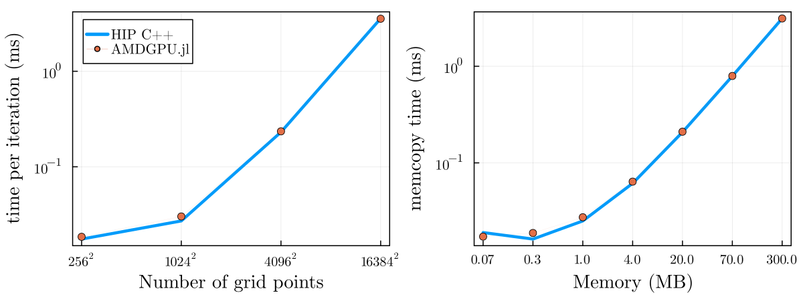

# Programming AMD GPUs with Julia

[Julia](https://julialang.org/) is a high-level, general-purpose
dynamic programming language that automatically compiles to efficient
native code via LLVM, and supports multiple platforms.
With LLVM, comes the support for programming GPUs, including AMD GPUs.

[AMDGPU.jl](https://github.com/JuliaGPU/AMDGPU.jl) Julia package
is the main entry point for programming AMD GPUs.
It provides the support for both high-level array programming
as well as low-level kernel programming
and integrates with rich Julia ecosystem for a unifying experience.

## Quickstart

Installing AMDGPU.jl is as easy as adding a regular Julia package.
From the Julia REPL, execute (`]` symbol enters Pkg REPL mode, `Backspace` exits it):

```julia
] add AMDGPU
```

Users are also required to have a working ROCm installation, see
[requirements](https://amdgpu.juliagpu.org/dev/#Requirements) section.

## Example: element-wise addition

Once you have a working AMDGPU.jl installation,
you can import the package and start using it:

```julia
julia> using AMDGPU

julia> a = AMDGPU.ones(Float32, 1024); # ';' suppresses output in the REPL

julia> b = AMDGPU.ones(Float32, 1024);

julia> c = a .+ b; # '.' does function broadcasting for '+' operator

julia> sum(c)
2048
```

In the example above we import the package,
allocate `a` and `b` arrays on the GPU and fill them with `1`s,
compute the element-wise sum (notice `.+` which does operator broadcasting)
and finally compute the sum over the entire `c` array.

For the sake of it we can also compare the computation against CPU:

```julia
julia> ch = Array(a) .+ Array(b);

julia> Array(c) ≈ ch # '≈' can be replaced with 'isapprox(Array(c), ch)' to avoid Unicode
true
```

Here we first transfer `a` and `b` from GPU to CPU,
compute element-wise sum, store it in `ch`
and compare against `c` using `≈` operator
(Julia supports [Unicode input](https://docs.julialang.org/en/v1/manual/unicode-input/)).

## Example: GPU kernel for element-wise addition

Alternatively, we can perform the same computation by writing our custom GPU kernel.

```julia
julia> function vadd!(c, a, b)
           i = workitemIdx().x + (workgroupIdx().x - 1) * workgroupDim().x
           if i ≤ length(c)
               @inbounds c[i] = a[i] + b[i]
           end
           return
       end
vadd! (generic function with 1 method)
```

Similar to C++/HIP kernels, Julia has support for AMD GPU-specific
[intrinsics](https://amdgpu.juliagpu.org/dev/kernel_programming/)
which can be used within kernels.
Here we compute index `i` of a single workitem in the same way as
with regular HIP kernels.
We then write the element-wise result of `a` and `b` into `c`
(`@inbounds` macro disables bounds-checking, which improves the performance).

> **Note:** since a kernel is a regular GPU function, all kernels should return nothing.

Launching a kernel can be done with a handy `@roc` macro:

```julia
julia> groupsize = 256;

julia> gridsize = cld(length(c), groupsize);

julia> @roc groupsize=groupsize gridsize=gridsize vadd!(c, a, b);

julia> Array(c) ≈ ch
true
```

> **Note:** all kernel launches are asynchronous, therefore users must
> explicitly synchronize with `AMDGPU.synchronize()` when needed.
> However, during GPU -> CPU transfer, AMDGPU.jl performs synchronization
> under-the-hood.

We can see that it is extremenly easy to do kernel programming with Julia
and kernels are not limited in functionality and being on par with HIP.

## Integration with Julia ecosystem

AMDGPU.jl integrates ROCm libraries with Julia ecosystem offering unifying
experience, where there's almost no difference between
using arrays backed by AMDGPU.jl, CPU or other accelerators.

E.g. [rocBLAS](https://github.com/ROCm/rocBLAS) is used for common
BLAS operations, and Julia's operators dispatch to them for efficiency.

```julia
julia> a = AMDGPU.rand(Float32, 1024, 1024);

julia> b = AMDGPU.rand(Float32, 1024, 1024);

julia> c = a * b; # dispatches to rocBLAS for matrix multiplication
```

[Flux.jl](https://fluxml.ai/) or [Lux.jl](https://lux.csail.mit.edu/stable/)
can be used to do machine learning supporting common building blocks:

```julia
julia> using AMDGPU, Flux;

julia> Flux.gpu_backend!("AMDGPU");

julia> model = Conv((3, 3), 3 => 7, relu; bias=false);

julia> x = AMDGPU.rand(Float32, (100, 100, 3, 50)); # random images in WxHxCxB shape.

julia> y = model(x); # dispatches to MIOpen for convolution
```

[Zygote.jl](https://github.com/FluxML/Zygote.jl) can be used to compute gradients
given any Julia function:

```julia
julia> θ = AMDGPU.rand(Float32, 16, 16);

julia> x = AMDGPU.rand(Float32, 16, 16);

julia> loss, grads = Zygote.withgradient(θ) do θ
           sum(θ * x)
       end;
```

And much more!

## Performance

Provided that you are using efficient constructs, the performance of
Julia GPU code is on par with C++ and sometimes even exceeding it,
depending on the workload.



Performance comparison of a memcopy and 2D diffusion kernel
implemented in Julia with AMDGPU.jl and executed on a MI250x GPU.

For performance inspection, [profiling](https://amdgpu.juliagpu.org/dev/profiling/)
can be used to get a timeline view of the entire program.

And `@device_code_...` (`llvm`, `gcn`, `lowered`) macros on a per-kernel basis to dump
different intermediate representations (unoptimized LLVM IR, optimized LLVM IR, assembly).

Below is the optimized LLVM IR for `vadd!` kernel defined above:

```julia
julia> @device_code_llvm @roc launch=false vadd!(c, a, b)
```

```llvm
;  @ REPL[4]:1 within `vadd!`
define amdgpu_kernel void @_Z5vadd_14ROCDeviceArrayI7Float32Li1ELi1EES_IS0_Li1ELi1EES_IS0_Li1ELi1EE(
    { i64, i64, i64, i64, i64, i64, i32, i32, i64, i64, i64, i64 } %state,
    { [1 x i64], i8 addrspace(1)*, i64 } %0,
    { [1 x i64], i8 addrspace(1)*, i64 } %1,
    { [1 x i64], i8 addrspace(1)*, i64 } %2
) local_unnamed_addr #1 {
conversion:
  %.fca.2.extract9 = extractvalue { [1 x i64], i8 addrspace(1)*, i64 } %0, 2
;  @ REPL[4]:2 within `vadd!`
  %3 = call i32 @llvm.amdgcn.workitem.id.x()
  %4 = add nuw nsw i32 %3, 1
  %5 = call i32 @llvm.amdgcn.workgroup.id.x()
  %6 = zext i32 %5 to i64
  %7 = call i8 addrspace(4)* @llvm.amdgcn.dispatch.ptr()
  %8 = getelementptr inbounds i8, i8 addrspace(4)* %7, i64 4
  %9 = bitcast i8 addrspace(4)* %8 to i16 addrspace(4)*
  %10 = load i16, i16 addrspace(4)* %9, align 4
  %11 = zext i16 %10 to i64
  %12 = mul nuw nsw i64 %11, %6
  %13 = zext i32 %4 to i64
  %14 = add nuw nsw i64 %12, %13
;  @ REPL[4]:3 within `vadd!`
  %.not = icmp sgt i64 %14, %.fca.2.extract9
  br i1 %.not, label %L92, label %L45

L45:                                              ; preds = %conversion
  %.fca.1.extract = extractvalue { [1 x i64], i8 addrspace(1)*, i64 } %2, 1
  %.fca.1.extract2 = extractvalue { [1 x i64], i8 addrspace(1)*, i64 } %1, 1
  %.fca.1.extract8 = extractvalue { [1 x i64], i8 addrspace(1)*, i64 } %0, 1
;  @ REPL[4]:4 within `vadd!`
  %15 = add nsw i64 %14, -1
  %16 = bitcast i8 addrspace(1)* %.fca.1.extract2 to float addrspace(1)*
  %17 = getelementptr inbounds float, float addrspace(1)* %16, i64 %15
  %18 = load float, float addrspace(1)* %17, align 4
  %19 = bitcast i8 addrspace(1)* %.fca.1.extract to float addrspace(1)*
  %20 = getelementptr inbounds float, float addrspace(1)* %19, i64 %15
  %21 = load float, float addrspace(1)* %20, align 4

  %22 = fadd float %18, %21
  %23 = bitcast i8 addrspace(1)* %.fca.1.extract8 to float addrspace(1)*
  %24 = getelementptr inbounds float, float addrspace(1)* %23, i64 %15
  store float %22, float addrspace(1)* %24, align 4
  br label %L92

L92:                                              ; preds = %L45, %conversion
;  @ REPL[4]:6 within `vadd!`
  ret void
}
```

With this users have a fine control over their code and can target high-performance applications.

## Applications & Libraries

With rich ecosystem integration it is extremely easy to implement applications,
here are just a few of them that have support for AMD GPUs:

- [Nerf.jl](https://github.com/JuliaNeuralGraphics/Nerf.jl):
    [Instant-NGP](https://nvlabs.github.io/instant-ngp/) implementation in native Julia.
- [Whisper.jl](https://github.com/JuliaNeuralGraphics/Whisper.jl):
    Popular speech-to-text model.
- [Diffusers.jl](https://github.com/JuliaNeuralGraphics/Diffusers.jl):
    Stable Diffusion 1.5.
- [GPU4GEO](https://ptsolvers.github.io/GPU4GEO/stream/):
    Modelling of ice motion using LUMI supercomputer targeting LUMI-G's AMD MI250x GPUs.

## Try it out

[AMDGPU.jl](https://github.com/JuliaGPU/AMDGPU.jl) supports both
Linux and Windows OS and a wide range of devices!

## Acknowledgements

Special thanks to the Anton Smirnov and the Julia community for contributing this blog. The ROCm software
ecosystem is strengthened by community projects such as Julia that enable you to use AMD GPUs in new ways.
If you have a project you would like to share here, please raise an issue or PR.
