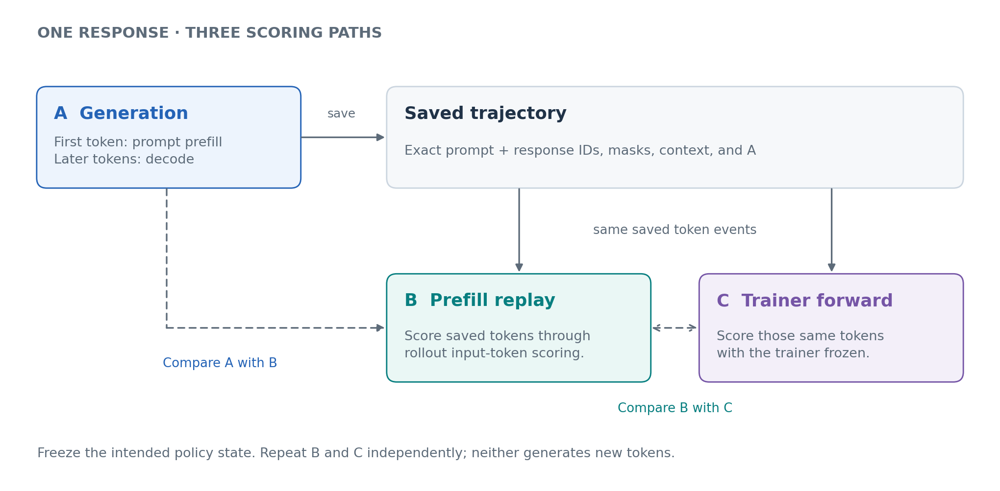
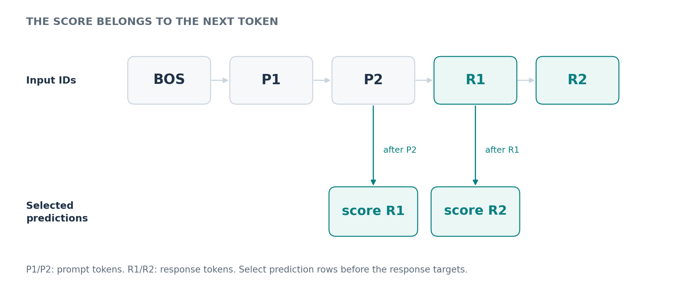
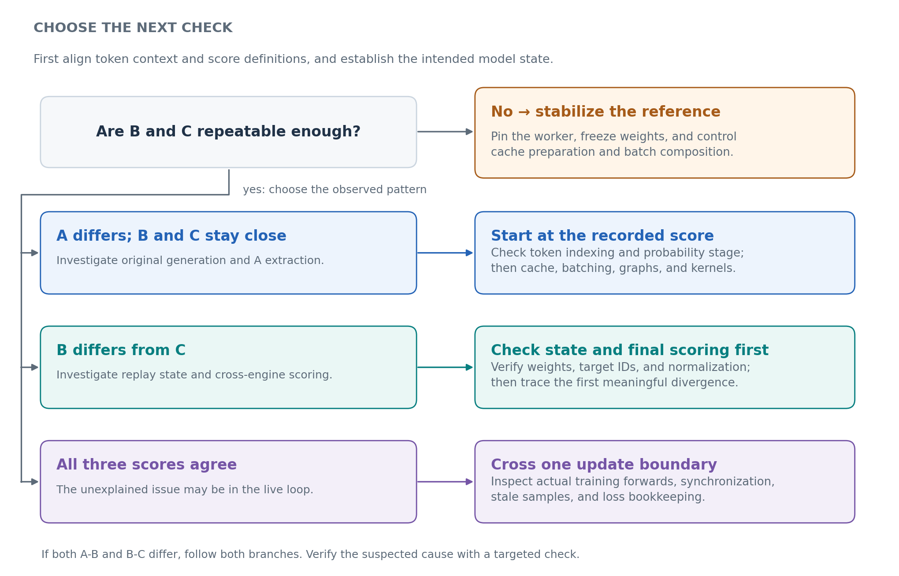

<!---
Copyright (c) 2026 Advanced Micro Devices, Inc. (AMD)

Permission is hereby granted, free of charge, to any person obtaining a copy
of this software and associated documentation files (the "Software"), to deal
in the Software without restriction, including without limitation the rights
to use, copy, modify, merge, publish, distribute, sublicense, and/or sell
copies of the Software, and to permit persons to whom the Software is
furnished to do so, subject to the following conditions:

The above copyright notice and this permission notice shall be included in all
copies or substantial portions of the Software.

THE SOFTWARE IS PROVIDED "AS IS", WITHOUT WARRANTY OF ANY KIND, EXPRESS OR
IMPLIED, INCLUDING BUT NOT LIMITED TO THE WARRANTIES OF MERCHANTABILITY,
FITNESS FOR A PARTICULAR PURPOSE AND NONINFRINGEMENT. IN NO EVENT SHALL THE
AUTHORS OR COPYRIGHT HOLDERS BE LIABLE FOR ANY CLAIM, DAMAGES OR OTHER
LIABILITY, WHETHER IN AN ACTION OF CONTRACT, TORT OR OTHERWISE, ARISING FROM,
OUT OF OR IN CONNECTION WITH THE SOFTWARE OR THE USE OR OTHER DEALINGS IN THE
SOFTWARE.
--->

# Debugging Logprob Mismatches in LLM Reinforcement Learning

In online reinforcement learning (RL), a language model generates responses, receives rewards, and updates its weights to improve future responses. Many systems split this loop between a **rollout engine**, which generates the responses, and a **trainer**, which learns from them. Both engines evaluate token probabilities: rollout records the log-probability, or **logprob**, of each token it generates, while the trainer evaluates those same tokens when computing its loss. After the update, the new weights are sent back to rollout, and the loop begins again.

Because both engines are meant to implement the same model, we can compare their token probabilities before an update. With matching weights, context, and scoring definitions, their results should be close. In practice, different numerical paths, inconsistent score handling, or stale weights can produce a gap. A single rollout-versus-trainer comparison mixes those causes together, which makes it difficult to decide where to start debugging.

We can narrow the search by adding one intermediate measurement: ask the rollout engine to score the saved response again. Comparing the original generation, rollout replay, and trainer forward helps separate a discrepancy within rollout from one between the two engines. The core rule is:

**Generate once. Save the exact token IDs. Score those same tokens three ways.**

In this blog, you’ll learn how to collect comparable logprobs, check replay repeatability, and use the pattern of disagreement to decide where to investigate next. Follow three Qwen3 experiments in which **we deliberately injected errors** into generation-score handling, trainer-score handling, and weight synchronization. Because we know what changed, we can test whether the comparisons lead us back to the injected fault.

Use the diagrams to follow the scoring paths, the measured outputs to recognize different failure patterns, and the inline snippets to collect equivalent diagnostics in your own RL system. Along the way, you’ll learn how to check whether a fix addresses the identified fault and what remaining differences still need investigation. We begin with what a logprob difference actually measures.

## What a Logprob Difference Means

Consider a response that rollout has already generated, and focus on one of its tokens. The model assigned a probability to that token based on all the tokens before it, called its **prefix**. To compare rollout with the trainer, we must ask both engines about that same token after that same prefix. RL frameworks commonly store the natural logarithm of this probability. For the token $x_t$ at position `t`, its logprob is:

$$
\ell_t = \log p(x_t \mid x_1, \ldots, x_{t-1})
$$

Suppose rollout assigns probability 0.10 to this token, while the trainer assigns 0.12. Their logprobs are approximately -2.3026 and -2.1203, so trainer minus rollout is about 0.1823. That is the logprob difference we would observe for this token. Its unit is **nats**, because the scores use natural logarithms.

The number 0.1823 is easier to interpret after converting it back to a probability ratio. Subtracting two logarithms gives the logarithm of a ratio, and exponentiation reverses the logarithm. In this example:

$$
\exp(\ell_t^{\mathrm{train}}-\ell_t^{\mathrm{rollout}})
= \frac{0.12}{0.10} = 1.20
$$

The trainer therefore considers this token 20% more likely than rollout does. That matters because Proximal Policy Optimization (PPO) and related methods use ratios to measure how token probabilities change during learning. The distribution over next tokens is the model's **policy**; changing the weights changes that policy. If a loss divides trainer probabilities by recorded rollout probabilities, an engine mismatch can look like policy change even before the weights have been updated. [PPO paper][ppo]

This is why we start debugging with **both engines at the same policy state, before an optimizer update**. After learning, a ratio different from 1 may be the intended result. Before learning, we expect closely agreeing scores when the weights, context, and probability definition match. Holding those conditions fixed lets us investigate the discrepancy without mixing in a real training update.

### Make Sure Both Scores Describe the Same Probability

Freezing the weights removes changes caused by learning, but it does not settle what a returned `logprob` means. The model first produces **logits**, which are unnormalized scores for vocabulary tokens. Softmax converts those scores into probabilities. Temperature scaling and sampling filters can modify the distribution used to choose a token, so an API's reported logprob depends on which stage it records:

| Score definition | Distribution being scored |
| --- | --- |
| Raw model | Softmax of the model's logits |
| Temperature-adjusted | Softmax of logits divided by temperature |
| Sampling or behavior | The distribution actually used after applicable filters and processors |

For example, top-k filtering with `k=2` changes `[0.50, 0.30, 0.20]` into `[0.625, 0.375, 0]`: it removes the third token and renormalizes the other two. The first token now has probability 0.625 instead of 0.50, even though the logits and weights have not changed.

To avoid mixing that change into the initial engine comparison, **compare raw model scores everywhere**. For generation, use temperature 1 and disable probability-changing filters and processors. Check where each API collects its scores, and preserve the actual sampling probabilities separately if the training objective needs them.

## One Response, Three Scores

Once the score definitions match, we can investigate the computation itself. The original rollout-versus-trainer comparison changes both the engine and the way the sequence is processed. Rollout generates a response incrementally, whereas the trainer can evaluate the supplied response in a forward pass. Replaying the response inside rollout gives us a way to inspect the change in execution path before crossing to the trainer.

There are two inference paths to distinguish. **Prefill** processes supplied tokens. During ordinary generation, **decode** then extends the sequence one token at a time, reusing cached attention keys and values, known as the **KV cache**. Our intermediate replay supplies the saved response as input, so it uses rollout's input-token/prefill scoring path. It scores the tokens that were already chosen instead of generating another response.

Figure 1 shows the three scoring paths we use to collect a logprob for each saved response token:

| Score | What to collect |
| --- | --- |
| **A: generation** | Logprobs recorded during response generation. The first response token normally comes from **prompt prefill**; later tokens come from **incremental decode**. |
| **B: rollout prefill replay** | Logprobs from the rollout engine's **input-token/prefill scoring path**, with the saved prompt and response supplied as input. No new response is generated. |
| **C: frozen trainer forward** | Logprobs from the trainer's **forward pass** on the same saved tokens, before the next optimizer update. Verify that its policy state matches rollout. |



<p align="center">
  <em>Figure 1. Three scoring paths for the same response. A records logprobs during generation; B and C score the saved tokens through rollout prefill and a frozen trainer forward. A-B compares rollout execution paths, while B-C compares the two engines.</em>
</p>

B and C use **teacher forcing**: the saved response is supplied as input, and each token is scored from its preceding prefix. A causal mask prevents future tokens from influencing earlier predictions. Supplying the complete response therefore lets us score the same events that occurred during generation.

**A versus B** compares generation with rollout prefill scoring. **B versus C** compares rollout prefill scoring with trainer forward. A gap tells us which part to inspect next, but that part includes score extraction and probability definitions as well as numerical execution.

When interpreting A-B, remember that generation itself spans both paths: the first response token's score normally comes from prompt prefill, while later scores come from decode. Keeping that first token separate can help locate a discrepancy, as Case 1 will show. Prefill can also process the supplied tokens in chunks internally.

### Save the Inputs Needed for That Replay

These comparisons only work if B and C reconstruct the original scoring context. Capture the following record where rollout data enters training, before the optimizer changes the model:

| Save | Why it matters |
| --- | --- |
| Exact prompt and response token IDs | Retokenizing text can change the input |
| Response boundary and loss mask | Prompt, padding, and excluded tokens must not enter the metric |
| Positions and attention/packing boundaries | The same target with a different visible prefix is a different event |
| A and its probability definition | Replay must not overwrite the evidence |
| Sampling settings, worker identity, model/tokenizer revision, live state version | Different workers or snapshots can disagree for valid reasons |

The **loss mask** identifies which tokens participate in the objective. Keep all response scores in the record, then use the same mask when comparing A, B, and C. This prevents excluded or padded positions from distorting the result.

For tools, multi-turn conversations, adapters, or multimodal inputs, token IDs alone may not describe the full scoring context. Preserve the actual inputs for each model call, including any images or adapter selection. Rebuilding a flattened transcript may change what the model could see, so a replay should reconstruct those model calls rather than just the displayed conversation.

### Align Each Score With the Token It Predicts

Even with the correct saved sequence, extraction can pair a score with the wrong token. A causal model’s output at one position predicts the token at the next position. As Figure 2 illustrates, the prediction after the last prompt token scores the first response token.



<p align="center">
  <em>Figure 2. Aligning predictions with response tokens. P1/P2 are prompt tokens and R1/R2 are response tokens. The output after P2 scores R1, and the output after R1 scores R2. BOS marks the beginning of the sequence.</em>
</p>

For ordinary causal-model logits, `logits[:, j]` predicts `input_ids[:, j + 1]`. If the response mask marks target tokens in the original input, it must move with those targets:

```python
prediction_logits = logits[:, :-1, :]
target_ids = input_ids[:, 1:]
target_mask = response_token_mask[:, 1:]
```

This shift is needed when extracting scores from full-sequence logits. A framework that already returns response-aligned logprobs has done that work for you. Verify the returned token IDs, lengths, and mask positions before subtracting arrays, so an indexing error does not look like a model discrepancy.

## Make the Replay Trustworthy

With the token events aligned, check whether either scoring path changes its answer when nothing relevant has changed. Otherwise, a B-C gap may partly reflect variation within B or C. Run each replay twice on the frozen response: **B0 versus B1, then C0 versus C1**. Here, 0 and 1 label repeat passes at one policy state. Keep the worker, batch composition, weights, and cache preparation fixed so the repeats test the same conditions.

This check mattered in our Qwen3 investigation. We scored one saved response five times on one fixed worker, then compared all ten pairs of passes. Across their response-token comparisons, the **mean absolute error (MAE) was 0.010828 nat**. MAE averages the absolute per-token differences, so the replay path itself was moving by roughly 0.01 on average. A cross-engine gap near 0.01 is therefore harder to interpret: some of it may come from variation within the replay path, even without changing workers.

### Follow One Token Through the Repeat Passes

The effect is easier to see in one token from Case 1 below. That experiment deliberately altered only the stored generation score A. **The B and C values shown here were not altered by the fault injection**; their differences came from the replay computations:

```text
B0 = -0.693184733    C0 = -1.136922240
B1 = -1.136922121    C1 = -1.136922240

B0-C0 = +0.443738
B0-B1 = +0.443737
B1-C0 = +0.000000  (rounded)
```

On the first pass, B0 differs from C0 by about 0.444 nat. On the second, B moves almost that entire distance, while C stays unchanged; B1 and C0 differ by only about `1.19e-7` nat. The immediate next step is to investigate B's variation on this token.

Repeat checks give us a scale for this variation before we interpret a difference between paths. Here they point to a concrete investigation: why did B assign this same token different scores on successive passes?

### Check Whether the Pattern Extends Across the Response

One outlier cannot describe the whole run, and a mean can hide outliers. Apply the same response loss mask to all comparisons, then collect these complementary measurements:

| Measurement | What it helps you see |
| --- | --- |
| Signed mean | Whether one path tends to report higher or lower logprobs |
| MAE | The average size of the disagreement, without sign cancellation |
| p95, p99, and maximum absolute error | The tails that an average can hide; p95 and p99 mark the 95th and 99th percentiles |
| Worst tokens and error by response position | Whether the gap clusters around a boundary, such as the first decode step |

Keep the subtraction order explicit. Below we use **A-B, B-C, and A-C**, with B0 and C0 as the first replay passes. For each token, `A-C = (A-B) + (B-C)`, but the MAEs do not generally add because signed errors can cancel. Case 1 includes an inline comparison function for these arrays.

<details>
<summary><strong>Measured example: what deterministic settings changed</strong></summary>

After finding repeat variation, we investigated whether execution settings could reduce it. We compared two runs on the same MI355X node, both using Triton attention, with SGLang's prefill-only deterministic mode off or on:

| Mean absolute difference, nats | Off | On |
| --- | ---: | ---: |
| B-repeat | 0.017180 | 0.008333 |
| C-repeat | 0 | 0 |
| A versus B | 0.016305 | 0.007984 |
| B versus C | 0.015165 | 0.008799 |
| A versus C | 0.014710 | 0.008446 |

The mode-on run had smaller observed gaps, with B-repeat MAE 0.008333 and A-versus-C p95 absolute error 0.050895. Each column summarizes a separate run with its own generated responses; comparisons within a run use identical tokens. The setting changes matrix multiplication and communication together, so this experiment evaluates the configuration as a whole. To isolate an operator, replay its captured input under a controlled implementation change.

The separate worker diagnostic compared five passes within one worker, one pass on each of four workers, and five router-mediated passes. Their mean pairwise errors were 0.010828, 0.013921, and 0.012633, respectively. All five router requests reached the same worker. Variation was therefore present both within a worker and across workers.

</details>

These repeat checks cover the configuration you tested. A different batch shape or execution path may behave differently because floating-point reduction order and batch-dependent computation can change the result. Once you have measured variation within B and C, you can judge whether a change in A-B or B-C stands out above it. The next experiments use that comparison to localize deliberately introduced faults. [PyTorch numerical accuracy][numerics]

## Three Experiments: Where to Look Next

We can now use the A/B/C pattern to choose an investigation. The decision map in Figure 3 starts with the repeat checks because every later decision depends on having measurements stable enough to interpret.



<p align="center">
  <em>Figure 3. A decision tree for investigating logprob mismatches. After checking replay repeatability, use the A/B/C agreement pattern to narrow the investigation to generation, scoring across engines, or the training and weight-update loop.</em>
</p>

To test this method, we introduced known faults into **Qwen3-30B-A3B with SGLang and Megatron in Miles**, on one node with eight MI355X GPUs. Each rollout used four prompts with two responses each, capped at 128 response tokens.

Each experiment has a clean control, a fault run, and a fixed run with the fault removed. Cases 1 and 2 change stored scores; Case 3 skips an actual weight synchronization. These deliberate changes let us check whether the comparisons point toward the part we changed. The reported errors are in nats.

<details>
<summary><strong>Experiment setup and how to read the tables</strong></summary>

| Setting | Measured configuration |
| --- | --- |
| Model | Qwen3-30B-A3B, BF16 main model computation |
| Trainer | Tensor parallel 1, pipeline parallel 2, context parallel 2, expert parallel 4; expert tensor parallel 1 |
| Rollout | Four SGLang engines, two GPUs per engine |
| Software | PyTorch 2.9.1 with ROCm 7.2; SGLang 0.5.17 development build; Megatron Core 0.19.0 development build |
| Sampling fixture | Four prompts × two samples; response limit 128; seeds 1234 |
| Scoring | Preserve A; collect two B and two frozen C passes before training; flush rollout cache before each B pass |
| Cases 1/2 | Shared clean control; 1,024 response positions per reported rollout |
| Replay execution | Triton attention and deterministic prefill settings in all three cases; Case 3 also explicitly selects the Triton mixture-of-experts (MoE) runner |
| Case 3 update | Learning rate 5e-7; artificial balanced -1/+1 rewards per prompt group |

A/B/C compare identical tokens within each run. Cases 1/2 generated different responses across clean, fault, and fixed runs, so their tables compare aggregates over eight responses per run. The output excerpts show individual tokens from these completed GPU experiments. The inline analysis uses those recorded scores; the collection section explains how to obtain full response arrays from your own model.

</details>

### Case 1: A Changes; B and C Stay Close

We first tested whether an error in handling generation scores could look like an engine mismatch. **We subtracted 0.10 nat from stored A at response positions 1 onward**, leaving the first position, tokens, and logits unchanged. The injection hook saved both the original and altered scores in metadata, so we could trace exactly what it changed. The fault run below uses the altered A.

| Run | A-B MAE | B-C MAE | A-C MAE |
| --- | ---: | ---: | ---: |
| Clean | 0.009756 | 0.009218 | 0.009337 |
| Fault | **0.100791** | 0.009306 | **0.102758** |
| Fixed | 0.006772 | 0.008432 | 0.007703 |

A-B rises from roughly 0.01 to 0.10, and A-C rises with it, while B-C stays near its clean range. The fault run's B-repeat MAE was 0.008069 and C-repeat was zero, so the change involving A is much larger than the observed repeat variation.

To narrow the location further, split A-B at the first response position:

```text
response position 0     A-B MAE = 0.00000799
response positions 1+   A-B MAE = 0.101585
```

The large error begins at position 1, exactly where we changed the stored scores. Since later response tokens also use decode, this pattern could easily suggest a decode problem. Here, however, the cause is bookkeeping: only the stored scores changed. Removing that offset returned all three comparisons to the clean range without changing a kernel.

For a similar pattern in your own run, start by comparing the engine's original returned scores and token IDs with what reaches the trainer. If the values change along the way, inspect indexing, first-token handling, and probability definition there. If they arrive intact, the generation-versus-prefill execution difference remains a useful next target. The position split locates the symptom; tracing the scores tells you which operation produced it.

<details>
<summary><strong>Inspect this run's outlier and reproduce the comparison on CPU</strong></summary>

The averages identify the injected A fault, but individual tokens can contain additional variation. Here are the five recorded scores for the unstable B token shown earlier: rollout 0, sample 3, response position 22, token ID 374. A includes the deliberate -0.10 offset:

```text
score      logprob
A         -0.676086342
B0        -0.693184733
B1        -1.136922121
C0        -1.136922240
C1        -1.136922240
```

Subtracting these scores gives:

```text
A-B0   signed=+0.017098 MAE=0.017098
B0-C0  signed=+0.443738 MAE=0.443738
A-C0   signed=+0.460836 MAE=0.460836
B0-B1  signed=+0.443737 MAE=0.443737
B1-C0  signed=+0.000000 MAE=0.000000
C0-C1  signed=+0.000000 MAE=0.000000
```

B0-C0 nearly disappears on the second B pass. At the same time, the small A-B0 gap does not clear A: its value was deliberately corrupted. Read the run-level pattern and repeat checks together, since one selected token cannot explain the whole run.

To inspect the arithmetic, install NumPy with `python -m pip install numpy` and use the complete block below in a Python session or notebook. It includes the recorded inputs and a comparison function that also accepts your own response-aligned arrays:

```python
import numpy as np


def compare(left, right, mask):
    """Check identical token events before calling; uses left minus right."""
    left, right = np.asarray(left, dtype=float), np.asarray(right, dtype=float)
    mask = np.asarray(mask)
    if left.ndim != 1 or left.shape != right.shape or left.shape != mask.shape:
        raise ValueError("Expected equal-length, response-aligned 1-D arrays")
    if not np.isin(mask, [0, 1]).all() or not mask.any():
        raise ValueError("Expected a binary mask with at least one active token")
    active = mask.astype(bool)
    if not (np.isfinite(left[active]).all() and np.isfinite(right[active]).all()):
        raise ValueError("Non-finite score on an active token")
    delta = left[active] - right[active]
    if not np.isfinite(delta).all():
        raise ValueError("Non-finite difference")
    error = np.abs(delta)
    return dict(count=int(delta.size), signed_mean=float(delta.mean()),
                mae=float(error.mean()), p95=float(np.quantile(error, .95)),
                p99=float(np.quantile(error, .99)), maximum=float(error.max()))


# One actual outlier from Case 1: rollout 0, sample 3, response position 22.
# Token ID 374; these are stored scores, including Case 1's deliberate A offset.
A = [-0.6760863423347473]
B0 = [-0.6931847333908081]
B1 = [-1.1369221210479736]
C0 = [-1.1369222402572632]
C1 = [-1.1369222402572632]
mask = [1]
for label, left, right in [
    ("A-B0", A, B0), ("B0-C0", B0, C0), ("A-C0", A, C0),
    ("B0-B1", B0, B1), ("B1-C0", B1, C0), ("C0-C1", C0, C1),
]:
    result = compare(left, right, mask)
    print(f'{label:6s} signed={result["signed_mean"]:+.6f} MAE={result["mae"]:.6f}')

# For your captured record after adding response-aligned C0/C1:
# compare(record["A"], record["B0"], record["mask"])
# compare(record["B0"], record["C0"], record["mask"])
# compare(record["B0"], record["B1"], record["mask"])
# compare(record["C0"], record["C1"], record["mask"])
```

The printed output is rounded to six decimals, so a displayed zero need not be exact zero. With one active token, MAE, p95, p99, and maximum all equal its absolute difference. Use full response arrays to characterize a run's distribution.

This inline exercise reproduces the displayed subtractions. Model replay uses the full saved prefix and policy state, as described in the collection section.

</details>

### Case 2: A and B Stay Close; C Changes

The first case changed only A. To test the other side of the comparison, **we subtracted 0.10 nat from both frozen trainer score passes**, leaving A, B, tokens, and weights unchanged. This modified returned frozen scores; gradient-enabled training forwards were unaffected.

| Run | A-B MAE | B-C MAE | A-C MAE |
| --- | ---: | ---: | ---: |
| Clean | 0.009756 | 0.009218 | 0.009337 |
| Fault | 0.008086 | **0.102164** | **0.102420** |
| Fixed | 0.006334 | 0.007119 | 0.007712 |

Now A-B stays near its clean range, while B-C and A-C rise to about 0.10. The repeat checks help interpret that change:

```text
A-B MAE       0.008086
B-C MAE       0.102164
B-repeat MAE  0.008341
C-repeat MAE  0.000000
```

The B-C gap is much larger than B's observed repeat variation. C, meanwhile, returns the same wrong score on both passes. This is why repeatability is a prerequisite for diagnosis but cannot establish correctness on its own.

For this pattern, inspect how C is calculated before assuming a weight or kernel problem. A selected-token logprob combines two quantities: the chosen token's logit and a normalizer over the entire vocabulary. Let `z` denote the vocabulary logits at the position being scored and `V` the vocabulary size:

$$
\ell_t = z_t[x_t] - \log \sum_{v=1}^{V} \exp(z_t[v])
$$

The second term is usually computed with a numerically stable `logsumexp` operation. Compare the target token ID, logits, temperature scaling, and vocabulary normalizer across paths. If the full vocabulary logits agree but logprobs differ, inspect normalization, extraction, and any later changes to the scores. If the logits already disagree, continue upstream into the model.

In Case 2, because A and B remain close while C differs from both, we focused our code inspection on how C is calculated and returned. Inspecting the scoring wrapper identifies the operation responsible. The wrapper first calls the original `calculate_log_probs_and_entropy` function, then applies `log_probs - offset` before returning the result. With `offset` set to 0.10, the change enters after the original logprob calculation. To check this boundary in your own run, capture the scores immediately after calculation and again after any postprocessing, within the same forward pass. A difference between those captures tells you where to investigate.

Removing the injected subtraction reduced B-C MAE from 0.102164 to 0.007119, with all three comparisons returning to the clean range. Inspecting the hook identified the operation, and the fixed run verified its removal. The next note distinguishes this direct score corruption from a temperature-definition mismatch.

<details>
<summary><strong>How this differs from a real temperature mismatch</strong></summary>

Subtracting 0.10 from a returned logprob corrupts that score directly. It is different from changing every vocabulary logit by a constant, which would cancel in log-softmax, or changing temperature, which produces a newly normalized distribution.

Our preliminary tests included the latter kind of definition mismatch: rollout reported pre-temperature scores, while the tested trainer path divided logits by rollout temperature. B-C MAE was 0.009959 at temperature 0.9 and 0.014414 at 0.8. These measurements are separate from the synthetic 0.10-nat fault above.

To investigate temperature directly, compare `log_softmax(z)` with `log_softmax(z / T)` on the same full-vocabulary logit rows. Dividing an already computed logprob by T gives the wrong result because temperature changes the normalizer too. This same-input check separates the scoring formula from any upstream model disagreement.

</details>

### Case 3: Agreement Breaks After an Update

The first two cases changed score handling at fixed weights. In a running RL job, the weights themselves change, so a replay that agrees initially can fail after an update. We tested that boundary by **synchronizing initially, then skipping the rollout weight update after rollout 0**.

To produce a training update in this short exercise, we assigned artificial rewards of -1 and +1 to the two responses for each prompt and used a learning rate of 5e-7. Case 3 also explicitly selected Triton for the model's mixture-of-experts (MoE) computation, in addition to the Triton attention and deterministic prefill settings used in Cases 1/2. We used this configuration for its clean, fault, and fixed runs and measured repeatability again.

The trainer advanced from its initial state T0 to T1, while rollout kept T0. Synchronization resumed at the following update, when both sides used the fault run's T2:

| Fault run | A/B state | C state | B-C MAE |
| --- | --- | --- | ---: |
| Rollout 0 | T0 | T0 | 0.009747 |
| Rollout 1, update skipped | T0 | T1 | **10.951996** |
| Rollout 2, sync resumed | T2 | T2 | 0.012223 |

At rollout 1, A and B agree exactly, and every B-repeat and C-repeat comparison is also exactly zero. Despite this stability, B-C MAE is 10.951996. One recorded outlier shows how that can happen; `sample` is the saved record identifier, not its position within the eight-response batch:

```text
rollout=1  sample=15  response_position=1  token_id=0
A   = -11.931213379    B0 = -11.931213379
B1  = -11.931213379    C0 = -27.088520050
C1  = -27.088520050

A-B0  =  0.000000000
B0-B1 =  0.000000000    C0-C1 = 0.000000000
B0-C0 = 15.157306671
```

Both paths repeat their own answers, but they evaluate different policy states. The known skipped update explains why A and B agree while C differs. This token's 15.16-nat gap is an outlier; the run's average is 10.95 nats.

For a failure that appears after an update, follow that update through export, transfer, installation, and worker readiness. Check both the version labels and the installed parameters before accepting new work; the labels track the intended state, while parameter checks verify what each worker actually holds.

In the separate **fixed run**, reinstating the skipped update exactly reproduced the clean run's response sequences and aggregate scores. The later clean/fixed B-C MAEs were **0.012532 and 0.012838**, still above the exercise's `<0.01` pass criterion. The injected staleness was fixed; those smaller numerical differences remained unresolved and became the next target for investigation.

<details>
<summary><strong>Verify a weight update without mixing old and new scores</strong></summary>

To test installation independently of new response generation, carry one saved response across an update:

1. At synchronized T0, collect `A_old`, `B_old`, and `C_old`.
2. Update the trainer to T1; install T1 on rollout and wait for completion.
3. Replay the saved response to obtain `B_new` and `C_new`. Compare them with each other and repeat each at T1.
4. Generate a new response at T1 to test the live generation path separately.

`A_old` remains evidence from T0 and need not equal `C_new` after learning. The old/new labels here identify policy states; B0/B1 elsewhere identify repeat passes at one state.

To verify resident weights, compare parameter hashes when layouts and dtypes are identical. With packed, sharded, or quantized layouts, compare corresponding logical tensors and their scales or metadata. Record which tensors and shards the check covers.

The experiment's T labels describe controller-level states rather than independently verified parameter hashes. Also, once the fault changes the learning trajectory, its T2 need not equal the clean run's T2. Resuming synchronization in the fault run does not undo that earlier training history.

The original three-rollout experiment generated new responses at each rollout under the artificial reward setup. The fixed-response procedure above isolates the installation check from those changes in responses.

</details>

## When the Comparison Still Points Inside the Model

Case 3 illustrates a common stopping point: the known fault is fixed, yet a smaller gap remains. If token context, score definitions, repeatability, and resident state have been checked, the next step is to look inside the computation selected by A-B or B-C. Start with a few intermediate outputs, such as embeddings, selected layers, final normalization, and vocabulary logits. Find where disagreement grows, then add attention and feed-forward checkpoints inside that interval.

Match tokens, channels, and shard layouts so each comparison still describes the same computation. In a mixture-of-experts (MoE) model, include routing in that comparison, since different expert choices or dispatch ordering can change the output. The useful follow-up depends on what you find:

| Observation | Useful next experiment |
| --- | --- |
| A-B gap survives extraction checks | Teacher-force the saved response through incremental decode; vary cache, batch, graph capture, or backend one at a time |
| An operator appears suspicious | Capture its input and run optimized/reference implementations on that **same input** |
| MoE outputs diverge | Compare expert IDs, routing weights, dispatch order, and accumulation |
| Frozen C agrees, but training behaves differently | Compare with the gradient-enabled forward before the optimizer step; inspect dropout, recomputation, and routing |

When testing a suspected operator, give both implementations the same captured input. Otherwise, an output difference may simply be inherited from earlier layers. Replaying the operator on identical input helps separate its own contribution from the disagreement that arrived at its boundary.

### Decide Whether the Fix Is Enough

Judge a proposed fix against the failure that motivated it. A bookkeeping fix should restore the intended scores; a synchronization fix should install the intended weights. Then repeat the token comparison, including outliers, and check that the result survives a weight update under the serving conditions you intend to use.

We used `<0.01` MAE as this exercise's pass criterion. For your system, choose a tolerance using the observed repeat variation, error tails, and effect on the objective. MAE measures disagreement on sampled token scores; KL divergence instead compares probability distributions. To assess the effect on training, follow the corrected scores into the actual loss ratios, clipping or correction weights, gradients, and reward outcomes.

<details>
<summary><strong>Which logprob enters the training loss?</strong></summary>

The motivating example used trainer probability divided by rollout probability. Whether that exact ratio enters a job's loss depends on the implementation. Some paths use recorded rollout logprobs as the denominator; others recompute an old-policy score in the trainer and may handle rollout mismatch separately.

This distinction matters when considering a shortcut such as replacing A with B. Doing so removes the original generation measurement and may change the objective's denominator. Preserve A, inspect which fields the loss consumes, and verify that any behavior-policy score describes the distribution that actually generated the token.

For intentional policy differences, importance correction can be appropriate when the behavior probabilities and support assumptions are valid. Support means the actions a policy can produce with nonzero probability. Standard importance sampling requires the behavior policy to cover the target policy's support. Top-k/top-p filters remove some actions, which matters when the target distribution still assigns them positive probability. [Rollout correction documentation][correction]

</details>

## Collect A/B and C in Your Own Run

The worked cases show how to interpret the evidence. To collect the same kinds of measurements, start with one ordinary text response, a dedicated rollout worker group, frozen weights, and no concurrent training updates. Tokenize the prompt once with the model's actual tokenizer and chat template.

The snippets below adapt our collection procedure to that small case. Use them inside your existing rollout and trainer setup, connecting the worker address, cache reset, trainer forward interface, and distributed output ordering to your framework. Your setup supplies model loading, job launch, and weight synchronization; the snippets show where to capture the scores and how to keep them aligned.

<details>
<summary><strong>Collection example to adapt: preserve A and collect B0/B1</strong></summary>

`capture_rollout` first saves A and the generated token IDs, then replays those IDs twice. Pass it the worker's base URL, your `prompt_ids`, and a `reset_cache(worker_url)` adapter that flushes the idle worker group's cache, waits for completion, and raises on failure. That preserves our cache preparation before each B pass.

Send these requests directly to the same worker group. The original experiment also grouped compatible samples for replay; this example reduces that operation to one response. If you are investigating a batch-dependent discrepancy, preserve the relevant batch composition when adapting it.

The generation request disables common sampling filters and penalties so raw and sampling probabilities coincide at temperature 1. Disable any additional server-side constraints or custom processors too. The request fields follow SGLang's native API. [Native API documentation][sglang-api]

```python
import json
import math
from urllib.request import Request, urlopen


def capture_rollout(worker_url, prompt_ids, *, reset_cache, max_new_tokens=128):
    """Adapt reset_cache to the API of your dedicated, frozen worker."""
    prompt_ids = list(prompt_ids)  # Use IDs from the real tokenizer/template.
    if not prompt_ids or max_new_tokens < 1:
        raise ValueError("Need a nonempty prompt and a positive response limit")

    def post(payload):
        request = Request(
            worker_url.rstrip("/") + "/generate",
            data=json.dumps(payload).encode(),
            headers={"Content-Type": "application/json"},
        )
        with urlopen(request, timeout=300) as response:
            return json.load(response)

    def unpack(items):
        if not items or any(item[0] is None for item in items):
            raise ValueError("Missing token scores")
        scores = [float(item[0]) for item in items]
        tokens = [int(item[1]) for item in items]
        if not all(math.isfinite(value) for value in scores):
            raise ValueError("Non-finite token score")
        return tokens, scores

    sampling = dict(
        temperature=1.0, top_p=1.0, top_k=-1, min_p=0.0,
        repetition_penalty=1.0, frequency_penalty=0.0,
        presence_penalty=0.0, min_new_tokens=0,
        skip_special_tokens=False,
    )
    generated = post(dict(
        input_ids=prompt_ids,
        sampling_params={**sampling, "max_new_tokens": max_new_tokens},
        return_logprob=True,
    ))
    meta = generated["meta_info"]
    response_ids, A = unpack(meta["output_token_logprobs"])
    if len(response_ids) != meta["completion_tokens"]:
        raise ValueError("Generation score count differs from completion length")
    ids = prompt_ids + response_ids

    def replay():
        reset_cache(worker_url)  # Wait for a successful flush before each pass.
        output = post(dict(
            input_ids=ids,
            sampling_params={**sampling, "max_new_tokens": 0, "temperature": 0},
            return_logprob=True,
            logprob_start_len=len(prompt_ids) - 1,
        ))
        tail = output["meta_info"]["input_token_logprobs"][-len(response_ids):]
        returned_ids, B = unpack(tail)
        if returned_ids != response_ids:
            raise ValueError("Replay token IDs do not match the saved response")
        return B

    return dict(input_ids=ids, prompt_length=len(prompt_ids),
                response_ids=response_ids, mask=[1] * len(response_ids),
                A=A, B0=replay(), B1=replay(), worker=worker_url,
                score_definition="raw; verify server-side processing",
                sampling=sampling)

# In your rollout process, with its actual tokenized prompt and cache adapter:
# record = capture_rollout(worker_url, prompt_ids, reset_cache=reset_cache)
# Keep this record unchanged and send record["input_ids"] to the trainer.
```

Replay uses `max_new_tokens=0` because B scores the supplied response. Its `temperature=0` matches our experiment's replay request setting. In the tested API, input-token scores come from unscaled logits independently of that generation temperature field. Check this input-scoring behavior in the API version you use.

The response extraction follows the earlier alignment rule. Starting at `prompt_length - 1` accommodates the initial unscored input entry, and taking the response tail and checking its IDs ensures that each B score belongs to the intended target.

Finally, save the record with independently observed model-state information and the cache preparation used. For an existing RL failure, preserve A from the original rollout request before postprocessing. A newly generated response cannot reconstruct the evidence from that earlier event.

</details>

<details>
<summary><strong>Extraction reference to adapt: frozen trainer scores C0/C1</strong></summary>

C must score the same record in the trainer you are investigating. For one unpadded sequence, use `record["input_ids"]` as input and construct a response mask with `prompt_length` zeros followed by one for every response token. Supply the attention and position inputs that reproduce the saved context.

The code below illustrates extraction from a conventional callable causal model with full-vocabulary logits. Its two forwards run at one frozen state, and its target shift implements the alignment shown earlier:

```python
import torch


def trainer_scores(logits, input_ids, response_token_mask):
    """Extract raw scores from one full-vocabulary causal-model forward."""
    if logits.ndim != 3 or logits.shape[:2] != input_ids.shape:
        raise ValueError("Expected logits [batch, length, vocabulary]")
    if response_token_mask.shape != input_ids.shape:
        raise ValueError("The mask must be indexed by original input tokens")
    if not ((response_token_mask == 0) | (response_token_mask == 1)).all():
        raise ValueError("Expected a binary response mask")
    if response_token_mask[:, 0].any():
        raise ValueError("No preceding prediction row for input position zero")
    targets = input_ids[:, 1:]
    active = response_token_mask[:, 1:].bool()
    # The preceding prediction row scores each target token.
    logp = torch.log_softmax(logits[:, :-1, :].float(), dim=-1)
    selected = logp.gather(-1, targets.unsqueeze(-1)).squeeze(-1)
    C = selected[active]
    if C.numel() == 0 or not torch.isfinite(C).all():
        raise ValueError("Missing or non-finite active trainer scores")
    return C.detach().cpu().tolist()


# For one unpadded text sequence and a conventional causal-model interface:
# model_inputs must contain the exact saved IDs and required attention/positions.
# response_token_mask is zero on prompt tokens and one on this response.
def capture_trainer(trainer, model_inputs, response_token_mask):
    was_training = trainer.training
    try:
        trainer.eval()
        with torch.no_grad():
            C0 = trainer_scores(trainer(**model_inputs).logits,
                                model_inputs["input_ids"], response_token_mask)
            C1 = trainer_scores(trainer(**model_inputs).logits,
                                model_inputs["input_ids"], response_token_mask)
    finally:
        trainer.train(was_training)
    return C0, C1

# Example call for a single-device, ordinary unpadded text model:
# device = next(trainer.parameters()).device
# ids = torch.tensor([record["input_ids"]], device=device)
# model_inputs = dict(input_ids=ids, attention_mask=torch.ones_like(ids),
#                     use_cache=False)
# response_mask = torch.zeros_like(ids)
# response_mask[:, record["prompt_length"]:] = 1
# C0, C1 = capture_trainer(trainer, model_inputs, response_mask)
# record.update(C0=C0, C1=C1)
```

For a Transformers trainer, the helper illustrates the conventional model interface. In our Miles/Megatron experiment, C instead came from the actor's frozen `compute_log_prob` output before the optimizer step. To investigate that path, collect its response-aligned `log_probs`, repeat that forward at the same state, and reconstruct the original sample order across distributed outputs.

Select the actor state intended to match rollout rather than reference-model scores or an unintended older snapshot. That state check is essential for distinguishing an execution discrepancy from the staleness illustrated in Case 3.

The extraction formula also depends on where the vocabulary lives. The helper has all vocabulary logits available; a vocabulary-parallel implementation needs a global normalizer across shards. Normalizing each shard separately would score a different distribution. The FP32 cast in the helper applies to the final log-softmax calculation; upstream model computation keeps its original precision.

Keep score extraction separate from loss filtering. Capture every response position, then apply the actual loss mask consistently to A, B, and C. Filtering only C would change its length and break alignment. The attention mask serves a different purpose: it controls which preceding tokens are visible.

Before attaching C0/C1 to the record, verify full input IDs, response IDs, sample order, and state. With those matched, the same comparison function used in Case 1 can help you choose between investigating repeat variation, score handling, model execution, and the next weight update.

</details>

## Summary

In this blog, you explored a practical workflow for debugging logprob mismatches using one saved response and three scoring paths: generation (A), rollout prefill replay (B), and a frozen trainer forward \(C\). You learned how to align tokens, match probability definitions and policy state, and check replay repeatability before using the A-B and B-C comparisons to decide where to investigate.

The three Qwen3 experiments demonstrated how deliberately injected score-handling errors and stale weights affect these comparisons, and how fixed runs verify removal of the injected faults. They also illustrated two lessons: repeatable scores are not necessarily correct, and fixing one fault can leave a smaller mismatch to investigate.

Apply this workflow to your own RL system by adapting the inline collection snippets, inspecting individual token outliers alongside aggregate metrics, and repeating the replay checks after synchronizing updated weights. Start with one saved response and use the comparisons to choose your next debugging step.

## Additional Resources

- [Proximal Policy Optimization Algorithms][ppo]
- [PyTorch Numerical Accuracy][numerics]
- [verl Rollout Correction][correction]
- [SGLang Native API][sglang-api]

[ppo]: https://arxiv.org/abs/1707.06347
[numerics]: https://docs.pytorch.org/docs/2.9/notes/numerical_accuracy.html
[correction]: https://verl.readthedocs.io/en/latest/algo/rollout_corr.html
[sglang-api]: https://docs.sglang.io/docs/basic_usage/native_api

## Disclaimers

The information presented in this document is for informational purposes only and may contain technical inaccuracies, omissions, and typographical errors. The information contained herein is subject to change and may be rendered inaccurate for many reasons, including but not limited to product and roadmap changes, component and motherboard version changes, new model and/or product releases, product differences between differing manufacturers, software changes, BIOS flashes, firmware upgrades, or the like. Any computer system has risks of security vulnerabilities that cannot be completely prevented or mitigated. AMD assumes no obligation to update or otherwise correct or revise this information.

However, AMD reserves the right to revise this information and to make changes from time to time to the content hereof without obligation of AMD to notify any person of such revisions or changes.

THIS INFORMATION IS PROVIDED "AS IS." AMD MAKES NO REPRESENTATIONS OR WARRANTIES WITH RESPECT TO THE CONTENTS HEREOF AND ASSUMES NO RESPONSIBILITY FOR ANY INACCURACIES, ERRORS, OR OMISSIONS THAT MAY APPEAR IN THIS INFORMATION. AMD SPECIFICALLY DISCLAIMS ANY IMPLIED WARRANTIES OF NON-INFRINGEMENT, MERCHANTABILITY, OR FITNESS FOR ANY PARTICULAR PURPOSE. IN NO EVENT WILL AMD BE LIABLE TO ANY PERSON FOR ANY RELIANCE, DIRECT, INDIRECT, SPECIAL, OR OTHER CONSEQUENTIAL DAMAGES ARISING FROM THE USE OF ANY INFORMATION CONTAINED HEREIN, EVEN IF AMD IS EXPRESSLY ADVISED OF THE POSSIBILITY OF SUCH DAMAGES.

AMD, the AMD Arrow logo, AMD Instinct, ROCm, and combinations thereof are trademarks of Advanced Micro Devices, Inc. Other product names used in this publication are for identification purposes only and may be trademarks of their respective companies.

© 2026 Advanced Micro Devices, Inc. All rights reserved.
