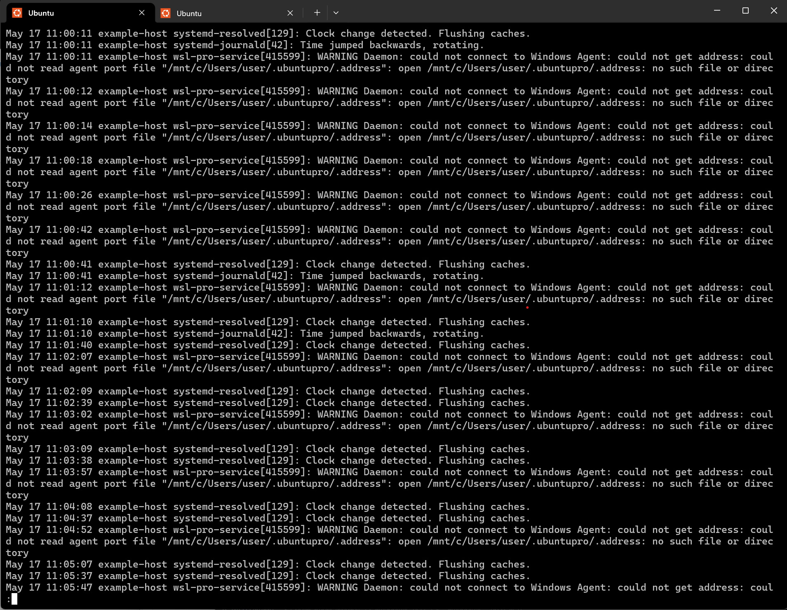
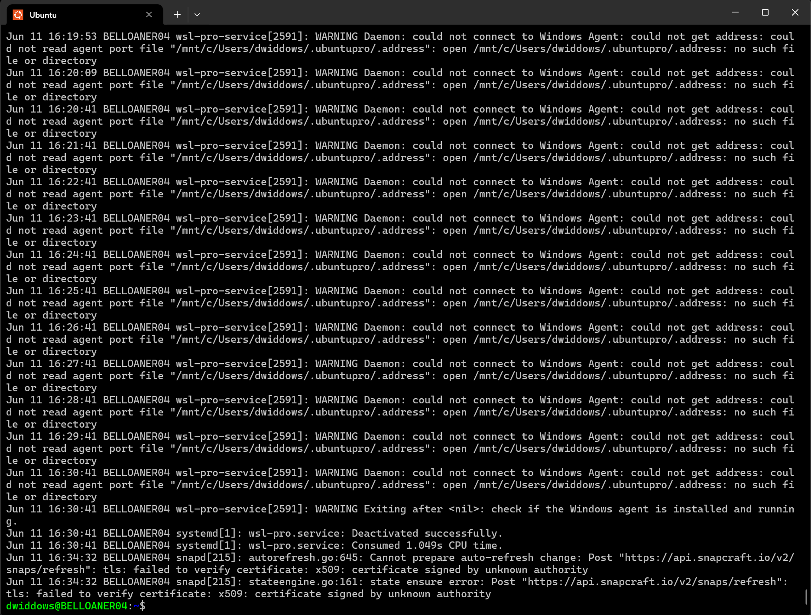
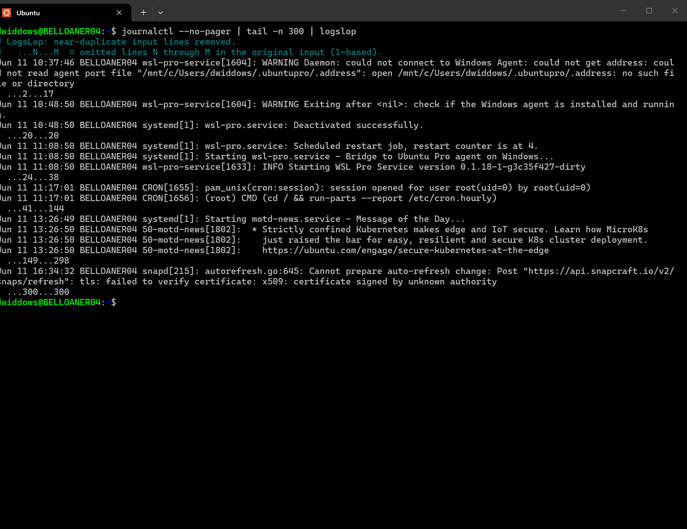
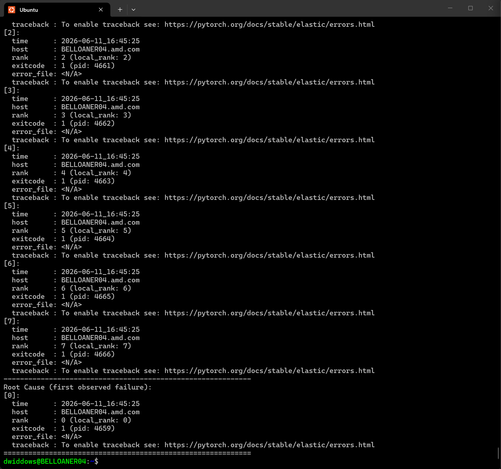
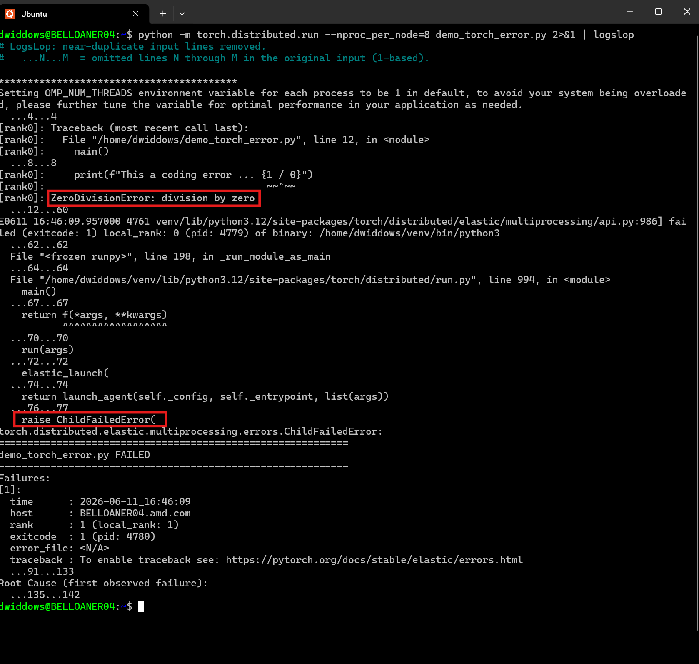

<!---
Copyright (c) 2026 Advanced Micro Devices, Inc. (AMD)

Permission is hereby granted, free of charge, to any person obtaining a copy
of this software and associated documentation files (the "Software"), to deal
in the Software without restriction, including without limitation the rights
to use, copy, modify, merge, publish, distribute, sublicense, and/or sell
copies of the Software, and to permit persons to whom the Software is
furnished to do so, subject to the following conditions:

The above copyright notice and this permission notice shall be included in all
copies or substantial portions of the Software.

THE SOFTWARE IS PROVIDED "AS IS", WITHOUT WARRANTY OF ANY KIND, EXPRESS OR
IMPLIED, INCLUDING BUT NOT LIMITED TO THE WARRANTIES OF MERCHANTABILITY,
FITNESS FOR A PARTICULAR PURPOSE AND NONINFRINGEMENT. IN NO EVENT SHALL THE
AUTHORS OR COPYRIGHT HOLDERS BE LIABLE FOR ANY CLAIM, DAMAGES OR OTHER
LIABILITY, WHETHER IN AN ACTION OF CONTRACT, TORT OR OTHERWISE, ARISING FROM,
OUT OF OR IN CONNECTION WITH THE SOFTWARE OR THE USE OR OTHER DEALINGS IN THE
SOFTWARE.
--->

# LogsLop: A Tiny Summarization Tool for Enormous Log Files

This blog introduces [LogsLop](https://github.com/amd/logslop), a summarization tool that can make huge repetitive log files tractable for human readers and artificial agents.

Computers all over the world write log messages about system events, and the log files containing these messages can be very useful for diagnosing and fixing problems.
However, because log messages are autogenerated, they can be very numerous and repetitive.
This creates long log files that are tedious to read, and sometimes too large even for today's most powerful LLMs to process.
Imagine scrolling through screens of information like this when a server has reported a crash and your main coding tool just stops working:



LogsLop removes duplicates and repetitions from such files, enabling readers and agents to home in quickly on key message events.
(The name is twofold: LogsLop lops redundant logs, and reduces log slop.)

In this blog, you'll learn about:

* Using LogsLop to summarize simple command outputs and program logs.
* How LogsLop works - string normalization, Jaccard similarity, incremental clustering.
* Using LogsLop as a component that enables large-scale LLM log analysis.
* How LogsLop compares with more traditional log-parsing tools.
* Scroll-Until Root Cause Lines, or SURCLs, a metric that quantifies how much LogsLop helps to reduce the search for critical errors.

LogsLop source, tests, and releases are hosted in the [amd/logslop](https://github.com/amd/logslop) repository on GitHub.
Demo scripts and sample logs for this post are in this blog's [`src`](./src/) folder.

## Installing LogsLop

LogsLop is available as a PyPI package and can be installed with:

```bash
pip install logslop
```

LogsLop requires Python 3.7+. Run `logslop --help` for more options.

## First Examples: Simple Command Outputs and Program Logs

LogsLop reads stdin line by line and prints a deduplicated stream.
Anything that produces repetitive line-oriented text can be piped through it.

Examples include commands that show recent system logs, such as `journalctl --no-pager` on Linux, `log show` on BSD/macOS, or `Get-Content $env:Windir\Logs\CBS\CBS.log` on Windows.

For example, on my laptop running WSL, `journalctl --no-pager` gives 9393 lines including 3094 repeats of "WARNING Daemon: could not connect to Windows Agent", which dominates the view of recent events in the screenshot below.



Adding LogsLop to the chain of commands using the pipe `| logslop` removes those repetitions, reducing the output to 34 representative messages with `...N...M` skip markers (two leading spaces in the actual output) recording where near-duplicate blocks were folded away.
After piping through logslop, the output in the screenshot below is more varied and informative.



### PyTorch Shutdown Events

Multi-process training often prints the same stack trace once per process.
When there are multiple processes (for example, processes running on multiple GPUs),
this can lead to sloppy repetition of shutdown messages.

For example, the [demo_torch_error.py](./src/demo_torch_error.py) script triggers a `ZeroDivisionError` on eight processes.
To reproduce this, with PyTorch installed, copy the script and run:

```bash
cd src
python -m torch.distributed.run --nproc_per_node=8 demo_torch_error.py 2>&1
```

You should see errors like those in [demo_torch_error.log](./src/demo_torch_error.log).
Raw output repeats the `ZeroDivisionError` eight times (lines 5–60), then adds 85 lines of shutdown cascade, so `ChildFailedError` and the last error are hard to spot without scrolling. This output looks like the image below.



Adding `| logslop` to the command above shrinks the stream to 48 lines and puts the last `ZeroDivisionError` 35 lines from the end, where both errors stand out.
The output looks like the image below (actual errors highlighted manually).



Scrolling backward from the end of a repetitive log file to locate the real errors is a common and often frustrating experience for systems engineers.
We will return to this menial-but-real challenge later in the article.

## How LogsLop Works

In developing LogsLop, we explored several approaches, including finding repeated structures and hierarchical sections spanning multiple lines.
However, the tiny implementation in [logslop.py](https://github.com/amd/logslop/blob/main/logslop.py) performs only three very simple steps, as follows.

### String Normalization and Tokenization

Each line is treated as an independent log message.
Log messages often contain timestamps, and other numbers that vary, without changing the basic meaning of the message.
For this reason, LogsLop normalizes numbers to a common placeholder symbol, which makes them basically interchangeable.
The resulting string is converted to a list of tokens, by joining contiguous letter characters, and splitting on whitespace.

It's trivially easy to change the tokenization and normalization behavior, by hand, or using agent coding assistance.
For example, in timestamps like `[Thu Aug 14 23:22:25 2025]`, the implementation in
[logslop.py](https://github.com/amd/logslop/blob/main/logslop.py) normalizes only the digits, preserving the distinctions between days and months.
Suppose you want these to be merged as well.
The command-line tool could be adapted to support a variety of such options, but these would need to be built and tested by authors, and learned by users.
Instead, it's often easier today to build such options yourself, and only the ones you need.
As an exercise, try copying this paragraph of text as a prompt into a regular chat agent, and ask the agent "In the amd/logslop GitHub repository, adapt string normalization in logslop.py to include mapping all 3-letter day and month abbreviations to a shared placeholder token: please make the code do that, add test cases to logslop_test.py, and report back explaining the code and tests."
(Hopefully that experiment works as well for you as it did during my testing, however, ensure you thoroughly review the outcome for accuracy.)

In fact, nearly all of the core LogsLop code has been written using AI tools like this.
Coding agents take care of the Python syntax, while the software developer role focuses on desired behaviors, code review, testing, and finding efficient ways to evaluate at scale.

### Jaccard Similarity

The Jaccard index is a simple rule for measuring how much two sets of objects have in common.
It was developed in the 1800s by scientists including Grove Karl Gilbert in geology and
Paul Jaccard in botany, and is often used today to compare strings in text processing.
The Jaccard similarity between two sets $A$ and $B$ is defined to be the size of their
intersection divided by the size of their union, or in symbols:

$$
J(A,B) = \frac{|A \cap B|}{|A \cup B|}
$$

In our case, the objects are the words or tokens in each log message.
For example, the Jaccard similarity between **The brown dog** and **The brown cow** is 2/4, or 0.5, because they have two words in common and four words in total.

As with text normalization, there are plenty of alternative methods for text similarity scoring.
As a more extensive experiment with agent coding, you can ask a coding agent to
consider the methods listed in this [String metric Wikipedia article](https://en.wikipedia.org/wiki/String_metric), and try implementing the most promising.
(The coding agent will likely generate correct Python code, but keep in mind that the initial solution may require adjustments or fine-tuning to work effectively with real-world data.)

### Incremental Clustering

LogsLop outputs only those lines that look novel.
This means we want to output lines that do not look like a line that's been output already.
LogsLop keeps a list **L** of lines already output.
Each new line **l** is compared with each of the lines in **L**, and
if their Jaccard similarity is above a given threshold (often 0.6), the new line **l** is ignored (while keeping a count of how many lines are ignored in each region).
If the new line **l** does not match any of the items stored in **L** already, it is printed to the console, and added as a new item to **L**.

As an optimization, the length of the list *L* is optionally capped at a specified length, to retain only the most recent novel lines.

### Overall Behavior

The overall result of this combination is that LogsLop prints only the first example of each
type of log message.
Many small engineering decisions are involved in deciding and implementing what we mean by two log messages being "of the same type".
The version in the [GitHub repository](https://github.com/amd/logslop) was designed for simplicity and speed, as demonstrated in the experiments below.

## LogsLop With LLM Log Analysis At Scale

Why recommend a simple 100-line text processing approach for log files in 2026, when we have such powerful large language models (LLMs) at our disposal?
*Naturally, we tested this approach first.*
Many log files can be summarized effectively enough by LLMs.
However, some are just too big for today's context windows: if you try to copy
the contents of a large log file into an LLM prompt window, your application can sometimes
grind to a halt.
It is exactly this experience that motivated LogsLop's design: LogsLop complements LLMs by making log files
small enough for them to handle.

During many iterations and experiments, we found that the simple method of
summarization by deduplication, one line at a time, worked cheaply and effectively.
To see whether deduplication helps downstream analysis, we ran a batch study over a sample of real attachment logs.
Each log file is passed through LogsLop to produce a shortened text file.
The same Llama 3.3 70B model (served locally with vLLM) then reads either the raw log or the LogsLop output and returns a short JSON summary: overall what happened, plus a list of genuine problems worth attention.
We compared token use, runtime, and how often the model could finish at all.

In one sample of 73 files totaling about 256k lines, LogsLop shrank input to about 11% of lines and about 7.5% of bytes.
Summarizing through the model on raw logs used about 959k tokens and 371 seconds in total.
Summarizing the LogsLop output from the same files used about 209k tokens and took 160 seconds—roughly 78% fewer tokens and 57% less model time.
(LogsLop's own processing time was much smaller by comparison, typically a few seconds.)
Seventeen files were too large for the Llama model to handle in one pass on raw text; all files succeeded when the model was combined with LogsLop.
LogsLop shrinks logs enough for local Llama to finish the job, with no quality issues spotted so far in expert review.

In a world where tokens cost time and money, LogsLop makes LLM log processing effective at scales that are otherwise intractable.

## LogsLop Summarization vs. Traditional Log-Parsing

Log analysis has long motivated template parsers such as [Drain](https://ieeexplore.ieee.org/document/8029742) and [Spell](https://ieeexplore.ieee.org/abstract/document/7837916), tools like [LogParser](https://github.com/logpai/logparser), and benchmarks such as [LogHub](https://github.com/logpai/loghub).
A traditional parser clusters near-identical lines and infers a template with variables.
From [demo_torch_error.log](./src/demo_torch_error.log), the shutdown cascade includes many lines like:

```shell
W0526 11:03:28.268000 6327 torch/distributed/elastic/multiprocessing/api.py:1012] Sending process 6348 closing signal SIGTERM
W0526 11:03:28.269000 6327 torch/distributed/elastic/multiprocessing/api.py:1012] Sending process 6350 closing signal SIGTERM
W0526 11:03:28.269000 6327 torch/distributed/elastic/multiprocessing/api.py:1012] Sending process 6352 closing signal SIGTERM
```

A full parser might infer `W${DATE} ${TIME} ${PID} torch/distributed/elastic/multiprocessing/api.py:1012] Sending process ${CHILD_PID} closing signal SIGTERM`, separating timestamps, process IDs, and the fixed message text.

In summarization, LogsLop merely drops repeats like these so users and other tools see unusual lines.
[Drain](https://ieeexplore.ieee.org/document/8029742) and [Spell](https://ieeexplore.ieee.org/abstract/document/7837916) were built before strong LLM summarization; parsers had to do more of the understanding work themselves.

We still used the [LogHub HDFS dataset](https://github.com/logpai/loghub/blob/master/HDFS/) to compare LogsLop with [Drain3](https://github.com/logpai/Drain3).
Parsing accuracy (PA) is an established log parsing metric introduced by [Zhu et al. (2019)](https://arxiv.org/abs/1811.03509), and is used in log parsing evaluations.
(It is quite a strict metric for clustering evaluation, because partially matched events are considered incorrect, so any mixing-up of clusters is penalized even if the summarized output would be the same.)
On HDFS_2k, Drain3 scores about 99.75% PA; LogsLop scores about 81%.
Drain wins that metric, which is expected: it's more surprising that LogsLop does so well at a difficult task for which it was not really designed.

For summarization, a more important question than parsing accuracy is whether any message type disappears.
On novel-line detection tests from 2k to 5M lines, LogsLop kept 100% recall (at least one line per message type).
Drain3 reached 86–100% recall and missed some novel types on larger files.
Where LogsLop loses PA, the failures are mostly over-splits: one template becomes two clusters, so a summary may repeat a pattern once more, not drop it.

The important thing for LLM input is to avoid bloat from obvious repetition,
not to make sure the prompt is as small as possible.
These experiments show that, while Drain3 is a better log parser than LogsLop,
LogsLop can be a better tool for partnering with LLMs.

## Scroll-Until Root Cause Lines (SURCLs)

Return to the PyTorch shutdown example above.
The figure highlights both `ZeroDivisionError` and `ChildFailedError`, both of which are particularly significant.
In [demo_torch_error.log](./src/demo_torch_error.log), the last `ZeroDivisionError` (line 60) sits 85 lines above the end; `ChildFailedError` (line 82) is 63 lines above the end.
After LogsLop, those distances are 35 and 14.

That is the familiar scroll-up-from-the-bottom hunt: you start at the end of the log and move upward until the error you care about comes into view.
We call those distances Scroll-Until Root Cause Lines (SURCLs), partly as a mnemonic.
Lower SURCLs mean less scrolling, which means less time wasted and less risk of your eyes glazing over with frustration.

As an experiment, we marked and counted SURCLs on a sample of 100 log files attached to software issues.
16 of them looked like failure logs: a clear last error-class line (traceback, `Error:`, panic, and similar), then a long tail below it.
On those 16, median SURCLs were 96 lines on the raw file and 5 after piping through LogsLop.
A few enormous kernel tails made the mean SURCLs a whopping **9,941** in the raw files, which LogsLop reduced to just **26**.
LogsLop is at its most helpful in cases like this.

As a day-to-day habit: when a command fails opaquely, run `your-command 2>&1 | logslop` — the root cause is often much closer to the bottom.

## Summary

LogsLop is a tool that removes redundant log messages, and
we hope the examples in this blog encourage you to try it out.
If you're wading through megabytes of autogenerated logs,
there's a crucial new error somewhere, and your AI agent grinds to a halt,
then LogsLop could be the solution you need.

The problem addressed is very artificial, though still very real.
LLMs are tremendous at many text processing tasks, but
cluster-scale log processing is not yet one of these —
AI models developed for the complexity of natural language processing (NLP) become too heavy when faced with such volumes of autogenerated text.
Curiously, while AI in 2026 is known for solving all kinds of notable NLP tasks, it still has difficulty debugging itself.
The niche LogsLop fills is thus accidental but important.

The design and implementation are very simple and have benefited from AI coding throughout.
This enabled many approaches to be implemented and tested quickly.
The lite version of LogsLop in the [GitHub repository](https://github.com/amd/logslop) could be written by many coding agents, using just the prompt "Build a command-line Python utility that summarizes log files by deduplication: read from stdin, keep a list of which lines we've output, and ignore new lines whose token-based Jaccard similarity (after digit normalization) with any previously output line exceeds 0.6".

Coding agents with the ability to write and execute string-processing code can increasingly build *and use* such tools.
The LogsLop method can be recreated and used by agents on the fly to help them find needle-in-a-haystack messages. It provides an alternative to string-searching tools like `grep`, which requires prior knowledge of what strings to look for.
If you have large repetitive text files to analyze, we encourage you to try
LogsLop — with `pip install logslop`, from the [GitHub repository](https://github.com/amd/logslop),
or by asking an agent to read this blog and help you get started.

## Disclaimers

The information presented in this document is for informational purposes only and may contain technical inaccuracies, omissions, and typographical errors. The information contained herein is subject to change and may be rendered inaccurate for many reasons, including but not limited to product and roadmap changes, component and motherboard version changes, new model and/or product releases, product differences between differing manufacturers, software changes, BIOS flashes, firmware upgrades, or the like. Any computer system has risks of security vulnerabilities that cannot be completely prevented or mitigated. AMD assumes no obligation to update or otherwise correct or revise this information. However, AMD reserves the right to revise this information and to make changes from time to time to the content hereof without obligation of AMD to notify any person of such revisions or changes.
THIS INFORMATION IS PROVIDED "AS IS." AMD MAKES NO REPRESENTATIONS OR WARRANTIES WITH RESPECT TO THE CONTENTS HEREOF AND ASSUMES NO RESPONSIBILITY FOR ANY INACCURACIES, ERRORS, OR OMISSIONS THAT MAY APPEAR IN THIS INFORMATION. AMD SPECIFICALLY DISCLAIMS ANY IMPLIED WARRANTIES OF NON-INFRINGEMENT, MERCHANTABILITY, OR FITNESS FOR ANY PARTICULAR PURPOSE. IN NO EVENT WILL AMD BE LIABLE TO ANY PERSON FOR ANY RELIANCE, DIRECT, INDIRECT, SPECIAL, OR OTHER CONSEQUENTIAL DAMAGES ARISING FROM THE USE OF ANY INFORMATION CONTAINED HEREIN, EVEN IF AMD IS EXPRESSLY ADVISED OF THE POSSIBILITY OF SUCH DAMAGES.
AMD, the AMD Arrow logo, ROCm, and combinations thereof are trademarks of Advanced Micro Devices, Inc. Other product names used in this publication are for identification purposes only and may be trademarks of their respective companies.
© 2026 Advanced Micro Devices, Inc. All rights reserved.
