<!---
Copyright (c) 2026 Advanced Micro Devices, Inc. (AMD)

Permission is hereby granted, free of charge, to any person obtaining a copy
of this software and associated documentation files (the "Software"), to deal
in the Software without restriction, including without limitation the rights
to use, copy, modify, merge, publish, distribute, sublicense, and/or sell
copies of the Software, and to permit persons to whom the Software is
furnished to do so, subject to the following conditions:

The above copyright notice and this permission notice shall be included in all
copies or substantial portions of the Software.

THE SOFTWARE IS PROVIDED "AS IS", WITHOUT WARRANTY OF ANY KIND, EXPRESS OR
IMPLIED, INCLUDING BUT NOT LIMITED TO THE WARRANTIES OF MERCHANTABILITY,
FITNESS FOR A PARTICULAR PURPOSE AND NONINFRINGEMENT. IN NO EVENT SHALL THE
AUTHORS OR COPYRIGHT HOLDERS BE LIABLE FOR ANY CLAIM, DAMAGES OR OTHER
LIABILITY, WHETHER IN AN ACTION OF CONTRACT, TORT OR OTHERWISE, ARISING FROM,
OUT OF OR IN CONNECTION WITH THE SOFTWARE OR THE USE OR OTHER DEALINGS IN THE
SOFTWARE.
--->

# Agentic Diagnosis for LLM Training at Scale

In [MaxText-Slurm: Production-Grade LLM Training with Built-In Observability](https://rocm.blogs.amd.com/software-tools-optimization/maxtext-slurm/README.html), we introduced [MaxText-Slurm](https://github.com/AMD-AGI/maxtext-slurm) — an open-source launch system and observability stack for running MaxText LLM training on AMD Instinct GPU clusters. We showed how a unified Prometheus time-series database (TSDB) collects GPU, host, network, and training metrics into a single queryable store, persisted to disk so that no data is lost even if the job crashes.

A unified TSDB is only as useful as the methodology applied to it. In this post, we show the **agentic diagnostic skills** that ship with MaxText-Slurm — structured runbooks that [Cursor](https://cursor.com/) or [Claude Code](https://docs.anthropic.com/en/docs/claude-code) execute autonomously from symptom to root cause. This is not a chatbot answering questions about logs. The AI agent has tool access (shell, file system, HTTP queries to Prometheus) and follows each skill systematically: reading logs, querying metrics, interpreting results, and chaining steps until it reaches an actionable conclusion. We walk through five case studies — from one-prompt performance profiling to a throughput decline (measured in tokens per GPU per second, or TGS) whose root cause turned out to be model behavior — where each short prompt led to an actionable result in minutes.

## Setting Up the AI Agent

The AI agent needs access to two codebases: the **maxtext-slurm** repo (for skills, job outputs, and diagnostic tools) and the **MaxText** source (for code-level tracing during deep diagnosis). MaxText lives at `/workspace/maxtext` inside the training Docker image — a frozen snapshot baked into the container, not installed on the host. The most reliable setup is to run the agent inside the container on a cluster login node.

### Step 1: Clone the repo and start the container

SSH into a cluster login node and clone the repo onto a shared filesystem so that multi-node job outputs (logs, TSDB, profiles) are accessible from any node:

```bash
ssh cluster-login-node
cd /shared               # or any shared filesystem path
git clone https://github.com/AMD-AGI/maxtext-slurm.git
cd maxtext-slurm
```

Start an interactive container on the login node. `run_local.sh` bind-mounts the repo directory into the container, so job outputs on the shared filesystem are directly accessible. Diagnosis workflows (log triage, TSDB queries, source code tracing) do not require GPUs, so the login node is sufficient:

```bash
run_local.sh             # drop into an interactive container shell
```

**Tip:** To leave the container without stopping it, use `Ctrl+P, Ctrl+Q` to detach. Do **not** type `exit` — that stops and removes the container, destroying any in-container state. You can reattach later with `docker exec -it <container_name> bash`. Running on a compute node is possible but requires additional SSH setup not covered here.

Inside the container, the filesystem looks like this:

```text
/maxtext-slurm/          # maxtext-slurm repo (bind-mounted from the host)
    skills/              # AI diagnostic skills
    outputs/             # job outputs (logs, TSDB, ray_logs, ...)
    utils/               # prometheus.sh, analyze_job.py, metrics plugins
/workspace/maxtext/      # MaxText source (baked into the image)
/opt/venv/lib/python3.12/site-packages/
    orbax/               # Orbax checkpoint library
    jax/                 # JAX source
```

### Step 2: Connect the AI agent

You need two connections to the login node — one inside the container for the AI agent, and one outside for Slurm operations (`submit.sh`, `squeue`, `scancel`, SSH tunnels to live dashboards, etc.). This separation is deliberate: the AI agent inside the container can read logs, query Prometheus, and trace source code, but it cannot submit, cancel, or modify Slurm jobs. Keeping Slurm access outside the container prevents an agent mistake from affecting running jobs on the cluster.

**Cursor** — Use [Remote SSH](https://code.visualstudio.com/docs/remote/ssh) to connect to the cluster login node, then attach to the running container via [Dev Containers: Attach to Running Container](https://code.visualstudio.com/docs/devcontainers/attach-container). Add both `/maxtext-slurm` and `/workspace/maxtext` as workspace folders so the agent can cross-reference skills, job outputs, and framework source code in a single session. Use a separate terminal (SSH session to the login node, outside the container) for Slurm operations. Figure 1 shows this setup.

<div align="center">

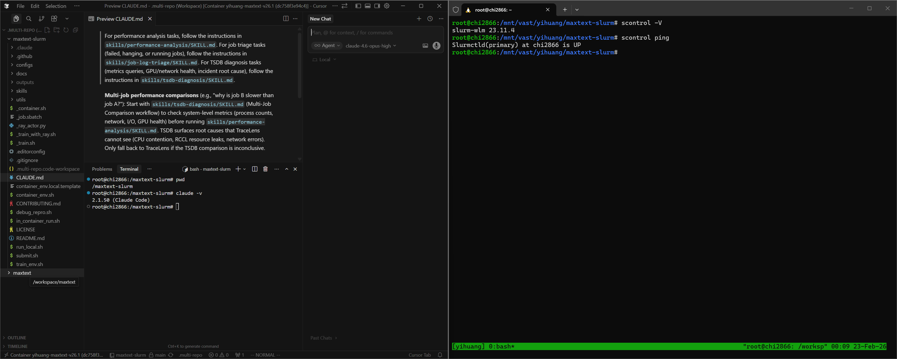

*Figure 1. Cursor attached to the remote container via SSH, with both workspace folders open. A separate terminal outside the container handles Slurm operations.*

</div>

**Claude Code** — Open two SSH sessions to the login node. In one, `docker exec` into the container and launch `claude`:

```bash
# Session 1 (AI agent — inside the container):
ssh cluster-login-node
docker exec -it <container_name> bash
cd /maxtext-slurm
claude

# Session 2 (Slurm ops — outside the container):
ssh cluster-login-node
cd maxtext-slurm
squeue -u $USER              # check running jobs
submit.sh 70b -N 8           # submit new jobs
```

Launching `claude` from `/maxtext-slurm` ensures that `CLAUDE.md` — the routing file that directs the agent to the correct skill — is picked up automatically.

### Step 3: Verify the setup

In Claude Code or Cursor chat, point the agent at any job (running, failed, hanging, or completed) by typing:

> triage job 7877

Replace 7877 with your job ID.

The agent reads the log tail, classifies the job status, extracts the config and step progress, and recommends next steps. If it reaches a diagnosis recommendation, the setup is working.

### How skills are discovered

The `CLAUDE.md` file in the repo root contains routing rules that map task descriptions to skills:

```text
For job triage tasks → skills/job-log-triage/SKILL.md
For performance analysis tasks → skills/performance-analysis/SKILL.md
For TSDB diagnosis tasks → skills/tsdb-diagnosis/SKILL.md
```

Both Cursor and Claude Code read this file automatically. There is no manual configuration — describe the task in natural language, and the agent selects the correct skill.

## The AI Skill Framework

The diagnostic capabilities are powered by an extensible skill framework in the [`skills/`](https://github.com/AMD-AGI/maxtext-slurm/tree/main/skills) directory. Each skill is a structured instruction file — not documentation for humans, but a runbook the AI agent reads and executes autonomously. Skills encode the methodology of senior systems engineers: the queries to run, how to interpret results, decision trees for choosing the next step, and common pitfalls to avoid. When the agent reads a skill, it follows the diagnostic procedure end-to-end — launching Prometheus, issuing queries, parsing responses, and deciding which playbook or follow-up skill to run based on what it finds.

The framework currently ships three skills, connected in the diagnostic pipeline shown in Figure 2:

<div align="center">

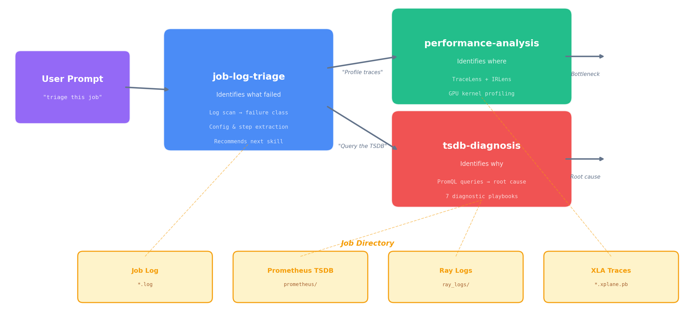

*Figure 2. The three-skill diagnostic pipeline. Triage classifies the failure and hands off to TSDB diagnosis (system-level root cause) or performance analysis (compute-level profiling). All three skills share the same job directory as their data source.*

</div>

**`job-log-triage`** identifies *what* happened. It reads the job log, classifies the failure mode (hang, OOM, heartbeat timeout, RCCL/NCCL error, etc.), extracts the job config, projects training progress, and recommends next steps.

**`performance-analysis`** identifies *where* in the compute pipeline the issue lies. It runs TraceLens (XLA trace analysis) and IRLens (HLO IR analysis) to profile GPU kernel execution, identify bottlenecks, and measure model FLOPS utilization. For multi-job comparisons, the TSDB skill runs first to rule out system-level causes before profiling.

**`tsdb-diagnosis`** identifies *why* it happened. It connects to the job's Prometheus TSDB (live or persisted), discovers available metrics, and runs the appropriate diagnostic playbook — systematically querying GPU, network, I/O, CPU, and training metrics to trace from symptom to root cause. This is the skill that makes the unified TSDB an active diagnostic tool rather than a passive data store.

The handoff between skills is automatic — when triage concludes with "query the TSDB," the agent reads the TSDB skill and continues without further prompting. The following case studies show what this looks like in practice.

## Case Study 0: Performance Profiling — One Prompt, Full Breakdown

Prompt:

> 8104 perf analysis

Figure 3a shows the agent's response in Cursor:

<div align="center">

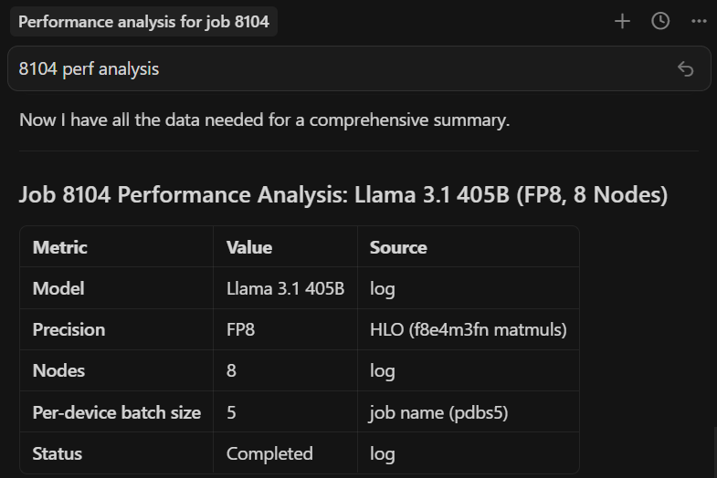

*Figure 3a. One prompt in Cursor. The agent locates the job directory, measures throughput from the log, then installs TraceLens if needed, profiles the XLA trace, and starts a web server (remaining steps not shown).*

</div>

The end result — a complete performance breakdown served locally (Figure 3b):

<div align="center">

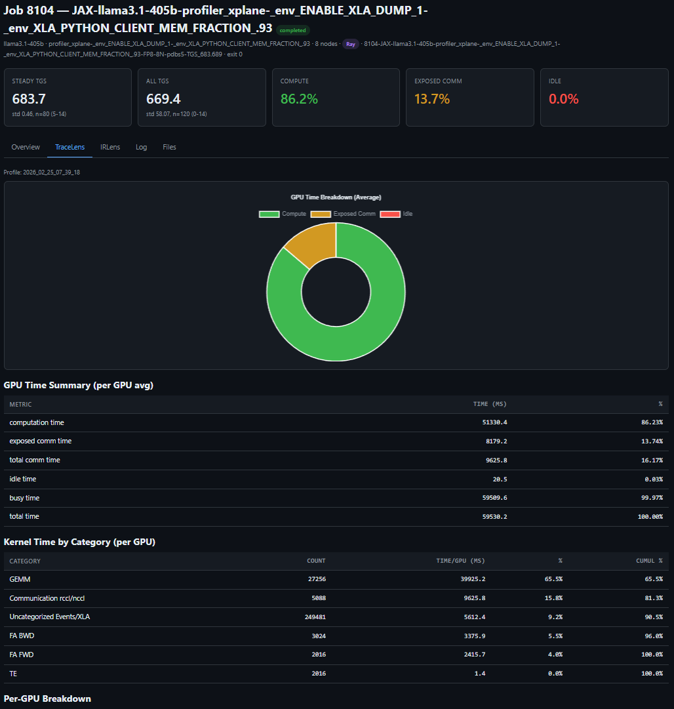

*Figure 3b. One prompt, full performance breakdown — TGS, MFU, step time decomposition, and kernel-level profiling for a LLaMA 3.1 405B FP8 run on 64 MI355X GPUs.*

</div>

**The key insight:** one short prompt can trigger a complete, repeatable performance workflow — from job discovery to profiling output — and remove the manual glue work from routine performance analysis.

## Case Study 1: The 23% TGS Drop — Diagnosing RDMA Degradation from a Single Job

A 24-node MoE training run (192 MI355X GPUs) is running without errors — no hangs, no crashes, no warnings — but throughput looks wrong:

> why is 8308 TGS so bad

The agent triages the job, confirms training is still progressing, then queries the TSDB to find the source of the throughput drop (Figure 4a):

<div align="center">

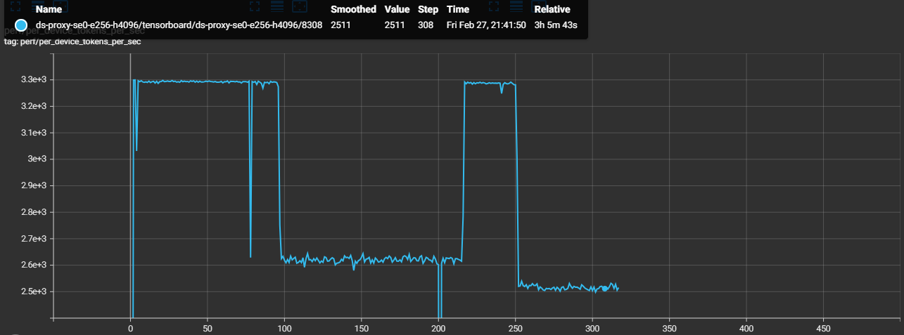

*Figure 4a. TGS timeline extracted from worker logs. The phased drop pattern points to an environmental issue, not a static config problem.*

</div>

```text
Steps 0–96:    TGS ~3,293  (healthy baseline)
Steps 97–216:  TGS ~2,620  (−20%, constant)     ← Phase 1
Steps 217–250: TGS ~3,288  (recovered)
Steps 252+:    TGS ~2,520  (−23%, constant)     ← Phase 2
```

TSDB metrics quickly isolate RDMA issues on four hosts, while the rest of the system metrics remain normal (Figure 4b):

<div align="center">

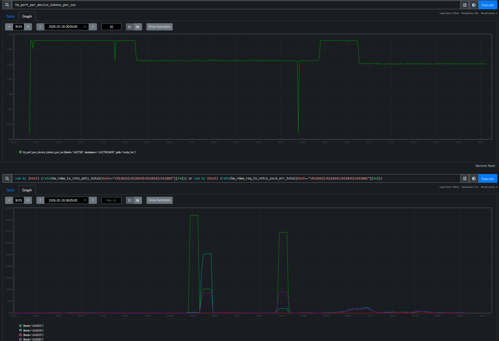

*Figure 4b. RDMA retransmit rates per host overlaid with TGS phases. Each TGS transition — drop, recovery, deeper drop — maps to a specific RDMA event on a specific node. 20 of 24 nodes have zero RDMA retransmits throughout.*

</div>

The agent identifies four unhealthy nodes for exclusion (`chi2822`, `chi2834`, `chi2882`, `chi2835`) and the user resubmits Job 8309 without them:

```text
Job 8308 (4 bad nodes in allocation): TGS 2,520
Job 8309 (bad nodes excluded):        TGS 3,287  (+30%)
```

The TensorBoard overlay confirms a full recovery (Figure 4c):

<div align="center">

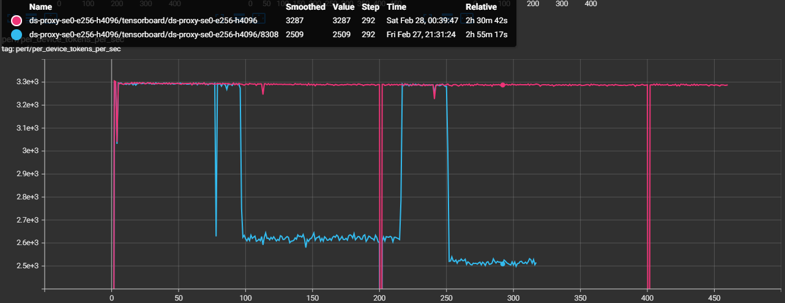

*Figure 4c. TensorBoard overlay of Job 8308 (degraded) and Job 8309 (bad nodes excluded). Job 8309 sustains ~3,287 TGS — a 30% recovery that confirms the four excluded nodes were the root cause.*

</div>

Swapping out those four nodes restored throughput from 2,520 to 3,287 TGS (+30%), confirming the diagnosis end-to-end.

**The key insight:** the agent used TSDB evidence from a single degraded job to isolate four unhealthy nodes, and replacing those nodes fully restored throughput.

## Case Study 2: Heartbeat False-Positive — Proving Tasks Were Alive

This is the incident that motivated building the entire observability stack. Every checkpointing job died with "stopped sending heartbeats" — first during initialization (we [patched the timeout](https://github.com/ROCm/maxtext/commit/452e7cb) to fix that), then at random steps during training. No stack trace, no core dump, no earlier error on the accused tasks. We had no way to tell whether the tasks had actually crashed. That dead end drove us to build the Prometheus-based observability stack: we needed an independent record of what every node was doing at the exact moment the heartbeat died. (See the [full post-mortem](https://github.com/AMD-AGI/maxtext-slurm/blob/main/docs/jax-heartbeat-false-positive-postmortem.md) for the detailed root cause analysis.)

A 24-node training run (192 MI355X GPUs) crashes mid-training at step 71:

> triage 8043

The agent reads the log and immediately spots the contradiction. The coordinator says tasks 8 and 10 "crashed":

```text
 0: UNAVAILABLE: The following tasks are unhealthy (stopped sending heartbeats):
 0: /job:jax_worker/replica:0/task:8
 0: /job:jax_worker/replica:0/task:10
 0: The tasks have crashed.
```

But task 8's own log tells a different story — it completed step 71 normally, then *received and logged its own death notification*:

```text
 8: completed step: 71, seconds: 30.309, TFLOP/s/device: 207.973, MFU: 8.32%
 8: F0224 19:21:00 client.h:77] Terminating process because the JAX distributed
    service detected fatal errors. absl::Status: UNAVAILABLE: ...
 8: /job:jax_worker/replica:0/task:8     ← task 8 reports itself as "crashed"
```

A truly crashed process cannot log its own death. The agent flags this as a **suspected false-positive** and computes the timeline: crash at 19:21:00 minus the 900s heartbeat timeout means heartbeats stopped arriving at 19:06:00. It maps the accused tasks to their hostnames — chi2853 (task 8) and chi2875 (task 10) — and queries the TSDB across the full 15-minute window when the tasks were supposedly dead. Figure 5 shows what it found.

<div align="center">

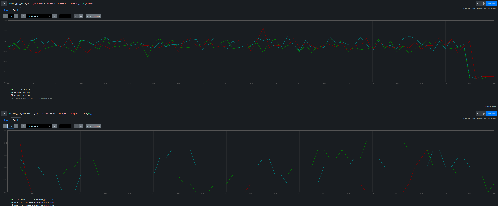

*Figure 5. GPU power (top) and TCP retransmit rate (bottom) for the accused hosts and a non-accused neighbor chi2865 (task 9). All three show identical ~900W active training with near-zero retransmits, then simultaneous death at 19:21. The task sandwiched between the two "dead" tasks was perfectly healthy.*

</div>

The proof is unambiguous. Both accused hosts drew ~900W (active training) with near-zero network errors throughout the entire window — indistinguishable from the non-accused neighbor sitting between them. The agent concludes: **confirmed heartbeat false-positive**. The tasks were alive and actively training when the heartbeat mechanism declared them dead. The root cause is a design flaw in JAX's coordination service where a long-running `PollForError` call blocks the heartbeat callback on a shared gRPC channel (see the [post-mortem](https://github.com/AMD-AGI/maxtext-slurm/blob/main/docs/jax-heartbeat-false-positive-postmortem.md) for the full source-level analysis).

**The key insight:** without the TSDB, you only see the accusation — "tasks 8 and 10 have crashed." With it, the agent builds a defense: GPU power, network health, and a non-accused neighbor with identical metrics, all proving the tasks were alive. The agent followed a chain — log contradiction → timeline reconstruction → TSDB forensics — that a human engineer would take hours to assemble manually.

## Case Study 3: The 1% Throughput Mystery — Checkpoint Restore Leak

This one is subtle: two 24-node Mixture-of-Experts (MoE) training runs (192 MI355X GPUs each) use identical configs on the same cluster. Job A is a fresh start; Job B restores from a checkpoint. Job B is consistently ~1% slower:

> why is job B slower than job A? identical configs

```text
Job A (fresh):   TGS 3,295
Job B (restore): TGS 3,261  (−1.0%)
```

The TensorBoard overlay makes the gap visible (Figure 6):

<div align="center">

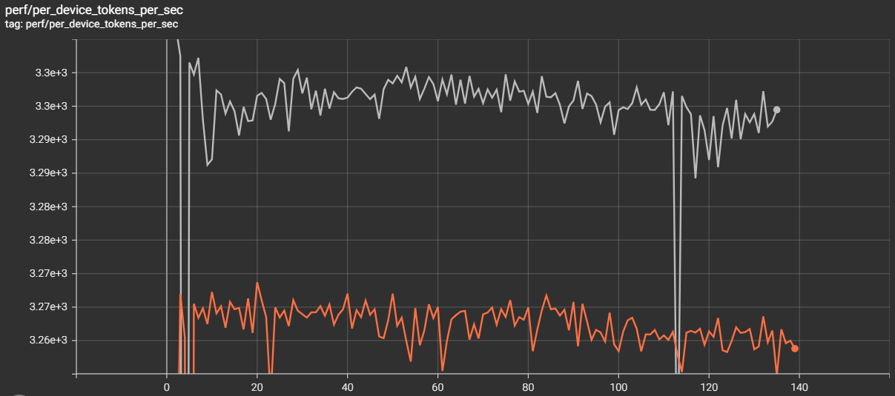

*Figure 6. TensorBoard overlay. Job A (fresh) sustains ~3,295 TGS; Job B (restore) plateaus at ~3,261 TGS — a persistent gap that compounds over multi-week runs.*

</div>

The gap is reproducible: any job restored with `enable_single_replica_ckpt_restoring=true`[^1] is slower than an identical fresh start. The agent confirms matching training configs over 200+ steps, then starts Prometheus for both jobs' persisted TSDBs and runs a systematic contention sweep. GPU utilization: both ~100%. GPU power: both ~916W. RDMA retransmits: zero. Disk I/O: comparable. Everything looks identical — until the agent checks CPU metrics.

**`hw_procs_running`** — the number of runnable threads in the kernel run queue — breaks the symmetry:

```text
Job A (fresh):   avg hw_procs_running ≈ 18 per host
Job B (restore): avg hw_procs_running ≈ 35 per host
Delta: ~17 extra runnable threads per host, constant across all 24 nodes
```

Figures 7a and 7b visualize this gap across all 24 nodes:

<div align="center">

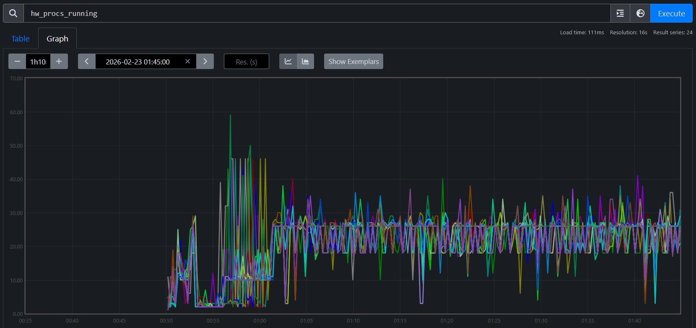

*Figure 7a. `hw_procs_running` for Job A (fresh start). All 24 nodes stabilize at ~18 runnable threads.*

</div>

<div align="center">

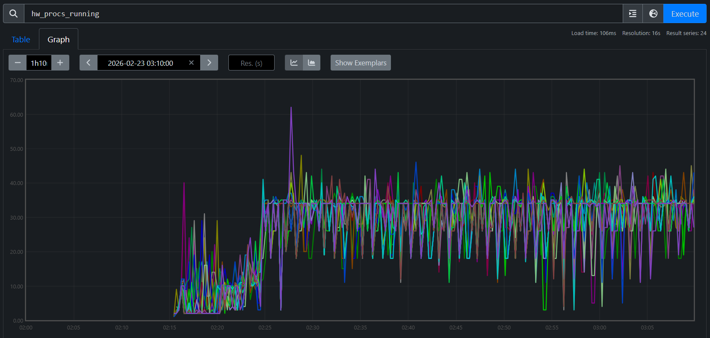

*Figure 7b. `hw_procs_running` for Job B (checkpoint restore). All 24 nodes at ~35 — about 17 more than Job A, constant throughout training.*

</div>

This is not a transient spike — the delta is flat across all 24 nodes for the entire run. Something created ~17 extra threads during restore and they never exited.

The agent then traces into code. It searches both logs for RCCL communicator initialization — Job A shows three waves during startup, while Job B shows the same three plus two extra waves created during checkpoint restore broadcast. Tracing into the Orbax source reveals why: single-replica restore uses `jax.jit` to broadcast parameters across replicas, which initializes RCCL communicators that are permanently cached in XLA's C++ layer. Their background polling threads never exit, creating constant CPU contention on every training step.

**Verified fix:** Two patches address the issue: [one](https://github.com/ROCm/maxtext/commit/5cfee461) replaces Orbax's JIT-based broadcast with a direct RCCL broadcast that explicitly destroys communicators after use, and [another](https://github.com/ROCm/maxtext/commit/caae02e3) eliminates extra XLA compilations during restore that degrade steady-state performance. With both applied, TGS nearly recovers (Figure 8):

```text
Job A (fresh):                 TGS 3,295  (baseline)
Job B (restore, no patch):     TGS 3,261  (−1.0%)
Job C (restore, with patches): TGS 3,290  (−0.15%)
```

<div align="center">

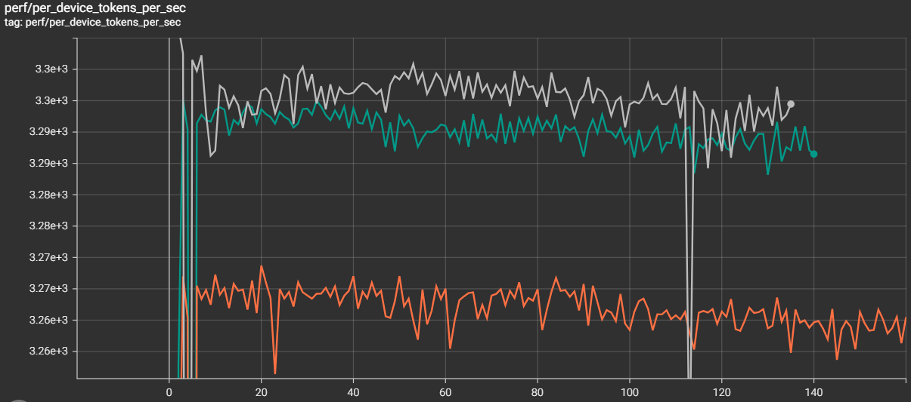

*Figure 8. After the patches, the checkpoint-restore job nearly closes the gap with the fresh start (−0.15% remaining).*

</div>

**The key insight:** this diagnosis started with the TSDB and could not have started anywhere else. The `hw_procs_running` metric — a kernel scheduler counter that most monitoring stacks don't even collect — was the only signal that distinguished two otherwise identical jobs. Without it in the same queryable store as training metrics, the ~17 leaked threads would have been invisible, and the 1% gap would have remained an unsolved mystery.

## Case Study 4: The MoE Throughput Decline — When the System Is Fine

Every diagnostic case study so far found a system-level root cause — degraded RDMA links, a buggy heartbeat mechanism, leaked threads from checkpoint restore. This one is different.

TGS for a 24-node MoE training run (192 MI355X GPUs) begins declining around step 450. No errors, no crashes — but throughput is sliding:

> Why did the TGS for job 7938 begin declining around step 450?

The agent runs the `tsdb-diagnosis` skill, systematically querying every metric family in the unified TSDB. GPU thermals: normal. GPU power: stable at ~916W. RDMA retransmits: zero. TCP retransmits: minimal. CPU contention (`hw_procs_running`): stable. I/O pressure: none. Every system-level metric comes back clean.

With all system causes ruled out, the agent turns to the training metrics — and finds the answer. The `tb_learning_moe_lb_loss` (MoE load balance loss) spiked at exactly the step where TGS began declining. The load balance loss penalty forced the MoE expert router to reorganize, producing a new routing pattern with higher per-step communication cost. The TGS decline is not a system failure — it is a mathematical property of the training dynamics. Figures 9a and 9b show the full diagnostic conversation and the TensorBoard confirmation.

<div align="center">

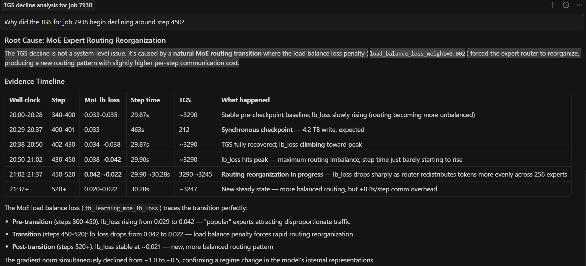

*Figure 9a. End-to-end AI diagnosis. The agent queries the unified TSDB, rules out all system-level causes, and identifies the root cause: the load balance loss penalty forced the MoE expert router to reorganize.*

</div>

<div align="center">

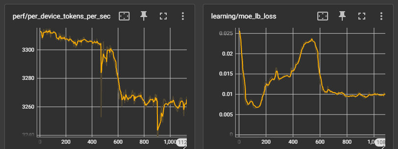

*Figure 9b. TensorBoard confirmation. The TGS decline begins at the same step where expert routing reorganized — a training-level effect, not a system-level failure.*

</div>

**The key insight:** not every throughput decline is a system problem. The agent's value here is in the *ruling out* — by systematically checking every contention source and finding them all clean, it directs attention to the training metrics where the actual cause lives. Without the unified TSDB, an engineer would spend hours checking network, GPU, and I/O by hand before even considering that the model itself changed behavior. The diagnostic framework doesn't just find system failures — it knows when to stop looking for them.

## Limitations, Failure Modes, and Operating Boundaries

The five case studies above are successful outcomes, but they were not all easy first-pass diagnoses. Several were initially hard to attribute and became solvable only after iterative TSDB analysis and correction.

- **Telemetry limits matter:** if key metrics are missing or low quality, diagnosis may stop at insufficient evidence.
- **Multi-fault incidents are harder:** concurrent issues can blur attribution and mislead branch selection in the decision tree.
- **Human verification is still required:** for high-impact actions, operators should confirm recommendations independently.

The key point is that the skill set is **continuously evolving**. When a new case appears (or an early diagnosis fails), we refine the attribution path and submit a PR to update the skill decision tree so similar future incidents can be diagnosed faster.

## Summary

Across all five case studies, the pattern is consistent: a short prompt triggers a structured diagnostic procedure that reaches an actionable conclusion in minutes. The agent profiles compute, triages logs, queries the TSDB, correlates across domains, and traces into source code — all without manual guidance. The unified TSDB is the critical enabler: because GPU, host, network, and training metrics share the same timeline and host labels, the agent can test hypotheses across domain boundaries in seconds.

These skills ship with the repo and work today. Each real incident also improves them — the RDMA-driven TGS regression added a TGS degradation diagnosis workflow, RDMA phase-correlation technique, and node exclusion prioritization table to both the triage and TSDB skills; the heartbeat false-positive refined the interpretation rules; and the checkpoint restore leak led to a new `hw_procs_running` playbook. This feedback loop means the skills get better with every production deployment.

The framework is designed to grow. The three skills shipped today cover the most common diagnostic scenarios, but adding a new skill means writing structured markdown — no code changes required. Adding a new metric source means dropping a shell script into `utils/`. See the project's [skills README](https://github.com/AMD-AGI/maxtext-slurm/blob/main/skills/README.md) and [observability docs](https://github.com/AMD-AGI/maxtext-slurm/blob/main/docs/observability.md) for contribution guidance.

Most importantly, adoption should be explicit about boundaries: diagnosis quality is bounded by telemetry quality, skill coverage, and incident complexity. Those boundaries improve over time as resolved incidents are converted into PR-based skill updates. Treat agentic diagnosis as a high-leverage copilot for incident response — fast and systematic — while keeping a human-in-the-loop for ambiguous or high-risk decisions.

We invite you to set up the agent on your own cluster, point it at your training jobs, and see what it finds.

## Additional Resources

- [MaxText-Slurm GitHub Repository](https://github.com/AMD-AGI/maxtext-slurm)
- [MaxText-Slurm: Production-Grade LLM Training with Built-In Observability](https://rocm.blogs.amd.com/software-tools-optimization/maxtext-slurm/README.html)
- [ROCm MaxText Fork](https://github.com/ROCm/maxtext)
- [Upstream MaxText GitHub Repository](https://github.com/AI-Hypercomputer/maxtext)
- [Cursor IDE](https://cursor.com/)
- [Claude Code Documentation](https://docs.anthropic.com/en/docs/claude-code)

[^1]: Upstream MaxText requires a [patch](https://github.com/ROCm/maxtext/commit/d0a9914f) to restore the original `ArrayHandler` after single-replica restore; without it, the first checkpoint save after restore fails.

## Disclaimers

Third-party content is licensed to you directly by the third party that owns the
content and is not licensed to you by AMD. ALL LINKED THIRD-PARTY CONTENT IS
PROVIDED "AS IS" WITHOUT A WARRANTY OF ANY KIND. USE OF SUCH THIRD-PARTY CONTENT
IS DONE AT YOUR SOLE DISCRETION AND UNDER NO CIRCUMSTANCES WILL AMD BE LIABLE TO
YOU FOR ANY THIRD-PARTY CONTENT. YOU ASSUME ALL RISK AND ARE SOLELY RESPONSIBLE
FOR ANY DAMAGES THAT MAY ARISE FROM YOUR USE OF THIRD-PARTY CONTENT.
