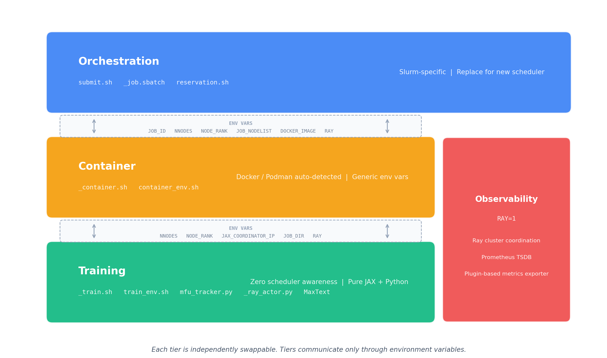
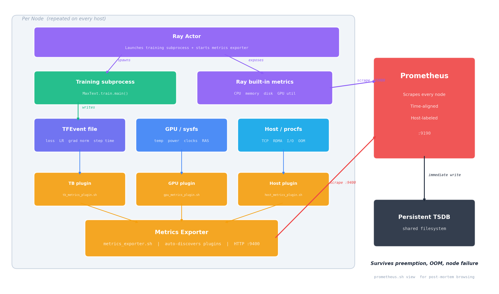
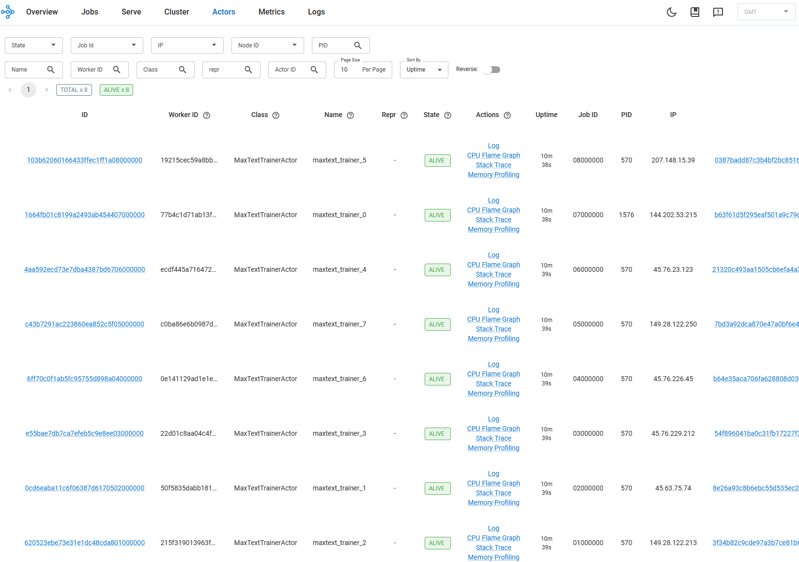
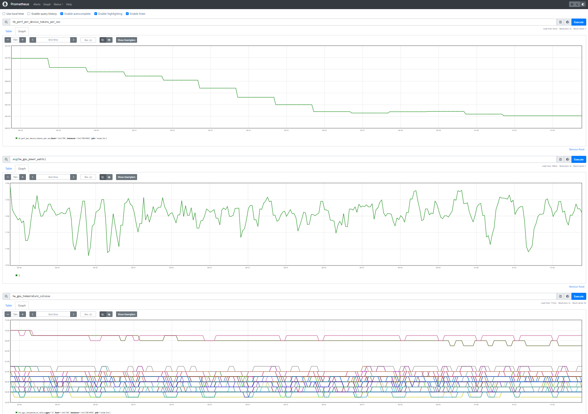
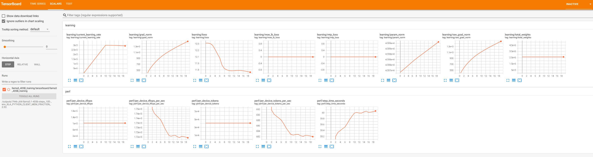
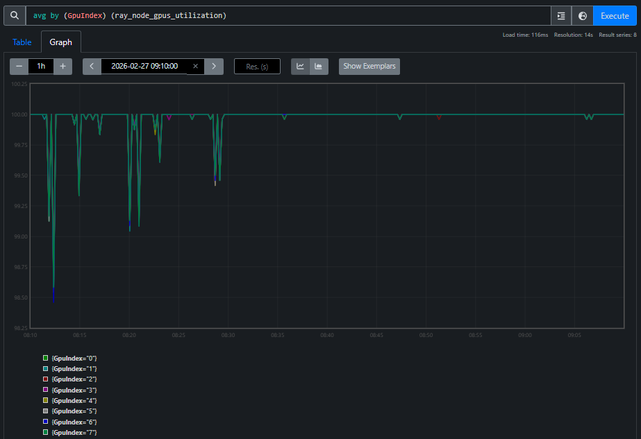
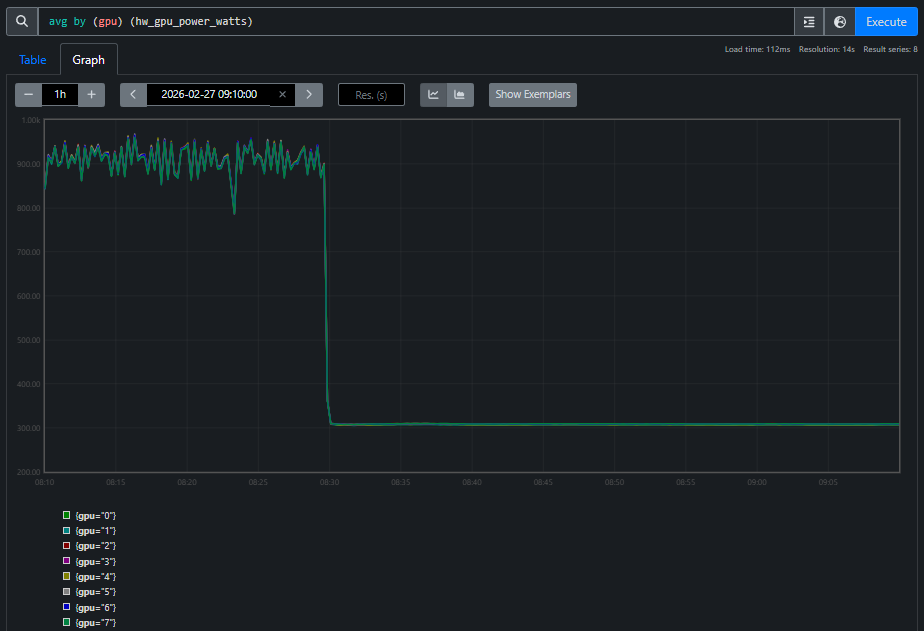

<!---
Copyright (c) 2026 Advanced Micro Devices, Inc. (AMD)

Permission is hereby granted, free of charge, to any person obtaining a copy
of this software and associated documentation files (the "Software"), to deal
in the Software without restriction, including without limitation the rights
to use, copy, modify, merge, publish, distribute, sublicense, and/or sell
copies of the Software, and to permit persons to whom the Software is
furnished to do so, subject to the following conditions:

The above copyright notice and this permission notice shall be included in all
copies or substantial portions of the Software.

THE SOFTWARE IS PROVIDED "AS IS", WITHOUT WARRANTY OF ANY KIND, EXPRESS OR
IMPLIED, INCLUDING BUT NOT LIMITED TO THE WARRANTIES OF MERCHANTABILITY,
FITNESS FOR A PARTICULAR PURPOSE AND NONINFRINGEMENT. IN NO EVENT SHALL THE
AUTHORS OR COPYRIGHT HOLDERS BE LIABLE FOR ANY CLAIM, DAMAGES OR OTHER
LIABILITY, WHETHER IN AN ACTION OF CONTRACT, TORT OR OTHERWISE, ARISING FROM,
OUT OF OR IN CONNECTION WITH THE SOFTWARE OR THE USE OR OTHER DEALINGS IN THE
SOFTWARE.
--->

# MaxText-Slurm: Production-Grade LLM Training with Built-In Observability

Training large language models (LLMs) at scale on GPU clusters is not just a compute problem — it is an operations problem. Launching multi-node distributed training, keeping it running reliably, and diagnosing failures when they happen all require tooling that most training frameworks do not provide. [MaxText-Slurm](https://github.com/AMD-AGI/maxtext-slurm) is an open-source launch system and observability stack that bridges this gap for [MaxText](https://github.com/AI-Hypercomputer/maxtext) on AMD Instinct GPU clusters managed by Slurm.

In this blog, you will learn how MaxText-Slurm turns multi-node MaxText training into a single-command workflow, how its observability stack (powered by Ray and Prometheus) provides real-time and post-mortem visibility into every layer of the system, how AI agents can leverage the unified metrics store for automated incident diagnosis, and how its layered architecture makes each component independently swappable. By the end, you will have a clear picture of the tool's capabilities and how to get started on your own cluster.

## Why MaxText on GPUs Needs Its Own Toolkit

[MaxText](https://github.com/AI-Hypercomputer/maxtext) is Google's open-source, JAX-based LLM training framework. It's a high-performance, highly scalable codebase — but it was designed primarily for **TPUs** (Google's custom AI accelerators). On TPU pods, the infrastructure handles multi-host coordination, device mesh setup, and runtime configuration natively. There's no container to manage, no NCCL socket interface to pick, and no XLA flags to tune for a specific GPU architecture.

Running MaxText on **GPU clusters** — particularly AMD Instinct GPUs managed by Slurm — is a different story. You need to:

- **Containerize the environment** — package MaxText, JAX, ROCm, and all dependencies into a Docker or Podman image, with GPU passthrough and host filesystem mounts for datasets and checkpoints.
- **Coordinate multi-node training** — JAX's distributed runtime requires a coordinator address and port that every node agrees on, and NCCL/RCCL needs the correct network interface selected consistently across all nodes.
- **Tune the runtime** — XLA compiler flags, NCCL settings, ROCm-specific environment variables, and Transformer Engine knobs all need to be set correctly. A wrong flag can silently halve throughput or cause OOM crashes.
- **Handle operational overhead** — preflight checks, stage timeouts to prevent hung nodes, core dump collection for post-mortem debugging.
- **Track what you ran** — when you're submitting dozens of experiments, you need to know exactly which code, config, and arguments each job used.

None of this is MaxText's job — it's a training framework, not a cluster operations toolkit. But without solving these problems, you can't reliably run MaxText at scale on GPUs.

**MaxText-Slurm** is a unified launch system that handles all of the above in a single command. It wraps MaxText in a layered architecture where each concern — orchestration, container setup, training configuration — is isolated in its own tier. An observability stack powered by Ray and Prometheus runs alongside, giving you real-time and post-mortem visibility into every layer of the system, from GPU thermals to training loss.

The project lives at [github.com/AMD-AGI/maxtext-slurm](https://github.com/AMD-AGI/maxtext-slurm). Figure 1, below, illustrates this layered architecture and how the observability stack fits alongside the three tiers.

<div align="center">



*Figure 1. MaxText-Slurm layered architecture. Three independently swappable tiers — Orchestration, Container, and Training — communicate only through environment variables. The Observability stack (RAY=1) runs alongside, powered by Ray and a plugin-based Prometheus metrics exporter.*

</div>

## The Problem: Distributed Training Is a Black Box

If you've ever run a multi-node training job and had it silently hang at step 4,000, you know the pain. Standard tools — job logs, TensorBoard, GPU traces — cover the *training* side well. But long-running jobs at scale fail in ways those sources can't diagnose:

| Failure Mode | What Happens | Why Standard Tools Miss It |
|-------------|-------------|---------------------------|
| **NCCL/RCCL hangs** | Collective operations block indefinitely | No Python traceback is generated — the process simply stalls |
| **GPU thermal throttling** | Clocks drop and step time increases | Nothing crashes, so no error is logged |
| **Network degradation** | TCP retransmits or RDMA errors erode throughput | The training loop continues, just slower |
| **NFS latency spikes** | Checkpoint saves balloon from seconds to minutes | From the job's perspective, the save "succeeded" |
| **Silent performance regressions** | MFU drifts down over hours or days | No single event to alert on — only a slow trend |

These are *system-level* issues, and diagnosing them requires a different class of metrics — collected, persisted, and correlated alongside training metrics in a single queryable store. Without unified observability, each failure mode appears in a different tool (or not at all), making root-cause analysis a needle-in-a-haystack exercise across scattered log files and disjointed monitoring systems.

## One Command to Launch, One Flag to Observe

MaxText-Slurm keeps the simple case simple. Clone the repo onto a Slurm cluster and run:

```bash
submit.sh 70b -N 8            # Train llama2-70b on 8 nodes
```

Model short names (`70b`, `mixtral`, `grok`, etc.) resolve to config files automatically. MaxText arguments go after `--`:

```bash
submit.sh 70b -N 8 -- remat_policy=full per_device_batch_size=2
```

For local development without Slurm:

```bash
run_local.sh 70b -- steps=10
```

And to activate the full observability stack, just set one environment variable:

```bash
RAY=1 submit.sh 70b -N 8
```

That's it. `RAY=0` (the default) is a plain job launcher with zero overhead — best for short benchmarks. `RAY=1` collects GPU, host, network, and training metrics into a unified Prometheus time-series database, with **zero steady-state throughput impact** (training runs in a subprocess with no GIL sharing — see below).

## How Ray Powers the Observability Stack

[Ray](https://www.ray.io/) is a framework for scaling AI workloads, but MaxText-Slurm uses it in a deliberately lightweight way — not as a training orchestrator, but as the *observability backbone*.

When `RAY=1` is set, the system bootstraps a Ray cluster across all nodes, starts Prometheus for metrics collection and TensorBoard for training curves, then launches training. Ray is installed inside the container at startup — no cluster-wide pre-installation required, making the entire stack fully self-contained. Figure 2 details this per-node data flow, showing how training, metrics collection, and Prometheus scraping fit together.

<div align="center">



*Figure 2. Observability data flow (per node). The Ray Actor spawns the training subprocess and exposes Ray's built-in metrics. Training writes a TFEvent file; three auto-discovered plugins collect training, GPU, and host metrics into the Metrics Exporter. Prometheus scrapes both the exporter (:9400) and Ray's native endpoint (:55080), writing immediately to a persistent TSDB on the shared filesystem.*

</div>

### Subprocess Isolation: Zero-Overhead Ray

Running training directly inside a Ray actor causes measurable throughput degradation — Ray's internal threads contend with JAX's training loop for Python's GIL. MaxText-Slurm solves this by running training in a **subprocess**. The Ray actor is a thin launcher that spawns the training process in its own Python interpreter with zero Ray threads. It handles node placement, log streaming, and exit code collection — nothing more.

The result: `RAY=1` has no measurable steady-state overhead on training steps. The observability system is deliberately designed and carefully implemented to minimize performance impact. The TGS difference between `RAY=1` and `RAY=0` does not exhibit any consistent systematic bias — in some runs, `RAY=1` even produces slightly higher TGS. We have repeatedly validated this on clusters of up to 48 nodes (384 AMD Instinct MI355X GPUs) running 400B+ Mixture of Experts (MoE) model training for over 1 trillion tokens, and users can reproduce these results on their own clusters.

The only added cost is startup time for the Ray cluster and Prometheus — negligible for production runs, but noticeable for quick benchmarks (where you'd use `RAY=0` anyway).

## Three Live Dashboards

When `RAY=1` is active, three web dashboards become available via SSH tunnel:

| Dashboard | What It Shows | Port |
|-----------|--------------|------|
| **Ray Dashboard** | Actor status, live stack traces, CPU flame graphs | 8265 |
| **Prometheus** | GPU thermals, power, clocks, VRAM, RAS errors, TCP retransmits, RDMA counters, training scalars | 9190 |
| **TensorBoard** | Training loss curves, learning rate schedules | 6006 |

The job output prints ready-to-copy SSH tunnel commands (the Prometheus port defaults to 9190 but auto-increments if occupied — the log shows the actual port). Set up the tunnel, open `http://localhost:<port>` in your browser, and you're in.

The **Ray Dashboard** is especially useful for identifying which node is lagging or has crashed — its live stack trace and flame graph features let you inspect what each process is doing in real time. Figures 3a, 3b, and 3c below show each of these dashboards during a live training run.

<div align="center">



*Figure 3a. Ray Dashboard showing per-node actor status and live stack traces during an 8-node training run.*

</div>

<div align="center">



*Figure 3b. Prometheus UI showing training throughput (`tb_perf_per_device_tokens_per_sec`), average GPU power (`hw_gpu_power_watts`), and GPU temperature (`hw_gpu_temperature_celsius`) — three metric families from different sources, time-aligned in a single view.*

</div>

<div align="center">



*Figure 3c. TensorBoard remains available as a dedicated training dashboard. Key scalars (loss, learning rate, throughput) are also bridged into Prometheus via the TFEvent plugin, so they appear alongside system metrics in Figure 3b.*

</div>

## Prometheus: The Unified Metrics Store

Prometheus is where the real power lives. Rather than scattering metrics across separate tools, MaxText-Slurm feeds *everything* into a single Prometheus TSDB:

- **Ray built-in metrics** — host memory, CPU, disk, GPU utilization
- **GPU hardware metrics** — temperature, power draw, clock speeds, VRAM usage, RAS errors, PCIe AER errors
- **Host/network metrics** — TCP retransmit rates, RDMA counters, I/O and scheduling pressure, OOM kills
- **Training scalars** — loss, learning rate, gradient norms, throughput, step time (bridged from TensorBoard event files)

The TSDB is written directly to persistent storage on the shared filesystem. Each scrape writes immediately, so **no data is lost if the job terminates unexpectedly** — whether from preemption, OOM, or node failure.

### Why a Unified TSDB Matters

Training anomalies rarely stay in one domain. GPU thermal throttling reduces clock speeds, which slows step time, which triggers gradient norm spikes. In siloed monitoring systems, each symptom appears in a different tool. With all signals in one TSDB — time-aligned, consistently labeled by host — you can trace the causal chain in a single view:

```promql
# Step time spikes — which steps took abnormally long?
tb_perf_step_time_seconds > 2 * avg_over_time(tb_perf_step_time_seconds[30m])

# At the same wall-clock time, check system-level contention sources:
hw_gpu_temperature_celsius{host="node001"}            # Thermal throttling?
rate(hw_tcp_retransmits_total{host="node001"}[5m])    # Network issues?
hw_procs_running{host="node001"}                      # CPU contention?
hw_io_pressure_full_pct{host="node001"}               # Storage stalls?
```

Because training scalars (`tb_*`) and system metrics (`hw_*`) share the same timeline and host labels, you can query any metric family at the timestamp of an observed anomaly. A concrete example: step time spikes at 14:32 on node001 → query `hw_gpu_temperature_celsius` at the same timestamp → GPU hit 95°C and throttled clocks → root cause identified in one query, not hours of log-diving across scattered tools.

## Extensible Metrics via Plugins

The metrics collection system is designed to be **open-ended**. A lightweight exporter automatically discovers and runs any `*_metrics_plugin.sh` script in the `utils/` directory — no registration or configuration changes needed. Three plugins ship out of the box:

| Plugin | What It Collects |
|--------|-----------------|
| **GPU metrics** | Temperature, power, clocks, VRAM, RAS errors, PCIe AER errors (from AMD sysfs) |
| **Host metrics** | TCP retransmits, RDMA counters, I/O pressure, scheduling pressure, OOM kills (from procfs/sysfs) |
| **TensorBoard metrics** | Loss, learning rate, gradient norms, throughput, step time (from TFEvent files) |

Adding a new metric source — say, InfiniBand error counters or filesystem I/O latency — means writing a single shell script that outputs Prometheus exposition text to stdout. Drop it in `utils/`, name it `*_metrics_plugin.sh`, and the exporter picks it up on the next poll cycle — no registration, no configuration changes, no restart. The full plugin contract and data flow are visible in Figure 2.

The observability pipeline itself is vendor-neutral: swapping GPU vendors (AMD → NVIDIA) only requires a new GPU metrics plugin — the exporter, Prometheus pipeline, and TSDB are unchanged. See the project's [observability docs](https://github.com/AMD-AGI/maxtext-slurm/blob/main/docs/observability.md) for the plugin authoring guide and the full list of exported metrics.

## Post-Run Diagnostics

Every `RAY=1` job writes a structured output directory to the shared filesystem — Prometheus TSDB, Ray session logs, training outputs, and core dumps (if any). This means you can diagnose failures *after the fact*:

- **Prometheus TSDB** — all GPU, host, and training metrics, browsable via `utils/prometheus.sh view`.
- **Ray session logs** — low-level failures (NCCL hangs, C++ fatal errors, OOM kills) that never reach Python-level tracebacks.
- **Core dumps** — automatically captured when a training process crashes, with the container waiting for writes to finish before exiting.

```bash
$JOB_WORKSPACE/
  12345-JAX-llama2-70b.log                    # Job log (stdout + stderr)
  12345-JAX-llama2-70b/
    artifact -> ...                           # Immutable repo snapshot at submit time
    log -> ../12345-JAX-llama2-70b.log        # Symlink to the job log
    prometheus/                               # Prometheus TSDB (browsable post-mortem)
      prometheus.log                          # Prometheus process log
    ray_logs/
      node001/session_*/logs/                 # Head node: raylet, GCS, dashboard, worker logs
      node002/session_*/logs/                 # Worker node logs
    metrics_exporter/                         # Exporter logs (one per node)
      node001.log
      node002.log
```

To browse the TSDB after the job ends — no live cluster required:

```bash
utils/prometheus.sh list                                          # List jobs with saved metrics
utils/prometheus.sh view outputs/12345-JAX-llama2-70b/prometheus  # Browse on localhost:9190
```

## Agentic Workflows

The unified TSDB and self-contained output directories are not just for human operators — they are the foundation for AI-assisted diagnosis. Each job's outputs (TSDB, logs, artifacts) live in a single directory with no external dependencies, so an AI agent can inspect, compare, and reason about jobs without manual data gathering.

MaxText-Slurm ships a [`skills/`](https://github.com/AMD-AGI/maxtext-slurm/tree/main/skills) directory containing structured instructions that AI agents — such as [Cursor](https://cursor.com/) and [Claude Code](https://docs.anthropic.com/en/docs/claude-code) — read and execute autonomously. Each skill encodes the methodology of senior systems engineers — not just what commands to run, but how to interpret results, distinguish symptoms from root causes, and trace causal chains across the full stack. The agent autonomously follows each skill's workflow end-to-end, using tool access (shell, file system, HTTP) to query Prometheus, parse results, and decide which investigation path to follow:

- **`performance-analysis`** — measuring training throughput, collecting and interpreting XLA traces (xplane) and HLO dumps using TraceLens and IRLens.
- **`job-log-triage`** — classifying job failures (hangs, OOM, NCCL timeouts, heartbeat false positives), projecting training progress, and recommending next steps.
- **`tsdb-diagnosis`** — incident root-cause analysis using the unified Prometheus TSDB. Correlates GPU, host, network, and training metrics to trace anomalies from symptom to root cause — turning the TSDB from a passive data store into an active diagnostic tool.

### Example: Diagnosing an RCCL Hang

A 24-node training run (192 MI355X GPUs) completes 3,841 steps over 35 hours, then stops making progress. The user prompts:

> triage 7877

The agent reads the log, classifies it as a **hang**, and automatically queries the Prometheus TSDB. GPU utilization reports 100% on all GPUs — a monitoring dashboard would say "job healthy." But GPU power tells a different story, as shown in Figures 4a and 4b:

<div align="center">



*Figure 4a. GPU utilization during the hang. All 8 GPU indices report 100% across 24 nodes.*

</div>

<div align="center">



*Figure 4b. GPU power during the same window. All GPUs draw standby power (~300W), far below the ~900W during active training. Every GPU reporting "100% utilized" is doing zero useful work — spinning in the RCCL busy-wait loop.*

</div>

The agent correlates these two views and concludes: **RCCL collective deadlock**. Utilization alone is misleading — power tells the real story. This is the kind of cross-domain reasoning that a unified TSDB makes possible: the agent crosses domain boundaries (training metrics → GPU hardware → network) to reach a conclusion that no single-domain tool could provide.

The AI skill framework is extensible. See the project's [skills README](https://github.com/AMD-AGI/maxtext-slurm/blob/main/skills/README.md) for the full list currently supported, and we will keep adding more skills.

## Layered Architecture

As shown in Figure 1, MaxText-Slurm is designed so that each component can be adapted independently:

| Component | What It Does | Swappable? |
|-----------|-------------|------------|
| **Orchestration** | Job submission and scheduling | Replace for Kubernetes, etc. — everything below runs unmodified |
| **Container** | Environment isolation and GPU passthrough | Docker and Podman auto-detected; native execution possible |
| **Training** | Framework configuration and launch | Swap MaxText for another JAX framework with minimal changes |
| **Observability** | Metrics collection, dashboards, post-mortem diagnostics | Plugin-based; add new metric sources without configuration changes |

The three tiers communicate through environment variables, never reaching across layers. Observability runs alongside, activated by `RAY=1`, and is itself scheduler-agnostic. Swapping the scheduler, container runtime, training framework, or even GPU vendor is a localized change. See the project's [architecture](https://github.com/AMD-AGI/maxtext-slurm/blob/main/docs/architecture.md) and [extensibility](https://github.com/AMD-AGI/maxtext-slurm/blob/main/docs/extensibility.md) docs for the details.

## Other Notable Features

- **Artifact system** — each submission creates an immutable snapshot of the repository, enabling rapid multi-submit and full traceability.
- **Preflight checks** — each node cleans up stale GPU processes, prunes old containers, and tunes system settings before training starts.
- **Telegram notifications** — push notifications for job state changes and hang detection, independent of `RAY=1`.

## Future Work

MaxText-Slurm's layered architecture was designed from the start to make the orchestration tier swappable — and several extensions are planned or under active development:

- **Kubernetes orchestration** — the current system targets Slurm, but the container, training, and observability components are scheduler-agnostic by design. Adding a Kubernetes backend means writing a new orchestration tier (replacing `_job.sbatch` and `submit.sh` with Kubernetes Job or [JobSet](https://github.com/kubernetes-sigs/jobset) manifests) while the rest of the stack — container setup, training launch, observability, and metrics plugins — runs unmodified. This will bring MaxText-Slurm's single-command launch and full observability stack to cloud-native GPU clusters.
- **Expanded model coverage** — adding pre-validated configs for additional model families beyond the current set (LLaMA, Mixtral, Grok, etc.), including emerging architectures and larger parameter counts.
- **Enhanced fault tolerance** — automatic detection and recovery from common failure modes such as single-node GPU errors or NCCL timeouts, enabling long-running jobs to self-heal without operator intervention.
- **Richer AI skills** — existing skills are continuously refined as they are exercised on real production incidents, and new skills will expand the framework's coverage to include automated performance regression detection, capacity planning recommendations, and guided migration workflows for teams moving from other training frameworks to MaxText. The follow-up blog post [Agentic Diagnosis for LLM Training at Scale](https://rocm.blogs.amd.com/software-tools-optimization/maxtext-slurm-agentic-diagnosis/README.html) demonstrates end-to-end agentic diagnosis on real production incidents using the unified TSDB.

MaxText-Slurm is actively maintained by AMD, with a commitment to ongoing support including:

- **New API compatibility** — updates to track upstream changes in JAX, MaxText, Ray, and ROCm APIs as they evolve.
- **Future software releases** — validation and compatibility testing against new versions of the ROCm stack, container runtimes, and Slurm.
- **New hardware platforms** — support for upcoming AMD Instinct GPU generations as they become available.

Contributions are welcome — see the [contributing guide](https://github.com/AMD-AGI/maxtext-slurm/blob/main/CONTRIBUTING.md) for how to get involved.

## Getting Started

1. Clone the repo onto a Slurm-managed GPU cluster.
2. Run `submit.sh 70b -N 1` for a basic training run.
3. Run `RAY=1 submit.sh 70b -N 1` to enable full observability.
4. SSH-tunnel into the dashboards and explore your metrics.
5. After the job ends, browse the persisted TSDB with `utils/prometheus.sh view`.

For the full details — submission options, environment configuration, model configs, debugging recipes, and more — see the [project README](https://github.com/AMD-AGI/maxtext-slurm/blob/main/README.md) and the `docs/` directory.

## Summary

In this blog, you explored how MaxText-Slurm transforms multi-node LLM training on AMD GPUs from a fragile, manually orchestrated process into a streamlined, observable workflow. By unifying launch automation, runtime observability, and post-mortem diagnostics into a single tool, MaxText-Slurm addresses the operational challenges that standard training frameworks leave unsolved — from NCCL/RCCL hangs and GPU thermal throttling to silent performance regressions.

The key architectural insight is the separation of concerns across three independently swappable tiers — orchestration, container, and training — so that replacing the scheduler, container runtime, or training framework is a localized change. The observability stack, powered by Ray and a plugin-based Prometheus metrics exporter, runs alongside with no measurable steady-state overhead on training steps, and the persisted TSDB ensures that no data is lost even if a job terminates unexpectedly. The AI skill framework takes this further — turning the unified TSDB into the foundation for machine-driven incident diagnosis, where AI agents can systematically trace anomalies from symptom to root cause across the entire system stack.

Whether you are running short benchmarks or week-long production training runs, MaxText-Slurm provides the tooling needed to launch confidently, monitor in real time, and diagnose after the fact — with or without human intervention. We invite you to try the project on your own AMD GPU cluster and explore the [full documentation](https://github.com/AMD-AGI/maxtext-slurm).

## Additional Resources

- [MaxText-Slurm GitHub Repository](https://github.com/AMD-AGI/maxtext-slurm)
- [Agentic Diagnosis for LLM Training at Scale](https://rocm.blogs.amd.com/software-tools-optimization/maxtext-slurm-agentic-diagnosis/README.html) — follow-up post on agentic diagnostic skills and case studies
- [ROCm MaxText Fork](https://github.com/ROCm/maxtext)
- [Upstream MaxText GitHub Repository](https://github.com/AI-Hypercomputer/maxtext)
- [Ray Documentation](https://docs.ray.io/)
- [Prometheus Documentation](https://prometheus.io/docs/)

## Disclaimers

Third-party content is licensed to you directly by the third party that owns the
content and is not licensed to you by AMD. ALL LINKED THIRD-PARTY CONTENT IS
PROVIDED "AS IS" WITHOUT A WARRANTY OF ANY KIND. USE OF SUCH THIRD-PARTY CONTENT
IS DONE AT YOUR SOLE DISCRETION AND UNDER NO CIRCUMSTANCES WILL AMD BE LIABLE TO
YOU FOR ANY THIRD-PARTY CONTENT. YOU ASSUME ALL RISK AND ARE SOLELY RESPONSIBLE
FOR ANY DAMAGES THAT MAY ARISE FROM YOUR USE OF THIRD-PARTY CONTENT.
