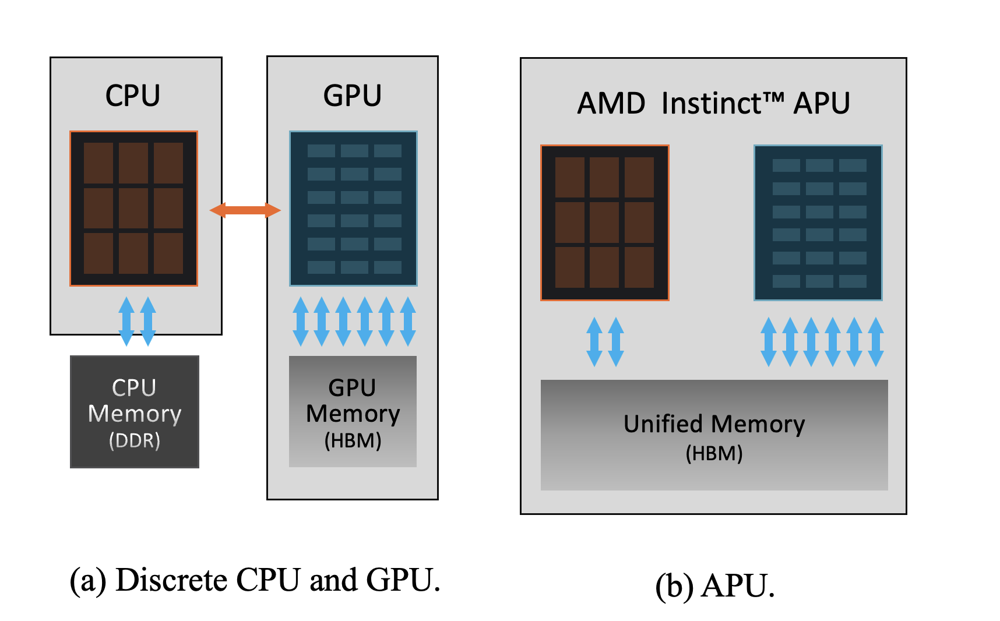
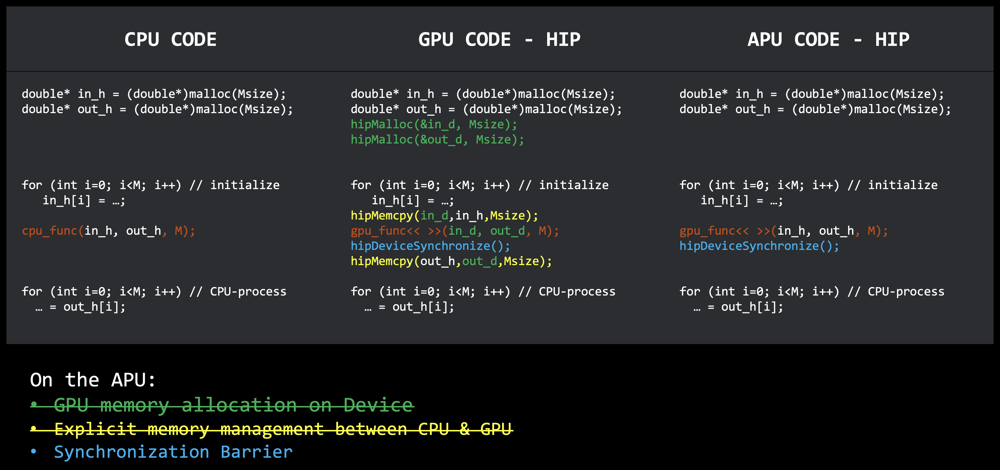
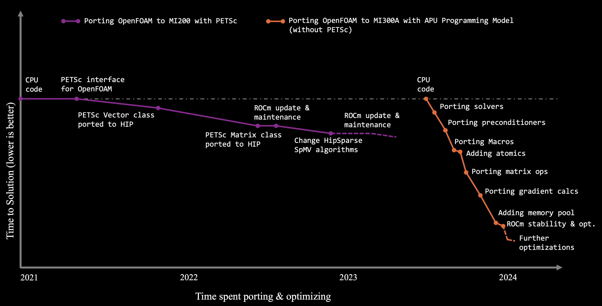
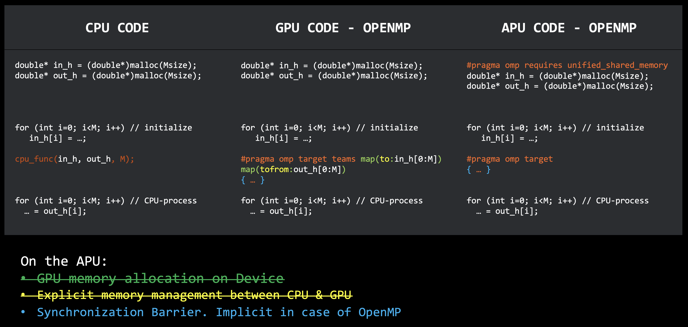

# MI300A - Exploring the APU advantage

This blog post will introduce you to the advantages of AMD Instinct™; [MI300A][1] accelerated processing unit (APU),
discussing the hardware architecture and how to leverage its GPU programming capabilities.

We will discuss the main technical gains of the MI300A’s shared physical memory architecture and its programming advantages.
We will then show you how AMD [ROCm™;][12] enables the APU Programming Model and how to handle its memory allocations.
We will demonstrate how you can implement the APU Programming Model following different offloading strategies, using
[HIP][25] API, [OpenMP™;][33], and by exploring other abstraction layers.

Let's start exploring the efficiency, flexibility, and programmability advantages of the MI300A APU!

## The MI300A APU’s shared physical memory architecture

In [MI300A][1] - the AMD ["Zen"][2] [4 EPYC™;][3] cores and third generation [CDNA™;][4] compute units share the
same high-bandwidth memory (HBM). The MI300A implements the unified memory model by copackaging the CPU and GPU cores and
directly attaching the CPU cores to the GPU's infinity fabric memory architecture. Figure 1 shows schematic representations
of a socket with an APU versus a discrete system like the [MI200][5]. The unified memory architecture of the MI300A provided by
its innovative design creates a paradigm shift in GPU programming, where application developers can accelerate complex regions
of the code on the device
with relative ease.

<!-- 
================
 ### Figure 1
================ -->



<p style="text-align:center">
Figure 1: Schematic representation of a socket with a discrete CPU and GPU, and a socket with APU.
</p>

Since the CPU cores of the MI300A are directly attached to the Infinity Fabric memory architecture,
there's no distinction between host and device memory spaces (see the section about architecture memory in [6] for further details).
This is conceptually demonstrated with the help of a pseudocode in Figure 2,
where in order to accelerate the CPU program on discrete GPUs, memory must be allocated on the device (green), and the
data must be copied and managed between the host and the device (yellow), both before and after the computation. In contrast
on the MI300A, separate host and device memory allocations are not required. All data resides in the HBM memory and
is directly accessible to the GPU (XCD) and the CPU (CCD) cores. The pseudocode for the APU in Figure 2 depicts
and will be referred to as the *APU Programming Model*.

<!-- 
================
 ### Figure 2
================ -->



<p style="text-align:center">
Figure 2: Pseudocode to demonstrate the ease of accelerating a CPU algorithm on the APU
</p>

## Advantages of the APU programming model

1. **Eliminates the complexity of heterogeneous memory management**: The physically shared HBM on the APU gives the compute units on the device immediate
access to the data allocated by the host with data coherency between them. This allows you to omit device buffer allocations
and copying data, which results in the reduction of overheads associated with data
management. In addition, the lower memory footprint allows for a larger problem size to be processed on the APU.

2. **Enables offloading of complex code regions**: The ease of data management enables programmers to accelerate regions of code
with complex object-oriented programming (including encapsulated data, user-defined data structures, etc.).
This is especially useful when targeting production-level codes that have been heavily optimized for the CPUs and
reduces the overall time needed to port such complex codes to the GPUs.
  
3. **Reuse same code**: Maintaining large GPU codes is challenging for most programmers, primarily due to
the need to constantly check and maintain two separate code paths (host and device). On the contrary, with majority of the
data management out of the way, the APU programming model makes it easier to maintain the code and have a unified codebase.
This is especially true with OpenMP offloading (more on this in a [later section](#directive-based-offloading-with-openmp)).

4. **Portability across hardware**: Apart from memory management, ensuring code compatibility and portability between different hardware also
takes a big chunk of the maintenance effort. The [managed memory][7] support in devices like the [MI200][5] and [MI300X][8] makes it easier
for codes with the APU programming model to run on these discrete cards. However, page migrations can affect the performance
(for more details on how the effects of page migration can be handled, refer to [How ROCm enables the APU programming model](#how-rocm-enables-the-apu-programming-model)).

The APU Programming Model reduces the entry barrier and encourages programmers to adopt GPU acceleration for their code, where they
can focus on porting and optimizing the compute kernels without worrying about the tedious memory and data management tasks.
<!-- 
================
 ### Figure 3
================ -->



<p style="text-align:center">
Figure 3: Porting strategies for OpenFOAM HPC Motorbike using PETSc and APU Programming Model
</p>

[OpenFOAM&reg;][9], a C++ library for computational fluid dynamics (CFD), is an early adopter of the APU programming model.
Figure 3 illustrates the use of two porting strategies -- one using a third-party library [PETSc][10] with HIP support for
offloading computations on discrete GPUs like MI200, and second, using the APU Programming Model on MI300A.
From the figure you can observe that a significantly large amount of time and effort was spent in enabling HIP support for PETSc before OpenFOAM benchmarks could
run on Instinct MI200. In comparison, the APU programming model needed a fraction of the effort (with less
than 200 lines of OpenMP target offloading as cited in the [ISC paper][11]) to port to MI300A.
The dependency on third-party libraries was eliminated, and OpenFOAM code could be directly ported. This allowed for incremental porting of various sections, including complex matrix operators and macros, resulting in significant speedups.
  
## How ROCm enables the APU programming model

[ROCm™;][12] is an open software stack including drivers, development tools, and APIs
that enable GPU programming from low-level kernel to end-user applications. [ROCm 6.0][13] and newer releases
have support for MI300A architecture ([`gfx942`][14]). To understand how the APU Programming Model is enabled
by ROCm, let's take a quick look at GPU memory allocations and how they are handled.

### GPU memory

In an application, allocated memory can be categorized as - pageable, pinned, or managed.

- **Pageable memory** is allocated when using system allocators such as [`malloc`][15] and [`new`][16].
It exists on “pages” (blocks of memory), which can be migrated to other memory storage.

- **Pinned memory** (or page-locked memory, or non-pageable memory) is host memory that is mapped into the address
space of all GPUs, allowing the pointer to be used on the host as well as the device. In conventional GPU programming using
discrete systems, pinned memory is used to improve transfer times between the host and the device with [`hipMemcpy`][17] or
[`hipMemcpyAsync`][18].

- **Managed Memory** refers to universally addressable, or unified memory available since the MI200 series of GPUs.
Much like pinned memory, [managed memory][21] shares a pointer between the host and the device and (by default) supports fine-grained
coherence. However, managed memory can also automatically migrate pages between the host and the device. The allocation will
be managed by the AMD GPU driver using the Linux [HMM (Heterogeneous Memory Management)][19] mechanism.
  
For more details about page migration please refer to the [MI200 GPU memory space overview][20] blog post.

### Translation Not-Acknowledged (XNACK) on the APU

[XNACK][22] describes the GPU's ability to retry memory accesses that failed due to a page fault (which normally would lead
to a memory access error), and instead retrieve the missing page. This also affects memory allocated by the system as
indicated by the following table:

|API              | Data Location | Host After Device Access | Device After Host Access |
|-----------------| ------------- | -----------              | -------------            |
| System allocated| Host          | Migrate page to host     | Migrate page to device   |
|`hipMallocManaged`| Host         | Migrate page to host     | Migrate page to device   |
|`hipMalloc`      | Device        | Zero-copy                | Local Access             |

Where "Zero-copy" means no extra allocation or movement of data.
With the shared HBM on MI300A, all types of memory allocations are pinned in the same memory space, allowing the data to be
seamlessly accessed by both the host and device components. In this system, physical page migration is neither needed nor useful, however,
handling page-faults via XNACK is still necessary. Thus, applications implementing the APU programming model and relying
on unified memory must be compiled on an XNACK-enabled system.

To check if page migration is available on a platform, use [`rocminfo`][23]:

```bash
$ rocminfo | grep xnack
      Name:                    amdgcn-amd-amdhsa--gfx942:sramecc+:xnack-
```

Here, `xnack-` means that XNACK is available but is disabled by default. XNACK can be enabled for an entire system using
a kernel boot parameter [`noretry`][24]. It can also be enabled for a single application by setting the environment variable
`HSA_XNACK=1`. At compile-time, setting the `--offload-arch=` option with `xnack+` or `xnack-` forces code to
be only run with XNACK enabled or disabled respectively:

```bash
# Compiled kernels will run regardless if XNACK is enabled or is disabled. 
hipcc --offload-arch=gfx942

# Compiled kernels will only be run if XNACK is enabled with XNACK=1.
hipcc --offload-arch=gfx942:xnack+

# Compiled kernels will only be run if XNACK is disabled with XNACK=0.
hipcc --offload-arch=gfx942:xnack-
```

## Offloading strategies supporting the APU programming model

Programmers can implement the APU programming model in their application and utilize an array of
offloading strategies, including:

### HIP Runtime and HIP C++

[HIP][25] API is a C++ runtime API and kernel language that lets developers create portable applications for AMD and
NVIDIA GPUs from single source code. A simple vector add example is shown that accelerates the `add` kernel
on the APU, where the buffers `A` and `B` allocated on the host are passed to the device kernel.

```cpp
#include <iostream>
#include <hip/hip_runtime.h>

...

int main()
{
  double *A = new (std::align_val_t(128)) double[N];
  double *B = new (std::align_val_t(128)) double[N];
  double *C = new (std::align_val_t(128)) double[N];

  // initialize the data in the
  for (auto i=0; i<N; i++)
  {
    A[i] = 1.1; 
    B[i] = i / 1.3;
  }

  ...
  //call the gpu kernel with host data
  add<<<grid,block,0,0>>>(A, B, C, WIDTH, HEIGHT);
  //block host threads till tasks on the device are completed
  hipDeviceSynchronize();

  ...
  // free data allocations
  delete[] A;
  delete[] B;
  delete[] C;
}
```

Full source code is provided [here][26] for reference. Before compiling the code ensure that `HSA_XNACK=1` is setup
in the environment, and then compile with `hipcc` and provide the architecture for MI300A to [`--offload-arch=`][27]:

```bash
hipcc -O3 --offload-arch=gfx942 -o <exec-name> vecAdd_hip.cpp
```

> NOTE: The same code can be compiled on the MI200 by changing the architecture to `gfx90a`, however,
> the managed memory support will initiate page migrations that will affect the performance.

Applications using [parallel algorithms][28] from [C++ Standard Library algorithms][29] can take advantage
of multi-core architectures and seamlessly offload to AMD accelerators, including MI300A, using [HIPSTDPAR][30],
by changing a few compiler flags. For more details, see the [C++17 parallel algorithms and HIPSTDPAR][31] blog.

Furthermore, applications written in other languages such as Fortran and Python can also leverage acceleration
through HIP by implementing an interface to C, for example, [C-interfaces for Fortran][32]. These techniques will be
covered in greater detail in a follow-up post.

### Directive-based offloading with OpenMP

Many HPC applications also use directive-based approaches with [OpenMP™;][33] to parallelize regions of code.
With [OpenMP 4.0][34], [target-based offloading][35] has enabled programmers to accelerate code on GPUs. On the
APU, the [unified shared memory][36] support in AMD [ROCm][12]; and unified physically shared HBM allows OpenMP
to support the APU programming model, where the developers do not have to worry about the complexity of data management.
Figure 4 shows pseudocode, where the [`map`][37] clause that defines data copy between the host and device is
not needed as the [OpenMP runtime][38] is aware that these can be omitted on the APU as long as [unified shared memory][39]
is enabled either by adding `#pragma omp requires unified_shared_memory` to the source file, or the code is
compiled with `-fopenmp-force-usm`.

<!-- 
================
 ### Figure 4
================ -->



<p style="text-align:center">
Figure 4: Pseudocode for accelerating code with OpenMP on the APU
</p>

The vector add example shown before can be accelerated with OpenMP, where the `add` kernel has been replaced by a
`parallel for` loop, and `#pragma omp target` accelerates this region on the compute units of the APU.
The full source code can be found [here][40], and can be compiled with `clang++` compiler
packaged with AMD [ROCm][12]; using `-fopenmp --offload-arch=gfx942` flags.

```cpp
#include <iostream>
#include <omp.h>
#pragma omp requires unified_shared_memory

constexpr int N       = (1024*1024);

int main()
{
  double *A = new (std::align_val_t(128)) double[N];
  double *B = new (std::align_val_t(128)) double[N];
  double *C = new (std::align_val_t(128)) double[N];

  // initialize the data in the
  #pragma omp target teams distribute parallel for
  for (auto i=0; i<N; i++)
  {
    A[i] = 1.1;
    B[i] = i / 1.3;
  }

  //add vector elements
  #pragma omp target teams distribute parallel for
  for (int i=0; i<N; i++)
  {
        C[i] = A[i] + B[i];
  }

  ...
  delete[] A;
  delete[] B;
  delete[] C;
}
```

> NOTE: Similar to the HIP example, the managed memory support on MI200 allows the OpenMP code to
> be compiled by changing the architecture to `gfx90a`, however, the resulting page migrations on
> MI200 can affect the performance.

AMD's [next-generation Fortran compiler][41], provides support for Fortran-based applications,
and developers can use target offloading with the APU programming model.

### Other abstractions

Acceleration on AMD Instinct™; GPUs is also available through other abstraction layers, like
[Kokkos][42], [Raja][43], [SYCL][44], and numerical libraries like [PETSc][10], [Gingko][45],
[OCCA][46]. However, the level of support for the APU programming model is at the discretion
of the developers and users, and advised to read their respective user manuals for details.

## Summary

In this introductory blog post, you have conceptualized the APU programming model and its advantages:

- It reduces the complexities around data and memory management.
- Allows incremental offloading, which is beneficial for an evolving code base.
- Provides a cleaner code that is much easier to maintain.
- Supports backward portability with previous-generation MI200 GPUs.

In addition, this post also highlights how AMD ROCm; software stack supports the APU programming model
and illustrates accelerating a simple benchmark using HIP and OpenMP target offloading.

[1]: https://www.amd.com/en/products/accelerators/instinct/mi300/mi300a.html
[2]: https://www.amd.com/en/technologies/zen-core.html
[3]: https://www.amd.com/en/products/processors/server/epyc/4th-generation-9004-and-8004-series.html
[4]: https://www.amd.com/en/technologies/cdna.html
[5]: https://www.amd.com/en/products/accelerators/instinct/mi200.html
[6]: https://www.amd.com/content/dam/amd/en/documents/instinct-tech-docs/white-papers/amd-cdna-3-white-paper.pdf
[7]: https://rocm.docs.amd.com/en/latest/conceptual/gpu-memory.html#managed-memory
[8]: https://www.amd.com/en/products/accelerators/instinct/mi300/mi300x.html
[9]: https://www.openfoam.com
[10]: https://petsc.org/release/
[11]: https://ieeexplore.ieee.org/document/10528925
[12]: https://www.amd.com/en/products/software/rocm.html
[13]: https://rocm.docs.amd.com/en/latest/
[14]: https://rocm.docs.amd.com/en/latest/reference/gpu-arch-specs.html
[15]: https://en.cppreference.com/w/c/memory/malloc
[16]: https://en.cppreference.com/w/cpp/language/new
[17]: https://rocm.docs.amd.com/projects/HIP/en/latest/reference/hip_runtime_api/modules/memory_management.html#_CPPv49hipMemcpyPvPKv6size_t13hipMemcpyKind
[18]: https://rocm.docs.amd.com/projects/HIP/en/latest/reference/hip_runtime_api/modules/memory_management.html#_CPPv414hipMemcpyAsyncPvPKv6size_t13hipMemcpyKind11hipStream_t
[19]: https://www.kernel.org/doc/html/latest/mm/hmm.html
[20]: https://rocm.blogs.amd.com/software-tools-optimization/mi200-memory-space/README.html#enabling-page-migration
[21]: https://rocm.docs.amd.com/en/latest/conceptual/gpu-memory.html#managed-memory
[22]: https://rocm.docs.amd.com/en/latest/conceptual/gpu-memory.html#xnack
[23]: https://rocm.docs.amd.com/projects/rocminfo/en/latest/how-to/use-rocminfo.html
[24]: https://rocm.docs.amd.com/en/latest/how-to/system-debugging.html#turn-off-page-retry-on-gfx9-vega-devices
[25]: https://rocm.docs.amd.com/projects/HIP/en/develop/index.html
[26]: https://github.com/amd/HPCTrainingExamples/tree/main/rocm-blogs-codes/mi300a-programming/vecAdd_hip.cpp
[27]: https://releases.llvm.org/18.1.0/tools/clang/docs/ClangCommandLineReference.html#cmdoption-clang-offload-arch
[28]: https://en.cppreference.com/w/cpp/algorithm
[29]: https://en.cppreference.com/w/cpp/standard_library
[30]: https://github.com/ROCm/roc-stdpar
[31]: https://rocm.blogs.amd.com/software-tools-optimization/hipstdpar/README.html
[32]: https://fortran-lang.org/en/learn/intrinsics/cfi/
[33]: https://www.openmp.org/
[34]: https://www.openmp.org/uncategorized/openmp-40/
[35]: https://www.openmp.org/wp-content/uploads/TR1_167.pdf
[36]: https://rocm.docs.amd.com/projects/HIP/en/latest/how-to/unified_memory.html#unified-memory
[37]: https://www.openmp.org/spec-html/5.1/openmpsu119.html
[38]: https://rocm.docs.amd.com/projects/llvm-project/en/latest/conceptual/openmp.html
[39]: https://rocm.docs.amd.com/projects/llvm-project/en/latest/conceptual/openmp.html#unified-shared-memory-pragma
[40]: https://github.com/AMD-HPC/amd-lab-notes-internal/blob/main/mi300a-programming/src/vecAdd_omp.cpp
[41]: https://rocm.blogs.amd.com/ecosystems-and-partners/fortran-journey/README.html
[42]: https://github.com/kokkos/kokkos
[43]: https://raja.readthedocs.io/en/develop/
[44]: https://www.khronos.org/sycl/
[45]: https://ginkgo-project.github.io
[46]: https://libocca.org/#/
