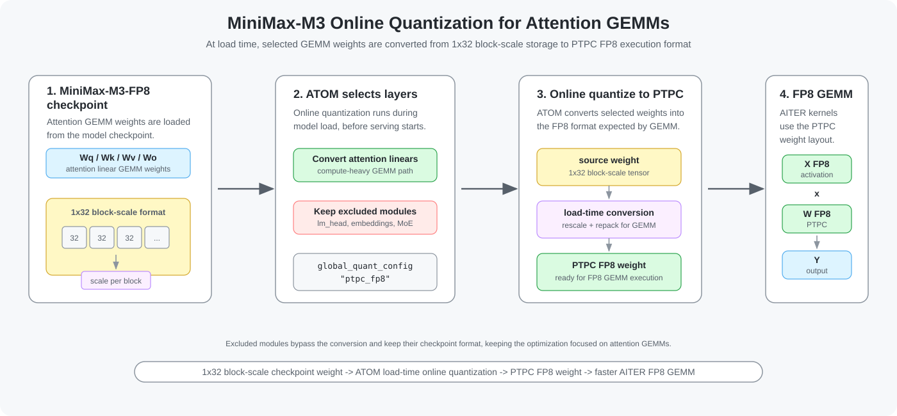
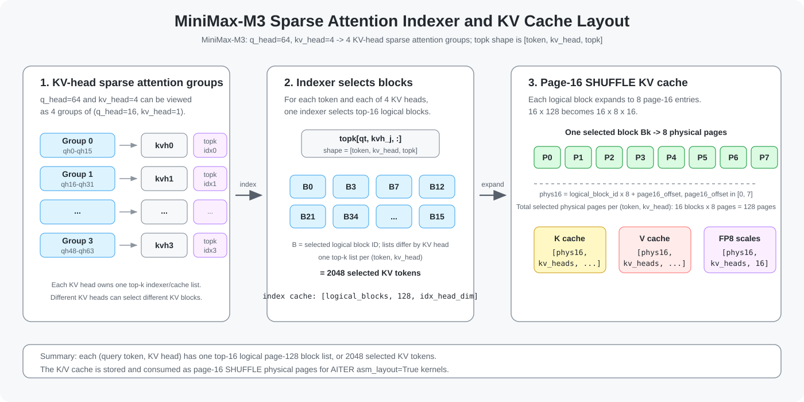
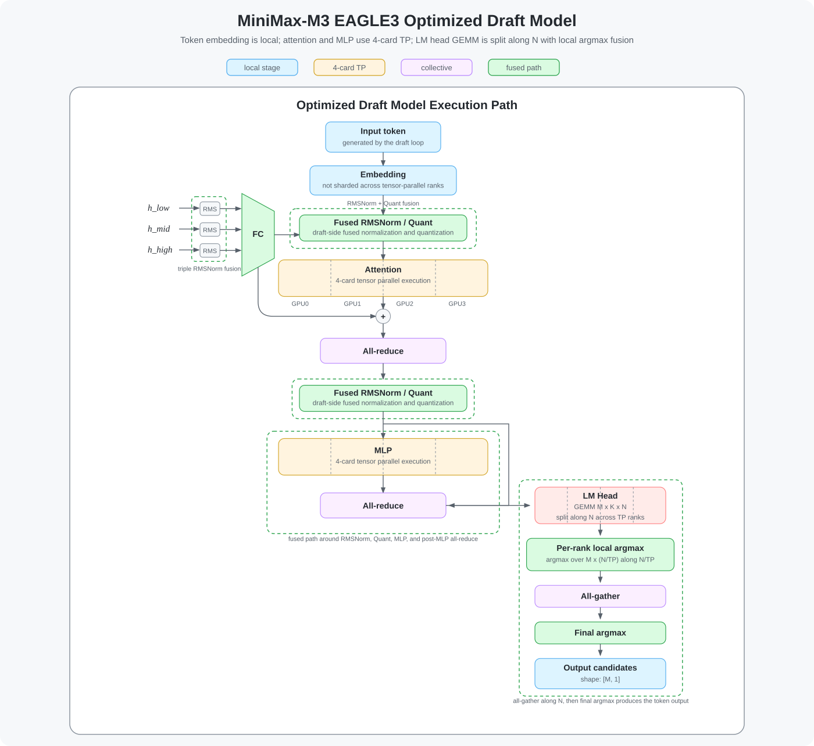
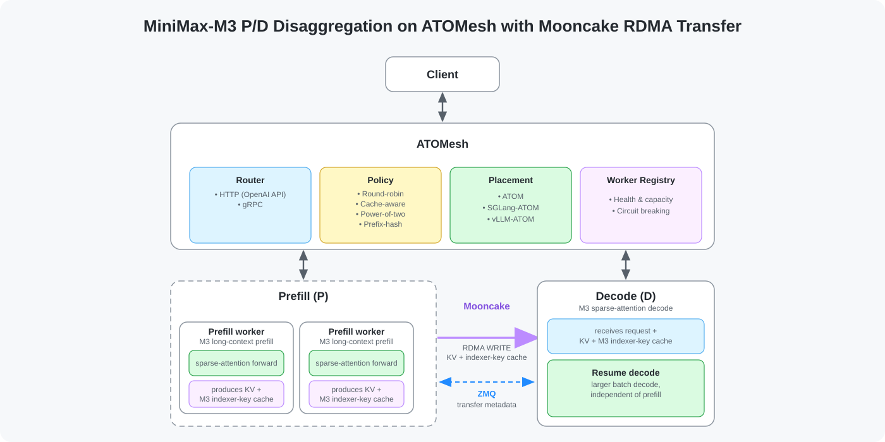
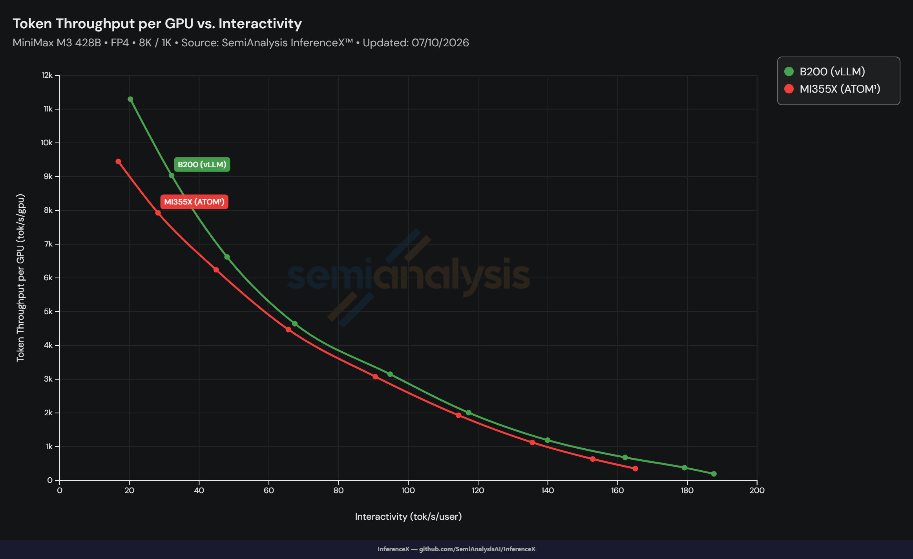
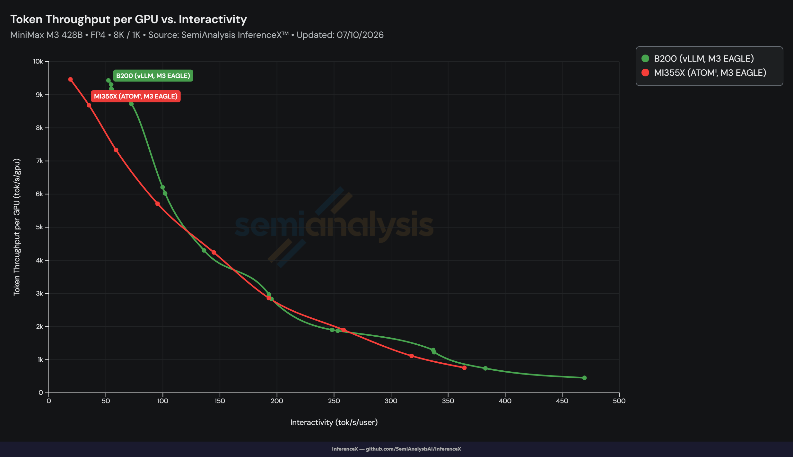
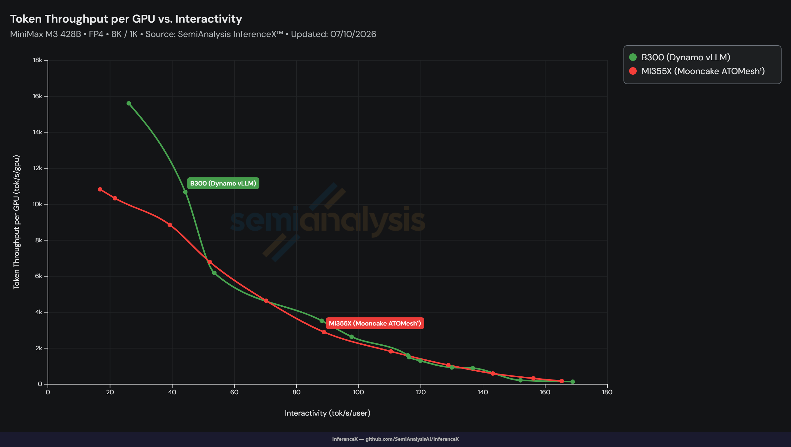

<!---
Copyright (c) 2026 Advanced Micro Devices, Inc. (AMD)

Permission is hereby granted, free of charge, to any person obtaining a copy
of this software and associated documentation files (the "Software"), to deal
in the Software without restriction, including without limitation the rights
to use, copy, modify, merge, publish, distribute, sublicense, and/or sell
copies of the Software, and to permit persons to whom the Software is
furnished to do so, subject to the following conditions:

The above copyright notice and this permission notice shall be included in all
copies or substantial portions of the Software.

THE SOFTWARE IS PROVIDED "AS IS", WITHOUT WARRANTY OF ANY KIND, EXPRESS OR
IMPLIED, INCLUDING BUT NOT LIMITED TO THE WARRANTIES OF MERCHANTABILITY,
FITNESS FOR A PARTICULAR PURPOSE AND NONINFRINGEMENT. IN NO EVENT SHALL THE
AUTHORS OR COPYRIGHT HOLDERS BE LIABLE FOR ANY CLAIM, DAMAGES OR OTHER
LIABILITY, WHETHER IN AN ACTION OF CONTRACT, TORT OR OTHERWISE, ARISING FROM,
OUT OF OR IN CONNECTION WITH THE SOFTWARE OR THE USE OR OTHER DEALINGS IN THE
SOFTWARE.
--->

# Scaling MiniMax-M3 Inference with Distributed Serving and Operator Co-Design on AMD Instinct MI355X GPUs

This blog walks you through a set of MiniMax-M3 inference optimizations on AMD Instinct™ MI355X GPUs using [ATOM](https://github.com/ROCm/ATOM), [AITER](https://github.com/ROCm/aiter), and [ATOMesh](https://rocm.blogs.amd.com/software-tools-optimization/atomesh-inference/README.html). For broader background on the inference engine and distributed serving layers used here, see the ROCm blogs on [ATOM](https://rocm.blogs.amd.com/software-tools-optimization/atom-inference-engine/README.html) and [ATOMesh](https://rocm.blogs.amd.com/software-tools-optimization/atomesh-inference/README.html).

We'll break down:

- System-level bottlenecks across quantization, attention, KV cache, speculative decoding, and disaggregated inference.
- ATOM online quantization for faster attention GEMMs.
- AITER sparse attention, FP8 KV cache, and page-16 SHUFFLE layout.
- EAGLE3 speculative decoding for reducing target-model forward work.
- ATOMesh P/D disaggregation for distributed MiniMax-M3 serving.

By the end, you'll understand how these optimizations work together to improve serving throughput, reduce token latency, and maintain accuracy on MiniMax-M3 workloads.

## Why MiniMax-M3 Optimization Matters

MiniMax-M3 is a high-performance large language model with a complex inference path. It combines Mixture-of-Experts (MoE), sparse attention, long-context KV cache management, and quantized checkpoints. Optimizing only one kernel is not enough. To unlock higher serving efficiency on AMD Instinct™ MI355X GPUs, the full inference path must be considered.

The recent MiniMax-M3 optimization work focuses on four major areas:

| Area                    | Optimization                                                                 |
| ----------------------- | ---------------------------------------------------------------------------- |
| Quantization            | Online quantization for attention linear layers and GEMM acceleration        |
| Attention runtime       | AITER sparse attention, FP8 KV cache, and page-16 SHUFFLE KV layout          |
| Speculative decoding    | EAGLE3 speculative decoding with optimized draft and target execution        |
| Disaggregated inference | ATOMesh P/D disaggregation with MiniMax-M3 sparse indexer-key cache transfer |

Together, these changes improve the most important serving bottlenecks: attention GEMM cost, KV cache bandwidth, sparse attention scheduling, and target model forward frequency.

## Online Quantization for Attention GEMMs

ATOM provides several online quantization methods that prepare checkpoint weights for efficient GEMM execution without regenerating the full model. These include quantizing BF16 weights to FP8 or FP4, and converting between formats within the same data type, such as FP8 block-scale weights to FP8 PTPC weights. This is useful for MiniMax-M3 quantized checkpoints because performance-sensitive paths, especially attention, can use lower-bit GEMMs or keep FP8 while switching to a different quantization scheme like PTPC. For the full set of supported online quantization modes and configuration options, see the [ATOM online quantization guide](https://github.com/ROCm/ATOM/blob/main/docs/online_quantization_guide.md).

For MiniMax-M3, ATOM applies online quantization only where it improves GEMM throughput: attention linear layers and selected dense MLP layers. Modules such as `lm_head`, embeddings, vision components, multimodal projectors, and MoE layers are excluded, so MoE weights keep their existing quantized format. This selective policy covers both MiniMaxAI/MiniMax-M3-MXFP8 and Quark quantized models such as `amd/MiniMax-M3-MXFP4`, where some attention layers remain BF16 and can still benefit from PTPC FP8 online quantization. For implementation details, see [ROCm/ATOM #1335](https://github.com/ROCm/ATOM/pull/1335) and [ROCm/ATOM #1370](https://github.com/ROCm/ATOM/pull/1370).

Taking MiniMaxAI/MiniMax-M3-MXFP8 as an example, selected attention GEMM weights are loaded from their 1x32 block-scale checkpoint representation and converted to PTPC FP8 during model loading. The conversion uses GPU elementwise kernels, so it adds only a small one-time weight-loading overhead. After the PTPC weights are materialized, request-time inference uses them directly and does not pay additional online quantization latency. Figure 1 shows this load-time conversion path and the modules that remain in their original format.

<div align="center">



Figure 1. MiniMax-M3 online quantization path.

</div>

An example online quantization configuration is shown below:

```bash
--online_quant_config '{"global_quant_config": "ptpc_fp8", "exclude_layer": ["lm_head", "model.embed_tokens", "vision_tower", "multi_modal_projector", "patch_merge_mlp", "*block_sparse_moe"]}'
```

## AITER Sparse Attention and FP8 KV Cache

The second optimization area targets attention runtime. This is not a single-point kernel change; it requires joint design and tuning between ATOM as the inference framework and AITER as the operator library. AITER provides high-performance attention operators for prefill and decode, while ATOM exposes the sparse metadata, KV-cache layout, and page-size configuration needed to use those operators efficiently.

MiniMax-M3 also has model-specific sparse attention behavior, including grouped query heads and per-KV-head block selection. Those details determine how the sparse indexer, block table, and page-16 KV cache layout must be represented.

Specifically, MiniMax-M3 has `q_head=64` and `kv_head=4`, which can be viewed as 4 KV-head sparse attention groups, each with `q_head=16` and `kv_head=1`. For each query token and KV head, the indexer selects 16 logical blocks, and each logical block covers 128 tokens. Different KV heads have separate top-k indexers and can select different KV blocks. Figure 2 shows how those logical blocks map to the page-16 SHUFFLE KV cache layout used by the AITER paged-attention path.

<div align="center">



Figure 2. MiniMax-M3 KV cache layout.

</div>

The concrete implementation of the layout shown above spans both ATOM and AITER:

1. On the ATOM side, we refactored MiniMax-M3 sparse attention into the standard `Attention` and `PagedAttentionImpl` framework, introduced `SparseMHAPagedAttentionImpl`, and added a page-16 SHUFFLE KV cache path with AITER gluon paged-attention runners for decode and prefill. This lets MiniMax-M3 reuse standard attention metadata binding while preserving model-specific sparse behavior, and allows the sparse index top-k path to directly emit compacted sparse block tables, avoiding an additional block-table build launch and reducing HBM round trips. For implementation details, see [ROCm/ATOM #1334](https://github.com/ROCm/ATOM/pull/1334).
2. On the AITER side, we added SHUFFLE KV cache layout support to `fused_qknorm_idxrqknorm`, with separate K and V cache tensors and an `asm_layout` flag for selecting the page-16 SHUFFLE addressing path. We also improved FP8 correctness by replacing hardcoded FP8 maximum values with AITER's `opus::finfo<cache_t>::max()` helper, ensuring the per-token scaling path uses the correct architecture-specific FP8 range. For implementation details, see [ROCm/aiter #3795](https://github.com/ROCm/aiter/pull/3795) and [ROCm/aiter #3892](https://github.com/ROCm/aiter/pull/3892).

## EAGLE3 Speculative Decoding

We also added EAGLE3 speculative decoding support for MiniMax-M3. EAGLE3 uses a lightweight draft model to propose multiple tokens, then verifies those proposals with the MiniMax-M3 target model. For greedy decoding, this preserves the target model output while reducing the average number of target forward passes.

The target model attention decode path was extended to support `max_q_len > 1`, enabling multi-token speculative verification. On the draft model side, a token first enters a non-sharded embedding path, then runs attention with 4-card tensor parallelism, all-reduce, fused RMSNorm/Quant, MLP with 4-card tensor parallelism, another all-reduce, and an LM head GEMM whose `N` dimension is split across tensor-parallel ranks. The optimization adds several fused paths, including RMSNorm + Quant fusion and triple RMSNorm fusion. It also adds a distributed greedy argmax in which each rank reduces its `M x (N/TP)` logits shard to a per-token `(max, index)` pair. Only these `[M, 2]` per-rank results are all-gathered across tensor-parallel ranks instead of the full `[M, N]` logits, and a final cross-rank argmax is then performed. Figure 3 summarizes this optimized draft-model execution path. For implementation details, see [ROCm/ATOM #1333](https://github.com/ROCm/ATOM/pull/1333).

<div align="center">



Figure 3. MiniMax-M3 EAGLE3 uses fused draft-model execution and distributed argmax to reduce speculative decoding overhead.

</div>

With `--num-speculative-tokens 3`, the validated GSM8K run measured:

<div align="center">

| Metric                              |  Value |
| ----------------------------------- | -----: |
| Average accepted tokens per forward |   3.20 |
| Overall draft acceptance rate       | 73.45% |
| First draft-token acceptance        |  85.8% |
| Second draft-token acceptance       |  73.7% |
| Third draft-token acceptance        |  60.9% |

</div>

This acceptance profile shows why EAGLE3 can reduce target-model work for MiniMax-M3 while maintaining output consistency. End-to-end decode throughput depends on the serving configuration, including sequence lengths, batch size, concurrency, model format, and software versions.

## Distributed Inference with ATOMesh

ATOMesh supports prefill/decode disaggregation for serving large models across distributed GPU resources. This is especially useful for MiniMax-M3 because long-context prefill and sparse-attention decode can have different scaling bottlenecks, and separating the two stages lets deployments allocate resources to each stage independently.

For MiniMax-M3, we added a MiniMax-M3-specific cache transfer path in ATOMesh so P/D disaggregation transfers both the standard K/V cache and the sparse indexer-key cache maintained by each sparse attention layer. This ensures the decode worker receives the metadata needed to select the top-k historical blocks correctly, since the sparse indexer-key cache cannot be reconstructed from the regular K/V cache after a cache hit. See Figure 4 below for this P/D disaggregation and cache-transfer flow. For implementation details, see [ROCm/ATOM #1368](https://github.com/ROCm/ATOM/pull/1368).

<div align="center">



Figure 4. MiniMax-M3 P/D disaggregation on ATOMesh with Mooncake RDMA KV and indexer-key cache transfer.

</div>

## Performance Preview

In FP4 serving mode, ATOM MiniMax-M3 on AMD Instinct™ MI355X GPUs achieves state-of-the-art performance across the measured interactivity range. Figures 5, 6, and 7 show the FP4 throughput curves for different serving configurations.

<div align="center">



Figure 5. FP4 8K/1K serving throughput per GPU for MiniMax-M3 on MI355X with ATOM compared with published InferenceX measurements. Source: SemiAnalysis, InferenceX, FP4 8K/1K MiniMax-M3 on MI355X with ATOM, data as July 11, 2026.

</div>

<div align="center">



Figure 6. FP4 8K/1K serving throughput per GPU for MiniMax-M3 on MI355X with ATOM and M3 EAGLE compared with published InferenceX measurements. Source: SemiAnalysis, InferenceX, FP4 8K/1K MiniMax-M3 on MI355X with ATOM and M3 EAGLE, data as July 11, 2026.

</div>

<div align="center">



Figure 7. FP4 8K/1K serving throughput per GPU for MiniMax-M3 on MI355X with Mooncake ATOMesh compared with published InferenceX measurements. Source: SemiAnalysis, InferenceX, FP4 8K/1K MiniMax-M3 on MI355X with Mooncake ATOMesh, data as July 11, 2026.

</div>

These performance results can be reproduced by following the [MiniMax-M3 MXFP4/MXFP8 usage guide](https://github.com/ROCm/ATOM/blob/main/recipes/MiniMax-M3.md), which includes the launch commands, online quantization configuration, EAGLE3 setup, accuracy tests, benchmark scripts, and detailed serving parameters such as request shape and concurrency settings.

## Summary

This blog showed how MiniMax-M3 optimization on AMD Instinct™ MI355X GPUs requires more than a single kernel improvement. The best results come from coordinating quantization, attention execution, KV cache layout, distributed cache transfer, and decode strategy.

It also covered how ATOM online quantization accelerates attention GEMMs, how AITER sparse attention and FP8 KV cache reduce attention runtime overhead and memory movement, how EAGLE3 speculative decoding reduces the effective target-model workload during decode, and how ATOMesh enables MiniMax-M3 cache transfer for P/D disaggregation. Together, these optimizations provide a practical path to higher-throughput MiniMax-M3 serving on AMD Instinct™ MI355X GPUs while maintaining accuracy.

## Additional Resources

1. [ROCm/ATOM Repository](https://github.com/ROCm/ATOM)
2. [ROCm/AITER Repository](https://github.com/ROCm/aiter)
3. [ATOM: Unlocking Extreme AMD Instinct Inference with Software-Hardware Co-Optimization](https://rocm.blogs.amd.com/software-tools-optimization/atom-inference-engine/README.html)
4. [ATOMesh: Unlocking AMD Hardware for Scalable LLM Serving](https://rocm.blogs.amd.com/software-tools-optimization/atomesh-inference/README.html)
5. [MiniMaxAI/MiniMax-M3-MXFP8 support](https://github.com/ROCm/ATOM/pull/1335)
6. [Online quantization for Quark models](https://github.com/ROCm/ATOM/pull/1370)
7. [MiniMax-M3 AITER sparse attention and SHUFFLE KV cache](https://github.com/ROCm/ATOM/pull/1334)
8. [AITER SHUFFLE KV cache layout](https://github.com/ROCm/aiter/pull/3795)
9. [AITER FP8 scaling update](https://github.com/ROCm/aiter/pull/3892)
10. [MiniMax-M3 EAGLE3 speculative decoding support](https://github.com/ROCm/ATOM/pull/1333)
11. [MiniMax-M3 model](https://huggingface.co/MiniMaxAI/MiniMax-M3)
12. [MiniMax-M3 MXFP4 model](https://huggingface.co/amd/MiniMax-M3-MXFP4)
13. [MiniMax-M3 EAGLE3 draft model](https://huggingface.co/Inferact/MiniMax-M3-EAGLE3)

## Acknowledgments

We would like to thank the AMD Quark team, the AMD ATOM team, and the AMD AITER team for their contributions and support.

## Disclaimers

The information presented in this document is for informational purposes only and may contain technical inaccuracies, omissions, and typographical errors. The information contained herein is subject to change and may be rendered inaccurate for many reasons, including but not limited to product and roadmap changes, component and motherboard version changes, new model and/or product releases, product differences between differing manufacturers, software changes, BIOS flashes, firmware upgrades, or the like. Any computer system has risks of security vulnerabilities that cannot be completely prevented or mitigated. AMD assumes no obligation to update or otherwise correct or revise this information.
However, AMD reserves the right to revise this information and to make changes from time to time to the content hereof without obligation of AMD to notify any person of such revisions or changes.
THIS INFORMATION IS PROVIDED ‘AS IS.” AMD MAKES NO REPRESENTATIONS OR WARRANTIES WITH RESPECT TO THE CONTENTS HEREOF AND ASSUMES NO RESPONSIBILITY FOR ANY INACCURACIES, ERRORS, OR OMISSIONS THAT MAY APPEAR IN THIS INFORMATION. AMD SPECIFICALLY DISCLAIMS ANY IMPLIED WARRANTIES OF NON-INFRINGEMENT, MERCHANTABILITY, OR FITNESS FOR ANY PARTICULAR PURPOSE. IN NO EVENT WILL AMD BE LIABLE TO ANY PERSON FOR ANY RELIANCE, DIRECT, INDIRECT, SPECIAL, OR OTHER CONSEQUENTIAL DAMAGES ARISING FROM THE USE OF ANY INFORMATION CONTAINED HEREIN, EVEN IF AMD IS EXPRESSLY ADVISED OF THE POSSIBILITY OF SUCH DAMAGES.
AMD, the AMD Arrow logo, and combinations thereof are trademarks of Advanced Micro Devices, Inc. Other product names used in this publication are for identification purposes only and may be trademarks of their respective companies.
© 2026 Advanced Micro Devices, Inc. All rights reserved
