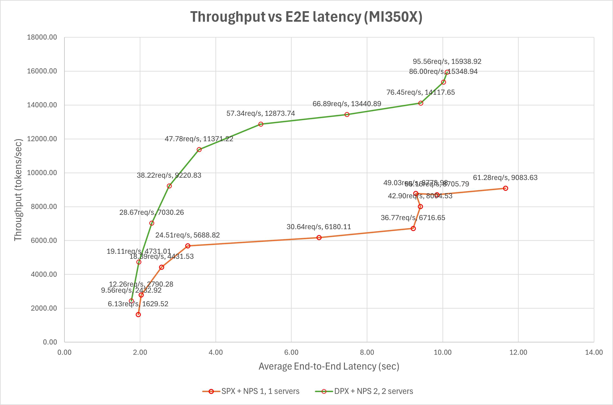
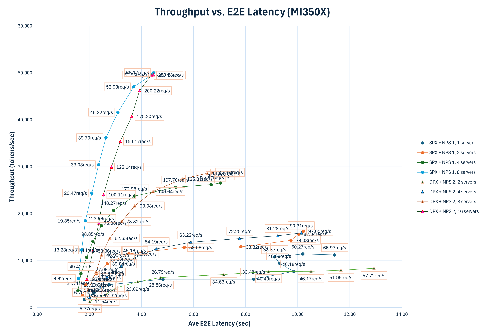

<!---
Copyright (c) 2025 Advanced Micro Devices, Inc. (AMD)

Permission is hereby granted, free of charge, to any person obtaining a copy
of this software and associated documentation files (the "Software"), to deal
in the Software without restriction, including without limitation the rights
to use, copy, modify, merge, publish, distribute, sublicense, and/or sell
copies of the Software, and to permit persons to whom the Software is
furnished to do so, subject to the following conditions:

The above copyright notice and this permission notice shall be included in all
copies or substantial portions of the Software.

THE SOFTWARE IS PROVIDED "AS IS", WITHOUT WARRANTY OF ANY KIND, EXPRESS OR
IMPLIED, INCLUDING BUT NOT LIMITED TO THE WARRANTIES OF MERCHANTABILITY,
FITNESS FOR A PARTICULAR PURPOSE AND NONINFRINGEMENT. IN NO EVENT SHALL THE
AUTHORS OR COPYRIGHT HOLDERS BE LIABLE FOR ANY CLAIM, DAMAGES OR OTHER
LIABILITY, WHETHER IN AN ACTION OF CONTRACT, TORT OR OTHERWISE, ARISING FROM,
OUT OF OR IN CONNECTION WITH THE SOFTWARE OR THE USE OR OTHER DEALINGS IN THE
SOFTWARE.
--->

# LLM Inference Optimization Using AMD GPU Partitioning

As AI and HPC workloads grow in complexity and scale, there's a rising need for precise GPU resource management, robust memory isolation, and efficient multi-tenant scheduling. AMD’s Instinct™ MI300 series addresses this by offering dynamic [partitioning](https://rocm.blogs.amd.com/software-tools-optimization/compute-memory-modes/README.html) capabilities. These allow a single physical device to be segmented into multiple isolated partitions, each tailored to the needs of specific workloads. This flexibility is particularly beneficial for AI inference tasks, where different models or instances may require distinct resource allocations. Maximizing the utilization of GPU resources while ensuring that each workload operates within its own isolated environment is crucial for performance and reliability.

This post demonstrates how to scale model serving with vLLM on AMD Instinct GPUs, specifically the MI300X series, by leveraging their compute and memory partitioning capabilities. Multiple vLLM instances can run concurrently on a single MI300X by dividing GPU resources. The deployment is then scaled across all GPUs in the system, with hardware-supported partitioning ensuring efficient resource utilization and isolation between instances.

## AMD GPU Partitioning Concepts

Modern workloads in AI and high-performance computing (HPC) often require more than just raw GPU power. They demand flexibility, isolation, and efficient resource sharing. AMD’s Instinct MI300X architecture addresses these needs through advanced GPU partitioning, enabling fine-grained control over compute and memory resources within a single physical device.

At the heart of this capability is the modular chiplet design of the [MI300X GPU](https://www.amd.com/en/products/accelerators/instinct/mi300/mi300x.html). Each device integrates 8 XCDs (Accelerator Complex Dies), each with 38 Compute Units (CUs), and 8 stacks of High-Bandwidth Memory (HBM), delivering a total of 304 CUs and 192GB of unified HBM. These resources are interconnected via 4 I/O Dies (IODs) using 3D stacking, offering high throughput and low latency.

Partitioning allows these hardware elements to be logically subdivided and exposed as independent GPU instances. This is accomplished through two core mechanisms:

- **Compute partitioning** defines how GPU resources are logically divided to support different workload needs. There are three primary modes: SPX (Single Partition X-celerator), CPX (Core Partitioned X-celerator), and DPX (Dual Partitioned X-celerator). In SPX mode, the entire GPU functions as a single large logical device. This is ideal for running large models that require substantial hardware resources. In CPX mode, each XCD is exposed as an independent logical GPU. In DPX mode, every four XCDs are grouped into one partition, creating two logical GPUs. These partitioning modes provide isolation and flexibility, making it easier to run varied or concurrent workloads.

- **Memory partitioning** complements compute partitioning by managing how HBM is allocated and exposed to logical devices. The memory partitioning modes are known as NUMA NPS, short for Non-Uniform Memory Access (NUMA) Nodes Per Socket. Different NPS configurations change the number of NUMA domains that a device exposes. There are three primary modes: NPS1, NPS2, and NPS4. NPS1 offers a unified memory pool across all XCDs, treating the entire MI300X device as a single NUMA domain. In contrast, NPS2 and NPS4 create two or four separate memory domains respectively, reducing latency and improving efficiency for partitioned workloads. NPS4 is particularly effective when paired with CPX for multi-tenant or memory-sensitive applications. NPS2 is particularly effective paired with DPX mode.

These partitioning modes provide scalable, workload-aware scheduling and resource allocation. AMD’s GPU partitioning enables precise architectural control for both large-scale inference workloads and multi-tenant job distribution to meet modern compute requirements. For more information about the partitioning modes, see [AMD Instinct MI300X GPU Partitioning Overview](https://instinct.docs.amd.com/projects/amdgpu-docs/en/latest/gpu-partitioning/mi300x/overview.html).

This blog specifically uses SPX and DPX modes to demonstrate the GPU partitioning capabilities. A quantized version of [mistralai/Mistral-Nemo-Instruct-2407](https://huggingface.co/mistralai/Mistral-Nemo-Instruct-2407) is used for benchmarking. Factors such as model size, memory requirements, latency, and throughput are considered when determining the optimal partitioning strategy. Use SPX mode for running a single large model that requires the full resources of the GPU. DPX mode allows for running multiple instances of smaller models or the same model across different partitions, improving GPU utilization. (Note: Partitioning can be great for maximizing utilization, but it is not advised to use memory or compute partitioning when running only a single instance of a single model on a device.)

## Evaluation Setup

To follow along with this blog, you will need the following:

- AMD Instinct [MI300X](https://www.amd.com/en/products/accelerators/instinct/mi300/mi300x.html), [MI350X](https://www.amd.com/en/products/accelerators/instinct/mi350/mi350x.html), or [MI355X](https://www.amd.com/en/products/accelerators/instinct/mi350/mi355x.html) GPU with [ROCm 7.1 or later](https://rocm.docs.amd.com/projects/install-on-linux/en/latest/) installed.
- A system with eight (MI300X, MI350X, or MI355X) GPUs to demonstrate scaling across multiple devices
- [vLLM](https://github.com/vllm-project/vllm): Installation instructions are available in the [vLLM documentation](https://github.com/vllm-project/vllm). For this blog, use the [rocm/vllm:latest](https://hub.docker.com/layers/rocm/vllm/latest/images/sha256-38410c51af7208897cd8b737c9bdfc126e9bc8952d4aa6b88c85482f03092a11) Docker image, which is optimized for AMD GPUs and includes all necessary dependencies.
- [nginx](https://nginx.org/): An HTTP server and load balancer, to serve the vLLM API.
- [inference-benchmarker](https://github.com/huggingface/inference-benchmarker): A benchmarking tool to measure the performance of LLM serving.

The quantized version of [mistralai/Mistral-Nemo-Instruct-2407](https://huggingface.co/mistralai/Mistral-Nemo-Instruct-2407) is used for benchmarking with vLLM under both SPX and DPX modes. For guidance on using AMD Quark to quantize the model, refer to the blog [LLM Quantization with Quark on AMD GPUs: Accuracy and Performance Evaluation](https://rocm.blogs.amd.com/artificial-intelligence/quark/README.html). Alternatively, you can download a pre-quantized version from [superbigtree/Mistral-Nemo-Instruct-2407-FP8_aq](https://huggingface.co/superbigtree/Mistral-Nemo-Instruct-2407-FP8_aq). This quantized model significantly reduces memory usage and improves inference speed, making it well-suited for running multiple instances on a single GPU and enhancing overall performance.

## Getting Started

This section provides a step-by-step guide to set up the environment for running vLLM in both SPX and DPX modes on a single GPU and across multiple GPUs. HuggingFace's [inference-benchmarker](https://github.com/huggingface/inference-benchmarker) is used to measure the performance of multiple vLLM instances. It supports various models and configurations, making it a versatile choice for benchmarking. Additionally, [nginx](https://nginx.org/) is used to load balance the requests across multiple vLLM instances. You may need root (`sudo`) access to run any or all of the commands that follow.

The setup consists of the following steps:

1. Configure a single GPU with SPX mode.
2. Set up two GPU partitions using DPX (Dual Partition X-celerator) mode.
3. Scale the setup to multiple GPUs using DPX mode.

All the code and scripts used in this blog can be found in [multi-inf-engine/src][multi-inf-eng-src].

To save time, you can run the following commands to pre-download the model and docker images in this blog:

```sh
docker pull nginx:latest
docker pull rocm/vllm:latest
docker pull ghcr.io/huggingface/inference-benchmarker:latest

# Optionally, set the HF_HOME environment variable to set where the model will be downloaded
export HF_HOME=~/.cache/huggingface
export MODEL='superbigtree/Mistral-Nemo-Instruct-2407-FP8_aq'
hf download ${MODEL}
# Or:
# huggingface-cli download ${MODEL}
```

## Single GPU Setup

### Single GPU with SPX mode

This mode treats the entire GPU as a single logical device, allowing maximum resource utilization for a workload. Check the GPU partitioning mode by running the following command:

```sh
amd-smi static --partition
```

In the output, look for the `COMPUTE_PARTITION` and `MEMORY_PARTITION` fields. The output should show the partitioning mode as `SPX` for the compute and `NPS1` for the memory. In the example below, there are 8 GPUs.

```sh
GPU: 0
    PARTITION:
        COMPUTE_PARTITION: SPX
        MEMORY_PARTITION: NPS1
        PARTITION_ID: 0
...

GPU: 7
    PARTITION:
        COMPUTE_PARTITION: SPX
        MEMORY_PARTITION: NPS1
        PARTITION_ID: 0
```

If the GPU is not set to SPX mode, use the following command to set it to SPX.
Before proceeding, ensure that no compute workloads or system services are
actively using the GPU. Terminate any conflicting processes, and verify that the
`sudo` user has permission to run the `amd-smi` command.

```sh
amd-smi set --gpu all --compute-partition SPX
amd-smi set --gpu all --memory-partition NPS1
```

If configuration has changed, run the following to reload the AMD GPU driver:

```sh
sudo amd-smi reset -r
```

It may tell warn you:

```txt
    ****** WARNING ******

    AMD SMI is about to initiate an AMD GPU driver restart (module reload).

    Reloading the AMD GPU driver REQUIRES users to quit all GPU activity across all
    devices.

    If user is initiating a driver reload AFTER changing memory (NPS) partition
    modes (`sudo amd-smi set -M <NPS_MODE>`), a AMD GPU driver reload is REQUIRED
    to complete updating the partition mode. This change will effect ALL GPUs in
    the hive. Advise using `amd-smi list -e` and `amd-smi partition -c -m`
    afterwards to ensure changes were applied as expected.

    Please use this utility with caution.
```

and ask whether you accept the terms. If you enter 'Y' (case insensitive), the driver will reload, potentially taking up to 140 seconds.

For a briefer way to check both memory and compute partitioning modes at once, run the following command:

```sh
amd-smi partition -c -m
```

Output will look something like this:

```txt
CURRENT_PARTITION:
GPU_ID  MEMORY  ACCELERATOR_TYPE  ACCELERATOR_PROFILE_INDEX  PARTITION_ID
0       NPS1    SPX               0                          0
1       NPS1    SPX               0                          0
2       NPS1    SPX               0                          0
3       NPS1    SPX               0                          0
4       NPS1    SPX               0                          0
5       NPS1    SPX               0                          0
6       NPS1    SPX               0                          0
7       NPS1    SPX               0                          0

MEMORY_PARTITION:
GPU_ID  MEMORY_PARTITION_CAPS  CURRENT_MEMORY_PARTITION
0       NPS1,NPS2              NPS1
1       NPS1,NPS2              NPS1
2       NPS1,NPS2              NPS1
3       NPS1,NPS2              NPS1
4       NPS1,NPS2              NPS1
5       NPS1,NPS2              NPS1
6       NPS1,NPS2              NPS1
7       NPS1,NPS2              NPS1
```

#### 1. Set up Nginx

Create a dedicated Docker network to enable communication between Nginx and the vLLM instances:

````sh
docker network create vllm_nginx
````

Create a directory named `nginx_conf`, and inside it, create a file called `nginx_single_server.conf`. This is used to load balance the requests across multiple vLLM instances. The contents of `nginx_single_server.conf` should look as follows (available as [multi-inf-engine/src/nginx_single_server.conf](https://github.com/ROCm/rocm-blogs/tree/release/blogs/software-tools-optimization/multi-inf-engine/src/nginx_single_server.conf)):

```nginx
worker_processes auto;
events {
    worker_connections 1024;
}

http {
    upstream backend {
        least_conn;
        server vllm_0:8000 max_fails=3 fail_timeout=10s;
    }
    server {
        listen 80;
        location / {
            proxy_pass http://backend;
            proxy_set_header Host $host;
            proxy_set_header X-Real-IP $remote_addr;
            proxy_set_header X-Forwarded-For $proxy_add_x_forwarded_for;
            proxy_set_header X-Forwarded-Proto $scheme;
        }
    }
}
```

This configuration sets up Nginx to listen on port 80 and forward requests to the vLLM instances running on port 8000 of `vllm_0`. The `worker_processes auto` directive enables Nginx to determine the number of worker processes based on the available CPU cores. The `least_conn` directive specifies that the group should use a load balancing strategy that directs each request to the server with the fewest active connections, factoring in server weights. If multiple servers have the same number of active connections, requests are distributed among them using a weighted round-robin method.

Start Nginx using the following command. First go to the parent directory where you created the folder `nginx_conf`. This command maps the Nginx container’s default port 80 to an external port, for example, 8040:

```sh
docker run -itd -p 8040:80 --network vllm_nginx \
    -v $(pwd)/nginx_conf/nginx_single_server.conf:/etc/nginx/nginx.conf:ro \
    --name nginx-lb-single-server nginx:latest
```

#### 2. Set up vLLM server

Create a script named `launch_vllm_server_template.sh` to launch vLLM instances or use the existing `launch_vllm_server_template.sh` script in the [multi-inf-engine/src][multi-inf-eng-src] folder. This script will handle the creation and management of vLLM instances on a single GPU. The script takes the following parameters:

```sh
# vLLM instances
GPU_ID=$1
PORT=$2
WORKSPACE_PATH=$3
MODEL_PATH=$4
DEFAULT_HF_HOME="$HOME/.cache/huggingface"
HF_HOME="${5:-$DEFAULT_HF_HOME}"

echo "Mounting '${HF_HOME}' as HF_HOME".

docker stop vllm_$GPU_ID
docker rm vllm_$GPU_ID
docker run -d -it \
    --name vllm_$GPU_ID \
    --privileged \
    --shm-size 32G \
    --cap-add=CAP_SYS_ADMIN \
    --device=/dev/kfd \
    --device=/dev/dri \
    --group-add video \
    --cap-add=SYS_PTRACE \
    --security-opt seccomp=unconfined \
    --security-opt apparmor=unconfined \
    -v "${HF_HOME}":/root/.cache/huggingface \
    -v "$WORKSPACE_PATH":/workspace \
    -p $PORT:8000 \
    --network vllm_nginx \
    --ipc=host \
    rocm/vllm:latest

docker exec vllm_$GPU_ID bash /workspace/launch_vllm_core.sh $GPU_ID $MODEL_PATH &
```

Consider saving yourself downloads and space on disk by mounting the host's `HF_HOME` directory to where the containers will search. This can be done by setting `export HF_HOME=<loc>` on the host before running `bash launch_vllm_server_template.sh` or as argument `$5` when launching it. If neither of those is provided, it will use the default path of `~/.cache/huggingface`. You can change this if you desire.

Create a script called `launch_vllm_core.sh`, which will be executed by each vLLM container. It launches the vLLM server with the specified model and GPU ID. Create this script with the following content or use the existing `launch_vllm_core.sh` script in the [multi-inf-engine/src][multi-inf-eng-src] folder:

```sh
GPU_ID=$1
MODEL_PATH=$2
export HIP_VISIBLE_DEVICES="$GPU_ID"
cd /root
vllm serve $MODEL_PATH --port 8000
```

Now you can launch a vLLM server with the Mistral model on a single GPU by running the following command:

```sh
WS_PATH=${PWD}
bash launch_vllm_server_template.sh 0 8081 "${WS_PATH}" "superbigtree/Mistral-Nemo-Instruct-2407-FP8_aq"
```

The `WS_PATH` is the path to the directory where the shell script files are stored. It should be the same directory in which you place `launch_vllm_server_template.sh`.

The above command runs `vllm_0` on GPU 0, exposed on port 8081. If the server is set up successfully, the output should look like this:

```log
INFO 06-16 20:55:06 [api_server.py:1336] Starting vLLM API server on http://0.0.0.0:8000
...
INFO 06-16 20:55:06 [launcher.py:36] Route: /metrics, Methods: GET
INFO:     Started server process [14]
INFO:     Waiting for application startup.
INFO:     Application startup complete.
```

Hit enter to view your host's terminal prompt. The container you launch will direct its `stdout` and `stderr` streams to yours, but your commands will run on the host.

Note: you may get a message such as:

```log
(EngineCore_DP0 pid=165) WARNING 10-10 17:02:42 [rocm.py:354]
    Model architecture 'MistralForCausalLM' is partially supported by ROCm:
        Sliding window attention (SWA) is not yet supported in Triton flash
        attention. For half-precision SWA support, please use CK flash
        attention by setting `VLLM_USE_TRITON_FLASH_ATTN=0`
```

#### 3. Benchmarking with inference-benchmarker

The [inference-benchmarker](https://github.com/huggingface/inference-benchmarker) is used to benchmark the performance of the vLLM serving. Before running it, make sure the `nginx-lb-single-server` docker container is up and running. If not, set it up as explained above.

To launch the benchmark, save the following script (made available as [multi-inf-engine/src/inference_benchmarker_launch.sh][inference-bm-script]):

```sh
MODEL="superbigtree/Mistral-Nemo-Instruct-2407-FP8_aq"
VU_NUM=1024 # Number of virtual users
DOCKER_SPEC='ghcr.io/huggingface/inference-benchmarker:latest'

echo "'$0' with model '${MODEL}'; virtual user count = ${VU_NUM}"

docker run \
    --name inference-benchmarker-vllm \
    --rm -it --net host \
    -v $(pwd):/opt \
    "${DOCKER_SPEC}" \
    inference-benchmarker \
    --tokenizer-name $MODEL \
    --model-name $MODEL \
    --url http://localhost:8040 \
    --prompt-options "num_tokens=512,max_tokens=1024,min_tokens=16,variance=25000" \
    --decode-options "num_tokens=512,max_tokens=1024,min_tokens=16,variance=25000" \
    --no-console \
    --max-vus $VU_NUM
```

and run

```sh
bash inference_benchmarker_launch.sh
```

This command runs the `inference-benchmarker` with the specified model and URL of the `Nginx` load balancer.

- `--prompt-options` and `--decode-options` define the prompt and decoding configurations for the benchmark. The number of tokens used in the prompt and decoding configuration follows a normal distribution.
- `num_tokens` sets the target number of prompt tokens.
- `min_tokens` sets the minimum number of prompt tokens.
- `max_tokens` sets the maximum number of prompt tokens.
- `variance` sets the variance in the number of prompt tokens.
- `--max-vus` sets the maximum number of virtual users to simulate during the benchmark. See [inference-benchmarker](https://github.com/huggingface/inference-benchmarker) for more information about the available options and configurations.

This process may take about 15 minutes to complete, depending on the system configuration. The output will show the performance metrics, including throughput and latency, for the vLLM server running on a single GPU. Here is an example output:

```log
┌─────────────────┬───────────────────────────────────────────────────────────────────┐
│ Parameter       │ Value                                                             │
├─────────────────┼───────────────────────────────────────────────────────────────────┤
│ Max VUs         │ 1024                                                              │
│ Duration        │ 120                                                               │
│ Warmup Duration │ 30                                                                │
│ Benchmark Kind  │ Sweep                                                             │
│ Rates           │ N/A                                                               │
│ Num Rates       │ 10                                                                │
│ Prompt Options  │ num_tokens=Some(512),min_tokens=16,max_tokens=1024,variance=25000 │
│ Decode Options  │ num_tokens=Some(512),min_tokens=16,max_tokens=1024,variance=25000 │
│ Tokenizer       │ superbigtree/Mistral-Nemo-Instruct-2407-FP8_aq                    │
│ Extra Metadata  │ N/A                                                               │
└─────────────────┴───────────────────────────────────────────────────────────────────┘

┌─────────────────────┬─────────────┬───────────────────┬────────────┬───────────┬────────────────────┬────────────┬─────────────────────┬─────────────────────────────┬──────────────────────────────┐
│ Benchmark           │ QPS         │ E2E Latency (avg) │ TTFT (avg) │ ITL (avg) │ Throughput         │ Error Rate │ Successful Requests │ Prompt tokens per req (avg) │ Decoded tokens per req (avg) │
├─────────────────────┼─────────────┼───────────────────┼────────────┼───────────┼────────────────────┼────────────┼─────────────────────┼─────────────────────────────┼──────────────────────────────┤
│ warmup              │ 0.49 req/s  │ 2.03 sec          │ 105.93 ms  │ 5.77 ms   │ 164.44 tokens/sec  │ 0.00%      │ 16/16               │ 512.00                      │ 333.12                       │
│ throughput          │ 27.06 req/s │ 23.37 sec         │ 3896.05 ms │ 166.19 ms │ 3940.87 tokens/sec │ 0.03%      │ 3247/3248           │ 512.00                      │ 145.64                       │
│ constant@3.25req/s  │ 3.18 req/s  │ 2.23 sec          │ 42.61 ms   │ 7.88 ms   │ 857.30 tokens/sec  │ 0.00%      │ 380/380             │ 512.00                      │ 269.22                       │
│ constant@6.49req/s  │ 6.38 req/s  │ 2.42 sec          │ 45.42 ms   │ 9.54 ms   │ 1521.57 tokens/sec │ 0.00%      │ 763/763             │ 512.00                      │ 238.42                       │
│ constant@9.74req/s  │ 9.50 req/s  │ 3.79 sec          │ 51.47 ms   │ 13.91 ms  │ 2479.36 tokens/sec │ 0.00%      │ 1138/1138           │ 512.00                      │ 261.01                       │
│ constant@12.99req/s │ 12.37 req/s │ 5.15 sec          │ 57.55 ms   │ 20.16 ms  │ 3031.36 tokens/sec │ 0.00%      │ 1482/1482           │ 512.00                      │ 245.07                       │
│ constant@16.24req/s │ 14.95 req/s │ 7.04 sec          │ 69.54 ms   │ 30.12 ms  │ 3421.76 tokens/sec │ 0.00%      │ 1791/1791           │ 512.00                      │ 228.92                       │
│ constant@19.48req/s │ 17.31 req/s │ 9.38 sec          │ 97.35 ms   │ 41.94 ms  │ 3776.64 tokens/sec │ 0.00%      │ 2075/2075           │ 512.00                      │ 218.18                       │
│ constant@22.73req/s │ 19.16 req/s │ 11.08 sec         │ 114.74 ms  │ 55.86 ms  │ 3758.00 tokens/sec │ 0.00%      │ 2298/2298           │ 512.00                      │ 196.10                       │
│ constant@25.98req/s │ 21.65 req/s │ 12.29 sec         │ 139.73 ms  │ 66.01 ms  │ 4001.76 tokens/sec │ 0.00%      │ 2595/2595           │ 512.00                      │ 184.83                       │
│ constant@29.22req/s │ 23.17 req/s │ 13.37 sec         │ 157.58 ms  │ 78.59 ms  │ 3972.15 tokens/sec │ 0.00%      │ 2779/2779           │ 512.00                      │ 171.46                       │
│ constant@32.47req/s │ 24.50 req/s │ 13.86 sec         │ 188.56 ms  │ 93.59 ms  │ 3707.39 tokens/sec │ 0.00%      │ 2939/2939           │ 512.00                      │ 151.33                       │
└─────────────────────┴─────────────┴───────────────────┴────────────┴───────────┴────────────────────┴────────────┴─────────────────────┴─────────────────────────────┴──────────────────────────────┘
```

This output shows the performance metrics for the vLLM server running on a single GPU.

- `QPS` (Queries Per Second) indicates the throughput of the server.
- `E2E Latency (avg)` shows the average end-to-end latency for requests.
- `TTFT (avg)` represents the average time to first token.
- `ITL (avg)` indicates the average inter-token latency.
- `Throughput` column shows the number of tokens processed per second.
- `Error Rate` indicates the percentage of failed requests.
- `Successful Requests` column shows the number of successful requests.
- `Prompt tokens per req (avg)` and `Decoded tokens per req (avg)` columns show the average number of prompt and decoded tokens per request, respectively.

During the test, the `inference-benchmarker` attempted to saturate the throughput of the vLLM instance by gradually increasing the number of requests per second. The request rates used can be found in the `Benchmark` column. It is important to note that the performance metrics may vary depending on the system configuration and the number of virtual users simulated during the benchmark.

If you like, you can add `--output_csv results.csv` or similar to the `inference-benchmarker` command to make the results easier to process and analyze.

### Single Physical GPU with DPX and NPS2

Note: check with `sudo amd-smi partition --accelerator` to see if NPS2 is supported for your ROCm version and system set up.

The output should look like this, in that there should be a line that says DPX for `ACCELERATOR_TYPE` and with it, `MEMORY_PARTITION_CAPS` should say that NPS1 and NPS2 are available. (Other memory modes may be supported at higher compute partitioning settings; that will not be necessary for this setup but is also not harmful.)

```log
ACCELERATOR_PARTITION_PROFILES:
GPU_ID  PROFILE_INDEX  MEMORY_PARTITION_CAPS  ACCELERATOR_TYPE  PARTITION_ID     NUM_PARTITIONS  NUM_RESOURCES  RESOURCE_INDEX  RESOURCE_TYPE  RESOURCE_INSTANCES  RESOURCES_SHARED
0       0              NPS1                   SPX*              0                1               4              0               XCC            8                   1
                                                                                                                1               DECODER        4                   1
                                                                                                                2               DMA            16                  1
                                                                                                                3               JPEG           40                  1
        1              NPS1,NPS2              DPX               N/A              2               4              4               XCC            4                   1
                                                                                                                5               DECODER        2                   1
                                                                                                                6               DMA            8                   1
                                                                                                                7               JPEG           20                  1
        2              NPS1,NPS2              QPX               N/A              4               4              8               XCC            2                   1
                                                                                                                9               DECODER        1                   1
                                                                                                                10              DMA            4                   1
                                                                                                                11              JPEG           10                  1
        3              NPS1,NPS2              CPX               N/A              8               4              12              XCC            1                   1
                                                                                                                13              DECODER        1                   2
                                                                                                                14              DMA            2                   1
                                                                                                                15              JPEG           10                  2
```

Set the GPU partitioning mode to DPX. Change the memory partition mode
as one NUMA node per socket (NPS2). You will need root access (e.g. `sudo`).

```sh
sudo amd-smi set --gpu all --compute-partition DPX
sudo amd-smi set --gpu all --memory-partition NPS2
```

If you change the memory or compute partitioning mode of the GPUs, you will have to reload the AMD GPU driver. Before doing so, make sure all processes using the GPUs are terminated, so you may additionally have to kill docker containers. First, check which processes are using the AMD-GPU driver:

```sh
sudo amd-smi
```

The end of the output may look something like this:

```txt
+------------------------------------------------------------------------------+
| Processes:                                                                   |
|  GPU        PID  Process Name          GTT_MEM  VRAM_MEM  MEM_USAGE     CU % |
|==============================================================================|
|    0    3049630  python3.12             2.0 MB   62.5 KB      0.0 B    0.0 % |
|    0    3050055  python3.12             2.0 MB  246.1 KB      0.0 B    0.0 % |
|    1    3049630  python3.12             2.0 MB   62.5 KB      0.0 B    0.0 % |
|    1    3050055  python3.12             2.0 MB  246.1 KB      0.0 B    0.0 % |
|    2    3049630  python3.12             2.0 MB   62.5 KB      0.0 B    0.0 % |
|    2    3050055  python3.12             2.0 MB  246.1 KB      0.0 B    0.0 % |
|    3    3049630  python3.12             2.0 MB   66.4 KB      0.0 B    0.0 % |
|    3    3050055  python3.12             2.0 MB  255.0 GB   261.9 GB    0.0 % |
|    4    3049630  python3.12             2.0 MB   62.5 KB      0.0 B    0.0 % |
|    4    3050055  python3.12             2.0 MB  246.1 KB      0.0 B    0.0 % |
|    5    3049630  python3.12             2.0 MB   62.5 KB      0.0 B    0.0 % |
|    5    3050055  python3.12             2.0 MB  246.1 KB      0.0 B    0.0 % |
|    6    3049630  python3.12             2.0 MB   62.5 KB      0.0 B    0.0 % |
|    6    3050055  python3.12             2.0 MB  246.1 KB      0.0 B    0.0 % |
|    7    3049630  python3.12             2.0 MB   62.5 KB      0.0 B    0.0 % |
|    7    3050055  python3.12             2.0 MB  246.1 KB      0.0 B    0.0 % |
+------------------------------------------------------------------------------+
```

Or it may reflect that no processes are using the AMD GPUs. To restart the driver, you will need to release the GPUs from any processes using them, which may require terminating those processes.

```sh
# if needed
docker container stop vllm_0
docker container rm   vllm_0  # etc.
# then
sudo amd-smi reset -r
```

Check the GPU partitioning mode by running the following command:

```sh
sudo amd-smi static --partition
```

In the output, look for the `COMPUTE_PARTITION` and `MEMORY_PARTITION` fields.
The output should show the compute partitioning mode as `DPX` and `NPS2` for
memory partitioning. In the example below, there are 16 GPU partitions, which
happens because the host machine has 8 physical AMD MI300X GPUs.

```yaml
GPU: 0
    PARTITION:
        COMPUTE_PARTITION: DPX
        MEMORY_PARTITION: NPS2
        PARTITION_ID: 0
...

GPU: 15
    PARTITION:
        COMPUTE_PARTITION: DPX
        MEMORY_PARTITION: NPS2
        PARTITION_ID: 1
```

It may also have even-indexed logical GPU ID's as above and odd-indexed ones say the following:

```yaml
GPU: 15
    PARTITION:
        COMPUTE_PARTITION: N/A
        MEMORY_PARTITION: N/A
        PARTITION_ID: 1
```

If so, that's okay.

#### 1. Set up DPX Nginx

Create a dedicated Docker network to enable communication between Nginx and the vLLM instances if there is not one already created:

````sh
docker network create vllm_nginx
````

Create a directory named `nginx_conf`, and inside it, create a file called `nginx_two_servers.conf`. This is used to load balance the requests across multiple vLLM instances. The configuration of `nginx_two_servers.conf` should look like this (available as [multi-inf-engine/src/nginx_two_servers.conf](https://github.com/ROCm/rocm-blogs/tree/release/blogs/software-tools-optimization/multi-inf-engine/src/nginx_two_servers.conf)):

```nginx
worker_processes auto;
events {
    worker_connections 1024;
}

http {
    upstream backend {
        least_conn;
        server vllm_0:8000 max_fails=3 fail_timeout=10s;
        server vllm_1:8000 max_fails=3 fail_timeout=10s;
    }
    server {
        listen 80;
        location / {
            proxy_pass http://backend;
            proxy_set_header Host $host;
            proxy_set_header X-Real-IP $remote_addr;
            proxy_set_header X-Forwarded-For $proxy_add_x_forwarded_for;
            proxy_set_header X-Forwarded-Proto $scheme;
        }
    }
}
```

This configuration sets up Nginx to listen on port 80 and forward requests to the vLLM instances running on ports 8000 of `vllm_0` and `vllm_1`.

If using the same host as before, terminate the previous Nginx Docker container:

```sh
docker container stop nginx-lb-single-server
docker container rm   nginx-lb-single-server
```

Start Nginx with the following command:

```sh
docker run -itd -p 8040:80 --network vllm_nginx \
    -v $(pwd)/nginx_conf/nginx_two_servers.conf:/etc/nginx/nginx.conf:ro \
    --name nginx-lb-two-servers nginx:latest
```

#### 2. Set up DPX vLLM servers

Launch the vLLM servers with the Mistral model on the first two GPU partitions by running the following command:

```sh
WS_PATH=$(pwd)
MODEL="superbigtree/Mistral-Nemo-Instruct-2407-FP8_aq"
bash launch_vllm_server_template.sh 0 8081 "${WS_PATH}" "${MODEL}"
bash launch_vllm_server_template.sh 1 8082 "${WS_PATH}" "${MODEL}"
```

This will run `vllm_0` on GPU 0 and `vllm_1` on GPU 1, exposed on ports 8081 and 8082, respectively. The successful output should look like this:

```sh
INFO 06-16 20:55:06 [api_server.py:1336] Starting vLLM API server on http://0.0.0.0:8000
...
INFO 06-16 20:55:06 [launcher.py:36] Route: /metrics, Methods: GET
INFO:     Started server process [14]
INFO:     Waiting for application startup.
INFO:     Application startup complete.
INFO 06-16 20:55:06 [api_server.py:1334] Starting vLLM API server on http://0.0.0.0:8000
...
INFO 06-16 20:55:06 [launcher.py:40] Route: /metrics, Methods: GET
INFO:     Started server process [15]
INFO:     Waiting for application startup.
INFO:     Application startup complete.
```

#### 3. Benchmarking DPX with inference-benchmarker

To benchmark the performance of the vLLM servers, launch the [inference-benchmarker](https://github.com/huggingface/inference-benchmarker) tool using the same [inference_benchmarker_launch.sh][inference-bm-script] script as before. The command to invoke the inference benchmarker does not change when we add additional servers of the same configuration serving the same model.

```sh
bash inference_benchmarker_launch.sh
```

The output will show the performance metrics, including throughput and latency, for the vLLM servers running on two GPU partitions with two NUMA Nodes Per Socket (NPS2). The format will be the same as above. Sample output:

```log
┌─────────────────────┬─────────────┬───────────────────┬────────────┬───────────┬────────────────────┬────────────┬─────────────────────┬─────────────────────────────┬──────────────────────────────┐
│ Benchmark           │ QPS         │ E2E Latency (avg) │ TTFT (avg) │ ITL (avg) │ Throughput         │ Error Rate │ Successful Requests │ Prompt tokens per req (avg) │ Decoded tokens per req (avg) │
├─────────────────────┼─────────────┼───────────────────┼────────────┼───────────┼────────────────────┼────────────┼─────────────────────┼─────────────────────────────┼──────────────────────────────┤
│ warmup              │ 0.36 req/s  │ 2.79 sec          │ 237.78 ms  │ 6.98 ms   │ 119.72 tokens/sec  │ 0.00%      │ 12/12               │ 512.00                      │ 333.50                       │
│ throughput          │ 23.54 req/s │ 25.39 sec         │ 3850.99 ms │ 255.75 ms │ 3045.88 tokens/sec │ 0.07%      │ 2824/2826           │ 512.00                      │ 129.39                       │
│ constant@2.82req/s  │ 2.75 req/s  │ 3.07 sec          │ 61.78 ms   │ 11.03 ms  │ 724.66 tokens/sec  │ 0.00%      │ 328/328             │ 512.00                      │ 263.77                       │
│ constant@5.65req/s  │ 5.57 req/s  │ 3.03 sec          │ 66.60 ms   │ 12.98 ms  │ 1248.53 tokens/sec │ 0.00%      │ 667/667             │ 512.00                      │ 224.12                       │
│ constant@8.47req/s  │ 8.14 req/s  │ 4.26 sec          │ 66.52 ms   │ 16.18 ms  │ 2071.48 tokens/sec │ 0.00%      │ 976/976             │ 512.00                      │ 254.40                       │
│ constant@11.30req/s │ 10.89 req/s │ 4.73 sec          │ 69.06 ms   │ 19.18 ms  │ 2570.00 tokens/sec │ 0.00%      │ 1305/1305           │ 512.00                      │ 235.94                       │
│ constant@14.12req/s │ 13.13 req/s │ 6.30 sec          │ 75.50 ms   │ 25.81 ms  │ 3127.38 tokens/sec │ 0.00%      │ 1575/1575           │ 512.00                      │ 238.11                       │
│ constant@16.95req/s │ 15.45 req/s │ 8.09 sec          │ 85.78 ms   │ 36.09 ms  │ 3395.81 tokens/sec │ 0.00%      │ 1852/1852           │ 512.00                      │ 219.82                       │
│ constant@19.77req/s │ 16.97 req/s │ 10.78 sec         │ 113.11 ms  │ 52.84 ms  │ 3460.67 tokens/sec │ 0.00%      │ 2032/2032           │ 512.00                      │ 203.97                       │
│ constant@22.60req/s │ 18.51 req/s │ 11.54 sec         │ 130.64 ms  │ 65.09 ms  │ 3274.27 tokens/sec │ 0.00%      │ 2220/2220           │ 512.00                      │ 176.93                       │
│ constant@25.42req/s │ 19.79 req/s │ 13.05 sec         │ 167.56 ms  │ 82.53 ms  │ 3221.11 tokens/sec │ 0.00%      │ 2373/2373           │ 512.00                      │ 162.78                       │
│ constant@28.25req/s │ 20.69 req/s │ 13.19 sec         │ 187.44 ms  │ 98.02 ms  │ 2890.59 tokens/sec │ 0.00%      │ 2481/2481           │ 512.00                      │ 139.73                       │
└─────────────────────┴─────────────┴───────────────────┴────────────┴───────────┴────────────────────┴────────────┴─────────────────────┴─────────────────────────────┴──────────────────────────────┘
```

This output shows the performance metrics for the vLLM server running on two GPU partitions and with NPS2. Similar to the single GPU SPX and NPS1 mode setup, during the test, the `inference-benchmarker` attempted to saturate the throughput of the vLLM instance by gradually increasing the number of requests per second. It is important to note that the performance metrics may vary depending on the system configuration and the number of virtual users simulated during the benchmark. (We have been using 1024 virtual users.)

### vLLM Serving Comparison Between SPX and DPX Modes on Single GPU

To better understand the performance differences between SPX and DPX modes, the results from the two setups are compared. The following graph summarizes the key performance metrics for both modes.

The series labeled `SPX + NPS 1, 1 server` uses a single GPU with SPX mode and NPS1, with one instance of a vLLM server serving inference requests. The series labeled `DPX + NPS 2, 2 servers` uses a single physical GPU with two partitions via DPX and NPS2 modes with one server running on each logical GPU partition to serve the model in parallel. Because NPS2 memory partitioning is employed with DPX mode, each logical GPU has its own memory partition which is physically closer to the XCDs in the compute partition, granting better locality of NUMA memory than if each compute partition were to access arbitrary memory from the physical device.



`1024` is the maximum number of virtual users, chosen to be large enough to saturate the vLLM server during benchmarking. The graph shows that, at the same latency, the throughput of `SPX + NPS 1, 1 server` is higher than that of `DPX + NPS 2, 1 server`.

Here are the key findings from the results:

- When serving two instances of the model in DPX + NPS2 mode, greater numbers of concurrent requests have equal or lower (better) end-to-end latency compared with a single server on the same device in SPX + NPS1 mode. (Points with the same number of requests per second are to the left on the graph for the DPX + NPS2 data series.)
- Throughput is considerably higher in DPX + NPS2 mode for requests that take the same end-to-end-latency. (The plot of the DPX + NPS2 data series is higher.) The fact that the throughput is higher, even with the same amount of physical compute resources, indicates considerably better resource utilization for the given model.

We can see that DPX mode allows the vLLM server to use the GPU resources more efficiently by partitioning the GPU into multiple logical devices, effectively doubling the serving capacity.

`Throughput` initially increases along with average end-to-end latency and time to first token. However, beyond a certain point— such as on `SPX + NPS 1, 1 servers`, where throughput is 8705.79 tokens/sec with a latency of 9.85 seconds — the throughput reaches a plateau, indicating that the vLLM server has reached its maximum processing capacity. Beyond this rate, further increases in request rate do not increase throughput but instead lead to higher latency and longer time to first token. However, for the given configuration, we do not see this plateau on the DPX + NPS2 data series because the maximum processing capacity would require more requests than the benchmark services.

Next, the setup will be scaled across multiple GPUs using DPX mode to evaluate performance scalability. This will assess how well multiple vLLM instances run concurrently on more than one GPU and measure DPX mode's effectiveness in scaling performance under multi-instance serving.

## Scaling to Multiple GPUs

The system has a total of 8 GPUs, allowing multiple vLLM instances to run concurrently on all GPUs in both SPX and DPX modes. To evaluate the performance of multiple vLLM instances, you can follow the same setup as described in the previous sections, but this time vLLM instances are launched on different numbers of GPUs. You can use the `benchmark.sh` script in [multi-inf-engine/src][multi-inf-eng-src] to launch multiple vLLM instances on different numbers of GPUs in SPX or DPX modes.

The script takes the following parameters:

```sh
bash benchmark.sh <benchmark_log_folder>  <list_of_gpu_counts>
# e.g.
bash benchmark.sh spx_nps1_logs 1 2 4
```

Where:

- `benchmark_log_folder` is the folder to save the log files.
- `list_of_gpu_counts` is an unquoted list of the number of GPUs to use for the benchmark, e.g. `1 2 4`

The script will launch vLLM instances on the specified number of GPUs and run the benchmark for each configuration. For each benchmarking it performs the following:

- Launches the specified number of vLLM instances, with each instance running on a separate GPU or GPU partition.
- Sets up Nginx for load balancing.
- Starts the inference-benchmarker to measure performance.

The results will be saved in the specified log folder. In this example, the script launches vLLM instances on 1, 2 and 4 GPUs, respectively. The output will show the performance metrics for each configuration, including throughput and latency. Here is an example output for the `1 2 4` configurations:

```sh
spx_nps1_logs/
├── log_1_servers_1024_vusers.txt
├── log_2_servers_1024_vusers.txt
└── log_4_servers_1024_vusers.txt
```

Where:

- `log_1_servers_1024_vusers.txt` contains the performance metrics for the vLLM server running on 1 GPU.
- `log_2_servers_1024_vusers.txt` contains the performance metrics for the vLLM server running on 2 GPUs.
- `log_4_servers_1024_vusers.txt` contains the performance metrics for the vLLM server running on 4 GPUs.

### Benchmarking with GPUs in SPX mode

Follow the steps in [Single GPU with SPX mode](#single-gpu-setup) to ensure all GPUs are set to SPX mode. With 8 GPUs available, benchmarking is performed using 1, 2, 4, and 8 GPUs to evaluate multi-instance vLLM serving.

```sh
# make sure GPUs are under SPX and NPS1 modes
sudo amd-smi set --gpu all --compute-partition SPX
sudo amd-smi set --gpu all --memory-partition  NPS1
# and if needed
sudo amd-smi reset -r

# then run
bash benchmark.sh spx_nps1_logs 1 2 4 8
```

### Benchmarking with GPUs in DPX mode

Follow the steps in [Two GPU partitions with DPX mode](#two-gpu-partitions-with-dpx-mode) to ensure all GPUs are set to DPX mode. The system provides 16 GPU partitions, allowing benchmarks using 1, 2, 4, 8, and 16 partitions to evaluate multi-instance vLLM serving performance.

```sh
# make sure GPUs are under DPX and NPS2 modes
sudo amd-smi set --gpu all --compute-partition DPX
sudo amd-smi set --gpu all --memory-partition  NPS2
# and if needed
sudo amd-smi reset -r

# then run
bash benchmark.sh dpx_nps2_logs  2 4 8 16
```

Note: it is possible but not recommended to benchmark a single server instance when using DPX mode. This would correspond to adding `1` to the list above containing `2 4 8 16`.

### Comparing SPX and DPX modes for vLLM serving on multiple GPUs

In the following graph, the number of servers is equal to the number of logical GPUs used to serve the model. For SPX, this is equal to the number of physical GPUs; for DPX, this is two times the count of physical GPUs used.



The graph above summarizes the key performance metrics for both SPX and DPX modes across configurations with different number of GPUs. Here are the key findings based on the results:

- The throughput of the vLLM server increases with the number of GPUs used, both in SPX and DPX modes. This indicates that the vLLM server can effectively utilize the additional GPU resources to handle more requests concurrently.
- Comparing vLLM server on multiple GPUs under SPX and DPX modes with the same amount of GPU resources, the peak throughput of the vLLM serving under DPX mode is higher than that under SPX mode. This indicates that the DPX mode allows the vLLM server to utilize the GPU resources more efficiently by partitioning the GPU into multiple logical devices, which can handle 2 times more serving concurrently.
- With a single GPU, at a given latency, the peak throughput of the vLLM serving in DPX mode is approximately 1.2 times higher than in SPX mode (3046 tokens/sec for `DPX + NPS 2, 2 servers` versus 2457 tokens/sec for `SPX + NPS 1, 1 server` at around 6 seconds latency). This trend continues as more GPUs are added, with DPX mode consistently outperforming SPX mode in terms of throughput for the same latency. This demonstrates the scalability and efficiency of DPX mode in serving multiple vLLM instances across multiple GPUs.
- Though with the same hardware resources, the peak throughput of the vLLM serving in DPX mode is higher than that in SPX mode, for latency sensitive applications, the SPX mode may be preferred as it provides lower latency for the same throughput when `E2E Latency` is less than 4.0s. For example, when `E2E Latency` is less than 4.0 s, the throughput of `spx_nps1_8_1024` is always higher than that of `dpx_nps2_16_1024`. And this trend is also observed in setups with 1, 2 and 4 GPUs.

## Summary

This blog explores the setup and benchmarking of multiple vLLM instances serving the `Mistral` 12B model, leveraging AMD’s GPU partitioning capabilities. Two partitioning modes were evaluated: `SPX` ("`Single Partition X-celerator`") and `DPX` ("`Dual Partition X-celerator`"). The evaluation was conducted in two stages: first, configuring a single GPU using both SPX and DPX modes to compare their performance; and second, scaling the deployment across multiple GPUs using the same partitioning strategies.

The results show that DPX mode enables more efficient resource utilization and delivers higher throughput compared to SPX, particularly when serving multiple vLLM instances concurrently. This is especially beneficial in throughput-oriented scenarios. On the other hand, SPX demonstrates strengths in latency-sensitive applications.

These findings highlight the flexibility and performance advantages of AMD’s GPU partitioning for large language model (LLM) workloads.

## Additional Resources

- [GPU partitioning on Kubernetes](https://rocm.blogs.amd.com/software-tools-optimization/gpu-operator-partitioning/README.html)

## Disclaimers

Third-party content is licensed to you directly by the third party that owns the
content and is not licensed to you by AMD. ALL LINKED THIRD-PARTY CONTENT IS
PROVIDED “AS IS” WITHOUT A WARRANTY OF ANY KIND. USE OF SUCH THIRD-PARTY CONTENT
IS DONE AT YOUR SOLE DISCRETION AND UNDER NO CIRCUMSTANCES WILL AMD BE LIABLE TO
YOU FOR ANY THIRD-PARTY CONTENT. YOU ASSUME ALL RISK AND ARE SOLELY RESPONSIBLE
FOR ANY DAMAGES THAT MAY ARISE FROM YOUR USE OF THIRD-PARTY CONTENT.

[multi-inf-eng-src]: https://github.com/ROCm/rocm-blogs/tree/release/blogs/software-tools-optimization/multi-inf-engine/src
[inference-bm-script]: https://github.com/ROCm/rocm-blogs/tree/release/blogs/software-tools-optimization/multi-inf-engine/src/inference_benchmarker_launch.sh
