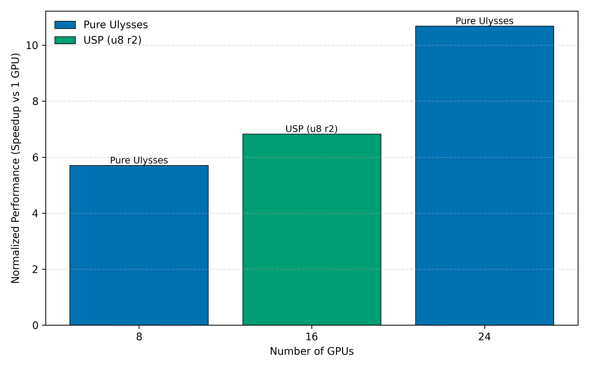

<!---
Copyright (c) 2026 Advanced Micro Devices, Inc. (AMD)

Permission is hereby granted, free of charge, to any person obtaining a copy
of this software and associated documentation files (the "Software"), to deal
in the Software without restriction, including without limitation the rights
to use, copy, modify, merge, publish, distribute, sublicense, and/or sell
copies of the Software, and to permit persons to whom the Software is
furnished to do so, subject to the following conditions:

The above copyright notice and this permission notice shall be included in all
copies or substantial portions of the Software.

THE SOFTWARE IS PROVIDED "AS IS", WITHOUT WARRANTY OF ANY KIND, EXPRESS OR
IMPLIED, INCLUDING BUT NOT LIMITED TO THE WARRANTIES OF MERCHANTABILITY,
FITNESS FOR A PARTICULAR PURPOSE AND NONINFRINGEMENT. IN NO EVENT SHALL THE
AUTHORS OR COPYRIGHT HOLDERS BE LIABLE FOR ANY CLAIM, DAMAGES OR OTHER
LIABILITY, WHETHER IN AN ACTION OF CONTRACT, TORT OR OTHERWISE, ARISING FROM,
OUT OF OR IN CONNECTION WITH THE SOFTWARE OR THE USE OR OTHER DEALINGS IN THE
SOFTWARE.
--->

# Multi-Node Distributed Inference for Diffusion Models with xDiT

<sup id="fn1">*The first two authors (Lehtiranta, Kemppi) contributed equally to this work.*</sup>

In this blog post, we show how to run multi-node inference for diffusion models on AMD Instinct MI300X accelerators. We begin by outlining the key considerations involved in scaling inference across multiple nodes and then walk through a concrete example using HunyuanVideo.

Diffusion models are widely used in generative AI, especially for image and video generation. Text-to-video models like HunyuanVideo can produce high-quality results, but they come with heavy computational requirements. These models are based on the Diffusion Transformer (DiT) architecture, and video generation in particular can suffer from high inference latency.

One effective way to reduce latency is to scale inference across multiple nodes, which allows both computation and memory usage to be distributed across GPUs. We demonstrate how to achieve this efficiently using [xDiT](https://rocm.docs.amd.com/en/latest/how-to/rocm-for-ai/inference/xdit-diffusion-inference.html), leveraging parallelization techniques and high-speed interconnects on AMD Instinct accelerators.

## Multi-node challenges

Running inference across multiple nodes requires careful coordination, especially when parallelization is involved. Sequence parallelization techniques such as DeepSpeed-Ulysses and Ring Attention allow us to split large attention workloads efficiently. Unified Sequence Parallelism (USP) combines these two approaches so they can be used together, and the xDiT library supports USP out of the box, making it relatively easy to adopt.

In distributed diffusion inference, the workload is split by breaking attention and other computationally expensive operations into smaller pieces that can run in parallel. Each node processes part of the computation, and the partial results are combined. This approach reduces latency and allows inference to scale with the available hardware.

In our setup, only the Diffusion Transformer is parallelized across nodes. The VAE runs on a single GPU, as its runtime contribution is relatively small compared to the diffusion process.

## Communication and Performance Optimization

Efficient communication is critical for multi-node inference. For GPU-to-GPU communication within a node, we rely on RCCL (the ROCm collective communication library). For communication between nodes, we use RoCE (RDMA over Converged Ethernet). While RoCE can fall back to TCP/IP, this fallback is significantly slower and quickly becomes a bottleneck. For high-performance inference, RCCL combined with RoCE is the preferred setup. These results assume a low-latency, high-bandwidth RDMA network between nodes.

We also use AITER, AMD's library of high-performance kernels designed for AI workloads. Its FlashAttention v3 implementation improves attention efficiency and reduces end-to-end inference latency.

## Unified Sequence Parallelism in Practice

Unified Sequence Parallelism (USP) depends on explicit communication patterns to scale efficiently across nodes. In our experiments, configurations based purely on Ulysses delivered the best performance, likely because of its low communication overhead. Ring Attention offers flexibility in how computation is distributed across nodes, but at the cost of higher communication volume.

In practice, USP requires choosing how to combine Ulysses and Ring Attention based on both the model architecture and the available hardware. A key constraint is the number of attention heads since the Ulysses degree must evenly divide the attention head count. This determines which configurations are possible using Ulysses alone.

For example, HunyuanVideo has 24 attention heads, while Wan 2.1 14B has 40 heads. As a result, HunyuanVideo naturally supports a Ulysses degree of 24, while Wan 2.1 supports a degree of 40. On nodes with 8 GPUs, this allows HunyuanVideo to scale cleanly to 3 nodes (24 GPUs), and the 40-head Wan 2.1 model scales to 5 nodes (40 GPUs) using Ulysses alone.

Scaling to other node counts requires supplementing Ulysses with Ring Attention. In this case, Ulysses is best used as the inner dimension where its lower communication volume and bandwidth efficiency can be fully exploited while Ring Attention makes scaling possible beyond the attention-head constraint. When using Ulysses and Ring Attention together, the total GPU count must equal the Ulysses degree multiplied by the Ring degree.

## Performance Observations and Practical Considerations

In our experiments, using Ulysses across three nodes reduces inference latency to nearly half of the single-node baseline.[^A] In contrast, the speedup from Ring Attention is noticeably smaller, as it introduces more cross-node communication and data movement, which quickly become limiting factors. As a result, Ring Attention is better suited for enabling larger scale-out configurations than for minimizing latency.

Figure 1 illustrates the normalized performance of the best-performing configuration at each GPU count, showing that Ulysses scales more effectively for low-latency inference, while Ring Attention enables node configurations that are not possible with Ulysses alone.


*Figure 1: Normalized performance for the best-performing configuration at each GPU count.[^A]*

Beyond latency improvements, multi-node inference also enables memory scaling, allowing larger batch sizes or longer video sequences without CPU offloading.

Multi-node inference is sensitive to configuration details, and problems are not always easy to diagnose. RoCE may silently fall back to TCP/IP if drivers or network settings are incorrect, leading to large performance drops. Misconfigured attention head counts or Ulysses degrees can cause failures, and adding more nodes does not automatically improve performance if communication overhead is large.

## How to choose a parallelization strategy

Choosing the right parallelization strategy depends on both the model and the available hardware:

- Multiple nodes with matching attention head alignment: Use Ulysses across nodes when the number of attention heads divides evenly by the total GPU count.
- Arbitrary node count: Combine Ulysses with Ring Attention using USP.
- Network-limited environments: Prefer fewer nodes and avoid heavy Ring Attention usage.

## Running the example

PyTorch's torchrun makes it straightforward to launch multi-node inference, but some manual setup is still required. In this example, containers and torchrun are started independently on each node.

### Host setup on all nodes

Each node must have the AMD MI300X GPU drivers and RoCE networking drivers installed on the host OS. Follow the steps in [Multi-node network configuration for AMD Instinct accelerators](https://instinct.docs.amd.com/projects/gpu-cluster-networking/en/latest/how-to/multi-node-config.html) to set up the required host drivers.

Verify that RDMA devices are visible on the host:

```bash
ibv_devices
```

You should see multiple devices listed (for example, bnxt_re\* or rdma\*). This confirms that the RDMA networking stack is available and functioning on the host.

### Step 1: Start containers on each node

SSH into each node (both the master and all worker nodes) to start a local container using the `rocm/pytorch-xdit:v25.10` image.

First, set a shared Hugging Face cache location on each node (preferably on a shared filesystem such as VFS):

```bash
export HF_CACHE=~/.cache/huggingface
```

Then, start the container on each node using the same command:

```bash
docker run --ipc host --network=host \
  --device /dev/dri --device /dev/kfd --device /dev/infiniband \
  --ulimit memlock=-1:-1 \
  --cap-add SYS_PTRACE \
  --group-add video \
  --security-opt seccomp=unconfined \
  --privileged \
  --shm-size 128G \
  --mount type=bind,src=${HF_CACHE},dst=/hf_cache \
  -e HF_HOME=/hf_cache \
  -e HSA_NO_SCRATCH_RECLAIM=1 \
  -e NCCL_IB_HCA=bnxt_re0,bnxt_re1,bnxt_re2,bnxt_re3,bnxt_re4,bnxt_re5,bnxt_re6,bnxt_re7 \
  -e NCCL_SOCKET_IFNAME=ens51f1np1 \
  -e GLOO_SOCKET_IFNAME=ens51f1np1 \
  -e NCCL_IB_GID_INDEX=3 \
  -e NCCL_IB_TIMEOUT=22 \
  -e NCCL_IB_RETRY_CNT=12 \
  --name hunyuan-video-multinode-inference \
  -it rocm/pytorch-xdit:v25.10 \
  bash
```

Important configuration details:

- `--network=host` is required for torchrun rendezvous across nodes.
- `NCCL_IB_GID_INDEX=3` sets the Global ID index for a RoCE device.
- The RDMA device names (`bnxt_re*`, or `rdma*`) and network interface name must match the hardware and configuration on each node.
- `NCCL_IB_HCA` should list the RDMA devices used for inter-node communication. Use the `ibv_devices` command to list RDMA device names.
- `NCCL_SOCKET_IFNAME` must point to the network interface used for node-to-node communication. Use the `ip link` command to identify the network interface to use.

### Step 2: Validate drivers inside the container

Inside the container, install the minimal required RDMA userspace tools:

```bash
apt update && apt install -y --no-install-recommends \
  libibverbs1 ibverbs-utils ibverbs-providers rdma-core
```

Next, verify that RDMA devices are visible inside the container:

```bash
ibv_devices
```

The output should match what you see on the host.

However, if you see a warning like the one below, it indicates a mismatch between the RDMA kernel drivers on the host and the RDMA userspace libraries inside the container:

```text
libibverbs: Warning: Driver bnxt_re does not support the kernel ABI of 6 (supports 1 to 1) for device /sys/class/infiniband/bnxt_re0
```

If the command lists devices with no warnings, and the host is using the default RDMA drivers provided by the OS distribution, you can proceed to step 3.

If you are not sure which provider and driver versions are installed, use commands `lspci | grep -i -E 'mellanox|broadcom'` and `lsmod | grep -E 'mlx5|bnxt'` to identify the RDMA vendor, then run `modinfo bnxt_re` (Broadcom) or `modinfo mlx5_ib` (Mellanox) to check the kernel driver version in use.

To install the required build dependencies run the following command:

```bash
apt install -y --no-install-recommends \
  build-essential pkg-config autoconf automake libtool unzip \
  libibverbs-dev
```

Next, download the vendor RDMA driver package (subject to the vendor’s license terms), copy it into the container, and build the RDMA userspace drivers (example shown for Broadcom). Verify that the driver package version matches the host.

```bash
unzip -j bcm5760x_230.2.52.0a.zip \
  bcm5760x_230.2.52.0a/drivers_linux/bnxt_rocelib/libbnxt_re-230.2.52.0.tar.gz
tar -xzf libbnxt_re-230.2.52.0.tar.gz
cd libbnxt_re-230.2.52.0
sh autogen.sh && ./configure --libdir=/usr/lib/x86_64-linux-gnu/libibverbs/
make && make install && ldconfig
```

This installs the vendor RDMA userspace library and replaces the inbox driver provided by the OS. Rerun `ibv_devices` to verify the devices are detected without warnings.

As an alternative to installing RDMA userspace drivers inside the container, it is also possible to mount RDMA userspace drivers from the host. In this case, ensure that the mounted driver is selected by libibverbs, as inbox RDMA userspace libraries installed in the container may otherwise take precedence.

### Step 3: Launch multi-node inference

Now that the containers are running on all nodes, launch torchrun inside each container.

Assuming N nodes, assign each node a unique `NODE_RANK` from 0 to N-1, and set `MASTER_ADDR` to the IP address of the node chosen as the master.

```bash
cd /app/Hunyuanvideo

NODE_RANK=0
MASTER_ADDR=x.y.z.w

torchrun \
  --nnodes=3 \
  --node_rank=$NODE_RANK \
  --master_addr=$MASTER_ADDR \
  --master_port=29475 \
  --nproc_per_node=8 \
  --rdzv_conf timeout=60 \
  run.py \
  --model tencent/HunyuanVideo \
  --prompt "In the large cage, two puppies were wagging their tails at each other." \
  --height 720 --width 1280 --num_frames 129 \
  --num_inference_steps 50 --warmup_steps 1 --n_repeats 1 \
  --ulysses_degree 24 \
  --enable_tiling --enable_slicing \
  --use_torch_compile \
  --bench_output results
```

This script launches the multi-node inference job across all specified nodes. The choice of Ulysses and Ring degrees directly affects performance and scalability, as discussed earlier in this post. The Ulysses degree must match the total GPU count across all nodes.

To verify that the communication uses RDMA devices rather than TCP, enable RCCL logging before launching torchrun:

```bash
export NCCL_DEBUG=INFO
export NCCL_DEBUG_SUBSYS=INIT,NET
export NCCL_DEBUG_FILE=/tmp/rccl.log
```

In the output, look for messages indicating the NET/IB transport, which confirms that RCCL is using RDMA. Note that NET/IB refers to the RDMA transport layer and appears for both InfiniBand and RoCE setups. If the logs instead show NET/Socket, RCCL has fallen back to TCP and RDMA is not being used.

## Summary

In this blog post, we showed how to run multi-node inference for diffusion models such as HunyuanVideo on AMD Instinct MI300X accelerators. While scaling inference across nodes can reduce latency, in practice it is constrained by networking, driver compatibility, and parallelization choices.

We demonstrated how Ulysses scales when attention heads divide cleanly across GPUs. For example, HunyuanVideo, with its 24 attention heads, is a natural fit for three nodes. We also walked through the practical steps for running successful multi-node inference, including driver validation, RDMA and networking configuration, and launching torchrun consistently across nodes using Docker.

## Resources

- [USP: A Unified Sequence Parallelism Approach for Long Context Generative AI](https://arxiv.org/abs/2405.07719v5)
- [Multi-node network configuration for AMD Instinct accelerators](https://instinct.docs.amd.com/projects/gpu-cluster-networking/en/latest/how-to/multi-node-config.html)
- [RoCE cluster network configuration guide for AMD Instinct accelerators](https://instinct.docs.amd.com/projects/gpu-cluster-networking/en/develop/how-to/roce-network-config.html)
- [xDiT diffusion inference](https://rocm.docs.amd.com/en/latest/how-to/rocm-for-ai/inference/xdit-diffusion-inference.html) in ROCm Documentation

[^A]: Scaling results are based on benchmarking done by the authors on 09-Jan-2026 using HunyuanVideo (tencent/HunyuanVideo) with xDiT for multi-node distributed inference. Video generation was configured at 720×1280 resolution, 129 frames, and 50 diffusion inference steps. Performance was benchmarked across 1 node (8 GPUs) and 3 nodes (24 GPUs) using Unified Sequence Parallelism (USP) with varying Ulysses and Ring Attention configurations, combined with AITER FlashAttention v3 optimizations. Server manufacturers may vary configurations, yielding different results. Performance may vary based on the use of the latest drivers, network topology, and optimizations. AMD system configuration: AMD EPYC 9534 64-Core Processor, AMD Instinct MI300X 8×GPU per node (up to 3 nodes, 24 GPUs total), 2304 GiB DDR5 RAM (24 DIMMs, 4800 MT/s, 96 GiB/DIMM), Host OS Ubuntu 22.04.5 LTS with Linux kernel 5.15.0-161-generic, Host GPU driver ROCm 6.4.2 + amdgpu 6.12.12, Container image rocm/pytorch-xdit:v25.10 (Ubuntu 24.04.3 LTS), AMD ROCm 7.9.0, PyTorch 2.10.0a0, xDiT (xfuser) 0.4.4, AITER 0.1.5, RoCE (RDMA over Converged Ethernet) inter-node networking.

## Disclaimers

Third-party content is licensed to you directly by the third party that owns the
content and is not licensed to you by AMD. ALL LINKED THIRD-PARTY CONTENT IS
PROVIDED “AS IS” WITHOUT A WARRANTY OF ANY KIND. USE OF SUCH THIRD-PARTY CONTENT
IS DONE AT YOUR SOLE DISCRETION AND UNDER NO CIRCUMSTANCES WILL AMD BE LIABLE TO
YOU FOR ANY THIRD-PARTY CONTENT. YOU ASSUME ALL RISK AND ARE SOLELY RESPONSIBLE
FOR ANY DAMAGES THAT MAY ARISE FROM YOUR USE OF THIRD-PARTY CONTENT.
