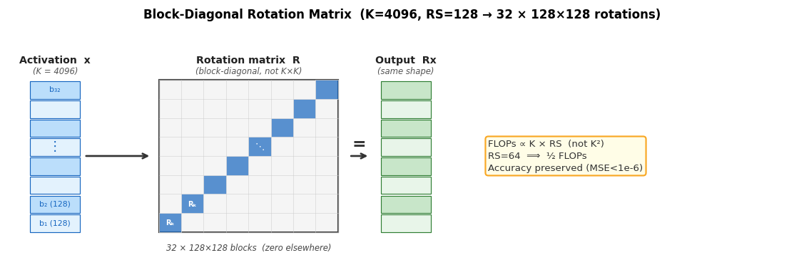
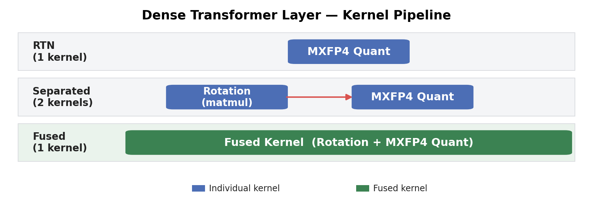
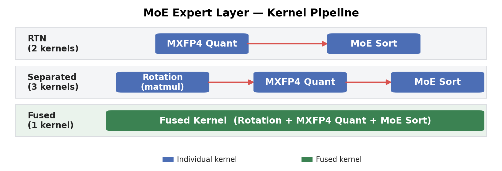
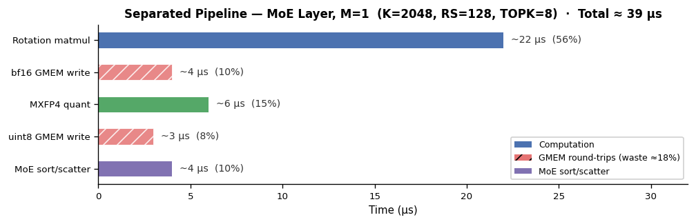
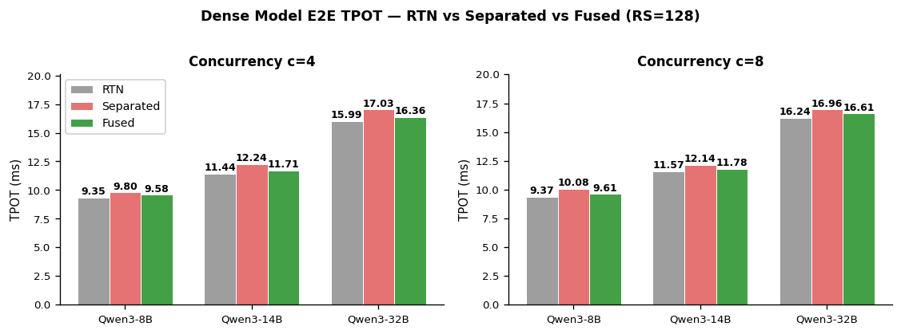
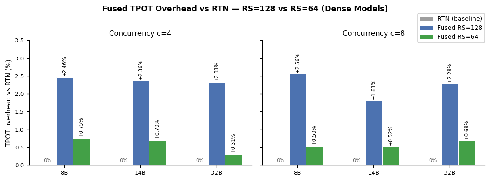
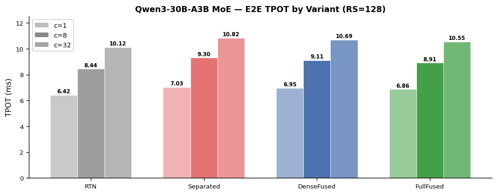
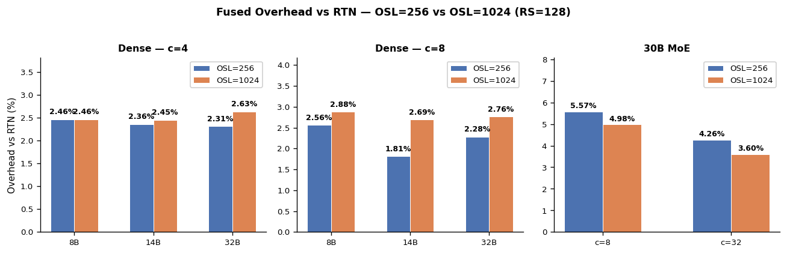

<!---
Copyright (c) 2026 Advanced Micro Devices, Inc. (AMD)

Permission is hereby granted, free of charge, to any person obtaining a copy
of this software and associated documentation files (the "Software"), to deal
in the Software without restriction, including without limitation the rights
to use, copy, modify, merge, publish, distribute, sublicense, and/or sell
copies of the Software, and to permit persons to whom the Software is
furnished to do so, subject to the following conditions:

The above copyright notice and this permission notice shall be included in all
copies or substantial portions of the Software.

THE SOFTWARE IS PROVIDED "AS IS", WITHOUT WARRANTY OF ANY KIND, EXPRESS OR
IMPLIED, INCLUDING BUT NOT LIMITED TO THE WARRANTIES OF MERCHANTABILITY,
FITNESS FOR A PARTICULAR PURPOSE AND NONINFRINGEMENT. IN NO EVENT SHALL THE
AUTHORS OR COPYRIGHT HOLDERS BE LIABLE FOR ANY CLAIM, DAMAGES OR OTHER
LIABILITY, WHETHER IN AN ACTION OF CONTRACT, TORT OR OTHERWISE, ARISING FROM,
OUT OF OR IN CONNECTION WITH THE SOFTWARE OR THE USE OR OTHER DEALINGS IN THE
SOFTWARE.
--->

# Production-Ready MXFP4 Online Rotation with Fused Kernels on AMD Instinct™ MI355X

Serving large language models affordably increasingly depends on low-bit quantization, and MXFP4 is one of the most aggressive options — but the smaller models that need it most rely on *online rotation* to stay accurate, and that rotation has historically carried a steep latency tax. In this post you will learn how a single fused Gluon (Triton) kernel on AMD Instinct™ MI355X (CDNA4) removes that tax: we walk through the kernel-fusion design, the RS=64 optimization, the GEAK + Hyperloom tuning workflow, and end-to-end measurements showing online-rotation overhead falling from a prohibitive +5–10% to just +0.3–0.8% on Dense models — with no measurable accuracy loss. By the end, you will understand how to make accuracy-preserving MXFP4 online rotation cheap enough to ship by default.

## Background

Large language models keep growing, and serving them affordably increasingly depends on low-bit quantization. **MXFP4** — a 4-bit microscaling format — is one of the most aggressive options, shrinking memory and bandwidth roughly 4× versus bf16. But aggressive compression has a catch: the very largest models absorb MXFP4 with little degradation, while smaller models such as the Qwen3 8B/14B/32B Dense family lose noticeable accuracy under plain round-to-nearest (RTN) quantization. **Rotation** is the technique that recovers that loss — applying an orthogonal transform to activations and weights to suppress the outliers that break low-bit quantization. The catch, in turn, is that its most accurate form — **online rotation**, applied at every layer on every decode step — brings back a real cost in latency. **Eliminating that latency cost is what this post is about.**

In our previous post **[Advanced MXFP4 Quantization: Combining Fine-Tuned Rotations with SmoothQuant for Near-Lossless Compression](https://rocm.blogs.amd.com/software-tools-optimization/mxfp4-online-rotation/README.html)** we demonstrated that **learned rotation** significantly improves MXFP4 quantization accuracy for Qwen3 Dense models (8B/14B/32B) on AMD Instinct MI355X (gfx950). The training learns two rotations: **R₂** is merged offline into v_proj output / o_proj input weights and incurs **zero inference cost**. **R₁** is applied **online at every layer** to inputs of `qkv_proj` and `gate_up_proj`. R₁ can also be fused offline (the QuaRot/SpinQuant approach of absorbing R₁ into the preceding RMSNorm), but the previous post showed online R₁ yields measurably better MXFP4 accuracy than the offline-fused variant — so online R₁ is our design choice for accuracy. Together, the trained R₁ + R₂ recover most of the perplexity gap between RTN (no rotation training) and the bf16 baseline. For example, Qwen3-8B Wikitext PPL (Quark token-level methodology, same as the previous post) improves from RTN = 10.72 to Sep = 10.17, against a BF16 reference of 9.72.

**This online R₁ at every layer per decode step is the cost our fused kernel eliminates.** One important structural property: **R₁ is block-diagonal, not a full K×K matrix.** For a hidden dimension of K=4096 with RS=128, R₁ is applied as 32 independent 128×128 Hadamard rotations to non-overlapping channel blocks, as illustrated in our [previous post](https://rocm.blogs.amd.com/software-tools-optimization/mxfp4-online-rotation/README.html). This means per-rotation FLOPs scale as K×RS rather than K², and halving RS (from 128 to 64) halves the per-rotation compute cost while preserving the full accuracy benefit. The figure below shows this block-diagonal structure for K=4096 with RS=128.

The separated implementation achieves this accuracy improvement but comes at a cost. For Dense models (8B/14B/32B), each quantization layer goes from **1 kernel** (RTN: just MXFP4 quant) to **2 kernels** (separated: rotation matmul + MXFP4 quant), with one intermediate bf16 global-memory round-trip in between. For MoE models (30B-A3B), where expert sort is already a separate kernel, the pipeline grows from **2 kernels** (RTN: quant + sort) to **3 kernels** (separated: rotation + quant + sort), with two intermediate GMEM round-trips. Every decode step now carries this overhead across all layers.

**This post is about closing that performance gap — and the result is what makes online rotation production-ready.** We implemented a **Gluon (Triton) fused kernel** on AMD CDNA4 that performs all operations in a single launch, keeping intermediate values in registers. The result:

- ✅ **Same level of accuracy as separated** (logically equivalent rotation — just fused)
- ✅ **Latency close to RTN** (rotation overhead reduced by ~60% vs separated)
- ✅ **Further reduction with RS=64**: Dense model overhead drops to just +0.3–0.8% vs RTN

**The bottom line: fusion turns online rotation from a feature you pay a steep latency tax for into one that is effectively free.** The separated implementation's +5–10% TPOT overhead — high enough to discourage enabling rotation in production — drops to a tolerable +0.3–0.8% on Dense models (and is nearly halved on MoE at RS=128, from +10% to +5.6%). With that overhead reduced to near-zero, accuracy-preserving MXFP4 online rotation becomes practical to ship by default on AMD Instinct MI355X.

---

## The Cost: Separated Online Rotation at Every Layer

### Dense Models (8B / 14B / 32B)

For pure Dense models, adding online rotation changes the per-layer pipeline from 1 kernel to 2:

As the figure above shows, adding online rotation means an extra kernel launch and one bf16 GMEM round-trip per layer per decode step.

### MoE Models (30B-A3B)

For MoE models, expert sort is already a separate kernel even in the RTN path. Adding online rotation grows the pipeline from 2 kernels to 3:

As the figure above shows, adding online rotation means an extra kernel launch plus an additional bf16 GMEM round-trip per MoE layer per decode step.

---

## The Solution: Kernel Fusion

### Fusion Principle

We implemented the fused kernel using **Gluon (Triton)**: the f32 accumulator values produced by the rotation matmul are fed directly into the FP4 quantization instruction in registers, eliminating the intermediate bf16 GMEM round-trip. For MoE models, the expert sort scatter is also fused into the same kernel launch. The pipeline comparison across all three variants (RTN / Separated / Fused) is shown above in the Dense and MoE pipeline figures.

### Key Implementation Decisions

**1. Shared memory layout for rotation matrix tiles**  
The rotation matrix `R` (shape `[K, K]`) is tiled into shared memory (LDS) so each wave reads its tile once and reuses it across MFMA iterations. We use `ds_read_tr16_b64` — a CDNA4 hardware instruction that reads and transposes a 16-element tile from LDS in a single operation — to feed the MFMA instruction in the correct layout without an explicit transpose step.

**2. MFMA tile selection**  
`v_mfma_f32_16x16x32_bf16` was chosen over larger tiles (32×32×16) because the rotation matmul at M=1 is severely compute-underutilized; the 16×16 tile allows more waves to run concurrently, improving occupancy. The larger tile looked promising on paper but ran into lane mapping complexity that GEAK explored and did not pursue further.

**3. In-register FP4 quantization**  
The f32 accumulators from MFMA are fed directly into `v_cvt_scalef32_pk_fp4_f32` without any register spill. We pre-compute the per-group scale in a reduction across the wave before the conversion, keeping everything in VGPRs.

**4. Gluon (Triton) auto-tuning**  
Gluon uses Triton JIT compilation to automatically select well-suited tile configurations across different batch sizes, and integrates cleanly with CUDAGraph's fixed schedule replay.

---

## Profiling: Time Breakdown

Before writing the fused kernel, we profiled the separated implementation using `rocprofv3` to understand where time was actually going. The breakdown per MoE layer at M=1 (single-token decode) is shown in the figure below:

Two observations stood out:

1. **The rotation matmul dominates (56%)**, but it is unavoidable — it is the computation that delivers the accuracy benefit.
2. **The GMEM writes between kernels (18% combined: bf16 write 10% + uint8 write 8%) are pure waste** — they exist only because the three operations are in separate kernels that cannot share register state. The corresponding read costs are hidden in the subsequent kernels' launch and execution time, so the true waste exceeds 18%.

This pointed directly to fusion as the right optimization strategy.

---

## Kernel-Level Microbenchmark

We developed the fused kernel iteratively, validating correctness at each step with standalone unit tests before touching the vLLM stack. The suite checks numerical output against the reference separated pipeline for randomized inputs across all supported shapes (MSE < 1e-6).

Kernel timing measured on AMD Instinct MI355X (gfx950):

**Dense path** (K=4096, rotation_size=128):

| M | Separated (μs) | Fused (μs) | Speedup |
|:-:|:--------------:|:----------------:|:-------:|
| 1 | 12.23 | **~6.3** | **~2.0×** |
| 4 | 12.39 | **~6.6** | **~1.9×** |
| 16 | 12.40 | **~6.4** | **~1.9×** |
| 32 | 13.45 | **~6.5** | **~2.1×** |

**MoE path** (K=2048, rotation_size=128, TOPK=8):

| M | Separated (μs) | Fused (μs) | Speedup |
|:-:|:--------------:|:-----------:|:-------:|
| 1 | 39.1 | **8.0** | **4.9×** |
| 4 | 38.4 | **7.9** | **4.9×** |
| 32 | 36.8 | **7.8** | **4.7×** |
| 256 | 36.6 | **9.4** | **3.9×** |

**Dense layer: ~2× speedup** — f32 accumulators go directly into FP4 quantization, eliminating one bf16 GMEM round-trip. **MoE layer: ~4–5× speedup** — at K=2048 the separated path is almost entirely kernel-launch overhead and GMEM round-trips (the actual compute is minimal). Fusion eliminates all of that.

---

## Accelerating Development with GEAK and Hyperloom

### GEAK: AI-Assisted Kernel Optimization

**[GEAK](https://github.com/AMD-AGI/GEAK)** (GPU Expert AI Kit) is an open-source AMD agent framework for automated GPU kernel optimization. Given a kernel implementation, GEAK autonomously analyzes performance profiles, generates optimization hypotheses, applies them as code patches, benchmarks each change, and accepts or rejects based on measured speedup — compressing what would otherwise take days of manual trial-and-error into a structured, reproducible loop.

For the Gluon fused rotation+quant kernel, the key insight GEAK surfaced: the bottleneck was not compute but **rotation matrix load bandwidth**. Switching to bf16×8 vectorized loads cut the memory access time by **−22%** at M=1 — the most latency-sensitive regime in decode serving. The larger-MFMA-tile direction described under [Key Implementation Decisions](#key-implementation-decisions) was also explored in this loop and rejected on the same grounds.

### Hyperloom: Configuration Space Search

Once the kernel itself was optimized, we used **[Hyperloom](https://github.com/AMD-AGI/Hyperloom)** — an AMD open-source automated benchmarking framework — to systematically search the server-level configuration space: which combination of Dense kernel implementation, MoE kernel implementation, dispatch flags, attention backend, and quantization settings produced the lowest end-to-end latency in this sweep on Qwen3-30B-A3B.

Hyperloom swept **9 configurations × 4 concurrencies** on AMD Instinct MI355X, running each configuration with matched warmup and measurement rounds. The sweep identified `fused-default` (Dense=Gluon fused + MoE=aiter, CUDAGraph enabled) as the highest-performing configuration in this sweep — **+2.3% faster than separated** at c=16 and c=32 — and confirmed that certain options beneficial in other settings (e.g., alternative attention backends) offered no net gain on this hardware and workload.

Together, GEAK and Hyperloom compressed what would have been several weeks of manual kernel tuning and configuration search into a structured, reproducible process with clear accept/reject evidence at every step.

---

## Accuracy Validation: Rotation Training Reproduces + Fusion Preserves Accuracy

This section validates two things:

1. **Rotation training reproduces** — our Separated pipeline delivers the same PPL improvement reported in the previous post.
2. **Fusion preserves accuracy** — Fused matches Separated within measurement precision on both Dense and MoE.

All MXFP4 quantization and rotation training behind the checkpoints evaluated below — Dense and MoE alike — is done with **AMD Quark**, developed by the AMD Quark Team.

### Qwen3-8B Wikitext PPL (Dense, Quark token-level methodology)

Using **Quark's wikitext PPL methodology** (2048-token chunks, Quark simulated MXFP4 inference — appendix A.3 of the [previous post](https://rocm.blogs.amd.com/software-tools-optimization/mxfp4-online-rotation/README.html)):

| Configuration | Wikitext PPL | Δ vs RTN |
|:-------------:|:------------:|:--------:|
| BF16 reference | 9.72 | — |
| RTN MXFP4 (no rotation) | 10.72 | — |
| **Separated** (rotation training, online R₁) | **10.17** | **−0.55 ✅** |
| **Fused** (rotation training, fused R₁ kernel) | **10.16** | **−0.56** (Δ vs Sep < 0.01) |

This uses the same Quark token-level wikitext methodology as the previous post (whose BF16 reference is 9.7273, matching our 9.72), so the numbers are directly continuous: our Separated PPL (10.17) reproduces the previous post's trained-rotation result (~10.16) within 0.01, confirming the rotation training pipeline is reproduced correctly.

### Qwen3-30B-A3B PPL + Hellaswag (MoE, lm-eval-harness)

For Qwen3-30B-A3B (MoE, ~3B active parameters per token), we measure two complementary metrics: **Wikitext perplexity** (word-level, lm-eval-harness) and **Hellaswag** (10-shot, acc_norm — a commonsense-reasoning multiple-choice task):

| Configuration | Wikitext word_PPL ↓ | Hellaswag acc_norm (10-shot) ↑ |
|:-------------:|:-------------------:|:------------------------------:|
| BF16 reference | 11.59 | 0.674 |
| RTN MXFP4 (no rotation) | 13.18 | 0.648 |
| **Separated** (rotation, online R₁) | **12.68** | **0.658** (+1.0 pp) |
| **Fused** (MoE fused kernel) | **12.68** | **0.670** (+2.2 pp) |
| **Δ vs RTN** | **−0.50 ✅** | **+1.0 ~ +2.2 pp ✅** |

*All rows measured with lm-eval-harness (Wikitext word-level perplexity; Hellaswag 10-shot acc_norm, limit=500). Hellaswag "+pp" deltas are relative to RTN. Note: the previous post evaluated its Dense models (8B/14B/32B) at 5-shot, but Qwen3-30B-A3B is a new model not covered there, so the four rows above form a self-consistent 10-shot comparison. As a robustness check, re-running RTN at 5-shot gives acc_norm 0.652 (vs 0.648 at 10-shot) — shot count does not change the conclusions.*

Rotation training delivers a real accuracy improvement on the MoE model: against the BF16 reference (11.59 word_PPL), RTN MXFP4 loses 1.59 PPL, and rotation recovers ~0.5 of that gap (PPL drops 13.18 → 12.68, consistent with the Dense result). The same trend holds on Hellaswag: BF16 sets the ceiling at 0.674, RTN drops to 0.648, and rotation recovers most of that gap — Separated reaches 0.658 and Fused reaches 0.670, landing within stderr of the BF16 ceiling. The fused MoE kernel matches or marginally exceeds the separated pipeline (the small Sep vs Fused gap on Hellaswag is within the ±2.1 pp stderr for this task).

### Key Observations

1. **Rotation training improves PPL on both Dense and MoE** — a consistent ~0.5 PPL recovery across model sizes.
2. **Hellaswag also improves on 30B MoE** — +1.0 to +2.2 pp acc_norm, recovering most of the gap to the BF16 ceiling (0.674) and providing a downstream-task signal that complements PPL.
3. **Fused ≈ Separated on both metrics** — PPL difference < 0.01 and Hellaswag difference within stderr, confirming the fused kernel is logically equivalent to the separated pipeline and delivers the same level of accuracy. The close numerical match observed at the kernel-output level (MSE < 1e-6) is confirmed at the model level.

> **Note on generative reasoning tasks:** We focus on PPL and Hellaswag (multiple-choice) because they avoid the sensitivity to evaluation setup that affects generative benchmarks. As noted in the [previous post](https://rocm.blogs.amd.com/software-tools-optimization/mxfp4-online-rotation/README.html) and the Quark documentation, generative tasks like GSM8K and IFEval are sensitive to regex filtering, `max_gen_toks`, instruction templates, and reasoning-token handling. A robust generative-task evaluation (using `gsm8k_platinum` with proper setup, following the Quark recipe) is left as future work.

---

## Dense Model E2E Latency

### Experimental Setup

Benchmark: AMD Instinct MI355X, vLLM `bench_serve`, random ISL=1024 / OSL=256, **200 prompts × 3 runs → median**, full warmup before measurement. Measurement precision ±0.3% (stdev ≤0.075ms).

Three variants compared:

| Variant | Dense kernel | MoE kernel | Notes |
|:-------:|:------------:|:----------:|:------|
| **RTN** | No rotation | No rotation | Baseline, lowest accuracy |
| **Separated** | Separated (2 kernels) | Separated (3 kernels) | Rotation accuracy baseline |
| **Fused** | Fused (1 kernel) | Fused (1 kernel) | Full fusion (recommended) |

### RS=128 Baseline Results

The figure below compares RTN, Separated, and Fused end-to-end across the three Dense models; the underlying TPOT numbers follow in the table.

**Dense models — TPOT (ms) and overhead vs RTN, RS=128 (high-precision 200p×3runs):**

| Model | Concurrency | RTN | Separated | Fused | Sep overhead | Fused overhead |
|:-----:|:-----------:|:---:|:---------:|:-----:|:------------:|:--------------:|
| 8B    | c=4 | 9.35  | 9.80  | **9.58**  | +4.81% | **+2.46%** |
| 8B    | c=8 | 9.37  | 10.08 | **9.61**  | +7.58% | **+2.56%** |
| 14B   | c=4 | 11.44 | 12.24 | **11.71** | +6.99% | **+2.36%** |
| 14B   | c=8 | 11.57 | 12.14 | **11.78** | +4.93% | **+1.81%** |
| 32B   | c=4 | 15.99 | 17.03 | **16.36** | +6.50% | **+2.31%** |
| 32B   | c=8 | 16.24 | 16.96 | **16.61** | +4.43% | **+2.28%** |

**Key observations:**

1. **Separated carries a +5–8% TPOT overhead** vs RTN across all three Dense models (range: +4.43% to +7.58%), consistent with every decode step running an extra rotation matmul + one bf16 GMEM round-trip per layer.

2. **Fusion eliminates ~48–66% of the rotation overhead**, reducing the penalty to +1.8–2.6% — a consistent recovery across 8B, 14B, and 32B.

3. **The residual ~2.3% is dominated by the rotation matmul itself** — fusion has already eliminated the extra kernel-launch overhead and the bf16 GMEM round-trip; what's left is the matmul's own FLOPs plus the associated rotation-matrix loads, both of which shrink with `rotation_size` (see next section). Fused is the recommended default for Dense-only deployments.

---

## Rotation Size: RS=128 vs RS=64

### Tile Size and Compute Cost

The online rotation matmul operates on tiles of size `rotation_size` (RS) — recall from the [Background](#background) that R is block-diagonal with RS×RS blocks. For Qwen3 series, K=4096 (Dense) or K=2048 (MoE), so RS=128 means the rotation is applied in 128-channel tiles. **RS=64 halves the tile size**, cutting the rotation matmul FLOPs roughly in half. Since the Hadamard rotation's mathematical correctness is independent of tile size, accuracy is fully preserved (verified: MSE < 1e-6 between RS=64 and RS=128 outputs).

### Measurement Setup

We compared RTN and Fused under RS=64 vs RS=128 across all four models. Benchmark: AMD Instinct MI355X, ISL=1024, OSL=256, 200 prompts × 3 runs → median, full warmup.

### Results — Fused TPOT Overhead vs RTN

**Dense models (RS=128 → RS=64 comparison):**

| Model | RS=128 overhead (c=4) | RS=64 overhead (c=4) | Saving | RS=128 overhead (c=8) | RS=64 overhead (c=8) | Saving |
|:-----:|:---------------------:|:--------------------:|:------:|:---------------------:|:--------------------:|:------:|
| 8B | +2.46% | +0.75% | **−1.71pp** | +2.56% | +0.53% | **−2.03pp** |
| 14B | +2.36% | +0.70% | **−1.66pp** | +1.81% | +0.52% | **−1.30pp** |
| 32B | +2.31% | +0.31% | **−2.00pp** | +2.28% | +0.68% | **−1.60pp** |

As the figure above shows, **RS=64 reduces Fused overhead from ~2.3% to ~0.3–0.8%** across all Dense model sizes — a consistent saving of **~1.3–2pp**. At RS=64, the rotation cost is nearly invisible at E2E level.

**30B MoE (RS=64):** The 30B RTN baseline drifted +1.78% between P1 and P2 experiments (MoE models have higher measurement variance ±1–3% due to expert routing randomness), masking the RS=64 effect. Extrapolating from the dense model trend, the expected saving for 30B is also ~1.5–2pp (MoE E2E results are reported in the next section).

### Recommendation

**RS=64 is strongly recommended as the new default** for production deployments:

- Overhead drops from ~2.3% to ~0.3–0.8% for Dense models (a 3–7× reduction)
- No accuracy impact — RS=64 applies the same Hadamard rotation, just in smaller tiles
- The quantization accuracy benefit of online rotation is preserved in full

---

## MoE Model E2E Latency

### MoE Experimental Setup

Qwen3-30B-A3B (MoE, ~3B active parameters per token), AMD Instinct MI355X, ISL=1024 / OSL=256, **200 prompts × 3 runs → median**, full warmup, precision ±0.3%.

### MoE RS=128 Baseline Results

**Qwen3-30B-A3B MXFP4 — TPOT (ms)**:

| Config | c=1 | c=8 | c=32 | Overhead vs RTN (c=8) |
|:------:|:---:|:---:|:----:|:---------------------:|
| RTN | 6.42 | 8.44 | 10.12 | — |
| Separated | 7.03 | 9.30 | 10.82 | +10.19% |
| DenseFused | 6.95 | 9.11 | 10.69 | +7.94% |
| **FullFused** | **6.86** | **8.91** | **10.55** | **+5.57%** |

**Key observations:**

1. **30B MoE carries a heavier separation overhead (~+10%)** because the MoE layers run a 3-kernel chain (rotation → quant → expert sort) plus two GMEM round-trips, accumulated across 48 MoE layers per decode step.

2. **DenseFused reduces overhead to ~+8%** (recovering ~2.25pp) — this comes entirely from fusing the Dense Transformer layers.

3. **FullFused further reduces to ~+5.6%** (recovering another ~2.3pp vs DenseFused). This is the **independent contribution of MoE fusion** — confirmed with 200p×3runs high-precision measurement, well above the ±0.3% noise floor.

The DenseFused → FullFused gap of 2.3pp confirms that MoE expert layer rotation contributes ~2.3pp of independent E2E overhead in 30B. **Both Dense and MoE layers must be fused to achieve the full benefit.** (OSL invariance is analyzed jointly with the Dense models in the Output Sequence Length section below.) The full four-variant TPOT comparison is shown in the figure below.

---

## Output Sequence Length: Rotation Overhead Is OSL-Invariant

We compared Fused overhead vs RTN at OSL=256 and OSL=1024 (ISL=1024 fixed, RS=128) across all four models, as shown in the figure below:

**Rotation overhead is approximately OSL-invariant.** The Hadamard rotation kernel runs once per decode step; the number of decode steps (which scales with OSL) does not change its per-step cost. Differences between OSL=256 and OSL=1024 are ≤1pp and within measurement noise for all models — confirming that the overhead numbers reported throughout this blog (measured at OSL=256) apply equally to long-generation workloads (OSL=1024+). **Fused rotation is a good investment regardless of output length.**

---

## Summary

In this blog you learned how to make accuracy-preserving MXFP4 online rotation practical for production inference on AMD Instinct™ MI355X. Online rotation recovers a meaningful share of the MXFP4 accuracy gap to the BF16 baseline — closing the RTN→BF16 perplexity gap by **~56%** on Qwen3-8B (RTN 10.72 → 10.16 vs BF16 9.72, token-level) and **~31%** on Qwen3-30B-A3B (RTN 13.18 → 12.68 vs BF16 11.59, word-level) — but the separated implementation pays for that accuracy with a +5–10% TPOT cost at every decode step. You saw how a single Gluon (Triton) fused kernel, together with an RS=64 rotation tile, closes that **performance** gap to near-zero on Dense models and nearly halves it on MoE (from +10% to +5.6% at RS=128), with **no measurable accuracy change** (Fused vs Separated: PPL Δ < 0.01, and a Hellaswag difference of 1.2 pp that is within the ±2.1 pp stderr for that task). Along the way you also saw how GEAK and Hyperloom turned what would have been weeks of manual kernel tuning and configuration search into a structured, reproducible loop with clear accept/reject evidence at every step.

| Model | Accuracy: RTN → Fused vs BF16 | Separated overhead vs RTN | Fused (recommended) |
|:------|:-----------------------------:|:-------------------------:|:-------------------:|
| Qwen3-8B / 14B / 32B (Dense) | 10.72 → 10.16 (BF16 9.72), ~56% gap recovered | +5–8% | **+0.3–0.8%** (RS=64) |
| Qwen3-30B-A3B (MoE) | 13.18 → 12.68 (BF16 11.59), ~31% gap recovered | +10.2% | **+5.6%** (RS=128) — ~+3–4% est. with RS=64 |

*Dense PPL is Quark token-level; MoE PPL is lm-eval-harness word-level — the two columns are not directly comparable, but each is internally consistent against its own BF16 reference.*

The takeaway is that with Gluon fusion plus RS=64, online rotation for MXFP4 no longer carries a meaningful runtime cost on AMD Instinct MI355X: you keep most of the BF16 accuracy while staying close to RTN latency, which is what makes it practical to ship by default. There is still headroom to go further. Not all 48 MoE layers in Qwen3-30B-A3B benefit equally from rotation — some already have well-conditioned activations where rotation adds compute for negligible accuracy return — so our next step is **selective rotation**: applying rotation only to the layers where it demonstrably improves quantization quality, and falling through to a cheaper quant-only path elsewhere. This needs only per-layer calibration and a runtime layer mask, and the fused kernel is already structured to support it with a single top-level branch. We will explore selective rotation, along with a robust generative-task evaluation, in a future post — so stay tuned.

---

## Reproducing This Work

Results presented in this blog post can be reproduced using **AMD Quark** and the [rotation example in the AMD Quark repository](https://github.com/amd/Quark/tree/release/0.11/examples/torch/language_modeling/rotation). The vLLM integration with online rotation support is available at the [vLLM online rotation branch](https://github.com/fxmarty-amd/vllm/tree/blog-post-online-rotation-branch).

Runtime environment: `rocm/vllm-dev:nightly_main_20260121`, single AMD Instinct MI355X accelerator. Environment variables used: `VLLM_ROCM_USE_AITER=1`, `VLLM_ROCM_USE_AITER_FP4_ASM_GEMM=1`, and `VLLM_FUSED_ROTATION=1` — the unified switch that enables both the Gluon Dense and Gluon MoE fused kernels (legacy per-path switches `VLLM_USE_FUSED_ROTATION_QUANT=1` for Dense-only and `VLLM_MOE_FORCE_GLUON_ROTATION=1` for MoE-only are also available).

## Acknowledgements

The authors would like to thank the AMD Quark Team for the quantization and rotation-training tooling used in this work, and for their insightful feedback and technical assistance. We would also like to thank the AMD GEAK team for their support on kernel optimization, and the AMD Hyperloom team for their support on configuration space search.

## Contact

Feel free to reach out through [AMD Quark GitHub issues](https://github.com/amd/Quark/issues) or the [ROCm community forums](https://community.amd.com/t5/rocm/ct-p/amd-rocm).

---

## Disclaimers

The information presented in this document is for informational purposes only and may contain technical inaccuracies, omissions, and typographical errors. The information contained herein is subject to change and may be rendered inaccurate for many reasons, including but not limited to product and roadmap changes, component and motherboard version changes, new model and/or product releases, product differences between differing manufacturers, software changes, BIOS flashes, firmware upgrades, or the like. Any computer system has risks of security vulnerabilities that cannot be completely prevented or mitigated. AMD assumes no obligation to update or otherwise correct or revise this information. However, AMD reserves the right to revise this information and to make changes from time to time to the content hereof without obligation of AMD to notify any person of such revisions or changes.

THIS INFORMATION IS PROVIDED "AS IS." AMD MAKES NO REPRESENTATIONS OR WARRANTIES WITH RESPECT TO THE CONTENTS HEREOF AND ASSUMES NO RESPONSIBILITY FOR ANY INACCURACIES, ERRORS, OR OMISSIONS THAT MAY APPEAR IN THIS INFORMATION. AMD SPECIFICALLY DISCLAIMS ANY IMPLIED WARRANTIES OF NON-INFRINGEMENT, MERCHANTABILITY, OR FITNESS FOR ANY PARTICULAR PURPOSE. IN NO EVENT WILL AMD BE LIABLE TO ANY PERSON FOR ANY RELIANCE, DIRECT, INDIRECT, SPECIAL, OR OTHER CONSEQUENTIAL DAMAGES ARISING FROM THE USE OF ANY INFORMATION CONTAINED HEREIN, EVEN IF AMD IS EXPRESSLY ADVISED OF THE POSSIBILITY OF SUCH DAMAGES.

Third-party content is licensed to you directly by the third party that owns the content and is not licensed to you by AMD. ALL LINKED THIRD-PARTY CONTENT IS PROVIDED "AS IS" WITHOUT A WARRANTY OF ANY KIND. USE OF SUCH THIRD-PARTY CONTENT IS DONE AT YOUR SOLE DISCRETION AND UNDER NO CIRCUMSTANCES WILL AMD BE LIABLE TO YOU FOR ANY THIRD-PARTY CONTENT. YOU ASSUME ALL RISK AND ARE SOLELY RESPONSIBLE FOR ANY DAMAGES THAT MAY ARISE FROM YOUR USE OF THIRD-PARTY CONTENT.

AMD, the AMD Arrow logo, and combinations thereof are trademarks of Advanced Micro Devices, Inc. Other product names used in this publication are for identification purposes only and may be trademarks of their respective companies.

© 2026 Advanced Micro Devices, Inc. All rights reserved.
