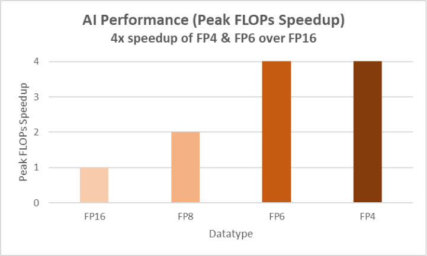
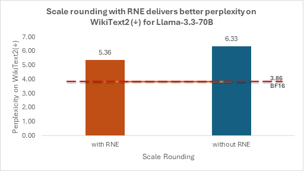
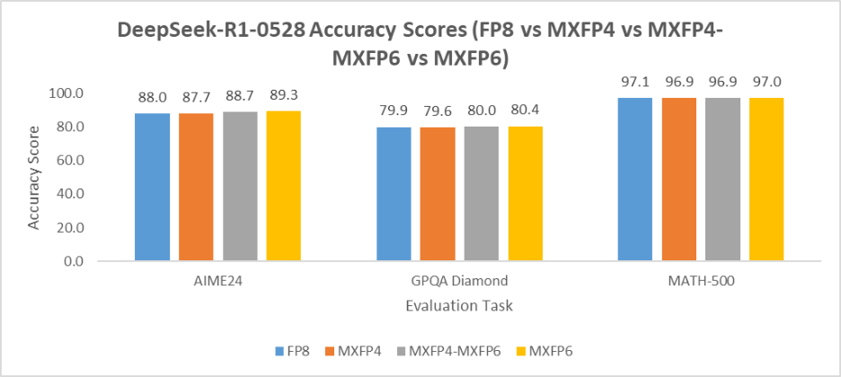
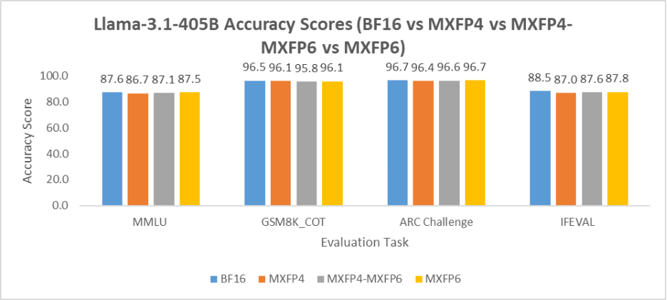
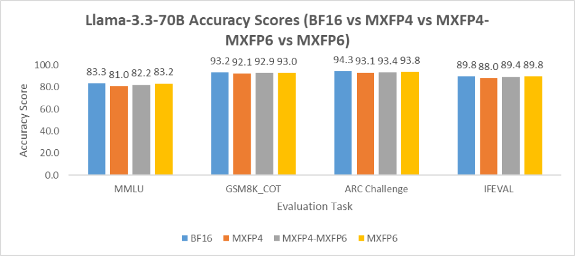
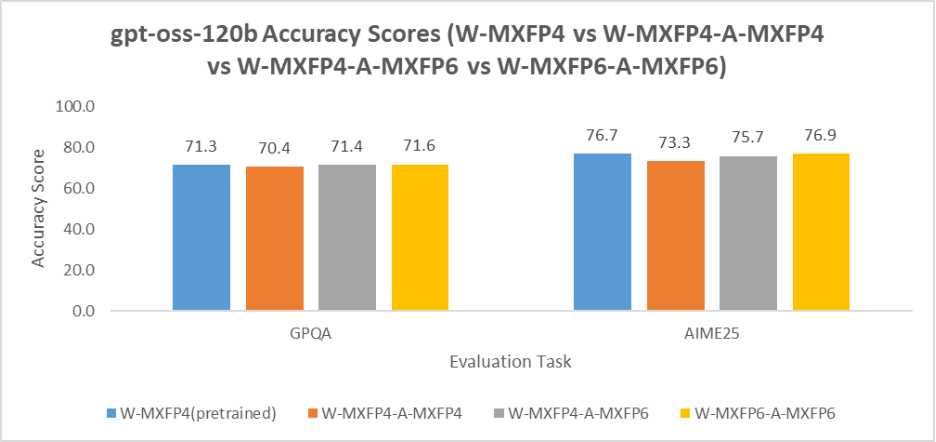

<!---
Copyright (c) 2025 Advanced Micro Devices, Inc. (AMD)

Permission is hereby granted, free of charge, to any person obtaining a copy
of this software and associated documentation files (the "Software"), to deal
in the Software without restriction, including without limitation the rights
to use, copy, modify, merge, publish, distribute, sublicense, and/or sell
copies of the Software, and to permit persons to whom the Software is
furnished to do so, subject to the following conditions:

The above copyright notice and this permission notice shall be included in all
copies or substantial portions of the Software.

THE SOFTWARE IS PROVIDED "AS IS", WITHOUT WARRANTY OF ANY KIND, EXPRESS OR
IMPLIED, INCLUDING BUT NOT LIMITED TO THE WARRANTIES OF MERCHANTABILITY,
FITNESS FOR A PARTICULAR PURPOSE AND NONINFRINGEMENT. IN NO EVENT SHALL THE
AUTHORS OR COPYRIGHT HOLDERS BE LIABLE FOR ANY CLAIM, DAMAGES OR OTHER
LIABILITY, WHETHER IN AN ACTION OF CONTRACT, TORT OR OTHERWISE, ARISING FROM,
OUT OF OR IN CONNECTION WITH THE SOFTWARE OR THE USE OR OTHER DEALINGS IN THE
SOFTWARE.
--->

# High-Accuracy MXFP4, MXFP6, and Mixed-Precision Models on AMD GPUs

Low-bit quantization has become increasingly important for large language models (LLMs)<u>,</u> as model sizes reach hundreds of billions of parameters, where balancing efficiency and accuracy is critical. [AMD Quark](https://github.com/amd/Quark), the model optimization toolkit from AMD, offers cross-platform optimized models for accurate low-bit model deployment. Building on the concepts we introduced in our previous [blog](https://rocm.blogs.amd.com/artificial-intelligence/quark/README.html), this blog focuses on MXFP4 and MXFP6 low-precision quantization techniques on large language models and demonstrates how to use Quark to compress LLMs for accurate and efficient deployment on AMD Instinct™ MI355 GPUs.

In this blog post, we present results using MXFP4 and MXFP6 alongside mixed-precision techniques across a variety of models. We focus on the accuracy of large models (\> 70 B), which benefit the most from using low-precision 4-bit or 6-bit types from a computational viewpoint. Additionally, we highlight MXFP6, which has the same computing FLOPs as MXFP4 on AMD MI GPUs, but has the potential to offer improved accuracy, more specifically in the context of mixed-precision, where MXFP4 and MXFP6 are used together. Moreover, the blog discusses key implementation requirements, such as appropriate rounding techniques, which enhance accuracy and are not explicitly mentioned in the [OCP white paper](https://www.opencompute.org/documents/ocp-microscaling-formats-mx-v1-0-spec-final-pdf). This work also builds on earlier findings that mainly focused on smaller LLM models (\<8B parameters). Our results provide perspective on accuracy–performance tradeoffs and practical choices for efficient LLM deployment.

## Benefits of FP4 and FP6 in AI Models

LLM inference is highly resource-intensive, requiring substantial compute capacity and GPU memory. Lower precision datatypes, such as FP8 and recently, FP4 and FP6, increase throughput, reduce memory footprint, and lower energy consumption.

AMD Instinct™ MI355X GPUs natively support both FP4 and FP6 datatypes, enabling exceptional AI acceleration. As shown in the figure below, FP4, FP6, and FP8 achieve significant FLOPs speedups relative to FP16 on MI355, with FP4 and FP6 delivering up to 4× higher peak throughput compared to FP16. For more information on the acceleration provided by the matrix cores on AMD’s CNDA4 architecture that powers MI355 GPUs, please see this [blog](https://rocm.blogs.amd.com/software-tools-optimization/matrix-cores-cdna/README.html#matrix-cores), and the [CDNA4 white paper](https://www.amd.com/content/dam/amd/en/documents/instinct-tech-docs/white-papers/amd-cdna-4-architecture-whitepaper.pdf) for detailed architecture specifications.

 

Figure 1. AI Performance of FP4 and FP6 over FP16  

## MXFP4 and MXFP6 Quantization

### MXFP Formats

[OCP Microscaling Formats (MX)](https://www.opencompute.org/documents/ocp-microscaling-formats-mx-v1-0-spec-final-pdf) is an open, vendor-neutral standard for reduced-precision number representations, designed to accelerate large-scale AI inference and training. Its transparency and standardization have positioned it to be a catalyst for widespread adoption and have gained broad ecosystem support. MXFP4 and MXFP6 are two specific low-bit formats within the OCP MX family, illustrated in detail in the following figure:

                  MXFP4-E2M1                                                 MXFP6-E2M3

Figure 2. OCP MXFP4-E2M1 and MXFP6-E2M3 Data Structure

The following table summarizes the two formats:

<table style="width:100%;">
<colgroup>
<col style="width: 13%" />
<col style="width: 18%" />
<col style="width: 7%" />
<col style="width: 17%" />
<col style="width: 14%" />
<col style="width: 15%" />
<col style="width: 14%" />
</colgroup>
<thead>
<tr>
<th>Format Name </th>
<th>Element Type </th>
<th>Bits </th>
<th>Range </th>
<th>Block Size </th>
<th>Scale Type </th>
<th>Scale Format </th>
</tr>
</thead>
<tbody>
<tr>
<td>MXFP4 </td>
<td>FP4 (E2M1) </td>
<td>4 </td>
<td>[-6, 6] </td>
<td>32 </td>
<td>E8M0 </td>
<td>2<em>n</em> </td>
</tr>
<tr>
<td rowspan="2">MXFP6 </td>
<td>FP6 (E2M3) </td>
<td>6 </td>
<td>[-7.5, 7.5] </td>
<td>32 </td>
<td>E8M0 </td>
<td>2<em>n</em> </td>
</tr>
<tr>
<td>FP6 (E3M2) </td>
<td>6 </td>
<td>[-28.0, 28.0] </td>
<td>32 </td>
<td>E8M0 </td>
<td>2<em>n</em> </td>
</tr>
</tbody>
</table>

### MXFP Quantization

Quantization is the process of converting full-precision model weights and activations (typically BF16) into a lower-precision format. The MXFP quantization consists of three key steps:

1. Scaling: Each block of values shares a scale factor to ensure values fit within the representable range. For MXFP4 and MXFP6, the scale is stored as an 8-bit E8M0 value.

<!-- -->

2. Clipping: Values outside the OCP MX range are clipped to the minimum and maximum representable values (e.g., \[-6,6\] for MXFP4).

<!-- -->

3. Rounding: Each clipped value is rounded into the corresponding low-bit floating-point format (FP4 or FP6).

**MXFP4 Quantization:**

$$x_{q}^{MXFP4} = {Rounding}_{E2M1}\left( clip\left( \frac{x}{scale},\  - 6,\ 6 \right) \right)$$

Here, $x$ is the original floating-point value (weight or activation), and $scale$ is the scaling factor that maps $x$ to the limited MXFP4 range. The operator ${Rounding}_{E2M1}​(\cdot)$ rounds the scaled, clipped value to the nearest representable MXFP4 number according to the 2-bit exponent and 1-bit mantissa format.

**MXFP6-E2M3 Quantization:**

$$x_{q}^{MXFP6 - E2M3} = {Rounding}_{E2M3}\left( clip\left( \frac{x}{scale},\  - 7.5,\ 7.5 \right) \right)$$

Similarly, $x$ is the original floating-point value, and $scale$ maps $x$ into the MXFP6 range. ${Rounding}_{E2M3}(\cdot)$ rounds the clipped value to the nearest MXFP6-E2M3 number.

In practice, the E2M3 format typically outperforms E3M2, because the scaling factor already captures most of the dynamic range, making the extra mantissa bit more beneficial for improving accuracy.

### Scale Rounding

The scales for MXFP4 and MXFP6-E2M3 quantization are computed as follows:

$$\Large scale = 2^{clip\left( \left\lfloor \log_{2}^{RNE(max\_ abs(x))} \right\rfloor,\  - 127,127 \right) - 2} $$

Here, $\left\lfloor \cdot \right\rfloor$ denotes floor operation, and RNE stands for round-to-nearest-even (a.k.a. Banker’s rounding), which is applied when converting floating-point scale to E8M0 format.

The use of RNE is critical—its omission can directly degrade model accuracy, a detail that is sometimes overlooked in competing implementations. Without RNE, simply applying floor rounding to the exponent systematically underestimates the numerical range and introduces a negative bias, thereby increasing quantization error. By contrast, incorporating RNE reduces both bias and quantization noise, resulting in higher-quality quantization. As shown in Figure&nbsp;3, RNE delivers significantly better results compared to plain floor rounding.

Figure 3. Scale Rounding with RNE Delivers Significantly Better Results

## Quantizing with Quark

[AMD Quark](https://github.com/amd/Quark) is a cross-platform model optimization toolkit that supports quantization to MXFP4 and MXFP6 formats<u>,</u> enabling efficient low-bit quantization while preserving accuracy. It integrates several advanced algorithms such as [GPTQ](https://arxiv.org/abs/2210.17323), [SmoothQuant](https://arxiv.org/abs/2211.10438), [Quarot](https://arxiv.org/abs/2404.00456) and [AutoSmoothQuant](https://quark.docs.amd.com/latest/tutorials/torch/auto_smoothquant_document_and_example.html) to deliver high-accuracy quantization for large language models.  

We applied the [AutoSmoothQuant](https://quark.docs.amd.com/latest/tutorials/torch/auto_smoothquant_document_and_example.html) algorithm to MXFP4 and MXFP4-MXFP6 quantization in our experiments to enhance accuracy retention. AutoSmoothQuant is an optimized variant of [SmoothQuant](https://arxiv.org/abs/2211.10438), that adaptively smoothens outliers on a per-layer basis without any manual tuning.

Quark-quantized models can be deployed on AMD Instinct™ MI355 GPUs, which provide native support for FP4, FP6, and mixed-precision FP4-FP6 through Matrix Fused Multiply Add (MFMA) scale instructions. The resulting models are fully compatible with inference frameworks such as [vLLM](https://docs.vllm.ai/en/latest/) and [SGLang](https://docs.sglang.ai/), enabling efficient and scalable integration in production environments.

## Evaluation on Large Language Models

We evaluate the accuracy of MXFP4 and MXFP6 quantization on popular models such as DeepSeek-R1-0528, Llama-3.1-405B, Llama-3.3-70B, and gpt-oss-120B — covering both dense and MoE architectures across large and medium model sizes. We have started with these popular large models, and we intend to explore similar techniques on more models in the future.  

Our results show that MXFP4 achieves nearly lossless accuracy on super-large models when combined with advanced PTQ algorithms. Accuracy degradation is more noticeable in smaller models, but diminishes as model size increases. Additionally, MXFP6 and mixed-precision MXFP4-MXFP6 generally deliver better accuracy than MXFP4.

**Key Results:**

- DeepSeek-R1-0528: MXFP4 retains over 99.5% accuracy on tasks such as AIME24, GPQA Diamond, and MATH-500. Figure&nbsp;4 illustrates a comparison of MXFP4, MXFP6, and mixed-precision MXFP4-MXFP6 across these tasks, showing that MXFP6 and mixed-precision consistently outperform MXFP4 across all the tasks.

- Llama-3.1-405B: Figure&nbsp;5 demonstrates that MXFP4 maintains strong task performance, while MXFP6 and mixed-precision MXFP4-MXFP6 achieve higher scores, confirming the benefits of MXFP6 and mixed-precision for large dense models.

- Llama-3.3-70B: As shown in Figure&nbsp;6, MXFP4 exhibits noticeable accuracy degradation on smaller models, whereas MXFP6 and MXFP4-MXFP6 mitigate this loss and consistently outperform MXFP4 across benchmarks.

- gpt-oss-120b: Figure&nbsp;7 presents a similar trend, with accuracy performance MXFP6 > MXFP4-MXFP6 > MXFP4, highlighting the advantage of MXFP6 and mixed-precision quantization for improved accuracy in smaller models.

These results collectively demonstrate that MXFP4 is highly effective for large models, while MXFP6 and mixed-precision MXFP4-MXFP6 significantly improve accuracy retention in smaller models.

Figure 4. DeepSeek-R1-0528 Accuracy Score Comparison

  

Figure 5. Llama-3.1-405B Accuracy Score Comparison

  

Figure 6.  Llama-3.3-70B Accuracy Score Comparison

  

Figure 7. gpt-oss-120B Accuracy Score Comparison

  

## Summary

This blog explores MXFP4 and MXFP6 quantization using the AMD Quark toolkit, highlighting key techniques and demonstrating high accuracy on large models, such as DeepSeek-R1-0528, when combined with proper scaling rounding and advanced quantization algorithms. MXFP6 and mixed-precision MXFP4-MXFP6 consistently outperform MXFP4 without compromising computational efficiency. These results underscore a scalable path toward trillion-parameter LLM deployment, with future improvements expected through integration with more advanced quantization algorithms and broader model support.

The MXFP4 format models in this blog, including [DeepSeek-R1-0528](https://huggingface.co/amd/DeepSeek-R1-0528-MXFP4-ASQ), [Llama-3.1-405B](https://huggingface.co/amd/Llama-3.1-405B-Instruct-MXFP4-Preview) and [Llama-3.3-70B,](https://huggingface.co/amd/Llama-3.3-70B-Instruct-MXFP4-Preview) have been publicly released. Additional model releases will be coming soon.

## Disclaimers

Third-party content is licensed to you directly by the third party that owns the
content and is not licensed to you by AMD. ALL LINKED THIRD-PARTY CONTENT IS
PROVIDED “AS IS” WITHOUT A WARRANTY OF ANY KIND. USE OF SUCH THIRD-PARTY CONTENT
IS DONE AT YOUR SOLE DISCRETION AND UNDER NO CIRCUMSTANCES WILL AMD BE LIABLE TO
YOU FOR ANY THIRD-PARTY CONTENT. YOU ASSUME ALL RISK AND ARE SOLELY RESPONSIBLE
FOR ANY DAMAGES THAT MAY ARISE FROM YOUR USE OF THIRD-PARTY CONTENT.
