<!---
Copyright (c) 2025 Advanced Micro Devices, Inc. (AMD)

Permission is hereby granted, free of charge, to any person obtaining a copy
of this software and associated documentation files (the "Software"), to deal
in the Software without restriction, including without limitation the rights
to use, copy, modify, merge, publish, distribute, sublicense, and/or sell
copies of the Software, and to permit persons to whom the Software is
furnished to do so, subject to the following conditions:

The above copyright notice and this permission notice shall be included in all
copies or substantial portions of the Software.

THE SOFTWARE IS PROVIDED "AS IS", WITHOUT WARRANTY OF ANY KIND, EXPRESS OR
IMPLIED, INCLUDING BUT NOT LIMITED TO THE WARRANTIES OF MERCHANTABILITY,
FITNESS FOR A PARTICULAR PURPOSE AND NONINFRINGEMENT. IN NO EVENT SHALL THE
AUTHORS OR COPYRIGHT HOLDERS BE LIABLE FOR ANY CLAIM, DAMAGES OR OTHER
LIABILITY, WHETHER IN AN ACTION OF CONTRACT, TORT OR OTHERWISE, ARISING FROM,
OUT OF OR IN CONNECTION WITH THE SOFTWARE OR THE USE OR OTHER DEALINGS IN THE
SOFTWARE.
--->

# Advanced MXFP4 Quantization: Combining Fine-Tuned Rotations with SmoothQuant for Near-Lossless Compression

As language models continue to grow in popularity, reducing the cost of inference and accelerating model serving have become key challenges. Quantization offers a powerful solution by reducing the model size and leveraging inexpensive math operations, for example, using low-bitwidth formats like OCP MXFP4 (4.25 bits) available in AMD Instinct MI350X and MI355X accelerators.

In our previous blog post ([High-Accuracy MXFP4, MXFP6, and Mixed-Precision Models on AMD GPU accelerators](https://rocm.blogs.amd.com/software-tools-optimization/mxfp4-mxfp6-quantization/README.html)), MXFP4 quantization was shown to be near-lossless for very large models such as [deepseek-ai/DeepSeek-R1-0528](https://huggingface.co/deepseek-ai/DeepSeek-R1-0528). However, small to mid-sized models show noticeable accuracy degradation with such aggressive quantization formats.

This post explores **how fine-tuned online rotations and smoothing scales can help recover accuracy** when quantizing language models to MXFP4, achieving near-lossless compression on models ranging from 8B to 32B parameters. Specifically, **our approach recovers about 45-55% of the accuracy drop on n-shot tasks on Qwen3-8B and Qwen3-14B quantized down to MXFP4, enabling the quantized models to retain over 98% of the original BF16 accuracy.**

Although the technique explored requires an additional online operation during inference, **the block-diagonal structure keeps the online rotation overhead lightweight compared to the dominant GEMM operations**, especially for larger models with expensive attention and MLP layers. We discuss opportunities to reduce this computational cost using fused kernels, making this technique a good candidate for striking a balance between retaining good accuracy and minimal inference overhead.

The optimization techniques studied are broadly applicable to any low-precision data type, [including INT4](https://arxiv.org/abs/2501.13987) and MXFP6. In this blog post, we **focus on MXFP4 quantization**, which offers a lower memory footprint and higher bandwidth efficiency compared to MXFP6. Additionally, MXFP4's lower bitwidth presents a more challenging quantization problem, making it well-suited for demonstrating the effectiveness of our approach.

## A refresher on MXFP4 quantization

Transformer-based language models heavily rely on matrix multiplications (GEMM) as part of their architecture. Recent inference devices have thus focused on enabling higher throughput for this operation, in part through reduced precision (FP8 on 8 bits, MXFP4 on 4.25 bits), which allow faster data load/store and computation.

As such, **AMD Instinct MI350 and MI355 accelerators support the standard OCP MXFP4 format**, a [microscaling](https://www.opencompute.org/documents/ocp-microscaling-formats-mx-v1-0-spec-final-pdf) floating-point format optimized for high-throughput matrix multiplications. Details about the format are available in our previous blog post: [High-Accuracy MXFP4, MXFP6, and Mixed-Precision Models on AMD GPU accelerators](https://rocm.blogs.amd.com/software-tools-optimization/mxfp4-mxfp6-quantization/README.html).

A linear layer, commonly found in language models and quantized down to MXFP4, typically looks like:

$$
\begin{aligned}
y &= \mathcal{Q}(x) \times \mathcal{Q}(W)^T \\
&= \text{MXFP4-GEMM}(\mathcal{Q}(x), \mathcal{Q}(W), s_x, s_W)
\end{aligned}
$$

where $\mathcal{Q}$ represents the quantization operator, $x$ the input activation and $W$ the layer weight. Specifically:

- Activations typically use dynamic MXFP4 quantization, where scales $s_x$ are computed on-the-fly and $\mathcal{Q}(x)$ is computed online during inference.
- Weights use static MXFP4 quantization – $\mathcal{Q}(W)$ is computed offline, as well as scales $s_W$, exported with the model.
- Dispatch is done on MXFP4 GEMM kernels leveraging [CDNA4 ISA](https://www.amd.com/content/dam/amd/en/documents/instinct-tech-docs/instruction-set-architectures/amd-instinct-cdna4-instruction-set-architecture.pdf) from AMD Instinct MI350/MI355, e.g. `V_MFMA_SCALE_F32_16X16X128_F8F6F4`. For example, for transformer-based models, the compute-intensive layers (QKV projections, attention output projection, MLP) route into MXFP4-optimized matmul implementations.
- OCP MX group size is 32. Per-group quantization with a granularity of 32 channels allows low-bitwidth quantization, with a scale computed for each group.

This configuration targets minimal accuracy loss with strong performance characteristics, making it suitable for large decoder-only transformers.

## MXFP4 quantization challenge: outliers

A key challenge remains with MXFP4 quantization: the 4-bit representation can struggle with outlier values in both weights and especially activations.

When a group of 32 elements contains one or two large outliers, the shared scale factor must accommodate these outliers, leading to poor precision for the remaining values. Thus, it would be preferable to limit outliers within an OCP MX group, and have features of smaller magnitude. This is reflected in figure 9 in the appendix.

This is where rotation-based preprocessing comes into play.

## Online rotation and its effect

Several approaches, such as [SmoothQuant](https://arxiv.org/abs/2211.10438) and [QuaRot](https://arxiv.org/abs/2404.00456) have proposed to modify the distribution of activations and weights **before** quantizing them, reducing the quantization error on the transformed distribution.

Online rotations apply an orthogonal transform $R$ (such that $RR^T = I_n$) to activations at inference time, while the corresponding inverse is fused into the weights offline. For example, in a linear layer $y = xW^T$, we get

$$
\begin{aligned}
y &= xW^T \\
&= xRR^TW^T \\
&= xR \times (WR)^T. \\
&\approx \mathcal{Q}(xR) \times \mathcal{Q}(WR)^T.
\end{aligned}
$$

with the quantization operator $\mathcal{Q}$. **Rotations help improve quantization by redistributing outliers over multiple channels, reducing the overall value range within OCP MX groups**. $R$ mixes channels locally so that extremes are shared within a single OCP MX group, reducing worst-case magnitude, leading to tighter activation scales and generally smaller quantization error.

In our work, we specifically use block-diagonal rotations, similar to [LightRot](https://ieeexplore.ieee.org/document/10950449). Each block is a small rotation of size `(rotation_size, rotation_size)` (e.g. `(32, 32)`) applied independently across the hidden dimension, limiting compute overhead, while locally rearranging the distributions. Figure 1 below shows how block-diagonal rotations are applied per-block of `rotation_size` input features on activations.

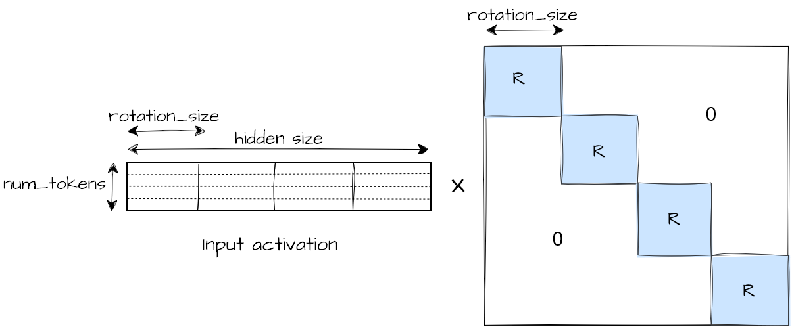

Figure 1. Online input activation rotation operation

Finally, as $R$ is orthogonal and $RR^T = I$ is applied, the high-precision floating point model remains unchanged, only the quantized model benefits from the transformed activation/weights distributions. **In case we later train these rotations, this can be seen as a form of regularization, where our goal is truly not to modify the original model output, but instead to change the per-layer distributions prior to quantization in order to get closer to the original model output distribution.**

Detailed analysis of the effect of rotations per-layer and on OCP MX groups of 32 values is available in the appendix.

## Combining rotations with SmoothQuant input channel scaling

[SmoothQuant](https://arxiv.org/abs/2211.10438) channel rescaling is a common technique to improve layer quantization by redistributing weights and activations through a diagonal transform $D$, such that $y = x @ D @ D^{-1} @ W^T = (x @ D) @ (W D^{-1})^T$.

**SmoothQuant scaling can be combined with online rotation** as a single transform $O = DR$. Thus, in a linear layer, we get:

$$
\begin{aligned}
y &= xW^T \\
&= xOO^{-1}W^T \\
&= xDRR^TD^{-1}W^T \\
&= xDR \times (WD^{-1}R)^T \\
&= ... x'R \times (WD^{-1}R)^T.
\end{aligned}
$$

We see that the scales $D$ are fused offline into the preceding layer (e.g. RMSNorm weight, denoted by $...x'$) and $D^{-1}$ in the current layer weight, while $R^T$ is fused in the current layer weight as well. The activation rotation $R$ is left online here.

Fixed Hadamard rotations can be used for $R$ to achieve fast transforms without training. SpinQuant/[OSTQuant](https://arxiv.org/abs/2501.13987)-like training can **jointly learn $R$ and $D$ to minimize the model output error**, providing better accuracy recovery than fixed Hadamard rotations. Jointly optimizing the rotation $R$ and smoothing scale $D$ intuitively adds an additional degree of freedom during training, as $OO^T = DR \times (DR)^T = DD^T \neq I_n$ is not orthogonal. There is no additional compute overhead at inference (only the activation rotation $R$ is left online, smoothing scales are fused).

To sum it up, the Figure 2 below shows a typical transformer model transformation through rotation and SmoothQuant. Although we focus on $R_1$, $R_2$, $D_1$, $D_1'$ and $D_2$ in the following results, all potential positions for rotations and smoothing vectors are shown.

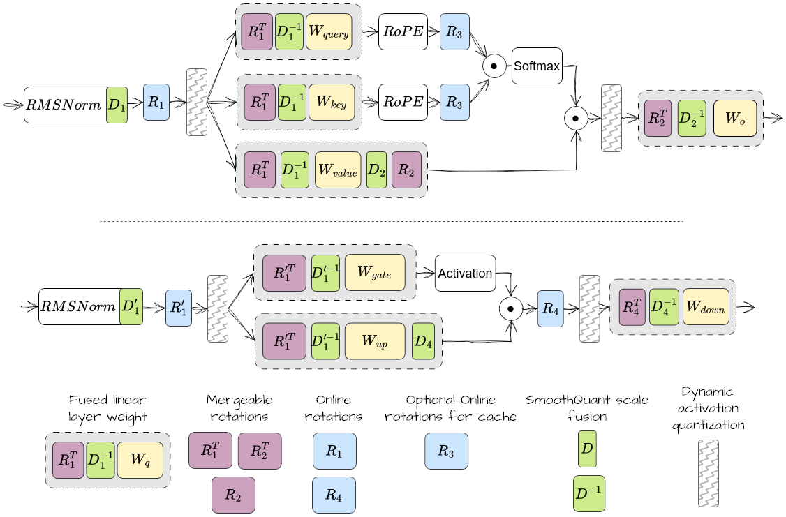

Figure 2. Description of where online rotations and SmoothQuant scales can be applied in attention (top) and MLP (bottom) layers

Note that previous research on INT8, INT4 quantization formats (such as QuaRot, SpinQuant, OSTQuant) often focused on applying a shared unique $R_1$ rotation throughout the whole network, which can actually be fused fully offline prior to inference, with no deployment runtime overhead. However, we found offline Hadamard $R_1$ rotation to be detrimental for MXFP4 quantization, mostly due to the effect of fusing RMSNorm weight in the next layer weights. The following results thus focus on applying $R_1$ online, one for each `qkv_proj` and `gate_up_proj` layer.

## Sample results

### Experimental setup

We evaluate three models quantized down to MXFP4: [`Qwen/Qwen3-8B`](https://huggingface.co/Qwen/Qwen3-8B), [`Qwen/Qwen3-14B`](https://huggingface.co/Qwen/Qwen3-14B), [`Qwen/Qwen3-32B`](https://huggingface.co/Qwen/Qwen3-32B). We use the [lm-evaluation-harness](https://github.com/EleutherAI/lm-evaluation-harness) as our evaluation framework.

The evaluation tasks used are:

- **Non-generative tasks** (based on loglikelihood, single model forward call for each question - only useful when non-thinking mode is available): `piqa`, `leaderboard_mmlu_pro`, `winogrande`, `arc_challenge`, `arc_easy`, `hellaswag`,
- **Generative tasks:** `gsm8k_platinum`, `mmlu_redux_generative`,
- **Perplexity:** `wikitext` implementation from AMD Quark, `lambada_standard` from lm-evaluation-harness.

Following SpinQuant and OSTQuant, rotations are fine-tuned on the Stiefel manifold (set of orthogonal matrices), using Cayley SGD optimizer which enforces the orthogonality constraint $RR^T = I_n$. More details on the experimental setup are available in the appendix. An example training script is available in [AMD Quark repository](https://github.com/amd/Quark/tree/release/0.11/examples/torch/language_modeling/rotation).

### Online rotation and SmoothQuant training main results

We compare our optimized models using joint tuned block-diagonal orthogonal transforms and smoothing scales to three baselines:

- **The original non-quantized model (100% reference):** In the figures below, the recovery from quantization error is reported as a percentage as compared to the original non-quantized model evaluation.
- **The baseline quantized models using simple round-to-nearest MXFP4 quantization (blue):** No additional accuracy recovery technique is used.
- **A baseline quantized MXFP4 model using other accuracy recovery techniques (orange):** For example, [GPTQ](https://quark.docs.amd.com/latest/autoapi/quark/torch/quantization/config/config/index.html#quark.torch.quantization.config.config.GPTQConfig) or [AutoSmoothQuant](https://quark.docs.amd.com/latest/tutorials/torch/auto_smoothquant_document_and_example.html) are available through AMD Quark library, and already show significant accuracy recovery, with no inference overhead.

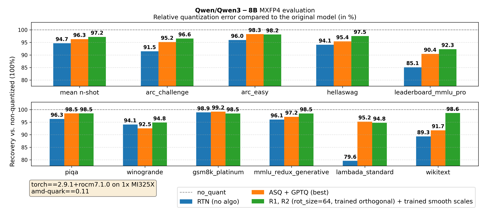

Figure 3. Qwen/Qwen3-8B main results

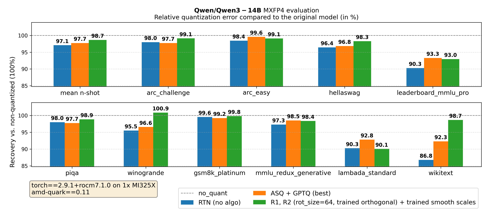

Figure 4. Qwen/Qwen3-14B main results

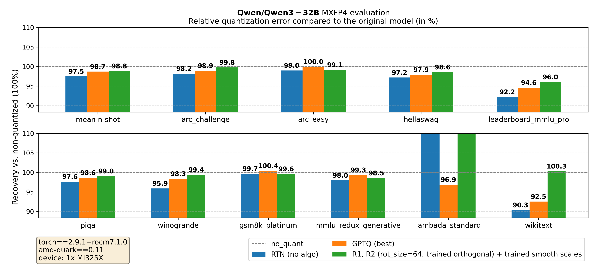

Figure 5. Qwen/Qwen3-32B main results

`mean n-shot` represents the average of all metrics, except perplexity-based metrics (`wikitext` and `lambada_standard`).

**Key takeaway from Figures 3-5:** Across all tested model sizes, for MXFP4 quantization of Qwen3 models, **using the approach of jointly tuning orthogonal transforms and smoothing scales significantly improves evaluation metrics compared to the above baselines.** We outperform the baselines using naive round-to-nearest quantization, GPTQ, AutoSmoothQuant. Moreover, training the transform $O = DR$ outperforms both training only $O = D$ and $O = R$ (see appendix).

### Online runtime benchmark

Using an online activation rotation $x' = xR$ adds a small overhead during inference, which remains manageable thanks to the block-diagonal structure of the orthogonal matrix $R$, making the rotation operation sparse and significantly lighter than the following MXFP4 GEMM.

We [integrate](https://github.com/vllm-project/vllm/pull/32272) quantized models using online rotations in vLLM serving library, **as a non-optimized baseline where the operation $x_q = \mathcal{Q}(xR)$ is not fused**, and the rotation is simply applied as a standalone operation, per block on the input last dimension. In an optimized kernel, the per-block rotation could be fused with the dynamic quantization and low-precision GEMM operations.

On a single AMD Instinct MI355X, we benchmark quantized models using online rotations thanks to [vLLM's serving benchmark sweep CLI](https://docs.vllm.ai/en/latest/cli/bench/sweep/serve/), with the parameters `--random-input-len 1024 --random-output-len 1024 --random-range-ratio 0.2 --num-warmups 10` over a variety of maximum concurrent requests, simulating different load usage. This setting is in line with [InferenceMax](https://newsletter.semianalysis.com/p/inferencemax-open-source-inference) best practice to simulate chat workloads.

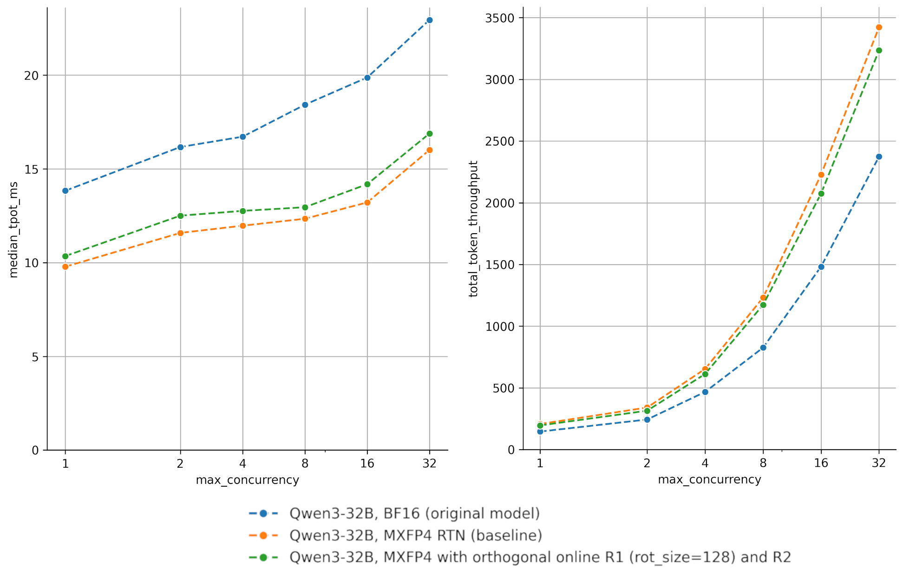

Figure 6. Qwen/Qwen3-32B benchmark. Left: time per output token (TPOT, except first, in ms) over different concurrency settings, with/without online rotation. Right: total token throughput (tokens/s).

As can be seen above on Figure 6 for `Qwen/Qwen3-32B` in MXFP4 precision, the naive implementation of an online rotation with `rotation_size=128` (in green) does introduce noticeable latency in the decode regime, especially for low concurrency. In terms of total token throughput (request throughput), the overhead remains manageable compared to the original BF16 model. As existing implementations ([tritonBLAS](https://github.com/ROCm/tritonBLAS/pull/45), [QuTLASS](https://github.com/IST-DASLab/qutlass)) of online rotation have shown, an optimized implementation could further reduce the runtime overhead.

## Summary

In this blog, we explored advanced quantization techniques such as fine-tuned rotations and smoothing scales, showing **significant recovery from the accuracy drop due to MXFP4 quantization observed in models such as Qwen3-8B, Qwen3-14B, and Qwen3-32B.** We observed that by redistributing outliers across channels and enabling fine-tuning specifically for quantization, these methods bridge the gap between aggressive compression and production quality.

We specifically found that:

- **Trained online rotations outperform baseline offline Hadamard and online Hadamard rotations** in recovering accuracy for MXFP4 quantization.
- Block-diagonal rotations provide a decent balance between degradation recovery and runtime efficiency.
- Jointly training orthogonal transforms and smoothing vectors provides **additional recovery**, with no additional runtime cost compared to online rotations alone.
- The original approach in QuaRot and SpinQuant, using fully offline rotations (Hadamard or trained orthogonal), does not significantly improve over the baseline RTN MXFP4 quantization, motivating us to use **online rotations**.
- Not all layers benefit equally from Hadamard transform, and the transform is also detrimental for some specific activation/weight distributions. Future work will investigate layer-specific sensitivity further.

As hardware support for low-precision math (such as MXFP4) continues to improve, such techniques to retain high accuracy are likely to gain further adoption in post-training quantization and quantization aware training workflows, enabling deployment of models in low precision with minimal accuracy loss.

Techniques that reshape activation and weight distributions can be combined with others handling the actual quantization, such as [GPTQ](https://arxiv.org/abs/2210.17323) or [Qronos](https://arxiv.org/abs/2505.11695). We look forward to more research combining these advanced techniques.

The code and configurations for training rotations are available in the [**AMD Quark 0.11 release**](https://quark.docs.amd.com/latest/release_note.html), providing a starting point for researchers and practitioners looking to apply these techniques to their own models. Support in [upstream vLLM](https://github.com/vllm-project/vllm/pull/32272) is upcoming, and optimized fused kernels for AMD Instinct MI355X handling activation scale computation along rotation are [being investigated](https://github.com/ROCm/tritonBLAS/pull/45).

## Appendices

The following Appendices provide additional details:

- **A.0** - Analysis and visualization of the effect of rotations on tensors distributions
- **A.1** - Good practices for evaluation setup (critical for reproducibility)
- **A.2** - Ablation study validating joint rotation + SmoothQuant scales training approach
- **A.3** - Detailed experimental setup
- **A.4** - Reference evaluation metrics
- **A.5** and **A.6** - Reproduction and contact information

### A.0 Analysis of the effect of rotations on activations/weights distributions

Looking at the overall input/weight/output quantization error of `qkv_proj` and `gate_up_proj` layers of `Qwen/Qwen3-14B` in Figure 7, it is clear that Hadamard rotation (here `rotation_size=128`) generally reduces the per-layer output quantization error. Indeed, for most layers, over most tokens (total of 70 tokens in the prompt analyzed), we see in Figure 7 that:

$$
\frac{L_1(\mathcal{Q}(xR) \times \mathcal{Q}(WR)^T)}{L_1(\mathcal{Q}(x) \times \mathcal{Q}(W)^T)} \leq 1.
$$

Figure 7. Qwen/Qwen3-14B's per-layer input/weight/output relative quantization error using Hadamard rotation compared to original round-to-nearest

Looking at a single token in a prompt in the activation input to layer `14.self_attn.q_proj` of `Qwen/Qwen3-14B` in Figure 8, we see that applying Hadamard rotation (here with `rotation_size=128`, 4 OCP MX groups denoted by vertical black lines) spreads the outlier min-max in a block into the `rotation_size=128` adjacent values. This results in lower mean L1 quantization error for some OCP MX groups, higher error for some others. In general, the reduced quantization error on outlier channels results in lower mean L1 layer output error.

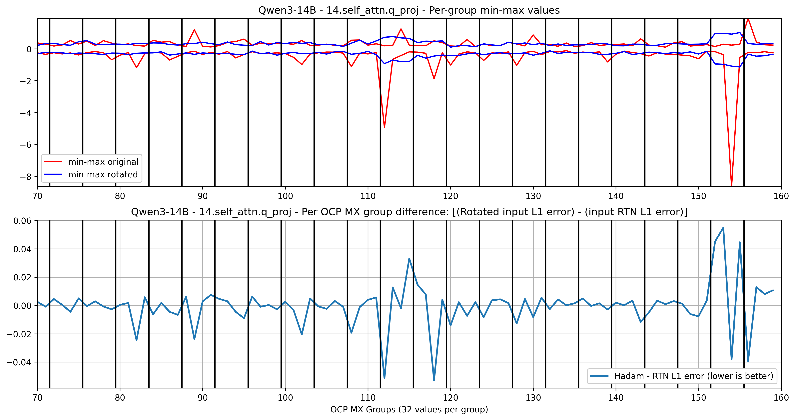

Figure 8. Qwen/Qwen3-14B's 14.self_attn.q_proj layer inputs, with RTN (round-to-nearest) baseline quantization, and with Hadamard transform applied beforehand

### A.1 - A note on properly using evaluation tools for generative tasks (such as GSM8K, GPQA-Diamond)

Evaluating generative tasks with libraries such as `lm-evaluation-harness` requires attention to details that are easy to overlook but can materially change evaluation metrics. Unlike classification-style multiple choice benchmarks, generative tasks depend on extracting a final answer from free-form text generation, and small mismatches in format, token limits, or post-processing can lead to undercounted correct answers or false positives.

Most concerns relate to answer extraction. Many math and reasoning datasets, such as GSM8K, include worked solutions or chain-of-thought in their n-shot examples, followed by a short final answer in a known format. The prompt should [instruct the model to follow this format](https://github.com/EleutherAI/lm-evaluation-harness/pull/3411), allowing a robust regex to capture only the final answer.

Moreover, for models that employ chain-of-thought or "thinking" processes, proper filtering of thinking content is essential. Some models (such as gpt-oss, Qwen3 models) generate internal reasoning tokens or use special markers to delimitate their thought process from their final response. **Failing to filter the thinking content appropriately can cause answer extraction to fail or produce incorrect parsing that should not be considered part of the final answer.**

Decoding parameters also matter. Generative tasks need multiple tokens to reach the final answer. **If the selected maximum generation length is too small, the model may truncate the answer before producing the final answer, and the generated answer would be wrongly rated as incorrect.** This is easy to miss if you only look at the headline metrics, as lm-evaluation-harness does not log warnings when reaching its `max_gen_toks` limit.

We suggest to use lm-evaluation-harness logging functions (using [`--log_samples` and `--output_path`](https://github.com/EleutherAI/lm-evaluation-harness/blob/main/docs/interface.md#data-and-output)) to check the answers and filtered answers, detecting whether actual answers are generated and whether thinking content is correctly filtered, and whether regex matching is correct. The evaluation setup should also preferably **emit warnings when answers cannot be found in the generated text or when `max_gen_toks` is reached before generation completes**. These warnings are red flags that the evaluation configuration may need adjustment. Taking these precautions upfront can save hours of debugging and prevent drawing incorrect conclusions about model capabilities.

Finally, for generative tasks, there may be some variance over the metrics obtained due to non-greedy sampling. For example, for gsm8k, over 5 runs of evaluation using the math `gsm8k_platinum` generative task, we see the end [`flexible-extract`](https://github.com/EleutherAI/lm-evaluation-harness/blob/v0.4.9.2/lm_eval/tasks/gsm8k_platinum/gsm8k-platinum.yaml#L38-L43) scores varying up to 0.25% depending on the run.

For generative tasks with much fewer samples (such as GPQA Diamond, with only 198 samples, or AIME25, with 30 samples), the variance is even higher. Evaluating the original `openai/gpt-oss-120b` model using [`gpt_oss.evals`](https://github.com/openai/gpt-oss/tree/main/gpt_oss/evals) evaluation pipeline, we see for GPQA Diamond evaluation a difference of up to 8% in scores over different runs, and for AIME25 evaluation a difference of up to 26% in scores over different runs.

### A.2 - Ablation: positive effect of combining fine-tuned online rotations with fine-tuned SmoothQuant scales

In Figures 9-11, we consistently notice an improvement when jointly training SmoothQuant scales along the online rotations, validating [OSTQuant](https://arxiv.org/abs/2501.13987) findings.

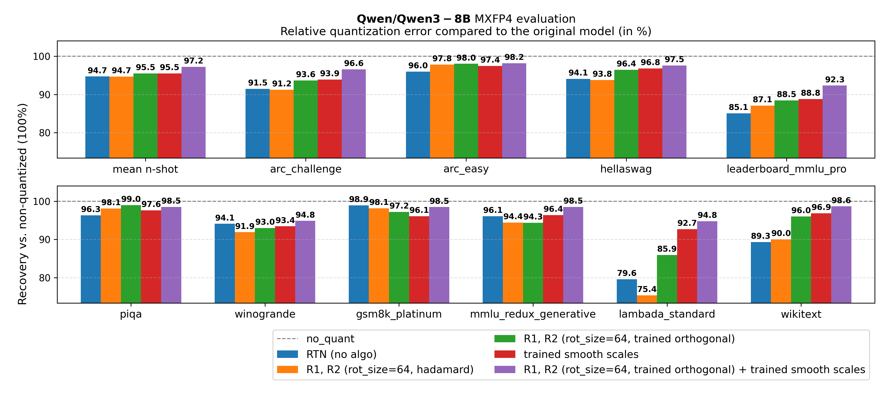

Figure 9. Qwen/Qwen3-8B ablation on jointly training rotation + SmoothQuant scales

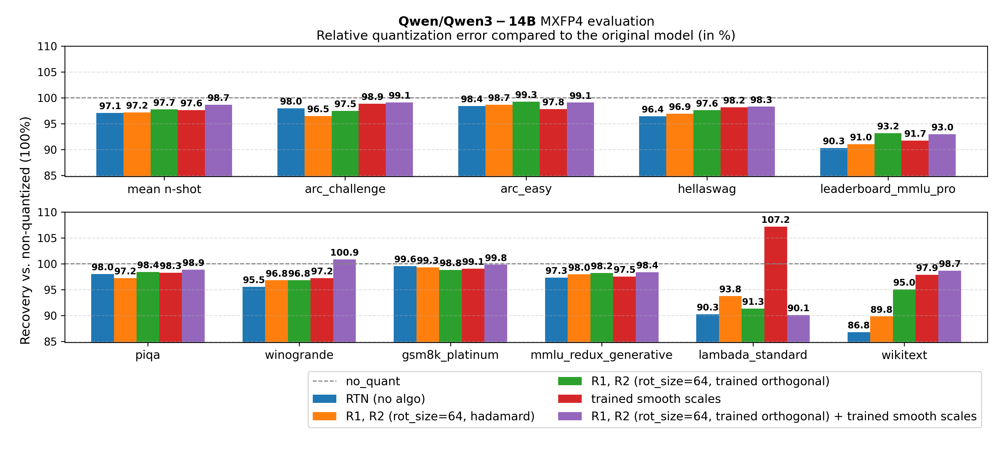

Figure 10. Qwen/Qwen3-14B ablation on jointly training rotation + SmoothQuant scales

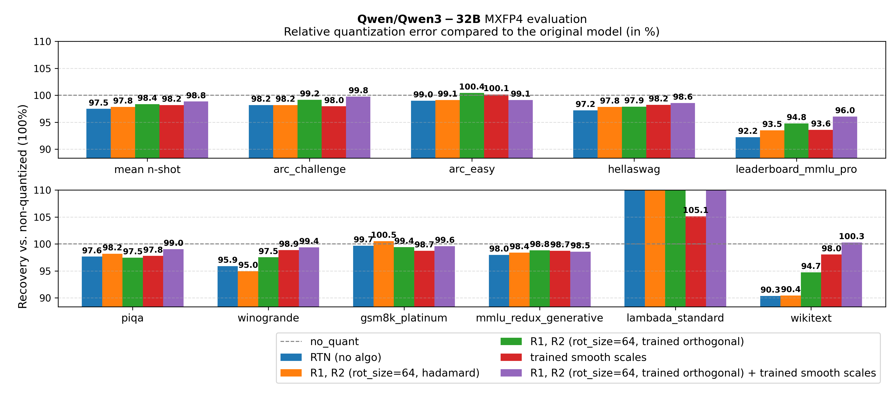

Figure 11. Qwen/Qwen3-32B ablation on jointly training rotation + SmoothQuant scales

To further validate this improvement, we examine the validation losses during training for `Qwen/Qwen3-8B` tuned using $R_1$ with `rotation_size=128` and $R_2$. Figure 12 compares three configurations:

- `qwen3_8b_r1_128_r2`: Tuning rotation only (no SmoothQuant scales).
- `qwen3_8b_smooth12`: Tuning SmoothQuant scales only.
- `qwen3_8b_r1_128_r2_smooth12`: Tuning rotations along SmoothQuant scales.

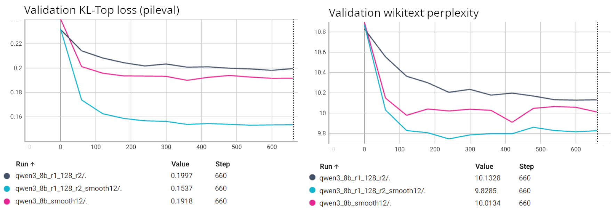

Figure 12. Qwen/Qwen3-8B training losses with SmoothQuant scales and rotation

The losses in Figure 12 clearly show that jointly tuning both online rotations and SmoothQuant scales results in a noticeably lower validation loss compared to tuning either transform independently. This training-time benefit likely translates to the improved n-shot metrics observed in Figures 9-11.

### A.3 - Detailed experimental setup

We run evaluation experiments in a docker container based on `rocm/pytorch:rocm7.1_ubuntu24.04_py3.12_pytorch_release_2.9.1`, using AMD Instinct MI325 accelerators, simulated MXFP4 execution, and relying on `transformers==4.57.3` and [a verbose tip of lm-evaluation-harness](https://github.com/fxmarty-amd/lm-evaluation-harness/tree/fix-pretrained-metadata-and-others).

For evaluation, [chat template, fewshot as multiturn](https://github.com/EleutherAI/lm-evaluation-harness/blob/main/docs/interface.md) are enabled for generative tasks. 5-shot is used for all tasks. Thinking is disabled for non-generative tasks, and enabled for generative tasks (with thinking content filtered out of answers). We found that these settings give the highest evaluation scores on the original non-quantized models. For generative tasks, we use `max_gen_toks=8000`, leaving room for thinking content, and use the default sampling parameters.

Training is done on the pileval dataset, on 700 steps, with a training batch size of 8, on a single GPU. The evaluation of generative tasks is done using [vLLM's backend of lm-evaluation-harness](https://github.com/fxmarty-amd/vllm/tree/online-rotation-experiments), evaluation of non-generative tasks (loglikelihood only) is done using Transformers backend of lm-evaluation-harness.

Regarding the training loss, we experimented with two main losses:

- Cross entropy loss, using only the ground-truth next tokens as a reference: `[0, 0, ...0, , 1, 0, ..., 0]`. This does not require loading the original model in memory.
- KL-divergence based losses, which attempt to minimize the distribution shift from the quantized model compared to the original non-quantized model. **This loss requires loading the non-quantized model as well in memory**, similar to distillation optimization.

We generally witness better n-shot (or 0-shot) evaluation results when using a **KL-divergence** loss. Following [OSTQuant](https://arxiv.org/abs/2501.13987) proposal, we use the KL-Top 1000 loss, using as training objective only the top 1000 tokens with highest likelihood from the original non-quantized model.

Online per-layer rotations are initialized using block-diagonal orthogonal matrices, with a Hadamard matrix $R_{diag}$ of size `(rotation_size, rotation_size)` repeated on the diagonal.

We jointly learn a diagonal smoothing vector $D$, the transformation being $O = DR$. For the per-layer smoothing vectors $D$, we use Adam optimizer with an initial learning rate of $1e-2$. The vector $D$ is initialized to $[1., 1., ..., 1.]$.

For vLLM runtime benchmarks, we use `rocm/vllm-dev:nightly_main_20260121` in a single MI355X accelerator for all serving benchmarks. We use vllm==[599e433](https://github.com/vllm-project/vllm/compare/599e4335a42bbb6f2cad75ac0b4be81272a77aa3...fxmarty-amd:vllm:blog-post-online-rotation-branch?expand=1#diff-30ed860271fb5edbcfc8d1584342b3451b9df9e2378ecedccd869e9ed186ed29) with [online rotation support](https://gitenterprise.xilinx.com/AMDNeuralOpt/Quark/pull/3901). We disable [TunableOp](https://rocm.blogs.amd.com/artificial-intelligence/gemm_blog/README.html#technique-2-optimizing-performance-with-pytorch-tunableop-framework-level-gemm-tuning), and use in vLLM the environment variables `VLLM_ROCM_USE_AITER=1` and `VLLM_ROCM_USE_AITER_FP4_ASM_GEMM=1`, dispatching MXFP4 GEMMs to [pre-tuned implementations based on Composable Kernel and Triton](https://github.com/vllm-project/vllm/blob/76139d0801e95bf6c54352650a6f42e181b510be/vllm/model_executor/layers/quantization/quark/schemes/quark_ocp_mx.py#L75-L123) from [a tuned version of `ROCm/aiter` v0.1.9](https://github.com/ROCm/aiter/compare/v0.1.9...fxmarty-amd:aiter:v0.1.9-qwen). Other vLLM parameters are left to the default ones.

### A.4 - Reference evaluation results

The reference evaluation results from the non-quantized models can be found in the table below.

|  | Qwen/Qwen3-8B | Qwen/Qwen3-14B | Qwen/Qwen3-32B |
|---|---|---|---|
| mean n-shot | 0.7671 | 0.791 | 0.8151 |
| arc_challenge | 0.6689 | 0.6826 | 0.7082 |
| arc_easy | 0.8687 | 0.8779 | 0.8813 |
| hellaswag | 0.7589 | 0.7936 | 0.8345 |
| leaderboard_mmlu_pro | 0.478 | 0.532 | 0.594 |
| piqa | 0.796 | 0.8166 | 0.8335 |
| winogrande | 0.7198 | 0.7395 | 0.7672 |
| gsm8k_platinum | 0.9711 | 0.9835 | 0.9851 |
| mmlu_redux_generative | 0.8756 | 0.9026 | 0.9171 |
| lambada_standard | 6.3923 | 6.5519 | 6.3774 |
| wikitext | 9.7273 | 8.6433 | 7.6106 |

### A.5 - Reproducing this blog post results

The results presented in this blog post can be reproduced using [AMD Quark 0.11](https://github.com/amd/Quark/releases/tag/v0.11) and the [rotation example available in AMD Quark repository](https://github.com/amd/Quark/tree/release/0.11/examples/torch/language_modeling/rotation).

### A.6 - Contact

Feel free to reach out to us through [AMD Quark GitHub issues](https://github.com/amd/Quark/issues) (pinging `@fxmarty-amd`).

## Disclaimer

The information presented in this document is for informational purposes only and may contain technical inaccuracies, omissions, and typographical errors. The information contained herein is subject to change and may be rendered inaccurate for many reasons, including but not limited to product and roadmap changes, component and motherboard version changes, new model and/or product releases, product differences between differing manufacturers, software changes, BIOS flashes, firmware upgrades, or the like. Any computer system has risks of security vulnerabilities that cannot be completely prevented or mitigated. AMD assumes no obligation to update or otherwise correct or revise this information. However, AMD reserves the right to revise this information and to make changes from time to time to the content hereof without obligation of AMD to notify any person of such revisions or changes. THIS INFORMATION IS PROVIDED ‘AS IS.” AMD MAKES NO REPRESENTATIONS OR WARRANTIES WITH RESPECT TO THE CONTENTS HEREOF AND ASSUMES NO RESPONSIBILITY FOR ANY INACCURACIES, ERRORS, OR OMISSIONS THAT MAY APPEAR IN THIS INFORMATION. AMD SPECIFICALLY DISCLAIMS ANY IMPLIED WARRANTIES OF NON-INFRINGEMENT, MERCHANTABILITY, OR FITNESS FOR ANY PARTICULAR PURPOSE. IN NO EVENT WILL AMD BE LIABLE TO ANY PERSON FOR ANY RELIANCE, DIRECT, INDIRECT, SPECIAL, OR OTHER CONSEQUENTIAL DAMAGES ARISING FROM THE USE OF ANY INFORMATION CONTAINED HEREIN, EVEN IF AMD IS EXPRESSLY ADVISED OF THE POSSIBILITY OF SUCH DAMAGES. AMD, the AMD Arrow logo, and combinations thereof are trademarks of Advanced Micro Devices, Inc. Other product names used in this publication are for identification purposes only and may be trademarks of their respective companies.

© 2026 Advanced Micro Devices, Inc. All rights reserved.
