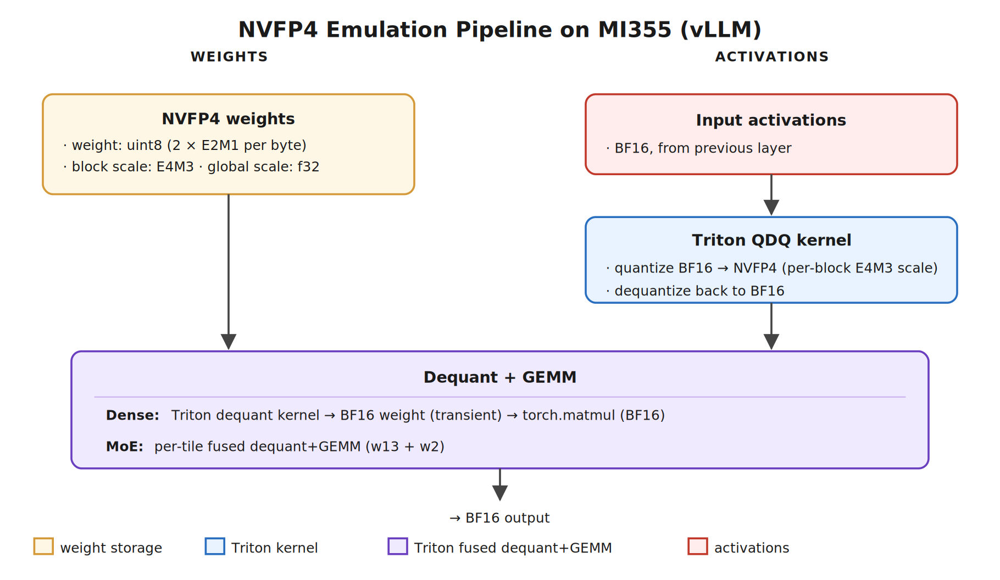
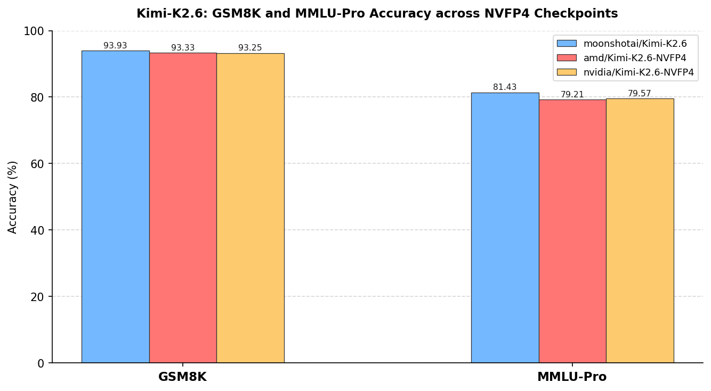
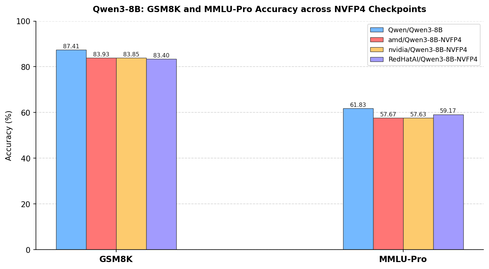

<!---
Copyright (c) 2026 Advanced Micro Devices, Inc. (AMD)

Permission is hereby granted, free of charge, to any person obtaining a copy
of this software and associated documentation files (the "Software"), to deal
in the Software without restriction, including without limitation the rights
to use, copy, modify, merge, publish, distribute, sublicense, and/or sell
copies of the Software, and to permit persons to whom the Software is
furnished to do so, subject to the following conditions:

The above copyright notice and this permission notice shall be included in all
copies or substantial portions of the Software.

THE SOFTWARE IS PROVIDED "AS IS", WITHOUT WARRANTY OF ANY KIND, EXPRESS OR
IMPLIED, INCLUDING BUT NOT LIMITED TO THE WARRANTIES OF MERCHANTABILITY,
FITNESS FOR A PARTICULAR PURPOSE AND NONINFRINGEMENT. IN NO EVENT SHALL THE
AUTHORS OR COPYRIGHT HOLDERS BE LIABLE FOR ANY CLAIM, DAMAGES OR OTHER
LIABILITY, WHETHER IN AN ACTION OF CONTRACT, TORT OR OTHERWISE, ARISING FROM,
OUT OF OR IN CONNECTION WITH THE SOFTWARE OR THE USE OR OTHER DEALINGS IN THE
SOFTWARE.
--->

# Serving NVFP4 Models on AMD Instinct™ MI355 Accelerators

NVFP4 is an increasingly common deployment format: NVIDIA, AMD, and the open-source community have published NVFP4 quantized checkpoints of frontier models such as [`moonshotai/Kimi-K2.6`](https://huggingface.co/moonshotai/Kimi-K2.6), and many users want to deploy these checkpoints directly. AMD Instinct™ MI355 is built on the CDNA4 architecture, which has no native NVFP4 tensor execution path — meaning these checkpoints could not previously be served on MI355 without an expensive offline conversion to a different format.

To close this gap, we present an emulation-based serving pipeline integrated into [vLLM](https://github.com/vllm-project/vllm) that enables MI355 to load and serve standard NVFP4 checkpoint directly. The pipeline dequantizes NVFP4 weights to BF16 on-the-fly at GEMM time, keeping peak GPU memory bounded to a single layer's footprint, and passes activations through an NVFP4 quantize-dequantize round-trip to preserve the numerical behavior of the original format. This post covers the pipeline architecture, checkpoint generation with [AMD-Quark](https://quark.docs.amd.com/latest/), vLLM serving configuration, and accuracy benchmarks on MI355 across two model families.

## NVFP4 Emulation Pipeline on MI355

The figure below shows the overall emulation pipeline on MI355.



### Weight Dequantization and Activation QDQ

Weights are held in packed NVFP4 format from checkpoint through GPU memory, and dequantized to BF16 only at GEMM time. Input activations pass through an NVFP4 quantize-dequantize (QDQ) round-trip before each GEMM, preserving NVFP4 numerical behavior. Both activations and weights enter the matrix multiply as BF16 tensors with FP32 accumulators.

### Memory Management

Expanding all NVFP4 weights to BF16 upfront would exceed GPU memory on frontier-scale models. The pipeline circumvents this by dequantizing one layer at a time — each BF16 weight buffer is released immediately after the GEMM, bounding peak memory to a single layer's footprint. Two kernel paths implement this:

- **Dense path**: NVFP4 weights are dequantized into a temporary BF16 buffer in GPU memory one layer at a time and freed immediately after the GEMM; for MoE, only the weights of dispatched experts are dequantized.
- **MoE path**: dequantization and GEMM are fused per tile — weights are decoded directly into the accumulator with no BF16 buffer staged, reducing peak memory pressure further.

### Latency Cost

The honest cost is latency: each GEMM is preceded by a dequantization pass, adding compute overhead and a transient BF16 weight buffer in GPU memory — though partially mitigated in MoE models by fusing dequantization and GEMM into a single kernel. Native NVFP4 execution eliminates this overhead entirely via direct FP4×FP4 tensor core operations.

### Hardware Scope

The emulation pipeline is able to run on MI300/325 and MI350/355 since CDNA3 and CDNA4 support BF16 GEMM. MI355 is the primary validation target for this post.

## Producing NVFP4 Checkpoints with AMD-Quark

The serving pipeline accepts standard packed E2M1 NVFP4 checkpoint, regardless of origin. This includes NVIDIA-released artifacts such as [`nvidia/Kimi-K2.6-NVFP4`](https://huggingface.co/nvidia/Kimi-K2.6-NVFP4), llm-compressor outputs such as [`RedHatAI/Kimi-K2.6-NVFP4`](https://huggingface.co/RedHatAI/Kimi-K2.6-NVFP4), and AMD-released artifacts such as [`amd/Kimi-K2.6-NVFP4`](https://huggingface.co/amd/Kimi-K2.6-NVFP4). [AMD-Quark](https://quark.docs.amd.com/latest/) is the AMD-native tool for generating compatible NVFP4 checkpoints from source models.

### Layer Selection

For MoE models, `routed_experts` and `shared_experts` are quantized while attention linears, routers, and vision modules remain in higher precision. Quantizing `shared_experts` incurs negligible accuracy loss but can improve inference throughput noticeably when fused with the quantized `routed_experts`. For dense models, MLP and attention linears are quantized while `lm_head` remains in higher precision.

### Recipe (Kimi-K2.6 example)

The following `quantize_quark.py` script quantizes Kimi-K2.6 to NVFP4 using [AMD-Quark](https://quark.docs.amd.com/latest/):

```bash
exclude_layers="*self_attn* *mlp.gate *mlp.gate.linear *lm_head *mlp.gate_proj *mlp.up_proj *mlp.down_proj *mm_projector* *vision_tower*"

python3 quantize_quark.py --model_dir moonshotai/Kimi-K2.6 \
                          --quant_scheme nvfp4 \
                          --num_calib_data 128 \
                          --exclude_layers $exclude_layers \
                          --model_export hf_format \
                          --output_dir amd/Kimi-K2.6-NVFP4 \
                          --multi_gpu balanced
```

## Serving Through vLLM

The NVFP4 checkpoint loads directly into vLLM's NVFP4 emulation path. SGLang is not yet supported.

```bash
export VLLM_ROCM_USE_AITER=1
vllm serve /mnt/amd/Kimi-K2.6-NVFP4 -tp 8 \
  --mm-encoder-tp-mode data \
  --tool-call-parser kimi_k2 \
  --reasoning-parser kimi_k2
```

### Evaluation on MI355

We benchmark GSM8K and MMLU-Pro accuracy across the source model and its three NVFP4 variants via `lm_eval` against the live endpoint:

```bash
lm_eval \
  --model local-completions \
  --model_args "model=/mnt/amd/Kimi-K2.6-NVFP4,base_url=http://0.0.0.0:8000/v1/completions,tokenized_requests=False,tokenizer_backend=None,num_concurrent=32" \
  --tasks gsm8k \
  --num_fewshot 5 \
  --batch_size auto 2>&1 | tee eval_kimi26.log
```

### Accuracy

We evaluate two model families: Kimi-K2.6 (MoE) and Qwen3-8B (dense).

As shown in the figure below, AMD-Quark's quantized Kimi-K2.6 matches NVIDIA's checkpoint within statistical noise across both GSM8K and MMLU-Pro, while the RedHatAI variant shows a small gap which may be due to quantization strategy differences.



The same pattern holds for the dense Qwen3-8B model, as shown below.



## Summary

This emulation approach grants MI355 the ability to deploy standard NVFP4 checkpoint through vLLM — whether from NVIDIA, AMD, or the open-source community. Limited by inference latency, this flow is better positioned as an accuracy reference for quantized model validation than a production serving deployment.

Planned work to optimize the emulation pipeline includes streaming dequantization to overlap memory reads with compute, optimizing the BF16 gemm, adapting MFMA for NVFP4 computation, and SGLang integration.

## Disclaimers

The information presented in this document is for informational purposes only and may contain technical inaccuracies, omissions, and typographical errors. The information contained herein is subject to change and may be rendered inaccurate for many reasons, including but not limited to product and roadmap changes, component and motherboard version changes, new model and/or product releases, product differences between differing manufacturers, software changes, BIOS flashes, firmware upgrades, or the like. Any computer system has risks of security vulnerabilities that cannot be completely prevented or mitigated. AMD assumes no obligation to update or otherwise correct or revise this information.
However, AMD reserves the right to revise this information and to make changes from time to time to the content hereof without obligation of AMD to notify any person of such revisions or changes.
THIS INFORMATION IS PROVIDED ‘AS IS.” AMD MAKES NO REPRESENTATIONS OR WARRANTIES WITH RESPECT TO THE CONTENTS HEREOF AND ASSUMES NO RESPONSIBILITY FOR ANY INACCURACIES, ERRORS, OR OMISSIONS THAT MAY APPEAR IN THIS INFORMATION. AMD SPECIFICALLY DISCLAIMS ANY IMPLIED WARRANTIES OF NON-INFRINGEMENT, MERCHANTABILITY, OR FITNESS FOR ANY PARTICULAR PURPOSE. IN NO EVENT WILL AMD BE LIABLE TO ANY PERSON FOR ANY RELIANCE, DIRECT, INDIRECT, SPECIAL, OR OTHER CONSEQUENTIAL DAMAGES ARISING FROM THE USE OF ANY INFORMATION CONTAINED HEREIN, EVEN IF AMD IS EXPRESSLY ADVISED OF THE POSSIBILITY OF SUCH DAMAGES.
AMD, the AMD Arrow logo, ROCm, and combinations thereof are trademarks of Advanced Micro Devices, Inc. Other product names used in this publication are for identification purposes only and may be trademarks of their respective companies.
© 2026 Advanced Micro Devices, Inc. All rights reserved
