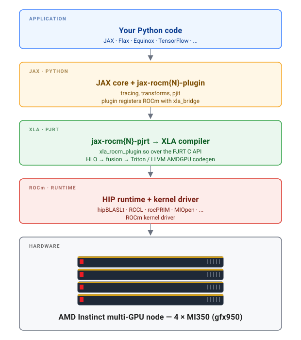
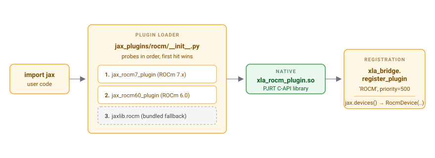
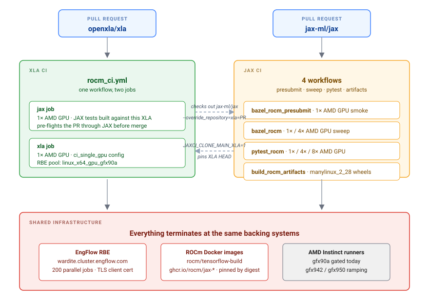

<!---
Copyright (c) 2026 Advanced Micro Devices, Inc. (AMD)

Permission is hereby granted, free of charge, to any person obtaining a copy
of this software and associated documentation files (the "Software"), to deal
in the Software without restriction, including without limitation the rights
to use, copy, modify, merge, publish, distribute, sublicense, and/or sell
copies of the Software, and to permit persons to whom the Software is
furnished to do so, subject to the following conditions:

The above copyright notice and this permission notice shall be included in all
copies or substantial portions of the Software.

THE SOFTWARE IS PROVIDED "AS IS", WITHOUT WARRANTY OF ANY KIND, EXPRESS OR
IMPLIED, INCLUDING BUT NOT LIMITED TO THE WARRANTIES OF MERCHANTABILITY,
FITNESS FOR A PARTICULAR PURPOSE AND NONINFRINGEMENT. IN NO EVENT SHALL THE
AUTHORS OR COPYRIGHT HOLDERS BE LIABLE FOR ANY CLAIM, DAMAGES OR OTHER
LIABILITY, WHETHER IN AN ACTION OF CONTRACT, TORT OR OTHERWISE, ARISING FROM,
OUT OF OR IN CONNECTION WITH THE SOFTWARE OR THE USE OR OTHER DEALINGS IN THE
SOFTWARE.
--->

# OpenXLA and JAX - ROCm Support and the State of CI

The OpenXLA compiler stack — XLA at the foundation, JAX as the front end — now runs upstream on AMD ROCm. XLA gates every pull request on real AMD Instinct silicon through its GitHub Actions workflow, side by side with the CUDA path; JAX runs the same hardware on every ROCm PR through its own workflows, with the merge gate rolling out next. `pip install "jax[rocm7-local]"` is a first-class entry point. This post documents how that backend is structured, what landed in the last twelve months, and how the CI pipeline that keeps it healthy is wired together. **[Part 1](#part-1--openxla-on-amd)** covers OpenXLA on AMD — the XLA backend, what landed this year, and CI. **[Part 2](#part-2--jax-on-amd)** covers JAX on AMD — the plugin architecture, JAX-side changes, and the four-workflow test matrix.

> **What's in this post**
>
> - The OpenXLA stack on ROCm in one diagram.
> - Supported AMD GPU targets across compiler, default wheels, and CI gating — and why those three lists differ.
> - The year's work on XLA and JAX for ROCm: Triton on AMDGPU, hipBLASLt group-GEMM, FP8, hermetic builds, manylinux wheels.
> - End-to-end CI: how each PR runs on real Instinct hardware and how XLA and JAX cross-pin against each other.
> - A reproducible three-command quick start.
> - Where to file issues, send PRs, and dump HLO when a workload misbehaves.

## Why JAX/OpenXLA on AMD?

JAX on AMD is a deliberate architectural choice. The case for picking it over an eager framework — or over a hand-tuned kernel library — rests on two properties: a whole-program compiler that sees the entire High Level Operations (HLO) graph at lowering time, and a programming model where collectives are inferred from sharding annotations rather than spelled out at the call site.

**The technical case.** XLA is a hybrid ahead-of-time and just-in-time compiler that consumes a whole HLO graph — often hundreds of ops — and lowers it through fusion and autotuning, dispatching to Triton with LLVM-AMDGPU codegen or to ROCm math libraries (hipBLASLt, MIOpen, and others) according to which provides the best performance. For transformer-shaped pretraining and inference — dense matmuls, attention, layer norms, large collectives — that compile-time view produces fused kernels that would otherwise demand hand-tuning per shape and per generation.

JAX provides the programming model on top: pure functions, composable transforms (`jit`, `grad`, `vmap`, `scan`), and SPMD parallelism through `pjit` / `shard_map` over GSPMD. Collectives are inserted by the compiler from sharding annotations, so the same source runs on CPUs, TPUs, and GPUs — including our AMD Instinct product line.

**Who should keep reading.** This post is most directly useful if you are:

- An **AMD Instinct customer** running pretraining or large fine-tunes, evaluating which compiler stack to standardise on for MI300 / MI350 capacity.
- A **JAX user** adding AMD as a second hardware target without rewriting model code.
- A **foundation-model lab** doing SPMD / GSPMD pretraining and weighing Instinct + RCCL against NVIDIA + NCCL.
- A **compiler or ML-systems engineer** contributing to OpenXLA or JAX on AMD — the CI sections answer "what will happen to my PR before I open it" for both repositories.
- A **maintainer of MaxText / MaxDiffusion**-style reference workloads, or a researcher running scientific simulation on HPC systems (**NumPyro, JAX-MD, Brax**, AlphaFold-shaped models) who wants to target AMD GPUs on leadership-class systems.

## Architecture

Figure 1 shows the full path from a JAX program to a GPU kernel — five layers, colour-coded by ownership.



*Figure 1. The OpenXLA stack on AMD ROCm, from your Python code down to the kernel that HIP launches on the GPU.*

Blue is user code; yellow is JAX in Python; green is XLA and its PJRT plugin; red is the ROCm runtime (HIP, math libraries, kernel driver); grey is silicon. The `{N}` in `jax-rocm{N}-plugin` and `jax-rocm{N}-pjrt` is the major ROCm version — today `7` (for ROCm 7.x), resolved at import time. The two AMD-shaped boxes are the only divergence from the CUDA path; everything above and below is shared. That clean factoring is what makes upstream CI tractable, and what the rest of this post is built around.

## Quick Start

The shortest path from "I have an Instinct GPU" to "I just compiled a JAX program through XLA on it":

```bash
docker run -it --rm \
  --device=/dev/kfd --device=/dev/dri --group-add video \
  --shm-size=64G --ipc=host \
  rocm/jax:latest \
  python -c "import jax, jax.numpy as jnp; \
print(jax.devices()); \
print(jax.jit(lambda x: jnp.tanh(x @ x.T))(jnp.ones((1024,1024), jnp.bfloat16)).shape)"
```

A `RocmDevice` in `jax.devices()` and `(1024, 1024)` on stdout means that a `tanh(x @ x.T)` HLO graph was compiled through Triton plus the AMDGPU LLVM backend, dispatched through HIP, and returned a result. Full install paths — pip and source — are in [Try It Out and Get Involved](#try-it-out-and-get-involved).

## Hardware Support

Three lists matter, in order of narrowing scope: what the **compiler recognises**, what the **default wheels build for**, and what **upstream CI exercises on every PR**.

### Compiler-Supported Architectures

The authoritative list is `kSupportedGfxVersions[]` in
[xla/stream_executor/rocm/rocm_compute_capability.h](https://github.com/openxla/xla/blob/main/xla/stream_executor/rocm/rocm_compute_capability.h).
XLA's ROCm backend recognises and emits code for:

| Product | Architecture | Compiler target |
|---------|--------------|-----------------|
| Instinct MI200 series (MI210X / MI250X) | CDNA 2 | `gfx90a` |
| Instinct MI300 series (MI300X / MI325X) | CDNA 3 | `gfx942` |
| Instinct MI350 series (MI350X / MI355X) | CDNA 4 | `gfx950` |
| Radeon RX 6800 / 6900 | RDNA 2 | `gfx1030` |
| Radeon RX 7900 | RDNA 3 | `gfx1100` |
| Radeon RX 7700 / 7800 | RDNA 3 | `gfx1101` |
| Phoenix | RDNA 3 (APU) | `gfx1103` |
| Strix Point | RDNA 3.5 (APU) | `gfx1150` |
| Strix Halo | RDNA 3.5 (APU) | `gfx1151` |
| Radeon RX 9000 series | RDNA 4 | `gfx1200` / `gfx1201` |

### Default Wheel Build Targets

JAX's published ROCm wheels are compiled for the actively supported subset of the compiler list above. From
[jax/build/rocm/rocm.bazelrc](https://github.com/jax-ml/jax/blob/main/build/rocm/rocm.bazelrc):

```bash
gfx908, gfx90a, gfx942, gfx950, gfx1030, gfx1100, gfx1101, gfx1200, gfx1201
```

The compiler list above stays broader than the wheel list on purpose: if your target isn't in the default wheels, `python build/build.py --rocm_amdgpu_targets=…` lets you build wheels for it locally — including older targets like `gfx900` / `gfx906`.

### CI-Gated Targets

We gate each PR before merging by ensuring it runs on our top-of-the-line MI Instinct and Radeon hardware:

- **XLA upstream `rocm_ci.yml`** — `gfx950` (MI350) on the single-GPU pool, covering the `ci_single_gpu` configuration.
- **JAX upstream `bazel_rocm.yml` / `pytest_rocm.yml`** — AMD-hosted `linux-x86-64-{1,4,8}gpu-amd` pools spanning MI300 in CPX mode (`gfx942`) for the Bazel/RBE jobs and MI350 (`gfx950`) for the PyTest jobs.

> **What this means in practice.** MI200, MI300, and MI350 Instinct, and RX 6800-class or newer Radeon: the published wheels should work out of the box. Vega (`gfx900` / `gfx906`) or an RDNA 3 APU: the compiler still supports you, but expect to build wheels with an explicit `--rocm_amdgpu_targets`. Upstream CI density today is concentrated on `gfx950` (MI350); other Instinct and Radeon targets are exercised in AMD's downstream CI.

## Part 1 — OpenXLA on AMD

### Where the AMD Code Lives

[OpenXLA](https://openxla.org) compiles HLO into fused, hardware-specific
kernels. The GPU pipeline shares a large surface — HLO optimization,
fusion, autotuning, command-buffer scheduling — and forks at codegen time
into vendor-specific backends.

For AMD, that backend lives across two main areas of the
[openxla/xla](https://github.com/openxla/xla) tree:

- [xla/stream_executor/rocm/](https://github.com/openxla/xla/tree/main/xla/stream_executor/rocm) — the runtime
  layer: device discovery, streams, events, command buffers, memory, and
  wrappers around hipBLASLt, hipFFT, hipSOLVER, hipSPARSE,
  rocPRIM, MIOpen, and RCCL.
- [xla/service/gpu/](https://github.com/openxla/xla/tree/main/xla/service/gpu) — the AMD compiler entry points,
  most notably
  [amdgpu_compiler.cc](https://github.com/openxla/xla/blob/main/xla/service/gpu/amdgpu_compiler.cc),
  [custom_kernel_emitter_rocm.cc](https://github.com/openxla/xla/blob/main/xla/service/gpu/custom_kernel_emitter_rocm.cc),
  and the LLVM AMDGPU backend at
  [xla/service/gpu/llvm_gpu_backend/amdgpu_backend.cc](https://github.com/openxla/xla/blob/main/xla/service/gpu/llvm_gpu_backend/amdgpu_backend.cc).

The build glue that makes ROCm a hermetic, reproducible target lives under
[third_party/gpus/](https://github.com/openxla/xla/tree/main/third_party/gpus), with auto-detection in
[third_party/gpus/rocm_configure.bzl](https://github.com/openxla/xla/blob/main/third_party/gpus/rocm_configure.bzl)
and [third_party/gpus/find_rocm_config.py](https://github.com/openxla/xla/blob/main/third_party/gpus/find_rocm_config.py).

### What Landed for ROCm in the Past Year

Over the last twelve months, **more than 300 commits** on `main` touched ROCm, HIP, AMDGPU codegen, or `gfx9*` targets. Four themes account for most of the work.

**Triton on AMDGPU.** Triton is the primary code generator for fused matmul-plus-epilogue patterns in XLA:GPU, and bringing it to production parity on AMD GPUs took a sustained multi-PR effort. An [AMD-specific shared-memory allocation pass](https://github.com/openxla/xla/pull/41407) in the Triton pipeline and a CDNA-aware [`waves_per_eu` knob](https://github.com/openxla/xla/pull/40499) in the GEMM autotuner closed the gap on per-shape kernel quality; [scaled-dot lowering](https://github.com/openxla/xla/pull/40557) brought microscaling MX-format GEMMs to AMD parity; and the early refactors in the Triton AllReduce series ([1](https://github.com/openxla/xla/pull/40462), [2](https://github.com/openxla/xla/pull/40460)) laid the groundwork for Triton-fused collectives on ROCm.

**GEMM and FP8 on Instinct.** The headline landing was the [five-part `hipBLASLt` group-GEMM enablement](https://github.com/openxla/xla/pull/38737) — production group-GEMM through `hipBLASLt` is now the default path on Instinct. FP8 is now declared a [first-class ROCm 7 capability](https://github.com/openxla/xla/pull/40702) with fast accumulation, and the compiler-side support check was [relaxed accordingly](https://github.com/openxla/xla/pull/41176). End-to-end test coverage was extended to cover [both OCP and NANOO FP8 collective ops](https://github.com/openxla/xla/pull/40490), plus the [`gfx950` HIP backend requirements](https://github.com/openxla/xla/pull/40502) for group-GEMM.

**Collectives and rocPRIM.** Hand-rolled fallbacks were replaced with tuned ROCm library primitives where they existed — most visibly [`rocprim::segmented_inclusive_scan`](https://github.com/openxla/xla/pull/41229) in the batched row-scan path. Native ROCm collectives also landed in [`xla/stream_executor/rocm/`](https://github.com/openxla/xla/tree/main/xla/stream_executor/rocm): a full `all_reduce_kernel_rocm.cc`, multi-GPU barrier, and ragged all-to-all kernels that bring AMD off the CUDA-shim path for these operations.

**Build, hermeticity, and runtime hygiene.** The [hermetic LLVM toolchain](https://github.com/openxla/xla/pull/39703) is the largest gain — XLA's ROCm build no longer depends on the host's `clang` version, which was the single biggest reproducibility hazard for downstream packagers. Other changes in the same vein [streamlined the Bazel targets](https://github.com/openxla/xla/pull/40385) for ROCm libraries, made `LoadKernel` use a [ref-counted module path](https://github.com/openxla/xla/pull/40847) so cleanup is correct, propagated [proper error status through the ROCm profiler](https://github.com/openxla/xla/pull/38777), and fixed a subtle [leading-comma bug](https://github.com/openxla/xla/pull/41483) in the AMDGPU feature string passed to LLVM.

> **Net effect.** The JAX and XLA ROCm plugins are now at feature parity with the rest of the backends, and deliver strong performance on AMD Instinct GPUs for bf16 and FP8 transformer training and inference, large-scale collectives, and Triton-fused GEMM epilogues.

### How ROCm Gets Tested in `openxla/xla`

A backend without CI is a backend that suffers from bit rot. The defining ROCm investment in `openxla/xla` over the past year has been the **unification of ROCm CI into a single upstream GitHub Actions workflow** ([PR #36893](https://github.com/openxla/xla/pull/36893)), driven from [.github/workflows/rocm_ci.yml](https://github.com/openxla/xla/blob/main/.github/workflows/rocm_ci.yml). Every PR against `main` now runs through it on real AMD silicon before it can be merged.

#### The Workflow at a Glance

| Job | Runner Label | AMD Product | Coverage |
|-----|--------------|-------------|----------|
| `jax` | `linux-x86-64-1gpu-amd` | MI350 (`gfx950`) | JAX unit tests built against the PR's XLA, single-GPU |
| `xla` | `linux-x86-64-1gpu-amd` | MI350 (`gfx950`) | XLA's own test suite under the `ci_single_gpu` configuration on the MI350 single-GPU RBE pool |

Both jobs run inside the `rocm/tensorflow-build:latest-jammy-pythonall-rocm7.2.1-ci_official` container, pinned by SHA digest for supply-chain hygiene. `/dev/kfd` and `/dev/dri` are mapped through, an 80 GiB tmpfs Bazel cache is mounted, and the `video` group is added so HIP can reach the kernel driver. `rocminfo` is invoked early in the run so a bad host fails the first step rather than burying the error in test logs.

#### Build-System Plumbing

The CI is driven by Bazel `--config` flags defined in [build_tools/rocm/rocm_xla.bazelrc](https://github.com/openxla/xla/blob/main/build_tools/rocm/rocm_xla.bazelrc):

- `--config=rocm_rbe` — Remote Build Execution, parallelising
  build and test actions across many remote workers.
- `--config=rocm_rbe_dynamic` — hybrid mode that builds locally but lets
  test actions schedule across local and remote, so a single PR can
  saturate both the on-prem GPU pool and the build farm.
- `--config=ci_single_gpu` — wraps tests in
  [build_tools/rocm/parallel_gpu_execute.sh](https://github.com/openxla/xla/blob/main/build_tools/rocm/parallel_gpu_execute.sh)
  so multiple test shards can share the GPU safely, plus three
  flaky-test retries.

#### Test Selection

Not every XLA test is meaningful on AMD GPUs — some are specific to other hardware platforms. The ROCm CI filters in two layers:

1. [`rocm_tag_filters.sh`](https://github.com/openxla/xla/blob/main/build_tools/rocm/rocm_tag_filters.sh) excludes roughly fifteen vendor-specific Bazel tags (`cuda-only`, `requires-gpu-sm`, Intel-GPU, and similar) so test discovery stays tractable.
2. The `test:xla_sgpu` list in `rocm_xla.bazelrc` enumerates the exact targets the single-GPU pool runs, via explicit excludes.

The XLA job pulls [`execute_ci_build_upstream.sh`](https://raw.githubusercontent.com/ROCm/xla/refs/heads/rocm-dev-infra/build_tools/rocm/execute_ci_build_upstream.sh) from AMD's `ROCm/xla` fork at workflow time. That gives the AMD CI team a fast iteration path on the runner-side script (test selection, failure triage, log post-processing) without round-tripping through `openxla/xla` for every change. The workflow file, the Bazel configs, and the test target lists remain upstream and reviewable.

## Part 2 — JAX on AMD

JAX uses XLA as its compiler, but the ROCm story is not just "inherit XLA's backend". JAX ships a separate plugin, separate wheels, and runs its own four-workflow CI.

### How JAX Loads the ROCm Plugin

Figure 2 traces the loader path JAX walks on `import jax`, ending at a registered `RocmDevice`:



*Figure 2. The JAX ROCm plugin loader path — from `import jax` down to a registered `RocmDevice`.*

Yellow boxes run in the Python interpreter; the green box is the native shared library compiled into the PJRT wheel; the dashed grey box is the bundled fallback used only if neither dedicated plugin is installed. The loader probes `jax_rocm7_plugin` on import, picking up the ROCm 7 plugin automatically when present.

The relevant code lives under:

- [jax_plugins/rocm/](https://github.com/jax-ml/jax/tree/main/jax_plugins/rocm) —
  the Python plugin entry point that registers ROCm with `xla_bridge`.
- [jaxlib/rocm/](https://github.com/jax-ml/jax/tree/main/jaxlib/rocm) —
  the native plugin extension (`rocm_plugin_extension.cc`) that exposes
  ROCm-specific FFI types and custom-call handlers across the C ABI.
- [rocm/rocm-jax](https://github.com/rocm/rocm-jax) — AMD's
  infrastructure repo, with the Dockerfiles and tooling used to
  build and ship the `rocm/jax` images for each ROCm version.

At install time, ROCm support ships as **two separate wheels**:

| Wheel | Contents |
|-------|----------|
| `jax-rocm{N}-pjrt` | The native PJRT C-API plugin (`xla_rocm_plugin.so`) plus RCCL bindings and the HIP runtime glue |
| `jax-rocm{N}-plugin` | The Python wrapper that JAX's `xla_bridge` discovers and registers; depends on `jax-rocm{N}-pjrt` |

`{N}` is the major ROCm version (today `7`). The user-facing install instructions live in
[docs/installation.md](https://github.com/jax-ml/jax/blob/main/docs/installation.md);
the Dockerfile-based path lives in
[rocm/rocm-jax](https://github.com/rocm/rocm-jax);
and a prebuilt image is published as `rocm/jax:latest`.

> **Why two wheels?** The split lets AMD ship post-release fixes (`.postN` bumps) on the PJRT wheel without forcing a JAX version bump, and lets you co-install multiple ROCm-major-version plugins on the same host without conflicts.

### What Landed in ROCm for the Past Year

The JAX-side work has been similarly active over the past year.

**Correctness.** AMD contributors landed a [Pallas inter-block write race fix](https://github.com/jax-ml/jax/pull/37183) for non-range while-loops — a real kernel synchronization bug on ROCm — and added two targeted skips where hipSolver's semantics diverge from cuSolver: [complex paths in `testEighIdentity`](https://github.com/jax-ml/jax/pull/36909) and the [`tridiagonal_solve_perturbed` path inside `eigh`](https://github.com/jax-ml/jax/pull/36984).

**Test infrastructure.** ROCm pytest was split TPU-style into [single- and multi-accelerator passes](https://github.com/jax-ml/jax/pull/36851) (with follow-up parallelization in commit `663efe75a`); each pytest-xdist worker now gets its own GPU through a [per-worker `HIP_VISIBLE_DEVICES` override](https://github.com/jax-ml/jax/pull/37054) gated by `JAX_ENABLE_ROCM_XDIST`; and the ROCm build wired up [`clone_main_xla` plumbing](https://github.com/jax-ml/jax/pull/36355) so JAX's ROCm CI can pin against XLA HEAD instead of JAX's own XLA pin.

**Wheels and packaging.** ROCm wheels [moved off direct S3 to a CloudFront-backed CDN](https://github.com/jax-ml/jax/pull/36684), `auditwheel` was [taught to accept `manylinux_2_28`](https://github.com/jax-ml/jax/pull/36621) — opening the door to install on a much wider set of Linux distributions out of the box — and [`rules_ml_toolchain` was bumped](https://github.com/jax-ml/jax/pull/37072) to track the ROCm-side updates.

**Workflow hygiene.** The ROCm jobs in [`bazel_rocm.yml`](https://github.com/jax-ml/jax/blob/main/.github/workflows/bazel_rocm.yml) and the wheel-download composite action carry explicit `zizmor` overrides where the linter's defaults conflicted with what the ROCm pipeline actually needs to do.

The pattern is consistent: correctness fixes, production-grade packaging, and CI plumbing that lets ROCm-side and XLA-side changes ride the same trains as everything else. ROCm is being maintained as a first-class target, not a side branch.

### How ROCm Gets Tested in `jax-ml/jax`

JAX runs **four ROCm GitHub Actions workflows**:

| Workflow | Purpose | Hardware |
|----------|---------|----------|
| [bazel_rocm.yml](https://github.com/jax-ml/jax/blob/main/.github/workflows/bazel_rocm.yml) | Full Bazel test sweep on RBE | 1- and 4-GPU AMD pools |
| [bazel_rocm_presubmit.yml](https://github.com/jax-ml/jax/blob/main/.github/workflows/bazel_rocm_presubmit.yml) | Lightweight presubmit gate | Single AMD GPU |
| [pytest_rocm.yml](https://github.com/jax-ml/jax/blob/main/.github/workflows/pytest_rocm.yml) | Python-level pytest with multi-accelerator separation | 1- / 4- / 8-GPU AMD |
| [build_rocm_artifacts.yml](https://github.com/jax-ml/jax/blob/main/.github/workflows/build_rocm_artifacts.yml) | Builds the `jax-rocm{N}-plugin` and `jax-rocm{N}-pjrt` wheels | manylinux_2_28 builder |

The runner-side scripts live in
[jax/ci/](https://github.com/jax-ml/jax/tree/main/ci):

- [run_bazel_test_rocm_rbe.sh](https://github.com/jax-ml/jax/blob/main/ci/run_bazel_test_rocm_rbe.sh) —
  the Bazel-RBE entry point. Honors `JAXCI_CLONE_MAIN_XLA=1` to swap in
  an XLA-HEAD checkout via `--override_repository=xla=…`, which is how
  OpenXLA PRs pre-flight against JAX before merge.
- [run_pytest_rocm.sh](https://github.com/jax-ml/jax/blob/main/ci/run_pytest_rocm.sh) —
  the pytest entry point. Single-accelerator tests run under
  pytest-xdist with `JAX_ENABLE_ROCM_XDIST` set to the GPU count;
  multi-accelerator tests (`-m "multiaccelerator"`) run serially with
  the full GPU set.
- [build_rocm_artifacts.sh](https://github.com/jax-ml/jax/blob/main/ci/build_rocm_artifacts.sh) —
  drives `python build/build.py --wheels=jax-rocm-plugin,jax-rocm-pjrt`
  and runs `auditwheel` for manylinux compliance.
- [upload_rocm_logs.sh](https://github.com/jax-ml/jax/blob/main/ci/upload_rocm_logs.sh) —
  ships test logs to S3/CloudFront for triage.

Containers used:

- `ghcr.io/rocm/jax-dev-ubu24.rocm720:latest` for Bazel test workflows.
- `ghcr.io/rocm/jax-base-ubu24.rocm720:latest` for pytest workflows
  (runtime-trimmed image).
- `ghcr.io/rocm/jax-manylinux_2_28-rocm-7.2.0:latest` for wheel
  building.

Default coverage in upstream CI today: ROCm 7.2.x; Python 3.11 through 3.14; MI350 (`gfx950`) for `pytest_rocm.yml` and MI300 in CPX mode (`gfx942`) for `bazel_rocm.yml`. Other Instinct generations (MI200 `gfx90a`) and RDNA Radeon targets are exercised in AMD's downstream CI; upstream coverage expands as runner capacity comes online.

> **The xdist isolation pattern.** The [`conftest.py`](https://github.com/jax-ml/jax/blob/main/conftest.py) hook pins each xdist worker to a single physical GPU by setting both `ROCR_VISIBLE_DEVICES` (so ROCr enumerates only that GPU) and `HIP_VISIBLE_DEVICES=0` (so HIP doesn't re-enumerate hidden agents). Without that pairing, multi-process pytest either crashes on contention or silently colocates workers on device 0. Worth borrowing for any multi-process ROCm test harness.

## The Integrated CI Pipeline

XLA and JAX CI are not independent systems. XLA pre-flights every PR through JAX; JAX can pin against XLA HEAD via Bazel's `--override_repository`. Two workflow cadences ride on top of that coupling:

- **Nightly** — JAX HEAD built and tested against the XLA commit pinned in JAX's `WORKSPACE`. This is the day-to-day regression signal for JAX itself.
- **Continuous** — JAX HEAD built and tested against XLA HEAD (`JAXCI_CLONE_MAIN_XLA=1` overrides the pin). This is what catches XLA regressions in the window between XLA-pin bumps.

A **ToT ROCm** axis is being rolled into the same matrix shortly, adding the ROCm release in the container as a third moving piece exercised against JAX HEAD.

The result is one cross-repo pipeline (Figure 3).



*Figure 3. How a ROCm PR flows through XLA CI, JAX CI, and shared infrastructure to land on AMD Instinct runners. Dotted arrows are the cross-repo integration edges (XLA pre-flighting JAX, and JAX pinning XLA HEAD).*

Blue is a PR trigger; green is XLA CI; yellow is JAX CI; red is shared build and test infrastructure; grey is the physical AMD Instinct runner pool. Solid arrows are intra-workflow control flow. The two **dotted** arrows are what make this one pipeline instead of two:

1. **XLA → JAX pre-flight.** A PR against `openxla/xla` triggers the `jax` job in [`.github/workflows/rocm_ci.yml`](https://github.com/openxla/xla/blob/main/.github/workflows/rocm_ci.yml), which checks out `jax-ml/jax` and runs JAX's own [`run_bazel_test_rocm_rbe.sh`](https://github.com/jax-ml/jax/blob/main/ci/run_bazel_test_rocm_rbe.sh) with `--override_repository=xla=$GITHUB_WORKSPACE`. An XLA change that would silently break JAX gets a red check before merge.
2. **JAX → XLA HEAD pin.** Setting `JAXCI_CLONE_MAIN_XLA=1` makes the same script clone the latest XLA `main` and override the repo, so nightly JAX runs catch XLA regressions in the window between XLA-pin bumps in JAX's `WORKSPACE`.

Both directions terminate at the same backing systems: a third-party RBE cluster for build and test scheduling, and the **AMD Instinct runner pools** for actual GPU execution.

## Try It Out and Get Involved

The fastest path from this post to a JIT-compiled JAX program on Instinct hardware. Pick the entry point that matches your environment.

### Path 1 — Docker (Lowest Friction)

With an AMD Instinct GPU and a host running ROCm-capable kernel modules, the prebuilt JAX-on-ROCm image is the shortest path:

```bash
docker pull rocm/jax:latest

docker run -it --rm \
  --device=/dev/kfd --device=/dev/dri \
  --group-add video --shm-size=64G \
  --ipc=host --cap-add=SYS_PTRACE \
  --security-opt seccomp=unconfined \
  rocm/jax:latest
```

Inside the container:

```python
import jax
import jax.numpy as jnp

print(jax.devices())   # should list ROCm devices

@jax.jit
def f(x):
    return jnp.tanh(x @ x.T)

x = jnp.ones((1024, 1024), dtype=jnp.bfloat16)
print(f(x).block_until_ready().shape)
```

A `RocmDevice` in `jax.devices()` confirms that the plugin loaded and that XLA is compiling through the AMDGPU LLVM backend.

### Path 2 — pip on a Host with ROCm Installed

For an existing ROCm 7 install on the host:

```bash
pip install --upgrade "jax[rocm7-local]"
```

This pulls `jax`, `jax-rocm7-plugin`, and the matching `jax-rocm7-pjrt` wheel from PyPI. JAX does **not** install the ROCm toolkit itself — install the runtime first via the [ROCm installation guide](https://rocm.docs.amd.com/). Post-release fixes ship as `jax-rocm7-plugin==X.Y.Z.postN` and can be upgraded independently of the JAX version.

### Path 3 — Building XLA from Source

For compiler-side work rather than running workloads:

```bash
git clone https://github.com/openxla/xla.git
cd xla
./configure.py --backend=ROCM --rocm_path=/opt/rocm
bazel test --config=rocm //xla/...
```

The same `--config=rocm_rbe` and `--config=ci_single_gpu` options that upstream CI uses are available locally; see [build_tools/rocm/rocm_xla.bazelrc](https://github.com/openxla/xla/blob/main/build_tools/rocm/rocm_xla.bazelrc).

### Where to Go from Here

| If you want to… | Start here |
|------------------|------------|
| Read installation specifics | JAX [docs/installation.md](https://github.com/jax-ml/jax/blob/main/docs/installation.md), [rocm/rocm-jax](https://github.com/rocm/rocm-jax) |
| Understand the XLA build | [docs/build_from_source.md](https://github.com/openxla/xla/blob/main/docs/build_from_source.md), [docs/developer_guide.md](https://github.com/openxla/xla/blob/main/docs/developer_guide.md), [docs/gpu_architecture.md](https://github.com/openxla/xla/blob/main/docs/gpu_architecture.md) |
| Look up ROCm itself | [rocm.docs.amd.com](https://rocm.docs.amd.com) |
| Watch CI status | [openxla/xla rocm_ci runs](https://github.com/openxla/xla/actions/workflows/rocm_ci.yml) |
| File an XLA bug | [openxla/xla issues](https://github.com/openxla/xla/issues), tag with `ROCm` |
| File a JAX bug | [jax-ml/jax issues](https://github.com/jax-ml/jax/issues), prefix title `[ROCm]` |
| Send a PR | [openxla/xla CONTRIBUTING.md](https://github.com/openxla/xla/blob/main/CONTRIBUTING.md), [openxla/xla docs/contributing.md](https://github.com/openxla/xla/blob/main/docs/contributing.md), [JAX CONTRIBUTING.md](https://github.com/jax-ml/jax/blob/main/CONTRIBUTING.md) |
| See AMD's staging branches | [ROCm/xla](https://github.com/ROCm/xla), [ROCm/jax](https://github.com/ROCm/jax) |

The highest-leverage contributions from outside AMD, in our experience:

- **Performance reports with HLO dumps.** The dump flags and tooling are documented in [`docs/hlo_dumps.md`](https://github.com/openxla/xla/blob/main/docs/hlo_dumps.md) and [`docs/tools.md`](https://github.com/openxla/xla/blob/main/docs/tools.md). A reproducible HLO module turns "this is slow" into a tractable issue.
- **Numerical-divergence reports.** A workload that runs cleanly on CUDA but produces different numerics on ROCm is exactly the kind of signal AMD reviewers prioritise — open an issue with a small reproducer.
- **`gfx` coverage on the long tail.** If you run a target outside the default CI matrix (RDNA in particular), reports of what works and what doesn't directly inform the next CI expansion.

Every ROCm-touching PR against either repo runs through the workflows above and returns real-hardware results within a couple of hours. That feedback loop is the entire point.

## Summary

In the past twelve months, AMD contributors and the broader OpenXLA / JAX community landed:

- **Triton on AMDGPU** at feature parity for matmul, scaled-dot, and the AllReduce groundwork.
- **hipBLASLt group-GEMM**, **FP8 fast accumulation** on ROCm 7, and **rocPRIM** integration for batched scans in XLA.
- **Hermetic LLVM** in the XLA build, clean `hipcc` toolchain ordering, and **manylinux_2_28** wheels for JAX.
- **One unified upstream ROCm CI workflow** for XLA, and a **four-workflow matrix** for JAX with single- and multi-accelerator separation and proper xdist isolation.
- **JAX ↔ XLA cross-pin**, so changes on either side pre-flight against the other on real Instinct GPUs before merge.

The roadmap ahead:

1. **Triton AllReduce.** Complete the four-part series and turn on Triton-fused collectives in production XLA pipelines.
2. **`gfx942`, `gfx950`, and beyond.** Broaden CI coverage past the current `gfx950` single-GPU pool to next-generation Instinct parts as they come online, on both XLA and JAX runners.
3. **Autotuning corpora for AMD.** Extend the persisted-autotuning and collective-perf-table machinery (additions in [PR #40653](https://github.com/openxla/xla/pull/40653)) with AMD-specific tuning data shipped alongside ROCm releases.
4. **Multi-host CI.** Extend coverage from intra-node 4-GPU collectives to multi-host runs so distributed JAX and XLA workflows are validated end to end.
5. **WSL2 graduation.** Move JAX-on-WSL2 from experimental ([`docs/installation.md`](https://github.com/jax-ml/jax/blob/main/docs/installation.md)) to a tested CI lane.

In this blog we covered the full ROCm story for OpenXLA and JAX: the backend architecture, a year of upstream contributions, and the CI infrastructure that gates every PR on real Instinct hardware. ROCm is now a first-class OpenXLA target — upstream, gated on real hardware, and visible in every PR. The quick start at the top of this post is the shortest path from here to a JIT-compiled JAX program on an AMD Instinct GPU, and to filing the next bug or PR that moves the stack forward.

## Disclaimers

Third-party content is licensed to you directly by the third party that owns the
content and is not licensed to you by AMD. ALL LINKED THIRD-PARTY CONTENT IS
PROVIDED "AS IS" WITHOUT A WARRANTY OF ANY KIND. USE OF SUCH THIRD-PARTY CONTENT
IS DONE AT YOUR SOLE DISCRETION AND UNDER NO CIRCUMSTANCES WILL AMD BE LIABLE TO
YOU FOR ANY THIRD-PARTY CONTENT. YOU ASSUME ALL RISK AND ARE SOLELY RESPONSIBLE
FOR ANY DAMAGES THAT MAY ARISE FROM YOUR USE OF THIRD-PARTY CONTENT.
