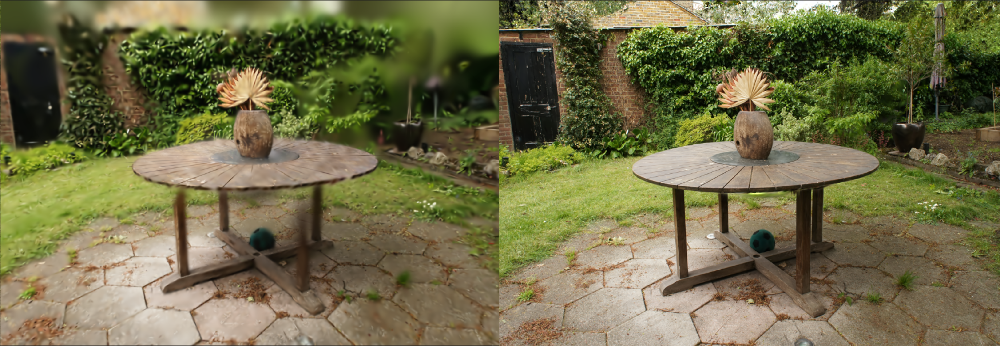
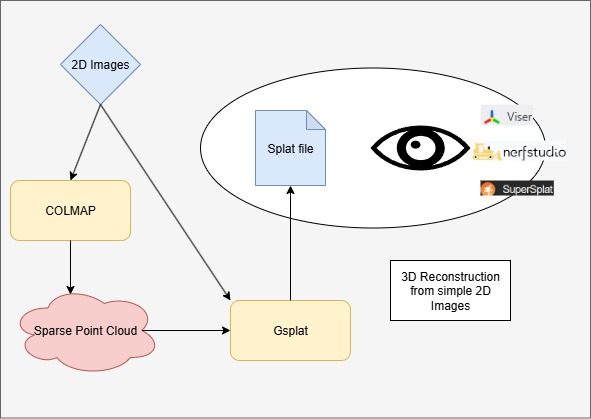
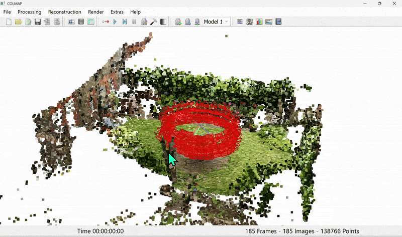
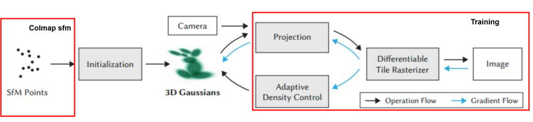
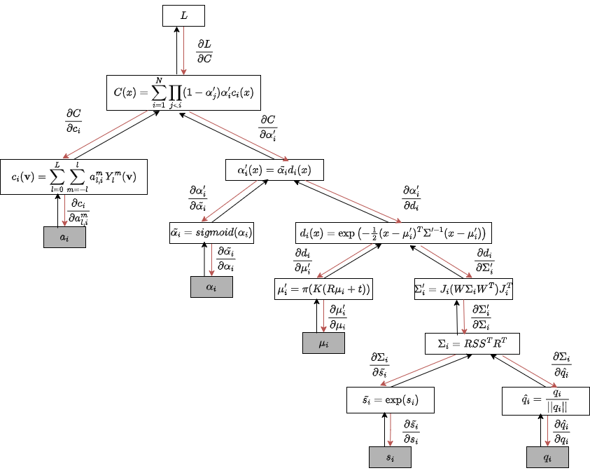

<!---
Copyright (c) 2025 Advanced Micro Devices, Inc. (AMD)

Permission is hereby granted, free of charge, to any person obtaining a copy
of this software and associated documentation files (the "Software"), to deal
in the Software without restriction, including without limitation the rights
to use, copy, modify, merge, publish, distribute, sublicense, and/or sell
copies of the Software, and to permit persons to whom the Software is
furnished to do so, subject to the following conditions:

The above copyright notice and this permission notice shall be included in all
copies or substantial portions of the Software.

THE SOFTWARE IS PROVIDED "AS IS", WITHOUT WARRANTY OF ANY KIND, EXPRESS OR
IMPLIED, INCLUDING BUT NOT LIMITED TO THE WARRANTIES OF MERCHANTABILITY,
FITNESS FOR A PARTICULAR PURPOSE AND NONINFRINGEMENT. IN NO EVENT SHALL THE
AUTHORS OR COPYRIGHT HOLDERS BE LIABLE FOR ANY CLAIM, DAMAGES OR OTHER
LIABILITY, WHETHER IN AN ACTION OF CONTRACT, TORT OR OTHERWISE, ARISING FROM,
OUT OF OR IN CONNECTION WITH THE SOFTWARE OR THE USE OR OTHER DEALINGS IN THE
SOFTWARE.
--->

# 3D Scene Reconstruction from the Inside: Explore the Mathematics Behind gsplat


[3D Gaussian Splatting (3DGS)](https://dl.acm.org/doi/10.1145/3592433) reconstructs 3D scenes from multiple 2D images and renders novel views in real time. In this blog, which serves as a follow up to a previous post, [Elevating 3D Scene Rendering with GSplat](https://rocm.blogs.amd.com/software-tools-optimization/gsplat/README.html), you will learn the core mathematics and the practical library components behind 3DGS using [gsplat](https://github.com/ROCm/gsplat).

We will start with explaining how 3D points in a scene become 3D Gaussians, how they project to 2D splats to produce images, and how rendering, loss functions, and adaptive density control fit together. This blog showcases the key equations, parameterizations, and how gsplat implements projection and rasterization on the GPU.

By the end, you will be able to understand and reason about 3DGS implementations and trace the training pipeline all the way from COLMAP initialization to rendering of novel views. Explore the gsplat [repo](https://github.com/ROCm/gsplat) and [docs](https://rocm.docs.amd.com/projects/gsplat/en/latest/) as you read, and look into linked resources for deeper dives.

Interested in using this in practice? Review the referenced setup guides and try rendering a simple scene with gsplat after you finish the explanation section.


## 3DGS Basics

3D scene reconstruction is a powerful set of methods for building computational models of 3D scenes using only limited data sources captured from
a real-world scene. Most often this is done with photographs, though other captured data may be used: for example, a car may be equipped with cameras
and lidar sensors, and the data from these can be combined to build a 3D model of the surroundings.

A number of techniques, like **meshes** and **[NeRFs](https://dl.acm.org/doi/10.1145/3503250)**, have been developed to address the task of reconstructing a 3D scene from 2D images, such that the resulting representation can be
used to render views of the objects in the scene that were not directly observed in the training images.
**3DGS** represents a scene as a collection of 3D Gaussians, each with position, shape, color, and opacity. 
These Gaussians can be projected, blended, and optimized to match the appearance of real photos. As well as rendering novel
scene views, 3DGS has the advantage (compared to NeRFs) that it explicitly models the structure of the scene, making it
possible to retrieve 3D geometry from the positions and shapes of the Gaussians.

### What is a Splat though? 

Think of splat as a liquid blob splashed on a wall. A splat is a 2D projection of a 3D Gaussian, visualized as an elliptical, semi-transparent patch on the screen. It looks like a soft, fuzzy blob with a specific location, shape, color and transparency as depicted in *Figure 1*. By combining a large number of 2D splats, it is possible to produce an accurate reconstruction of an image (say for example, a photo, look at *Figure 2*). By positioning and coloring large numbers of 3D Gaussians in a 3D space, we can create a 3D scene reconstruction that produces something very similar to the original scene captured by the photos used to create the rendering. 2D images can be recreated by splatting the 3D Gaussians onto 2D planes, which are positioned similarly to where the cameras were when the photos were taken.


*Figure 1. Visualization of a splat.*




*Figure 2. Rendering the garden scene from the [Mip-NeRF 360 dataset](https://jonbarron.info/mipnerf360/) with different number of splats. The left image contains about 1K Gaussians, obtained after 500 training iterations of 3D Gaussian Splatting. The right image includes 6M Gaussians, corresponding to 30K training steps. As shown, a larger number of Gaussians enables much finer detail in the reconstruction.*


### Why use Gaussian splats?

In 3DGS, we represent a scene using Gaussians defined in 3D space. Why is this preferable to alternative representations, like
triangular meshes, voxels or continuous 3D volumetric functions (e.g. NeRF)?

* Triangles are sharp, discrete (discontinuous) and require explicit mesh connectivity.
* Pixels are only 2D, so have no 3D spatial structure. Voxels generalise this idea to 3D space.
* Voxels are memory-heavy and, like triangles, are discrete and discontinuous.
* Point clouds (such as those produced by COLMAP) lack size/volume and visual richness.

Gaussians have a soft volumetric nature and, when projected onto the image plane, appear as 2D ellipses (splats). Because Gaussians are continuous and smooth, they are differentiable in 3D space, a property that makes them well-suited for optimization techniques such as gradient descent, which play a central role in this method. 

Additionally, 3DGS incorporates view-dependent color through **spherical harmonics**, allowing a single representation of an object to vary in appearance when viewed from different angles. This is an efficient and elegant way to capture reflection and lighting effects. 

In summary, this approach unifies geometry, appearance, and transparency into a single continuous and trainable representation.

We now turn to the mathematical representation and parameterization of a 3D Gaussian.


## Mathematical Representation

A 3D Gaussian at index $i$ is defined by the following density function:

$$ G_i(\mathbf{x}) = \alpha_i \, \exp\left( -\tfrac{1}{2} (\mathbf{x} - \boldsymbol{\mu}_i)^\top \boldsymbol{\Sigma}_i^{-1} (\mathbf{x} - \boldsymbol{\mu}_i) \right), $$

where:

* $\mathbf{x} \in \mathbb{R}^3$ is the query point in 3D space.
* $\boldsymbol{\mu}_i \in \mathbb{R}^3$ is the mean (position) of Gaussian $i$.
* $\boldsymbol{\Sigma}_i \in \mathbb{R}^{3 \times 3}$ is the covariance matrix of Gaussian $i$, which describes orientation + spread (anisotropy).
* $\alpha_i \in [0,1]$ is the opacity/weight of Gaussian $i$, which controls its contribution in scene representation.

This is the standard anisotropic Gaussian distribution, except normalization constants are omitted since we are interested in density rendering rather than probability.

Each Gaussian is parametrized by:

1. **Position** $\mu_i = (x, y, z)$: where the Gaussian is located in 3D space.

2. **Shape (covariance)** $\Sigma_i$: the Gaussian's size and orientation in 3D. It is often parameterized as $\Sigma_i = R_i S_i S_i^\top R_i^\top$, where $R_i$​ is the rotation and $S_i$​ is the scaling (diagonal).

3. **Opacity** $\alpha_i$:​ the transparency of the Gaussian, which is used during rasterization to determine how this Gaussian is composited with others that it overlaps with when viewed in 2D.
4. **Color Representation** $c_i$ :

    When Gaussians are rasterized during splatting, they are combined to determine the RGB color of each pixel of the 2D image. Instead of each Gaussian storing a constant RGB color, 3DGS assigns the Gaussian a set of spherical harmonic (SH) coefficients for every color channel. Spherical harmonics can approximate any function on a sphere using a combination of basis functions. In this way, the Gaussian is associated with a parameterized function of the viewing direction $\textbf{v}$ whose output $c_i(\mathbf{v})$ gives the RGB value.

    <div align="center">

    $$c_i(\mathbf{v}) = \sum_{l=0}^L \sum_{m=-l}^{l} a^m_{l,i} \, Y_l^m(\mathbf{v}),$$

    </div>

    1. $\mathbf{v}$ is the viewing direction.

    2. $Y_l^m$ are real-valued SH basis functions.


    3. $a^m_{l,i}$ are the learned SH coefficients for each Gaussian. If we truncate at degree $L$, there are $(L+1)^2$ coefficients per Gaussian per color channel.

   This way, 3DGS is able to model view-dependent appearance, like reflections and lighting effects.

5. **Further optional features** are added by extensions to the basic model to capture richer aspects of scenes. For example: per-Gaussian confidence, learned scale bounds, and temporal properties for dynamic scenes (e.g., velocities, time-dependent appearance).

## Rendering 3DGS in Practice

[gsplat](https://docs.gsplat.studio/main/) is a GPU-optimized, open-source library for 3D Gaussian Splatting. The [ROCm port](https://github.com/rocm/gsplat) allows it to be
used for fast training and rendering of 3DGS scenes on AMD Instinct™ GPUs.

In *Figure 3* showcased below, you can see a visualization of a randomized 3D Gaussian using this library:

```python
import torch
from gsplat import rasterization
means = torch.tensor([[0.0, 0.0, 1.0]], dtype=torch.float32, device="cuda")
scales = torch.empty((1, 3), dtype=torch.float32, device="cuda").uniform_(0.05, 0.4)
quats = torch.randn((1, 4), dtype=torch.float32, device="cuda")
quats = quats / quats.norm(dim=1, keepdim=True)  # Normalize to unit quaternion
colors = torch.empty((1, 3), dtype=torch.float32, device="cuda").uniform_(0.0, 1.0)
opacities = torch.empty(1, dtype=torch.float32, device="cuda").uniform_(0.5, 1.0)
W, H = 256, 256
view = torch.eye(4, dtype=torch.float32, device="cuda").unsqueeze(0)
K = torch.tensor([[100, 0, W/2], [0, 100, H/2], [0, 0, 1]], 
                 dtype=torch.float32, device="cuda").unsqueeze(0)

rgb, alpha, _ = rasterization(means, quats, scales, opacities, 
                              colors, view, K, W, H)
```


*Figure 3. Rasterization of a randomized 3D Gaussian using gsplat library.*

Now that the ground is set and we understand the representations of 3D Gaussians, let’s dive into the magic behind this technique and take a look
at how the process of scene reconstruction works from a technical perspective. 


## The 3DGS Process

The process of 3D scene reconstruction can be broken down into three major stages, represented diagrammatically in *Figure 4*:

1. **Data collection** using a camera and **generating a point cloud** from the resulting images.
2. **Optimizing** the initial point cloud into 3D Gaussians by comparing rendered views with input images as ground truths.
3. **Rendering** novel views of the scene from previously unseen angles.



*Figure 4. Outline of the entire process.*

### Stage 1: Data collection and point cloud generation

The first task is to collect the images of the object or scene that we want to build a 3D model of. We do this using a camera and take photos from multiple overlapping viewpoints.

Now this data has to be processed using a Structure-from-Motion (SfM) tool. This provides two essential inputs to the 3DGS training:
1. An estimate of the **poses** (positions and directions) of the camera when each photo was taken. Using a normal camera, we need to infer this automatically before 3DGS can work. If you capture images using a specialised camera rig or other setup that provides information about the poses of the cameras, this is not necessary.
2. A **point cloud**, giving an initial rough estimate of the 3D positions and colors of some of the surfaces that are visible in the scene. This is used to *initialize* the positions and colors of Gaussians. The parameters of the Gaussians will then be optimized by 3DGS and further Gaussians will be added through the *densification* process.

There are several such tools that implement similar SfM pipelines and that can be used for these preliminary steps for 3DGS. SfM is a computer vision technique that reconstructs 3D structures from a series of 2D images by estimating camera poses and sparse 3D points. An SfM library provides tools and algorithms to automate this process — handling feature extraction, matching, camera calibration, and sparse point cloud generation.

A popular SfM library is [COLMAP](https://github.com/colmap/colmap). The reconstruction it performs is based on the view points, triangulation and feature matching. It generates a 3D point cloud.
We describe the process carried out by COLMAP here, but alternative tools, like [OpenMVG](https://github.com/openMVG/openMVG) or [Meshroom](https://github.com/alicevision/Meshroom), follow a similar process.

#### COLMAP: Feature extraction

When you feed COLMAP a set of images, the first step in the pipeline is feature extraction. The goal here is:
1. Detect **distinctive keypoints** (corners, blobs, edges that are stable across viewpoints, scale, illumination).
2. Compute **descriptors** (numerical vectors that describe the local image patch around each keypoint).

These will be matched in the next step.

COLMAP uses [**SIFT (Scale-Invariant Feature Transform)**](https://en.wikipedia.org/wiki/Scale-invariant_feature_transform) by default, which is a popular technique used in Computer Vision to extract local features in an image. 
The output of this stage is keypoints and SIFT vectors.

#### COLMAP: Feature matching

Once COLMAP has extracted **keypoints and descriptors (SIFT vectors)** for all images, it needs to figure out which points in one image correspond to points in another image.

This is the *feature matching stage*, and it is the backbone of Structure-from-Motion (SfM) since it generates 2D–2D correspondences across images.
A **correspondence** is simply a pairing of points in two (or more) images that are believed to be the projection of the same 3D world point.

These correspondences feed into camera pose estimation and triangulation to build 3D structure.
    
The matching finds nearest-neighbor descriptors across images and filters them with Lowe’s ratio — the ratio of the distance of the closest keypoint match to the distance of the second closest match. 
The lower the value of the ratio, the greater the difference, thus the higher the confidence.

#### COLMAP: Geometric verification

After COLMAP finds tentative matches between descriptors, even then many false correspondences still exist.

The *geometric verification stage* removes these by enforcing *epipolar geometry* — ensuring that corresponding points in two camera views lie on matching epipolar lines. For this it uses the [RANSAC iterative method](https://en.wikipedia.org/wiki/Random_sample_consensus).

The goal is to keep only matches that are geometrically consistent, ensuring that each match could come from a real 3D point projected into both images. This stage outputs a clean set of geometrically verified correspondences between the image pair.

#### COLMAP: Scene reconstruction

COLMAP's reconstruction algorithm works as follows, using the results from the feature extraction, matching, and verification steps.

1.  **Initialization**: COLMAP starts by bootstrapping the reconstruction with two images that have a good number of verified matches.
    1.  Select initial image pair, the one with the largest number of inlier correspondences, ensuring a strong baseline and stable geometry.
    2.  Estimate relative pose. Recover rotation *R* and translation *t* between the two cameras
    3.  Initial triangulation. For each correspondence between the images, compute a 3D point via triangulation.
2.  **Image Registration (Incremental Reconstruction)**: From  these two cameras and initial 3D points, COLMAP grows the model by adding new images incrementally.
    1. Find 2D–3D correspondences. For an unregistered image, match its keypoints against the existing 3D points’ descriptors.
    2. Camera pose estimation. Use *Perspective-n-Point (PnP)* to estimate camera pose.
    3. Add the image to the reconstruction to be used in further incremental steps.

#### COLMAP: Bundle adjustment

*Bundle adjustment* is a **global optimization step** to refine both 3D points and camera parameters jointly.
This serves to make the reconstruction globally consistent.

It uses an objective function that minimises the projection error of each point when it is projected from the cameras from which it was observed under the optimised (or known) camera parameters and pose.



*Figure 5. Colmap output of sparse point cloud*
### Stage 2: Training the 3DGS model



*Figure 6. Training flow for 3DGS*

Once we have the sparse point cloud from SfM (*Figure 5*), we proceed to the main training routine of 3DGS (*Figure 6*).

At a high level, this works as follows:
1. Initialize a set of 3D Gaussians, using the point cloud from COLMAP as an initial best guess as to their positions and colors.
2. Randomly sample one of the real images of the scene.
   * Using the camera pose that was inferred by COLMAP for this image, render a new image of our current scene reconstruction from the same angle. With a perfect reconstruction, this would exactly match the real image.
   * Compute a loss based on the differences between the reconstructed image and the real image.
   * Backpropagate the loss to compute a gradient descent update to the scene parameters (Gaussian centers, covariances, etc).
3. Repeat step 2 until specified accuracy is reached, periodically adjusting the number of Gaussians by adaptive density control.

We describe each of these steps in more detail below.

#### Initialization

COLMAP provides camera intrinsics and extrinsics (poses), along with sparse point clouds. 
During the initialization of 3D Gaussian Splatting, each point in the cloud is represented as a Gaussian with a small, isotropic covariance and is given the color assigned to it by COLMAP.

$$\mu_i = \text{3D point location}, \quad \Sigma_i = \sigma^2 I$$

Colors (or rather, SH coefficients) are initialized based on the corresponding image observations, while opacities are typically set to small uniform values.

#### Rendering an image

In order to compute a loss function for the current scene reconstruction (the *reconstruction loss*), we first need to render an image of the scene from
a known camera position and angle.
The reconstruction loss (and therefore also the rendering process) must be differentiable, so we can incrementally optimize the scene reconstruction using stochastic gradient descent (SGD).

To render an image for a given set of Gaussian parameters, 
we need to **project each 3D Gaussian into the 2D screen space** corresponding to the viewing plane of the camera, accounting for the camera’s position and perspective $\Sigma' = J (W \Sigma W^T) J^T$.
In image space, each 3D Gaussian is projected as a 2D elliptical Gaussian kernel.

The same rendering process is then used after training in order to render novel images of the scene from arbitrary poses. Projection happens via [forward and backward GPU kernels](https://github.com/ROCm/gsplat/blob/release/1.0.0/gsplat/cuda/csrc/ProjectionEWA3DGSFused.cu).

##### From 3D Space to Camera Space

We can transform the center point of the 3D Gaussian, $\mu_i$, into the camera's coordinate system by:  


$$  
R_c \mu_i + t_c,  
$$


where $R_c$ and $t_c$ are rotation matrix and translation vector of camera $c$, respectively. $R_c$ and $t_c$ are set from COLMAP’s output and fixed during this step.

To transform the covariance of the 3D Gaussian into the camera’s coordinate system, we apply the viewing transformation matrix, which translates and rotates the 3D Gaussian from its position in the world into the camera space:

$$  
W \Sigma W^T,  
$$

where $\Sigma$ is the original 3D covariance matrix that defines the Gaussian’s shape and orientation in world coordinates, and $W = R_c$ is the viewing transformation matrix encoding the camera’s position and rotation.

The linear transformation of $\mu$ and $\Sigma$ produces a new 3D Gaussian as seen from the camera’s perspective, where the camera is assumed to be at the origin $(0,0,0)$, looking along its viewing direction.

##### From camera space to image space

Next, we apply the perspective projection, which makes objects farther away appear smaller and objects at an angle appear distorted.

First, we transform the center point from camera space to the image space:
    

$$  
\mu_i' = \pi (K(R_c \mu_i + t_c)),  
$$

where $K$, the camera's intrinsic matrix, is a $3 \times 3$ matrix containing the camera's **focal length** ($f_x, f_y$) and **principal point** ($c_x, c_y$). The perspective transformation $\pi$ means we divide the $x$ and $y$ components by the $z$ component (depth).

Next, we transform the covariance matrix from camera space to the image space:
    

$$  
\Sigma' = J(W \Sigma W^T)J^T,  
$$

where the Jacobian matrix $J$ is the derivative of the projection function with respect to the 3D point, evaluated at the Gaussian’s center. This projection function incorporates the camera's intrinsic matrix $K$ and the perspective divide. Perspective is not a purely linear transformation, since the apparent size of objects depends on depth. By using the Jacobian, we approximate this nonlinear mapping locally as a linear transformation at the Gaussian’s center. The result is a 2D ellipse with 2D covariance $\Sigma'$ on the image plane that represents the projected shape of the Gaussian.

##### Ensuring a positive semi-definite covariance matrix

Since a covariance matrix must always be **positive semi-definite** (a 3D ellipsoid cannot have negative or zero extent along any axis), directly optimizing its entries with gradient descent can break this property. To avoid this, the covariance is parameterized using a scaling matrix $S$ and a rotation matrix $R$:

$$  
\Sigma = R S S^T R^T  
$$

Here, $S$ is typically chosen as a diagonal matrix built from a scale vector $\mathbf{s}$ (radii). Multiplying $S$ with its transpose yields squared scales along each axis, which are always non-negative. The rotation $R$ is obtained from a unit quaternion $q$, which is normalized from unconstrained parameters before being converted into a $3 \times 3$ rotation matrix. This parameterization ensures that the covariance remains positive semi-definite under gradient-based updates. To guarantee strictly positive variances (i.e., a non-degenerate covariance), the scale vector is typically parameterized in log-space as $\mathbf{s} = \exp(\mathbf{s'})$, where $\mathbf{s'}$ are unconstrained parameters.

##### Rasterization

Now we combine projected Gaussians into pixels via the process of rasterization, which is nothing but a result of stacking up semi-transparent Gaussians, known as alpha blending. This complex process is implemented under various [forward](https://github.com/ROCm/gsplat/blob/release/1.0.0/gsplat/cuda/csrc/RasterizeToPixels3DGSFwd.cu) and [backward](https://github.com/ROCm/gsplat/blob/release/1.0.0/gsplat/cuda/csrc/RasterizeToPixels3DGSBwd.cu) GPU kernels. 

1.  For pixel $x \in \mathbb{R}^2$, the contribution from 2D Gaussian $i$ is:
    

$$ \alpha'_i(x) = \tilde{\alpha_i} d_i(x) = \mathrm{sigmoid}(\alpha_i) \exp\left(-\tfrac{1}{2}(x - \mu'_i)^T \Sigma'^{-1} (x - \mu'_i)\right) ,$$

where $\mu’_i$ and $\Sigma’_i$ are the mean and covariance matrix of the 2D Gaussian $i$, and $\alpha_i$ is the learned opacity of Gaussian $i$. A sigmoid function is used to ensure the opacity is in $[0, 1]$.

2.  Finally, all of the Gaussians that overlap a pixel are depth sorted from front to back, where depth is the distance each Gaussian is situated from the camera. Then, they are alpha blended as follows:
    

$$ C(x) = \sum_{i=1}^N T_i \alpha'_i c_i(x), $$

where:

$T_i = \prod_{j < i} (1 - \alpha'_j)$ is the transmittance from earlier Gaussians (the probability of light that survives previous Gaussians $j$ and reaches current Gaussian $i$), and $c_i(x)$ is the color of Gaussian $i$.
    

##### GPU rasterization

For rasterization, we need to sort the Gaussians from farthest to nearest (back to front), based on their depth values. We can use GPU-optimized sorting algorithms for this. [The backward GPU kernel](https://github.com/ROCm/gsplat/blob/bffd2aefbb57e57439b38b065d240675b15c4131/gsplat/cuda/csrc/RasterizeToPixels3DGSBwd.cu) takes care of the efficient sorting operation in the gsplat codebase.

1.  The screen is divided into smaller regions called tiles, e.g. $16 \times 16$ tiles. GPUs can process these tiles in parallel.
    
2.  Each Gaussian will be assigned with the tiles it overlaps. An instance of that Gaussian is created for each overlapping tile. As a Gaussian may overlap multiple tiles, multiple instances of it may be generated, potentially adding a small overhead which will be negated by the parallel computing of GPUs.
    
3.  For each of these instances, a 64-bit key is assigned, combining the **Tile ID** and **Gaussian’s** **depth value**.
    
4.  A GPU-optimized sorting algorithm is used to sort these keys in parallel. Since the **Tile ID** is the higher bits of the keys, the sorting algorithm will group all instances belonging to the same tile together, then sort the instances based on the depth values.
    
5.  During the final rendering, a separate GPU thread can work on a pre-sorted list of Gaussians per tile.
    

#### Training

The following loss function is used to compare the rendered image with the ground-truth training image in [the codebase](https://github.com/ROCm/gsplat/blob/release/1.0.0/examples/simple_trainer.py#L687).
The [loss function](https://github.com/ROCm/gsplat/blob/bffd2aefbb57e57439b38b065d240675b15c4131/examples/simple_trainer.py#L690) is a combination of **photometric loss** ($L_1$ loss) and the **structural similarity index measure** loss ($L_{SSIM}$) between the rendered and the ground truth images:

$$ L = (1-\lambda) L_1 + \lambda L_{SSIM} $$

The **structural similarity index** measures loss, $L_{SSIM}=1-SSIM$, instead of just comparing pixel-by-pixel differences, evaluates image quality by comparing **luminance**, **contrast**, and **structure** features.

Some optional regularization terms include:

1.  Opacity regularization loss to prevent trivial full transparency, i.e., all opacities going to zero.
2.  Covariance shrinkage loss to avoid exploding Gaussians by penalizing excessively large covariances.

Since the rendering process is differentiable with respect to $\mu_i, \Sigma_i, \alpha_i, and \mathbf{c}_i$, the Gaussian parameters can be optimized via backpropagation. In *Figure 7* below, you can see both the forward and backward pass of 3DGS.



*Figure 7. Forward and backward pass in 3D Gaussian Splatting. Adapted from [gsplat: An Open-Source Library for Gaussian Splatting](https://arxiv.org/pdf/2409.06765).*

#### Adaptive density control (ADC)

After each training iteration, 3DGS updates the set of Gaussians by:
1.  **Splitting:** If a Gaussian covers too large an image area (low detail), split into multiple smaller Gaussians.
2.  **Cloning:** If gradient magnitude is large in a region, duplicate Gaussians for more capacity.
3.  **Pruning/Culling:** Remove Gaussians with very low opacity as they will have negligible contribution to the final rendering.
    

This prevents under/overfitting and balances efficiency vs quality.
There are various densification strategies that gsplat supports and implements:
* [gsplat's default ADC strategy](https://github.com/nerfstudio-project/gsplat/blob/0b4dddf0/gsplat/strategy/default.py#L79-L94): implements the densification approach from the original 3D Gaussian Splatting paper, with optional support for absolute gradients from the AbsGS paper.
* [ABSGRAD](https://github.com/ROCm/gsplat/blob/bffd2aefbb57e57439b38b065d240675b15c4131/gsplat/strategy/default.py#L91): uses absolute gradients to avoid opposing gradients neutralizing each other.  
* [MCMC](https://github.com/ROCm/gsplat/blob/release/1.0.0/gsplat/strategy/mcmc.py): the densification adopts a probabilistic approach. By recasting the set of Gaussians as a sample drawn from an underlying probability distribution, this method treats inference as a Markov Chain Monte Carlo sampling method that draws successive samples from this distribution. This entails a small update to the SGD update during training to add a controlled amount of noise to the center of Gaussians (making the update an instance of **Stochastic Gradient Langevin Dynamics (SGLD)**). ADC is slightly modified such that it preserves the probability of the MCMC sample. In practice, this causes the new Gaussians to appear away from crowded and low-error regions and the optimization better identifies where new primitives are needed to reduce the residual error.  

| Strategy | Criterion for Adding Gaussians           | Strengths                           | Weaknesses                   |
|----------|------------------------------------------|-------------------------------------|-----------------------------|
| Default  | Reprojection error (loss-driven)         | Stable, simple                      | May add redundant splats    |
| MCMC     | Probabilistic sampling, acceptance ratio | Balanced distribution, better scene structure | Slower, higher compute cost |
| AbsGrad  | High absolute image gradients            | Preserves edges & details           | May neglect flat regions    |

```{note}
There is no single one-size-fits-all strategy. Users are advised to experiment with these,
as results vary based on the type of scene, input data, etc.
```

#### Output Evaluation Metrics

The following metrics are used for final output evaluation:

-    **Peak Signal-to-Noise Ratio (PSNR):** This metric measures the pixel-wise difference between the rendered image and the ground truth image and is calculated as $10 \cdot \log_{10} \frac{L^2}{\text{MSE}}$, where $L$ is the maximum possible pixel value, and $MSE$ is the mean squared error between the two images. It is sensitive to small pixel differences, and is good for fidelity assessment, but not perceptual quality.
-   **SSIM**: This metric, also used in the loss function, assesses the perceptual similarity between the two images. It is sensitive to luminance, contrast, and structure and has a range between 0 and 1, with 1 meaning identical images. This metric is calculated as:
    $\text{SSIM}(x, y) = \frac{(2\mu_x\mu_y+C_1)(2\sigma_{xy}+C_2)}{(\mu_x^2\mu_y^2+C_1)(\sigma_x^2\sigma_y^2+C_2)}$,
    where $x$ and $y$ are the images being compared, $\mu_x, \mu_y$ are the means of $x$ and $y$, $\sigma_x, \sigma_y$ are the variances of $x$ and $y$, $\sigma_{xy}$ is the covariance of $x$ and $y$, and $C_1, C_2$ are small constants for division stabilization.
-   **Learned Perceptual Image Patch Similarity (LPIPS)**: This is a **learned perceptual metric**. It uses pretrained neural network features like VGG or AlexNet for its comparison. LPIPS is considered the most aligned with human perception and is sensitive to blurriness and unnatural textures, which PSNR and SSIM might miss. It has a range between 0 and 1, with lower values corresponding to better quality. The metric is calculated as:
    $\text{LPIPS}(x, y) = \sum_l \left\| w_l \odot (\hat{y}_l - y_l) \right\|_2^2$,
    where $x$ and $y$ are the images being compared, $\hat{y}_l, y_l$ are the normalized feature maps at layer $l$, and $w_l$ is the learned weights for layer $l$


### Stage 3: Novel view rendering

Ultimately, the value of building a 3DGS model of a 3D scene lies in being able to render not just the views that were seen at training time but novel
views of the scene. Once training finishes it essentially means we have correctly tuned the attributes of the total gaussians required to represent the scene in 3D and now all this information is stored and saved in a splat file which is generated as the output of the training step at the end.

Once we have the splat file we can use [simple_viewer.py](https://github.com/ROCm/gsplat/blob/release/1.0.0/examples/simple_viewer.py) or various other open source splat editors/viewers like [antimatter](https://github.com/antimatter15/splat), [supersplat](https://superspl.at/editor/), or [gaussian-viewer](https://pypi.org/project/gaussian-viewer/) to view, edit, and modify the splats or even to create an entirely new scene out of the available splat files.

Exactly the same rendering process performed during training to compute the reconstruction loss (see [*Rendering*](#stage-2-training-the-3dgs-model) above) can be used to
render novel views of a trained scene. We need to specify the position vector and rotation matrix of the camera, as we
did during training, and then apply the same projection and rasterization functions as before, resulting in a new image.
By generating a series of images with the camera at different positions, we can render a video that passes through the scene.
Using fast GPU rendering, we can even move around the scene using first-person position/direction controls and render new views in
real time. The video in *Figure 8* demonstrates this.

```{video} images/SplatEditing.mp4
:width: 720
:height: 405
:controls:
```

*Figure 8. Rendering and editing being performed on a splat file using [supersplat](https://superspl.at/editor/) viewer.*

## Summary

We have taken an in-depth look at the math behind Gaussian splatting and some of the tricks that help to get great results out of it. If you're curious and want to experiment with this cutting-edge technology, or want to train your own scenes on the [MI300X](https://www.amd.com/en/products/accelerators/instinct/mi300/mi300x.html), check out our [public repo](https://github.com/ROCm/gsplat), a fork of gsplat that enables lightning-fast performance on ROCm-based AMD GPUs. You can also take a look at [our previous blog](https://rocm.blogs.amd.com/software-tools-optimization/gsplat/README.html), where we break down setup steps, benchmarks and optimizations.  

At AMD, we are actively working on high-performance 3DGS using ROCm. At AMD Silo AI, we are using gsplat and related technologies for cutting-edge
applications in autonomous driving, so expect fresh 3DGS-related insights soon!

Happy splatting! 😁


## Disclaimers

Third-party content is licensed to you directly by the third party that owns the
content and is not licensed to you by AMD. ALL LINKED THIRD-PARTY CONTENT IS
PROVIDED “AS IS” WITHOUT A WARRANTY OF ANY KIND. USE OF SUCH THIRD-PARTY CONTENT
IS DONE AT YOUR SOLE DISCRETION AND UNDER NO CIRCUMSTANCES WILL AMD BE LIABLE TO
YOU FOR ANY THIRD-PARTY CONTENT. YOU ASSUME ALL RISK AND ARE SOLELY RESPONSIBLE
FOR ANY DAMAGES THAT MAY ARISE FROM YOUR USE OF THIRD-PARTY CONTENT.
