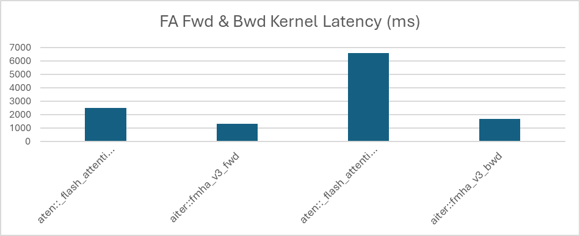
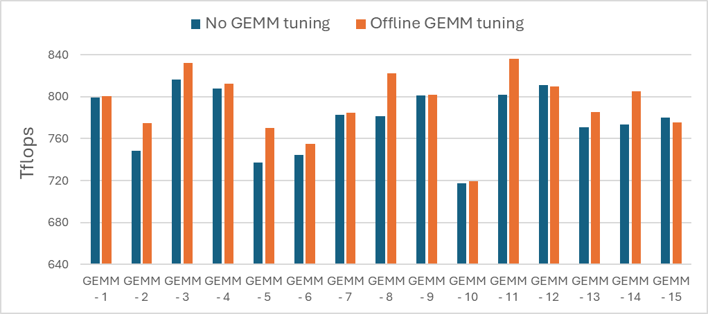
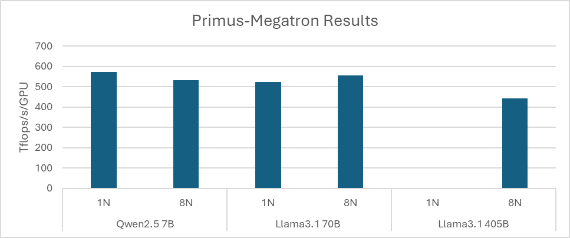
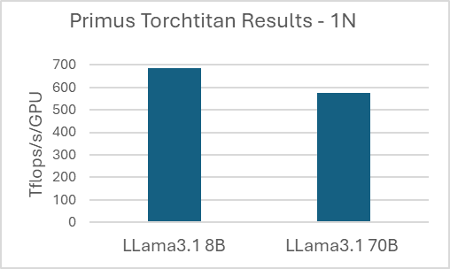

<!---
Copyright (c) 2026 Advanced Micro Devices, Inc. (AMD)

Permission is hereby granted, free of charge, to any person obtaining a copy
of this software and associated documentation files (the "Software"), to deal
in the Software without restriction, including without limitation the rights
to use, copy, modify, merge, publish, distribute, sublicense, and/or sell
copies of the Software, and to permit persons to whom the Software is
furnished to do so, subject to the following conditions:

The above copyright notice and this permission notice shall be included in all
copies or substantial portions of the Software.

THE SOFTWARE IS PROVIDED "AS IS", WITHOUT WARRANTY OF ANY KIND, EXPRESS OR
IMPLIED, INCLUDING BUT NOT LIMITED TO THE WARRANTIES OF MERCHANTABILITY,
FITNESS FOR A PARTICULAR PURPOSE AND NONINFRINGEMENT. IN NO EVENT SHALL THE
AUTHORS OR COPYRIGHT HOLDERS BE LIABLE FOR ANY CLAIM, DAMAGES OR OTHER
LIABILITY, WHETHER IN AN ACTION OF CONTRACT, TORT OR OTHERWISE, ARISING FROM,
OUT OF OR IN CONNECTION WITH THE SOFTWARE OR THE USE OR OTHER DEALINGS IN THE
SOFTWARE.
--->

# Deep Dive into Primus: High-Performance Training for Large Language Models

[Primus](https://rocm.blogs.amd.com/software-tools-optimization/primus/README.html) is the AMD unified training framework designed to deliver high-performance, scalable large language models (LLMs) training across multiple backends – including TorchTitan and Megatron-LM. It provides a consistent CLI interface, while each backend ships with carefully optimized configurations for popular open-source models. These backend-specific presets ensure the best out-of-the-box performance on AMD Instinct™ GPUs. In this deep dive, we walk through the best practices for achieving peak performance when training dense LLMs on Primus.

## Bottleneck Analysis

To understand where training optimizations matter most, we begin by examining the performance bottlenecks of dense LLMs using Llama 3.1 70B as an example. 

As shown in Table 1, more than 99% of the total training time is spent on computation when running Llama 3.1 70B on Primus (TorchTitan backend, no optimizations). Communication overhead and idle time are minimal, indicating that the workload is overwhelmingly compute-bound. 

A kernel-level operations breakdown (Table 2) further highlights that aten::mm (GEMM) and FlashAttention account for approximately 94% of total training time combined. These two operator families dominate the training cost for large dense models.

Because of this, the Primus ecosystem includes an optimized kernel library —Primus-Turbo—which accelerates GEMM and FlashAttention kernels through architecture-aware tuning and ROCm-optimized implementations. These enhancements significantly boost overall training throughput.

    
| Type                 | Time (ms) | Percent |
|----------------------|-----------|---------|
| computation_time     | 33681     | 99.76   |
| exposed_comm_time    | 50        | 0.15    |
| busy_time            | 33731     | 99.91   |
| idle_time            | 31        | 0.09    |
| total_time           | 33763     | 100.00  |

Table 1. GPU timeline from [Tracelens](https://github.com/AMD-AGI/TraceLens/tree/main)

    
| Kernel Operator                     | Percentage (%) | Cumulative Percentage (%) |
|------------------------------------|----------------|---------------------------|
| aten::mm                            | 67.43          | 67.4                      |
| aten::_flash_attention_backward    | 19.47          | 86.9                      |
| aten::_flash_attention_forward     | 7.48           | 94.4                      |
| Others                              | 5.62           | 100                       |

Table 2.  Kernel Op Summary from [Tracelens](https://github.com/AMD-AGI/TraceLens/tree/main)

## FlashAttention Optimization

Given that the FlashAttention represents one of the dominant compute hotspots for dense LLMs, Primus incorporates an optimized implementation through the [AITER](https://github.com/ROCm/aiter) kernel library, seamlessly enabled via Primus-Turbo.

When Primus-Turbo is activated, Primus automatically switches to AITER’s optimized aiter::fmha_v3_bwd and aiter::fmha_v3_fwd kernels. As shown in Figure 1, these kernels dramatically reduce FlashAttention latency — by 75% for the backward pass and 47% for the forward pass — yielding substantial improvements in end-to-end training performance for models such as Llama 3.1 70B.

*Figure 1. Native and AITER FlashAttention kernel comparison.*

## GEMM Tuning
Beyond FlashAttention, GEMM (aten::mm) is the major contributor to training time for dense LLM. To address this, AMD provides two complementary approaches within the ROCm™ ecosystem: online GEMM tuning and offline GEMM tuning.

Online GEMM tuning, available through the ROCm Transformer Engine library, performs lightweight, on-the-fly kernel selection using a smaller search space. This method is designed for quick integration and is recommended when tuning must occur during training.

In contrast, offline GEMM tuning leverages the hipblaslt-bench utility to explore a much larger search space. Because of its exhaustive nature, offline tuning is intended to run ahead of time, with results cached and reused in future runs for maximum efficiency.

Both approaches optimize GEMM performance by selecting the best-performing kernels from the AMD preferred hipBLASLt backend. Figure 2 shows that GEMM performance can increase by up to 5% for GEMM kernels present in Llama3.1 70B.

*Figure 2. GEMM performance uplift post GEMM tuning.*

Motivated by the strong gains from AITER FlashAttention and GEMM tuning, Primus integrates these optimizations directly into all end-to-end training workflows. This ensures that users consistently benefit from the best available kernel performance without requiring additional manual configuration.

## End-to-End Dense LLM Training on Primus

In this section, we outline recommended sharding and parallelization strategies for training dense LLMs on Primus using PyTorch-based backends — Megatron-LM and TorchTitan — both available as part of the Primus framework.

### A) Primus-Megatron Training

Primus supports a wide range of dense LLMs. Below, we summarize the end-to-end training recipes for three model variants — Qwen2.5 7B, Llama3.1 70B and Llama3.1 405B — when using the Megatron-LM backend.

#### 1. Qwen2.5 7B Training Recipe

Qwen2.5 7B is a relatively small dense model (28 layers), and its full parameter set fits comfortably on a single AMD Instinct MI300 or Instinct MI325 GPU when combined with a distributed optimizer. For this scale, we recommend using pure Data Parallelism (DDP):

•	Fully utilizes single-GPU memory capacity

•	Avoids collective communication overhead over slow p2p links across the 8 GPUs in a node

•	Delivers the highest throughput on AMD GPUs for small dense models

#### 2. Llama3.1 70B Training Recipe

Llama 3.1 70B exceeds the memory capacity of a single GPU, making sharding essential. We recommend using FSDP2 as the primary parallelization strategy:

•	FSDP2 enables efficient parameter, gradient and optimizer sharding across GPUs

•	overlap_grad_reduce = true hides communication latency by overlapping gradient reduction with computation

•	FSDP2 is combined with full activation recompute to reduce activation memory usage and allow the Llama 3.1 70B model to fit within a single AMD Instinct MI300 or Instinct MI325 GPU node; as training scales to 8 nodes and memory pressure decreases through additional parameter, gradient, and optimizer sharding, this setting can be relaxed—requiring recomputation for only a subset of layers to reduce overhead and further improve performance.

#### 3. Llama3.1 405B Training Recipe

Llama 3.1 405B is significantly larger and cannot fit within a single node (8 GPUs). Multi-node operation is mandatory, and the recommended parallelization scheme is a combination of:

•	Tensor Parallelism (TP)

•	Pipeline Parallelism (PP)

•	Virtual Pipeline Parallelism (VPP)

Unlike the Llama 3.1 70B case, FSDP2 is not recommended for 405B on Primus-Megatron. Megatron’s FSDP2 implementation does not shard activations, which leads to excessive memory usage and out-of-memory failures even on multi-node MI300X/MI325 GPU clusters.

After applying the recommended sharding strategies and optimization techniques for Qwen2.5 7B, Llama 3.1 70B, and Llama 3.1 405B on the Megatron backend, we benchmarked end-to-end training throughput on AMD Instinct MI325 GPU. Figure 3 summarizes the achievable TFLOPs/GPU across single-node (1N) and eight-node (8N) — including DDP for Qwen 2.5 7B, FSDP2 for Llama 3.1 70B, and TP/PP/VPP for Llama 3.1 405B — demonstrating strong scaling efficiency and optimized performance across model sizes.

*Figure 3. Primus-Megatron results on AMD Instinct MI325 GPU for single-node (1N) and multi-node (8N) configurations.*

### B) Primus-TorchTitan Training

This section outlines the end-to-end training recipes for two dense model variants—Llama 3.1 8B and Llama 3.1 70B—using the TorchTitan backend through Primus.

#### 1. Llama3.1 8B Training Recipe

TorchTitan’s DDP implementation differs from Megatron’s in that it does not use a distributed optimizer, resulting in higher per-GPU memory usage. To reduce memory footprint and enable larger batch sizes, we recommend training the 8B model with FSDP sharding, even though the model is relatively small. FSDP provides parameter, gradient, and optimizer sharding that helps the model fit efficiently on MI300/MI325 GPUs.

#### 2. Llama3.1 70B Training Recipe

For the Llama 3.1 70B model, the recommended strategy mirrors the Primus–Megatron approach. We use FSDP for distributed sharding, combined with activation recomputation, to reduce memory usage and fit the Llama 3.1 70B model within a single MI300/MI325 GPU node. This configuration provides the best balance of throughput and memory efficiency for large-scale dense model training on TorchTitan.

After applying the recommended FSDP-based training recipes for Llama 3.1 8B and Llama 3.1 70B on the TorchTitan backend, we benchmarked the end-to-end training throughput on a single MI325 GPU node (Figure 4). 

*Figure 4. Primus-TorchTitan results on AMD Instinct MI325 GPU for single-node (1N) execution.*

For training performance and best practice settings on other models and devices, please refer to our Instinct performance page (https://www.amd.com/en/developer/resources/rocm-hub/dev-ai/performance-results.html#) 

## Summary

Training dense LLMs at scale requires a careful balance between compute efficiency, memory utilization, and parallelization strategies. As model sizes grow, performance bottlenecks increasingly concentrate around core kernels such as GEMM and attention, making low-level optimizations critical.

Primus addresses these challenges by optimizing dense LLM training on AMD GPUs through a multi-layered approach:

•	Targeting key compute bottlenecks, including GEMM and FlashAttention

•	Integrating kernel-level accelerations to improve execution efficiency

•	Recommending parallelization strategies tailored to model scale and training backends

In this blog, you explored how Primus brings these optimizations together into a unified, practical workflow—helping you understand where performance bottlenecks arise, how to address them effectively, and how to achieve scalable, high-performance dense LLM training on AMD Instinct™ GPUs with minimal tuning.
  
For readers interested in applying these concepts in practice, the Appendix provides step-by-step guidance, reference workflows, and performance tuning resources that complement the architectural and optimization insights discussed throughout the blog.

## Appendix: Getting Started and Additional Resources

**Training with Primus**
- **[Training a model with Primus and Megatron-LM](https://rocm.docs.amd.com/en/latest/how-to/rocm-for-ai/training/benchmark-docker/primus-megatron.html?model=primus_pyt_megatron_lm_train_llama-3.3-70b)**:
This guide walks through end-to-end setup and training for dense LLMs using the Megatron backend.

- **[Training a model with Primus and PyTorch](https://rocm.docs.amd.com/en/latest/how-to/rocm-for-ai/training/benchmark-docker/primus-pytorch.html?model=primus_pyt_train_llama-3.1-8b)**:
This path is recommended for users leveraging the TorchTitan backend for dense LLM training.

**Performance Tuning and Profiling**
- **[Offline GEMM Tuning (Blog)](https://rocm.docs.amd.com/projects/hipBLASLt/en/develop/how-to/how-to-use-hipblaslt-offline-tuning.html)**:
Learn how to perform offline GEMM tuning with hipBLASLt.
- **[Offline GEMM Tuning (Application Example)](https://github.com/AMD-AGI/Primus/blob/main/examples/offline_tune/README.md)**:
Primus offline tuning example and usage guide.
- **[TraceLens (Profiling & Analysis Tool)](https://github.com/AMD-AGI/TraceLens)**:
TraceLens provides detailed tracing and analysis to help identify kernel-level and system-level performance bottlenecks.

**Additional Primus Capabilities and Use Cases**
- **[Primus-SaFE: Scalable and Efficient Training for Foundation Models](https://rocm.blogs.amd.com/software-tools-optimization/primus-SaFE/README.html)**  
  Introduces Primus-SaFE, AMD’s full-stack training platform for large-scale deployments, focusing on cluster stability, debuggability, and observability across multi-node AMD Instinct™ GPU environments.

- **[Primus for Large Models](https://rocm.blogs.amd.com/software-tools-optimization/primus-large-models/README.html)**  
  Explores Primus-Turbo and the broader Primus stack for large-model training, highlighting performance-optimized acceleration libraries and scalable training workflows on ROCm.

## Disclaimers

Third-party content is licensed to you directly by the third party that owns the
content and is not licensed to you by AMD. ALL LINKED THIRD-PARTY CONTENT IS
PROVIDED “AS IS” WITHOUT A WARRANTY OF ANY KIND. USE OF SUCH THIRD-PARTY CONTENT
IS DONE AT YOUR SOLE DISCRETION AND UNDER NO CIRCUMSTANCES WILL AMD BE LIABLE TO
YOU FOR ANY THIRD-PARTY CONTENT. YOU ASSUME ALL RISK AND ARE SOLELY RESPONSIBLE
FOR ANY DAMAGES THAT MAY ARISE FROM YOUR USE OF THIRD-PARTY CONTENT.
