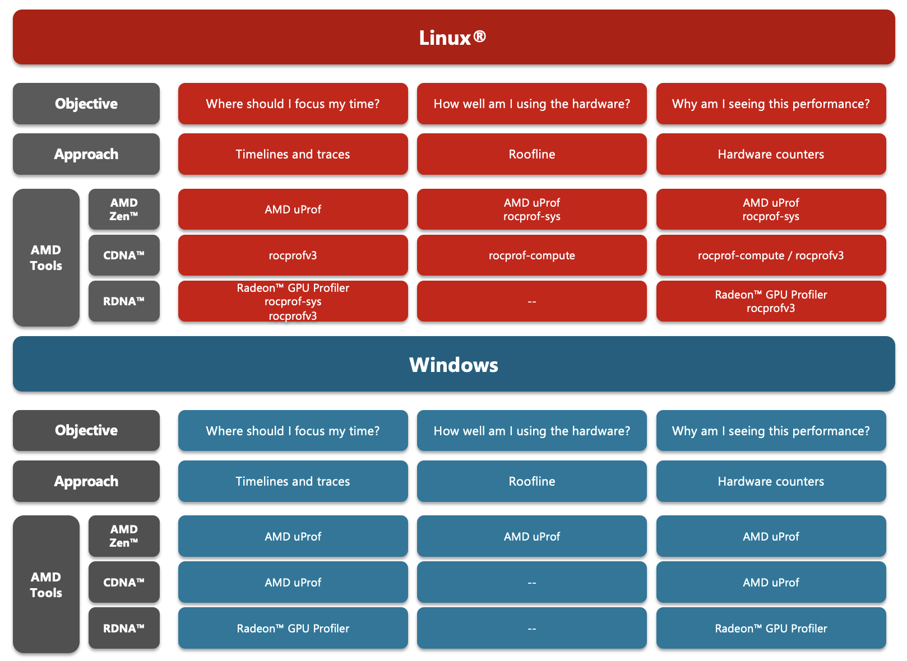
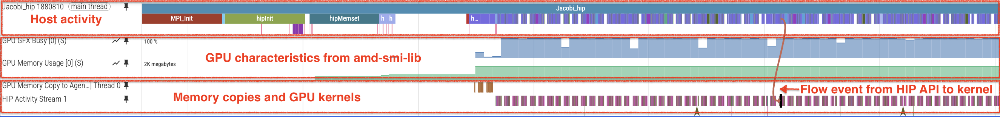
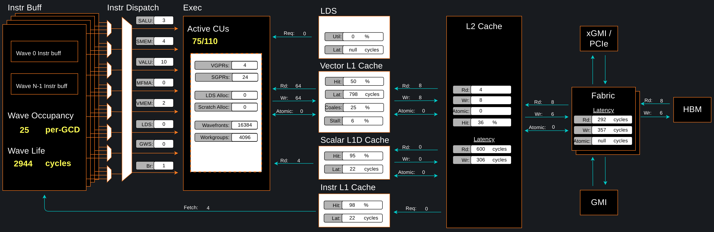

# Introduction to profiling tools for AMD hardware

Getting a code to be functionally correct is not always enough. In many industries, it is also required that
applications and their complex software stack run as efficiently as possible to meet operational demands.
This is particularly challenging as hardware continues to evolve over time, and as a result codes may require
further tuning. In practice, many application developers construct benchmarks, which are carefully designed to
measure the performance, such as execution time, of a particular code within an operational-like setting. In other words: a good benchmark
should be representative of the real work that needs to be done. These benchmarks are useful in that they provide insight into
the characteristics of the application, and enable one to discover potential bottlenecks that could result in performance
degradation during operational settings.

At face value, benchmarking sounds simple enough and is often interpreted as simply a comparison of execution time
on a variety of different machines. However, in order to extract the most performance from emerging hardware, the program must be tuned
many times and requires more than measuring raw execution time: one needs to know where the program is spending most of its
time and whether further improvements can be made. Heterogeneous systems, where programs run on both CPUs and GPUs,
introduce additional complexities. Understanding the critical path and kernel execution is all the more important. Thus, performance tuning is a
necessary component in the benchmarking process.

With AMD's profiling tools, developers are able to gain important insight into how efficiently their application is utilizing
hardware and effectively diagnose potential bottlenecks contributing to poor performance. Developers targeting AMD
GPUs have multiple tools available depending on their specific profiling needs. This post serves as an
introduction to the various profiling tools offered by AMD and why a developer might leverage one over the other. This
post covers everything from low-level profiling tools to extensive profiling suites.

In this introductory blog, we briefly describe the following tools that can aid in application analysis:

1. [rocprofiler-sdk and rocprofv3](#rocprofiler-sdk-and-rocprofv3)
2. [rocprof-sys](#rocprof-sys)
3. [rocprof-compute](#rocprof-compute)
4. [Radeon™ GPU Profiler](#radeon-gpu-profiler)
5. [AMD uProf](#amd-uprof)
6. [Other Third Party Tools](#other-third-party-tools)

## Terminology

The following terms are used in this blog post:

| Term        | Description |
| ----------- | ----------- |
| [AMD "Zen" Core](https://www.amd.com/en/products/processors/server/epyc.html)| AMD's x86-64 processor core architecture design. Used by the AMD EPYC&trade; server processors and AMD Ryzen&trade;, AMD Ryzen&trade; PRO, and AMD Threadripper&trade; PRO processor series.|
| [RDNA&trade;](https://www.amd.com/en/products/graphics/workstations.html) | AMD's GPU architecture optimized for graphically demanding workloads in gaming, visualization, and professional applications. Includes the AMD Radeon™ PRO W6000, W7000 series and Radeon™ AI PRO R9000 series (RDNA 3 and RDNA 4 architectures). |
| [CDNA&trade;](https://www.amd.com/en/products/accelerators/instinct.html) | AMD's Compute dedicated GPU architecture optimized for accelerating HPC, ML/AI, and data center type workloads. Includes the AMD Instinct™ MI100, MI200, MI300, and MI350 series accelerators.|
| [HIP](https://rocm.docs.amd.com/projects/HIP/en/latest/understand/programming_model.html) | A C++ Runtime API and kernel language that allows developers to create portable compute kernels/applications for AMD and NVIDIA GPUs from a single source code |
| [Timeline Trace](https://rocm.docs.amd.com/projects/rocprofiler-systems/en/latest/how-to/understanding-rocprof-sys-output.html#native-perfetto-output) | A profiling approach where duration of compute kernels and data transfers between devices are collected and visualized |
| [Roofline Analysis](https://rocm.docs.amd.com/projects/rocprofiler-compute/en/latest/how-to/profile/mode.html#standalone-roofline) | Hardware agnostic methodology for quantifying a workload's ability to saturate the given compute architecture in terms of floating-point compute and memory bandwidth |
| Hardware Counters | Individual metrics which track how many times a certain event occurs in the hardware, such as bytes moved from L2 cache or a 32 bit floating point add performed |

## What tools to use?

The first step in profiling is determining the right tool for the job. Whether one wants to collect
traces on the CPU, GPU, or both, understand kernel behavior, or assess memory access patterns, performing such an analysis might
appear daunting for new users of AMD hardware.
We begin by identifying the architecture and operating systems supported by each of the profiling tools
provided by AMD. Almost all the tools in Table 1 support Linux&reg; distros and with the gaining popularity of
Instinct&trade; GPUs, every tool has some capability to profile codes running on CDNA&trade; architecture. However,
those who prefer Windows will be limited to using [AMD <greek>u</greek>Prof](#amd-uprof)
to profile CPU and GPU codes targeting AMD "Zen"-based processors and AMD Instinct&trade; GPUs, and
[Radeon&trade; GPU Profiler](#radeon-gpu-profiler) that can provide great insights to optimize applications'
use of the graphics pipeline (rasterization, shaders, etc.) on RDNA&trade;-based GPUs.

<!--
================
 ### Table 1
================ -->

| AMD Profiling Tools | AMD "Zen" Core | RDNA&trade; | CDNA&trade; | Windows | Linux&reg; |
| :------------------ | :------------: | :---------: | :---------: | :-----: | :---: |
| rocprofv3 / rocprofiler-sdk        |<sub><sup>Not supported</sup></sub>|    &star;                         |    &starf;  |<sub><sup>Not supported</sup></sub>|&starf;|
| rocprof-sys                        |     &starf;                       |    &star;                         |    &starf;  |<sub><sup>Not supported</sup></sub>|&starf;|
| rocprof-compute                    |<sub><sup>Not supported</sup></sub>|<sub><sup>Not supported</sup></sub>|    &starf;  |<sub><sup>Not supported</sup></sub>|&starf;|
| Radeon&trade; GPU Profiler         |<sub><sup>Not supported</sup></sub>|    &starf;                        |    &star;   |   &starf;                         |&star; |
| AMD <greek>u</greek>Prof           |     &starf;                       |<sub><sup>Not supported</sup></sub>|    &star;   |   &starf;                         |&star; |

&starf; Full support | &star; Partial support

<p style="text-align:center"> Table 1: Profiler/architecture support and operating system needs.</p>

The final choice of the tool on any platform depends on the profiling objective and the kind of analysis required.
To make it simpler, we encourage the users to think of their objectives in terms of three questions as depicted in the
flow diagram in Figure 1:

1. *Where should I focus my time*? : Whether benchmarking a new application, or getting started with a new software package
that has not yet been profiled, it is recommended to first identify hot spots in the application that may
benefit from quick optimization. In such a scenario, it is best if users start by collecting
timelines and traces of their application. On Linux&reg; platforms, [`rocprof-sys`](#rocprof-sys) enables the collection of CPU and GPU traces,
and call stack samples to help identify major hot spots. For GPU-only traces, [`rocprofv3`](#rocprofiler-sdk-and-rocprofv3) provides
a lightweight and powerful alternative. However, on Windows, one may have to choose
between [AMD <greek>u</greek>Prof](#amd-uprof) and [Radeon&trade; GPU
Profiler](#radeon-gpu-profiler) depending on the targeted architecture.
2. *How well am I using the hardware*?: The first step is to obtain a characterization of workloads that can provide a glimpse into how
well the hardware is being utilized. For example, identifying what parts of your application are memory or compute bound.
This can be accomplished through roofline profiling. Typically, hot spots are well understood and
interest is usually in identifying the performance of a few key kernels or subroutines. At present, roofline profiling is
only available through [`rocprof-compute`](#rocprof-compute) on AMD Instinct&trade; GPUs and [AMD <greek>u</greek>Prof](#amd-uprof) on AMD "Zen"-based processors.
3. *Why am I seeing this performance*?: Once hot spots are identified and the initial assessment of performance is completed, the next phase likely involves profiling and collecting the hardware metrics to
understand where the observed performance is coming from. On AMD GPUs, tools such as [`rocprofv3`](#rocprofiler-sdk-and-rocprofv3), [`rocprof-sys`](#rocprof-sys), [`rocprof-compute`](#rocprof-compute),
and [AMD <greek>u</greek>Prof](#amd-uprof) use APIs from the [`rocprofiler-sdk`](#rocprofiler-sdk-and-rocprofv3) library to gather GPU metrics.
On Windows systems, one will have to rely on using either [AMD <greek>u</greek>Prof](#amd-uprof) or [Radeon&trade; GPU Profiler](#radeon-gpu-profiler).

> **Quick Tip**:  The ROCm profiling tools ([`rocprofv3`](#rocprofiler-sdk-and-rocprofv3), [`rocprof-compute`](#rocprof-compute), and [`rocprof-sys`](#rocprof-sys)), available
on Linux&reg; platforms, provide an easy-to-use interface for studying performance of the code across AMD hardware and
should be treated as "go-to" profiling tools for performance tuning and benchmarking.

<!--
================
 ### Figure 1
================ -->



<p style="text-align:center">
Figure 1: Use cases for a variety of AMD profiling tools.
</p>

---

## Overview of profiling tools

In this section, we provide a brief overview of the above-mentioned AMD tools and some third-party toolkits.

### rocprofiler-sdk and rocprofv3

The [`rocprofiler-sdk`](https://github.com/ROCm/rocm-systems/tree/develop/projects/rocprofiler-sdk) library is the foundation of AMD GPU profiling and tracing
infrastructure, shipped with ROCm&trade;. It provides the low-level API for device activity tracing and hardware
performance counter collection. This library replaces the functionality of the legacy `rocprofiler` and `roctracer` libraries.

`rocprofv3` is the command-line tool built on `rocprofiler-sdk` and replaces the legacy `rocprof` and `rocprofv2` tools.
Some of the most useful features of `rocprofv3` are:

- Collect a variety of traces for ROCm-based applications (HIP API, HSA API, offloaded kernels, memory copies,
scratch memory, marker API, etc.)
- Collect device hardware counters for GPU kernel performance analysis
- Find GPU hot spots quickly
- Profile Python workloads efficiently

Starting in ROCm 7.0, `rocprofv3` defaults to writing profiling data to a SQLite3-based database, and a new companion
tool called `rocpd` is available to generate CSV, OTF2, and/or Perfetto trace files from the collected database or generate summaries of profiled regions.
This "profile once, analyze many times" workflow enables efficient post-processing without re-running the application.

We strongly urge you to use `rocprofv3` as the legacy `rocprof` tool will be deprecated in future ROCm releases.

For more details, see the [`rocprofv3` documentation](https://rocm.docs.amd.com/projects/rocprofiler-sdk/en/latest/how-to/using-rocprofv3.html)
and the [`rocprofiler-sdk` library documentation](https://rocm.docs.amd.com/projects/rocprofiler-sdk/en/latest/index.html).

### rocprof-sys

The ROCm systems profiler, also known as `rocprof-sys`, is best suited to collect
host, device, and communication (MPI) activity in one comprehensive,
unified trace of your application's run. `rocprof-sys` uses libraries that tools like
[`amd-smi`](https://rocm.docs.amd.com/projects/amdsmi/en/latest/) and
[`perf`](https://perfwiki.github.io/main/) are built upon to provide a holistic
view of the system where your application ran.

With configurable runtime options, you can use it for call-stack sampling, binary instrumentation,
causal profiling, and hardware counter collection. Simply put, this is the tool you would use
if you want to understand what is happening in your application on the host *and*
on the device. The output trace is in protobuf format (`.proto`) for easy
visualization using [Perfetto UI](https://ui.perfetto.dev) in a browser.

`rocprof-sys` has evolved from the former `Omnitrace` research tool from AMD.
It now supports the `rocprofiler-sdk` library, bringing advanced capabilities such as OMPT support for
tracing Fortran codes with OpenMP&reg; offload, writing to the `rocpd` output format, and network performance profiling.

When analyzing the performance of an application, it is always best to NOT
assume you know where the performance bottlenecks are and why they are
happening. `rocprof-sys` is the ideal tool for characterizing where optimization would
have the greatest impact on the end-to-end execution of the application and/or
viewing what else is happening on the system during a performance bottleneck.

<!--
================
 ### Figure 2
================ -->



<p style="text-align:center">
Figure 2: rocprof-sys timeline trace example.
</p>

Please see the [official rocprof-sys documentation](https://rocm.docs.amd.com/projects/rocprofiler-systems/en/latest/index.html)
for the latest information.
Users are encouraged to submit [issues](https://github.com/ROCm/rocm-systems/issues), feature requests, and provide
any additional feedback.

### rocprof-compute

[`rocprof-compute`](https://rocm.docs.amd.com/projects/rocprofiler-compute/en/latest/) is a kernel performance analysis tool
for High-Performance Computing (HPC) and Machine-Learning (ML) workloads using AMD Instinct&trade; GPUs.
`rocprof-compute` uses `rocprofiler-sdk` to automate the collection of all available hardware performance counters via a single command. It also provides high-level performance analysis features including System Speed-of-Light, Hardware block Speed-of-Light, Memory Chart
Analysis, Roofline Analysis, Baseline Comparisons, and more through a command-line interface (CLI), a graphical user interface (GUI), and a Text User Interface (TUI). These analyses help
users understand and analyze bottlenecks in their computational workloads on AMD Instinct&trade;
GPUs. `rocprof-compute` has evolved from the former `Omniperf` research tool from AMD.

Note that `rocprof-compute` collects hardware counters in multiple passes by default,
and will therefore re-run the application during each pass to collect different sets of metrics.
An upcoming feature in `rocprof-compute` will support single-pass collection of all
necessary hardware counters using the [iteration multiplexing mechanism](https://github.com/ROCm/rocm-systems/blob/develop/projects/rocprofiler-compute/docs/how-to/profile/mode.rst#iteration-multiplexing).

<!--
================
 ### Figure 3
================ -->



<p style="text-align:center">
Figure 3: rocprof-compute memory chart analysis panel.
</p>

In a nutshell, `rocprof-compute` provides details about hardware activity for a particular GPU kernel.
For up-to-date information on available features, we highly encourage readers to view
the [official rocprof-compute documentation](https://rocm.docs.amd.com/projects/rocprofiler-compute/en/latest/).
We welcome community engagement on GitHub through [issues](https://github.com/ROCm/rocm-systems/issues),
feature requests, contributions, and feedback.

### Radeon&trade; GPU Profiler

The [Radeon&trade; GPU Profiler](https://radeon-gpuprofiler.readthedocs.io/en/latest/) is a performance tool that can be used by traditional
gaming and visualization developers to optimize DirectX 12 (DX12) and Vulkan&trade; for AMD
RDNA&trade; hardware. The Radeon&trade; GPU Profiler (RGP) is a ground-breaking
low-level optimization tool from AMD. It provides detailed timing information
on Radeon&trade; Graphics using custom, built-in, hardware thread-tracing, allowing
the developer deep inspection of GPU workloads.  This unique tool generates
easy-to-understand visualizations of how your DX12 and Vulkan&trade; games
interact with the GPU at the hardware level. Profiling a game is both a quick
and simple process using the Radeon&trade; Developer Panel together with the public display
driver.

Note that the Radeon&trade; GPU Profiler does have support for OpenCL&trade; and HIP applications but
it requires running on AMD RDNA&trade; GPUs in the Windows environment. Running
HIP and OpenCL&trade; in the Windows environment is a whole blog series in itself and
outside the current recommendation for HPC applications. For HPC workloads, we
recommend programming with HIP in a Linux&reg; environment on AMD Instinct&trade; GPUs and
using [`rocprof-compute`](#rocprof-compute), [`rocprof-sys`](#rocprof-sys) or [`rocprofv3`](#rocprofiler-sdk-and-rocprofv3) profiling tools on them.

### AMD uProf

[AMD <greek>u</greek>Prof](https://www.amd.com/en/developer/uprof.html) (AMD MICRO-prof) is a software profiling analysis tool for x86
applications running on Windows, Linux&reg; and FreeBSD operating systems and provides event information unique to
the AMD "Zen"-based processors and AMD Instinct&trade; MI Series accelerators. AMD <greek>u</greek>Prof enables the developer to better
understand the limiters of application performance and evaluate improvements.

AMD <greek>u</greek>Prof offers:

- Performance Analysis to identify runtime performance bottlenecks of the application
- System Analysis to monitor system performance metrics
- Roofline analysis
- Power Profiling to monitor thermal and power characteristics of the system
- Energy Analysis to identify energy hot spots in the application (Windows only)
- Remote Profiling to connect to remote Linux&reg; systems (from a Windows host system), trigger
collection/translation of data on the remote system and report it in local GUI
- Support for AMD CDNA&trade; accelerators for AMD Instinct&trade; MI100, MI200, and MI300 Series devices

### Other third-party tools

In the High Performance Computing space, a number of third-party profiling tools have enabled support for ROCm&trade; and AMD Instinct&trade;
GPUs. This provides a platform for users to maintain a vendor independent approach to profiling, providing an easy-to-use and
high-level suite of functionality, that can potentially provide a unified profiling experience across numerous architectures.
For users already familiar with these tools, it makes for another easy entry point into understanding performance of their
workloads on AMD hardware.

Currently available third-party profiling tools include:

- [HPCToolkit](http://hpctoolkit.org/)
- [TAU](http://www.cs.uoregon.edu/research/tau/home.php)
- [Vampir](https://vampir.eu/)
- [Cray Performance and Analysis Tools](https://cpe.ext.hpe.com/docs/latest/performance-tools/index.html) (*only for CrayOS platforms*)

### Superseded Tools

As our platform grows, some tools naturally retire and make way for improved
versions. This section documents those retired tools so you can easily see
what's changed and which modern tools now fill their role.

- Omnitrace: replaced by [`rocprof-sys`](#rocprof-sys)
- Omniperf: replaced by [`rocprof-compute`](#rocprof-compute)
- `rocprof` and `rocprofv2`: replaced by [`rocprofv3`](#rocprofiler-sdk-and-rocprofv3)
- `rocprofiler` and `roctracer` libraries: replaced by the [`rocprofiler-sdk library`](#rocprofiler-sdk-and-rocprofv3)

## Profiling guide blog series

To go beyond this introduction and see these tools applied to real-world workloads, check out our
**Performance Profiling on AMD GPUs** blog series:

- **[Part 1: Foundations](https://rocm.blogs.amd.com/software-tools-optimization/profiling-guide/intro/README.html)**
  — Tool overview, installation guidance, and prerequisites for both novice and advanced users.
- **[Part 2: Basic Usage](https://rocm.blogs.amd.com/software-tools-optimization/profiling-guide/novice/README.html)**
  — Step-by-step walkthrough for beginners: identifying hot spots, roofline analysis, and occupancy-driven
  optimization using a HIP Jacobi solver.
- **[Part 3: Advanced Usage](https://rocm.blogs.amd.com/software-tools-optimization/profiling-guide/advanced/README.html)**
  — Multi-GPU and multi-node profiling with `rocprof-sys`, MPI tracing, network profiling, and deeper
  kernel analysis with `rocprof-compute`.
- **Part 4: Fortran OpenMP Offload Edition** *(coming soon)*
  — Profiling techniques tailored for Fortran applications using OpenMP target offloading, demonstrated on
  the GenASiS astrophysics simulation code running on AMD MI300A APUs.

## Useful resources

The following are links to the GitHub repos and ROCm docs for the tools described above:

- `rocprofiler-sdk` / `rocprofv3`:
  - Open source at [rocprofiler-sdk GitHub repo](https://github.com/ROCm/rocm-systems/tree/develop/projects/rocprofiler-sdk)
  - [`rocprofiler-sdk` library documentation](https://rocm.docs.amd.com/projects/rocprofiler-sdk/en/latest/index.html)
  - [`rocprofv3` tool documentation](https://rocm.docs.amd.com/projects/rocprofiler-sdk/en/latest/how-to/using-rocprofv3.html#using-rocprofv3)
- `rocprof-sys`:
  - Open source at [rocprofiler-systems GitHub repo](https://github.com/ROCm/rocm-systems/tree/develop/projects/rocprofiler-systems)
  - [ROCm Systems Profiler documentation](https://rocm.docs.amd.com/projects/rocprofiler-systems/en/latest/index.html)
- `rocprof-compute`:
  - Open source at [rocprofiler-compute GitHub repo](https://github.com/ROCm/rocm-systems/tree/develop/projects/rocprofiler-compute)
  - [ROCm Compute Profiler documentation](https://rocm.docs.amd.com/projects/rocprofiler-compute/en/latest/)
- AMD uProf:
  - [AMD uProf User Guide](https://docs.amd.com/r/en-US/57368-uProf-user-guide/uProf-User-Guide)

```{update} Apr. 10, 2026
Updated the blog to reflect evolution of the profiling tools' capabilities and naming.
```

```{Note}
This blog was originally uploaded on April 12, 2023
```
