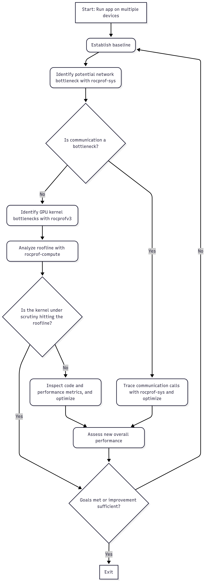
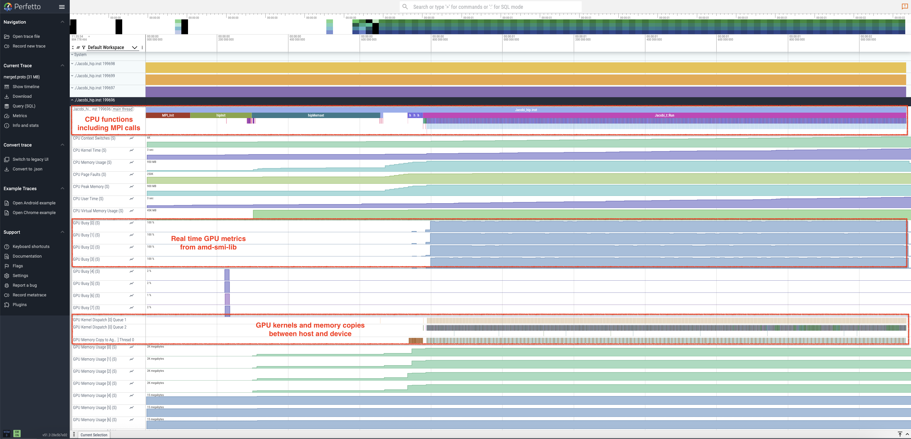
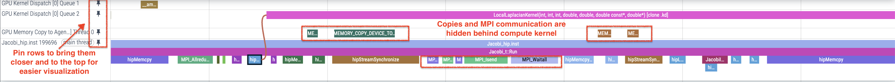
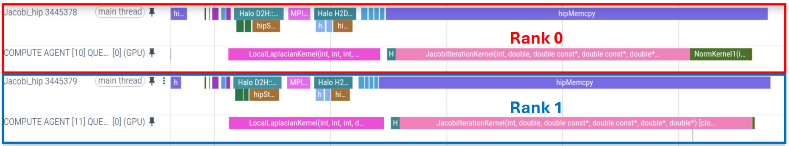
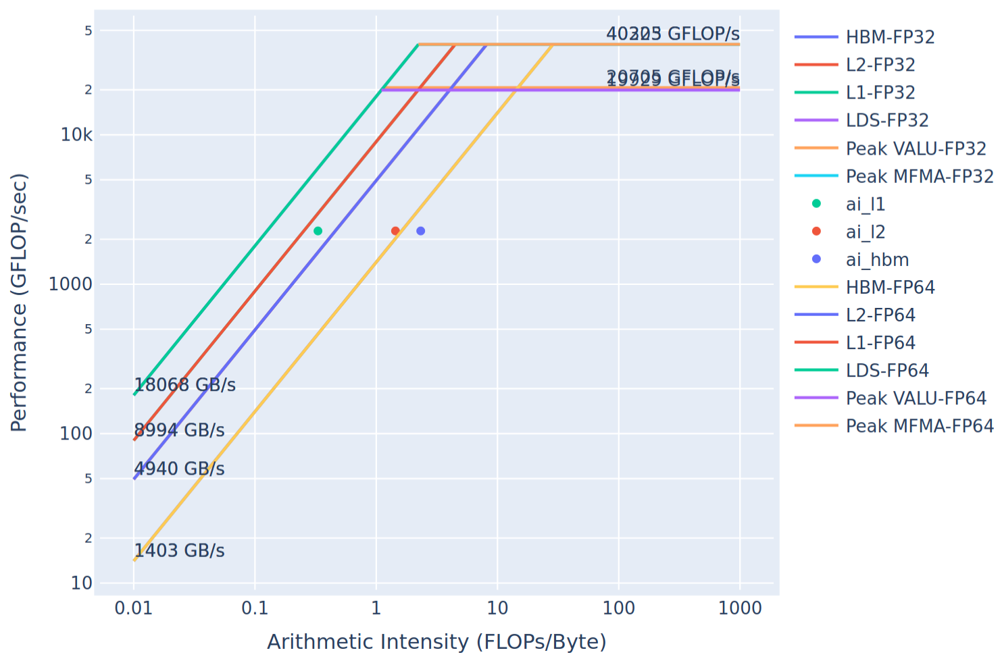
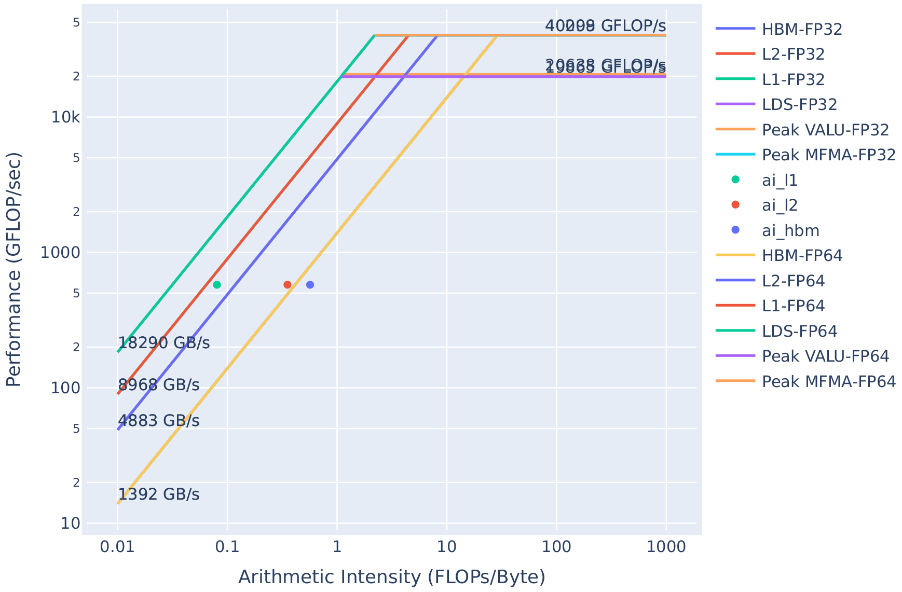
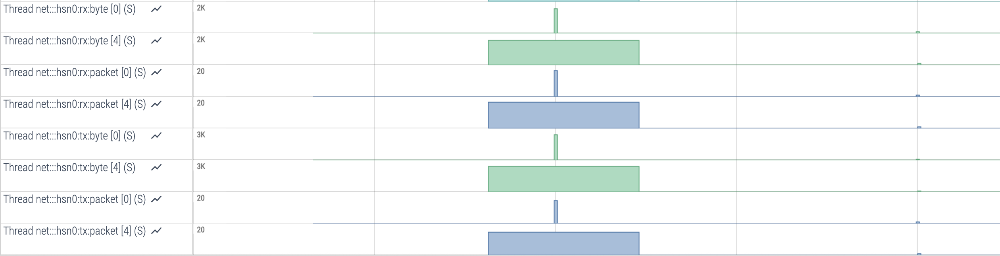

# Performance Profiling on AMD GPUs - Part 3: Advanced Usage

This document, like the [previous article in the profiling guide series](https://rocm.blogs.amd.com/software-tools-optimization/profiling-guide/novice/README.html),
is designed to help you systematically analyze and improve the performance of your
GPU-accelerated application. This guide will build upon the foundational skills that
you acquired from the previous article and introduce you to assessing the performance of
multi-process GPU applications based on the Message Passing Interface (MPI).

1. **What You Already Know**:
   - Your MPI-based multi-process application leverages GPUs for computation, and you understand the basic purpose of each GPU kernel in your code.
   - You recognize kernel performance limiters such as "latency-bound" or "memory-bound".
   - You have observed that your application performs better on non-AMD hardware, despite comparable specifications (optional).

2. **What This Guide Will Teach You**:
   - **Multi-Process Profiling Basics**: learn how to profile a multi-process job and measure where your application spends time.
   - **Network Profiling and Optimization**: explore details of MPI calls, especially those used in inter-node communication, and learn to optimize at scale.
   - **Advanced GPU kernel optimization**: explore further optimization opportunities driven by performance metrics collected by `rocprof-compute`.

By the end of this document, you will be able to profile your multi-process application to identify opportunities for optimization on the GPU, CPU and in MPI communication, with a focus on bridging the performance gap you may have observed on AMD hardware.

We build upon the flowchart depicting the profiling process from the previous blog and show how it varies when we are dealing with an application that runs with multiple processes communicating with each other. We refer to the flowchart shown in Figure 1 for the rest of this discussion.

<p style="text-align: center">
	


</p>

<p style="text-align:center">
Figure 1: Multi-process Profiling Flowchart.
</p>

## Profiling basics

We reiterate the typical guideline for performance analysis and optimization of an application below:

- **Establish baseline performance**: Run the key scenario without any profiler attached to measure the baseline performance. This gives you a reference point to compare against later.
- **Identify bottlenecks**: What fraction of total run-time is spent on the host (CPU), the device (GPU), and in MPI communication? Where is the largest bottleneck?
- **Analyze roofline**: If the bottleneck is a GPU kernel, how much room for improvement is there in the most limiting kernel?
- **Analyze kernel performance metrics**: What is the main limiter for the most time-consuming kernel?
- **Analyze communication performance**: If the bottleneck is communication, study network profiling data
- **Perform optimization**: What possible optimizations on the code can be done based on the analysis so far?
- **Iterate**: If the optimization step achieves the desired target performance, move on to the next hot-spot region. Iterate through the above-mentioned steps until fully satisfied.

We will follow this guideline as we go through a performance analysis and optimizations of the same HIP ported Jacobi application introduced in the previous blog.

### Jacobi example

As a working example, we will continue to use the code example: [HPCTrainingExamples/HIP/jacobi](https://github.com/amd/HPCTrainingExamples/tree/main/HIP/jacobi).
This Jacobi solver utilizes GPUs for computation and MPI for halo exchanges in a distributed environment. Employing a 2D domain decomposition scheme improves the computation-to-communication ratio compared to a 1D approach.

The Jacobi solver is an MPI application capable of running on both multiple GPUs and nodes. In this post, we will run the solver with 4 processes,
each using a single GPU device.

Typical build and run steps are shown below. For the profiling tools used in this post, we recommend using ROCm 6.4.x.
In addition to ROCm, ensure that a MPI implementation, such as OpenMPI or Cray MPICH, is loaded in your environment.

```bash
git clone https://github.com/amd/HPCTrainingExamples.git
cd HPCTrainingExamples/HIP/jacobi
make
```

Before profiling an application, it is critical to first verify that the application runs successfully.
In systems with the Slurm job scheduler, we can run the application using 4 MPI processes on a single node,
as shown below:

```bash
srun -N1 -n4 -c1 -t 05:00 ./Jacobi_hip -g 2 2
```

Note that if you are using OpenMPI, you can interactively run the job using `mpirun -np 4 ./Jacobi_hip -g 2 2` instead of using `srun`.

Another very important step when running parallel jobs is to ensure proper GPU and CPU core affinity settings for each process.
We are interested in running this Jacobi solver such that each process uses a different GPU device.
On the [Frontier](https://docs.olcf.ornl.gov/systems/frontier_user_guide.html) supercomputer, this is accomplished by adding the `--gpu-bind=closest --gpus-per-task=1` Slurm options when submitting your job.

```bash
srun -N1 -n4 -c1 --gpu-bind=closest --gpus-per-task=1 -t 05:00 ./Jacobi_hip -g 2 2
```

Setting proper affinity on other systems could be challenging, but [Affinity Part 1](https://rocm.blogs.amd.com/software-tools-optimization/affinity/part-1/README.html)
and [Affinity Part 2](https://rocm.blogs.amd.com/software-tools-optimization/affinity/part-2/README.html) ROCm blog posts can help
you understand your system's topology and set up affinity accordingly.

The output of the above command should look something like the following:

```bash
Topology size: 2 x 2
Local domain size (current node): 4096 x 4096
Global domain size (all nodes): 8192 x 8192
Rank 0 selecting device 0 on host <hostname>
Starting Jacobi run.
Iteration:   0 - Residual: 0.015629
Iteration: 100 - Residual: 0.000442
Iteration: 200 - Residual: 0.000263
Iteration: 300 - Residual: 0.000194
Iteration: 400 - Residual: 0.000156
Iteration: 500 - Residual: 0.000132
Iteration: 600 - Residual: 0.000115
Iteration: 700 - Residual: 0.000103
Iteration: 800 - Residual: 0.000093
Iteration: 900 - Residual: 0.000085
Iteration: 1000 - Residual: 0.000079
Stopped after 1000 iterations with residue 0.000079
Total Jacobi run time: 1.3160 sec.
Measured lattice updates: 50.99 GLU/s (total), 12.75 GLU/s (per process)
Measured FLOPS: 866.89 GFLOPS (total), 216.72 GFLOPS (per process)
Measured device bandwidth: 4.90 TB/s (total), 1.22 TB/s (per process)
Percentage of MPI traffic hidden by computation: 100.0
Rank 1 selecting device 1 on host <hostname>
Rank 3 selecting device 3 on host <hostname>
Rank 2 selecting device 2 on host <hostname>
```

The program completed execution in 1.3160 seconds. This establishes our initial performance benchmark,
against which we will measure improvements following the profiling and optimization phases.

When establishing a performance baseline for an MPI application, it is beneficial to initially assess its strong
and/or weak scaling characteristics. You will observe that this Jacobi solver is a weak scaling test. When changing
the number of processes it runs with, the problem size is adjusted automatically:

```bash
srun -N1 -n1 -c1 --gpu-bind=closest --gpus-per-task=1 -t 05:00 ./Jacobi_hip -g 1 1
# Global domain size (all nodes): 4096 x 4096
# Total Jacobi run time: 1.2933 sec.

srun -N1 -n2 -c1 --gpu-bind=closest --gpus-per-task=1 -t 05:00 ./Jacobi_hip -g 2 1
# Global domain size (all nodes): 8192 x 4096
# Total Jacobi run time: 1.3342 sec.

srun -N1 -n4 -c1 --gpu-bind=closest --gpus-per-task=1 -t 05:00 ./Jacobi_hip -g 2 2
# Global domain size (all nodes): 8192 x 8192
# Total Jacobi run time: 1.3160 sec.
```

## Identify bottlenecks

Bottleneck identification is a critical step in the profiling process, where developers pinpoint the parts of the program that limit overall performance.
This blog post focuses on multi-GPU profiling, beginning with an analysis of communication costs. Generally, there is not a prescribed order for identifying an application's primary bottlenecks.

### Analyze application trace

To get a high level timeline profile of device activity in the application, we showed in the
[previous article in the profiling guide series](https://rocm.blogs.amd.com/software-tools-optimization/profiling-guide/novice/README.html)
that `rocprofv3` can be used to generate these traces. For example, in the MPI environment shown below, `rocprofv3` can be invoked to generate an
application timeline trace for each rank:

```bash
srun -N1 -n4 -c1 --gpu-bind=closest --gpus-per-task=1 -t 05:00 rocprofv3 --kernel-trace --hip-trace --output-format pftrace -d jacobi_trace -o jacobi_%rank% -- ./Jacobi_hip -g 2 2
```

The above command will generate `jacobi_<rank id>.pftrace` files under the `jacobi_trace` directory. You can then merge all individual trace files
for each rank into a single merged pftrace file that can be viewed using [Perfetto](https://ui.perfetto.dev):

```bash
cat jacobi_trace/jacobi_*.pftrace > merged_jacobi.pftrace
```

However, `rocprofv3` does not provide you with information
about host activity beyond API calls and host-side runtime activity (e.g. kernel launches) without
the user instrumenting the application manually (for example, using [ROCTracer](https://rocm.docs.amd.com/projects/roctracer/en/latest/index.html)).
Understanding host-side activity can be critical for assessing the overall performance of an application.

To get a high level, comprehensive profile encompassing both the host **and** device
activities in the application, we instead recommend the application tracing
tool [ROCm Systems Profiler](https://rocm.docs.amd.com/projects/rocprofiler-systems/en/latest/index.html), also known as
`rocprof-sys`. Profiling with `rocprof-sys` typically involves a few steps as described in the sub-sections below.
Briefly, we generate a configuration file to tune runtime behavior of the profiler, then trace the application either with or
without an instrumented binary.

#### Generate a `rocprof-sys` runtime configuration file (required only once)

`rocprof-sys` runtime options can be controlled by a configuration file. To generate this file
and view the current runtime options, you can use the `rocprof-sys-avail` executable. The commands
below generate the configuration file and tell `rocprof-sys` where it is located.

```bash
rocprof-sys-avail -G ~/.rocprofsys.cfg
export ROCPROFSYS_CONFIG_FILE=~/.rocprofsys.cfg
```

In some cases, the default values may need to be changed for your run. For example, if your
workload is mainly GPU bound, you may not care about the clock frequency of every CPU logical core.
In this case, you can set `ROCPROFSYS_SAMPLING_CPUS` to `none` to make the trace easier to visualize.
Or you may find it useful to set `ROCPROFSYS_PROFILE` to `true` in order to collect wall clock timing values for
different parts of your code. For detailed documentation of the `rocprof-sys-avail` utility,
its usage, and a more comprehensive list of `rocprof-sys` runtime options, go to the
[Configuring runtime options page](https://rocm.docs.amd.com/projects/rocprofiler-systems/en/latest/how-to/configuring-runtime-options.html#configuring-runtime-options)
in the ROCm Systems Profiler documentation.

> TIP: Before running `rocprof-sys-avail`, run `which rocprof-sys-avail` to ensure the path
> matches the expected installation (for example, the module you loaded for the ROCm
> version you intend to use).

#### Instrument the application binary (optional but recommended)

Instrumenting the target binary, and in some cases its dependent libraries, helps trace host functions. Note that this step
is not mandatory as an application trace could also be collected using `rocprof-sys-run` if the overhead is not too high.
The executable `rocprof-sys-instrument` is used to perform instrumentation of the application, and it supports several modes
such as runtime instrumentation, binary rewrite, among others. We recommend the binary rewrite mode of `rocprof-sys-instrument`
for MPI applications such as this Jacobi solver to generate a new executable with the instrumentation built in.
This new instrumented binary can then be subsequently traced using `rocprof-sys-run`.

The command below will instrument the `Jacobi_hip` executable and create a new `Jacobi_hip.inst` executable.

```bash
rocprof-sys-instrument -o ./Jacobi_hip.inst -- ./Jacobi_hip
```

Binary rewrite has low overhead, but it does not support automatically instrumenting dependent libraries. Other modes
of instrumentation can help with that and we encourage interested readers to check the
[`rocprof-sys` documentation](https://rocm.docs.amd.com/projects/rocprofiler-systems/en/latest/how-to/instrumenting-rewriting-binary-application.html#instrumenting-and-rewriting-a-binary-application) for further details.

The command-line tool `rocprof-sys-instrument` can be tuned to include or exclude functions for instrumentation based on the number of instructions, by name, among several other options.
Use the `rocprof-sys-instrument --help` page for a list of all available options.

It is important to check the `rocprof-sys-instrument` output or the content of the
`rocprofsys-Jacobi_hip.inst-output/<TIMESTAMP>/instrumentation/instrumented.txt` file to see which functions were instrumented.
In our Jacobi example, all functions were small i.e., fewer than 1024 instructions, and thus the `instrumented.txt`
file is empty. Nothing was in fact instrumented in the newly generated `Jacobi_hip.inst` binary using the default settings!

Using our knowledge of the Jacobi application code, let us proceed to instrument the high level CPU functions `Jacobi_t::Run`
and `JacobiIteration` by using:

```bash
rocprof-sys-instrument --function-include 'Jacobi_t::Run' 'JacobiIteration' -o ./Jacobi_hip.inst -- ./Jacobi_hip
```

The output should show that only these functions have been instrumented:

```bash
…
[rocprof-sys][exe] Finding instrumentation functions...
[rocprof-sys][exe]    1 instrumented funcs in JacobiIteration.hip
[rocprof-sys][exe]    1 instrumented funcs in JacobiRun.hip
[rocprof-sys][exe]    1 instrumented funcs in Jacobi_hip
…
```

This can also be verified with:

```bash
$ cat rocprofsys-Jacobi_hip.inst-output/<TIMESTAMP>/instrumentation/instrumented.txt

  StartAddress   AddressRange  #Instructions  Ratio Linkage Visibility  Module                      Function                                     FunctionSignature
      0x208930            332             71   4.68  unknown    unknown JacobiIteration.hip         JacobiIteration                              JacobiIteration
      0x206fe0            676            146   4.63  unknown    unknown JacobiRun.hip               Jacobi_t::Run                                Jacobi_t::Run
      0x208860            205             38   5.39  unknown    unknown Jacobi_hip                  __device_stub__JacobiIterationKernel         __device_stub__JacobiIterationKernel
```

#### Collect application trace

Using the instrumented binary (or the original application binary), we can then collect a trace using the `rocprof-sys-run`
command in the MPI environment as shown below.

```bash
srun -N1 -n4 -c1 --gpu-bind=closest --gpus-per-task=1 -t 05:00 rocprof-sys-run -- ./Jacobi_hip.inst -g 2 2
```

Check the command line output generated by `rocprof-sys-run`. It contains some useful overviews for each MPI rank
(e.g., `peak_rss` -> the peak amount of memory a process has used) and paths to generated files. When inspecting the
`Total Jacobi run time:` line printed by the application, one can observe that the total runtime is not far from the
baseline, meaning that the profiling overhead is small.

If you had set `ROCPROFSYS_PROFILE=true`, inspect the `wall_clock-*.txt` files generated separately for each MPI rank.
For each function, you can analyze basic statistics, e.g., how many times these calls have been executed (COUNT) or
the time in seconds they took in total (SUM). Wall clock files include information about the MPI calls, GPU kernels,
HIP activity, instrumented CPU functions, and many more depending on the selected configuration options.

Finally, arguably the most important outputs provided by `rocprof-sys-run` are the `*.proto` timeline trace files that can be found in the `rocprofsys-Jacobi_hip.inst-output/<TIMESTAMP>` directory.
Depending on the ROCm version, for multi-rank MPI runs, these files may have already been merged into a unified
`merged.proto`. If this is not the case, you can easily merge the individual `.proto` files by simply appending the
traces together as shown earlier for `rocprofv3`:

```bash
cat perfetto-trace-*.proto > merged.proto
```

#### Visualizing traces using Perfetto

Copy the generated merged.proto file to your local machine using `scp` or `rsync` using a command such as:

```bash
rsync -avz user@host:/path/to/remote/merged.proto /path/in/local/host
```

Navigate to the web page [https://ui.perfetto.dev/](https://ui.perfetto.dev) in the Chrome browser to visualize
the file. Click on `Open trace file` and select the `merged.proto` file. If there is an error opening the trace file,
(especially common for older ROCm releases), try using an older Perfetto version, e.g., by opening the web page
[https://ui.perfetto.dev/v46.0-35b3d9845/#!/](https://ui.perfetto.dev/v46.0-35b3d9845/#!/).

In Figure 2, you can see an example of how the trace file would be visualized in Perfetto for the Jacobi example
running with 4 MPI ranks (note that only the information about the last rank is "unfolded"). You will observe that
MPI calls are automatically instrumented by this tool.

<p style="text-align: center">
	


</p>

<p style="text-align:center">
Figure 2: Perfetto trace for 4-rank run of the Jacobi example showing host, device and system activity.
</p>

By zooming in/out and navigating the trace with the WASD keys and cursor, you can inspect the analysis of MPI calls,
GPU hardware state, GPU kernels, and data transfers as shown in Figure 3. This figure also shows how pinning host
and device activity rows can bring them closer for analysis of computation-communication overlap. Load balance across
ranks can also be examined in a similar manner.

<p style="text-align: center">
	


</p>

<p style="text-align:center">
Figure 3: Perfetto trace showing pinned rows and computation-communication overlap.
</p>

A detailed examination of the trace reveals minimal GPU idle time during the main execution phase, excluding initialization
and post-processing. This indicates that GPU kernels are likely the performance bottlenecks, and identifying and optimizing
these hotspots is crucial. While `rocprof-sys-run` traces contain this information, the abundance of CPU and GPU hardware
profiling data can make further analysis challenging. Therefore, we recommend using `rocprofv3` for focused GPU hotspot
analysis and `rocprof-compute` for low-level kernel performance analysis, as described in the following sections.

### Collect GPU hotspots

Collecting a list of GPU hotspots using `rocprofv3` for a multi-process run is slightly different because the profiler
is launched from within the MPI environment. The following command will provide a summary of kernel activity on each
process of the Jacobi run.

```bash
srun -N1 -n4 -c1 --gpu-bind=closest --gpus-per-task=1 -t 05:00 rocprofv3 --kernel-trace --stats -T -S -d kernel_hotspots -o jacobi_%rank% -- ./Jacobi_hip -g 2 2
```

The `--kernel-trace` option enables the tracing of GPU kernels, generating a trace file per rank, such as
`kernel_hotspots/jacobi_<rank>_kernel_trace.csv`, detailing all the invoked GPU kernels during execution.
The `--stats` option creates a summary file per rank, for example `kernel_hotspots/jacobi_<rank>_kernel_stats.csv`,
which identifies the most time-consuming kernels within the Jacobi application. Use the `-S` option to print this
kernel trace summary in the console and the `-T` option to truncate kernel names for better readability.
An example of this summary, as output by rank 3, is shown below.

```bash
    ROCPROFV3 SUMMARY:

    |                   NAME                   |     DOMAIN      |      CALLS      | DURATION (nsec) | AVERAGE (nsec)  | PERCENT (INC) |   MIN (nsec)    |   MAX (nsec)    |     STDDEV      |
    |------------------------------------------|-----------------|-----------------|-----------------|-----------------|---------------|-----------------|-----------------|-----------------|
    | JacobiIterationKernel                    | KERNEL_DISPATCH |            1000 |       559668641 |       5.597e+05 |     44.019012 |          538246 |          586086 |       7.319e+03 |
    | NormKernel1                              | KERNEL_DISPATCH |            1001 |       413389620 |       4.130e+05 |     32.513886 |          399683 |          422084 |       2.800e+03 |
    | LocalLaplacianKernel                     | KERNEL_DISPATCH |            1000 |       276611307 |       2.766e+05 |     21.756010 |          268162 |          284163 |       2.150e+03 |
    | HaloLaplacianKernel                      | KERNEL_DISPATCH |            1000 |        13027966 |       1.303e+04 |      1.024675 |           12320 |           16480 |       3.239e+02 |
    | __amd_rocclr_copyBuffer                  | KERNEL_DISPATCH |            1001 |         5919905 |       5.914e+03 |      0.465612 |            4800 |            7520 |       6.608e+02 |
    | NormKernel2                              | KERNEL_DISPATCH |            1001 |         2802428 |       2.800e+03 |      0.220416 |            2560 |            4000 |       1.704e+02 |
    | __amd_rocclr_fillBufferAligned           | KERNEL_DISPATCH |               1 |            4960 |       4.960e+03 |      0.000390 |            4960 |            4960 |       0.000e+00 |
```

We will analyze the GPU hotspots in the next section. Before we do that, it may be good to
understand if there is any load imbalance on the GPUs used for the job. This information
can be obtained using the timeline trace collection feature of `rocprofv3`. See the command below:

```bash
srun -N1 -n4 -c1 --gpu-bind=closest --gpus-per-task=1 -t 05:00 rocprofv3 --runtime-trace -T -d gpu_trace -o jacobi_%rank% --output-format pftrace -- ./Jacobi_hip -g 2 2
cat gpu_trace/*pftrace > jacobi_all.pftrace
```

The first command saves the timeline traces for each rank separately in `gpu_trace/jacobi_<rank>_results.pftrace`
files. The second command simply merges these traces into a single file.

<p style="text-align: center">
	


</p>

<p style="text-align:center">
Figure 4: Jacobi compute kernels, host functions and HIP API calls across four ranks.
</p>

Figure 4 above clearly shows that the problem scales well with balanced host function calls and overlapping
device compute kernels across the four ranks. The corollary to this observation is that optimizations performed
on any kernel on a single rank will scale well to multiple ranks. Therefore, we will focus on optimizing kernels
by profiling the Jacobi example with a single rank.

#### Using rocprof-compute for identifying top kernels

A similar dispatch summary of top kernels can be collected using `rocprof-compute` in `profile` mode.
This information can be obtained by using the following series of commands. First, run a single rank
job via:

```bash
srun -N1 -n1 -c1 --gpu-bind=closest --gpus-per-task=1 -t 05:00 rocprof-compute profile -n jacobi_baseline --device 0 -- ./Jacobi_hip -g 1 1
```

Next, to identify top kernels from the profiled data, we can use the following `analyze` mode to compile the
collected data into a single report for kernel dispatch information using the `--list-stats` option:

```bash
rocprof-compute analyze -p workloads/jacobi_baseline/MI200/ --list-stats >& list.log
```

After running the above command, we obtain a list of top kernels (sorted by duration in descending order)
at the top of the generated report, followed by every single kernel dispatch in the application.

```bash
Detected Kernels (sorted descending by duration)
╒════╤════════════════════════════════════════════════════════════════════════════════════════════════════════╕
│    │ Kernel_Name                                                                                            │
╞════╪════════════════════════════════════════════════════════════════════════════════════════════════════════╡
│  0 │ JacobiIterationKernel(int, double, double, double const*, double const*, double*, double*) [clone .kd] │
├────┼────────────────────────────────────────────────────────────────────────────────────────────────────────┤
│  1 │ NormKernel1(int, double, double, double const*, double*) [clone .kd]                                   │
├────┼────────────────────────────────────────────────────────────────────────────────────────────────────────┤
│  2 │ LocalLaplacianKernel(int, int, int, double, double, double const*, double*) [clone .kd]                │
├────┼────────────────────────────────────────────────────────────────────────────────────────────────────────┤
│  3 │ HaloLaplacianKernel(int, int, int, double, double, double const*, double const*, double*) [clone .kd]  │
├────┼────────────────────────────────────────────────────────────────────────────────────────────────────────┤
│  4 │ __amd_rocclr_copyBuffer.kd                                                                             │
├────┼────────────────────────────────────────────────────────────────────────────────────────────────────────┤
│  5 │ NormKernel2(int, double const*, double*) [clone .kd]                                                   │
├────┼────────────────────────────────────────────────────────────────────────────────────────────────────────┤
│  6 │ __amd_rocclr_fillBufferAligned.kd                                                                      │
╘════╧════════════════════════════════════════════════════════════════════════════════════════════════════════╛

--------------------------------------------------------------------------------
Dispatch list
╒══════╤═══════════════╤════════════════════════════════════════════════════════════════════════════════════════════════════════╤══════════╕
│      │   Dispatch_ID │ Kernel_Name                                                                                            │   GPU_ID │
╞══════╪═══════════════╪════════════════════════════════════════════════════════════════════════════════════════════════════════╪══════════╡
│    0 │             0 │ __amd_rocclr_fillBufferAligned.kd                                                                      │        4 │
├──────┼───────────────┼────────────────────────────────────────────────────────────────────────────────────────────────────────┼──────────┤
│    1 │             1 │ NormKernel1(int, double, double, double const*, double*) [clone .kd]                                   │        4 │
├──────┼───────────────┼────────────────────────────────────────────────────────────────────────────────────────────────────────┼──────────┤
│    2 │             2 │ NormKernel2(int, double const*, double*) [clone .kd]                                                   │        4 │
├──────┼───────────────┼────────────────────────────────────────────────────────────────────────────────────────────────────────┼──────────┤
│    3 │             3 │ __amd_rocclr_copyBuffer.kd                                                                             │        4 │
├──────┼───────────────┼────────────────────────────────────────────────────────────────────────────────────────────────────────┼──────────┤
│    4 │             4 │ LocalLaplacianKernel(int, int, int, double, double, double const*, double*) [clone .kd]                │        4 │
├──────┼───────────────┼────────────────────────────────────────────────────────────────────────────────────────────────────────┼──────────┤
...
├──────┼───────────────┼────────────────────────────────────────────────────────────────────────────────────────────────────────┼──────────┤
│ 6002 │          6002 │ NormKernel2(int, double const*, double*) [clone .kd]                                                   │        4 │
├──────┼───────────────┼────────────────────────────────────────────────────────────────────────────────────────────────────────┼──────────┤
│ 6003 │          6003 │ __amd_rocclr_copyBuffer.kd                                                                             │        4 │
╘══════╧═══════════════╧════════════════════════════════════════════════════════════════════════════════════════════════════════╧══════════╛
```

Note that the kernel ids in the dispatch list above will be important to remember, as we can use the
integer identifiers from `list.log` to analyze specific GPU kernels. For example, the kernels `JacobiIterationKernel`,
`NormKernel1`, and `LocalLaplacianKernel` are the three most expensive kernels in terms of cumulative duration
and have kernel IDs 0, 1, and 2, respectively. Knowing the dispatch ID of a kernel is required in order to analyze
the performance of a specific kernel dispatch.

## Understanding kernel performance

We strongly recommend first reading the [previous article](https://rocm.blogs.amd.com/software-tools-optimization/profiling-guide/novice/README.html)
for a detailed walkthrough of the process of generating a roofline model to understand kernel limiters at a glance. As a reminder,
Python 3.8 or higher is required for the `rocprof-compute` tool. If the reader is following along directly from the previous article,
we concluded that the top two kernels `JacobiIterationKernel` and `NormKernel1` are sufficiently optimized
with little room for further improvement. We will therefore focus entirely on the next hotspot: `LocalLaplacianKernel`.

In a similar fashion to the [previous article](https://rocm.blogs.amd.com/software-tools-optimization/profiling-guide/novice/README.html),
let us start by collecting a roofline for
the `LocalLaplacianKernel` to get a visual impression of where it currently stands. To do this,
we can invoke `rocprof-compute` directly and filter specifically for our target kernel on a
single device:

```bash
srun -N1 -n1 -c1 --gpu-bind=closest --gpus-per-task=1 -t 05:00 rocprof-compute profile -n locallap_roof_baseline --device 0 --roof-only -k LocalLaplacianKernel -- ./Jacobi_hip -g 1 1
```

The resulting roofline for the `LocalLaplacianKernel` kernel is presented below:

<p style="text-align: center">
	


</p>

<p style="text-align:center">
Figure 5: Roofline model for the LocalLaplacianKernel without modifications.
</p>

**NOTE**: In the generated roofline plot, the HBM FP32 and FP64 curves overlap due to a plotting artifact.

This will serve as our baseline (hence the workload name `locallap_roof_baseline`). As you can see from
Figure 5 (focusing on the HBM data point `ai_hbm`), the kernel measures below that achievable peak bandwidth.
This implies that there is room for potential improvement for this memory-bound kernel.
Note that here `ai_` prefix refers to the arithmetic intensity, which is defined as the ratio of floating point operations to bytes moved.

To get a more detailed summary for the `LocalLaplacianKernel`, we can use the already generated `list.log`
we obtained when collecting top kernels. Within that file, the first dispatch ID for the `LocalLaplacianKernel`
is dispatch ID 4. We can then use this ID to generate a detailed report for that kernel invocation:
simply provide the path to your workload and use the `-d` option to set the dispatch ID:

```bash
rocprof-compute analyze -p workloads/jacobi_baseline/MI200/ -d 4 >& dispatch4.log
```

Immediately, we can see from the report `dispatch4.log` that we have isolated the `LocalLaplacianKernel`
kernel and can see the kernel duration in the top kernels section (since there is only one kernel dispatch we are filtering,
average and total durations are equivalent):

```bash
--------------------------------------------------------------------------------
0. Top Stats
0.1 Top Kernels
╒════╤══════════════════════════════════════════╤═════════╤═══════════╤════════════╤══════════════╤════════╕
│    │ Kernel_Name                              │   Count │   Sum(ns) │   Mean(ns) │   Median(ns) │    Pct │
╞════╪══════════════════════════════════════════╪═════════╪═══════════╪════════════╪══════════════╪════════╡
│  0 │ LocalLaplacianKernel(int, int, int, doub │    1.00 │ 282401.00 │  282401.00 │    282401.00 │ 100.00 │
│    │ le, double, double const*, double*) [clo │         │           │            │              │        │
│    │ ne .kd]                                  │         │           │            │              │        │
╘════╧══════════════════════════════════════════╧═════════╧═══════════╧════════════╧══════════════╧════════╛
```

So, currently the average duration of `LocalLaplacianKernel` is 282401 nanoseconds (0.282401 milliseconds).

The report generated by the `rocprof-compute analyze` command is long and
contains many sections. Once you know which metrics you care about, you can use
the `-b` option to display only those selectively. See the
[documentation](https://rocm.docs.amd.com/projects/rocprofiler-compute/en/latest/how-to/analyze/cli.html#cli-analysis)
for more details.

First, it is important to check if the kernel was launched with the grid
and block sizes that you expect.
Sections 7.1 and 7.2 provide a summary of wavefront statistics. Use the
command below to get the grid size (7.1.0) and workgroup size (7.1.1) for
this kernel launch. Note that the grid size metric is the total number of
work items launched for this kernel, i.e., the product of workgroup size
and work items per workgroup.

```bash
rocprof-compute analyze -p workloads/jacobi_baseline/MI200/ -d 4 -b 7.1.0 7.1.1
```

The report produced by the command above is shown below:

```bash
7. Wavefront
7.1 Wavefront Launch Stats
╒═════════════╤════════════════╤═════════════╤═════════════╤═════════════╤════════════╕
│ Metric_ID   │ Metric         │         Avg │         Min │         Max │ Unit       │
╞═════════════╪════════════════╪═════════════╪═════════════╪═════════════╪════════════╡
│ 7.1.0       │ Grid Size      │ 16777216.00 │ 16777216.00 │ 16777216.00 │ Work items │
├─────────────┼────────────────┼─────────────┼─────────────┼─────────────┼────────────┤
│ 7.1.1       │ Workgroup Size │      256.00 │      256.00 │      256.00 │ Work items │
╘═════════════╧════════════════╧═════════════╧═════════════╧═════════════╧════════════╛
```

Run the following command to get the resources used by the kernel at runtime:

```bash
rocprof-compute analyze -p workloads/jacobi_baseline/MI200/ -d 4 -b 7.1.5 7.1.6 7.1.7 7.1.8 7.1.9
```

Here is the report from the above command:

```bash
7.1 Wavefront Launch Stats
╒═════════════╤════════════════════╤═══════╤═══════╤═══════╤════════════════╕
│ Metric_ID   │ Metric             │   Avg │   Min │   Max │ Unit           │
╞═════════════╪════════════════════╪═══════╪═══════╪═══════╪════════════════╡
│ 7.1.5       │ VGPRs              │ 28.00 │ 28.00 │ 28.00 │ Registers      │
├─────────────┼────────────────────┼───────┼───────┼───────┼────────────────┤
│ 7.1.6       │ AGPRs              │  4.00 │  4.00 │  4.00 │ Registers      │
├─────────────┼────────────────────┼───────┼───────┼───────┼────────────────┤
│ 7.1.7       │ SGPRs              │ 16.00 │ 16.00 │ 16.00 │ Registers      │
├─────────────┼────────────────────┼───────┼───────┼───────┼────────────────┤
│ 7.1.8       │ LDS Allocation     │  0.00 │  0.00 │  0.00 │ Bytes          │
├─────────────┼────────────────────┼───────┼───────┼───────┼────────────────┤
│ 7.1.9       │ Scratch Allocation │  0.00 │  0.00 │  0.00 │ Bytes/workitem │
╘═════════════╧════════════════════╧═══════╧═══════╧═══════╧════════════════╛
```

We see that a total of 32 registers are used for vector compute work
(VGPR + AGPR). We also see 16 scalar registers allocated but no local data
share or scratch memory allocations.

An interesting metric is the "Instructions per wavefront" (7.2.2) which gives
us an approximate number of GPU assembly instructions issued per wavefront.

```bash
rocprof-compute analyze -p workloads/jacobi_baseline/MI200/ -d 4 -b 7.2.2
```

Note that this kernel has approximately 86 instructions per wavefront.
We will refer to this again in a later section.

```bash
7.2 Wavefront Runtime Stats
╒═════════════╤════════════════════════════╤═══════╤═══════╤═══════╤═════════════════╕
│ Metric_ID   │ Metric                     │   Avg │   Min │   Max │ Unit            │
╞═════════════╪════════════════════════════╪═══════╪═══════╪═══════╪═════════════════╡
│ 7.2.2       │ Instructions per wavefront │ 86.00 │ 86.00 │ 86.00 │ Instr/wavefront │
╘═════════════╧════════════════════════════╧═══════╧═══════╧═══════╧═════════════════╛
```

At this point, let us look at the kernel in question, which can be found in `Laplacian.hip`, to
see what we are really dealing with:

```C++
__global__ void LocalLaplacianKernel(const int localNx,
                                const int localNy,
                                const int stride,
                                const dfloat dx,
                                const dfloat dy,
                                const dfloat *__restrict__ U,
                                      dfloat *__restrict__ AU) {

  const int i = threadIdx.x+blockIdx.x*blockDim.x;
  const int j = threadIdx.y+blockIdx.y*blockDim.y;

  if ((i<localNx) && (j<localNy)) {

    const int id = (i+1) + (j+1)*stride;

    const int id_l = id - 1;
    const int id_r = id + 1;
    const int id_d = id - stride;
    const int id_u = id + stride;

    AU[id] = (-U[id_l] + 2*U[id] - U[id_r])/(dx*dx) +
             (-U[id_d] + 2*U[id] - U[id_u])/(dy*dy);
  }
}
```

The main computation for `AU` accesses the device array `U` multiple times (three times per spatial direction),
which will generate global load instructions to retrieve data from HBM unless it is already present in L2 cache.
This level of information can be extracted from the System SOL section of the `dispatch4.log` report.
Additionally, we are calculating the finite difference coefficients and the inverse factors representing the widths of the second-order difference quotients used for derivative calculations in both the $x$ and $y$ directions.

We can generate the assembly instructions executed by this kernel and resource usage information using a simple compilation command:

```bash
hipcc --save-temps -c -g -Rpass-analysis=kernel-resource-usage Laplacian.hip
```

The flag `--save-temps` will generate several files, including a file with extension `.s` that
contains the actual assembly instructions executed by the GPU.
The flag `-Rpass-analysis=kernel-resource-usage` will print information related to register and
LDS allocation, as well as scratch memory usage.

For example, you will see the following for the `LocalLaplacianKernel`:

```bash
remark: Laplacian.hip:15:0: Function Name: _Z20LocalLaplacianKerneliiiddPKdPd [-Rpass-analysis=kernel-resource-usage]
remark: Laplacian.hip:15:0:     SGPRs: 16 [-Rpass-analysis=kernel-resource-usage]
remark: Laplacian.hip:15:0:     VGPRs: 27 [-Rpass-analysis=kernel-resource-usage]
remark: Laplacian.hip:15:0:     AGPRs: 0 [-Rpass-analysis=kernel-resource-usage]
remark: Laplacian.hip:15:0:     ScratchSize [bytes/lane]: 0 [-Rpass-analysis=kernel-resource-usage]
remark: Laplacian.hip:15:0:     Dynamic Stack: False [-Rpass-analysis=kernel-resource-usage]
remark: Laplacian.hip:15:0:     Occupancy [waves/SIMD]: 8 [-Rpass-analysis=kernel-resource-usage]
remark: Laplacian.hip:15:0:     SGPRs Spill: 0 [-Rpass-analysis=kernel-resource-usage]
remark: Laplacian.hip:15:0:     VGPRs Spill: 0 [-Rpass-analysis=kernel-resource-usage]
remark: Laplacian.hip:15:0:     LDS Size [bytes/block]: 0 [-Rpass-analysis=kernel-resource-usage]
```

This immediately tells us that no spilling to slow scratch memory is occurring due to overuse of registers (expected since
the kernel is quite small); a total of 27 vector registers (VGPRs) and 16 scalar registers (SGPRs)
are allocated. Observe that the register counts printed in the compile-time report differ from what we saw
at runtime in the analysis report of `rocprof-compute` due to register allocation granularities at runtime.
Interestingly, the occupancy is 8 (out of a maximum of 8 per SIMD), which already
suggests the kernel is launching enough active wavefronts to saturate GPU activity. However, high occupancy
does not mean maximum potential performance.

Following the command, several files will be generated. The relevant file will be
`Laplacian-hip-amdgcn-amd-amdhsa-gfx90a.s`, which will contain the generated ISA for the kernels in
`Laplacian.hip`, as well as metadata for each kernel. For the `LocalLaplacianKernel`, the metadata
summary will look like what was printed to the console by running the `hipcc` command above:

```bash
	.size	_Z20LocalLaplacianKerneliiiddPKdPd, .Lfunc_end0-_Z20LocalLaplacianKerneliiiddPKdPd
	.cfi_endproc
                                        ; -- End function
	.section	.AMDGPU.csdata,"",@progbits
; Kernel info:
; codeLenInByte = 500
; NumSgprs: 16
; NumVgprs: 27
; NumAgprs: 0
; TotalNumVgprs: 27
; ScratchSize: 0
; MemoryBound: 0
; FloatMode: 240
; IeeeMode: 1
; LDSByteSize: 0 bytes/workgroup (compile time only)
; SGPRBlocks: 1
; VGPRBlocks: 3
; NumSGPRsForWavesPerEU: 16
; NumVGPRsForWavesPerEU: 27
; AccumOffset: 28
; Occupancy: 8
```

One item to make note of is the `codeLenInByte`, which gives us an _approximate_ measure of number of instructions
that were generated for this kernel.

## Kernel optimization

By precomputing the scaling factors for derivative computations on the host, we can reduce the number of instructions executed per wavefront directly within the kernel.
This results in a fairly minimal change that effectively
avoids performing the calculation of `1.0/(dx*dx)` and similar factors by each thread. Since the example is
a regular uniform grid, this can easily be incorporated (but may not always be possible in all cases). The changes to the application
code are summarized as follows.

First, we precompute the factors in `JacobiSetup.hip`:

<table>
<tr>
<th>
JacobiSetup - Before
</th>
<th>
JacobiSetup - After
</th>
</tr>
<tr>
<td style="vertical-align:top">

```C++
/**
 * @brief Generates the 2D mesh
 */
void Jacobi_t::CreateMesh() {

  mesh.N = mesh.Nx * mesh.Ny;

  mesh.Nhalo = 2*mesh.Nx + 2*mesh.Ny;

  //domain dimensions
  mesh.Lx = (X_MAX) - (X_MIN);
  mesh.Ly = (Y_MAX) - (Y_MIN);

  //mesh spacing
  mesh.dx = mesh.Lx/(mesh.Nx*grid.Ncol+1);
  mesh.dy = mesh.Ly/(mesh.Ny*grid.Nrow+1);
```
</td>
<td style="vertical-align:top">

```C++
/**
 * @brief Generates the 2D mesh
 */
void Jacobi_t::CreateMesh() {

  mesh.N = mesh.Nx * mesh.Ny;

  mesh.Nhalo = 2*mesh.Nx + 2*mesh.Ny;

  //domain dimensions
  mesh.Lx = (X_MAX) - (X_MIN);
  mesh.Ly = (Y_MAX) - (Y_MIN);

  //mesh spacing
  mesh.dx = mesh.Lx/(mesh.Nx*grid.Ncol+1);
  mesh.dy = mesh.Ly/(mesh.Ny*grid.Nrow+1);

  //finite difference inv scaling factors
  mesh.inv_dx_factor = 1.0 / (mesh.dx*mesh.dx);
  mesh.inv_dy_factor = 1.0 / (mesh.dy*mesh.dy);
```

</td>
</tr>
</table>

Note that the `mesh_t` struct (defined in `Jacobi.hpp`) will need to be updated
with the new attributes `inv_dx_factor` and `inv_dy_factor`. The resulting change to the
kernel and its associated launch function in `Laplacian.hip` will be:

<table>
<tr>
<th>
LocalLaplacian - Before
</th>
<th>
LocalLaplacian - After
</th>
</tr>
<tr>
<td style="vertical-align:top">

```C++
__global__ void LocalLaplacianKernel(const int localNx,
                                const int localNy,
                                const int stride,
                                const dfloat dx,
                                const dfloat dy,
                                const dfloat *__restrict__ U,
                                      dfloat *__restrict__ AU) {

  const int i = threadIdx.x+blockIdx.x*blockDim.x;
  const int j = threadIdx.y+blockIdx.y*blockDim.y;

  if ((i<localNx) && (j<localNy)) {

    const int id = (i+1) + (j+1)*stride;

    const int id_l = id - 1;
    const int id_r = id + 1;
    const int id_d = id - stride;
    const int id_u = id + stride;

    AU[id] = (-U[id_l] + 2*U[id] - U[id_r])/(dx*dx) +
             (-U[id_d] + 2*U[id] - U[id_u])/(dy*dy);
  }
}

void LocalLaplacian(grid_t& grid, mesh_t& mesh,
                    hipStream_t stream,
                    dfloat* d_U,
                    dfloat* d_AU) {

  //there are (Nx-2)x(Ny-2) node on the interior of the mesh
  int localNx = mesh.Nx-2;
  int localNy = mesh.Ny-2;

  int xthreads = 16;
  int ythreads = 16;

  dim3 threads(xthreads,ythreads,1);
  dim3 blocks((localNx+xthreads-1)/xthreads,
              (localNy+ythreads-1)/ythreads, 1);

  hipLaunchKernelGGL(LocalLaplacianKernel,
                     blocks,
                     threads,
                     0, stream,
                     localNx, localNy, mesh.Nx,
                     mesh.dx, mesh.dy,
                     d_U, d_AU);
}
```

</td>
<td style="vertical-align:top">

```C++
__global__ void LocalLaplacianKernel(const int localNx,
                                const int localNy,
                                const int stride,
                                const dfloat inv_dx_factor,
                                const dfloat inv_dy_factor,
                                const dfloat *__restrict__ U,
                                      dfloat *__restrict__ AU) {

  const int i = threadIdx.x+blockIdx.x*blockDim.x;
  const int j = threadIdx.y+blockIdx.y*blockDim.y;

  if ((i<localNx) && (j<localNy)) {

    const int id = (i+1) + (j+1)*stride;

    const int id_l = id - 1;
    const int id_r = id + 1;
    const int id_d = id - stride;
    const int id_u = id + stride;

    AU[id] = (-U[id_l] + 2*U[id] - U[id_r])*inv_dx_factor +
             (-U[id_d] + 2*U[id] - U[id_u])*inv_dy_factor;
  }
}

void LocalLaplacian(grid_t& grid, mesh_t& mesh,
                    hipStream_t stream,
                    dfloat* d_U,
                    dfloat* d_AU) {

  //there are (Nx-2)x(Ny-2) node on the interior of the mesh
  int localNx = mesh.Nx-2;
  int localNy = mesh.Ny-2;

  int xthreads = 16;
  int ythreads = 16;

  dim3 threads(xthreads,ythreads,1);
  dim3 blocks((localNx+xthreads-1)/xthreads,
              (localNy+ythreads-1)/ythreads, 1);

  hipLaunchKernelGGL(LocalLaplacianKernel,
                     blocks,
                     threads,
                     0, stream,
                     localNx, localNy, mesh.Nx,
                     mesh.inv_dx_factor, mesh.inv_dy_factor,
                     d_U, d_AU);
}
```

</td>
</tr>
</table>

Now that we have a version which no longer computes the scaling factors, we can look
at what impact this will produce. First, let us rerun `hipcc --save-temps -c -g -Rpass-analysis=kernel-resource-usage Laplacian.hip`
with our modifications. You should see:

```bash
remark: Laplacian.hip:15:0: Function Name: _Z20LocalLaplacianKerneliiiddPKdPd [-Rpass-analysis=kernel-resource-usage]
remark: Laplacian.hip:15:0:     SGPRs: 16 [-Rpass-analysis=kernel-resource-usage]
remark: Laplacian.hip:15:0:     VGPRs: 15 [-Rpass-analysis=kernel-resource-usage]
remark: Laplacian.hip:15:0:     AGPRs: 0 [-Rpass-analysis=kernel-resource-usage]
remark: Laplacian.hip:15:0:     ScratchSize [bytes/lane]: 0 [-Rpass-analysis=kernel-resource-usage]
remark: Laplacian.hip:15:0:     Dynamic Stack: False [-Rpass-analysis=kernel-resource-usage]
remark: Laplacian.hip:15:0:     Occupancy [waves/SIMD]: 8 [-Rpass-analysis=kernel-resource-usage]
remark: Laplacian.hip:15:0:     SGPRs Spill: 0 [-Rpass-analysis=kernel-resource-usage]
remark: Laplacian.hip:15:0:     VGPRs Spill: 0 [-Rpass-analysis=kernel-resource-usage]
remark: Laplacian.hip:15:0:     LDS Size [bytes/block]: 0 [-Rpass-analysis=kernel-resource-usage]
```

Immediately we can see a reduction in VGPRs, while maintaining the same occupancy. This doesn't tell us much alone,
but if we look at the newly generated `Laplacian-hip-amdgcn-amd-amdhsa-gfx90a.s` file and focus
on the kernel summary, we see a reduction in `codeLenInByte` by approximately 33%:

```bash
	.size	_Z20LocalLaplacianKerneliiiddPKdPd, .Lfunc_end0-_Z20LocalLaplacianKerneliiiddPKdPd
	.cfi_endproc
                                        ; -- End function
	.section	.AMDGPU.csdata,"",@progbits
; Kernel info:
; codeLenInByte = 332
; NumSgprs: 16
; NumVgprs: 15
; NumAgprs: 0
; TotalNumVgprs: 15
; ScratchSize: 0
; MemoryBound: 0
; FloatMode: 240
; IeeeMode: 1
; LDSByteSize: 0 bytes/workgroup (compile time only)
; SGPRBlocks: 1
; VGPRBlocks: 1
; NumSGPRsForWavesPerEU: 16
; NumVGPRsForWavesPerEU: 15
; AccumOffset: 16
; Occupancy: 8
```

We can now repeat the earlier process by recollecting a new profile using `rocprof-compute` and measure
the impact of this simple change and directly compare with our previous baseline workload:

```bash
srun -N1 -n1 -c1 --gpu-bind=closest --gpus-per-task=1 -t 05:00 rocprof-compute profile -n jacobi_hip_invfactors --no-roof -- ./Jacobi_hip -g 1 1
rocprof-compute analyze -p workloads/jacobi_baseline/MI200/ -d 4 -p workloads/jacobi_hip_invfactors/MI200/ -d 4 > compare_dispatch4.log
```

The output file `compare_dispatch4.log` will now show a report comparing between the two workloads to see the net
impact of the small modification. First, we can check the kernel duration:

```bash
--------------------------------------------------------------------------------
0. Top Stats
0.1 Top Kernels
╒════╤══════════════════════════════════════════╤═════════╤════════════╤═══════════╤════════════════════╤════════════╤════════════════════╤══════════════╤════════════════════╤════════╤══════════════╕
│    │ Kernel_Name                              │   Count │ Count      │   Sum(ns) │ Sum(ns)            │   Mean(ns) │ Mean(ns)           │   Median(ns) │ Median(ns)         │    Pct │ Pct          │
╞════╪══════════════════════════════════════════╪═════════╪════════════╪═══════════╪════════════════════╪════════════╪════════════════════╪══════════════╪════════════════════╪════════╪══════════════╡
│  0 │ LocalLaplacianKernel(int, int, int, doub │    1.00 │ 1.0 (0.0%) │ 282401.00 │ 250722.0 (-11.22%) │  282401.00 │ 250722.0 (-11.22%) │    282401.00 │ 250722.0 (-11.22%) │ 100.00 │ 100.0 (0.0%) │
│    │ le, double, double const*, double*) [clo │         │            │           │                    │            │                    │              │                    │        │              │
│    │ ne .kd]                                  │         │            │           │                    │            │                    │              │                    │        │              │
╘════╧══════════════════════════════════════════╧═════════╧════════════╧═══════════╧════════════════════╧════════════╧════════════════════╧══════════════╧════════════════════╧════════╧══════════════╛
```

You can now see the previous runtime (listed under `Sum(ns)`) followed immediately by the new kernel duration, which is now
approximately 11% faster. Indeed, we can also confirm this by checking the wavefront stats, where we can see that the
instructions per wavefront have been reduced by almost 30%:

```bash
7.2 Wavefront Runtime Stats
╒═════════════╤════════════════════════════╤═══════════╤════════════════════╤════════════╤═══════════╤════════════════════╤═══════════╤════════════════════╤═════════════════╕
│ Metric_ID   │ Metric                     │       Avg │ Avg                │   Abs Diff │       Min │ Min                │       Max │ Max                │ Unit            │
╞═════════════╪════════════════════════════╪═══════════╪════════════════════╪════════════╪═══════════╪════════════════════╪═══════════╪════════════════════╪═════════════════╡
│ 7.2.0       │ Kernel Time (Nanosec)      │ 282401.00 │ 250722.0 (-11.22%) │  -31679.00 │ 282401.00 │ 250722.0 (-11.22%) │ 282401.00 │ 250722.0 (-11.22%) │ Ns              │
├─────────────┼────────────────────────────┼───────────┼────────────────────┼────────────┼───────────┼────────────────────┼───────────┼────────────────────┼─────────────────┤
│ 7.2.1       │ Kernel Time (Cycles)       │ 426233.00 │ 408845.0 (-4.08%)  │  -17388.00 │ 426233.00 │ 408845.0 (-4.08%)  │ 426233.00 │ 408845.0 (-4.08%)  │ Cycle           │
├─────────────┼────────────────────────────┼───────────┼────────────────────┼────────────┼───────────┼────────────────────┼───────────┼────────────────────┼─────────────────┤
│ 7.2.2       │ Instructions per wavefront │     86.00 │ 62.0 (-27.91%)     │     -24.00 │     86.00 │ 62.0 (-27.91%)     │     86.00 │ 62.0 (-27.91%)     │ Instr/wavefront │
├─────────────┼────────────────────────────┼───────────┼────────────────────┼────────────┼───────────┼────────────────────┼───────────┼────────────────────┼─────────────────┤
```

Further, the following instruction mix block shows the details of the savings in arithmetic instructions.
Particularly note that the *transcendental* 64-bit floating point instructions (`FP64-Trans`) value is now
zero due to the absence of any *inverse* computations in `LocalLaplacianKernel()`.

```bash
10.2 VALU Arithmetic Instr Mix
╒═════════════╤════════════╤═══════╤═══════════════╤════════════╤═══════╤═══════════════╤═══════╤═══════════════╤════════════════╕
│ Metric_ID   │ Metric     │   Avg │ Avg           │   Abs Diff │   Min │ Min           │   Max │ Max           │ Unit           │
╞═════════════╪════════════╪═══════╪═══════════════╪════════════╪═══════╪═══════════════╪═══════╪═══════════════╪════════════════╡
│ 10.2.10     │ F64-ADD    │  3.00 │ 2.0 (-33.33%) │      -1.00 │  3.00 │ 2.0 (-33.33%) │  3.00 │ 2.0 (-33.33%) │ Instr per wave │
├─────────────┼────────────┼───────┼───────────────┼────────────┼───────┼───────────────┼───────┼───────────────┼────────────────┤
│ 10.2.11     │ F64-MUL    │  4.00 │ 1.0 (-75.0%)  │      -3.00 │  4.00 │ 1.0 (-75.0%)  │  4.00 │ 1.0 (-75.0%)  │ Instr per wave │
├─────────────┼────────────┼───────┼───────────────┼────────────┼───────┼───────────────┼───────┼───────────────┼────────────────┤
│ 10.2.12     │ F64-FMA    │ 14.00 │ 3.0 (-78.57%) │     -11.00 │ 14.00 │ 3.0 (-78.57%) │ 14.00 │ 3.0 (-78.57%) │ Instr per wave │
├─────────────┼────────────┼───────┼───────────────┼────────────┼───────┼───────────────┼───────┼───────────────┼────────────────┤
│ 10.2.13     │ F64-Trans  │  2.00 │ 0.0 (-100.0%) │      -2.00 │  2.00 │ 0.0 (-100.0%) │  2.00 │ 0.0 (-100.0%) │ Instr per wave │
╘═════════════╧════════════╧═══════╧═══════════════╧════════════╧═══════╧═══════════════╧═══════╧═══════════════╧════════════════╛
```

In addition, we observe a slight increase in L2-Fabric bandwidth, which we use as a proxy for HBM bandwidth (see 2.1 "Speed-of-Light"), and an increase in stalls on requests from L1 to L2 (`16.2 L1D Cache Stalls (%)`), albeit small. This is because the kernel is now able to issue global loads faster due to fewer arithmetic operations between loads. The `Speed-of-Light` section below shows the improved HBM bandwidth utilization by about 12%, as well as a significant increase in wavefront occupancy by about 28% possibly due to the reduced tail latency effects from the long transcendental operations, such as the inverse computation mentioned earlier. The reduced instruction count also reflects in the reduced FLOPs count by approximately 73%. The salient details are summarized below:

```bash
2.1 Speed-of-Light
╒═════════════╤═══════════════════════════╤═════════╤══════════════════╤════════════╤══════════════════╤══════════╤═════════════════╤═══════════════╤═════════════════╕
│ Metric_ID   │ Metric                    │ Avg     │ Avg              │   Abs Diff │ Unit             │ Peak     │ Peak            │ Pct of Peak   │ Pct of Peak     │
╞═════════════╪═══════════════════════════╪═════════╪══════════════════╪════════════╪══════════════════╪══════════╪═════════════════╪═══════════════╪═════════════════╡
│ 2.1.0       │ VALU FLOPs                │ 2198.14 │ 602.24 (-72.6%)  │   -1595.90 │ Gflop            │ 23936.0  │ 23936.0 (0.0%)  │ 9.18          │ 2.52 (-72.63%)  │
├─────────────┼───────────────────────────┼─────────┼──────────────────┼────────────┼──────────────────┼──────────┼─────────────────┼───────────────┼─────────────────┤
│ 2.1.15      │ Wavefront Occupancy       │ 2533.97 │ 3257.66 (28.56%) │     723.69 │ Wavefronts       │ 3520.0   │ 3520.0 (0.0%)   │ 71.99         │ 92.55 (28.56%)  │
├─────────────┼───────────────────────────┼─────────┼──────────────────┼────────────┼──────────────────┼──────────┼─────────────────┼───────────────┼─────────────────┤
│ 2.1.22      │ L2-Fabric Read BW         │ 475.28  │ 535.34 (12.63%)  │      60.05 │ Gb/s             │ 1638.4   │ 1638.4 (0.0%)   │ 29.01         │ 32.67 (12.65%)  │
├─────────────┼───────────────────────────┼─────────┼──────────────────┼────────────┼──────────────────┼──────────┼─────────────────┼───────────────┼─────────────────┤
│ 2.1.23      │ L2-Fabric Write BW        │ 469.1   │ 525.66 (12.06%)  │      56.56 │ Gb/s             │ 1638.4   │ 1638.4 (0.0%)   │ 28.63         │ 32.08 (12.05%)  │
╘═════════════╧═══════════════════════════╧═════════╧══════════════════╧════════════╧══════════════════╧══════════╧═════════════════╧═══════════════╧═════════════════╛

16.2 L1D Cache Stalls (%)
╒═════════════╤════════════════════════╤═══════╤════════════════╤═══════╤════════════════╤══════════╤════════════════╤═══════╤════════════════╤═══════╤════════════════╕
│ Metric_ID   │ Metric                 │   Min │ Min            │    Q1 │ Q1             │   Median │ Median         │    Q3 │ Q3             │   Max │ Max            │
╞═════════════╪════════════════════════╪═══════╪════════════════╪═══════╪════════════════╪══════════╪════════════════╪═══════╪════════════════╪═══════╪════════════════╡
│ 16.2.1      │ Stalled on L2 Req      │  0.98 │ 2.04 (108.44%) │  0.98 │ 2.04 (108.44%) │     0.98 │ 2.04 (108.44%) │  0.98 │ 2.04 (108.44%) │  0.98 │ 2.04 (108.44%) │
╘═════════════╧════════════════════════╧═══════╧════════════════╧═══════╧════════════════╧══════════╧════════════════╧═══════╧════════════════╧═══════╧════════════════╛
```

Now let us recollect the roofline for the new implementation of the `LocalLaplacian` kernel (identical process as presented above).
The resulting rooflines are presented in Figure 6, where subfigure (a) shows the roofline for the baseline configuration, and
subfigure (b) illustrates the corresponding roofline with the precomputed coefficients. One immediate observation when comparing the two rooflines is
that our modification resulted in a reduction in arithmetic intensity. This checks out, as we have entirely removed
the computation of the inverse scaling factors. As a result, the kernel is no longer spending cycles computing expensive
division operators. Due to the reduction in arithmetic intensity, this shifts the kernel leftward on the roofline model.
With the kernel now measuring 11% faster than before and given how close it already is now to the achievable hardware
limits, further optimization is likely unnecessary (at least within the context of the Jacobi example).
In the context of a more complex application, this process will likely need to be repeated until the
desired performance is achieved.

<table>
<tr>
<th>
LocalLaplacianKernel - Before
</th>
<th>
LocalLaplacianKernel - After
</th>
</tr>
<tr>
<td style="vertical-align:top">

<p style="text-align: center">
	

</p>

<p style="text-align:center">
Figure 6(a): Roofline model for the LocalLaplacianKernel without modifications (same as Figure 5).
</p>

</td>
<td style="vertical-align:top">

<p style="text-align: center">
	


</p>

<p style="text-align:center">
Figure 6(b): Roofline model for the LocalLaplacianKernel with precomputed coefficients.
</p>

</td>
</tr>
</table>

## Bonus step - Studying communication performance

We saw earlier that `rocprof-sys` can provide insights into MPI communication and any computation-communication overlap.
In ROCm 6.4, `rocprof-sys` was extended to profile network performance with supplementary information. To analyze network
performance, you must first identify the Network Interface Card (NIC) ID, which can be accomplished using:

```bash
rocprof-sys-avail -H -r net
```

That command displays all available network counters. The specific output varies depending on the system and its network configuration, but typically begins with:

```bash
|---------------------------------|---------|-----------|---------------------------------|
|        HARDWARE COUNTER         | DEVICE  | AVAILABLE |             SUMMARY             |
|---------------------------------|---------|-----------|---------------------------------|

...
| net:::hsn0:rx:byte              |   CPU   |   true    | hsn0 receive byte               |
| net:::hsn0:rx:packet            |   CPU   |   true    | hsn0 receive packet             |
| net:::hsn0:rx:error             |   CPU   |   true    | hsn0 receive error              |
...
```

Some systems may have multiple NICs, in which case, consult the system configuration documentation or
use trial and error to identify the NIC used for the communication when the application runs.

When this is established (in this example `hsn0`), several parameters need to be enabled
in the `rocprof-sys` config file (`~/.rocprofsys.cfg`), e.g.:

```bash
ROCPROFSYS_NETWORK_INTERFACE=hsn0
ROCPROFSYS_PAPI_EVENTS=net:::hsn0:rx:byte net:::hsn0:rx:packet net:::hsn0:tx:byte net:::hsn0:tx:packet
ROCPROFSYS_TIMEMORY_COMPONENTS=wall_clock network_stats
```

For this example, we have chosen the network counters typically considered to be the most important:
bytes transmitted, bytes received, packets transmitted, and packets received.
We have also enabled `network_stats` to get the network specific output files next to the previously
discussed wall clock files. Note that to collect network counters using Process Application Program
Interface (PAPI), `/proc/sys/kernel/perf_event_paranoid` needs to be <= 2 (see
[ROCPROFSYS_PAPI_EVENTS](https://rocm.docs.amd.com/projects/rocprofiler-systems/en/docs-6.4.0/how-to/configuring-runtime-options.html#rocprof-sys-papi-events)
for more details).

Currently, with ROCm 6.4.0, collecting network data requires enabling CPU sampling. This requirement
can be satisfied as follows but it is expected to be removed in a future release:

```bash
ROCPROFSYS_SAMPLING_FREQ=100
ROCPROFSYS_USE_SAMPLING=true
```

Finally, we can profile as usual with the following command, this time running the job on 2 nodes:

```bash
srun -N2 -n4 -c1 --gpu-bind=closest --gpus-per-task=1 -t 05:00 rocprof-sys-run -- ./Jacobi_hip -g 2 2
```

Several new output files are generated per MPI rank, with the most notable being `network_stats*.txt`
and `papi_array*.txt`, both containing network counter data. This data is also available as separate
rows within the timeline Perfetto `*.proto` files as shown in Figure 7.

<p style="text-align: center">
	


</p>

<p style="text-align:center">
Figure 7: Snippet from Perfetto trace showing network traffic.
</p>

One can observe the amount of data in bytes and the number of packets sent or received. In this example,
analyzing transfer duration or data size is not critical for understanding the overall application
performance bottlenecks, but there are other cases where this information can play a crucial role.

Note that collecting hardware counters and the use of the sampling mode can introduce significant profiling
overhead. To minimize this overhead, you could decrease the number of collected counters
(`ROCPROFSYS_PAPI_EVENTS`) and decrease the sampling frequency (`ROCPROFSYS_SAMPLING_FREQ`).

For more information, please check the [NIC profiling documentation](https://rocm.docs.amd.com/projects/rocprofiler-systems/en/latest/how-to/nic-profiling.html).

## Summary

In the [previous blog post](https://rocm.blogs.amd.com/software-tools-optimization/profiling-guide/novice/README.html),
we explored the profiling process using AMD tools with a single-process GPU application.
This post delves into using the same tools for multi-process applications, with an additional focus on
more deeply inspecting the performance of kernels. Beyond identifying GPU kernel
bottlenecks, we also analyzed communication performance that can help us unlock optimization opportunities
for applications at scale.

## Useful resources

The following are links to the GitHub repos and ROCm docs for the tools described
above for your quick reference.

- Performance Profiling on AMD GPUs:
  - [Part 1](https://rocm.blogs.amd.com/software-tools-optimization/profiling-guide/intro/README.html)
  - [Part 2](https://rocm.blogs.amd.com/software-tools-optimization/profiling-guide/novice/README.html)
- Perfetto UI:
  - [Online documentation for using Perfetto UI](https://perfetto.dev/docs/visualization/perfetto-ui)
- `rocprof-sys`:
  - Open source at [rocprofiler-systems github repo](https://github.com/ROCm/rocm-systems/tree/develop/projects/rocprofiler-systems)
  - [ROCm Systems Profiler documentation](https://rocm.docs.amd.com/projects/rocprofiler-systems/en/latest/index.html#rocm-systems-profiler-documentation)
- `rocprofv3`:
  - Open source at [rocprofiler-sdk github repo](https://github.com/ROCm/rocm-systems/tree/develop/projects/rocprofiler-sdk)
  - [`rocprofv3` tool documentation](https://rocm.docs.amd.com/projects/rocprofiler-sdk/en/latest/how-to/using-rocprofv3.html#using-rocprofv3)
- `rocprof-compute`:
  - Open source at [rocprofiler-compute github repo](https://github.com/ROCm/rocm-systems/tree/develop/projects/rocprofiler-compute)
  - [ROCm Compute Profiler documentation](https://rocm.docs.amd.com/projects/rocprofiler-compute/en/latest/#rocm-compute-profiler-documentation)
