<!---
Copyright (c) 2026 Advanced Micro Devices, Inc. (AMD)

Permission is hereby granted, free of charge, to any person obtaining a copy
of this software and associated documentation files (the "Software"), to deal
in the Software without restriction, including without limitation the rights
to use, copy, modify, merge, publish, distribute, sublicense, and/or sell
copies of the Software, and to permit persons to whom the Software is
furnished to do so, subject to the following conditions:

The above copyright notice and this permission notice shall be included in all
copies or substantial portions of the Software.

THE SOFTWARE IS PROVIDED "AS IS", WITHOUT WARRANTY OF ANY KIND, EXPRESS OR
IMPLIED, INCLUDING BUT NOT LIMITED TO THE WARRANTIES OF MERCHANTABILITY,
FITNESS FOR A PARTICULAR PURPOSE AND NONINFRINGEMENT. IN NO EVENT SHALL THE
AUTHORS OR COPYRIGHT HOLDERS BE LIABLE FOR ANY CLAIM, DAMAGES OR OTHER
LIABILITY, WHETHER IN AN ACTION OF CONTRACT, TORT OR OTHERWISE, ARISING FROM,
OUT OF OR IN CONNECTION WITH THE SOFTWARE OR THE USE OR OTHER DEALINGS IN THE
SOFTWARE.
--->

# Performance Profiling on AMD GPUs - Part 6: Advanced Thread Trace (ATT) - The Microscope for Your Application

This post is the sixth part of the Performance Profiling on AMD GPUs series, which works through the
ROCm profiling tools one layer at a time. Part 1 laid the
[foundations and introduced the profiling tools available for AMD GPUs](https://rocm.blogs.amd.com/software-tools-optimization/profiling-guide/intro/README.html),
Parts 2 and 3 walked through
[basic](https://rocm.blogs.amd.com/software-tools-optimization/profiling-guide/novice/README.html) and
[advanced](https://rocm.blogs.amd.com/software-tools-optimization/profiling-guide/advanced/README.html)
profiling workflows with `rocprofv3`, `rocprof-sys`, and `rocprof-compute`, Part 4 applied those
workflows to a
[Fortran OpenMP offload application](https://rocm.blogs.amd.com/software-tools-optimization/profiling-guide/fortran_openmp/README.html),
and Part 5 used the resulting profiles to drive an
[AI-assisted kernel optimization loop](https://rocm.blogs.amd.com/software-tools-optimization/profiling-guide/ai-assist-optimization/README.html).
Those parts tell us which kernel to look at and how it uses the hardware. This part goes one level
below them: Advanced Thread Trace (ATT) records what the wavefronts of a single kernel do
instruction by instruction, so we can explain why that kernel performs the way it does.

This post introduces the thread trace capability of rocprofv3 and shows how to
interpret the various levels of detail it reports in order to find the main cause
of performance inefficiencies. Given the advanced nature of the information reported by this tool,
this blog targets advanced users with a robust knowledge of AMD GPU architectures.
The examples reported in this blog target AMD Instinct&trade; MI250X GPUs, but they are general enough to be
extended to newer architectures.
Currently, ATT supports AMD Instinct MI200 and MI300 series and AMD Radeon gfx10, gfx11, and gfx12.

1. **What You Already Know**:
   - You understand how the AMD GPU architecture works in terms of scheduling, instructions, and occupancy levels.
   - You can read and somewhat understand assembly instructions and what they do.
   - You have already tried other tools like rocprof-compute and rocprof-sys, but found no clear explanation for the performance observed.

2. **What This Guide Will Teach You**:
   - **When to use ATT**: understand when ATT can provide real insight instead of confusing you even more.
   - **How to interpret some of the information provided by ATT**: the difference between stalling and waiting waves, run-time occupancy, different types of instructions.
   - **Where to start with ATT**: how to come up with a narrative on why the performance looks the way it does.

3. **What This Guide Will NOT Teach You**:
   - **How to run ATT in detail**: the official [documentation of ATT](https://rocm.docs.amd.com/projects/rocprofiler-sdk/en/latest/how-to/using-thread-trace.html)
     and [Thread Trace Part 1: ROCprof Compute Viewer](https://rocm.blogs.amd.com/software-tools-optimization/thread-trace/README.html)
     cover collection and visualization.

By the end of this blog, you will be able to successfully profile your application using ATT
and prove/disprove your theory on why the performance looks the way it does.

## Basics on ATT Usage

ATT is a shader execution tracing technique capable of profiling wavefronts at the instruction
timing level. This is a low-level tracing and profiling feature that targets a single kernel
execution, or a few. You do not need any special flag to profile your application with ATT, but we
recommend using the `-g` flag in order to view what line of the source code corresponds to the
assembly code.

Thread trace features include:

- Near cycle-accurate instruction tracing
- Exact thread or wave execution path
- Wave scheduling and stall timing analysis
- Instruction and source-level hot spots

Thread trace profiling follows these steps:

1. Tracing (data collection) - Uses ROCprofiler-SDK thread trace service API
2. Decoding (analysis) - Uses ROCprof Trace Decoder API (included with ROCm)
3. Visualization - Requires [ROCprof Compute Viewer (RCV)](https://github.com/ROCm/rocprof-compute-viewer)

The most basic usage of ATT is the following:

```bash
rocprofv3 --att -d outdir -- application
```

This simple command will profile each kernel in the application only once to avoid capturing a large amount of data,
even though the application will run to completion.

For a more comprehensive view of the kernels, we recommend using the following command:

```bash
rocprofv3 --att --att-activity 8 -d outdir -- application
```

`--att-activity 8` is a shorthand for performance counter settings related to compute unit
activity such as VALU, SALU, etc.
For more details on this and other shorthands, please refer to the [ATT documentation](https://rocm.docs.amd.com/projects/rocprofiler-sdk/en/latest/how-to/using-thread-trace.html#rocprofv3-parameters-for-thread-tracing).

For long-running kernels, ATT will try to gather a massive amount of information that may result in
information loss. When that is the case, rocprofv3 reports a specific message informing the user that some traces are lost. Using partial
information is counterproductive because it may show wrong data during the visualization.
To reduce the amount of data, you may use rocprofv3 flags such as `--kernel-iteration-range 5` or `--kernel-include-regex my_favorite_kernel`.

Once profiling completes, rocprofv3 generates several directories named for the dispatch numbers of
the various profiled kernels. You can view these directories in RCV.

### Matmul Example

As a working example, we will focus on several implementations of a DGEMM kernel.
The simple and well-understood nature of this algorithm will allow us to explain what we observe in
ATT.

The first implementation is a naive DGEMM kernel, the second one is a variation on the theme that
makes use of loop unrolling, the third one is a more optimized version using LDS memory, and the
fourth one is a DGEMM kernel from rocBLAS.

The typical build and run steps follow. For the profiling tools used in this post, we
recommend using ROCm 7.13 (or newer). ROCm 7.2.0 and later support ATT, but this blog's results may not be entirely reproducible.

```bash
git clone https://github.com/amd/HPCTrainingExamples.git
cd HPCTrainingExamples/Rocprofv3/ThreadTrace/
make
```

Before profiling an application, it is critical to first verify that the application runs
successfully. On systems with the Slurm job scheduler, we can run the application on a single node,
for example:

```bash
srun -N1 -n1 -c1 -t 05:00 ./matmul
```

The output of the above command should look something like the following:

```bash
./matmul
Device: AMD Instinct MI250X
GEMM size: N=2048 (FP64), block=16x16, tile=32

matmul_naive:   633.54 GFLOPS  PASS
matmul_mid:     807.83 GFLOPS  PASS
matmul_fast:  2328.18 GFLOPS  PASS
rocblas_dgemm: 22898.15 GFLOPS  PASS
```

### Naive DGEMM Kernel

We collected the data analyzed below on a test system with an AMD Instinct MI250X GPU. To collect
the data, we executed the command
`rocprofv3 --att --att-activity 8 -d thread_trace_matmul -- ./matmul`. rocprofv3 stored the output
data in the new `thread_trace_matmul` directory as a collection of
`ui_output_agent_<pid>_dispatch_*` directories, where `*` represents one kernel
instantiation/execution. For convenience, recursively copy the `thread_trace_matmul` directory to
your local laptop or workstation with a command like `rsync` or `tar` followed by `scp`. The
numerical sequencing of the directories matches the order in which the application executed the
kernels. The following analysis iterates over the four implementations in the order that they run
and therefore the order in which we collected the data. The figures below represent one execution
of the application - the data and images collected by your runs may be different, especially if you
execute on a different AMD GPU architecture.

The first thing to do when analyzing a kernel is to check the Hotspot tab reporting the "bins" of
assembly lines where the kernel spends most of its time.
Figure 1 shows this; the coloring also reports how that time is spent.
In this case, the bin at line 37 spends most of the time in IMMED instructions.

<div style="text-align: center;">

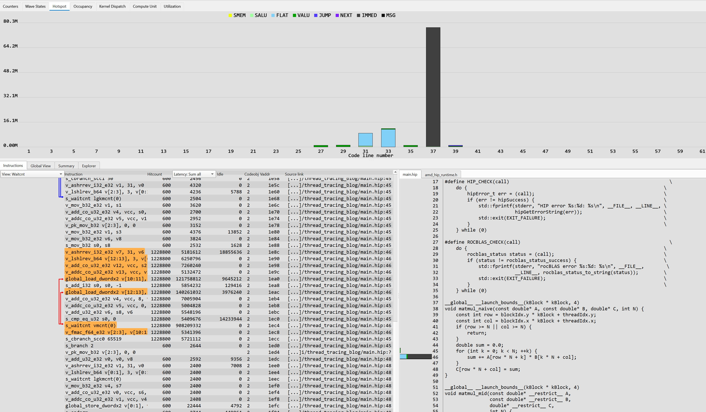

</div>

<p style="text-align:center">

Figure 1: Hotspot tab for Naive DGEMM Kernel

</p>

Please note that the code line in the top panel of Figure 1 refers to the assembly code on the left. In fact, the HIP code spends
time at line 46, not 37.

In the corresponding assembly view, we can see the highlighted assembly lines involved in code line
46: two global loads, various operations needed to compute the indices and addresses, a wait
needed for correctness (for the global loads in the loop), and an `fmac` instruction implementing the
accumulation into a register.

This naive implementation, `matmul_naive`, is heavily memory bound. In fact, each thread in a block
reads the same data from main memory several times. For matrix A, threads read the data in a
coalesced way, whereas for matrix B they do not. So, why do we see the majority of time spent in
IMMED instructions instead of memory instructions (called FLAT by RCV)?

It is because the kernel spends most of its time in the `s_waitcnt` instructions at the end of each
iteration in the loop. The loop cannot proceed to the next iteration until all outstanding memory
operations complete. Not being able to proceed with several iterations in parallel significantly
impacts the performance of the overall kernel.

You can also observe this in the Wave States tab in Figure 2, where the majority of waves in
a CU are in "wait" state. A smaller number are "stalled" and very few waves are
executing.

<div style="text-align: center;">

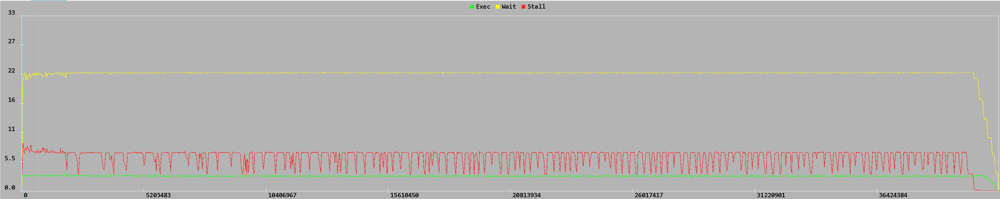

</div>

<p style="text-align:center">

Figure 2: Wave States tab for Naive DGEMM Kernel

</p>

A wave in "wait" state is a wave stuck in a checkpoint waiting for a previous operation (like data
loading) to commit its results before the next instruction can begin.
In this case, `s_waitcnt` is said instruction.
A wave in "stall" state stalls unexpectedly due to data hazards, execution dependencies, pipeline
conflicts, or memory delays (such as a cache miss fetching off-chip HBM).

The Compute Unit tab helps you see this difference more clearly, and shows which instructions
stall and wait states affect.

<div style="text-align: center;">

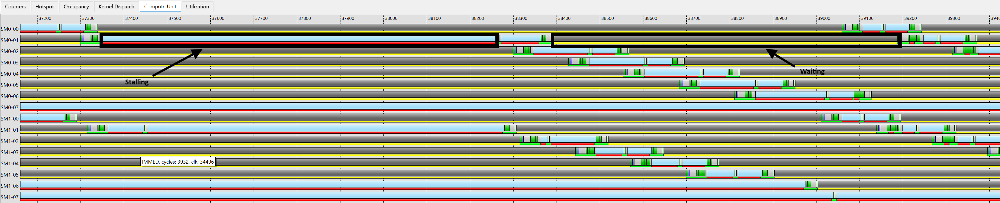

</div>

<p style="text-align:center">

Figure 3: Compute Unit tab for Naive DGEMM Kernel

</p>

In Figure 3 we can see a red line under the FLAT instructions and a yellow line under the dark gray
IMMED instructions. That shows clearly that FLAT instructions stall while the hardware gathers data that is not
readily available from HBM/cache, whereas the IMMED instruction is waiting for the data to
arrive and be visible in the registers. Note how the two consecutive FLAT instructions are not of
the same length. The main reason for this discrepancy is in the different access patterns of
matrices A and B and the various levels of cache involved.
As a reminder, the colors red, yellow, and green under each bar have the same meaning as in Figure 2:
red for Stall, yellow for Wait, and green for Exec.

To see this even more explicitly, the Utilization tab is helpful. In Figure 4, we see consecutive
FLAT instructions on certain VMEM units alternating between shorter and longer in a very consistent
way.

<div style="text-align: center;">

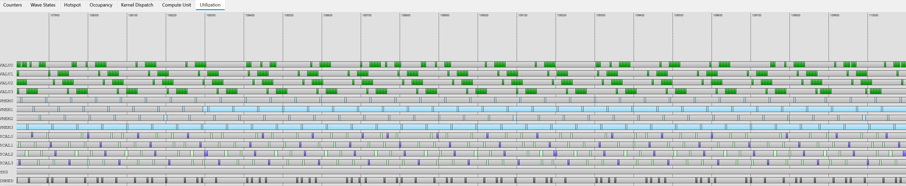

</div>

<p style="text-align:center">

Figure 4: Utilization tab for Naive DGEMM Kernel

</p>

### Unrolled DGEMM Kernel

One way to get more memory requests in flight is to perform a certain level of loop
unrolling. `matmul_mid` implements this optimization by using `#pragma unroll 4` to ask the
compiler to unroll 4 iterations of the inner loop in each thread.

This simple optimization has the desired effect: the kernel now spends most of its time in memory
instructions (labeled as FLAT in RCV). Figure 5 shows this.

<div style="text-align: center;">

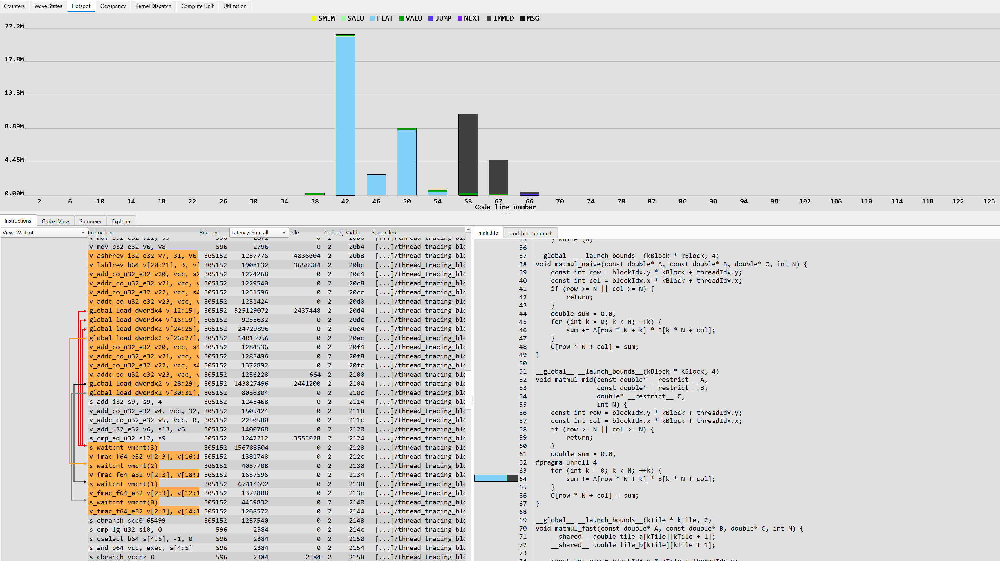

</div>

<p style="text-align:center">

Figure 5: Hotspot tab for Unrolled DGEMM Kernel

</p>

The effect of the loop unrolling is visible in the assembly view, where the code issues several load
instructions before posting the `s_waitcnt` instructions needed for correctness.

One very interesting thing is the difference in load instructions used, in particular
`global_load_dwordx4` and `global_load_dwordx2`.
`global_load_dwordx4` loads 4 registers with consecutive memory locations, whereas `global_load_dwordx2` loads 2 registers. Since we are dealing with a double-precision code
and the CDNA2 architecture operates with 32-bit-wide registers,
`global_load_dwordx4` is loading 2 elements at a time from global memory.
This can only happen when reading matrix A, which occupies contiguous memory. The kernel
still reads matrix B one element at a time.

By looking at the Wave States tab in Figure 6, we can see that now most of the waves are in "stall"
state, waiting for data to come back from memory, as we expect from this kernel.

<div style="text-align: center;">

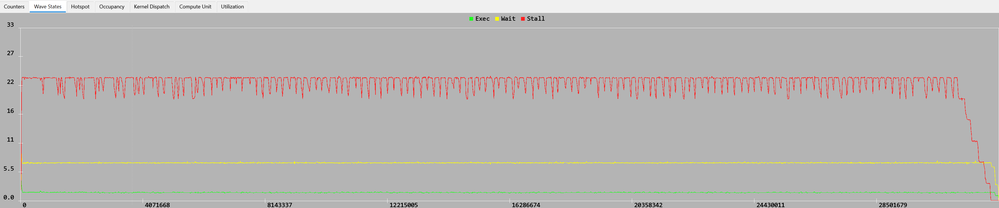

</div>

<p style="text-align:center">

Figure 6: Wave States tab for Unrolled DGEMM Kernel

</p>

The Compute Unit tab in Figure 7 clearly shows that the stalls on the various memory accesses take
longer than the waits.

<div style="text-align: center;">

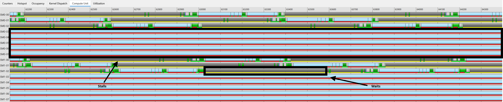

</div>

<p style="text-align:center">

Figure 7: Compute Unit tab for Unrolled DGEMM Kernel

</p>

Finally, we still see that some memory accesses take longer than others in the Utilization tab in
Figure 8. This is due to different memory access patterns and caching effects that we cannot clearly
quantify with ATT.

<div style="text-align: center;">

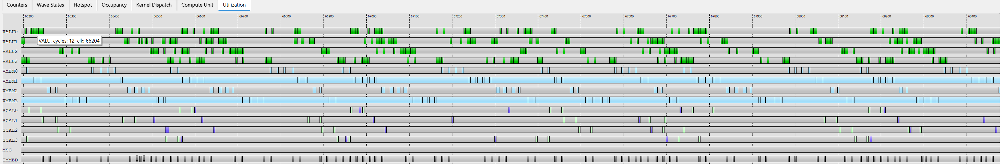

</div>

<p style="text-align:center">

Figure 8: Utilization tab for Unrolled DGEMM Kernel

</p>

### LDS DGEMM Kernel

As mentioned before, the previous two kernels suffer from two major problems: 1) threads in the same
block access the same locations in global memory many times; 2) the accesses to matrix B are
uncoalesced. One clever way of solving these problems is to rely on LDS memory. By doing so, you can
read matrix B in a coalesced way and transpose it on the fly while accessing LDS. As the reader may
already know, LDS is not subject to the penalty of uncoalesced memory accesses and thus these
accesses do not impact performance. The second benefit of using LDS tiles is to reuse the data
within the thread block, without reading the same locations from global memory multiple times.

This clever kernel redesign, implemented in `matmul_fast`, shows major changes in the Hotspot tab
in Figure 9.

<div style="text-align: center;">

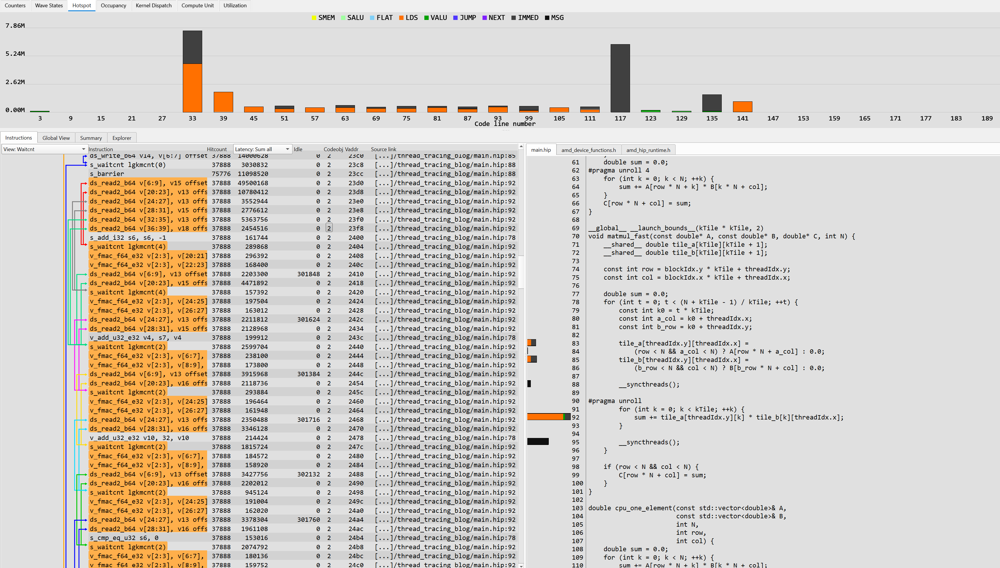

</div>

<p style="text-align:center">

Figure 9: Hotspot tab for LDS DGEMM Kernel

</p>

Most of the time spent at line 92 of the HIP source is LDS-related. The `__syncthreads()` barrier,
needed to ensure that the kernel has correctly loaded and stored LDS data, consumes a fair amount of time.
The corresponding assembly code looks very interesting, showing the effect of both loop unrolling and
efficient LDS memory loads, always reading 2 elements at a time, regardless of matrix A or B.

The Wave States tab now shows roughly equal amounts of stall and wait states for the various waves
(Figure 10).

<div style="text-align: center;">

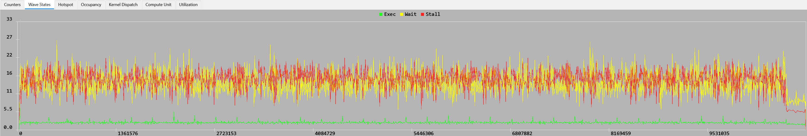

</div>

<p style="text-align:center">

Figure 10: Wave States tab for LDS DGEMM Kernel

</p>

To understand which instructions are now causing the stalls and waits, we need to look at the
Compute Unit tab in Figure 11.

<div style="text-align: center;">

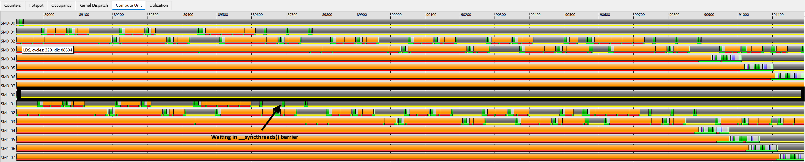

</div>

<p style="text-align:center">

Figure 11: Compute Unit tab for LDS DGEMM Kernel

</p>

It is now clear that some waves spend most of the time waiting in the `__syncthreads()` barriers,
mostly because of imbalance or because boundary checks filtered them out.
LDS load/store instructions now generate the stalls; FLAT instructions rarely stall anymore.

Despite showing several inefficiencies in terms of the number of active threads, this kernel is quite
efficient. The Utilization tab in Figure 12 also shows this.

<div style="text-align: center;">

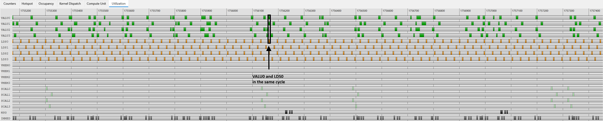

</div>

<p style="text-align:center">

Figure 12: Utilization tab for LDS DGEMM Kernel

</p>

The kernel now executes several kinds of instructions during the same cycle, as the dark circles
highlight. We can see the kernel issue VALU0, LDS0, and VMEM0 instructions in the same cycle,
increasing the IPC (instructions per cycle) to 3 and thus reducing the execution time of the
overall application even further.

### rocBLAS DGEMM Kernel

At this point, it should be clear that moving data efficiently from global memory to local
(LDS/Register) memory and minimizing unnecessary memory movements is crucial to obtain
higher performance. Moving as much data as possible to registers and overlapping data movement
to/from LDS with global memory transfers and computation represent the goal for achieving top
performance. To observe how the rocBLAS kernel achieves this, let us take a look at the profile of a
GEMM kernel used by rocBLAS in Figure 13.

<div style="text-align: center;">

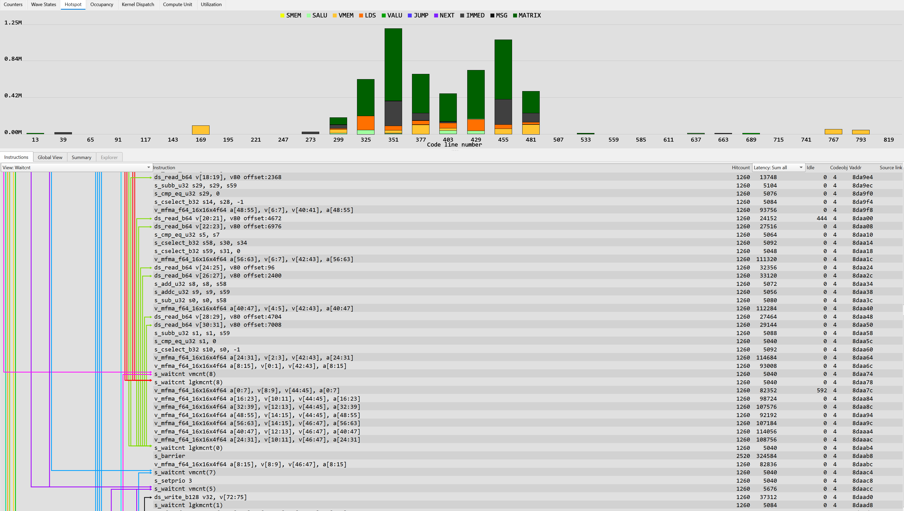

</div>

<p style="text-align:center">

Figure 13: Hotspot tab for rocBLAS DGEMM Kernel

</p>

MATRIX operations account for the majority of time, which is what one would expect from an
efficient GEMM kernel. The HIP code on the right is not available because rocBLAS ships this kernel
in native assembly. However, we can see many in-flight operations represented by different arrows
while the `mfma` instructions execute.

To take a better look at this, Figures 14 and 15 show the Compute Unit utilization at different
points in the kernel.

<div style="text-align: center;">

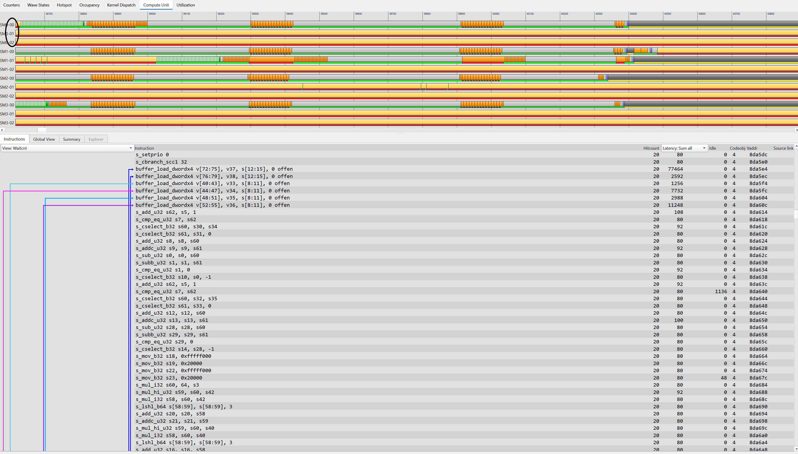

</div>

<p style="text-align:center">

Figure 14: Compute Unit tab for rocBLAS DGEMM Kernel - Memory load

</p>

Figure 14 shows the part where the kernel reads data from global memory, using the
`buffer_load_dwordx4` instructions. The interesting part is that the code keeps working on other instructions (VALU)
needed later on in an attempt to hide the latency of data movement as much as possible.
The colorful arrows in the assembly code show where each instruction is supposed to finish in an
`s_waitcnt`.
Unlike all the previous cases, this kernel targets a *lower* occupancy.
Looking at the waves on each SIMD (called SM in RCV), we notice that there are only 3
waves per SIMD running, for a total of 12 waves per CU.
This is by design: lower occupancy allows for a higher number of registers per wave, which
is what this kernel is aiming for. In all previous cases, the occupancy was 8 waves per SIMD, the
maximum achievable on the CDNA2 architecture.

<div style="text-align: center;">

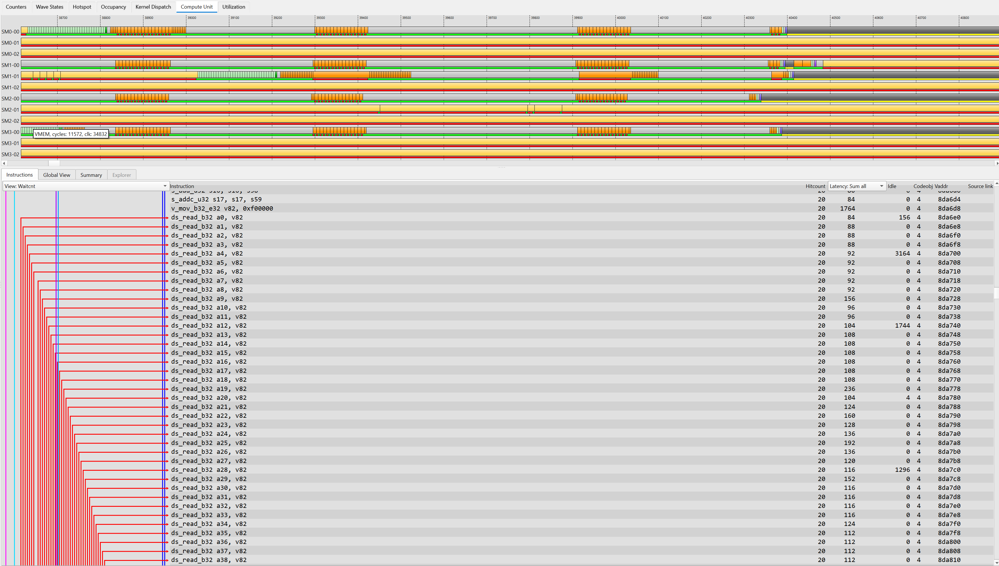

</div>

<p style="text-align:center">

Figure 15: Compute Unit tab for rocBLAS DGEMM Kernel - LDS load

</p>

In Figure 15, we show the code that follows the Figure 14 section. Note how the arrows from the previous
`buffer_load_dwordx4` instructions overlap with the large amount of independent `ds_read` instructions and scalar instructions.
This overlap between instructions generated by this particular schedule implements a form of
instruction-level parallelism (ILP) not only within the same wave but also across waves. Figure
16 shows this: different classes of instructions (VALU, LDS, etc.), belonging to different waves, issue
in the same cycle (achieving an IPC greater than one).
Note that each SIMD unit can issue only one instruction from the same wave directed to the same
unit (e.g., VALU) per cycle.
Once a SIMD unit issues them, they execute in parallel.
GPUs do not give you this same-wave ILP for free, as CPUs may, where
specialized hardware implements out-of-order execution.
In this particular case, the authors specifically used assembly language to manually implement a
schedule able to expose ILP and overlap instructions as much as possible.
For more information about the delicate balance between occupancy and ILP in GPU compilers, we
recommend this [paper](https://dl.acm.org/doi/10.1145/3368826.3377918).

<div style="text-align: center;">

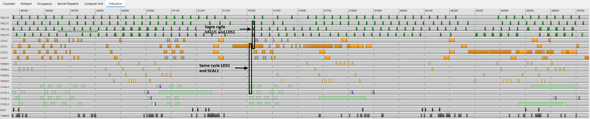

</div>

<p style="text-align:center">

Figure 16: Utilization tab for rocBLAS DGEMM Kernel

</p>

## Summary

This blog post introduced the Advanced Thread Trace (ATT) capability of rocprofv3 and showed how to
use it to understand the low-level behavior of GPU kernels. Using four progressively optimized
implementations of a DGEMM kernel, we walked through the main tabs of the ROCprof Compute Viewer
(Hotspot, Wave States, Compute Unit, and Utilization) and demonstrated how to connect the reported
metrics to the underlying source code and corresponding assembly representation.

Along the way, we highlighted a few key ideas:

- **Wait vs. stall states**: an explicit synchronization point (such as
  `s_waitcnt` or `__syncthreads()`) blocks waves in a "wait" state, while data hazards, dependencies,
  or memory latency hold back waves in a "stall" state. ATT helps distinguish between the two scenarios, which is essential for identifying the real bottleneck.
- **Memory movement is king**: waits on uncoalesced global memory accesses dominated the naive kernel.
  Loop unrolling exposed more memory requests in flight, LDS tiling removed redundant and uncoalesced accesses,
  and the rocBLAS kernel overlapped data movement with computation to hide latency almost entirely.
- **Occupancy is a trade-off, not a goal**: the highly optimized rocBLAS kernel deliberately runs at a *lower*
  occupancy to give each wave more registers, and keeps the hardware busy through parallelism at two levels.
  The kernel achieves a high IPC (greater than one) by issuing different instructions from different
  waves during the same cycle on a given SIMD unit, while it achieves ILP by filling the pipelines of
  the various units (VALU, VMEM, LDS, etc.) with instructions from the same wave, hiding latency by
  executing other independent instructions rather than relying on a large number of waves.

ATT is a powerful microscope, but use it once higher-level tools like rocprof-compute and
rocprof-sys have narrowed down where to look. When you apply it to the right kernel, it lets you build
and verify a concrete narrative for why your application performs the way it does.

This post is Part 6 of the Performance Profiling on AMD GPUs series. The earlier parts work through
the ROCm profiling stack from foundations and high-level workflows down to applied case studies.
ATT is the lowest of those layers: once those tools have named the kernel, thread trace records the
instruction-by-instruction behavior of its wavefronts so we can explain the performance we already
measured.

The current six-part sequence ends here, but the series is not finished. We plan to return with
applied optimization case studies in the same spirit as this one: a real workload, a real profiler
trace, and the experiment-by-experiment path from baseline to a measurable speed-up. One topic
already on the list is profiling for AI workloads: the tool features across the ROCm stack that
matter most for training and inference rather than traditional HPC codes. If there is a profiling
topic, workload type, or tool feature you would like the team to cover next, the comment thread on
this blog is a good place to let us know.

## Additional Resources

The following are links to the GitHub repos and ROCm docs for the tools described
above for your quick reference, along with earlier posts in this series.

- `rocprofv3`:
  - Open source at [rocprofiler-sdk GitHub repo](https://github.com/ROCm/rocm-systems/tree/develop/projects/rocprofiler-sdk)
  - [`rocprofv3` tool documentation](https://rocm.docs.amd.com/projects/rocprofiler-sdk/en/latest/how-to/using-rocprofv3.html#using-rocprofv3)
- ATT:
  - [Thread Trace Part 1: ROCprof Compute Viewer](https://rocm.blogs.amd.com/software-tools-optimization/thread-trace/README.html)
  - Open source ROCprof Compute Viewer at [rocprof-compute-viewer GitHub repo](https://github.com/ROCm/rocprof-compute-viewer)
  - [`rocprofv3` Thread Trace documentation](https://rocm.docs.amd.com/projects/rocprofiler-sdk/en/latest/how-to/using-thread-trace.html)
- Performance Profiling on AMD GPUs blog series:
  - Part 1: [Foundations](https://rocm.blogs.amd.com/software-tools-optimization/profiling-guide/intro/README.html).
  - Part 2: [Basic Usage](https://rocm.blogs.amd.com/software-tools-optimization/profiling-guide/novice/README.html).
  - Part 3: [Advanced Usage](https://rocm.blogs.amd.com/software-tools-optimization/profiling-guide/advanced/README.html).
  - Part 4: [Fortran OpenMP Offload Edition](https://rocm.blogs.amd.com/software-tools-optimization/profiling-guide/fortran_openmp/README.html).
  - Part 5: [Profiling-Driven Kernel Optimization with an AI Code-Assist Tool](https://rocm.blogs.amd.com/software-tools-optimization/profiling-guide/ai-assist-optimization/README.html).

If you have any questions or comments, please reach out to us on GitHub
[Discussions](https://github.com/ROCm/rocm-blogs/discussions).

## Disclaimers

The information presented in this document is for informational purposes only and may contain technical inaccuracies, omissions, and typographical errors. The information contained herein is subject to change and may be rendered inaccurate for many reasons, including but not limited to product and roadmap changes, component and motherboard version changes, new model and/or product releases, product differences between differing manufacturers, software changes, BIOS flashes, firmware upgrades, or the like. Any computer system has risks of security vulnerabilities that cannot be completely prevented or mitigated. AMD assumes no obligation to update or otherwise correct or revise this information.
However, AMD reserves the right to revise this information and to make changes from time to time to the content hereof without obligation of AMD to notify any person of such revisions or changes.
THIS INFORMATION IS PROVIDED ‘AS IS.” AMD MAKES NO REPRESENTATIONS OR WARRANTIES WITH RESPECT TO THE CONTENTS HEREOF AND ASSUMES NO RESPONSIBILITY FOR ANY INACCURACIES, ERRORS, OR OMISSIONS THAT MAY APPEAR IN THIS INFORMATION. AMD SPECIFICALLY DISCLAIMS ANY IMPLIED WARRANTIES OF NON-INFRINGEMENT, MERCHANTABILITY, OR FITNESS FOR ANY PARTICULAR PURPOSE. IN NO EVENT WILL AMD BE LIABLE TO ANY PERSON FOR ANY RELIANCE, DIRECT, INDIRECT, SPECIAL, OR OTHER CONSEQUENTIAL DAMAGES ARISING FROM THE USE OF ANY INFORMATION CONTAINED HEREIN, EVEN IF AMD IS EXPRESSLY ADVISED OF THE POSSIBILITY OF SUCH DAMAGES.
AMD, the AMD Arrow logo, and combinations thereof are trademarks of Advanced Micro Devices, Inc. Other product names used in this publication are for identification purposes only and may be trademarks of their respective companies. © 2026 Advanced Micro Devices, Inc. All rights reserved
