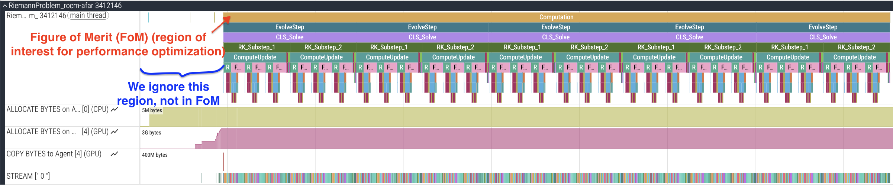
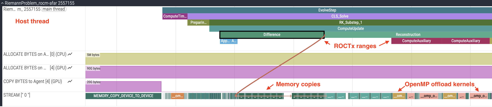
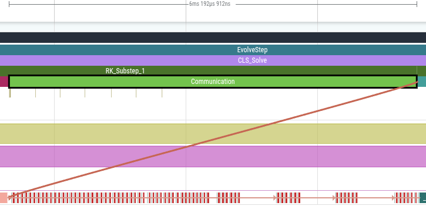
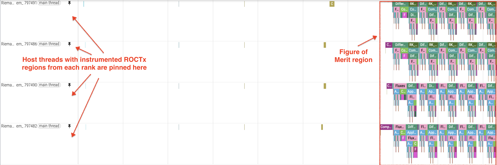
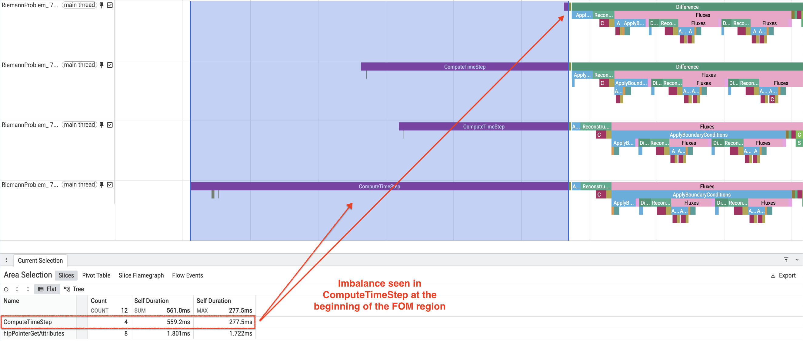
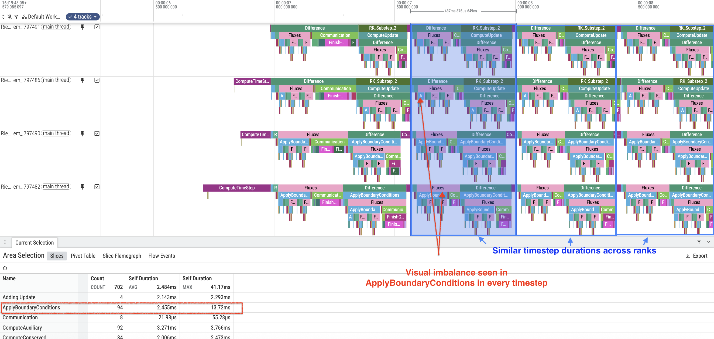
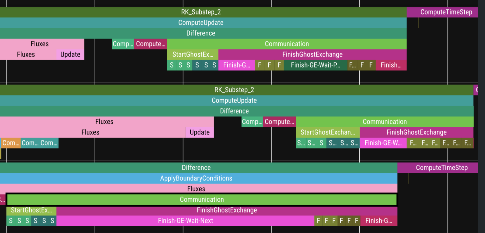
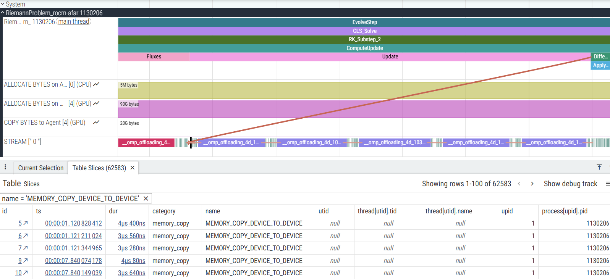
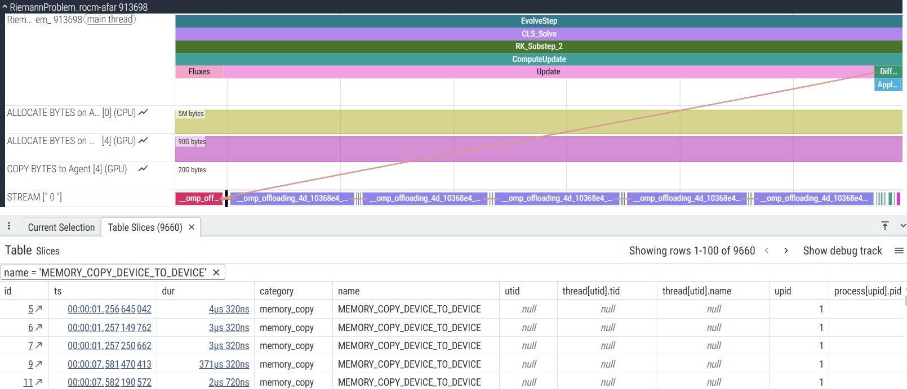
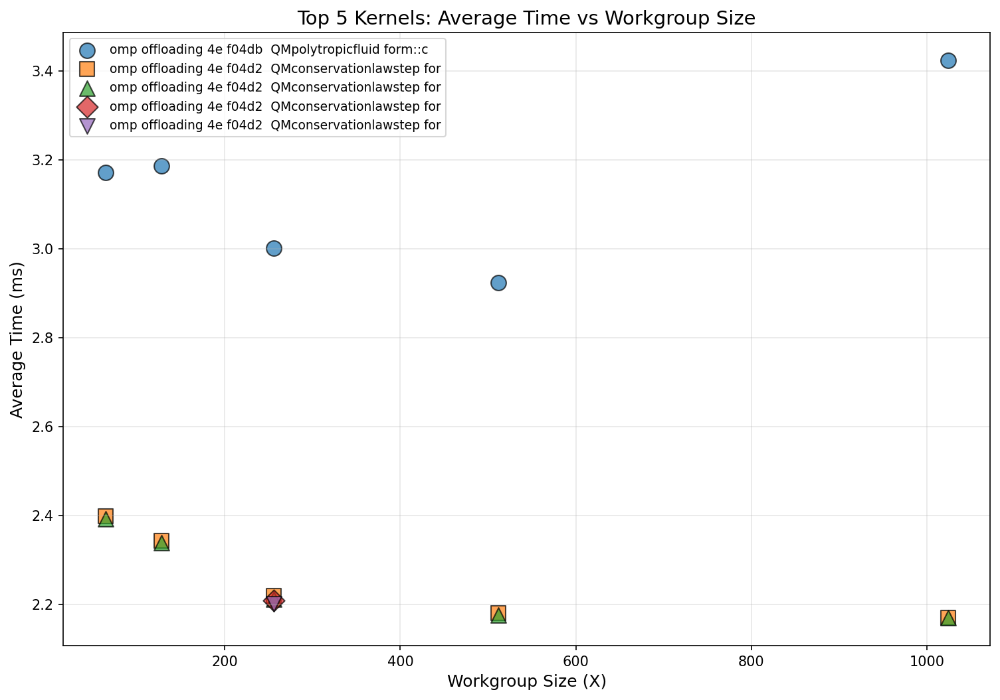

<!---
Copyright (c) 2026 Advanced Micro Devices, Inc. (AMD)

Permission is hereby granted, free of charge, to any person obtaining a copy
of this software and associated documentation files (the "Software"), to deal
in the Software without restriction, including without limitation the rights
to use, copy, modify, merge, publish, distribute, sublicense, and/or sell
copies of the Software, and to permit persons to whom the Software is
furnished to do so, subject to the following conditions:

The above copyright notice and this permission notice shall be included in all
copies or substantial portions of the Software.

THE SOFTWARE IS PROVIDED "AS IS", WITHOUT WARRANTY OF ANY KIND, EXPRESS OR
IMPLIED, INCLUDING BUT NOT LIMITED TO THE WARRANTIES OF MERCHANTABILITY,
FITNESS FOR A PARTICULAR PURPOSE AND NONINFRINGEMENT. IN NO EVENT SHALL THE
AUTHORS OR COPYRIGHT HOLDERS BE LIABLE FOR ANY CLAIM, DAMAGES OR OTHER
LIABILITY, WHETHER IN AN ACTION OF CONTRACT, TORT OR OTHERWISE, ARISING FROM,
OUT OF OR IN CONNECTION WITH THE SOFTWARE OR THE USE OR OTHER DEALINGS IN THE
SOFTWARE.
--->

# Performance Profiling on AMD GPUs - Part 4: Fortran OpenMP Offload Edition

This blog, like the previous articles in the profiling guide series ([Part 1](https://rocm.blogs.amd.com/software-tools-optimization/profiling-guide/intro/README.html), [Part 2](https://rocm.blogs.amd.com/software-tools-optimization/profiling-guide/novice/README.html), and [Part 3](https://rocm.blogs.amd.com/software-tools-optimization/profiling-guide/advanced/README.html)),
is designed to help you systematically analyze and improve the performance of your
Fortran OpenMP offload applications running on AMD GPUs. This guide builds upon the foundational skills
from the previous articles and introduces profiling techniques specifically tailored for Fortran applications
that use OpenMP target offloading.

1. **What You Already Know**:
   - Your Fortran application leverages OpenMP target offloading to execute computation on AMD GPUs.
   - You understand the basic purpose of OpenMP target regions in your code.
   - You have observed performance bottlenecks or want to optimize your application's GPU utilization (optional).

2. **What This Guide Will Teach You**:
   - **Fortran OpenMP Profiling Basics**: Learn how to profile Fortran applications with OpenMP offload and measure where your application spends time.
   - **Multi-Device Profiling**: Explore profiling techniques for MPI-based multi-process Fortran applications running on multiple GPUs in a single node.
   - **Advanced Analysis**: Use ROCm profiling tools to identify bottlenecks in GPU kernels, host-side execution, and data movement patterns.
   - **Optimization Strategies**: Apply targeted optimizations based on profiling insights to improve performance.

By the end of this blog, you will be able to profile your Fortran OpenMP offload application to identify opportunities
for optimization on the GPU, CPU, and in data movement, with a focus on achieving optimal performance on AMD hardware.

This blog uses profilers from ROCm 7.2. Experiments were run on an MI300A APU, which supports the [unified memory model](https://rocm.docs.amd.com/projects/HIP/en/latest/how-to/hip_runtime_api/memory_management/unified_memory.html), but the methodology described in this blog is general and also applicable to discrete GPUs.

## Profiling Basics

We follow the same systematic profiling workflow introduced in the previous articles in the profiling guide series:
establish baseline performance, identify bottlenecks (host vs. device vs. data movement), analyze hardware resource usage and kernel performance metrics,
perform targeted optimizations, and iterate. For Fortran OpenMP offload applications, this workflow helps identify opportunities to optimize
OpenMP target regions, reduce data transfers between host and device, and improve GPU utilization.

The ROCm profiling tools have been successfully demonstrated on simpler Fortran OpenMP offload examples in the
[HPCTrainingExamples repository](https://github.com/amd/HPCTrainingExamples). For instance, the [rocprofv3 OpenMP examples](https://github.com/amd/HPCTrainingExamples/tree/main/Rocprofv3/OpenMP)
show how to collect timeline traces, the [rocprofiler-systems Jacobi example](https://github.com/amd/HPCTrainingExamples/tree/main/rocprofiler-systems/Jacobi)
demonstrates system-level profiling, and the [Fortran Jacobi example with ROCTx markers](https://github.com/amd/HPCTrainingExamples/blob/main/Pragma_Examples/OpenMP/Fortran/8_jacobi/3_jacobi_targetdata_markers)
illustrates code instrumentation techniques. Additionally, the [rocprof-compute OpenMP Fortran examples](https://github.com/amd/HPCTrainingExamples/tree/main/rocprof-compute/OpenMP/Fortran/1_collapse)
demonstrate detailed kernel analysis.

Starting from ROCm 7.0, ROCm profiling tools are being enhanced to write profiled data into a SQLite3-based database in order to decouple post-processing from the profiling stage. Post-processing can now be done using a new tool called `rocpd`. The advantage of using this workflow is that we profile once and perform several types of analyses on the collected profiled data. This blog demonstrates this "`rocprofv3` once + `rocpd` many times" workflow. Usage instructions and a summary of features of `rocpd` are documented in the ["Using rocpd output format"](https://rocm.docs.amd.com/projects/rocprofiler-sdk/en/latest/how-to/using-rocpd-output-format.html) page. The [rocpd training example](https://github.com/amd/HPCTrainingExamples/tree/main/Rocprofv3/rocpd) demonstrates `rocpd` usage with two Jacobi examples.

For the rest of this blog, we will apply similar methodologies and tooling to a more complex application: GenASiS.

## GenASiS Example

As a working example, we will use GenASiS (General Astrophysical Simulation System), a production astrophysics simulation code
that combines Message Passing Interface (MPI) for distributed parallelism with OpenMP target offloading for GPU acceleration. Specifically, we use the [GenASiS_Basics](https://github.com/GenASiS/GenASiS_Basics) repository maintained by researchers at Oak Ridge National Laboratory. GenASiS is an excellent example
because it represents a real-world HPC workload with complex communication patterns and computational kernels.

GenASiS uses a distributed mesh approach with domain decomposition, making it well-suited for multi-GPU configurations.
The application includes various computational kernels for solving conservation equations, performing reconstructions, and computing fluxes; these are typical
operations found in many scientific simulation codes.
To build GenASiS with OpenMP offload support for AMD GPUs, you will need:

- A Fortran compiler with OpenMP offload support.
- ROCm libraries and runtime.
- An MPI installation compatible with the Fortran toolchain.

While other Fortran compilers support AMD GPU offloading (e.g., HPE Cray Fortran), this blog features the `amdflang` compiler from AMD. You can obtain `amdflang` either from the standalone [ROCm AFAR](https://repo.radeon.com/rocm/misc/flang/) pre-production toolchain (see the [ROCm AFAR introduction blog](https://rocm.blogs.amd.com/ecosystems-and-partners/fortran-journey/README.html)) or from the integrated compiler included in ROCm 7.0+ (typically an older version than the pre-production ROCm AFAR releases). For detailed build instructions, see the [GenASiS Basics README file](https://github.com/GenASiS/GenASiS_Basics/blob/master/README.Basics). For this blog, GenASiS was compiled using `amdflang` from ROCm AFAR drop 22.2.0 with `-O3 -fopenmp --offload-arch=gfx942`, along with OpenMPI 5.0.3.

## Single-Device Profiling

### Picking the Right Problem Size

To obtain a representative performance profile, choose a problem size that saturates the device's compute and memory resources.
For GenASiS on a node with 4 MI300A devices, running one process per GPU device, a grid of 468 × 468 × 468 cells per device provides a good balance, yielding a
memory footprint of approximately 90GB per device. The amount of host and device memory used in an application over time can be traced
using `rocprofv3`, for example, as discussed in [Generating Timeline Traces](#generating-timeline-traces).

Before attaching any profiler, run the application at this size to simultaneously verify correct execution, confirm that OpenMP offloading is active, and
record the initial timing statistics from the application's built-in timers:

```bash
mpirun -np 1 GenASiS_Basics/install/bin/RiemannProblem_rocm-afar \
  Verbosity=INFO_2 nCells=468,468,468 Dimensionality=3D FinishCycle=5
```

If you run under Slurm, use an equivalent `srun` invocation instead of `mpirun`.

The output should include OpenMP environment information confirming successful offload:

```bash
INFO_1: OpenMP environment
         MaxThreads  =         2
           nDevices  =         4
     OffloadEnabled  =   TRUE
    Selected device  =         0
```

The `OffloadEnabled = TRUE` confirms that OpenMP target regions will execute on the GPU. Once correctness is established, we can start
analyzing the application's performance using profiling tools.

### Adding ROCTx Markers to Fortran Code

We recommend instrumenting important regions of your code using ROCTx markers before you start profiling. In a Fortran application like GenASiS,
ROCTx regions can be added using interfaces in the [hipfort](https://github.com/ROCm/hipfort) library. Here are the steps to follow:

1. **Import the hipfort_roctx module** at the top of your Fortran source file.
2. **Call `roctxRangePush`** at the start of a region you want to annotate (note that this requires a null-terminated string).
3. **Call `roctxRangePop`** at the end of the region.

Because hipfort exposes these routines as Fortran interfaces to the C ROCTx API, region names must be explicitly null-terminated on the
Fortran side: C expects null-terminated strings, whereas Fortran character strings do not include a terminating null character unless you append
it (e.g. with `// char(0)`).

The following example shows how the main evolution loop in `ConservationLawEvolution_Template.f90` is instrumented:

```fortran
use hipfort_roctx

! ... in your subroutine ...
integer :: iRoctxLevel

do while ( CLE % Time < CLE % FinishTime )
  iRoctxLevel = roctxRangePush ( "EvolveStep" // char(0) )

  ! Nested marker for timestep computation
  iRoctxLevel = roctxRangePush ( "ComputeTimeStep" // char(0) )
  call ComputeTimeStep ( CLE )
  iRoctxLevel = roctxRangePop ( )  !-- ComputeTimeStep
  
  ! Nested marker for conservation law solve
  iRoctxLevel = roctxRangePush ( "CLS_Solve" // char(0) )
  call CLS % Solve ( CLE % TimeStep )
  iRoctxLevel = roctxRangePop ( )  !-- CLS_Solve

  iRoctxLevel = roctxRangePop ( )  !-- EvolveStep
end do
```

Markers can be nested to show hierarchical structure in the timeline trace as shown in the example above with `EvolveStep` and `ComputeTimeStep` regions. The hipfort library is included with standard ROCm installations. When compiling, include the hipfort headers (e.g., `-I${ROCM_PATH}/include/hipfort/amdgcn`), and when linking, add the rocprofiler-sdk ROCTx library (e.g., `-L${ROCM_PATH}/lib -lrocprofiler-sdk-roctx`).

### Collecting Kernel and ROCTx Region Hotspot Summary

First, we identify which kernels consume the most GPU time and how much time we spend in different ROCTx regions by running `rocprofv3 --runtime-trace` followed by `rocpd summary`. Note that options such as `--runtime-trace` or `--sys-trace` also collect ROCTx marker regions among others:

```bash
mpirun -np 1 \
  rocprofv3 --runtime-trace -d outdir -o genasis_trace -- \
  GenASiS_Basics/install/bin/RiemannProblem_rocm-afar \
  Verbosity=INFO_2 nCells=468,468,468 Dimensionality=3D FinishCycle=5
rocpd summary --region-categories KERNEL MARKER -i outdir/genasis_trace_results.db
```

The kernel hotspot list reveals a **relatively flat profile**, where no single kernel dominates execution time.
The top 5 kernels account for approximately 50% of GPU time[^1]:

| Rank | Kernel Name | % GPU Time | Calls | Avg Duration (ms) |
|------|-------------|------------|-------|-------------------|
| 1 | `computeeigenspeedskernel_l166` | 12.7% | 130 | 2.86 |
| 2 | `computefluxeskernel_l225` | 10.6% | 150 | 2.07 |
| 3 | `computefluxeskernel_l290` | 10.6% | 150 | 2.06 |
| 4 | `computeauxiliarykernel_l104` | 8.4% | 130 | 1.88 |
| 5 | `computeconservedkernel_l19` | 8.2% | 120 | 2.01 |

This suggests that we may benefit from optimizations that could be **uniformly applied** across multiple kernels rather than targeting a single hotspot.

The `DURATION` column in the markers summary helps you see how much time is spent in each marker region. Note that if there are no nested regions, the `PERCENT` column can help identify which regions the application spends most time in (not applicable here due to the presence of nested regions).

```bash
MARKERS_SUMMARY:
                      Name  Calls  DURATION (nsec)  AVERAGE (nsec)  PERCENT (INC)  MIN (nsec)  MAX (nsec)       STD_DEV
               Computation      1       7034060565    7.034061e+09      13.614240  7034060565  7034060565           NaN
                EvolveStep      5       7034041615    1.406808e+09      13.614203  1393918636  1447001992  2.261686e+07
                 CLS_Solve      5       7030723958    1.406145e+09      13.607782  1393569274  1445174903  2.196855e+07
             ComputeUpdate     10       6714775351    6.714775e+08      12.996272   666099033   688223340  8.433135e+06
<snip>
```

### Generating Timeline Traces

Next, we generate a Perfetto timeline trace to understand execution patterns.

```bash
rocpd2pftrace -i outdir/genasis_trace_results.db -d outdir -o genasis_trace 
```

This command generates a trace file (`outdir/genasis_trace_results.pftrace`) that can be visualized in the [Perfetto UI](https://ui.perfetto.dev/). Note that the profile we collected previously is used again, this time to generate the Perfetto trace.

When you load the trace in Perfetto, you will first see a high-level view of the application run from the traced marker regions, as shown in Figure 1. The `Computation` region, which we use to indicate our Figure-Of-Merit (FoM) region, is at the outermost level, with other ROCTx regions nested inside it.

<div style="text-align: center;">



</div>

<p style="text-align:center">

Figure 1: Perfetto trace showing instrumented ROCTx markers and FoM region.

</p>

When you zoom in as shown in Figure 2, you will observe several key elements in the timeline trace:

- **OMP Activity**: OpenMP offload regions appear as GPU kernel dispatches, showing when computation happens on the device. Overlap between compute kernels—or the lack of it—may suggest optimizations.
- **Memory allocation**: Timeline traces include memory allocation (in bytes) for host and device pools, allowing you to track memory usage in your application.
- **Data Movement Patterns**: Memory copies between host and device are visible as copy operations. Frequent or large data transfers may become bottlenecks. We can look for unnecessary transfers or for data that could remain on device between iterations.
- **Gaps in GPU activity**: Timeline traces show periods where the GPU is idle, indicating host-side work or synchronization points. These gaps could lead us to compute regions that could be offloaded to the GPU.
- **ROCTx Markers**: Custom instrumentation markers (EvolveStep, CLS_Solve, RK_Substep, Communication) provide visibility into major code regions.

<div style="text-align: center;">



</div>

<p style="text-align:center">

Figure 2: Perfetto trace showing OMP activity, memory allocation, data transfers, and instrumented ROCTx markers.

</p>

From the single-device trace we can conclude that there are consistent GPU kernel execution patterns within each timestep, and that there is some communication overhead. Even for single-rank jobs, GenASiS performs buffer copies (72 pack/unpack kernels total) without ghost exchanges. This is visible in the trace and originates from `DistributedMesh_Form.f90:287-298`, where the code always prepares communication buffers regardless of whether MPI communication actually occurs. Figure 3 shows a zoomed-in snapshot of this region of the trace, including the pack and unpack kernels seen under the `Communication` ROCTx region.

<div style="text-align: center;">



</div>

<p style="text-align:center">

Figure 3: Multiple pack and unpack kernels seen under the "Communication" ROCTx region that took around 6.2ms.

</p>

### Identifying Bottlenecks with rocprof-compute

With the baseline established, we can now identify specific bottlenecks using more detailed profiling techniques. To understand kernel performance characteristics, we use `rocprof-compute` for roofline analysis:

```bash
rocprof-compute profile -n genasis -- \
  mpirun -np 1 GenASiS_Basics/install/bin/RiemannProblem_rocm-afar \
  Verbosity=INFO_2 nCells=468,468,468 Dimensionality=3D FinishCycle=5

rocprof-compute analyze -p workloads/genasis/mi300a/ -b 4 
```

Once the profile collection is complete, the `rocprof-compute analyze` command above will produce roofline information, such as GFLOPs, measured HBM bandwidth, and arithmetic intensity, in Tables 4.1 and 4.2.
It is recommended to redirect the output to a file for easier viewing. The kernels will be displayed in order based on percentage of GPU time
(shown in parentheticals next to the kernel name). A selection of metrics from the top kernel in this profile are shown below:

```bash
Kernel 0: __omp_offloading_38_206d2d__QMpolytropicfluid_formPcomputeeigenspeedskernel_l166 (12.5%)
  |
  ├─ 4.1 Roofline Rate Metrics:
  |   ╒═════════════╤════════════════════╤══════════╤═════════╤════════════════════╕
  |   │ Metric_ID   │ Metric             │    Value │ Unit    │   Peak (Empirical) │
  |   ╞═════════════╪════════════════════╪══════════╪═════════╪════════════════════╡
  |   │ 4.1.1       │ VALU FLOPs (F32)   │     0.16 │ Gflop/s │           96063.54 │
  |   ├─────────────┼────────────────────┼──────────┼─────────┼────────────────────┤
  |   │ 4.1.2       │ VALU FLOPs (F64)   │   212.89 │ Gflop/s │           79287.40 │
  |   ├─────────────┼────────────────────┼──────────┼─────────┼────────────────────┤
  |   │    ...      │         ...        │    ...   │   ...   │         ...        │
  |   ├─────────────┼────────────────────┼──────────┼─────────┼────────────────────┤
  |   │ 4.1.9       │ HBM Bandwidth      │  2844.45 │ Gb/s    │            3343.63 │
  |   ├─────────────┼────────────────────┼──────────┼─────────┼────────────────────┤
  |   │ 4.1.10      │ L2 Cache Bandwidth │  2696.50 │ Gb/s    │           19341.46 │
  |   ├─────────────┼────────────────────┼──────────┼─────────┼────────────────────┤
  |   │ 4.1.11      │ L1 Cache Bandwidth │ 10218.53 │ Gb/s    │           25368.46 │
  |   ├─────────────┼────────────────────┼──────────┼─────────┼────────────────────┤
  |   │ 4.1.12      │ LDS Bandwidth      │     0.95 │ Gb/s    │           57333.99 │
  |   ╘═════════════╧════════════════════╧══════════╧═════════╧════════════════════╛
  ├─ 4.2 Roofline AI Plot Points:
  |   ╒═════════════╤══════════════════════╤═════════╤════════════╕
  |   │ Metric_ID   │ Metric               │   Value │ Unit       │
  |   ╞═════════════╪══════════════════════╪═════════╪════════════╡
  |   │ 4.2.0       │ AI HBM               │    0.07 │ Flops/byte │
  |   ├─────────────┼──────────────────────┼─────────┼────────────┤
  |   │ 4.2.1       │ AI L2                │    0.08 │ Flops/byte │
  |   ├─────────────┼──────────────────────┼─────────┼────────────┤
  |   │ 4.2.2       │ AI L1                │    0.02 │ Flops/byte │
  |   ├─────────────┼──────────────────────┼─────────┼────────────┤
  |   │ 4.2.3       │ Performance (GFLOPs) │  213.02 │ Gflop/s    │
  |   ╘═════════════╧══════════════════════╧═════════╧════════════╛
```

Note that the `rocprof-compute analyze` command will also generate a CLI roofline plot. For each kernel in the analyze output,
we can see the **measured** HBM Bandwidth (4.1.9) and compare it with
the empirical peak for the device. The arithmetic intensity (4.2.0) tells us whether we are in the bandwidth-bound or compute-bound regime. The table below is a summary of the top 10 kernels:

| Kernel | % GPU Time | AI (HBM) | HBM BW (GB/s) | % Peak BW |
|--------|------------|----------|---------------|-----------|
| `computeeigenspeedskernel_l166` | 12.5% | 0.07 | 2844 | 85% |
| `computefluxeskernel_l225` | 10.6% | 0.35 | 2868 | 86% |
| `computefluxeskernel_l290` | 10.5% | 0.35 | 2880 | 86% |
| `computeconservedkernel_l19` (pressureless) | 8.3% | 0.05 | 3149 | 94% |
| `computeauxiliarykernel_l104` | 8.3% | 4.53 | 2137 | 64% |
| `computereconstructionkernel_l156` | 8.0% | 0.25 | 3063 | 92% |
| `computeconservedkernel_l19` (polytropic) | 6.5% | 0.17 | 3023 | 90% |
| `computerawfluxeskernel_l280` | 6.3% | 0.13 | 3101 | 93% |
| `computeupdatekernel_l358` | 5.2% | 0.09 | 3128 | 94% |
| `computeeigenspeedskernel_l155` | 5.1% | 1.00 | 2782 | 83% |

Given the relatively low arithmetic intensity for all the top kernels, this confirms that GenASiS kernels are memory-bound;
the top kernels are currently measuring at 64-94% of peak empirical bandwidth[^1].

## Multi-Device Profiling

Profiling MPI applications running on multiple GPUs is not very different from profiling a single-process run. We will first see how to collect timeline traces for multi-process runs and then proceed to answer questions such as:

- Is there any load imbalance when running on multiple GPUs? (see [Load Imbalance Analysis](#load-imbalance-analysis) section)
- What is the communication overhead when we run multiple processes? (see [Communication Overhead Analysis](#communication-overhead-analysis) section)

For proper baseline measurement in a multi-process run, ensure proper GPU and CPU core affinity settings such that each process uses a different GPU device.
Setting proper affinity on other systems could be challenging. The ROCm blog posts [Affinity Part 1](https://rocm.blogs.amd.com/software-tools-optimization/affinity/part-1/README.html) and [Affinity Part 2](https://rocm.blogs.amd.com/software-tools-optimization/affinity/part-2/README.html) can help you understand your system's topology and set up affinity accordingly.

### Collecting a Timeline Trace for a Multi-Process Run

To generate a trace of this multi-process run, we simply run `rocprofv3 --runtime-trace` with the `%rank%` qualifier in the output filename so that the profiling
tool automatically generates separate profiles for each MPI rank (e.g., `trace_0_results.db`, `trace_1_results.db`). Note that while `rocprofv3` can trace GPU and host-side runtime (HIP, HSA, ROCTx) activity in multi-process MPI applications, it does not trace MPI calls. To trace MPI communications and study network performance, use the [ROCm Systems Profiler](https://rocm.docs.amd.com/projects/rocprofiler-systems/en/latest/index.html#rocm-systems-profiler-documentation) as described in our [previous article in the profiling guide series](https://rocm.blogs.amd.com/software-tools-optimization/profiling-guide/advanced/README.html#bonus-step-studying-communication-performance).

```bash
mpirun -np 4 \
  rocprofv3 --runtime-trace -o trace_%rank% -d outdir -- \
  ./GenASiS_Basics/install/bin/RiemannProblem_rocm-afar \
  Verbosity=INFO_2 nCells=468,468,468 Dimensionality=3D FinishCycle=5 \
  nBricks=4,1,1
```

Even though affinity setup is not shown in the above command, it is highly recommended with each run. On Frontier-style systems, `--gpu-bind=closest` with one GPU per task is typical.

`rocpd` can then be used to generate a combined profile with timelines for each rank merged into one Perfetto trace file.

```bash
rocpd2pftrace -i outdir/trace_*_results.db -d outdir -o merged
```

The merged trace in `outdir/merged_results.pftrace` can then be visualized in the Perfetto UI.

### Load Imbalance Analysis

Timeline traces can help you spot load imbalance, if any, between MPI ranks. For instance, the command shown above running with a (4,1,1) 1D process grid produces a timeline trace such as the one shown in Figure 4.

<div style="text-align: center;">



</div>

<p style="text-align:center">

Figure 4: Snapshot from a multi-device trace (4,1,1) showing the activity of 4 MPI ranks arranged in a 1D process grid.

</p>

Zooming in to the start of the FoM region as seen in Figure 5, we see vastly different durations of the initial `ComputeTimeStep` region between the various ranks. This could be explained by first-touch penalties as described in the [HSA_XNACK Tuning](#hsa_xnack-tuning) section.

<div style="text-align: center;">



</div>

<p style="text-align:center">

Figure 5: Snapshot of the start of the FoM region in multi-device trace (4,1,1) showing imbalance in ComputeTimeStep region.

</p>

Focusing on the activity that follows in the various timesteps as shown in Figure 6, we observe that although specific regions such as `ApplyBoundaryConditions` show uneven durations, the elapsed time for each timestep is pretty even across the 4 ranks.

<div style="text-align: center;">



</div>

<p style="text-align:center">

Figure 6: Snapshot of the other timesteps in the FoM region in multi-device trace (4,1,1) showing imbalance in ApplyBoundaryConditions region.

</p>

This leads us to conclude that there is no obvious load imbalance in this run of GenASiS.

### Communication Overhead Analysis

Analysis of GenASiS timing data shows that computation dominates runtime, with the computation-to-communication ratio ranging from **4x to 6x**[^1] depending on problem size and rank configuration. Larger problems show better computation-to-communication ratios because the communication overhead (ghost cell exchanges) grows with surface area while computation grows with volume. GenASiS uses GPU-direct communication (`DevicesCommunicate = TRUE`), eliminating host-device transfers during message passing.

| Configuration | Computation | Communication | Ratio |
|---------------|-------------|---------------|-------|
| 4-rank, 256 × 256 × 256 grid | 1.59 s | 0.37 s | 4.3x |
| 16-rank, 512 × 512 × 512 grid (4,4,1) | 3.75 s | 0.65 s | 5.8x |
| 16-rank, 1024 × 512 × 512 grid | 5.08 s | 0.78 s | 6.5x |

However, zooming in to just the `Communication` region across ranks as shown in Figure 7, we see visual staggering of communication regions across ranks that may need further investigation.
At the scales shown here, computation still dominates overall runtime, but the rank-to-rank variation in the `Communication` region may be worth revisiting at higher node counts,
where network effects and synchronization costs may become more pronounced.

<div style="text-align: center;">



</div>

<p style="text-align:center">

Figure 7: Some differences in the "Communication" ROCTx region between ranks.

</p>

## Perform Optimizations

Based on our analysis of profiles collected so far, we can apply targeted optimizations. We demonstrate two techniques and summarize the outcome:

1. **HSA_XNACK for Production**: Enable HSA_XNACK=1 for longer runs, as it may bring performance benefits after initial page migration (see [HSA_XNACK Tuning](#hsa_xnack-tuning) section).
2. **Workgroup Size Tuning**: Due to the flat nature of the profile, tune and find the optimal workgroup size for each kernel (see [Workgroup Size Tuning with `thread_limit`](#workgroup-size-tuning-with-thread_limit) section).

### HSA_XNACK Tuning

The `HSA_XNACK` environment variable is specific to AMD devices that support a unified memory programming model, such as MI300A,
where the CPU and GPU share the same physical address space.
Specifically, the `HSA_XNACK` variable controls page migration behavior for the unified memory model. For a detailed explanation, see
the documentation on [ROCm ROCR Runtime environment variables](https://rocm.docs.amd.com/projects/ROCR-Runtime/en/latest/api-reference/environment_variables.html)
and [Unified memory management](https://rocm.docs.amd.com/projects/HIP/en/latest/how-to/hip_runtime_api/memory_management/unified_memory.html#memory-allocation-approaches-in-unified-memory).

GenASiS performance is sensitive to this setting:

- **`HSA_XNACK=0`** (discrete GPU mode): Recommended for profiling short runs (3-5 cycles) to avoid first-touch penalties that skew kernel statistics.
- **`HSA_XNACK=1`** (unified memory mode): Can provide better performance for longer production runs once page migration completes.

Several factors contribute to this performance difference. One is how OpenMP `map(to:)` and `map(tofrom:)` clauses are implemented in each setting. With `HSA_XNACK=0`, these clauses trigger explicit host-to-device copies. With `HSA_XNACK=1`, the runtime instead registers the host pointer for direct GPU access; the device reads host memory on demand via page faults (XNACK), so no explicit copy occurs. The clause still declares the mapping and triggers setup—it is not a no-op—but the implementation switches from _allocate-and-copy_ to _zero-copy_ shared memory access. These details can be inspected via the `LIBOMPTARGET_INFO`, `LIBOMPTARGET_DEBUG`, and `AMD_LOG_LEVEL` environment variables.

| Setting       | map(to:) behavior                         | Data transfer cost |
|---------------|-------------------------------------------|--------------------|
| `HSA_XNACK=1` | No explicit copy; GPU accesses host memory directly | 0 s (zero-copy)     |
| `HSA_XNACK=0` | Explicit host→device copy                 | Non-zero transfer time |

When comparing kernel performance with and without HSA_XNACK, we observed significant differences. For example, comparing second dispatches of the top kernels (after first-touch penalty):

| Kernel | XNACK=1 | XNACK=0 | Perf Delta |
|--------|---------|---------|------------|
| `computefluxeskernel_l225` | **0.84 ms** | 2.05 ms | **-59%** |
| `computefluxeskernel_l290` | **0.84 ms** | 2.05 ms | **-59%** |
| `computereconstructionkernel_l156` | **1.23 ms** | 1.28 ms | -4% |
| `computeconservedkernel_l19` | **1.73 ms** | 1.78 ms | -2% |
| `computeupdatekernel_l358` | **0.98 ms** | 1.00 ms | -2% |

This demonstrates that `HSA_XNACK=1` can provide up to **59% better kernel performance**[^1] for some kernels once page migration completes.

The traces in Figure 8 and Figure 9 illustrate the difference in memory transfer behavior, showing the MEMORY_COPY instances in a 5-cycle run:

<div style="text-align: center;">



</div>

<p style="text-align:center">

Figure 8: Perfetto trace with HSA_XNACK=0 showing 62,583 MEMORY_COPY instances.

</p>

<div style="text-align: center;">



</div>

<p style="text-align:center">

Figure 9: Perfetto trace with HSA_XNACK=1 showing only 9,660 MEMORY_COPY instances (84% reduction)[^1].

</p>

### Workgroup Size Tuning with `thread_limit`

Since computation dominates communication (as shown in the previous section), we prioritize compute kernel optimizations first.
Specifically, we explore workgroup size tuning as a candidate optimization across the top kernels.

In the OpenMP programming model, a `team` maps naturally to a GPU workgroup, and `thread_limit` controls the maximum number of OpenMP
threads in each team. Adjusting `thread_limit` can change the GPU workgroup size, which can affect occupancy, latency hiding, and
scheduling overhead, making it a useful parameter to test when tuning kernel performance.

The following example, based on the `computeeigenspeedskernel` from GenASiS (`PolytropicFluid_Kernel.f90`), shows how `thread_limit` can be
added to a target directive:

<table>
<tr>
<th>
Default (256 threads per team)
</th>
<th>
With thread_limit(512)
</th>
</tr>
<tr>
<td style="vertical-align:top">

```fortran
!$OMP target teams distribute &
!$OMP parallel do simd schedule ( auto )
do iV = 1, size ( N )
  FEP_1 ( iV ) = V_1 ( iV ) + CS ( iV )
  FEP_2 ( iV ) = V_2 ( iV ) + CS ( iV )
  FEP_3 ( iV ) = V_3 ( iV ) + CS ( iV )
  FEM_1 ( iV ) = V_1 ( iV ) - CS ( iV )
  FEM_2 ( iV ) = V_2 ( iV ) - CS ( iV )
  FEM_3 ( iV ) = V_3 ( iV ) - CS ( iV )
end do
!$OMP end target teams distribute &
!$OMP parallel do simd
```

</td>
<td style="vertical-align:top">

```fortran
!$OMP target teams distribute &
!$OMP parallel do simd schedule ( auto ) &
!$OMP thread_limit(512)
do iV = 1, size ( N )
  FEP_1 ( iV ) = V_1 ( iV ) + CS ( iV )
  FEP_2 ( iV ) = V_2 ( iV ) + CS ( iV )
  FEP_3 ( iV ) = V_3 ( iV ) + CS ( iV )
  FEM_1 ( iV ) = V_1 ( iV ) - CS ( iV )
  FEM_2 ( iV ) = V_2 ( iV ) - CS ( iV )
  FEM_3 ( iV ) = V_3 ( iV ) - CS ( iV )
end do
!$OMP end target teams distribute &
!$OMP parallel do simd
```

</td>
</tr>
</table>

**Note:** GenASiS uses preprocessor macros (e.g., `OMP_TARGET_DIRECTIVE`) to abstract the target directives. The above shows the expanded form when compiled with OpenMP target offload enabled.

We explored different workgroup sizes on the top hotspot kernel, `computeeigenspeedskernel_l166`. The performance comparison shown in the table below is also plotted in Figure 10.

| Workgroup Size | Teams | Avg Time (ms) | Performance vs Default |
|----------------|-------|---------------|------------------------|
| 64 | 3648 | 3.17 | +5.7% slower |
| 128 | 1824 | 3.19 | +6.3% slower |
| 256 (default) | 912 | 3.00 | (reference) |
| 512 | 456 | 2.92 | **-2.7% (Best)** |
| 1024 | 456 | 3.42 | +14.0% (Worst) |

<div style="text-align: center;">



</div>

<p style="text-align:center">

Figure 10: Workgroup size performance trends across top kernels.

</p>

The optimal workgroup size for this kernel is **512 threads**, providing approximately **3% improvement**[^1] over the default (256 threads) and **17% faster**[^1] than
the worst configuration (1024 threads). However, applying this optimization uniformly showed **minimal impact on overall execution time** because the kernel
accounts for only ~12% of total GPU time. As expected from the flat profile identified in the kernel hotspot analysis, per-kernel tuning yields incremental
rather than transformative gains.

Potential future optimizations that could provide larger impact include:

- Bundling communication operations to reduce message overhead (currently 72 pack/unpack kernels per communication phase).
- Addressing the load imbalance in ApplyBoundaryConditions observed in multi-device runs.
- Exploring GPU oversubscription (running multiple MPI ranks per GPU) to better utilize GPU resources since AMD GPUs natively allow oversubscription and require no special additional setup.

## Summary

In the previous profiling guide series blog posts ([Part 1](https://rocm.blogs.amd.com/software-tools-optimization/profiling-guide/intro/README.html), [Part 2](https://rocm.blogs.amd.com/software-tools-optimization/profiling-guide/novice/README.html), and [Part 3](https://rocm.blogs.amd.com/software-tools-optimization/profiling-guide/advanced/README.html)),
we explored the profiling process using AMD tools with single-process and multi-process GPU applications.
This post delves into using the same tools specifically for Fortran OpenMP offload applications, with an additional focus on
profiling techniques tailored for Fortran codebases. Beyond identifying GPU kernel bottlenecks, we also analyzed
host-side performance and data movement patterns that can help unlock optimization opportunities for Fortran applications.
In this blog post, we also benefited from the "profile once, analyze many times" workflow using `rocpd`.

Through the GenASiS example, we demonstrated:

1. **Establishing Baselines**: Identifying appropriate problem size (468 × 468 × 468 per device) and HSA_XNACK settings for profiling vs. production.
2. **Identifying Bottlenecks**: `rocprofv3` kernel traces revealed a flat profile, while timeline traces showed imbalance in some ROCTx regions.
3. **Deep Kernel Analysis**: `rocprof-compute` roofline analysis confirmed bandwidth-limited kernels operating at 64-94% of peak bandwidth, indicating memory-bound behavior.
4. **Multi-Device Analysis**: Timeline traces for multi-process runs revealed minor load imbalance patterns; communication overhead analysis showed a 4-6x computation-to-communication ratio that improves with problem size, leading to prioritization of compute kernel optimization.
5. **HSA_XNACK Impact**: Enabling XNACK can improve kernel performance (up to 59% for some kernels) but introduces first-touch penalties that skew short-run statistics.
6. **Workgroup Tuning**: Exploring `thread_limit` settings showed 512 threads optimal for the top kernel (~3% improvement over the default 256), though overall application impact was limited due to the flat profile.

The small gains seen here are consistent with a flat, memory-bound application; the profiling process correctly identified that no single
optimization would be transformative. The real takeaway is the workflow itself: establish baselines, collect targeted profiles, interpret the data,
and iterate. Apply the same approaches to your own Fortran OpenMP offload application to understand how well it is utilizing the available hardware
and where further optimization opportunities lie.

## Useful Resources

- Performance Profiling on AMD GPUs Blog Posts:
  - [Part 1](https://rocm.blogs.amd.com/software-tools-optimization/profiling-guide/intro/README.html)
  - [Part 2](https://rocm.blogs.amd.com/software-tools-optimization/profiling-guide/novice/README.html)
  - [Part 3](https://rocm.blogs.amd.com/software-tools-optimization/profiling-guide/advanced/README.html)
- Perfetto UI:
  - [Online documentation for using Perfetto UI](https://perfetto.dev/docs/visualization/perfetto-ui)
- `rocprofiler-sdk`:
  - Open source at [rocprofiler-sdk github repo](https://github.com/ROCm/rocm-systems/tree/develop/projects/rocprofiler-sdk)
  - [`rocprofiler-sdk` documentation](https://rocm.docs.amd.com/projects/rocprofiler-sdk/en/latest/index.html)
  - [`rocprofv3` documentation](https://rocm.docs.amd.com/projects/rocprofiler-sdk/en/latest/how-to/using-rocprofv3.html#using-rocprofv3)
  - [`rocpd` documentation](https://rocm.docs.amd.com/projects/rocprofiler-sdk/en/latest/how-to/using-rocpd-output-format.html)
- `rocprof-sys`:
  - Open source at [rocprofiler-systems github repo](https://github.com/ROCm/rocm-systems/tree/develop/projects/rocprofiler-systems)
  - [ROCm Systems Profiler documentation](https://rocm.docs.amd.com/projects/rocprofiler-systems/en/latest/index.html#rocm-systems-profiler-documentation)
- `rocprof-compute`:
  - Open source at [rocprofiler-compute github repo](https://github.com/ROCm/rocm-systems/tree/develop/projects/rocprofiler-compute)
  - [ROCm Compute Profiler documentation](https://rocm.docs.amd.com/projects/rocprofiler-compute/en/latest/#rocm-compute-profiler-documentation)
- `hipfort`:
  - Open source at [hipfort github repo](https://github.com/ROCm/hipfort)
  - [hipfort documentation](https://rocm.docs.amd.com/projects/hipfort/en/latest/)
- AMD Fortran Compiler (`amdflang`):
  - [Introducing AMD's Next-Gen Fortran Compiler](https://rocm.blogs.amd.com/ecosystems-and-partners/fortran-journey/README.html)
  - [ROCm AFAR pre-production builds](https://repo.radeon.com/rocm/misc/flang/)

## Disclaimers

The information presented in this document is for informational purposes only and may contain technical inaccuracies, omissions, and typographical errors. The information contained herein is subject to change and may be rendered inaccurate for many reasons, including but not limited to product and roadmap changes, component and motherboard version changes, new model and/or product releases, product differences between differing manufacturers, software changes, BIOS flashes, firmware upgrades, or the like. Any computer system has risks of security vulnerabilities that cannot be completely prevented or mitigated. AMD assumes no obligation to update or otherwise correct or revise this information.
However, AMD reserves the right to revise this information and to make changes from time to time to the content hereof without obligation of AMD to notify any person of such revisions or changes.
THIS INFORMATION IS PROVIDED ‘AS IS.” AMD MAKES NO REPRESENTATIONS OR WARRANTIES WITH RESPECT TO THE CONTENTS HEREOF AND ASSUMES NO RESPONSIBILITY FOR ANY INACCURACIES, ERRORS, OR OMISSIONS THAT MAY APPEAR IN THIS INFORMATION. AMD SPECIFICALLY DISCLAIMS ANY IMPLIED WARRANTIES OF NON-INFRINGEMENT, MERCHANTABILITY, OR FITNESS FOR ANY PARTICULAR PURPOSE. IN NO EVENT WILL AMD BE LIABLE TO ANY PERSON FOR ANY RELIANCE, DIRECT, INDIRECT, SPECIAL, OR OTHER CONSEQUENTIAL DAMAGES ARISING FROM THE USE OF ANY INFORMATION CONTAINED HEREIN, EVEN IF AMD IS EXPRESSLY ADVISED OF THE POSSIBILITY OF SUCH DAMAGES.
AMD, the AMD Arrow logo, and combinations thereof are trademarks of Advanced Micro Devices, Inc. Other product names used in this publication are for identification purposes only and may be trademarks of their respective companies. © 2026 Advanced Micro Devices, Inc. All rights reserved

[^1]: Based on AMD internal testing in Q4 2025 and Q1 2026, measuring kernel execution time and other performance characteristics of the [GenASiS_Basics](https://github.com/GenASiS/GenASiS_Basics) RiemannProblem benchmark on a test system configured with an HPE Cray EX255a blade containing 4x AMD Instinct&trade; MI300A APUs (4x 128 GB HBM3 memory, 96 integrated AMD EPYC&trade; "Zen 4" CPU cores), and AMD ROCm&trade; 7.2 software. GenASiS was compiled with `amdflang` from the ROCm AFAR drop 22.2.0 toolchain. System manufacturers may vary in configurations, yielding different results. Performance may vary based on the use of the latest drivers and optimizations.
