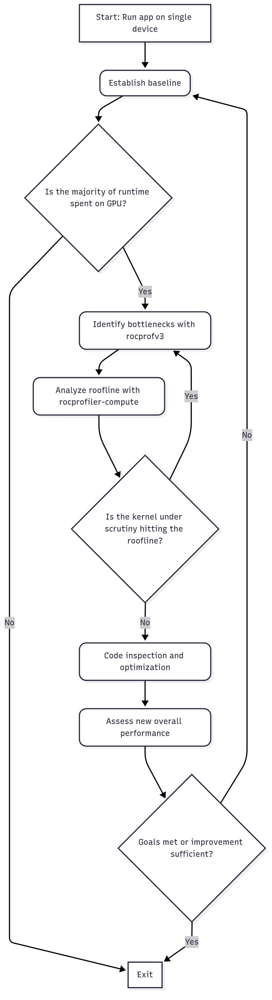
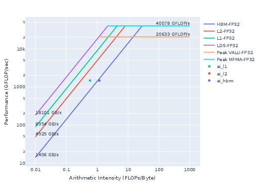
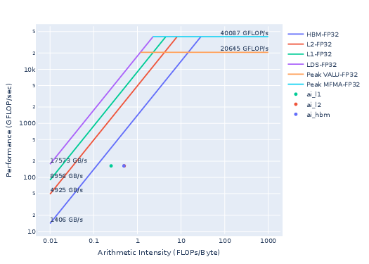
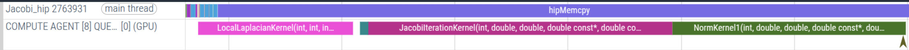
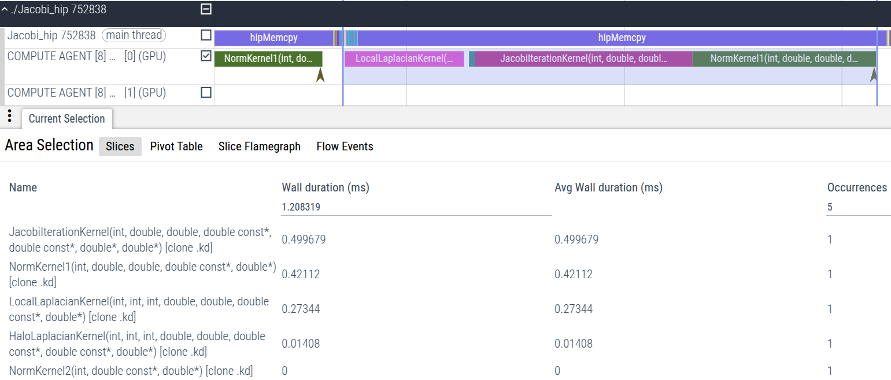
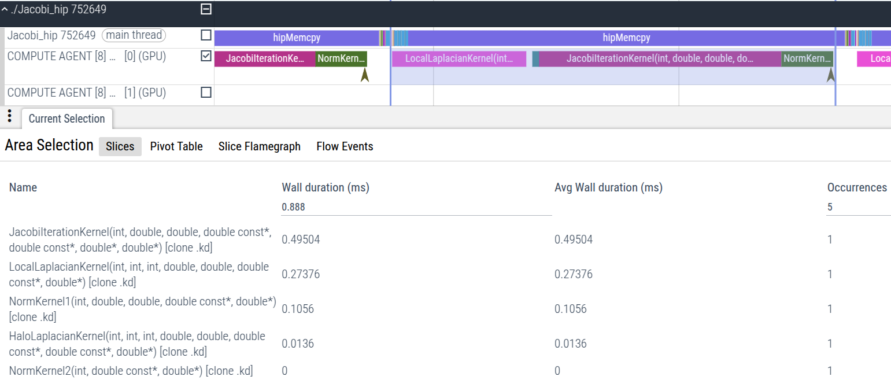

# Performance Profiling on AMD GPUs – Part 2: Basic Usage

This is the second part of the Performance Profiling blog series, a follow on to the
[first part](https://rocm.blogs.amd.com/software-tools-optimization/profiling-guide/intro/README.html).
This blog is designed to help you systematically analyze and improve the performance of your GPU-accelerated application.
If you are new to performance profiling, do not worry, this guide assumes no prior experience with advanced performance assessment techniques.
Instead, it focuses on practical, foundational steps tailored to your current understanding:

1. **What you already know**:
   - Your application leverages a GPU for computation, and you understand the basic purpose of each GPU kernel in your code.
   - You recognize that moving data between the CPU and GPU has a cost, even if terms like "latency-bound" or "memory-bound" are unfamiliar.
   - You have observed that your application performs better on non-AMD hardware, despite comparable specifications. (Optional)

2. **What this guide will teach you**:
   - **Profiling basics**: Learn how to measure where your application spends time on the GPU, including kernel execution and data transfers.
   - **Bottleneck identification**: Discover how to pinpoint basic performance limitations (e.g., poor GPU occupancy, high memory traffic).
   - **Hardware-specific insights**: Begin exploring why performance may differ across GPU architectures, even when specifications seem similar.

By the end of this blog, you will be able to profile your application to identify opportunities for optimization, with a focus on bridging the performance gap observed on AMD hardware.
We will avoid complex methodologies and instead prioritize actionable insights that align with your understanding of the application's structure and goals.

Let's start by demystifying what it means to "profile" a GPU application and how to interpret the data coming from AMD profiling tools.

To help explain the profiling process at novice level, we will rely on the flow chart shown in figure 1.

<p style="text-align:center">



</p>

<p style="text-align:center">
Figure 1: Beginner Profiling Flow Chart.
</p>

<!-- In this blog we will discuss how an application and its kernel can be profiled
quickly using the ROCm profiling tool
[Rocprofv3](https://rocm.docs.amd.com/projects/rocprofiler-sdk/en/amd-mainline/how-to/using-rocprofv3.html#using-rocprofv3).
In addition we will also discuss some HIP run-time environment variables that
can provide useful information about GPU porting of an application. -->

## Profiling basics

<!-- General guideline
Because GPU applications always have a CPU component associated with it, it is important to quantify the fraction of total run-time spent on the GPU and CPU.

Measuring the execution time of individual GPU kernels is often the first step for identifying slow kernels, which represent the main limiters
to performance. 

In this example, the Jacobi iteration kernel takes more than 43% of the GPU run-time. This kernel should be the first candidate for further profiling to understand
the main limiters.

Register pressure analysis.

Roofline

Potential code improvements

Iterate, go to the second kernel. 
-->

<!--
Tracing an application is often the first step in understanding
the overall performance of an application. It provides a visual timeline of execution
where developers can identify where an application spends most of its time. For example,
it may help one determine whether the application is limited by kernel execution time,
data movement between host and device, or other runtime processes.
In this section, we will use Rocprofv3 to trace an application and summarize how to interpret
the traces the tool produces.
-->

A typical guideline for performance analysis and optimization of an application can be presented as follows:

- **Establish baseline performance**: Run the key scenario without any profiler attached to measure the baseline performance. This gives you a reference point to compare against later.
- **Identify bottlenecks**: What fraction of total run-time is spent on the host (CPU) and the device (GPU)? What is the largest bottleneck among the GPU kernels?
- **Analyze roofline**: How much room for improvement is there in the most limiting kernel?
- **Analyze hardware resource usage**: What is the main limiter for the most time consuming kernel?
- **Perform optimization**: What possible optimizations on the code can be done based on the analysis so far.
- **Iterate**: If the optimization step achieves the desired target performance, move on to the next hot-spot kernel. Iterate through the above-mentioned steps until fully satisfied.

We will follow this guideline as we go through a performance analysis and possibly optimizations of a simple HIP ported application discussed below.

### Jacobi example

<!-- *DESCRIBE WHAT KIND OF APP THIS IS. IT IS MULTI GPU, with MPI, etc...* -->

As a working example, we will use the following example code: [HPCTrainingExamples/HIP/jacobi](https://github.com/amd/HPCTrainingExamples/tree/main/HIP/jacobi).
This is a distributed Jacobi solver, using GPUs to perform the computation and MPI for halo exchanges. It uses a 2D domain decomposition scheme to allow for a better computation-to-communication ratio than just 1D domain decomposition.

The Jacobi solver is an MPI application capable of running on both multiple GPUs and nodes; however, this post will not cover profiling techniques for multi-GPU configurations. A follow-up post for a more advanced reader will dive into profiling techniques for multi-process runs.

Typical build and run steps are shown below. We need to make sure `rocm/6.3.0` or greater is loaded to be able
to use the latest rocprofiler tools. Note that although MPI is required to build the application, for simplicity, we will limit our
discussions to a single rank MPI run using a single device, e.g. one MI210 GPU, or one MI250X GCD.

To obtain the source code of the Jacobi example used in this blog, simply clone the following repository:

```bash
git clone https://github.com/amd/HPCTrainingExamples.git
```

and navigate to the `HPCTrainingExamples/HIP/jacobi` subdirectory.

<!-- TODO: Discuss Runtime environment -->

In addition to a ROCm installation (6.3.0 or above),
make sure that an MPI installation is loaded in your environment (OpenMPI or MPICH).
The Jacobi `Makefile` will need to detect an MPI installation to build properly.
To build the example, you only need to invoke `make`:

```bash
cd HPCTrainingExamples/HIP/jacobi
make
```

Before profiling an application, it is critical to first verify that the application
runs successfully. Let us perform a test run of the Jacobi example without MPI.
For example, you can run the Jacobi example via:

```bash
./Jacobi_hip -g 1 1
```

The output of the Jacobi example should look something like:

```bash
Topology size: 1 x 1
Local domain size (current node): 4096 x 4096
Global domain size (all nodes): 4096 x 4096
Rank 0 selecting device 0 on host TheraC12
Starting Jacobi run.
Iteration:   0 - Residual: 0.022108
Iteration: 100 - Residual: 0.000625
Iteration: 200 - Residual: 0.000371
Iteration: 300 - Residual: 0.000274
Iteration: 400 - Residual: 0.000221
Iteration: 500 - Residual: 0.000187
Iteration: 600 - Residual: 0.000163
Iteration: 700 - Residual: 0.000145
Iteration: 800 - Residual: 0.000131
Iteration: 900 - Residual: 0.000120
Iteration: 1000 - Residual: 0.000111
Stopped after 1000 iterations with residue 0.000111
Total Jacobi run time: 1.2987 sec.
Measured lattice updates: 12.92 GLU/s (total), 12.92 GLU/s (per process)
Measured FLOPS: 219.61 GFLOPS (total), 219.61 GFLOPS (per process)
Measured device bandwidth: 1.24 TB/s (total), 1.24 TB/s (per process)
```

In this example, the entire program took a total of 1.2987 seconds to run.
This represents our established baseline performance that we will use as a point to compare after the first round of profiling and optimization phases.

<!-- ### Is the application CPU or GPU bound? -->

### Identify bottlenecks

To get a high level profile of the application and its bottleneck we will use our popular profiling tool
[Rocprofv3](https://rocm.docs.amd.com/projects/rocprofiler-sdk/en/latest/how-to/using-rocprofv3.html#using-rocprofv3).
Running the following `rocprofv3` command will provide a summary of kernel activity on a device for the Jacobi example.

```bash
rocprofv3 --kernel-trace --stats -S -T -d outdir -o jacobi -- ./Jacobi_hip -g 1 1
```

The `--kernel-trace` specifies that we want to trace GPU kernels. That option is followed by `--stats` option to generate a file, such as `outdir/jacobi_kernel_stats.csv` with the summary of all the hotspot kernels of the Jacobi application as shown below.
<!-- Note: The default file output format is: `%hostname%/%pid%_hip_api_trace.csv`. -->

```bash
"Name","Calls","TotalDurationNs","AverageNs","Percentage","MinNs","MaxNs","StdDev"
"JacobiIterationKernel",1000,537449866,537449.866000,43.30,520003,560324,6504.934470
"NormKernel1",1001,411643855,411232.622378,33.16,401922,418563,2651.539233
"LocalLaplacianKernel",1000,273680984,273680.984000,22.05,267362,280642,1690.683884
"HaloLaplacianKernel",1000,14376257,14376.257000,1.16,13600,16320,345.440959
"NormKernel2",1001,4199233,4195.037962,0.3383,3840,5120,173.881645
"__amd_rocclr_fillBufferAligned",1,6560,6560.000000,5.285e-04,6560,6560,0.00000000e+00
```

Moreover, the `-S` option will immediately provide you with a
summary of the GPU kernels and the time spent in each.
Finally, the `-T` option truncates the demangled kernel names for improved readability.

Based on the summary information, `JacobiIterationKernel` is the most significant performance bottleneck, consuming approximately 43% of the application's total kernel execution time.

```bash
    ROCPROFV3 SUMMARY:

    |                   NAME                   |     DOMAIN      |      CALLS      | DURATION (nsec) | AVERAGE (nsec)  | PERCENT (INC) |   MIN (nsec)    |   MAX (nsec)    |     STDDEV      |
    |------------------------------------------|-----------------|-----------------|-----------------|-----------------|---------------|-----------------|-----------------|-----------------|
    | JacobiIterationKernel                    | KERNEL_DISPATCH |            1000 |       537449866 |       5.374e+05 |     43.295359 |          520003 |          560324 |       6.505e+03 |
    | NormKernel1                              | KERNEL_DISPATCH |            1001 |       411643855 |       4.112e+05 |     33.160802 |          401922 |          418563 |       2.652e+03 |
    | LocalLaplacianKernel                     | KERNEL_DISPATCH |            1000 |       273680984 |       2.737e+05 |     22.046924 |          267362 |          280642 |       1.691e+03 |
    | HaloLaplacianKernel                      | KERNEL_DISPATCH |            1000 |        14376257 |       1.438e+04 |      1.158108 |           13600 |           16320 |       3.454e+02 |
    | NormKernel2                              | KERNEL_DISPATCH |            1001 |         4199233 |       4.195e+03 |      0.338278 |            3840 |            5120 |       1.739e+02 |
    | __amd_rocclr_fillBufferAligned           | KERNEL_DISPATCH |               1 |            6560 |       6.560e+03 |      0.000528 |            6560 |            6560 |       0.000e+00 |
```

Using this information, we can deduce that the total GPU time (time spent in kernels) is approximately
1.2575 seconds. This can be calculated by picking a kernel and
using its duration (`DURATION (nsec)`) and the percentage of total GPU runtime for that kernel (`PERCENT (INC)`) to work out the total GPU runtime for the application.
This is approximately 97% of the total application runtime of 1.2987 seconds noted above.
Optimizing GPU kernel performance offers the greatest potential for overall performance gains.

### Analyze roofline

Can the performance of the most time-consuming kernel, `JacobiIterationKernel`, be further improved?
To investigate this, a more detailed analysis of the kernel is required.
We will utilize another AMD profiling tool [rocprof-compute](https://rocm.docs.amd.com/projects/rocprofiler-compute/en/latest/#rocm-compute-profiler-documentation),
specifically designed to collect performance counters for GPU
applications on AMD hardware. We will perform a roofline analysis of
the hot-spot kernel.

#### Roofline analysis of the Jacobi example

A roofline model is a helpful visual aid in assessing the current performance of
a kernel and how far said kernel is from the maximum achievable performance, based on its particular regime.
This regime is formalized by the concept of Arithmetic Intensity (AI for short).
Please refer to the [wikipedia page on roofline model](https://en.wikipedia.org/wiki/Roofline_model) for more details.

To generate a roofline plot using
`rocprof-compute`, simply run the following command:
<!-- May need this for it to work on Thera: pip install -r /opt/rocm-6.3.2/libexec/rocprofiler-compute/requirements.txt -->

```bash
rocprof-compute profile -n jacobi --roof-only --device 0 -k JacobiIterationKernel -- ./Jacobi_hip -g 1 1
```

Here, the argument `-n` sets the name of your workload. Note the `-k` argument here, as this tells
`rocprof-compute`, together with the `--roof-only` option, to _only_ generate a roofline plot for a specific
kernel. Once the above command is completed successfully,
a `workloads` directory will be created locally. Inside this directory will be a directory corresponding to
the name of the workload you specified. The general format for the location of your `rocprof-compute` results
will be `workloads/<name-of-workload>/<device-arch>`, where `device-arch` is either MI200 or MI300, depending on
what AMD Instinct device you are profiling on. In this example, `workloads/jacobi` will be our primary workload directory.
Since we are profiling on an MI200 (MI210, MI250, MI250X) device, the relevant output should be under `workloads/jacobi/MI200`.

> Note: Before using `rocprof-compute`, you may need to install relevant python dependencies. This can be done via: `pip3 install -r <PATH-TO-ROCPROFILER-COMPUTE-INSTALL>/requirements.txt`. For most ROCm installations on shared systems, the path to rocprofiler-compute will be under `/opt/rocm-X.Y.Z/libexec`.

A snapshot of the roofline for the `JacobiIterationKernel` saved in `workloads/jacobi/MI200/empirRoof_gpu-0_fp32_fp64.pdf` is shown below.



<p style="text-align:center">
Figure 2: Roofline model for the Jacobi example (FP32/FP64).
</p>

Kernels falling below the curve to the left of the crossover point are considered memory-bound.
This indicates that the kernel spends most of its execution time transferring data to and from HBM memory, rather than performing computations.
Consequently, memory bandwidth becomes the primary performance bottleneck on a given hardware device.

Kernels to the right of the crossover point are considered compute-bound, indicating they spend the majority of their time processing data retrieved from memory.

Kernels which lie far below the curves are considered latency bound.

Fig. 2 will show a roofline model for all levels of the cache hierarchy
on AMD GPUs (HBM, L2, and L1), corresponding to the achievable
bandwidths (BW) for each memory layer.
The most important to consider at this stage is the HBM curve.

The `JacobiIterationKernel`
is right on the HBM curve, which means that the kernel in its current form cannot
achieve higher performance as it is limited by the achievable HBM BW of the device.

For this reason, we will move onto the second most expensive kernel: `NormKernel1`. The following command generates a roofline model only for said kernel:

```bash
rocprof-compute profile -n jacobi --roof-only --device 0 -k NormKernel1 -- ./Jacobi_hip -g 1 1
```

> [!Note]
> Running `rocprof-compute profile -n <name-of-workload> --roof-only -k <kernel-name>` will generate data under `workloads/<name-of-workload>/`.
> If `workloads/<name-of-workload>/` already exists with saved data from a previous run using the `--roof-only` option, and you're generating a new
> roofline for a different kernel, you will need to either change the name of your workload (using the `-n` argument) or remove the existing workload
> directory.

The result is shown in Fig. 3.

This particular kernel falls into the memory-bound regime, but it does not lie against the roofline.
This suggests the kernel is not fully utilizing available memory bandwidth, indicating potential for optimization.

### Analyze hardware resource usage

Analyzing the kernel's hardware resource usage will be helpful in deciding
where and how to focus our optimization efforts. To be able to get desired hardware
(HW) counter metric information, we can use `--pmc` run-time option
with `rocprofv3`. To get a complete list of HW counters available
for collection, you can run `rocprofv3 -L`. Let us consider analyzing
a derived metric to estimate occupancy of kernels `OccupancyPercent`
as shown below:

```bash
rocprofv3 --pmc OccupancyPercent -T -d outdir -o jacobi -- ./Jacobi_hip -g 1 1
```

This will list the occupancy for each of the kernel calls in
`outdir/jacobi_counter_collection.csv`, as shown below:

```bash
"Correlation_Id","Dispatch_Id","Agent_Id","Queue_Id","Process_Id","Thread_Id","Grid_Size","Kernel_Id","Kernel_Name","Workgroup_Size","LDS_Block_Size","Scratch_Size","VGPR_Count","SGPR_Count","Counter_Name","Counter_Value","Start_Timestamp","End_Timestamp"
1,1,8,1,4121549,4121549,8192,9,"__amd_rocclr_fillBufferAligned",256,0,0,12,32,"OccupancyPercent",1.348889,4655537861300171,4655537861308971
2,2,8,2,4121549,4121549,16384,16,"NormKernel1",128,1024,0,12,32,"OccupancyPercent",7.341689,4655537960190813,4655537960591775
3,3,8,2,4121549,4121549,128,17,"NormKernel2",128,1024,0,12,16,"OccupancyPercent",2.36316718e-02,4655537960669215,4655537960674175
4,4,8,2,4121549,4121549,16777216,18,"LocalLaplacianKernel",256,0,0,28,16,"OccupancyPercent",69.522010,4655537961224578,4655537961507140
5,5,8,2,4121549,4121549,16384,19,"HaloLaplacianKernel",512,0,0,28,32,"OccupancyPercent",3.313420,4655537961571781,4655537961587941
6,6,8,2,4121549,4121549,16777216,20,"JacobiIterationKernel",512,0,0,32,32,"OccupancyPercent",66.086174,4655537961650501,4655537962186505
7,7,8,2,4121549,4121549,16384,16,"NormKernel1",128,1024,0,12,32,"OccupancyPercent",7.346236,4655537962252425,4655537962651628
8,8,8,2,4121549,4121549,128,17,"NormKernel2",128,1024,0,12,16,"OccupancyPercent",2.56140677e-02,4655537962712268,4655537962717708
```

We notice that the occupancy of the biggest hot-spot kernel
`JacobiIterationKernel` and `LocalLaplacianKernel` have high
occupancy (`OccupancyPercent`) values of about 66% and 69%, respectively.
This is expected given the low register pressure of these kernels.
For example, `JacobiIterationKernel` has 32 counts of Vector General
Purpose Registers (VGPR) and Scalar General Purpose Registers (SGPR)
each and without any use of scratch memory (`Scratch_size`). Similarly,
for `LocalLaplacianKernel`, we observe low register pressure with 28
VGPRs and 16 SGPRs.

For more details on why register pressure is important and how it affects performance, please refer to the following [blog post](https://rocm.blogs.amd.com/software-tools-optimization/register-pressure/README.html).

The `NormKernel1` kernel shows low occupancy (around 7.3%) even though the register pressure is low (12 VGPRs and 13 SGPRs).
This strongly suggests our concerns about inefficient memory bandwidth utilization within this kernel are valid.

> [!Note]
> This file also provides other useful information such as the thread-block decomposition (`Grid_size`, and `Workgroup_size`), and shared memory usage (`LDS`). This information can be highly critical for further kernel performance optimization.

### Perform optimization

Let us now inspect the Norm kernel source code. Its occupancy is about 7% with an LDS usage of 1024 bytes with a block size of 128 threads (`128 x 8 bytes-per-double = 1024 B`).
From `outdir/jacobi_opt1_counter_collection.csv`:

```bash
7,7,8,2,4135483,4135483,16384,16,"NormKernel1",128,1024,0,12,32,"OccupancyPercent",7.336403,4665367201827317,4665367202225400
```

This `LDS` use is from line 19 in `Norm.hip` as shown below:

```bash
19   __shared__ dfloat s_dot[block_size];
```

For MI200 GPU, the maximum available LDS size is 64 KB per CU. There is potential of performance optimization if we can assign more work per each thread and exploit more LDS resources.
If we uncomment line 7 in `Norm.hip`, the block size will increase from 128 to 1024 as shown below:

```bash
7 #define OPTIMIZED
8 
9 #ifdef OPTIMIZED
10 #define block_size 1024
11 #else
12 #define block_size 128
13 #endif
```

The dynamic memory usage is expected to be about 8 KB (`8192 = 1024 x 8-bytes-per-double`). Let us profile the HW counter metrics using:

```bash
rocprofv3 --pmc OccupancyPercent -T  -d outdir -o jacobi_opt2 -- ./Jacobi_hip -g 1 1
```

As expected, the `LDS` metric reported now is 8192 B in the file `outdir/jacobi_opt2_counter_collection.csv`:

```bash
7,7,8,2,4135862,4135862,1048576,16,"NormKernel1",1024,8192,0,12,32,"OccupancyPercent",86.788799,4667671552203829,4667671552301430
```

Most importantly, the `OccupancyPercent` now is improved from 7 % to 86 %. A summary `rocprofv3` can be generated using the following command:

```bash
rocprofv3 --kernel-trace --stats -S -T -d outdir -o jacobi_opt2 -- ./Jacobi_hip -g 1 1
```

Note that this metric is an estimate of the achieved occupancy on the CU. It is different from what reported by the [compiler](https://rocm.blogs.amd.com/software-tools-optimization/register-pressure/README.html#how-to-reduce-register-pressure).

The improved occupancy (86% instead of 7%) brought by the larger block size in the kernel `NormKernel1` now helps improve its performance by about **4x** (from 411.6 ms to 102.7 ms of total kernel duration). See table below.
This kernel now takes up about only 11 % of total run-time instead of 43 % as observed before.
The total run-time now is 991.2 ms instead of 1298.7 ms, an overall application performance gain of about **1.3x**.

```bash
    ROCPROFV3 SUMMARY:

    |                   NAME                   |     DOMAIN      |      CALLS      | DURATION (nsec) | AVERAGE (nsec)  | PERCENT (INC) |   MIN (nsec)    |   MAX (nsec)    |     STDDEV      |
    |------------------------------------------|-----------------|-----------------|-----------------|-----------------|---------------|-----------------|-----------------|-----------------|
    | JacobiIterationKernel                    | KERNEL_DISPATCH |            1000 |       533571395 |       5.336e+05 |     57.471876 |          508644 |          562884 |       1.336e+04 |
    | LocalLaplacianKernel                     | KERNEL_DISPATCH |            1000 |       273523349 |       2.735e+05 |     29.461662 |          268162 |          282081 |       1.668e+03 |
    | NormKernel1                              | KERNEL_DISPATCH |            1001 |       102722420 |       1.026e+05 |     11.064405 |           98720 |          104640 |       6.311e+02 |
    | HaloLaplacianKernel                      | KERNEL_DISPATCH |            1000 |        14382502 |       1.438e+04 |      1.549164 |           13120 |           15841 |       3.579e+02 |
    | NormKernel2                              | KERNEL_DISPATCH |            1001 |         4198440 |       4.194e+03 |      0.452221 |            3840 |            5120 |       2.030e+02 |
    | __amd_rocclr_fillBufferAligned           | KERNEL_DISPATCH |               1 |            6240 |       6.240e+03 |      0.000672 |            6240 |            6240 |       0.000e+00 |
```

Let us now compare the rooflines of the baseline (Fig. 3) to the optimized `NormKernel1` (Fig. 4). As observed from the optimized `NormKernel1` roofline figure below, the kernel now saturates the GPU HBM resource since it sits right on top of the HBM roofline.



<p style="text-align:center">
Figure 3: Roofline of baseline Normkernel1.
</p>


<p style="text-align:center">
Figure 4: Roofline of the optimized Normkernel1.
</p>

### Iterate

At this point, we can explore additional performance opportunities of other kernels. For example, we see several redundant computations in both `JacobiIterationKernel` as well as `LocalLaplacianKernel` in computing the reciprocal factors in their respective kernels (e.g., look at `JacobiIterationKernel` in `JacobiIteration.hip` line 23):

```bash
23     U[id] += r_res/(2.0/(dx*dx) + 2.0/(dy*dy));
```

We can further explore whether the reciprocal factors `1/2.0/(dx*dx)` and `1/2.0/(dy*dy)` can be recomputed in the host to improve the kernel performance further. Similar performance improvement can be explored in `LocalLaplacianKernel` as well. This optimization is left for the enthusiast reader as an exercise.

## Visualize runtime trace

For an application developer, sometimes it is very helpful to visually see the host runtime API activity and all device activities on a timeline trace. For example, the following `rocprofv3` command will generate timeline trace in _pftrace_ format.

```bash
rocprofv3 --kernel-trace --hip-trace --output-format pftrace  -d outdir -o jacobi -- ./Jacobi_hip -g 1 1
```

We can now load `outdir/jacobi_results.pftrace` in the browser at the
site https://ui.perfetto.dev/. Note that we have also added `--hip-trace`
to trace HIP API activities in addition to the device kernel activities
on the timeline trace. A snapshot of a trace of one iteration of the Jacobi run is shown in Fig. 5. It is visually clear that the kernels `JacobiIterationKernel` and `NormKernel1` take up the majority of the runtime of a typical iteration.



<p style="text-align:center">
Figure 5: Time trace of one iteration of the Jacobi run.
</p>

We can also isolate an iteration and see the relative time taken by each kernel as shown in Fig. 6. This again shows `JacobiIterationKernel` has the largest timeline on the trace.



<p style="text-align:center">
Figure 6: Time trace summary of an iteration of the Jacobi run.
</p>

We can visualize the impact of the optimization made to the `NormKernel1`
kernel as we have previously discussed by tracing the new binary in
the same way. See Fig. 7 for the same isolated iteration with the
optimized norm kernel.



<p style="text-align:center">
Figure 7: Time trace summary of an iteration of the Jacobi run with the optimized NormKernel1 kernel.
</p>

In the highlighted region of the trace, Perfetto will report all active
kernels in the region, ranking them in terms of runtime (largest runtimes
at the top). In Fig. 6, we can see that the kernel `NormKernel1` is the
second-most expensive kernel in the Jacobi iteration. The impact of
the optimization to `NormKernel1` is immediately apparent in Fig. 7, where
`NormKernel1` is now only the third-most expensive kernel (overtaken by
the `LocalLaplacianKernel` in second place). As noted in our previous
discussion, the next local step to perform targeted optimization is
now in the `LocalLaplacianKernel`.

## Summary

In this blog, we explored how to use AMD profiling tools, previously introduced
in the [first blog](https://rocm.blogs.amd.com/software-tools-optimization/profiling-guide/intro/README.html), such as
`rocprofv3` and `rocprof-compute` to identify performance bottlenecks
of a GPU application, using an example Jacobi program. By going through the
steps outlined in this blog, we were able to obtain detailed information about
the kernels, including their HBM BW, register usage, and occupancy. We
used this information to identify areas of potential optimization and
demonstrated how targeted optimization improved performance. An example of trace visualization
was also provided. [Part 3](https://rocm.blogs.amd.com/software-tools-optimization/profiling-guide/advanced/README.html) 
will go into more advanced aspects of kernel profiling, expanding on the topics discussed here.

## Additional resources

The following are links to the GitHub repos and ROCm docs for the tools described
above for your quick reference.

- Performance Profiling on AMD GPUs:
  - [Part 1](https://rocm.blogs.amd.com/software-tools-optimization/profiling-guide/intro/README.html)
  - [Part 3](https://rocm.blogs.amd.com/software-tools-optimization/profiling-guide/advanced/README.html)
- Perfetto UI:
  - [Online documentation for using Perfetto UI](https://perfetto.dev/docs/visualization/perfetto-ui)
- `rocprofv3`:
  - Open source at [rocprofiler-sdk github repo](https://github.com/ROCm/rocprofiler-sdk)
  - [`rocprofv3` tool documentation](https://rocm.docs.amd.com/projects/rocprofiler-sdk/en/latest/how-to/using-rocprofv3.html#using-rocprofv3)
- `rocprof-compute`:
  - Open source at [rocprofiler-compute github repo](https://github.com/ROCm/rocprofiler-compute)
  - [ROCm Compute Profiler documentation](https://rocm.docs.amd.com/projects/rocprofiler-compute/en/latest/#rocm-compute-profiler-documentation)

## Disclaimers

Third-party content is licensed to you directly by the third party that owns the
content and is not licensed to you by AMD. ALL LINKED THIRD-PARTY CONTENT IS
PROVIDED “AS IS” WITHOUT A WARRANTY OF ANY KIND. USE OF SUCH THIRD-PARTY CONTENT
IS DONE AT YOUR SOLE DISCRETION AND UNDER NO CIRCUMSTANCES WILL AMD BE LIABLE TO
YOU FOR ANY THIRD-PARTY CONTENT. YOU ASSUME ALL RISK AND ARE SOLELY RESPONSIBLE
FOR ANY DAMAGES THAT MAY ARISE FROM YOUR USE OF THIRD-PARTY CONTENT.
