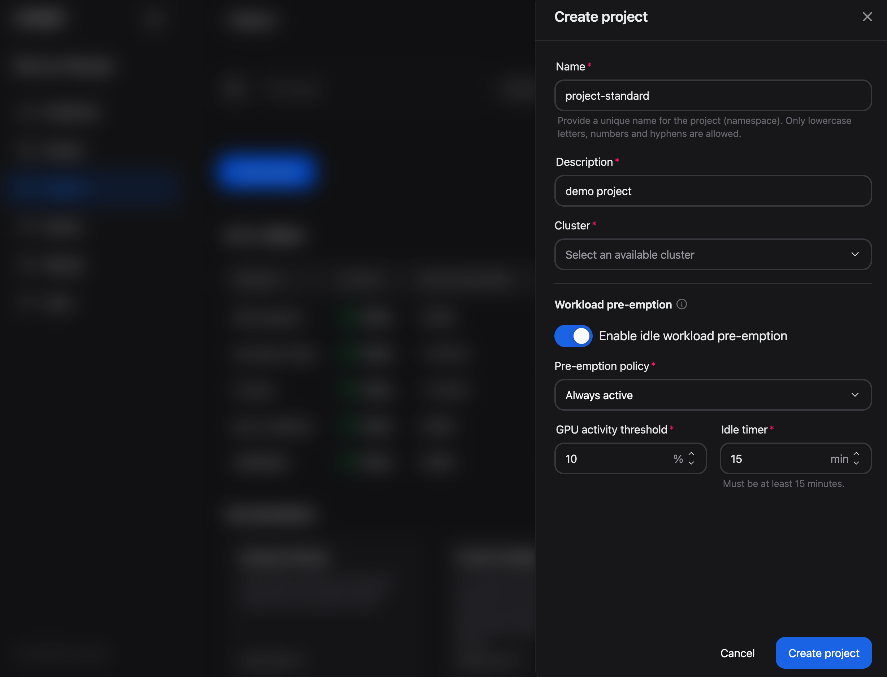
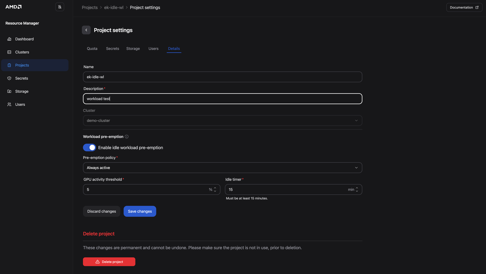
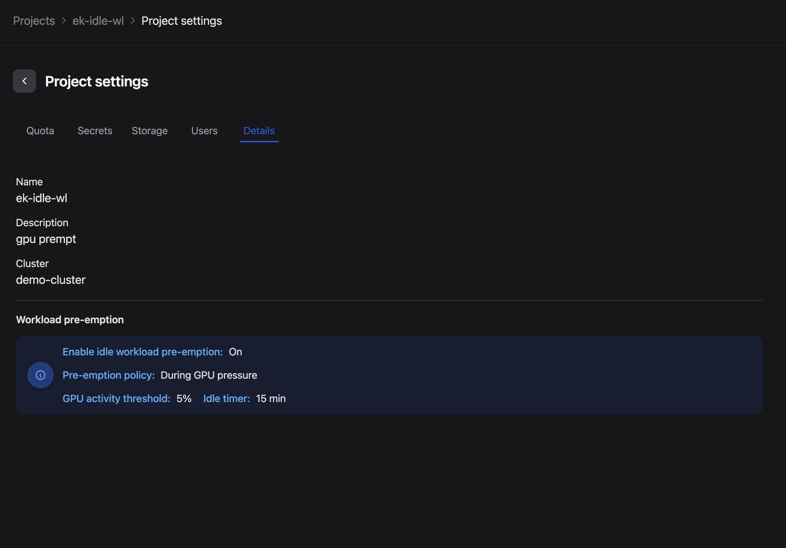
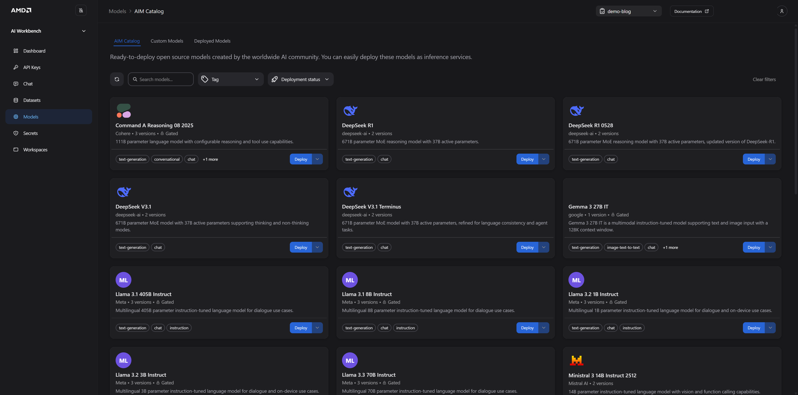

<!---
Copyright (c) 2026 Advanced Micro Devices, Inc. (AMD)

Permission is hereby granted, free of charge, to any person obtaining a copy
of this software and associated documentation files (the "Software"), to deal
in the Software without restriction, including without limitation the rights
to use, copy, modify, merge, publish, distribute, sublicense, and/or sell
copies of the Software, and to permit persons to whom the Software is
furnished to do so, subject to the following conditions:

The above copyright notice and this permission notice shall be included in all
copies or substantial portions of the Software.

THE SOFTWARE IS PROVIDED "AS IS", WITHOUT WARRANTY OF ANY KIND, EXPRESS OR
IMPLIED, INCLUDING BUT NOT LIMITED TO THE WARRANTIES OF MERCHANTABILITY,
FITNESS FOR A PARTICULAR PURPOSE AND NONINFRINGEMENT. IN NO EVENT SHALL THE
AUTHORS OR COPYRIGHT HOLDERS BE LIABLE FOR ANY CLAIM, DAMAGES OR OTHER
LIABILITY, WHETHER IN AN ACTION OF CONTRACT, TORT OR OTHERWISE, ARISING FROM,
OUT OF OR IN CONNECTION WITH THE SOFTWARE OR THE USE OR OTHER DEALINGS IN THE
SOFTWARE.
--->

# Efficient GPU Utilization With Workload Pre-Emption in AMD Resource Manager

GPU capacity is sought after and in high demand. Production inference services, fine-tuning jobs, and developer workspaces like VS Code or JupyterLab all compete for the same resources. The challenge is not just about provisioning enough GPUs, it is keeping them utilized and making sure prioritized work can access capacity when it needs it. Training jobs can drop to near-zero utilization between compute phases; inference services can go quiet between traffic bursts; R&D or experimentation models and development workspaces might be left running unutilized or after hours. This would mean that workloads hold on to GPUs they are no longer using, while other work sits queued.

The [AMD Resource Manager](https://enterprise-ai.docs.amd.com/en/latest/resource-manager/overview.html) is a cluster management application, providing an environment for managing AI development teams' work on AMD compute. It lets platform administrators create projects, set GPU and CPU quotas, and control access for AI teams working on AMD Instinct™ GPUs. AMD Resource Manager includes  **workload pre-emption**, a project-level feature that addresses utilization of prioritized work directly. When enabled it monitors GPU utilization across every workload in a project, and when activity drops below a configured threshold for long enough, it terminates the idle workload and returns its GPUs to the pool, no changes needed from the teams running workloads.

By the end of this blog, you will understand how workload pre-emption works, how to enable and configure it for your projects, and how to choose the right policy for your workload types.

## Prerequisites

This guide uses AMD AI Workbench v1.1.9 and AMD Resource Manager v1.1.9. It was validated on a cluster powered by AMD Instinct™ MI300X GPUs with more than 1 TB of storage. Before you begin, ensure the following prerequisites are met:

* Access to the following installed components:
  * AMD Resource Manager (**Platform administrator** role, only administrators can configure pre-emption settings)
  * AMD AI Workbench
* Access to at least one project with GPU workloads. For setup assistance, see [Manage Projects](https://enterprise-ai.docs.amd.com/en/latest/resource-manager/projects/manage-projects.html)

## What Is Workload Pre-emption?

Workload pre-emption monitors the GPU utilization of every workload per project, where the pre-emption functionality is enabled. The AMD GPU operator continuously monitors per-GPU utilization metrics:

* **Threshold:** the percentage of GPU compute capacity the workload is actively using
* **Idle timer:** the duration during which the GPU compute capacity metric is calculated

When a workload's activity drops below the administrator configured threshold and stays there for the configured idle timer duration AMD Resource Manager terminates that workload to make the GPUs available for other workloads. A threshold of 10%, for example, means a workload is considered idle if it is using less than 10% of the GPU compute it has been allocated.

### How Idle GPU Reclamation Fits Alongside Quotas and Priority

The AMD Resource Manager provides three different quota and priority features, which are used to handle priority, quotas and pre-emption and are targeting either project level (applies to all workloads in a project) or workload level (applies to the specific workload). The three features differ in the following way:

**Workload and project level settings:**

[**Idle workload pre-emption**](https://enterprise-ai.docs.amd.com/en/latest/resource-manager/projects/gpu-preemption.html) (this article) applies to **every** GPU workload in the specific project. AMD Resource Manager watches each workload's GPU activity, and if it stays below the configured threshold for the full idle timer, the workload is **terminated**.

**Project level settings:**

**[Quota-based pre-emption](https://enterprise-ai.docs.amd.com/en/latest/resource-manager/projects/project-settings.html#project-quotas)** when a project has utilized resources beyond its allocated quota and an in-quota project needs capacity back, the over utilized workloads will be queued so the in-quota project can reclaim them.

**Workload level settings:**

**[Priority classes](https://enterprise-ai.docs.amd.com/en/latest/resource-manager/workloads/priority-classes.html)** are set for a specific workload by the user. When the cluster is fully subscribed and a higher-priority workload needs GPUs, lower-priority running workloads are **suspended** so the prioritized workloads can run.

### AMD Resource Manager Workload Pre-emption Configuration Options at a Glance

Whether pre-emption triggers depends on the selected **pre-emption policy**, there are two different policies for the administrators to choose between:

| Setting | Description |
|---------|-------------|
| **Enable idle workload pre-emption** | Master toggle. When off, all other settings are ignored. |
| **Pre-emption policy** | **During GPU pressure:** (Default option) AMD Resource Manager only terminates the workload when another workload in the cluster is specifically waiting for GPU resources. If there are no workloads that needs the GPUs (in the queue), the workload keeps running, despite being below threshold. <br>**Always:** AMD Resource Manager terminates the workload as soon as it has been idle for the full timer duration, regardless of cluster demand. This is useful for strict resource reclamation policies where idle GPUs should always be returned to the pool. |
| **GPU activity threshold** | The percentage of GPU compute capacity a workload must stay below to be considered idle. A threshold of 10% means a workload is flagged as idle when it is using less than 10% of the GPU compute it has been allocated, not 10% of the whole GPU card. |
| **Idle timer** | Number of minutes the workload must remain below the threshold before it gets terminated. Gives jobs time to checkpoint or finish a burst. |

```{note}
GPU activity threshold and idle timer settings are required when pre-emption is enabled.
```

## Setting Up Your Project and Configuring Pre-emption

Platform administrators can enable pre-emption when creating a new project. This is the most straightforward path when the project's GPU workloads should be monitored for idleness from the start. Through the steps below, you create a new project with pre-emption settings for reclaiming idle workloads using the following settings: **Always** policy, **10%** GPU activity threshold, and a **15** minute idle timer.



*Figure 1: The Workload pre-emption section in the Create project panel.*

1. Navigate to the **Projects** page and click **Create project**
2. Fill in the project **Name** (e.g., blog-demo), **Description**, and select the **Cluster**
3. In the **Workload pre-emption** section, toggle **Enable idle workload pre-emption** to enabled
4. Select a **Pre-emption policy**
    * **During GPU pressure** (default)
    * **Always**
5. Set **GPU activity threshold** to **10%**, low enough to ignore brief typing and thinking, high enough to catch truly idle kernels
6. Set **Idle timer** to **15 minutes**, a grace period that keeps a GPU from idling for more than 15 minutes
7. Click **Create project**
8. Navigate to the **Users** tab and add your users to the project (add at least yourself to be able to follow this blog) by click on **Add member** and selecting users
9. Click on **Projects** to get back to the Project page and confirm that your project is visible in the list of projects

The project is now created with pre-emption activated. Any GPU workload deployed into this project will be monitored from the start.

## Configuring Pre-emption for an Existing Project

Pre-emption can be enabled or adjusted at any time for a project that's already running. Figure 2 below shows the **Workload pre-emption** section on the Details tab of Project settings, where you toggle the feature and update policy, threshold, and idle timer.



*Figure 2: The Workload pre-emption section on the Details tab of Project settings.*

1. Navigate to the **Projects** page
2. **Select** the project by clicking it, the **Project page** opens and you find the **Actions** drop-down button appearing in the top right corner
3. Open the **Actions** drop-down and choose **Edit settings**
4. Select the **Details** tab
5. In the **Workload pre-emption** section, toggle the feature on (or adjust existing settings)
6. Click **Save changes**

Changes take effect immediately. AMD Resource Manager starts monitoring GPU utilization against the new threshold and timer values.

To match the idle-workspace values used when [setting up your project and configuring pre-emption](#setting-up-your-project-and-configuring-pre-emption), set **Pre-emption policy** to **Always**, **GPU activity threshold** to **10%**, and **Idle timer** to **15 minutes** before you save.

## What Team Members See

Team members assigned to a project can view the pre-emption policy (by following the same steps (1-4) as above) but cannot change it. This keeps the configuration under administrator control while giving teams visibility into how their workloads may be affected. As you can see in Figure 3 below, the same settings appear on the Details tab in read-only mode for team members.



*Figure 3: The read-only Workload pre-emption view visible to team members.*

## Reclaim an Idle R&D or Experimentation AIM in Action

An example use case for idle pre-emption is an unused R&D or experimentation AMD Inference Microservice (AIM); a team member deploys an AIM to be used for R&D or experimentation from the Model catalog in AMD AI Workbench, gets pulled into a meeting or occupied with another task, leaving an idle workload holding on to GPU resources. Below we set up pre-emption for and verify it end-to-end in the UI.

### 1. Deploy an AIM From AMD AI Workbench

Figure 4 below shows the AMD AI Workbench **Models** page, where you select an AIM from the AIM catalog and deploy it with a few clicks.



*Figure 4: The AMD AI Workbench Models page. Displaying AIMs available for deployment with two clicks.*

1. Switch to **AMD AI Workbench** in your browser and login
2. Navigate to the **Models** page
2. Verify that the AMD AI Workbench is set to the project where you enabled idle pre-emption (your current project is visible in the top banner next to "Documentation")
3. Select a model, if you don't have a Hugging Face token stored under **Secrets** pick one of the non-gated models e.g., GPT OSS 20B, and click **Deploy**
4. Leave the settings as per default and click **Deploy**
5. Wait for the model to go from pending into running state, this can be observed in the **Dashboard** page
6. Once deployed (running), navigate to the **Chat** page
7. Select the newly deployed model in the top right corner, send a chat to it and wait for the answer. E.g., "What is the capital of Finland?"

### 2. Let the Deployed Model Go Idle

The model should now be active and its allocation genuinely exercised from the previous step. We'll now stop and leave the model unused - the same thing a team member or developer does when they step away. AMD Resource Manager now starts the idle clock against the 10% threshold.

### 3. Observe Reclamation

1. Wait out the **Idle timer** (15min), plus a short settle period for the GPU metrics to catch up
2. Return to **AMD AI Workbench → Dashboard** page, the previously deployed and running model should no longer be running
3. Open the **Projects** page in AMD Resource Manager, select the project, and review its workloads to confirm that the AIM was pre-empted and its GPU has returned to the pool

The team member can redeploy the model from AMD AI Workbench whenever its needed again.

The same pattern applies to all the AIMs, models and all the development workspaces JupyterLab, Visual Studio Code, ComfyUI, and MLflow. Enabling idle pre-emption once, at project level, is enough to reclaim idle GPUs across all of them without any change to how the teams work.

## Summary

In this blog, you explored how **idle workload pre-emption** in AMD Resource Manager helps you reclaim GPUs that workloads are no longer using.

You learned how the feature monitors per-workload GPU activity against an administrator-defined **threshold** and **idle timer**, and how it fits alongside **quota-based pre-emption** and **priority classes** when you need to balance utilization, fairness, and urgent work.

You compared the two **pre-emption policies**, **During GPU pressure** and **Always**, walked through enabling pre-emption on a **new project** (with an **Always** policy, **10%** threshold, and **15**-minute idle timer), updating settings on an **existing project**, and what **team members** see in read-only form and tested it in AMD AI Workbench.

You can put this into practice today: enable idle pre-emption on the projects where idle GPUs are most costly, tune policy and timer values to match how your teams work, and let AMD Resource Manager handle reclamation without asking practitioners to change how they deploy or use AMD AI Workbench.

## Additional Resources

If you are new to AMD Resource Manager, start with [Getting Started with AMD Resource Manager](https://rocm.blogs.amd.com/software-tools-optimization/amd-resource-manager/README.html) for projects, quotas, and dashboards; pair it with [Getting Started with AMD AI Workbench](https://rocm.blogs.amd.com/software-tools-optimization/enterprise-ai-workbench/README.html) for deploying AIMs and workspaces.

If you want to learn more about AMD AI Workbench or AMD Solution Blueprints, see our other blogs:

* [Adapting AIM LLMs For Specific Use Cases Through Fine-Tuning in AMD AI Workbench](https://rocm.blogs.amd.com/software-tools-optimization/aiwb-fine-tuning/README.html)
* [Leveraging AMD AI Workbench and Autoscaling to Scale LLM Inference for Optimal Resource Utilization](https://rocm.blogs.amd.com/software-tools-optimization/eaisuite-autoscaling/README.html)
* [Deploy and Customize AMD Solution Blueprints](https://rocm.blogs.amd.com/artificial-intelligence/custom-blueprint/README.html)

For full documentation, see:

* [Documentation Overview](https://enterprise-ai.docs.amd.com/en/latest/index.html).
* [GPU Pre-emption](https://enterprise-ai.docs.amd.com/en/latest/resource-manager/projects/gpu-preemption.html): complete configuration reference
* [Project Settings](https://enterprise-ai.docs.amd.com/en/latest/resource-manager/projects/project-settings.html): quota-based pre-emption and other project settings
* [Workload Priority Classes](https://enterprise-ai.docs.amd.com/en/latest/resource-manager/workloads/priority-classes.html): priority class pre-emption

## Disclaimers

Third-party content is licensed to you directly by the third party that owns the
content and is not licensed to you by AMD. ALL LINKED THIRD-PARTY CONTENT IS
PROVIDED “AS IS” WITHOUT A WARRANTY OF ANY KIND. USE OF SUCH THIRD-PARTY CONTENT
IS DONE AT YOUR SOLE DISCRETION AND UNDER NO CIRCUMSTANCES WILL AMD BE LIABLE TO
YOU FOR ANY THIRD-PARTY CONTENT. YOU ASSUME ALL RISK AND ARE SOLELY RESPONSIBLE
FOR ANY DAMAGES THAT MAY ARISE FROM YOUR USE OF THIRD-PARTY CONTENT.
