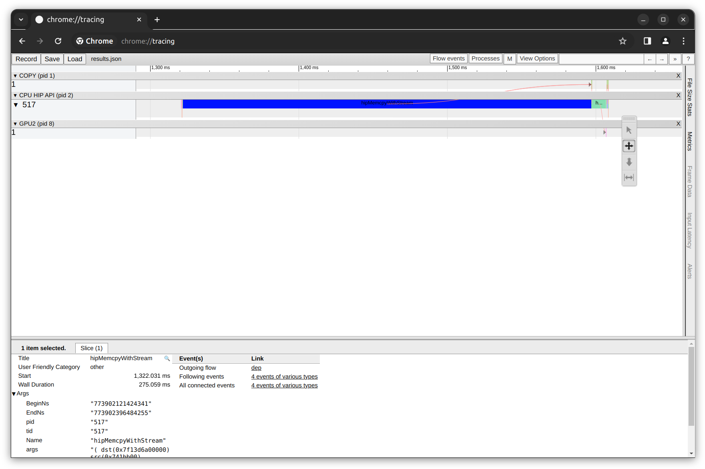
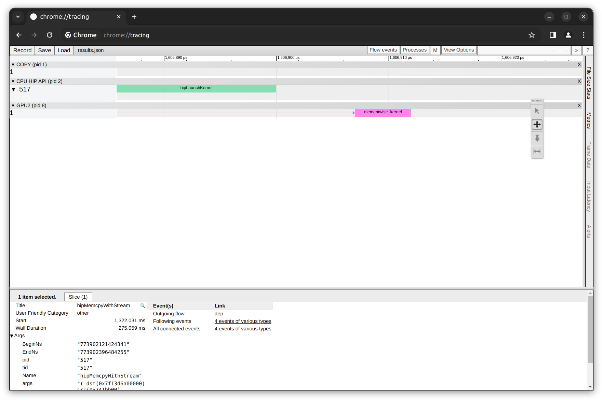
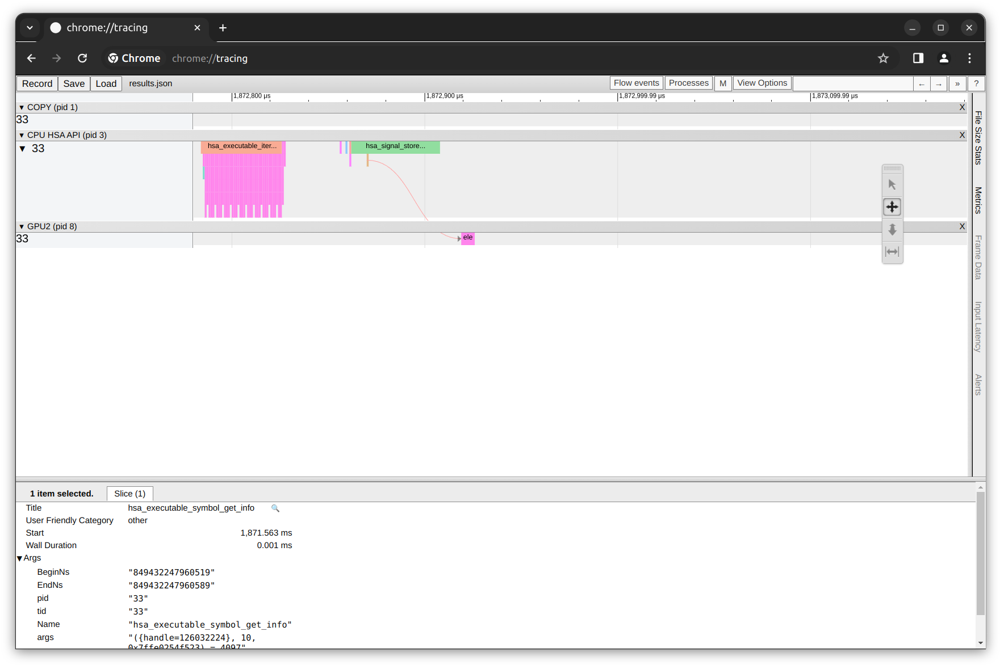
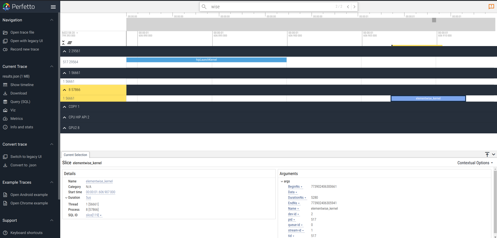

<head>
  <meta charset="UTF-8">
  <meta name="description" content="AMD in Action: Unveiling the Power of Application Tracing and Profiling">
  <meta name="keywords" content="Profiling, Tracing, HPC, HIP, HSA, AMD, GPU, MI300, MI250, MI210">
</head>

# AMD in Action: Unveiling the Power of Application Tracing and Profiling

## Introduction

Rocprof is a robust tool designed to analyze and optimize the performance of HIP programs on AMD ROCm platforms, helping developers pinpoint and resolve performance bottlenecks. Rocprof provides a variety of profiling data, including performance counters, hardware traces, and runtime API/activity traces.

Rocprof is a command line interface (CLI) profiler that can be used on the applications running on ROCm-supported GPUs, without the requirement of any code modification in the application. Rocprof CLI allows users to trace the entire execution of GPU-enabled applications enabled by APIs provided by ROCm, such as HIP or HSA.

Rocprof is part of the ROCm software stack. It comes by default with the base ROCm installation package. There are two versions of Rocprof: ROCProfilerV1 and ROCProfilerV2 (beta version subject to change). In this blog we consider ROCProfilerV1 as it is the first and current version of profiling tool for HIP applications.

For more information about Rocprof and its versions you can visit the following links:

* [ROCProfiler (Rocprof) documentation](https://rocm.docs.amd.com/projects/rocprofiler/en/latest/profiler_home_page.html)
* [Rocprof: Official AMD GitHub repo](https://github.com/ROCm/rocprofiler)

You can find files related to this blog post in the
[GitHub folder](https://github.com/ROCm/rocm-blogs/tree/release/blogs/software-tools-optimization/roc-profiling).

### Operating System, Hardware and Software requirements

* AMD GPU: List of supported OS and hardware on the [ROCm documentation page](https://rocm.docs.amd.com/projects/install-on-linux/en/latest/reference/system-requirements.html).

* ROCm 6.0: This blog was created under ROCm 6.0. Refer to [ROCm installation instructions](https://rocm.docs.amd.com/projects/install-on-linux/en/latest/index.html).

* Docker: [Docker engine for Ubuntu](https://docs.docker.com/engine/install/ubuntu/#install-using-the-repository)

## Preliminaries

Let's clone the repository of this blog into our local system:

```bash
git clone https://github.com/ROCm/rocm-blogs.git
```

and move to the following location:

```bash
cd ./rocm-blogs/blogs/software-tools-optimization/roc-profiling
```

We will also be using the official AMD Docker image: [rocm6.0.2_ubuntu22.04_py3.10_pytorch_2.1.2](https://hub.docker.com/r/rocm/pytorch/tags) to perform the profiling task inside the container. Inside the same directory where the repository was cloned, start the container by executing in the terminal:

```bash
docker run -it --rm --name=my_rocprof --cap-add=SYS_PTRACE --cap-add=CAP_SYS_ADMIN --security-opt seccomp=unconfined --device=/dev/kfd --device=/dev/dri --group-add video --ipc=host --shm-size 8G -v $(pwd):/workdir -w /workdir rocm/pytorch:latest
```

Below are the definitions for some of the settings applied to launch the container:

* `-it`: This combination of `-i` and `-t` allows to interact with the container through the terminal.

* `--cap-add=SYS_PTRACE` and `--cap-add=CAP_SYS_ADMIN`: Grants the container capabilities to trace system calls and system monitoring respectively.

* `--device=/dev/kfd --device=/dev/dri`: These options give access to specific devices on the host. `--device=/dev/kfd` is associated with AMD GPU devices and `--device=/dev/dri` is related to devices with direct access to the graphics hardware.

* `--group-add video`: This options allows the container to have necessary permissions to access video hardware directly.

* `-v $(pwd):/workdir -w /workdir`: This mounts the volume from the host to the container. It maps the current directory `$(pwd)` on the host to `/workdir` inside the container and set it (`-w /workdir`) as a working directory. The output results of Rocprof will persist locally for later use and exploration.

* `rocm/pytorch`: This is the name of the image.

In addition, we will make use of the following PyTorch script that performs the addition of two 1-D tensors on AMD GPU. Our plan is to perform profiling on the addition operation by collecting HIP, HSA and System Traces to illustrate how application tracing and profiling is being done on AMD hardware. The following script `vector_addition.py` exist in the `src` folder inside the cloned repository.

```python
import torch

def vector_addition():
    A = torch.tensor([1,2,3], device='cuda:0')
    B = torch.tensor([1,2,3], device='cuda:0')

    C = torch.add(A,B)

    return C

if __name__=="__main__":
   print(vector_addition())
```

## Application Tracing with Rocprof

Let's start with application tracing using Rocprof. The output of tracing is typically a chronological record (trace) of events that ocurred during the application execution. Application tracing provides the big picture of a program’s execution by collecting data on the execution times of API calls and GPU commands, such as kernel execution and async memory copy. This information can be used as the first step in the profiling process to answer questions, such as how much percentage of time was spent on memory copy and which kernel took the longest time to execute.

Let's explore the 3 different types of tracing that can be done using Rocprof: HIP Tracing, HSA Tracing and System Tracing.

### HIP Trace

HIP (Heterogeneous-Compute Interface for Portability) is a programming model developed by AMD for creating portable applications across AMD and NVIDIA GPUs using a C++ API and Kernel Language.

A HIP Trace refers to a Rocprof application option designated to trace and analyze the performance of HIP applications on GPUs. It allows to collect detailed information about how HIP applications interact with the GPU, including API calls, memory transactions, and kernel executions. HIP Tracing is crucial for optimizing the performance of HIP applications, identifying bottlenecks, and improving the overall efficiency of GPU utilization.

#### Example: Collecting HIP Traces when adding two pytorch tensors on GPU

##### Collect HIP Traces

Let's collect HIP traces with Rocprof using the script defined before. Inside the running docker container let's create a new directory that will contain the tracing output:

```bash
mkdir HIP_trace && cd ./HIP_trace
```

then run Rocprof with:

```bash
rocprof --tool-version 1 --basenames on --hip-trace python ../src/vector_addition.py
```

the terminal's output will be similar to:

```bash
RPL: on '240228_201148' from '/opt/rocm-6.0.0' in '/workdir/HIP_trace'
RPL: profiling '"python" "../vector_addition.py"'
RPL: input file ''
RPL: output dir '/tmp/rpl_data_240228_201148_496'
RPL: result dir '/tmp/rpl_data_240228_201148_496/input_results_240228_201148'
ROCtracer (517):
    HIP-trace(*)
tensor([2, 4, 6], device='cuda:0')
...
```

On completion, you will find several files inside the `HIP_trace` folder such as:

```bash
-rw-r--r-- 1 root root    161 Feb 28 20:11 results.copy_stats.csv
-rw-r--r-- 1 root root  69632 Feb 28 20:11 results.db
-rw-r--r-- 1 root root    848 Feb 28 20:11 results.hip_stats.csv
-rw-r--r-- 1 root root 107598 Feb 28 20:11 results.json
-rw-r--r-- 1 root root     97 Feb 28 20:11 results.stats.csv
-rw-r--r-- 1 root root  53543 Feb 28 20:11 results.sysinfo.txt
```

Before proceeding to analyze the output files, let's quickly describe the options when executing the `rocprof` command:

* `--tool-version 1`: Explicitly setting for rocprofv1 (rocprofv1 by default).
* `--basenames on`: setting on to truncate the kernel full function names.
* `--hip-trace`: to trace HIP, generates API execution stats and JSON file
* `python ../scr/vector_addition.py`: this is the application that we want to profile

Let's get back to analyze `rocprof` output and in particular the `results.json` file.

##### Visualize HIP Traces

It is possible to visualize the HIP traces in the `results.json` file that was just created. Alternatively, you can also explore the tracing examples available in the `tracing_output_examples` directory inside the cloned repository.

Let's open our local web [Chrome browser](https://www.google.com/chrome/) and go to [chrome://tracing/](chrome://tracing/). This will open the build-in tool in the Chrome browser designed for recording and analyze performance data. Let's load the `results.json` file (located inside the cloned repository directory `$(pwd)/HIP_trace`):



In the figure above, see the time axis on the top, below the time axis, see the Gantt chart-style boxes that show the duration of each task. There are three rows of tasks divided by the black rows mentioning their categories:

* The first row titled `COPY` shows the tasks completed by the copy engine.
* The second row is the `CPU HIP API`, which lists the execution time of each API trace.
* The third row shows the `GPU` tasks.

By zooming in and focusing on the GPU tasks (using the `W` `S` `A` `D` keyboard keys), we can observe the `elementwise_kernel` execution duration. Remember that our python script takes two pytorch tensors and perform an element-wise addition operation on GPU.



##### HIP Traces database and basic statistics

Chrome Tracing allows us to visualize the traces contained inside the `results.json` file. The contents of other output files are:

* `results.hip_stats.csv`: contains basic statistics (`TotalDurationNs`, `AverageNs`, `Percentage`) of the time used by each of the HIP API calls made.
* `results.stats.csv`: contains basic statistics (`TotalDurationNs`, `AverageNs`, `Percentage`) of the time used by each of kernel function calls. In our case, we only have a single call to the `elementwise_kernel`.
* `results.copy_stats.csv`: contains basic statistics (`TotalDurationNs`, `AverageNs`, `Percentage`) of the time used by `CopyDeviceToHost` and `CopyHostToDevice` tasks.
* `results.sysinfo.txt`: contains the rocm system information as reported by the tool `rocminfo`
* `results.db`: contains the same results as `results.json` but in a database file format.

For example, the following statistics are present in the `results.hip_stats.csv` file:

| Name | Calls | TotalDurationNs | AverageNs | Percentage |
|------|-------|-----------------|-----------|------------|
|hipMemcpyWithStream|6|276004952|46000825|96.61022910354737
|hipLaunchKernel|1|9406206|9406206|3.2924616390765404
|hipMalloc|1|143338|143338|0.05017271218830984
|hipModuleLoad|24|82438|3434|0.02885583758235699
|hipGetDevicePropertiesR0600|8|16118|2014|0.005641796139552512
|hipGetDevice|48|9109|189|0.0031884303905685466
|hipDevicePrimaryCtxGetState|24|6140|255|0.002149188999680632
|hipStreamIsCapturing|1|5950|5950|0.002082683151156313
|hipDeviceGetStreamPriorityRange|1|5880|5880|0.0020581809964368264
|hipSetDevice|12|3849|320|0.0013472684787900248
|hipGetDeviceCount|5|2720|544|0.0009520837262428858
|__hipPushCallConfiguration|1|1230|1230|0.00043053786149954026
|hipGetLastError|2|710|355|0.0002485218550119298
|__hipPopCallConfiguration|1|520|520|0.0001820160064876105

where we can observe that the majority of the consumed time happens during memory copy operations.

Even though this was a small example where two vectors were added on GPU, on more complex routines memory, copy operations can be optimized by doing most of the work on the GPU in order to avoid moving data back and forth (CPU-GPU) multiple times. Other option would be to have the data ready within the GPU before any calculation, in this way you don't have to wait for the data to be moved when it is time to use it.

Finally, since we have access to all the trace data on the `results.db` database, we can compute the statistics in `results.hip_stats.csv` and other statistics with SQL depending on the type of analysis we are trying to do.

### HSA Trace

HSA (Heterogeneous System Architecture) is a set of specifications and designs for processors that integrate CPU and GPU (and other processors) into a single unified architecture. It facilitates direct access to the compute capabilities of both CPUs and GPUs with shared virtual memory

HSA Tracing involves the collection of runtime information for applications leveraging the HSA architecture. This can include details on the execution of HSA kernels, data transfers between CPU and GPU, and interactions with the HSA runtime. HSA trace contains the start/end time of HSA runtime API calls and their asynchronous activities.

#### Example: Collecting HSA Traces when adding two pytorch tensors on GPU

##### Collect HSA Traces

In line with the previous discussion, let's now collect HSA traces with Rocprof using the same script defined before. Once again, inside the running docker container let's return to the original directory:

```bash
cd ..
```

and create a new directory that will contain the tracing output:

```bash
mkdir HSA_trace && cd ./HSA_trace
```

then run Rocprof in HSA Tracing mode:

```bash
rocprof --tool-version 1 --basenames on --hsa-trace python ../src/vector_addition.py
```

the terminal's output will be similar to:

```bash
RPL: on '240229_171038' from '/opt/rocm-6.0.0' in '/workdir/HSA_trace'
RPL: profiling '"python" "../vector_addition.py"'
RPL: input file ''
RPL: output dir '/tmp/rpl_data_240229_171038_12'
RPL: result dir '/tmp/rpl_data_240229_171038_12/input_results_240229_171038'
ROCtracer (33):
ROCProfiler: input from "/tmp/rpl_data_240229_171038_12/input.xml"
  0 metrics
    HSA-trace(*)
    HSA-activity-trace()
tensor([2, 4, 6], device='cuda:0')
...
```

This will give you the corresponding outputs for HSA Traces:

```bash
-rw-r--r-- 1 root root       90 Feb 29 17:10 results.copy_stats.csv
-rw-r--r-- 1 root root      354 Feb 29 17:10 results.csv
-rw-r--r-- 1 root root  5423104 Feb 29 17:10 results.db
-rw-r--r-- 1 root root     2258 Feb 29 17:10 results.hsa_stats.csv
-rw-r--r-- 1 root root 14611378 Feb 29 17:10 results.json
-rw-r--r-- 1 root root       97 Feb 29 17:10 results.stats.csv
-rw-r--r-- 1 root root    53543 Feb 29 17:10 results.sysinfo.txt
```

Let's quickly explore the corresponding HSA-Trace `results.json` file using Chrome tracing:



In figure above, you can see the HSA trace row. For this particular case, it consist of a single thread with the thread ID of 33 where each colored segment presents the duration of each kernel execution within the thread. We also observe that there are more HSA API calls as compared to HIP API calls because HSA gives more direct access to the underlying hardware features of the CPU, GPU and other processors.

Finally, you can now follow the same steps for exploring and analyzing HIP Traces but now for the case of the remaining HSA Traces output files.

### System Trace

What if we want to generate and collect both HIP Traces and HSA Traces together? Rocprof tool can also generate both the HIP and HSA traces simultaneously with the sys-trace option at the expense of having a longer collecting trace time.

In general, you can follow the same steps above with HIP and HSA Traces to do the tracing analysis. The corresponding command to generate System Traces is:

```bash
cd ..
mkdir SYS_trace && cd ./SYS_trace
```

```bash
rocprof --tool-version 1 --basenames on --sys-trace python ../src/vector_addition.py
```

### Alternatives for trace visualization

An alternative to `chrome://tracing/` for trace visualization and analysis is [Perfetto](https://ui.perfetto.dev/). Perfetto is an open-source tool designed for performance tracing and analysis. It allows users to visualize and explore trace and performance data. Perfetto provides services and libraries for recording and analyzing traces at both the system and app levels. It also supports the visualization of performance data from diverse system interfaces, including kernel events, process-wide, and system-wide CPU and memory counters.

For example, visualizing the HIP traces in the `results.json` file using Perfetto would look like the following:



For more information about Perfetto, you can take a look at the [official documentation](https://perfetto.dev/docs/).

## Application Profiling with Rocprof

Application profiling is aimed at measuring and analyzing performance metrics to identify bottlenecks and opportunities for optimization in a given set of GPU kernels. This contrast with application tracing where the purpose is understanding the application execution flow and timing of operations and kernel executions.

### Performance Counter Collection

As discussed in the sections above, the application trace mode is limited to providing an overview of program execution and does not provide an insight into kernel execution. To address performance issues, the counter and metric collection functionality of Rocprof can be used to report hardware component performance metrics during kernel execution.

Check the list of AMD GPUs that [support counter and metric collection](https://rocmdocs.amd.com/projects/rocprofiler/en/latest/rocprofv1.html#performance-counter-collection).

#### Performance Counters and Derived Metrics

AMD GPUs are equipped with hardware performance counters that can be used to measure specific values during kernel execution. These performance counters vary according to the GPU. It is recommended to examine the list of hardware basic counters and derived metrics that can be collected on your GPU before running the profile.

To obtain the list of supported basic counters we can use:

```bash
rocprof --list-basic
```

Some of the basic counters for the `AMD Instinct MI210 GPU` are:

* **GRBM_COUNT** : Graphic Register Bus Manager counter, measures the number of free-running GPU cycles.

* **SQ_WAIT_INST_LDS** : Number of wave-cycles spent waiting for LDS instruction issue. In units of 4 cycles. (per-simd, nondeterministic)

* **GRBM_CP_BUSY** : Any of the Command Processor (CPG/CPC/CPF) blocks are busy.

Similarly, the derived metrics are calculated from the basic counters using mathematical expressions. To list the supported derived metrics along with their mathematical expressions, use:

```bash
rocprof --list-derived
```

some of the derived metrics for `AMD Instinct MI210 GPU` are:

* **MemUnitStalled** : The percentage of GPUTime the memory unit is stalled. Value range: 0% (optimal) to 100% (bad).

  MemUnitStalled = 100*max(TCP_TCP_TA_DATA_STALL_CYCLES,16)/GRBM_GUI_ACTIVE/SE_NUM

* **MeanOccupancyPerActiveCU** : Mean occupancy per active compute unit.

    MeanOccupancyPerActiveCU = SQ_LEVEL_WAVES\*0+SQ_ACCUM_PREV_HIRES*4/SQ_BUSY_CYCLES/CU_NUM

* **TA_TA_BUSY_sum** : TA block is busy. Perf_Windowing not supported for this counter. Sum over TA instances.

    TA_TA_BUSY_sum = sum(TA_TA_BUSY,16)

The naming of the performance counters and derived metrics reflect the different hardware features and execution model in the GPU. The user is expected to have some familiarity with hardware features and details so that they could be used to identify the optimization opportunities. For instance, in the example above, `TA` stands for `Texture Addresser` which is responsible for receiving the memory requests, knowing it is busy is an indication that the kernel is issuing many requests which in turn may indicate good use of the GPU memory bandwidth.

### Example: Profiling kernel in GPU applications

Let's proceed to profile kernels in GPU starting with defining the profiling scope. For this purpose, we need to provide an input text file, which is used to provide Rocprof with information on which basic counter and derived metric to collect. It consists of four parts:

* The basic counters/derived metrics to use
* The GPUs to profile
* The name of the kernels to be profiled
* The range of kernels to profile. If the kernel we are interested in profiling is executed multiple times, each execution is a kernel dispatch. In this particular case we are interested in profiling the first execution.

For our particular case of the tensor addition in PyTorch, our `input.txt` is as follows:

```text
# Perf counters group 1
pmc: GRBM_COUNT, MemUnitStalled
gpu: 0
kernel: elementwise_kernel
range: 0:1
```

Let's start profiling the `elementwise_kernel` that we know is being executed when performing the PyTorch tensor addition operation:

```bash
rocprof --tool-version 1 --basenames on -o output.csv -i input.txt python ../src/vector_addition.py
```

The console output will look similar to:

```bash
RPL: on '240229_204656' from '/opt/rocm-6.0.0' in '/workdir/counters_metrics'
RPL: profiling '"python" "../vector_addition.py"'
RPL: input file '../input.txt'
RPL: output dir '/tmp/rpl_data_240229_204656_28'
RPL: result dir '/tmp/rpl_data_240229_204656_28/input0_results_240229_204656'
tensor([2, 4, 6], device='cuda:0')
ROCProfiler: input from "/tmp/rpl_data_240229_204656_28/input0.xml"
  gpu_index = 0
  kernel = 
  range = 
  2 metrics
    GRBM_COUNT, MemUnitStalled

ROCPRofiler: 1 contexts collected, output directory /tmp/rpl_data_240229_204656_28/input0_results_240229_204656
File '/workdir/counters_metrics/input.csv' is generating
```

Some columns of the content of the output file `output.csv` is as follows:

| Index | KernelName| gpu-id |queue-id |queue-index |pid |tid |grd |wgr |lds |scr |arch_vgpr |accum_vgpr |sgpr|wave_size|sig|obj|GRBM_COUNT|MemUnitStalled
|-------|-----------|--------|---------|------------|----|----|----|----|----|----|----------|-----------|----|---------|---|---|----------|-------------|
|0 |"elementwise_kernel"|2|0|0|158|158|256|256|0|0|28|4|32|64|0x0|0x7fd615a43240|11656|0.1479924502|

In the output above, we can observe that the last 2 columns of the `output.csv` file corresponds to the `GRBM_COUNT` counter and `MemUnitStalled` metric values defined in the `input.txt` file.

Finally, each row of the `output.csv` file is an instance of kernel execution. The description of some of the columns in the `output.csv` are:

* Index - kernels dispatch order index
* KernelName - kernel name
* gpu-id - GPU ID the kernel was submitted to
* queue-id - ROCm queue unique id the kernel was submitted to
* queue-index - ROCm queue write index for the submitted AQL packet
* pid process id
* tid - system application thread id that submitted the kernel
* grd - kernel’s grid size
* wgr - kernel’s work group size
* lds - kernel’s LDS memory size
* scr - kernel’s scratch memory size
* vgpr - kernel’s VGPR size
* sgpr - kernel’s SGPR size
* sig - kernel’s completion signal

## Wrapping up

Exploring into the complexities of application tracing and profiling on AMD hardware offers a unique perspective into the performance and efficiency of tensors operations and AMD tooling. This exploration not only highlights the importance of understanding the hardware's role in computations but also emphasizes the capabilities of AMD in providing insightful data for optimization.

## Disclaimers

Third-party content is licensed to you directly by the third party that owns the content and is not licensed to you by AMD. ALL LINKED THIRD-PARTY CONTENT IS PROVIDED “AS IS” WITHOUT A WARRANTY OF ANY KIND. USE OF SUCH THIRD-PARTY CONTENT IS DONE AT YOUR SOLE DISCRETION AND UNDER NO CIRCUMSTANCES WILL AMD BE LIABLE TO YOU FOR
ANY THIRD-PARTY CONTENT. YOU ASSUME ALL RISK AND ARE SOLELY RESPONSIBLE FOR ANY
DAMAGES THAT MAY ARISE FROM YOUR USE OF THIRD-PARTY CONTENT.
