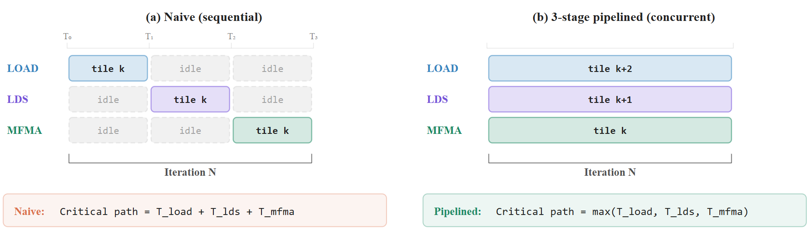
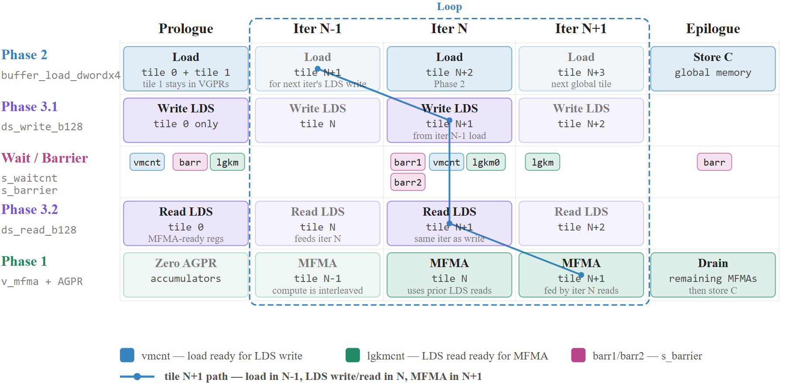
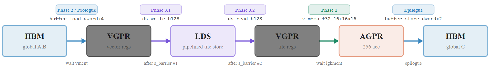
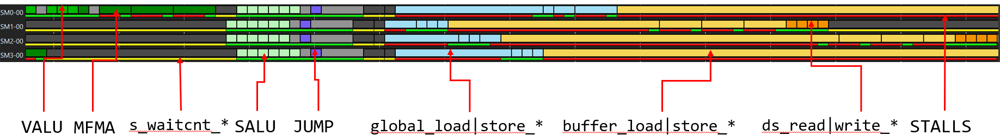
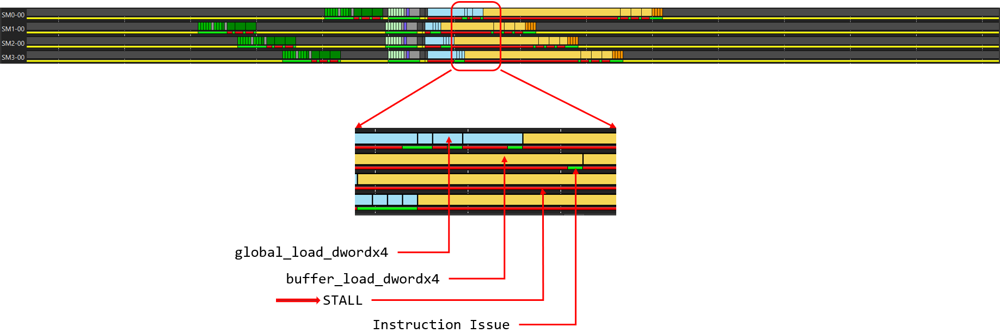
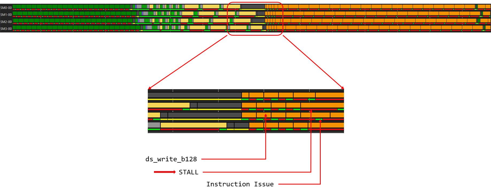

<!---
Copyright (c) 2026 Advanced Micro Devices, Inc. (AMD)

Permission is hereby granted, free of charge, to any person obtaining a copy
of this software and associated documentation files (the "Software"), to deal
in the Software without restriction, including without limitation the rights
to use, copy, modify, merge, publish, distribute, sublicense, and/or sell
copies of the Software, and to permit persons to whom the Software is
furnished to do so, subject to the following conditions:

The above copyright notice and this permission notice shall be included in all
copies or substantial portions of the Software.

THE SOFTWARE IS PROVIDED "AS IS", WITHOUT WARRANTY OF ANY KIND, EXPRESS OR
IMPLIED, INCLUDING BUT NOT LIMITED TO THE WARRANTIES OF MERCHANTABILITY,
FITNESS FOR A PARTICULAR PURPOSE AND NONINFRINGEMENT. IN NO EVENT SHALL THE
AUTHORS OR COPYRIGHT HOLDERS BE LIABLE FOR ANY CLAIM, DAMAGES OR OTHER
LIABILITY, WHETHER IN AN ACTION OF CONTRACT, TORT OR OTHERWISE, ARISING FROM,
OUT OF OR IN CONNECTION WITH THE SOFTWARE OR THE USE OR OTHER DEALINGS IN THE
SOFTWARE.
--->

# Memory Instruction Scheduling for Lock-Stepped Kernels on AMD Instinct™ MI300X: Introducing the Series

This post introduces a multi-part study of how instruction scheduling can influence the behavior of memory operations within loop iterations in GPU kernels where multiple waves execute in a steady-state lock-stepping manner. In this post, we establish the motivating tiled GEMM kernel, shared vocabulary, and ATT-based methodology; upcoming posts in the series will analyze specific VMEM and LDS scheduling bottlenecks in detail. GPUs can deliver very high memory throughput in general, but that potential is sometimes hard to realize in practice. Lock-stepping behavior, commonly seen in AI kernels that involve matrix multiplication, poses a particular challenge: when waves issue memory operations in sync, they can contend for shared resources and leave bandwidth on the table.

<!-- <figure>
  
  <figcaption>Figure 1. The pipelined kernel keeps all three stages busy every
steady-state step, so useful work overlaps instead of idling two engines
at a time.</figcaption>
</figure> -->


<p align="center">Figure 1. The pipelined kernel keeps all three stages busy every
steady-state step, so useful work overlaps instead of idling two engines
at a time.</p>

## Motivating Example

Memory-intensive computations, such as tiled GEMM, are common building blocks of scientific and AI applications. These kernels often execute in lock-step when they use faster, smaller local data share (LDS) to stage data. Here, we call a kernel lock-stepped when the memory operations in
its main loop are guarded at each end by barriers, so every iteration forces the whole workgroup to synchronize in order to ensure that LDS reads and writes have completed, and waves cannot drift far apart in schedule. Our goal here is to understand the scheduling needs of such memory instructions in tiled GEMM kernels and then generalize those learnings to other memory-intensive, lock-stepping kernels.

In a naive GEMM implementation (Figure 1(a)), the MFMA compute units sit idle while waiting for data to load from memory, and the memory system sits idle while waiting for compute to finish, wasting a major part of the hardware capacity. This serialization puts memory latency directly on the critical path, making total execution time the sum of all phases rather than hiding them behind useful work. A software pipeline (Figure 1(b)) overlaps these phases by working on different tiles simultaneously: while one tile computes, the next tile stages through LDS, and a third tile loads from memory. This hides memory latency behind useful compute, reducing the critical path from the sum of all latencies to just the slowest phase. Similar patterns can recur in steady-state execution, such as in loops, and can create opportunities
for compiler optimization. Let\'s look at an example.

```python
matmul_kernel<workgroup>(A, B, C):

// ==================== PROLOGUE ============================
// Load tile 0 and tile 1 of A/B from global memory into registers
// Write tile 0 to LDS
// barrier
// Read tile 0 from LDS into MFMA-ready registers
// (tile 1 remains in registers for the first loop iteration LDS write)
// Accumulators zeroed

// ============== MAIN LOOP ==============
loop:
  // Three tiles in flight:
  // compute tile N, stage tile N+1 through LDS, load tile N+2

  // Phase 1: MFMA on tile N
  //  Uses registers filled by the previous iteration LDS reads
  
  // Phase 2: Load tile N+2 from global memory into registers
  
  // Phase 3.1: barrier
  //  Ensures all waves are done with the previous LDS contents
  //  Write tile N+1 to LDS
  //  Tile N+1 was loaded from global memory in iteration N-1
  
  // Phase 3.2: barrier
  //  Ensures tile N+1 is fully written to LDS
  //  Read tile N+1 from LDS into MFMA-ready registers
  //  These registers will feed MFMAs in iteration N+1

// ============== EPILOGUE ==============
// Drain remaining MFMAs for prefetched/staged tiles
// Store C tile to global memory

```
<!-- <figure>
  
  <figcaption>Figure 2. Timeline of a three-stage software pipeline of the GEMM kernel: the first two tiles are prefetched in the prologue; each later iteration prefetches a new tile while the prior prefetch is written to LDS, then read back and consumed by MFMAs in the next iteration---so load, LDS staging, and compute stay overlapped.</figcaption>
</figure> -->

<p align="center">Figure 2. Timeline of a three-stage software pipeline of the GEMM kernel: the first two tiles are prefetched in the prologue; each later iteration prefetches a new tile while the prior prefetch is written to LDS, then read back and consumed by MFMAs in the next iteration---so load, LDS staging, and compute stay overlapped.</p>

<!-- <figure>
  
  <figcaption>Figure 3. Data movement across the three pipeline stages.</figcaption>
</figure> -->

<p align="center">Figure 3. Data movement across the three pipeline stages. </p>

Each of the workgroup\'s four waves owns a 128×128 fp32 sub-tile of the 256×256 output and issues 256 MFMA operations per K-tile (4 K-steps × 64 output tiles), accumulating into 256 fp32 per lane that lives entirely in AGPRs (.agpr_count: 256) with zero spills. Keeping the accumulator resident in AGPRs for the whole K-loop optimizes away C-array load/store
traffic inside the loop: there is no read-modify-write of the partial sums through memory, so the only traffic the pipeline has to hide is input traffic (A and B), not output traffic. Per K-tile, every lane brings in 256 B from device memory (or cache) using 16
<span>buffer_load_dwordx4</span> instructions, stages them through a single 64 KB LDS
region via <span>ds_write_b128</span>/<span>ds_read_b128</span> pairs guarded by <span>s_waitcnt</span>/<span>s_barrier</span>, and then feeds 4 fp16 of A and 4 fp16 of B into each MFMA.
Figure 3 traces this data flow end to end (HBM → VGPR → LDS → VGPR → AGPR) labeling each hop with the instruction that moves the data and the counter that gates it.
The two counters do different jobs: <span>vmcnt</span> is the vector-memory counter (here, the outstanding <span>global/buffer_loads</span>), and <span>lgkmcnt</span> is the LDS counter tracking outstanding LDS traffic.
Each MFMA waits on <span>lgkmcnt</span> so it never multiplies operands that have not yet
returned from <span>ds_read_b128</span>, and the kernel also drains its <span>ds_write_b128</span>s with <span>s_waitcnt lgkmcnt(0)</span> just before the <span>s_barrier</span> that
guards the next reads.
The single shared LDS region is also why there are two <span>s_barrier</span>s per iteration: the first protects the region before it is overwritten (every wave must finish reading the previous K-tile), the second protects it after the write (every wave must finish writing before anyone reads).

The 3-stage software pipeline keeps up to three K-tiles in flight per lane, one being computed from LDS (<span>ds_read_b128</span> → MFMA), one being written from VGPRs into LDS (<span>ds_write_b128</span>), and one being prefetched from device memory into VGPRs (<span>buffer_load_dwordx4</span>) so HBM and LDS latency is hidden behind compute.
Figure 2 lays this out on a single continuous axis from prologue through the steady-state loop to the epilogue. The prologue must prefetch the first two K-tiles and stage one of them before any MFMA can begin.
In steady state, the bold diagonal follows one tile across stages, loaded at iteration N-1, staged at N, fed to the MFMAs at N+1.
Importantly, the tile a given iteration writes into LDS was prefetched a full iteration earlier and marshaled into staging registers ahead of time; its load latency is hidden behind the previous iteration\'s MFMAs rather than exposed at the LDS writes.
The exception is the prologue, where the first loads and their LDS writes sit in the same straight-line block and the write waits on the just-issued load.

\"Double buffering\" is applied here in the register file: a single shared LDS region holds the currently active K-tile while the pipeline rotates the next two tiles through VGPRs, which is what lets the 256 MFMAs per wave per K-tile run at full throttle. Figure 1 makes the
payoff explicit.
In the naive reference, a tile is fully loaded, then fully staged, then fully computed before the next one starts, so only one of the three engines is ever doing useful work and each tile pays HBM + LDS + MFMA latency in series.
The pipelined schedule overlaps all three stages on different tiles in the same step, significantly lifting steady-state throughput.

This kernel is launched with 608 workgroups and 256 threads per workgroup. On MI300X, with 304 Compute Units (CUs), this leads to two workgroups per CU.
All experiments in the subsequent parts of this series will follow this same dispatch pattern, unless explicitly called out.
Please see the [MI300 GPU architecture documentation](https://rocm.docs.amd.com/en/latest/conceptual/gpu-arch/mi300.html)
for further details about the MI300X series microarchitecture.

## Method of Study

This series aims to study the most relevant memory classes in AMD MI300X GPUs, specifically for kernels executing in four-way lock-step.
The tiled GEMM example forms the building block in our study, and we will try to analyze and understand how sequences of memory operations in the inner loop can be made more efficient by the compiler.
In a lock-stepped setup, we will investigate hand-controlled patterns of memory operations and trace hardware behavior.
Our hope is to isolate behaviors of memory operations that are otherwise mixed up with real kernel noise.
Across the series we will cover device memory read/write (\[<span>global</span>\|<span>buffer</span>\]<span>\_</span>\[<span>load</span>\|<span>store</span>\]<span>\_\*</span>) and LDS read/write (<span>ds\_</span>\[<span>read</span>\|<span>write</span>\]<span>\_\*</span>).
The questions we mainly ask are compiler questions: what can it do to help the hardware and extract more performance from it?

Throughout the post, assembly mnemonics and register names are set in a monospaced typeface, while the prose is set in a serif typeface, so the two are easy to tell apart at a glance.
For improved clarity/readability, assembly code is represented in an abbreviated form; e.g., three consecutive <span>global_load_dwordx4</span> instructions are written as "<span>3x global_load_dwordx4</span>" instead of three separate lines of <span>global_load_dwordx4</span>.

[Advanced Thread Trace](https://rocm.docs.amd.com/projects/rocprofiler-sdk/en/develop/how-to/using-thread-trace.html) (ATT) provides a granular, cycle-by-cycle view of a single wavefront\'s execution, making it an invaluable tool for diagnosing performance bottlenecks.
By visualizing the exact sequence of instructions and stalls, we can pinpoint opportunities for optimization.
These traces are generated using [ROCProfiler](https://rocm.docs.amd.com/projects/rocprofiler/en/latest/) and can be explored interactively with the [ROCProfiler Compute Viewer](https://rocm.docs.amd.com/projects/rocprof-compute-viewer/en/latest/).
Throughout this series, we will use ATT trace images (see Figure 4 below) to analyze kernel
performance.

<!-- <figure>
  
  <figcaption>Figure 4. Example of Advanced Thread Traces (ATT) highlighting how the relevant classes of instructions are represented.</figcaption>
</figure> -->

<p align="center">Figure 4. Example of Advanced Thread Traces (ATT) highlighting how the relevant classes of instructions are represented.</p>

To interpret these visualizations correctly, it is important to
understand what the different visual elements represent:

- **Instruction Types (Colored Boxes)**: Each colored box represents a
  specific category of instruction, showing what the wavefront is
  working on at that moment.

  - **Blue & Yellow Boxes**: Vector Memory (VMEM) operations. These
    instructions fetch or store data from or to memory, such as
    global_load_dwordx4 (blue) and buffer_load_dwordx4 (yellow).

  - **Orange Boxes**: Local Data Share (LDS) operations for reading from
    or writing to the GPU\'s fast on-chip memory.

  - **Shades of Green**: Arithmetic Logic Unit (ALU) operations. These
    are the computational workhorses of the shader, including Scalar ALU
    (SALU, light green), Vector ALU (VALU, green), and
    Matrix-Fused-Multiply-Add (MFMA, dark green) instructions.

- **Instruction Issue, Execution, or Execution Gaps (Lines)**: The lines
  underneath the instruction boxes highlight periods where the wavefront
  is issuing memory instructions, executing non-memory instructions,
  stalling or waiting. These are critical for identifying bottlenecks.

  - **Red Lines (Stalls)**: A red line indicates an instruction-issue
    stall. This means the hardware was ready to issue the next
    instruction but was blocked, often due to a data dependency (e.g.,
    waiting for a memory load to complete). These stalls are primary
    targets for optimization.

  - **Yellow Lines (Waits)**: A yellow line signifies a programmed wait
    state, which is the visual signature of an s_waitcnt instruction.
    The compiler inserts s_waitcnt to enforce correctness, forcing
    consumer instructions (like VALU or MFMA) to wait until producer
    instructions (like a VMEM load) have finished.

  - **Green Lines (Issues/Executes)**: A green line denotes cycles during which the wave is executing and making forward progress after the instruction has been successfully issued.

## Series Outline

The sections above establish the kernel, data flow, and profiling approach for this study. What follows is a preview of upcoming posts in the series, following the sequence of memory operations in the motivating example.
In Part 1 of this series, we delve into the underlying causes of the prolonged issue stalls that precede several device memory read instructions before they reach the VMEM execution units.

<!-- <figure>
  
  <figcaption>Figure 5. ATT highlighting instruction issue stalls as bottlenecks for VMEM loads.</figcaption>
</figure> -->

<p align="center">Figure 5. ATT highlighting instruction issue stalls as bottlenecks for
VMEM loads.</p>

In the ATT trace shown in Figure 5, these delays appear as prominent red bars beneath both <span>global_load_dwordx4</span> and <span>buffer_load_dwordx4</span> instructions, clearly marking them as prime candidates for optimization.
These stalls are visible for both <span>buffer_load_dwordx4</span> and <span>global_load_dwordx4</span> instructions; Part 1 of this series will focus on analyzing these stalls and evaluating potential techniques to reduce their severity.

<!-- <figure>
  
  <figcaption>Figure 6. ATT showing LDS writes stalled before issue.</figcaption>
</figure> -->

<p align="center">Figure 6. ATT showing LDS writes stalled before issue.</p>

In Part 2, our focus shifts to similar stalls on LDS writes. In Figure 6, such stalls manifest as red lines underneath <span>ds_write_b128</span> instructions, signaling bottlenecks where the wavefront is forced to idle before the store can issue.

The next parts will broaden the investigation to two additional categories, LDS reads and device-memory writes.
LDS reads can exhibit their own latency patterns.
Device-memory writes present a distinct set of challenges in dealing with long-latency paths through the VMEM hierarchy.

## Summary

This post introduces a multi-part study of memory instruction scheduling for lock-stepped GPU kernels on AMD Instinct MI300X GPUs. Rather than jumping straight into stall analysis, it lays the groundwork that later posts build on:

- **Lock-stepped execution** — why synchronized memory traffic in tiled GEMM kernels can leave bandwidth on the table.
- **A three-stage software-pipelined GEMM kernel** — the series' motivating example, and how load, LDS staging, and MFMA compute overlap in steady state.
- **The end-to-end data path** (HBM → VGPR → LDS → AGPR) — and the roles of <span>vmcnt</span>, <span>lgkmcnt</span>, and workgroup barriers in guarding correctness.
- **An ATT-based study methodology** — and how ROCProfiler Compute Viewer traces represent VMEM, LDS, and ALU instruction classes.

Upcoming posts apply that foundation to concrete scheduling bottlenecks: issue stalls on device-memory loads (Part 1), LDS write stalls (Part 2), and later LDS reads and device-memory stores. Together, the series moves from this shared kernel and vocabulary to the detailed stall investigations previewed above.

## Disclaimers

The information presented in this document is for informational purposes only and may contain technical inaccuracies, omissions, and typographical errors. The information contained herein is subject to change and may be rendered inaccurate for many reasons, including but not limited to product and roadmap changes, component and motherboard version changes, new model and/or product releases, product differences between differing manufacturers, software changes, BIOS flashes, firmware upgrades, or the like. Any computer system has risks of security vulnerabilities that cannot be completely prevented or mitigated. AMD assumes no obligation to update or otherwise correct or revise this information.
However, AMD reserves the right to revise this information and to make changes from time to time to the content hereof without obligation of AMD to notify any person of such revisions or changes.
THIS INFORMATION IS PROVIDED ‘AS IS.” AMD MAKES NO REPRESENTATIONS OR WARRANTIES WITH RESPECT TO THE CONTENTS HEREOF AND ASSUMES NO RESPONSIBILITY FOR ANY INACCURACIES, ERRORS, OR OMISSIONS THAT MAY APPEAR IN THIS INFORMATION. AMD SPECIFICALLY DISCLAIMS ANY IMPLIED WARRANTIES OF NON-INFRINGEMENT, MERCHANTABILITY, OR FITNESS FOR ANY PARTICULAR PURPOSE. IN NO EVENT WILL AMD BE LIABLE TO ANY PERSON FOR ANY RELIANCE, DIRECT, INDIRECT, SPECIAL, OR OTHER CONSEQUENTIAL DAMAGES ARISING FROM THE USE OF ANY INFORMATION CONTAINED HEREIN, EVEN IF AMD IS EXPRESSLY ADVISED OF THE POSSIBILITY OF SUCH DAMAGES.
AMD, the AMD Arrow logo, AMD Instinct™ GPU, and combinations thereof are trademarks of Advanced Micro Devices, Inc. Other product names used in this publication are for identification purposes only and may be trademarks of their respective companies.
© [2026*] Advanced Micro Devices, Inc. All rights reserved
<style>
  span, pre {
    font-family: "Consolas" !important;
  }
  figcaption {
    text-align: center
  }
</style>
