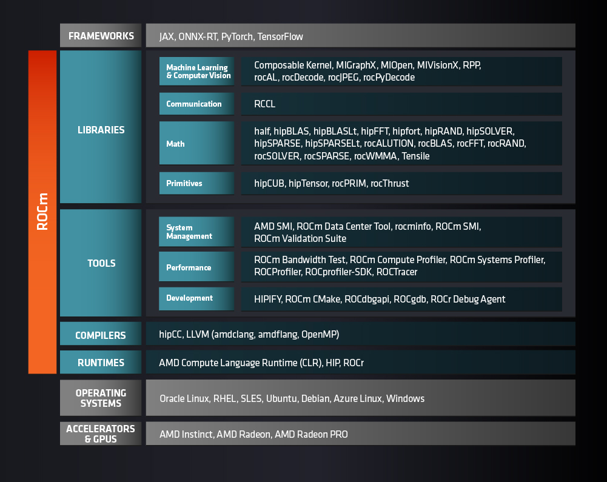
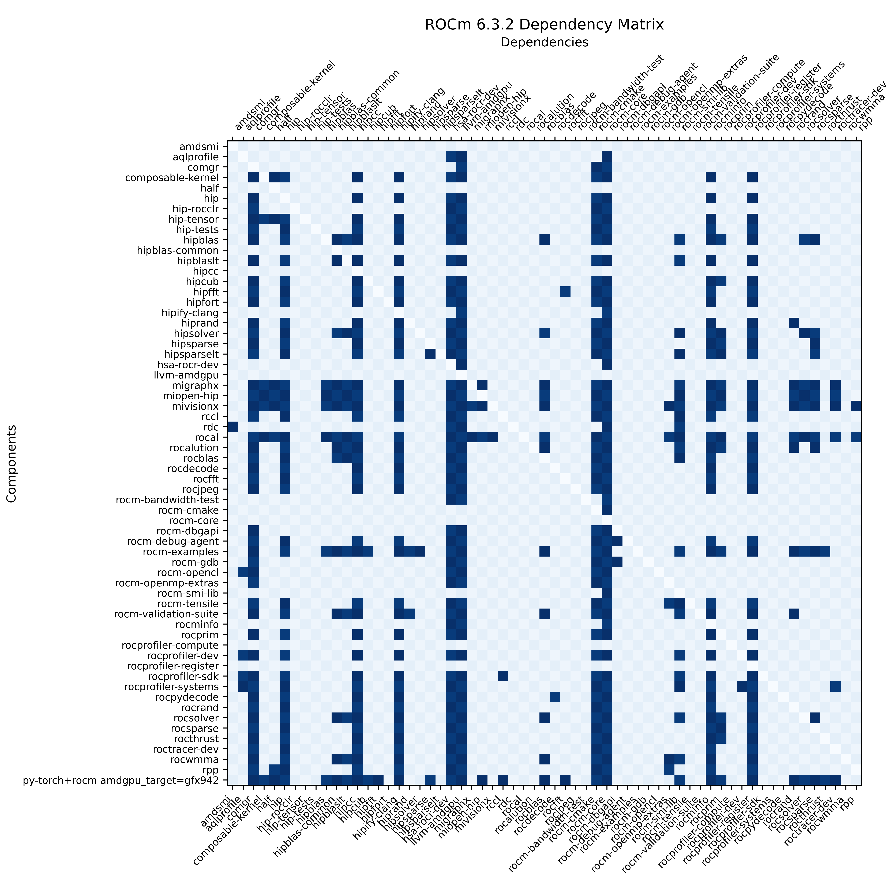

# Installing ROCm from source with Spack
This blog will walk through installing ROCm from source using the Spack package manager. We will also discuss Spack's place among other [ROCm installation methods](https://rocm.docs.amd.com/projects/install-on-linux/en/docs-6.3.3/install/install-overview.html), the landscape of [ROCm components](https://rocm.docs.amd.com/en/docs-6.3.3/what-is-rocm.html), and how ROCm, as an open-source software platform, allows developers to streamline software stacks for their applications.

## What is Spack?
From the [Spack website](https://spack.io):
> Spack is a package manager for supercomputers, Linux, and macOS. It makes installing scientific software easy.

Spack began as a from-source package manager, and while the team at Spack are working to provide [binaries for all Spack packages](https://spack.io/spack-binary-packages/), this is still the package manager's greatest strength.

A from-source package manager is just that—a package manager that builds its package from source code (when available). Compare this to a tradtional package manager (e.g., `dpkg`/`apt` for Debian-based distros, or `yum`/`dnf` for RHEL-based distros) which installs pre-compiled binaries for each package. Put (extremely) simply, you can think of locally compiled binaries as being "fine-tuned" for the particular machine being used. Because spack allows you to select the compilers and build optimizations when compiling source code, their is potential to achieve greater performance. Additionally, for GPU accelerated tools and libraries like thos included in ROCm, building from source allows you to target specific GPU platforms rather than building for all supported architectures. This can result in reduction in storage costs for installing ROCm, which can be beneficial for creating lightweight container images that depend on ROCm. 

## Why install ROCm from source?
If you are installing pre-compiled binaries on a supported operating system (e.g., [using `apt` to install ROCm on Ubuntu 24.04](https://rocm.docs.amd.com/projects/install-on-linux/en/docs-6.3.3/install/quick-start.html)), ROCm and its components come pre-built for [any ROCm-supported GPU](https://rocm.docs.amd.com/projects/install-on-linux/en/docs-6.3.3/reference/system-requirements.html). These builds are ideal for most linux package manager installs, so that everyday users need not worry about specific `gfx` versions.

When installed through a traditional package manager, every component is built against every (supported) `gfx` version. For example, [rocBLAS builds against fourteen different `gfx` versions](https://github.com/ROCm/ROCm/blob/29ba151b48c34fa2129a87097936200ab5b494d8/tools/rocm-build/build_rocblas.sh#L34) (including `xnack` variants).
As an example, if you are developing a ROCm-dependent application for a cluster of AMD Instinct™ MI300X Accelerators; you would only need ROCm components and kernels built against `gfx942`.

There are are a few different methods by which you can install ROCm from source, such as [`make`](https://github.com/ROCm/ROCm/blob/develop/tools/rocm-build/README.md)  and [TheRock](https://github.com/ROCm/TheRock), AMD's lightweight open source build system for HIP and ROCm. The advantage of Spack is that it provides incredible ease-of-use. With each release of ROCm, AMD has consistently kept the corresponding Spack packages up to dateContinuing with our MI300X example, we can just `spack install hipblas` to install `hipBLAS`. (We can further influence the specifics of this build process using environments, as we will see below.)

Beyond even specific `gfx` versions, your application might not even require all default ROCm components.

## Install ROCm accelerated packages with Spack
The ROCm Documentation provides a [detailed guide on using Spack](https://rocm.docs.amd.com/projects/install-on-linux/en/docs-6.3.3/how-to/spack.html).

Getting started with Spack is quite easy. To install Spack, simply clone the repository and source `setup-env.sh`:

```sh
git clone https://github.com/spack/spack.git ~/spack/
source ~/spack/share/spack/setup-env.sh
```

You must also have C, C++, and Fortran compilers installed. To help spack find your compilers, you can run the following

```sh
spack compiler find
```

To install hipblas targeting CDNA3 architectures, you can start by previewing what spack will install by using `spack spec`

```sh
spack spec hipblas amdgpu_target=gfx942
 -- sample output
```

To install, use `spack install` ...


## Spack environments
Compared to a simple `spack install`, explicitly creating an environment like this provides two immediate advantages. -- 

First, the `all.prefer:` lines `amdgpu_target=gfx942` propagates this requirement to all dependencies. Second, we can specify an install location through the spack `view` that creates a directory tree that is similar to the `/opt/rocm` directory tree you get from `apt`, `dnf`, or `yum` package managers. Last, environment files give you a clear way to version control ROCm software environments for your VMs, Docker container images, etc..... Since many applications that depend on ROCm packages utilize the `ROCM_PATH` environment variable, specifying a build location can alleviate potential headaches related to build paths.

Environments can be set up using `spack.yaml` files. Below is a `spack.yaml` that installs `hipBLAS` (and all of its dependencies) targeting `gfx942`.

```yaml
spack:
  specs:
  - hipblas@6.3.2
  concretizer:
    unify: true
  packages:
    all:
      prefer:
      - "amdgpu_target=gfx942"
  config:
    install_tree: $HOME/opt/spack-rocm
    view: $HOME/opt/rocm
```


Read more about Spack environments [here](https://spack.readthedocs.io/en/latest/environments.html).

Yet another advantage of Spack is that we can quickly clean up build dependencies using `spack gc`, leaving our environment with only runtime dependencies.


## Using Spack to understand ROCm dependencies

### Understanding ROCm Components
ROCm is not one piece of software. It is a collection of interconnected, focused components, such the [HIP](https://rocm.docs.amd.com/projects/HIP/en/docs-develop/what_is_hip.html) runtime API for heterogenous systems, [rocBLAS](https://rocm.docs.amd.com/projects/rocBLAS/en/latest/how-to/what-is-rocblas.html) (AMD's BLAS implementation for AMD GPUs), [hipFORT](https://rocm.docs.amd.com/projects/hipfort/en/latest/) (the HIP Fortran library), [various compilers](https://rocm.docs.amd.com/projects/llvm-project/en/latest/index.html), and many more application-specific tools and libraries.

ROCm offically supports roughly 60 components. The exact list of component varies across multiple sources. Here are a few:

### Lists of ROCm Components
- [What is ROCm?](https://rocm.docs.amd.com/en/latest/what-is-rocm.html) $^{[1]}$
- [`ROCm/default.xml`](https://github.com/ROCm/ROCm/blob/develop/default.xml) $^{[2]}$
- [ROCm Documentation for Spack](https://rocm.docs.amd.com/projects/install-on-linux/en/latest/how-to/spack.html#rocm-packages-in-spack) $^{[1]}$
- [ROCm Compatibility Matrix](https://rocm.docs.amd.com/en/latest/compatibility/compatibility-matrix.html) $^{[1]}$
- [Version release notes](https://rocm.docs.amd.com/en/latest/about/release-notes.html#rocm-components) $^{[1]}$

$^{[1]}$ Pages from ROCm Documentation

$^{[2]}$ ROCm GitHub repository

The landscape of ROCm components is best laid out by the following graphic, taken from the [What is ROCm?](https://rocm.docs.amd.com/en/latest/what-is-rocm.html) page from the documentation.



<p style="text-align:center">
Figure 1: The ROCm software stack
</p>

The ROCm stack relies on lower layers of runtimes and compilers which are generally essential for most ROCm components; i.e., these are the "meat and potatoes" of ROCm. Above these layers are **Tools**, which are quite handy for developers, but are also used by some ROCm components. The ROCm stack becomes particularly discrete at the **Library** level. E.g., `rocJPEG` does not depend on `hipTensor` and vice versa. This motivates the question, "Why should we install all of ROCm?" if we are just 

### ROCm Component Dependencies

Spack is useful as a from-source package manager; as such, it also serves as a great system for understanding the dependencies of the ROCm stack. The following graphic has been generated using the outputs of `spack spec <package>`.

<details><summary>E.g., output of <code>spack spec hipfort</code></summary>

```
$ spack spec hipfort
 -   hipfort@6.3.2~ipo build_system=cmake build_type=Release generator=make arch=linux-rocky9-zen4 %gcc@11.5.0
 -       ^cmake@3.31.6~doc+ncurses+ownlibs~qtgui build_system=generic build_type=Release arch=linux-rocky9-zen4 %gcc@11.5.0
 -           ^curl@8.11.1~gssapi~ldap~libidn2~librtmp~libssh~libssh2+nghttp2 build_system=autotools libs=shared,static tls=openssl arch=linux-rocky9-zen4 %gcc@11.5.0
 -               ^nghttp2@1.65.0 build_system=autotools arch=linux-rocky9-zen4 %gcc@11.5.0
 -                   ^diffutils@3.10 build_system=autotools arch=linux-rocky9-zen4 %gcc@11.5.0
 -               ^openssl@3.4.1~docs+shared build_system=generic certs=mozilla arch=linux-rocky9-zen4 %gcc@11.5.0
 -                   ^ca-certificates-mozilla@2025-02-25 build_system=generic arch=linux-rocky9-zen4 %gcc@11.5.0
 -               ^pkgconf@2.3.0 build_system=autotools arch=linux-rocky9-zen4 %gcc@11.5.0
 -           ^ncurses@6.5~symlinks+termlib abi=none build_system=autotools patches=7a351bc arch=linux-rocky9-zen4 %gcc@11.5.0
 -           ^zlib-ng@2.2.3+compat+new_strategies+opt+pic+shared build_system=autotools arch=linux-rocky9-zen4 %gcc@11.5.0
 -       ^gcc-runtime@11.5.0 build_system=generic arch=linux-rocky9-zen4 %gcc@11.5.0
[e]      ^glibc@2.34 build_system=autotools arch=linux-rocky9-zen4 %gcc@11.5.0
 -       ^gmake@4.4.1~guile build_system=generic arch=linux-rocky9-zen4 %gcc@11.5.0
 -       ^hip@6.3.2~asan~cuda~ipo+rocm build_system=cmake build_type=Release generator=make patches=1f65dfe arch=linux-rocky9-zen4 %gcc@11.5.0
 -           ^comgr@6.3.2~asan~ipo build_system=cmake build_type=Release generator=make arch=linux-rocky9-zen4 %gcc@11.5.0
 -               ^z3@4.12.4~gmp~ipo~python build_system=cmake build_type=Release generator=make arch=linux-rocky9-zen4 %gcc@11.5.0
 -           ^glx@1.4 build_system=bundle arch=linux-rocky9-zen4 %gcc@11.5.0
 -               ^mesa@23.3.6+glx+llvm+opengl~opengles+osmesa~strip build_system=meson buildtype=release default_library=shared arch=linux-rocky9-zen4 %gcc@11.5.0
 -                   ^bison@3.8.2~color build_system=autotools arch=linux-rocky9-zen4 %gcc@11.5.0
 -                   ^expat@2.7.0+libbsd build_system=autotools arch=linux-rocky9-zen4 %gcc@11.5.0
 -                       ^libbsd@0.12.2 build_system=autotools arch=linux-rocky9-zen4 %gcc@11.5.0
 -                           ^libmd@1.1.0 build_system=autotools arch=linux-rocky9-zen4 %gcc@11.5.0
 -                   ^flex@2.6.3+lex~nls build_system=autotools arch=linux-rocky9-zen4 %gcc@11.5.0
 -                   ^gettext@0.23.1+bzip2+curses+git~libunistring+libxml2+pic+shared+tar+xz build_system=autotools arch=linux-rocky9-zen4 %gcc@11.5.0
 -                       ^tar@1.35 build_system=autotools zip=pigz arch=linux-rocky9-zen4 %gcc@11.5.0
 -                           ^pigz@2.8 build_system=makefile arch=linux-rocky9-zen4 %gcc@11.5.0
 -                   ^glproto@1.4.17 build_system=autotools arch=linux-rocky9-zen4 %gcc@11.5.0
 -                       ^util-macros@1.20.1 build_system=autotools arch=linux-rocky9-zen4 %gcc@11.5.0
 -                   ^libunwind@1.8.1~block_signals~conservative_checks~cxx_exceptions~debug~debug_frame+docs~pic+tests+weak_backtrace~xz~zlib build_system=autotools components=none libs=shared,static arch=linux-rocky9-zen4 %gcc@11.5.0
 -                   ^libx11@1.8.10 build_system=autotools arch=linux-rocky9-zen4 %gcc@11.5.0
 -                       ^inputproto@2.3.2 build_system=autotools arch=linux-rocky9-zen4 %gcc@11.5.0
 -                       ^kbproto@1.0.7 build_system=autotools arch=linux-rocky9-zen4 %gcc@11.5.0
 -                       ^xextproto@7.3.0 build_system=autotools arch=linux-rocky9-zen4 %gcc@11.5.0
 -                       ^xproto@7.0.31 build_system=autotools arch=linux-rocky9-zen4 %gcc@11.5.0
 -                       ^xtrans@1.5.2 build_system=autotools arch=linux-rocky9-zen4 %gcc@11.5.0
 -                   ^libxcb@1.17.0 build_system=autotools arch=linux-rocky9-zen4 %gcc@11.5.0
 -                       ^libxau@1.0.12 build_system=autotools arch=linux-rocky9-zen4 %gcc@11.5.0
 -                       ^libxdmcp@1.1.5 build_system=autotools arch=linux-rocky9-zen4 %gcc@11.5.0
 -                       ^xcb-proto@1.17.0 build_system=autotools arch=linux-rocky9-zen4 %gcc@11.5.0
 -                   ^libxext@1.3.6 build_system=autotools arch=linux-rocky9-zen4 %gcc@11.5.0
 -                   ^libxt@1.3.1 build_system=autotools arch=linux-rocky9-zen4 %gcc@11.5.0
 -                       ^libice@1.1.2 build_system=autotools arch=linux-rocky9-zen4 %gcc@11.5.0
 -                       ^libsm@1.2.5 build_system=autotools arch=linux-rocky9-zen4 %gcc@11.5.0
 -                   ^llvm@17.0.6+clang~cuda~flang+gold~ipo+libomptarget~libomptarget_debug~link_llvm_dylib+lld+lldb+llvm_dylib+lua~mlir+polly~python~split_dwarf~z3~zstd build_system=cmake build_type=Release compiler-rt=runtime generator=ninja libcxx=runtime libunwind=runtime openmp=runtime shlib_symbol_version=none targets=all version_suffix=none arch=linux-rocky9-zen4 %gcc@11.5.0
 -                       ^binutils@2.43.1~debuginfod~gas+gold~gprofng+headers~interwork+ld~libiberty~lto~nls~pgo+plugins build_system=autotools compress_debug_sections=zlib libs=shared,static arch=linux-rocky9-zen4 %gcc@11.5.0
 -                       ^hwloc@2.11.1~cairo~cuda~gl~level_zero~libudev+libxml2~nvml~opencl+pci~rocm build_system=autotools libs=shared,static arch=linux-rocky9-zen4 %gcc@11.5.0
 -                       ^lua@5.3.6+shared build_system=makefile fetcher=curl arch=linux-rocky9-zen4 %gcc@11.5.0
 -                           ^unzip@6.0 build_system=makefile patches=881d2ed,f6f6236 arch=linux-rocky9-zen4 %gcc@11.5.0
 -                       ^perl-data-dumper@2.173 build_system=perl arch=linux-rocky9-zen4 %gcc@11.5.0
 -                       ^swig@4.1.1 build_system=autotools arch=linux-rocky9-zen4 %gcc@11.5.0
 -                           ^pcre2@10.44~jit+multibyte+pic build_system=autotools arch=linux-rocky9-zen4 %gcc@11.5.0
 -                   ^meson@1.7.0 build_system=python_pip patches=0f0b1bd arch=linux-rocky9-zen4 %gcc@11.5.0
 -                   ^py-mako@1.2.4 build_system=python_pip arch=linux-rocky9-zen4 %gcc@11.5.0
 -                       ^py-markupsafe@2.1.3 build_system=python_pip arch=linux-rocky9-zen4 %gcc@11.5.0
 -                   ^xrandr@1.5.3 build_system=autotools arch=linux-rocky9-zen4 %gcc@11.5.0
 -                       ^libxrandr@1.5.4 build_system=autotools arch=linux-rocky9-zen4 %gcc@11.5.0
 -                           ^renderproto@0.11.1 build_system=autotools arch=linux-rocky9-zen4 %gcc@11.5.0
 -                       ^libxrender@0.9.11 build_system=autotools arch=linux-rocky9-zen4 %gcc@11.5.0
 -                       ^randrproto@1.5.0 build_system=autotools arch=linux-rocky9-zen4 %gcc@11.5.0
 -           ^hipcc@6.3.2~ipo build_system=cmake build_type=Release generator=make patches=c10b010 arch=linux-rocky9-zen4 %gcc@11.5.0
 -           ^hipify-clang@6.3.2~asan~ipo build_system=cmake build_type=Release generator=make patches=16e0e2b arch=linux-rocky9-zen4 %gcc@11.5.0
 -           ^hsa-rocr-dev@6.3.2~asan+image~ipo+shared build_system=cmake build_type=Release generator=make arch=linux-rocky9-zen4 %gcc@11.5.0
 -               ^elfutils@0.192~debuginfod+exeprefix+nls build_system=autotools arch=linux-rocky9-zen4 %gcc@11.5.0
 -                   ^libiconv@1.17 build_system=autotools libs=shared,static arch=linux-rocky9-zen4 %gcc@11.5.0
 -                   ^xz@5.6.3~pic build_system=autotools libs=shared,static arch=linux-rocky9-zen4 %gcc@11.5.0
 -                   ^zstd@1.5.6+programs build_system=makefile compression=none libs=shared,static arch=linux-rocky9-zen4 %gcc@11.5.0
 -               ^libdrm@2.4.124~docs~strip build_system=meson buildtype=release default_library=shared arch=linux-rocky9-zen4 %gcc@11.5.0
 -                   ^libpciaccess@0.17 build_system=autotools arch=linux-rocky9-zen4 %gcc@11.5.0
 -                   ^libpthread-stubs@0.5 build_system=autotools arch=linux-rocky9-zen4 %gcc@11.5.0
 -               ^xxd-standalone@8.2.1201 build_system=makefile arch=linux-rocky9-zen4 %gcc@11.5.0
 -           ^libedit@3.1-20240808 build_system=autotools arch=linux-rocky9-zen4 %gcc@11.5.0
 -           ^llvm-amdgpu@6.3.2~ipo~link_llvm_dylib~llvm_dylib+rocm-device-libs build_system=cmake build_type=Release generator=ninja patches=b4774ca arch=linux-rocky9-zen4 %gcc@11.5.0
 -               ^libxml2@2.13.5~http+pic~python+shared build_system=autotools arch=linux-rocky9-zen4 %gcc@11.5.0
 -               ^ninja@1.12.1+re2c build_system=generic patches=93f4bb3 arch=linux-rocky9-zen4 %gcc@11.5.0
 -                   ^re2c@3.1 build_system=autotools arch=linux-rocky9-zen4 %gcc@11.5.0
 -               ^python@3.11.11+bz2+crypt+ctypes+dbm~debug+libxml2+lzma~optimizations+pic+pyexpat+pythoncmd+readline+shared+sqlite3+ssl~tkinter+uuid+zlib build_system=generic patches=13fa8bf,b0615b2,ebdca64,f2fd060 arch=linux-rocky9-zen4 %gcc@11.5.0
 -                   ^libffi@3.4.6 build_system=autotools arch=linux-rocky9-zen4 %gcc@11.5.0
 -                   ^libxcrypt@4.4.38~obsolete_api build_system=autotools arch=linux-rocky9-zen4 %gcc@11.5.0
 -                   ^readline@8.2 build_system=autotools patches=1ea4349,24f587b,3d9885e,5911a5b,622ba38,6c8adf8,758e2ec,79572ee,a177edc,bbf97f1,c7b45ff,e0013d9,e065038 arch=linux-rocky9-zen4 %gcc@11.5.0
 -                   ^sqlite@3.46.0+column_metadata+dynamic_extensions+fts~functions+rtree build_system=autotools arch=linux-rocky9-zen4 %gcc@11.5.0
 -                   ^util-linux-uuid@2.40.4 build_system=autotools arch=linux-rocky9-zen4 %gcc@11.5.0
 -           ^numactl@2.0.18 build_system=autotools arch=linux-rocky9-zen4 %gcc@11.5.0
 -               ^autoconf@2.72 build_system=autotools arch=linux-rocky9-zen4 %gcc@11.5.0
 -               ^automake@1.16.5 build_system=autotools arch=linux-rocky9-zen4 %gcc@11.5.0
 -               ^libtool@2.4.7 build_system=autotools arch=linux-rocky9-zen4 %gcc@11.5.0
 -                   ^findutils@4.10.0 build_system=autotools patches=440b954 arch=linux-rocky9-zen4 %gcc@11.5.0
 -               ^m4@1.4.19+sigsegv build_system=autotools patches=9dc5fbd,bfdffa7 arch=linux-rocky9-zen4 %gcc@11.5.0
 -                   ^libsigsegv@2.14 build_system=autotools arch=linux-rocky9-zen4 %gcc@11.5.0
 -           ^perl@5.40.0+cpanm+opcode+open+shared+threads build_system=generic arch=linux-rocky9-zen4 %gcc@11.5.0
 -               ^berkeley-db@18.1.40+cxx~docs+stl build_system=autotools patches=26090f4,b231fcc arch=linux-rocky9-zen4 %gcc@11.5.0
 -               ^bzip2@1.0.8~debug~pic+shared build_system=generic arch=linux-rocky9-zen4 %gcc@11.5.0
 -               ^gdbm@1.23 build_system=autotools arch=linux-rocky9-zen4 %gcc@11.5.0
 -           ^perl-file-which@1.27 build_system=perl arch=linux-rocky9-zen4 %gcc@11.5.0
 -           ^perl-uri-encode@1.1.1 build_system=perl arch=linux-rocky9-zen4 %gcc@11.5.0
 -               ^perl-module-build@0.4234 build_system=perl arch=linux-rocky9-zen4 %gcc@11.5.0
 -           ^py-cppheaderparser@2.7.4 build_system=python_pip arch=linux-rocky9-zen4 %gcc@11.5.0
 -               ^py-pip@24.3.1 build_system=generic arch=linux-rocky9-zen4 %gcc@11.5.0
 -               ^py-ply@3.11 build_system=python_pip arch=linux-rocky9-zen4 %gcc@11.5.0
 -               ^py-setuptools@76.0.0 build_system=generic arch=linux-rocky9-zen4 %gcc@11.5.0
 -               ^py-wheel@0.45.1 build_system=generic arch=linux-rocky9-zen4 %gcc@11.5.0
 -               ^python-venv@1.0 build_system=generic arch=linux-rocky9-zen4 %gcc@11.5.0
 -           ^rocm-core@6.3.2~asan~ipo build_system=cmake build_type=Release generator=make arch=linux-rocky9-zen4 %gcc@11.5.0
 -           ^rocminfo@6.3.2~ipo build_system=cmake build_type=Release generator=make arch=linux-rocky9-zen4 %gcc@11.5.0
 -           ^rocprofiler-register@6.3.2~ipo build_system=cmake build_type=Release generator=make patches=fc2f3cd arch=linux-rocky9-zen4 %gcc@11.5.0
 -               ^fmt@11.1.4~ipo+pic~shared build_system=cmake build_type=Release cxxstd=11 generator=make arch=linux-rocky9-zen4 %gcc@11.5.0
 -               ^glog@0.7.1~ipo build_system=cmake build_type=Release generator=make arch=linux-rocky9-zen4 %gcc@11.5.0
 -                   ^gflags@2.2.2~ipo build_system=cmake build_type=Release generator=make arch=linux-rocky9-zen4 %gcc@11.5.0
 -           ^roctracer-dev-api@6.3.2 build_system=generic arch=linux-rocky9-zen4 %gcc@11.5.0
 -       ^rocm-cmake@6.3.2~ipo build_system=cmake build_type=Release generator=make arch=linux-rocky9-zen4 %gcc@11.5.0
```
</details>

---



<p style="text-align:center">
Figure 2: Dependency matrix for ROCm 6.3.3.
</p>

Light squares indicate that the package on the Y-axis does not depend on the given package on the X-axis. Dark squares indicate that there is a dependency. E.g., `hip` depends on `aqlprofile`, `hipcc`, `hipify-clang`, `hsa-rocr-dev`, `llvm-amdgpu`, `rocm-cmake`, `rocm-core`, `rocminfo`, and `rocprofiler-register`.

Note: Package names are presented as they are in `spack`. Exact names may differ from `apt`/`dnf` packages and GitHub repositories.

This graphic covers all of the major ROCm components that are packaged for Spack. We have also included a version of PyTorch + ROCm for reference.


## Using Spack to install ROCm
If you `apt depends rocm6.3.3`, you'll notice that the default installation of ROCm includes `mivisionx`, a set of comprehensive computer vision and machine intelligence libraries, utilities, and applications. Although `mivisionx` comes packaged with ROCm by default, many ROCm components do not require this component. This underscores the utility of selective component installation via Spack.

Unlike `apt` or `dnf`, `spack` does NOT maintain a package for a generic `rocm`/`rocm-dev` package. Instead, ROCm components are packaged individually. The following `spack.yaml` approximates an installation of `rocm-dev`. (Note: none of these packages can be built for specific `gfx` versions.)

`spack.yaml`:
```yaml
spack:
  specs:
  - amdsmi
  - comgr
  - hip
  - hipcc
  - hipify-clang
  - aqlprofile
  - hsa-rocr-dev
  - rocm-openmp-extras
  - rocm-cmake
  - rocm-core
  - rocm-dbgapi
  - rocm-debug-agent
  - rocm-device-libs
  - rocm-gdb
  - llvm-amdgpu
  - rocm-opencl
  - rocm-smi-lib
  - rocprofiler-dev
  - rocprofiler-register
  - rocprofiler-sdk
  - roctracer-dev
  concretizer:
    unify: true
  config:
    install_tree: $HOME/opt/rocm
```

It's worth noting that some packages related to ROCm that are available through `dnf`/`apt` are not available in Spack, e.g., `rocm-utils`. Also, some packages such as `aqlprofile` are not open source, and instead these are installed by grabbing the `.deb` from [repo.radeon.com](repo.radeon.com).

### Using Spack to install PyTorch with ROCm
Beyond ROCm, Spack also provides numerous Python packages, including PyTorch. Below is a `spack.yaml` that my be used to build PyTorch and its dependencies specifically for MI300X/MI300A.

`spack.yaml`:
```yaml
spack:
  specs:
  - py-torch+rocm
  concretizer:
    unify: true
  packages:
    all:
      prefer:
      - "amdgpu_target=gfx942"
  config:
    install_tree: $HOME/opt/rocm
```

## Drivers
Introduce why this is important here... With spack, we are creating an environment to build applications.. drivers are required to run those applications...


See: [Linux Drivers for AMD Radeon Graphics](https://www.amd.com/en/support/download/linux-drivers.html)

At this point it might be good to remind ourselves that the purpose of the ROCm software stack is to provide developers with the tools to program on (primarily) AMD GPUs. Under the hood, the developer stills needs the AMDGPU drivers to meaningfully interface with their AMD GPU. 

For developers on Radeon systems, these drivers are [fully open source](https://github.com/ROCm/ROCK-Kernel-Driver) and are [included in the linux kernel](https://www.kernel.org/doc/html/latest/gpu/amdgpu/index.html).

However, AMD also offers PRO drivers for Radeon PRO and Instinct cards. These drivers are not open source, but are included with ROCm. (PRO drivers are also [available for manual install](https://www.amd.com/en/support/download/linux-drivers.html).)


## The Broader ROCm Ecosystem
So far we have discussed ~70 components (either as `dnf`/`apt`/Spack packages or GitHub repositories) that compose the ROCm software stack. However, if you go to the [ROCm GitHub page](https://github.com/ROCm), you'll find that the ROCm organization has over 300 repositories. Why so many repositories if ROCm only has ~70 components?

This is the beauty of open-source development. AMD is continuously maintaining ROCm integrations, compatibilty, backends, etc. for major GPU computing tools, such as PyTorch, JAX, Tensorflow, transformers, Triton, VLLM, just to list a few. In fact **110** of AMD's ROCm repositories are forks (as of publication). 

Beyond forks, AMD actively creates new tools for ROCm. Some of these developing tools are  `AITER` (AI Tensor Engine for ROCm),
`rocsift` (a C99 debugging API for ROCm),
`rocRoller` (a software library for generating AMDGPU kernels),
`mxDataGenerator` (a library for data generation indifferent floating point formats), 
and `TheRock` (a build system for HIP and ROCm).

## Summary

This blog provides a basic introduction to the Spack package manager and how to install ROCm components using Spack. Specific advantages of Spack have been discussed, such as

- Easily building ROCm components from source.
- Installing Spack packages (such as PyTorch) targeting specific `gfx` architectures.
- Using Spack for cleaning up build dependencies.
- Utilizing `spack spec` to understand ROCm dependencies.

This post also highlights the landscape of the ROCm ecosystem and provides an overview of standard and upcoming ROCm components.

## Acknowledgments
Special thanks to [Garrett Byrd](https://github.com/garrettbyrd) and [Dr. Joe Schoonover](https://github.com/fluidnumerics-joe) at [Fluid Numerics](https://www.fluidnumerics.com/) for contributing this blog. The ROCm software ecosystem is strengthened by community projects that enable you to use AMD GPUs in new ways. If you have a project you would like to share here, [please raise an issue or PR](https://github.com/ROCm/rocm-blogs).

### Find Fluid Numerics online at:
- [fluidnumerics.com](www.fluidnumerics.com)
- [YouTube](https://www.youtube.com/@FluidNumerics)
- [GitHub](https://github.com/FluidNumerics)
- [LinkedIn](https://www.linkedin.com/company/fluidnumerics)
- [Reddit](https://www.reddit.com/r/FluidNumerics/)


## Disclaimers

Third-party content is licensed to you directly by the third party that owns the
content and is not licensed to you by AMD. ALL LINKED THIRD-PARTY CONTENT IS
PROVIDED “AS IS” WITHOUT A WARRANTY OF ANY KIND. USE OF SUCH THIRD-PARTY CONTENT
IS DONE AT YOUR SOLE DISCRETION AND UNDER NO CIRCUMSTANCES WILL AMD BE LIABLE TO
YOU FOR ANY THIRD-PARTY CONTENT. YOU ASSUME ALL RISK AND ARE SOLELY RESPONSIBLE
FOR ANY DAMAGES THAT MAY ARISE FROM YOUR USE OF THIRD-PARTY CONTENT.