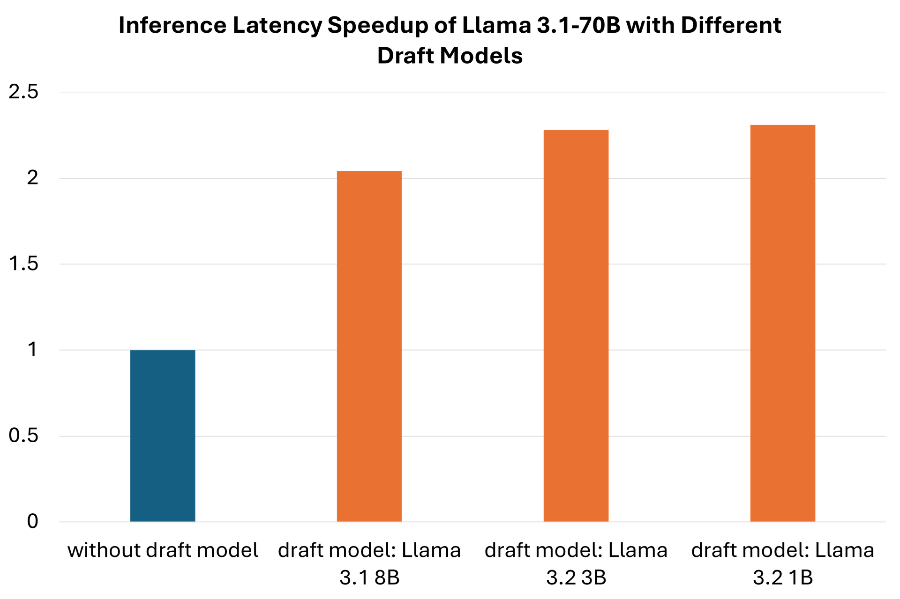
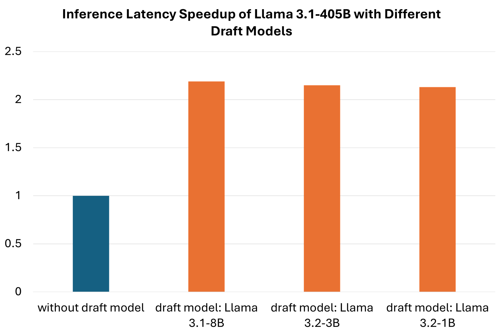
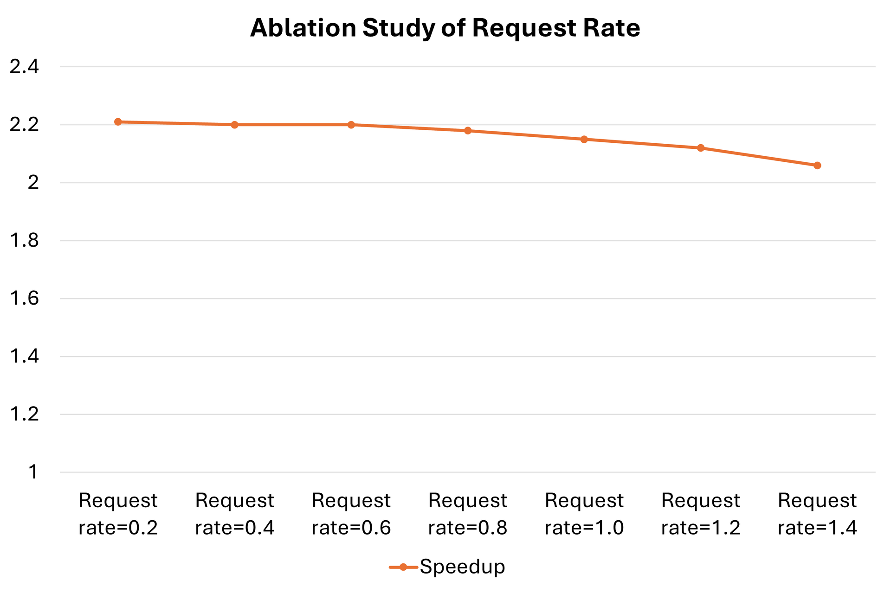
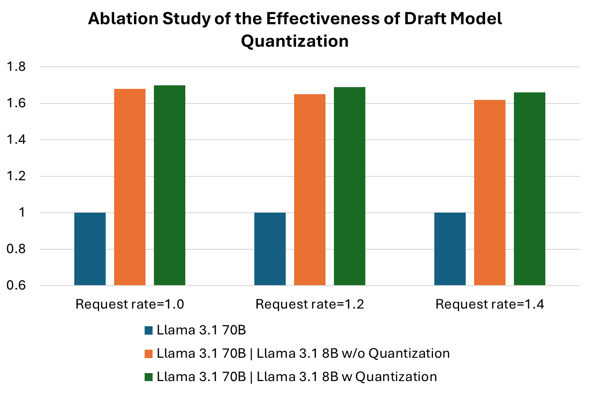

<!---
Copyright (c) 2025 Advanced Micro Devices, Inc. (AMD)

Permission is hereby granted, free of charge, to any person obtaining a copy
of this software and associated documentation files (the "Software"), to deal
in the Software without restriction, including without limitation the rights
to use, copy, modify, merge, publish, distribute, sublicense, and/or sell
copies of the Software, and to permit persons to whom the Software is
furnished to do so, subject to the following conditions:

The above copyright notice and this permission notice shall be included in all
copies or substantial portions of the Software.

THE SOFTWARE IS PROVIDED "AS IS", WITHOUT WARRANTY OF ANY KIND, EXPRESS OR
IMPLIED, INCLUDING BUT NOT LIMITED TO THE WARRANTIES OF MERCHANTABILITY,
FITNESS FOR A PARTICULAR PURPOSE AND NONINFRINGEMENT. IN NO EVENT SHALL THE
AUTHORS OR COPYRIGHT HOLDERS BE LIABLE FOR ANY CLAIM, DAMAGES OR OTHER
LIABILITY, WHETHER IN AN ACTION OF CONTRACT, TORT OR OTHERWISE, ARISING FROM,
OUT OF OR IN CONNECTION WITH THE SOFTWARE OR THE USE OR OTHER DEALINGS IN THE
SOFTWARE.
--->

# Speculative Decoding - Deep Dive

Nowadays, LLM serving has become an increasingly popular service in the technology industry, with thousands of requests being sent to LLM servers,
and responses generated and sent back to clients all over the world. The performance of online serving, as one of the key metrics to evaluate its user experience and service quality,
has grabbed attention from both of the industry and academia.

In this blog, we take vLLM, one of the most commonly-used open-source LLM frameworks, as the serving engine. We then investigate the effectiveness of a feature,
speculative decoding, designed for speeding up the serving performance. We conduct all the benchmark and analysis on AMD Instinct™ MI300X GPUs and AMD software stack.

As you will see, our results show that vLLM achieves up to 2.31x speedup when enabled with speculative decoding. In the post, we first demonstrate the performance of two common-used models, i.e., Llama 3.1-70B and Llama 3.1-405B,
without and with speculative decoding enabled. Then, we provide detailed steps to reproduce the results on AMD MI300X GPUs.
Furthermore, we also provide a few ablation studies on different factors involved in the speculative decoding, including request rates, input sequence lengths, datasets, etc.

## Brief Introduction of vLLM & Speculative Decoding

vLLM is a popular open-source LLM serving system, known for its specific design in minimizing waste of KV cache memory almost entirely and enabling flexible sharing of this cache both within and across requests,
further reducing memory usage. Speculative decoding, a commonly used technique in LLM serving systems, speeds up the inference process for autoregressive models by computing multiple tokens in parallel.
In vLLM, speculative decoding has been supported to boost the serving efficiency, with various speculative algorithms and optimization techniques available, e.g., FP8 quantization.

For a basic understanding and usage of speculative decoding, please refer to our previous blog: vLLM Speculative Decoding.
In this post, we mainly focus on investigating how to adopt speculative decoding with better performance, such as using smaller draft models, enabling quantization, etc.

## Performance of Llama 3.1-70B and Llama 3.1-405B

We benchmark the performance of two common-used LLM models, Llama 3.1-70B and Llama 3.1-405B to unveil the effectiveness of speculative decoding.

### Llama 3.1-70B

In this experiment, we take Llama 3.1-70B as the base model and combine it with three smaller draft models, Llama 3.1-8B, Llama 3.2-3B and Llama 3.2-1B, to test the speedup ratio of speculative decoding.
Table 1 and Figure 1 show the end-to-end latency comparison of Llama 3.1-70B without and with speculative decoding enabled.
Generally, it achieves a >2.0x speedup for Llama 3.1-70B when paired with smaller draft models.

*Table 1. Latency performance using a single AMD MI300X GPU of the same base model, Llama 3.1 70B, with different smaller draft models, i.e., Llama 3.1 8B, Llama 3.2 3B and Llama 3.2 1B. There is a 2.31x speedup when combined with the Llama 3.2 1B draft model.*

| Base Model/Draft Model | E2E Latency (ms) | Speedup |
|------------------------|------------------|---------|
| Llama 3.1-70B/Llama 3.1-8B | 1344.94 | 2.04x |
| Llama 3.1-70B/Llama 3.2-3B | 1201.99 | 2.28x |
| Llama 3.1-70B/Llama 3.2-1B | 1184.09 | 2.31x |
| Llama 3.1-70B Only | 2736.95 | N/A |

Data measured on 02/12/2025. End-to-end latency indicates the total time taken for a user sending a request and getting a response back,
and we use milliseconds per request as its unit.
All the experiments were conducted on a single AMD MI300X GPU, with ROCm<sup>TM</sup> 6.3.1 and vLLM v0.6.7 installed in the system environment.



*Figure 1. End-to-end latency speedups of speculative decoding with Llama 3.1 70B as the base model and Llama 3.1 8B, Llama 3.2 3B and Llama 3.2 1B as the draft models.*

### Llama 3.1-405B

In this experiment, we take Llama 3.1 405B as the base model and combine it with three smaller draft models, Llama 3.1-8B, Llama 3.2 3B and Llama 3.2 1B, to test the speedups of speculative decoding.
We conducted all the experiments on 4 AMD MI300X GPUs. Table 2 and Figure 2 show the end-to-end latency comparison of Llama 3.1 405B without and with speculative decoding enabled.
It also achieves a >2.0x speedup for Llama 3.1 405B paired with smaller draft models.

*Table 2. Latency performance using 4 AMD MI300X accelerators of the same base model, Llama 3.1 405B, with different smaller draft models, i.e., Llama 3.1 8B, Llama 3.2 3B and Llama 3.2 1B. There is a 2.31x speedup when combined with the Llama 3.2 1B draft model.*

| Base Model/Draft Model | E2E Latency (ms) | Speedup |
|------------------------|------------------|---------|
| Llama 3.1-405B/Llama 3.1-8B | 2428.70 | 2.19x |
| Llama 3.1-405B/Llama 3.2-3B | 2484.93 | 2.15x |
| Llama 3.1-405B/Llama 3.2-1B | 2505.69 | 2.13x |
| Llama 3.1-405B Only | 5330.09 | N/A |

Data measured on 02/12/2025. End-to-end latency indicates the total time taken for a user sending a request and getting a response back, and we use milliseconds per request as its unit.
All the experiments were conducted on 4 AMD MI300X GPUs, with ROCm 6.3.1 and vLLM v0.6.7 installed in the system environment.



*Figure 2. End-to-end latency speedups of speculative decoding with Llama 3.1 405B as the base model and Llama 3.1 8B, Llama 3.2 3B and Llama 3.2 1B as the draft models.*

## Steps to Reproduce

### Hardware Setup

All the experiments were conducted on AMD MI300X GPUs. It is suggested to use similar generation of AMD datacenter GPUs with ROCm pre-installed.

### Docker Environment

We use the AMD-optimized unified vLLM docker image:
rocm/vllm:rocm6.3.1_mi300_ubuntu22.04_py3.12_vllm_0.6.6 in all the experiments.

First, pull the docker image from dockerhub:

```bash
docker pull rocm/vllm:rocm6.3.1_mi300_ubuntu22.04_py3.12_vllm_0.6.6
```

Initialize a docker container via the command below:

```bash
docker run -d -it --ipc=host --network=host --privileged --cap-add=CAP_SYS_ADMIN --device=/dev/kfd --device=/dev/dri --device=/dev/mem --group-add render 
--cap-add=SYS_PTRACE --security-opt seccomp=unconfined --name vllm_spec_dec -v 
/home/models/:/models -v /home/:/work rocm/vllm:rocm6.3.1_mi300_ubuntu22.04_py3.12_vllm_0.6.6
```

Note: please replace the model path `“/home/models/:/models“` and workspace `“/home/:/work“` with your own paths.

### Model Download

For model checkpoints, we download the public weights from Hugging Face.
Set the Hugging Face token as below and please replace the token with your own HF_TOKEN:

```bash
export HF_TOKEN=xIxAxMxAxPxLxAxCxExHxOxLxDxExRx
```

Download specific models in local. In this example, we download the model “Llama 3.1 70B Instruct FP8 KV” from AMD repo on Hugging Face:

```bash
huggingface-cli download --resume-download --local-dir-use-symlinks False amd/Llama-3.1-70B-Instruct-FP8-KV --local-dir amd--Llama-3.1-70B-Instruct-FP8-KV
```

### Benchmark

In this experiment, we use the online serving mode of vLLM for performance benchmarking.

Start the server without speculative decoding:

```bash
export PYTORCH_TUNABLEOP_ENABLED=0
export PYTORCH_TUNABLEOP_TUNING=0
export PYTORCH_TUNABLEOP_MAX_TUNING_DURATION_MS=100
export PYTORCH_TUNABLEOP_MAX_WARMUP_DURATION_MS=10
export PYTORCH_TUNABLEOP_ROTATING_BUFFER_SIZE=1024
export PYTORCH_TUNABLEOP_FILENAME=afo_tune_device_%d_full.csv

export HIP_FORCE_DEV_KERNARG=1
export VLLM_USE_ROCM_CUSTOM_PAGED_ATTN=1
export VLLM_INSTALL_PUNICA_KERNELS=1
export TOKENIZERS_PARALLELISM=false
export RAY_EXPERIMENTAL_NOSET_ROCR_VISIBLE_DEVICES=1
export NCCL_MIN_NCHANNELS=112

export VLLM_USE_TRITON_FLASH_ATTN=0
export VLLM_FP8_PADDING=1
export VLLM_FP8_ACT_PADDING=1
export VLLM_FP8_WEIGHT_PADDING=1
export VLLM_FP8_REDUCE_CONV=1

vllm serve /models/models--amd--Meta-Llama-3.1-405B-Instruct-FP8-KV/ --swap-space 16 --disable-log-requests 
--tensor-parallel-size 8 --distributed-executor-backend mp  --dtype float16 --quantization fp8 --kv-cache-dtype fp8  --enable-chunked-prefill=False --max-num-seqs 300
```

Start the server with speculative decoding enabled:

```bash
export PYTORCH_TUNABLEOP_ENABLED=0
export PYTORCH_TUNABLEOP_TUNING=0
export PYTORCH_TUNABLEOP_MAX_TUNING_DURATION_MS=100
export PYTORCH_TUNABLEOP_MAX_WARMUP_DURATION_MS=10
export PYTORCH_TUNABLEOP_ROTATING_BUFFER_SIZE=1024
export PYTORCH_TUNABLEOP_FILENAME=afo_tune_device_%d_full.csv

export HIP_FORCE_DEV_KERNARG=1
export VLLM_USE_ROCM_CUSTOM_PAGED_ATTN=1
export VLLM_INSTALL_PUNICA_KERNELS=1

export TOKENIZERS_PARALLELISM=false
export RAY_EXPERIMENTAL_NOSET_ROCR_VISIBLE_DEVICES=1
export NCCL_MIN_NCHANNELS=112

export VLLM_USE_TRITON_FLASH_ATTN=0
export VLLM_FP8_PADDING=1
export VLLM_FP8_ACT_PADDING=1
export VLLM_FP8_WEIGHT_PADDING=1
export VLLM_FP8_REDUCE_CONV=1

vllm serve /models/models--amd--Meta-Llama-3.1-405B-Instruct-FP8-KV/ --swap-space 16 --disable-log-requests --tensor-parallel-size 4 --distributed-executor-backend mp  
--dtype float16 --quantization fp8 --kv-cache-dtype fp8  --enable-chunked-prefill=False --max-num-seqs 300 --speculative-model /models/models--amd--Meta-Llama-3.1-8B-Instruct-FP8-KV/ --num_speculative_tokens 5  
--speculative-model-quantization fp8
```

For the client, we use the docker image of SGLang: lmsysorg/sglang:v0.4.1.post4-rocm620. Initialize the docker image using the command as below:

```bash
docker run -d -it --ipc=host --network=host --privileged --cap-add=CAP_SYS_ADMIN --device=/dev/kfd --device=/dev/dri --device=/dev/mem  --group-add render --cap-add=SYS_PTRACE --security-opt seccomp=unconfined --shm-size=192g  
--name sglang_client   -v /home/models/:/models  -v /home/:/work  lmsysorg/sglang:v0.4.1.post4-rocm620
```

In the client container, benchmark the performance with different request rates:

```bash
#!/bin/bash
set -xeu

python3 -m sglang.bench_serving --backend vllm --dataset-name random --num-prompt 500 --request-rate 0.5 --random-input 8192 --random-output 256 > vllm_log0.5
python3 -m sglang.bench_serving --backend vllm --dataset-name random --num-prompt 500 --request-rate 1.0 --random-input 8192 --random-output 256 > vllm_log1.0
python3 -m sglang.bench_serving --backend vllm --dataset-name random --num-prompt 500 --request-rate 1.5 --random-input 8192 --random-output 256 > vllm_log1.5
python3 -m sglang.bench_serving --backend vllm --dataset-name random --num-prompt 500 --request-rate 2.0 --random-input 8192 --random-output 256 > vllm_log2.0
python3 -m sglang.bench_serving --backend vllm --dataset-name random --num-prompt 500 --request-rate 2.5 --random-input 8192 --random-output 256 > vllm_log2.5
python3 -m sglang.bench_serving --backend vllm --dataset-name random --num-prompt 500 --request-rate 3.0 --random-input 8192 --random-output 256 > vllm_log3.0
```

## Ablation Study

### Request Rate

In online LLM serving system, an important factor is request rate. Generally, it measures the number of requests processed per second. In this ablation study,
we hope to investigate the connection between the effectiveness of speculative decoding and request rate.

We set the request rate as 0.2, 0.4, 0.6, 0.8, 1.0, 1.2 and 1.4, and keep all the other settings as the same. All the performance data points have been recorded in table 3, below.
It can be inferred that the speedup increases when the request rate decreases, though the difference is not significant.

*Table 3. Ablation study of the request rate. Latency performance using 4 AMD MI300X accelerators of the same base model, Llama 3.1 405B and the draft model Llama 3.2 1B with different request rates, 0.2, 0.4, 0.6, 0.8, 1.0, 1.2 and 1.4. The speedup ratio declines slightly along with increasing request rates.*

| Request Rate | E2E Latency wo spec dec (ms) | E2E Latency w spec dec (ms) | Speedup Ratio |
|--------------|------------------------------|-----------------------------|---------------|
| 0.2 | 4509.21 | 2043.36 | 2.21x |
| 0.4 | 4726.33 | 2146.50 | 2.20x |
| 0.6 | 4942.65 | 2247.93 | 2.20x |
| 0.8 | 5168.92 | 2365.86 | 2.18x |
| 1.0 | 5362.76 | 2491.12 | 2.15x |
| 1.2 | 5571.85 | 2633.49 | 2.12x |
| 1.4 | 5778.35 | 2804.13 | 2.06x |



*Figure 3. Ablation study of how different request rates affect the serving performance. The charts demonstrate latency speedups for the Llama 3.1 405B base model and the Llama 3.2 1B draft model with different request rates.*

### Longer Input Sequence

There are a lot of practical scenarios that requires the LLM serving system capable of long input context for processing,
including natural language processing (NLP), scientific computing, finance and trading, code generation, etc.
More specifically, for NLP tasks, there are document summarization, e.g., academic paper summary, question answering according to reference webpages,
text translation and speech recognition, where the input contains rich information and user hopes to search key information using LLM. For scientific computing,
there are cases like climate modeling and protein structure prediction where LLM needs to digest long input sequence for a brief information forecast.

In this ablation experiment, we aim at exploring how longer input sequence lengths impact the effectiveness of speculative decoding to the LLM serving performance and we use offline serving mode for the benchmark
so as to simulate the practical application scenario. We set the input lengths as 16384 and 32768, and uniformly set the output lengths as 128. The experimental results have been recorded in table 4, below.
It can be observed that there is a trend that the speedup ratio increases along with the increasing number of the input lengths, which indicates that speculative decoding can boost the performance further when the input sequence length is longer.

*Table 4. Ablation study of longer input sequence. Latency performance using 1 single AMD MI300X GPU of the same base model,
Llama 3.1 70B and the draft model Llama 3.1 8B with longer input lengths as 16384 and 32768. The speedup ratio increases when the input length increases.*

| Base Model/Draft Model | Input Sequence Length | Output Sequence Length | E2E Latency wo Spec Dec | E2E Latency w Spec Dec | Speedup |
|------------------------|-----------------------|------------------------|-------------------------|------------------------|---------|
| Llama-3.1-70B/Llama-3.1-8B | 16384 | 128 | 470.9454 | 190.5170 | 2.47x |
| Llama-3.1-70B/Llama-3.1-8B | 32768 | 128 | 1468.6519 | 492.97587 | 2.98x |

### Different Dataset

For general benchmark, people tend to adopt a random dataset for the LLM serving performance and also the feature, speculative decoding,
where the input sequences are randomly generated and don’t have any literal meaning or grammar check. However, this may introduce some biases into the benchmarked performance,
especially when we switch the LLM serving to real applications where input sequences are often grammar-correct. To more comprehensively evaluate the effectiveness of the speculative decoding to LLM serving performance,
we conduct this ablation study, using a different dataset, named as ShareGPT, of which each input and output sequence have corresponding meanings.

We integrate the performance of vLLM without and with speculative decoding enabled on the random dataset (notated as “random“) and ShareGPT (notated as “sharegpt”) in table 5, below.
It can be observed that there is not significant difference between the speedup ratio on the random and ShareGPT dataset.

*Table 5. Ablation study of different dataset. Latency performance using 4 AMD MI300X accelerators of the same base model, Llama 3.1 405B and 3 different draft models Llama 3.1 8B, Llama 3.2 3B and Llama 3.2 1B on the **random** dataset and **ShareGPT** dataset. The speedups maintain consistent across different datasets.*

| Llama 3.1-405B/Llama 3.1-8B | E2E Latency (ms) on random | Speedup |
|-----------------------------|----------------------------|---------|
| Llama 3.1-405B/Llama 3.1-8B | 2428.70 | 2.19x |
| Llama 3.1-405B/Llama 3.2-3B | 2484.93 | 2.15x |
| Llama 3.1-405B/Llama 3.2-1B | 2505.69 | 2.13x |
| Llama 3.1-405B Only | 5330.09 | N/A |

| Llama 3.1-405B/Llama 3.1-8B | E2E Latency (ms) on ShareGPT | Speedup |
|-----------------------------|------------------------------|---------|
| Llama 3.1-405B/Llama 3.1-8B | 4619.33 | 2.15x |
| Llama 3.1-405B/Llama 3.2-3B | 4701.18 | 2.11x |
| Llama 3.1-405B/Llama 3.2-1B | 4638.08 | 2.14x |
| Llama 3.1-405B Only | 9910.92 | N/A |

### Draft Model Quantization

Quantization has become one of the most common-used techniques to boost the performance of LLM services, due to its efficacy in reducing the memory cost and the computation workload.
For the draft model of speculative decoding, vLLM supports using quantization for loading its model weights, where users can employ FP8 for further speedup.
This ablation study mainly explores how effective the draft model quantization is for boosting LLM serving performance.

In table 6 (below), we compare the performance of Llama 3.1 70B with the draft model without and with quantization enabled.
We can conclude that enabling quantization for the draft model in speculative decoding is also effective in boosting the performance of LLM serving.

*Table 6. Ablation study of the effectiveness of quantization for the draft model. Latency performance using one single AMD MI300X accelerator of the same base model, Llama 3.1 70B and the same draft model Llama 3.1 8B with three different request rates, 1.0, 1.2 and 1.4. The speedup ratio indicates that even though the draft model, Llama 3.1 8B, is much smaller than the base model Llama 3.1 70B, enabling quantization still helps further boost the performance.*

| Request Rate | Llama 3.1 70B Only | Llama 3.1 70B/Llama 3.1 8B w/o Quantization | Speedup | Llama 3.1 70B/Llama 3.1 8B w Quantization | Speedup |
|--------------|--------------------|--------------------------------------------|---------|------------------------------------------|---------|
| 1.0 | 2977.95 | 1769.15 | 1.68x | 1749.31 | 1.70x |
| 1.2 | 3047.26 | 1848.84 | 1.65x | 1808.3 | 1.69x |
| 1.4 | 3107.50 | 1920.19 | 1.62x | 1875.36 | 1.66x |



*Figure 4. Ablation study of the impact of quantization on the draft model. The charts demonstrate latency speedups for the Llama 3.1 70B base model and the Llama 3.1 8B draft model without and with quantization.*

## Summary

In this blog we showed you the performance benefits of speculative decoding in LLM serving using the open-source vLLM framework and ROCm, running on AMD MI300X GPUs. We evaluated Llama 3.1-70B and Llama 3.1-405B with and without speculative decoding, demonstrating up to a 2.31x improvement in end-to-end latency. We shared detailed hardware and software setup instructions and benchmarks, and multiple ablation studies that examine the influence of request rates, input sequence lengths, dataset types, and draft model quantization. Our results show consistent performance improvements across these conditions, especially with longer input sequences and quantized draft models.
Speculative decoding significantly enhances the performance of LLM serving systems, achieving up to a 2.31x speedup in our tests with Llama models.
Our ablation studies show that factors like request rates, input sequence lengths, datasets, and draft model quantization impact its effectiveness.
As demand for efficient LLM serving grows, speculative decoding will be crucial in meeting performance needs.
We encourage further exploration of this technique to unlock its full potential. For more ROCm related developer content, please visit ROCm Developer Hub.

## Disclaimers

Third-party content is licensed to you directly by the third party that owns the
content and is not licensed to you by AMD. ALL LINKED THIRD-PARTY CONTENT IS
PROVIDED “AS IS” WITHOUT A WARRANTY OF ANY KIND. USE OF SUCH THIRD-PARTY CONTENT
IS DONE AT YOUR SOLE DISCRETION AND UNDER NO CIRCUMSTANCES WILL AMD BE LIABLE TO
YOU FOR ANY THIRD-PARTY CONTENT. YOU ASSUME ALL RISK AND ARE SOLELY RESPONSIBLE
FOR ANY DAMAGES THAT MAY ARISE FROM YOUR USE OF THIRD-PARTY CONTENT.
