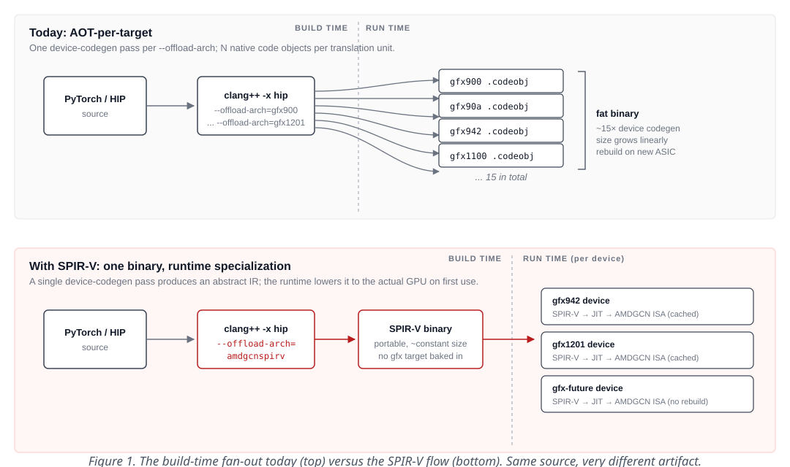
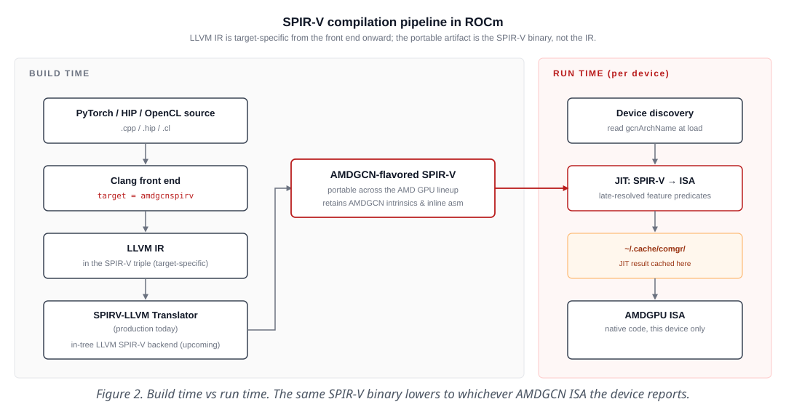
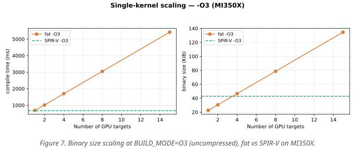
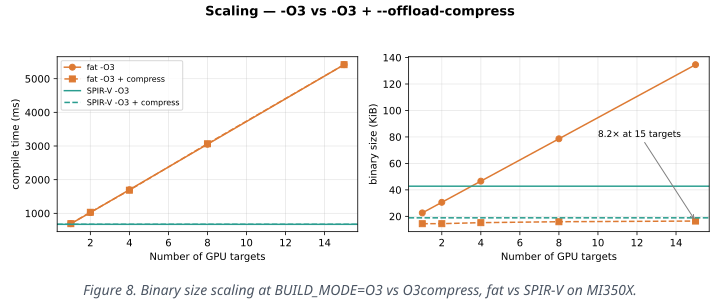
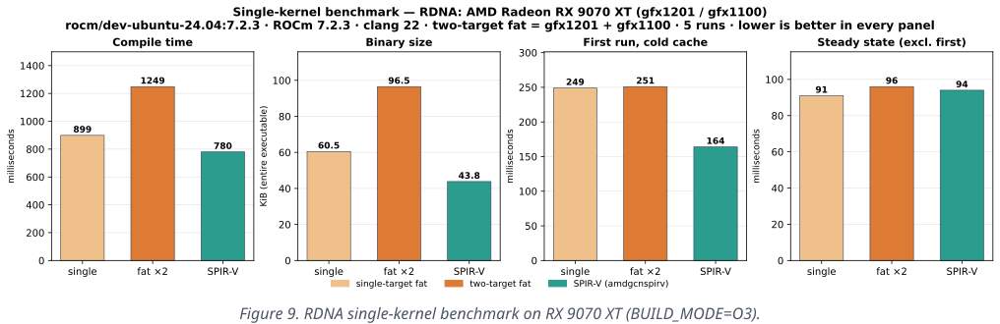

<!---
Copyright (c) 2026 Advanced Micro Devices, Inc. (AMD)

Permission is hereby granted, free of charge, to any person obtaining a copy
of this software and associated documentation files (the "Software"), to deal
in the Software without restriction, including without limitation the rights
to use, copy, modify, merge, publish, distribute, sublicense, and/or sell
copies of the Software, and to permit persons to whom the Software is
furnished to do so, subject to the following conditions:

The above copyright notice and this permission notice shall be included in all
copies or substantial portions of the Software.

THE SOFTWARE IS PROVIDED "AS IS", WITHOUT WARRANTY OF ANY KIND, EXPRESS OR
IMPLIED, INCLUDING BUT NOT LIMITED TO THE WARRANTIES OF MERCHANTABILITY,
FITNESS FOR A PARTICULAR PURPOSE AND NONINFRINGEMENT. IN NO EVENT SHALL THE
AUTHORS OR COPYRIGHT HOLDERS BE LIABLE FOR ANY CLAIM, DAMAGES OR OTHER
LIABILITY, WHETHER IN AN ACTION OF CONTRACT, TORT OR OTHERWISE, ARISING FROM,
OUT OF OR IN CONNECTION WITH THE SOFTWARE OR THE USE OR OTHER DEALINGS IN THE
SOFTWARE.
--->

# SPIR-V on ROCm: A Portable IR for AMD GPUs

ROCm has compiled GPU code ahead of time (AOT), once per target
architecture, since its first release. CPU software shifted to runtime
just-in-time (JIT) compilation in the 1990s — Java HotSpot, V8, LuaJIT,
.NET RyuJIT, PyPy — once the matrix of *target × workload × deployment*
became too large to enumerate at build time. With its adoption of SPIR-V,
ROCm now brings the compile-once, specialize-on-device model to AMD GPUs.

This post covers what SPIR-V is, why AMD adopted it, the compilation
model and its trade-offs, and a reproducible single-kernel HIP example
with measurements on MI350X (CDNA4), spot-checked on RX 9070 XT (RDNA4).
A FAQ and status section at the end cover common questions and what is
shipping, in flight, and not yet solved.

A follow-up post will discuss a real-world SPIR-V deployment at scale:
PyTorch.

## The Problem: AOT-per-Target Does Not Scale

A ROCm application today is built by enumerating every GPU architecture
it needs to run on. For each entry, the device-side code of every HIP
translation unit is compiled once and the resulting code objects are
bundled into a fat binary. With *N* targets, that is *N* device code
objects per TU — a substantial multiplier on build time and on the
size of the shipped artifacts. Host code is compiled once. Beyond the
build system, developers themselves must be aware of every target: writing
per-arch `#ifdef` blocks, testing on each architecture, and updating those
lists whenever a new GPU ships.

An instance of this is PyTorch's `PYTORCH_ROCM_ARCH`,
whose upstream default is currently fifteen targets spanning CDNA1/2/3
and RDNA2/3/4:

```bash
PYTORCH_ROCM_ARCH="gfx900;gfx906;gfx908;gfx90a;gfx942;gfx950;\
                   gfx1030;gfx1100;gfx1101;gfx1102;gfx1103;\
                   gfx1150;gfx1151;gfx1200;gfx1201"
```

Each entry expands into one `--offload-arch=gfxXXX` flag, and the
consequences cascade regardless of whether the build sits inside PyTorch,
a HIP application, or a downstream library:

- **Long build times.** The device pipeline runs N times.
- **Large fat binaries.** N native code objects per TU, all shipped together.
- **Build systems must enumerate every target.** The framework has to
  maintain an explicit arch list and update it whenever a new GPU ships.
- **No forward compatibility.** A binary built today cannot run on a GPU
  architecture that did not exist at build time — a new ASIC requires a
  new build.

This was tolerable when GPU architectures evolved on multi-year cycles. It
strains under the current pace: new ASICs land frequently, cloud fleets mix
generations, and frameworks ship precompiled artifacts that have to cover
all of them.

The shift SPIR-V enables is from *ahead-of-time compilation per target*
to *compile once, just-in-time specialize on device*. Figure 1 illustrates
the difference.



## What SPIR-V Is, and What AMD's Flavor Adds

SPIR-V — Standard Portable Intermediate Representation – V — is a binary,
SSA-based IR defined by [the Khronos Group][khronos-spv]. It originated as a
portable IR for GPU programs (graphics shaders for Vulkan, compute kernels
for OpenCL) and has since broadened into a standardized, toolchain-friendly
IR that can be lowered to a vendor's concrete ISA at a later stage. We treat
SPIR-V here as an intermediate representation (IR), not a source language.

AMD's AMDGCN-flavored SPIR-V carries vendor-specific constructs through two
mechanisms. Inline assembly is encoded via the `SPV_INTEL_inline_assembly`
extension, which wraps the raw assembly string in the SPIR-V binary. AMDGCN
intrinsics and target-specific builtins, by contrast, are handled transparently
by the compiler and translator pipeline: they are lowered to function
declarations and reverse-translated accordingly, with no extension required.
Together, these mechanisms preserve expressiveness that a strictly-portable IR
would lose.
This variant is exposed through the `amdgcnspirv` abstract target in
[LLVM/Clang][rocm-spv-docs].

[khronos-spv]: https://registry.khronos.org/SPIR-V/
[rocm-spv-docs]: https://rocmdocs.amd.com/projects/llvm-project/en/latest/conceptual/spirv.html

In ROCm, AMDGCN-flavored SPIR-V serves three roles:

1. A **target-agnostic GPU IR** that can be produced once.
2. A **late-binding abstraction** over AMD GPU architectures.
3. A way to **decouple compilation from device-specific codegen**.

### How AMD Got SPIR-V into Upstream LLVM

The `amdgcnspirv` target is not a fork. It is a multi-year effort, in
upstream LLVM, that incrementally turned generic SPIR-V into a usable
*flavor* of AMDGCN. The relevant pieces, listed in roughly the order
they were built because each layer depends on the one before it:

- **Target plumbing.** A new Clang target `SPIRV64AMDGCNTargetInfo`
  (`clang/lib/Basic/Targets/SPIR.h`), identified by the triple
  `spirv64-amd-amdhsa--amdgcnspirv`, that delegates feature/builtin
  decisions to the AMDGPU target rather than to vanilla SPIR-V. The driver
  side (`clang/lib/Driver/ToolChains/HIPSPV.cpp`) wires
  `-x hip --offload-arch=amdgcnspirv` into the SPIR-V translation step
  and lets you mix `amdgcnspirv` with concrete `gfxXXX` targets in one
  invocation.
- **ABI alignment with AMDGPU**, so that calling conventions, aggregate
  passing, address spaces, and `__builtin_va_list` match what AMDGCN
  expects after lowering instead of what generic SPIR-V would default to.
  Without this step a SPIR-V binary lowered to AMDGCN at runtime would
  not be ABI-compatible with the host code that called it.
- **Intrinsic surface.** AMDGCN intrinsics (`__builtin_amdgcn_*`) and
  inline `asm volatile(...)` are reachable through the SPIR-V flow via the
  AMD extension; the in-tree backend's `SPIRVInlineAsmLowering` and
  `SPIRVEmitIntrinsics` carry the AMDGPU-specific encodings through to
  the binary.
- **Late-resolved feature predicates**, the capstone — discussed in the
  next section.

This is a portable IR built *from* a target compiler, not a portable
compiler retrofitted to a target. That distinction matters: every
target-specific behavior the SPIR-V flavor preserves is one pull request
(PR), with tests, in upstream LLVM.

## Compilation Model

LLVM IR is *not* target-agnostic — by the time it leaves the front end, the
AST has already been typed against the chosen target. The portable artifact
in this flow is the SPIR-V binary, not the IR. The full pipeline, with the
build-time / run-time boundary made explicit, is shown in Figure 2:



Today, the [SPIRV-LLVM Translator][translator] performs the LLVM-IR → SPIR-V
step. An in-tree LLVM SPIR-V backend is being hardened and is expected to
become the default path.

[translator]: https://github.com/KhronosGroup/SPIRV-LLVM-Translator

### Late-Resolved Feature Predicates ("ZCFS")

A design challenge with portable GPU IR is that hardware features vary
across GPU generations — and encoding those differences at compile time forces
an ugly tradeoff: add runtime guards that penalize every dispatch, or multiply
your build matrix to cover each architecture. AMD's *late-resolved feature
identifying predicates* work — informally called **ZCFS** (Zero-Cost
Feature Selection), since it lets per-arch dispatch survive the trip
through a portable IR without paying any runtime cost — landed via
[LLVM PR #134016][zcfs] and makes this concern largely go away.
Predicates such as `__builtin_amdgcn_processor_is`
and `__builtin_amdgcn_is_invocable` are resolved during SPIR-V → native
lowering, so exactly one branch survives per arch and surrounding loops fold
to per-arch constants. The result is a single SPIR-V binary that lowers to a
different ISA for each GPU at JIT time, with no runtime overhead from the
dispatch itself. The interface is uniform: the same builtins
work whether the target is a concrete architecture like `--offload-arch=gfx950`
or the abstract `--offload-arch=amdgcnspirv`, so no source forking is needed.

[zcfs]: https://github.com/llvm/llvm-project/pull/134016

The mechanism, end-to-end, is worth understanding because it is the thing
that makes portable AMD GPU IR not regress at runtime:

1. **Sema** (`clang/lib/Sema/SemaAMDGPU.cpp`, +304 lines in PR #134016)
   constrains where `__builtin_amdgcn_processor_is` and
   `__builtin_amdgcn_is_invocable` may appear — boolean control-flow
   contexts only — and gives them an opaque
   `__amdgpu_feature_predicate_t` type
   (`clang/include/clang/Basic/AMDGPUTypes.def`) that cannot be stored,
   compared, or smuggled across function boundaries.
2. **CodeGen** (`clang/lib/CodeGen/CGExprScalar.cpp`) lowers the
   predicate to `llvm.spv.named.boolean.spec.constant(i32 ID, metadata
   !"gfx942")` for SPIR-V targets. The supporting intrinsic itself was
   added in [LLVM PR #187420][specconst] (commit `d8104bfc9e9d`,
   2026-03-20) so the larger ZCFS work in PR #134016 (commit
   `18e695890306`, 2026-03-30) had something to lower into.
3. **SPIR-V lowering** (`llvm/lib/Target/SPIRV/SPIRVPrepareGlobals.cpp`)
   assigns deterministic IDs to each unique predicate and emits
   `OpSpecConstantFalse` per ID — deliberately, so that an unspecialized
   predicate defaults to false and the controlled block is removed. The binary
   now contains a small table of predicates, each unresolved.
4. **Runtime lowering** (the SPIRV-LLVM Translator invoked under
   `amd_comgr`) is told the actual `gfx` target of the device it is lowering
   for. It folds each spec-constant to a concrete `i1` and then runs a
   dedicated predicate-resolution pass that folds only the chains rooted at
   predicates. This pass is deterministic, runs at all optimization levels
   including debug, and is a hard failure if any predicate chain cannot be
   fully resolved — guaranteeing that exactly one branch survives per arch
   in the emitted AMDGCN ISA.

Figure 3 shows the end-to-end pipeline.


[specconst]: https://github.com/llvm/llvm-project/pull/187420

The next section puts this mechanism into practice: the two builtins
that ride this lowering path — `__builtin_amdgcn_processor_is` and
`__builtin_amdgcn_is_invocable` — used in a realistic kernel that
reads as a runtime test but, after JIT, leaves exactly one branch
alive on each device.

## Late-Resolved Predicates in Practice

The compilation model section above introduced the *mechanism* — how
predicates flow from Clang through SPIR-V to the runtime JIT. This
section shows how to *use* them. Two builtins were introduced by
[LLVM PR #134016][zcfs]; both are folded during SPIR-V → AMDGCN
lowering, so exactly one branch survives in the emitted native code
and the dispatch costs nothing at runtime.

- **`__builtin_amdgcn_processor_is("gfxXXX")`** — asks *"is the device
  this is being lowered to a specific arch?"* Use it when the right
  answer truly varies per ASIC generation (e.g., a per-arch tuning
  constant).
- **`__builtin_amdgcn_is_invocable(builtin)`** — asks *"is this
  specific builtin callable on the target device's ISA?"* Use it when
  the question is really *"does this hardware capability exist?"*; it
  survives ASIC additions and removals without a rewrite, where the
  processor-is check would need updating every time the supporting
  list changes.

A realistic kernel picks the best implementation the device offers
and falls back gracefully when nothing better is available. AMD's
matrix accelerators come in two families — MFMA (matrix fused
multiply-add) on CDNA and WMMA on RDNA — and the two predicates
compose naturally for this dispatch: `__builtin_amdgcn_is_invocable`
selects the *family* (MFMA? WMMA? neither?), and
`__builtin_amdgcn_processor_is` narrows *within* a family when a
newer ASIC adds a wider tile shape.

```cpp
// One SPIR-V binary; one kernel; three paths. At JIT time exactly
// one of these branches survives in the native code emitted for the
// device. Adding a brand-new ASIC later requires no rebuild: the
// kernel will pick the first capability it finds at JIT.
__global__ void mma_kernel_16x16(const float* A, const float* B, float* C) {
    if (__builtin_amdgcn_is_invocable(__builtin_amdgcn_mfma_f32_16x16x4f32)) {
        // CDNA — matrix accelerator (MFMA family).
        if (__builtin_amdgcn_processor_is("gfx950")) {
            // CDNA4 adds wider MFMA tiles; use them when present.
            do_mma_mfma_wide(A, B, C);
        } else {
            // CDNA1/2/3 — baseline 16x16x4 fp32 MFMA.
            do_mma_mfma(A, B, C);
        }
    } else if (__builtin_amdgcn_is_invocable(
                   __builtin_amdgcn_wmma_f32_16x16x16_f16)) {
        // RDNA3+ — matrix accelerator (WMMA family).
        do_mma_wmma(A, B, C);
    } else {
        // No matrix accelerator on this device. Works on any AMDGCN,
        // including older RDNA — the universal fallback.
        do_mma_scalar(A, B, C);
    }
}
```

What each device sees after JIT:

- **MI300 / MI350 (CDNA3 / CDNA4)** — only the corresponding MFMA
  branch survives. Even the outer `is_invocable` test on
  `mfma_f32_16x16x4f32` is folded to a literal `true`; the
  inner `processor_is("gfx950")` is folded to `true` on CDNA4 and
  `false` on CDNA3.
- **RX 9070 XT (RDNA4) / RX 7900 (RDNA3)** — only the WMMA branch
  survives; the MFMA branch and its inner test are gone.
- **Anything older** — only `do_mma_scalar` survives.

This is what lets a single SPIR-V wheel ship for all of AMD — today
and across GPU generations not yet announced:

- **Forward-compatible.** A binary built today will run on a GPU
  that ships next year. The runtime JITs it to whatever ISA the
  device reports; if that future ASIC introduces a *new* matrix
  family, adding it costs one branch in the `is_invocable` chain
  and none of the existing branches are touched.
- **Backward-compatible.** Older parts with no matrix unit at all
  still execute correctly via the scalar fallback.

## What You Get

| Property | SPIR-V flow | AOT-per-target flow |
| --- | --- | --- |
| Binary count | 1 portable binary | 1 per `gfx` target |
| Forward compatibility | Runs on GPUs released after build | Requires rebuild for new ISAs |
| Fat-binary size | Flat — see scaling section | Grows ~linearly with target count |
| Build time | Single device-codegen pass per TU | N device-codegen passes per TU |
| Framework awareness of HW | Minimal | Build system enumerates targets |
| Per-arch dispatch (in-kernel) | Late-resolved at JIT, no runtime cost | Compile-time `#ifdef` |

The forward-compatibility point is worth making concrete: a SPIR-V binary built today
targets GPUs that did not exist when it was built. The runtime lowers it to
the new ISA the first time the kernel runs.

## What It Costs

Two real costs that show up on any SPIR-V build, regardless of which
framework or application is hosting it:

1. **First-launch JIT latency.** SPIR-V → native lowering happens on the
   first kernel invocation on a given device. In the single-kernel
   benchmark below this adds roughly 70–100 ms. At framework scale
   the cost grows to *seconds per first-touched kernel* (numbers in a
   follow-up post). The cost is paid once per (TU, device) pair and
   then cached. The per-process JIT cache in `~/.cache/comgr/` already mitigates
   this today: the cost is paid once per cache lifecycle. A planned
   further step is JIT-at-package-install — trading install time for
   zero startup latency, akin to shader pre-compilation in modern games.

2. **Code that assumed compile-time arch macros has to be ported.** Patterns
   like `#if defined(__gfx942__)` need to move to runtime predicates
   (`__builtin_amdgcn_processor_is`). With ZCFS-style late-resolved predicates
   this rewrite has no runtime overhead, but it is non-trivial work in places.

A third cost is framework-specific: **library coverage**. ROCm's
per-arch device libraries do not yet all ship SPIR-V variants, so a
SPIR-V application is bounded by its least-portable dependency. The
current state is covered in [Where things stand and what is
next](#where-things-stand-and-what-is-next) below.

With *What you get* and *What it costs* laid out conceptually, the
next section lets you measure both for yourself — a reproducible
single-kernel benchmark covering build time, binary size, runtime,
and a scalability comparison across target counts, on MI350X and
spot-checked on RX 9070 XT.

## Quick Start

This section gets a SPIR-V binary in hand and confirms it produces
the same output as a per-`gfx` build. The deep dive that follows
measures both: compile time, binary size, first-launch JIT cost, and
scaling across target counts.

**Bundled with this post.** A small set of files in the `src/`
directory is everything you need to reproduce the numbers below:

*Sources:*

- `custom_kernel_spirv.hip` — the SPIR-V variant (full source in
  `src/custom_kernel_spirv.hip`).
- `custom_kernel_standard.hip` — the per-`gfx` baseline, identical
  except for one helper (shown in step 2).

### Prerequisites

- **ROCm 7.2 or later.** All measurements in this
  post were captured inside the `rocm/dev-ubuntu-24.04:7.2.3`
  container.
- A supported AMD GPU. All benchmark numbers use three compile modes — compiler
  **default**, **`-O3`**, and **`-O3` + `--offload-compress`** — via
  `BUILD_MODE` (see [FAQ](#faq)).
- A Linux environment with Docker.

Start the container with GPU access:

```bash
docker run -it --rm --device=/dev/kfd --device=/dev/dri \
    --group-add video -w /workspace \
    rocm/dev-ubuntu-24.04:7.2.3
```

Verify ROCm is visible inside the container:

```bash
rocminfo | grep gfx | head -1
```

On a MI350 Series (MI350X/MI355X) node, you should see:

```bash
Name:                    gfx950 
```

The ROCm LLVM toolchain (`clang++`, `llvm-objdump`) lives in
`/opt/rocm/llvm/bin`. Put it on `PATH` before running the commands
below:

```bash
export PATH=/opt/rocm/llvm/bin:$PATH
```

### 1. Build a SPIR-V Binary

Use the abstract `amdgcnspirv` target to generate AMDGCN-flavored SPIR-V:

```bash
clang++ -x hip --offload-arch=amdgcnspirv \
    -O3 custom_kernel_spirv.hip -o vecadd_spirv
```

You can confirm no concrete target is embedded:

```bash
llvm-objdump --offloading ./vecadd_spirv
# vecadd_spirv:   file format elf64-x86-64
# Extracting offload bundle: vecadd_spirv.0.host-x86_64-unknown-linux-gnu-
# Extracting offload bundle: vecadd_spirv.0.hip-spirv64-amd-amdhsa--amdgcnspirv
```

### 2. Build a Per-`gfx` Baseline

The `src/` directory already includes `custom_kernel_standard.hip`.
Build it targeting concrete GPUs (here the two CDNA datacenter parts
`gfx942` and `gfx950`):

```bash
clang++ -x hip --offload-arch=gfx942,gfx950 \
    -O3 custom_kernel_standard.hip -o vecadd_fat
```

In contrast to step 1, the fat binary embeds one native bundle per
concrete `gfx` target you asked for:

```bash
llvm-objdump --offloading ./vecadd_fat
#vecadd_fat:     file format elf64-x86-64
#Extracting offload bundle: vecadd_fat.0.host-x86_64-unknown-linux-gnu-
#Extracting offload bundle: vecadd_fat.0.hipv4-amdgcn-amd-amdhsa--gfx942
#Extracting offload bundle: vecadd_fat.0.hipv4-amdgcn-amd-amdhsa--gfx950
```

The two source files are deliberately a minimal diff: same kernel,
same launches, same host logic. The *only* substantive difference is
how `items_per_thread_for_arch()` expresses the per-arch dispatch —
compile-time `#if` macros in the standard version, resolved per
`--offload-arch` device-codegen pass at build time:

```cpp
__device__ __forceinline__ int items_per_thread_for_arch() {
#if defined(__gfx942__)
    return 4;  // CDNA3
#elif defined(__gfx950__)
    return 4;  // CDNA4
#elif defined(__gfx90a__)
    return 4;  // CDNA2
#elif defined(__gfx1201__)
    return 2;  // RDNA4
#elif defined(__gfx1100__)
    return 2;  // RDNA3
#else
    return 1;
#endif
}
```

In `custom_kernel_spirv.hip` it uses `__builtin_amdgcn_processor_is()`,
resolved during SPIR-V → native lowering at JIT time:

```cpp
__device__ __forceinline__ int items_per_thread_for_arch() {
    if (__builtin_amdgcn_processor_is("gfx942"))  return 4;  // CDNA3
    if (__builtin_amdgcn_processor_is("gfx950"))  return 4;  // CDNA4
    if (__builtin_amdgcn_processor_is("gfx90a"))  return 4;  // CDNA2
    if (__builtin_amdgcn_processor_is("gfx1201")) return 2;  // RDNA4
    if (__builtin_amdgcn_processor_is("gfx1100")) return 2;  // RDNA3
    return 1;
}
```

Different binding time, same end result — and that one-function diff is
exactly what the benchmark numbers below are measuring. (The two
builtin predicates used here — `__builtin_amdgcn_processor_is` and
`__builtin_amdgcn_is_invocable` — are covered in detail in the
[Late-resolved predicates in practice](#late-resolved-predicates-in-practice)
section above.)

### 3. Run Both, Validate Functional Equivalence

```bash
./vecadd_spirv
```

Output:

```bash
=== SPIR-V HIP Vector Add (portable amdgcnspirv) ===
Binary is portable -- native code generated at runtime

Device: AMD Radeon Graphics (gfx950:sramecc+:xnack-)
Block size: 256, 4 items/thread, grid: 1024 (chosen on host from gcnArchName)

First launch (includes SPIR-V JIT compilation):
  Kernel time: 83.122 ms  (includes JIT overhead)
Second launch (native code cached):
  Kernel time: 0.010 ms  (native speed)

Result: PASS
```

Run the fat:

```bash
./vecadd_fat
```

Output:

```bash
=== Standard HIP Vector Add (per-gfx fat binary) ===
Binary embeds native code for its --offload-arch targets

Device: AMD Radeon Graphics (gfx950:sramecc+:xnack-)
Block size: 256, 4 items/thread, grid: 1024 (chosen on host from gcnArchName)

First launch (native code object from fat binary):
  Kernel time: 0.556 ms
Second launch:
  Kernel time: 0.007 ms  (native speed)

Result: PASS
```

Both printed `Result: PASS`, and displayed the first launch and second launch timing.

### 4. Verify Portability on a Different GPU (e.g., gfx1201)

This step verifies the portability claim directly: `vecadd_spirv`
still runs on a GPU that wasn't in the build, while `vecadd_fat`
fails because its native bundles only target gfx942/gfx950.

Copy both binaries to a non-CDNA system — we used a Radeon RX 9070
XT (gfx1201) — and start the same container as in Prerequisites
(`rocm/dev-ubuntu-24.04:7.2.3`).

Verify ROCm sees the RDNA4 GPU inside the container:

```bash
rocminfo | grep gfx | head -1
# Name:                    gfx1201
```

Run the SPIR-V binary:

```bash
./vecadd_spirv
```

```bash
=== SPIR-V HIP Vector Add (portable amdgcnspirv) ===
Binary is portable -- native code generated at runtime

Device: AMD Radeon RX 9070 XT (gfx1201)
Block size: 128, 2 items/thread, grid: 4096 (chosen on host from gcnArchName)

First launch (includes SPIR-V JIT compilation):
  Kernel time: 67.528 ms  (includes JIT overhead)
Second launch (native code cached):
  Kernel time: 0.020 ms  (native speed)

Result: PASS
```

The same binary that ran on MI350X (gfx950) now runs on RDNA4 — no
rebuild, JIT lowering on first launch.

Now the fat binary:

```bash
./vecadd_fat
# Segmentation fault (core dumped)
```

The segfault is the surface symptom; the actual diagnostic comes
from the HIP runtime log:

```bash
AMD_LOG_LEVEL=3 ./vecadd_fat
```

```bash
:3:hip_module.cpp           :825 : 836675924502 us:   hipLaunchKernel ( 0x200ba0, {4096,1,1}, {128,1,1}, 0x7ffcca7d9b20, 0, char array:<null> )
:3:hip_fatbin.cpp           :524 : 836675924584 us:  Forcing SPIRV: false
:1:hip_fatbin.cpp           :687 : 836675924592 us:  No compatible code objects found for: gfx1201, value of HIP_FORCE_SPIRV_CODEOBJECT: 0
```

No compatible code object for `gfx1201` — the fat binary only
contains gfx942 and gfx950 bundles, so the runtime has nothing to
launch. The SPIR-V binary, by contrast, carries the portable IR and
JIT-lowers to whatever ISA `rocminfo` reports.

## Deep Dive: Benchmarking SPIR-V vs Fat

The lead measurement is on a CDNA4 datacenter part (`gfx950`,
MI350X), spot-checked on RDNA4. All numbers in this section come from
one pinned container image:

| Component | Version |
| --- | --- |
| Container image | `rocm/dev-ubuntu-24.04:7.2.3` |
| OS | Ubuntu 24.04.4 LTS |
| ROCm | 7.2.3 |
| Compiler | AMD clang 22.0.0git (`roc-7.2.3`, `f58b06dce1f9`) |
| GPU under test | AMD Instinct MI350X (`gfx950`, CDNA4) |

*Driver Scripts:*

- `benchmark.sh` — clears `~/.cache/comgr/`, rebuilds both binaries,
  and prints the per-arch comparison table. Takes optional `[runs]`,
  `GFX_TARGETS=…`, and `BUILD_MODE` (`default`, `O3`, `O3compress`).
- `run_singlekernel_scaling.sh` — sweeps 1/2/4/8/15 native targets
  plus `amdgcnspirv`, median of 3 trials per row (honours `BUILD_MODE`).
- `run_all_build_modes.sh` — runs both scripts for all three
  `BUILD_MODE` values and writes `artifacts/benchmark/results.csv` plus
  `artifacts/_singlekernel_scaling/data_{default,O3,O3compress}.csv`.

### Cold-Cache Methodology

The runtime caches JIT output in `~/.cache/comgr/`; without clearing
it, a SPIR-V "cold" run is actually warm. All three driver scripts
used below (`benchmark.sh`, `run_singlekernel_scaling.sh`, and the
`run_all_build_modes.sh` wrapper) clear `~/.cache/comgr/` and
`/tmp/comgr-*` before each run so cold-start numbers reflect real
first-launch JIT cost. Each builds the binaries, runs each N times,
and prints compile time / binary size / first-launch / averages; the
result tables below are pasted directly from their output.

### Build Flags: Default vs `-O3` vs `-O3` + Compress

**(1) Single-target build-flag sweep.** This is the first of three
measurements. It isolates the effect of the two compile flags —
`-O3` and `--offload-compress` — at a single target (`gfx950`),
comparing fat against `amdgcnspirv` across the three `BUILD_MODE`
combinations exposed by the script (`default`, `O3`, `O3compress`).
`BUILD_MODE` selects the compile flags: `default` uses the compiler's defaults (no explicit `-O` flag), `O3` adds `-O3`, and `O3compress` adds `-O3 --offload-compress`.
Reproduce all three side by side:

```bash
./run_all_build_modes.sh
```

The table below shows **binary size only** — the clearest single
dimension to demonstrate flag impact. Figure 4 adds compile time
and steady-state runtime across the same three modes:

| `BUILD_MODE` | fat (`gfx950`) | `amdgcnspirv` |
| --- | ---: | ---: |
| `default` (no explicit `-O3`) | 56,256 B | 44,864 B |
| `O3` | 23,136 B | 44,200 B |
| `O3compress` | 14,784 B | 19,304 B |

At **default**, SPIR-V can look smaller than single-target fat. At **`-O3`**, fat shrinks ~2.4× while
SPIR-V on-disk size is essentially unchanged. **`--offload-compress`**
shrinks both. Figure 4 shows all three dimensions side by side.


Figure 5 below is the output of `run_singlekernel_scaling.sh` run
across all three `BUILD_MODE` values. It sweeps fat builds from 1 to
15 targets (1, 2, 4, 8, 15) and compares each against `amdgcnspirv`
on both binary size and compile time — fat grows on both axes under
every flag setting, while SPIR-V stays flat.


### Release Build (`BUILD_MODE=O3`) — Primary Comparison

**(2) Release build at 1 vs 2 targets.** Pinning the build mode to
what frameworks actually ship (`-O3`), and stepping target count
from one to two, to show what happens to compile time, binary size,
and runtime as the arch list grows by one entry. `benchmark.sh` with
`BUILD_MODE=O3` and `GFX_TARGETS=…`:

```bash
BUILD_MODE=O3 GFX_TARGETS=gfx950          ./benchmark.sh 5
BUILD_MODE=O3 GFX_TARGETS="gfx942 gfx950" ./benchmark.sh 5
```

5 runs each, cache cleared between:

> **What to look for.** At one or two targets, SPIR-V does not undercut
> fat on absolute size or compile time — a single-arch fat binary is
> actually smaller here. SPIR-V's wins are *flat scaling* (no growth
> with target count) and *forward compatibility* (the same binary
> lowers to GPUs that did not exist at build time). The 15-target sweep
> below makes that shape visible.

| | fat (`gfx950`) | fat (`gfx942;gfx950`) | `amdgcnspirv` |
| --- | ---: | ---: | ---: |
| Compile time | 733 ms | 1,085 ms | 712 ms |
| Binary size | 23,136 B | 31,328 B | 44,200 B |
| First run (cold) | 411 ms | 413 ms | 357 ms |
| Avg (excl. first) | 263 ms | 272 ms | 281 ms |

Figure 6 visualizes these numbers.


Reading the numbers:

- **Compile time is flat for SPIR-V** (~710 ms whether you ask for one
  arch or two) while the fat side scales: 733 ms for `gfx950` alone,
  1,085 ms once `gfx942` is added. Every extra `gfxXXX` adds another
  device-codegen pass.
- **SPIR-V binary size is constant** at 44,200 B regardless of arch
  count; the fat binary grows 23,136 → 31,328 B going from one target
  to two. On this kernel a single-target native build is actually
  *smaller* than the SPIR-V artifact — the win is flat size as the
  arch list grows, not a smaller baseline.
- **First-launch JIT overhead is small** — ~74 ms above steady state
  here (351 ms first run vs 277 ms steady). Notably, fat-binary cold
  start (407–414 ms) is *larger* than SPIR-V's (351 ms), because it
  is dominated by HIP runtime init rather than kernel codegen.
- **Steady state matches native within noise** — 266–268 ms (fat) vs
  277 ms (SPIR-V), a few percent that is inside run-to-run variance
  on this kernel.

These are *uncompressed* bundle sizes — `--offload-compress` shrinks
both sides without changing the shape (see the scaling table below).

### Scaling to 15 Targets

**(3) Full scaling sweep.** The release-build pattern from (2)
extended across the full target-count range — 1, 2, 4, 8, and 15
— to show that fat compile time and binary size grow with target
count while SPIR-V stays flat. `run_singlekernel_scaling.sh` does
this for `amdgcnspirv` (median of 3 trials). **`BUILD_MODE=O3`** is
the release row used in Figure 6; **`default`** shows the
unoptimized fat growth that makes SPIR-V look smaller at one target.

| Targets | `default` fat (KiB) | `O3` fat (KiB) | `O3compress` fat (KiB) |
| ---: | ---: | ---: | ---: |
| 1 (`gfx950`) | 55.0 | 22.6 | 14.5 |
| 2 (`gfx942;gfx950`) | 94.9 | 30.6 | 14.5 |
| 15 (full default) | 615.0 | 134.6 | 16.4 |

SPIR-V (`n=0`) is flat per mode: 43.7 KiB (`default`), 43.1 KiB (`O3`),
18.9 KiB (`O3compress`). Only the fat columns grow with target count.
Figures 7 and 8 visualize this scaling.





Three takeaways (release `-O3` row):

- **Compile time scales linearly with arch count** — ~340 ms per added
  `--offload-arch`; SPIR-V stays ~678 ms.
- **Binary size** — fat grows 22.6 → 134.6 KiB (1 → 15 targets);
  SPIR-V stays ~43 KiB.
- **With `O3compress`** — fat-15 drops to 16.4 KiB (8.2× smaller than
  uncompressed fat-15); SPIR-V compresses to 18.9 KiB — the two
  converge. Compile-time flatness and forward compatibility remain the
  durable wins.

We spot-checked the same kernel and workflow on RX 9070 XT (RDNA4,
`gfx1201`); compile-time flatness, fat scaling with target count, and
steady-state parity with native matched the CDNA pattern, as shown in
Figure 9 below.



## FAQ

**Q. How does `-O3` affect the binary sizes in this post?**

Very differently for fat and SPIR-V, because they ship different things.

A **fat binary** embeds finished **native AMDGCN** code objects — one per
`--offload-arch`. `-O3` runs the full device optimization pipeline before
those objects are sealed (dead-code elimination, inlining, loop unrolling,
per-arch `#ifdef` collapse), so each native slice shrinks dramatically. On
the MI350X demo kernel (`gfx950`), single-target fat went 56,256 B →
23,136 B (`-O3`) → 14,784 B (`-O3` + `--offload-compress`); SPIR-V went
44,864 B → 44,200 B → 19,304 B. Run `./run_all_build_modes.sh` for the
full matrix.

A **SPIR-V binary** contains **portable IR**, not native ISA. The LLVM IR
that feeds SPIR-V generation is near-pristine Clang output — optimization
is deliberately deferred so that at JIT time the AMDGPU backend can
resume as if compilation were simply suspended after the front end.
This is why the on-disk SPIR-V artifact remains large even at `-O3`:
the size reduction shows up when the runtime lowers to native code on
first launch, not in the portable artifact.

That is why, at default optimization, SPIR-V can look *smaller* than
single-target fat, while at `-O3` single-target fat can be *smaller*
than SPIR-V — but multi-target fat still grows with every arch and
SPIR-V stays flat. Frameworks ship release builds, so the primary
comparison tables use `BUILD_MODE=O3`; the three-mode sweep
(`run_all_build_modes.sh`) and Figures 4 and 5 show default vs release
vs release+compress side by side.

**Q. What's the relationship between `clang++`, `amdclang++`, and
`hipcc`?**

They are layers over the *same* compiler, not alternatives:

- **`clang++`** (`/opt/rocm/llvm/bin/clang++`) is the compiler — a
  symlink to `clang-22`, AMD's build of upstream LLVM/Clang shipped
  under the vanilla name (version string: `AMD clang 22.0.0git` in
  ROCm 7.2.3). HIP is first-class in mainline Clang, so
  `clang++ -x hip --offload-arch=…` is the whole toolchain with
  nothing above it.
- **`amdclang++`** is AMD's *branded entry point* to that same
  compiler — a small (~115 KB) launcher (`amdllvm`) that applies ROCm
  configuration and execs `clang`. Same version string, same output.
  AMD recommends it so you explicitly select the ROCm compiler over a
  system `/usr/bin/clang++`.
- **`hipcc`** is a *convenience driver* one level up: it auto-adds HIP
  include paths, applies `-x hip`, adds device-library paths, derives
  `--offload-arch` from environment variables, links `libamdhip64`,
  then invokes `amdclang++`/`clang++` underneath.

These three produce an identical object given matching flags:

```bash
hipcc      --offload-arch=amdgcnspirv -O3 k.hip -o k
amdclang++ -x hip --offload-arch=amdgcnspirv -O3 k.hip -o k
clang++    -x hip --offload-arch=amdgcnspirv -O3 k.hip -o k
```

The examples in this post call `clang++` directly because the SPIR-V
experiments need exact control over the offload flags
(`--offload-arch=amdgcnspirv`, `--offload-compress`,
`--offload-compression-level`). `hipcc` would auto-inject an arch from
the environment, which fights that; `amdclang++` would be identical.

**Q. What happens if I pass both `--offload-arch=amdgcnspirv` and a
concrete `--offload-arch=gfxXXX` in the same compile?**

The compiler embeds *both* offload bundles in the output. At launch, the
ROCm runtime walks the bundles and picks the native `gfxXXX` slice if
its arch matches the device; otherwise it falls back to the
`amdgcnspirv` slice and JIT-lowers it. We confirmed this on a gfx950
host with `AMD_LOG_LEVEL=3`:

```text
$ clang++ -x hip --offload-arch=amdgcnspirv,gfx950 \
    --offload-compress -O3 vecadd.hip -o vecadd
$ llvm-objdump --offloading vecadd
  Extracting offload bundle: vecadd.0.host-x86_64-unknown-linux-gnu-
  Extracting offload bundle: vecadd.0.hipv4-spirv64-amd-amdhsa-unknown-amdgcnspirv
  Extracting offload bundle: vecadd.0.hipv4-amdgcn-amd-amdhsa--gfx950

$ AMD_LOG_LEVEL=3 ./vecadd 2>&1 | grep "Inserting bundle"
  Inserting bundle entry of amdgcn-amd-amdhsa--gfx950:sramecc+:xnack-
```

First-launch kernel time on gfx950 was **4.6 ms** (no JIT — used the
native bundle) vs **~105 ms** for a SPIR-V-only build on the same
device (JIT path). So "native matches win, SPIR-V is the catch-all
fallback" is the load-bearing rule. This makes the obvious production
strategy reasonable: ship native bundles for the architectures you have
performance-tuned for, plus an `amdgcnspirv` slice as the universal
fallback for everything else.

**Q. Which GPU architectures can run SPIR-V binaries today?**

The `amdgcnspirv` runtime JIT path in ROCm 7.2 supports the same set
of architectures that ROCm itself supports — CDNA (gfx908, gfx90a,
gfx942, gfx950), RDNA3 (gfx1100, gfx1101, gfx1102), and RDNA4
(gfx1200, gfx1201). Older architectures that are no longer on the
ROCm support matrix (e.g., gfx900, gfx906) are not tested or
guaranteed to work with the SPIR-V JIT path. The forward-compatibility
promise applies to *future* architectures — a SPIR-V binary built
today will run on a GPU that ships after the binary was built, as long
as the ROCm runtime on that system supports the new architecture.

**Q. How is the first-launch JIT cost mitigated?**

Two mitigations, one shipping and one under development:

- **Caching** is already implemented. The first SPIR-V → native
  lowering for a given (TU, device) pair is written to a per-process
  JIT cache, so every launch after the first reuses native code
  instead of re-lowering. The cost is paid once per cache lifecycle,
  not once per run.
- **Finalisation / JIT at package install** is under development. It
  moves the lowering to package-install time (`pip install`,
  `apt install`, `winget install`, …) so the artifact is already
  native by the time it first runs. This completely hides the
  run-time latency, trading it for a longer install — the same deal
  modern games make when they pre-compile shaders on install.

**Q. Where is the JIT output cached?**

`~/.cache/comgr/` (per-process, per-user). Removing this directory
forces a cold-start JIT on the next launch — the measurement loop
above (`rm -rf ~/.cache/comgr/ /tmp/comgr-*`) does this between runs
to capture honest first-launch cost. The JIT-at-package-install path
being designed will populate this cache (or its successor) once per
package install, eliminating the per-machine cold start entirely.

**Q. Is `--offload-compress` required to run SPIR-V, and is it worth
tuning?**

No — `--offload-compress` is purely a binary-size optimization (zstd
compression of the offload bundles) and is not functionally required on
any architecture or ROCm version. Frameworks that ship SPIR-V will
typically enable it unconditionally for the size win (PyTorch does, in
[`cmake/Dependencies.cmake:1026`][pt-143986]). The default compression
level (zstd-3) is already near-optimal: SPIR-V compresses ~4.3× and
native AMDGCN ~3.6×, and higher levels yield diminishing returns. In
practice: leave `--offload-compress` on, leave the level at default,
move on.

[pt-143986]: https://github.com/pytorch/pytorch/pull/143986

### Debugging SPIR-V Binaries (Today)

SPIR-V changes *when* device code materializes: the file you ship holds
portable IR; the AMDGCN that actually runs is produced at first kernel
launch (or reused from `~/.cache/comgr/` after that). **Host debugging
is unchanged** — compile the x86_64 side with `-g` and use `gdb` as usual.
**Device debugging** goes through the same ROCm tools (`rocgdb`, etc.), but
against the JIT'd native code object, not the SPIR-V bundle on disk. Debug-info
coverage on the SPIR-V path is still a subset of a native per-`gfx` build;
that gap is being closed, not a different debugging model.

For quick triage on this demo: `llvm-objdump --offloading` to see which
bundles are embedded; `AMD_LOG_LEVEL=3` to watch the runtime pick native
vs SPIR-V and JIT; `rm -rf ~/.cache/comgr/` to force a cold lowering.
A dedicated follow-up post will walk through end-to-end SPIR-V debug
workflows — this one stays focused on the compile and portability story.

## Where Things Stand and What Is Next

What is shipping today:

- The `amdgcnspirv` target in Clang and the LLVM SPIR-V toolchain.
- The SPIRV-LLVM Translator path (production today).
- Late-resolved feature identifying predicates ([LLVM PR #134016][zcfs])
  and the supporting `llvm.spv.named.boolean.spec.constant` intrinsic
  ([LLVM PR #187420][specconst]).
- Per-process JIT caching at `~/.cache/comgr/`.

What is in flight:

- The in-tree LLVM SPIR-V backend, on track to replace the translator as the
  default lowering path.
- JIT-at-package-install, eliminating first-launch latency for shipped
  artifacts. The strongest argument for it shows up at framework
  scale, where first-launch JIT is in seconds, not the milliseconds
  the single-kernel demo suggests.
- Richer device debug-info through the SPIR-V → AMDGCN JIT path (see
  [Debugging SPIR-V binaries (today)](#debugging-spir-v-binaries-today)).

What is *not* solved yet:

- **SPIR-V builds for the per-arch device libraries.** Coverage is
  partial and uneven, and remains the practical limit on portability
  for any real GPU workload built on top of ROCm. As of writing:

  - *Building for `amdgcnspirv` today:* rocPRIM, rocThrust, rocRAND, rocBLAS.
  - *In progress:* Composable Kernel ([PR #6304][ck-spirv]),
    rocFFT, and rocSPARSE.

  These are AMD's own libraries, so the fair question is why the rest
  are not further along. Sequencing and difficulty, not reluctance:
  enablement runs toolchain → framework → libraries, and the
  libraries are also the hardest code to port — the most
  per-arch-tuned part of the stack (MFMA/WMMA intrinsics, inline GCN
  assembly, per-arch kernel selection), since peak per-GPU performance
  is their whole purpose.

[ck-spirv]: https://github.com/ROCm/rocm-libraries/pull/6304
[rocblas-spirv]: https://github.com/ROCm/rocm-libraries/pull/2774

## Summary

In this post we explored how SPIR-V brings a compile-once,
specialize-on-device model to AMD GPUs through the ROCm toolchain —
turning the pain of building and shipping GPU code for every architecture
into a single portable binary that specializes at runtime. Here is what
that looks like in practice:

- **One binary, many GPUs** — a single `amdgcnspirv` artifact lowers to
  whichever AMDGCN ISA the device reports at first kernel launch.
- **Build time and binary size stay flat** — no device-codegen fan-out as
  your arch list grows. Add targets without paying for them at build time.
- **Forward compatibility comes for free** — the same binary runs on GPUs
  that did not exist when it was built.
- **Steady-state performance matches native** — the costs are a one-time
  first-launch JIT (~70–100 ms at single-kernel scale) and porting away
  from compile-time arch macros.
- **Library coverage is the practical ceiling today** — portability is
  bounded by the least-portable dependency, but that gap is closing:
  rocBLAS, Composable Kernel, rocFFT, and rocSPARSE are in progress.

All scripts and sources to reproduce the numbers in this post are included
above. Follow-up posts will cover SPIR-V at PyTorch framework scale and
end-to-end device debugging workflows — stay tuned.

If you have questions or feedback, please reach out on GitHub
[Discussions](https://github.com/ROCm/rocm-blogs/discussions).

## Additional Resources

The PRs and docs cited inline above, collected here for convenience.

### Specs & docs

- [Khronos Group, *SPIR-V Specification (Unified)*, v1.6 r4][khronos-spv]
- [AMD ROCm LLVM Project, *ROCm support for SPIR-V*][rocm-spv-docs]
- M. Larabel, *[AMD Lands Support for Vendor-Flavored SPIR-V Within
  LLVM](https://www.phoronix.com/news/LLVM-AMDGCN-Flavored-SPIR-V)*,
  Phoronix, 2024.
- [Khronos Group, *SPIRV-LLVM Translator*][translator]
  (AMD/ROCm fork: <https://github.com/ROCm/SPIRV-LLVM-Translator>)

### LLVM PRs

- [#134016 — late-resolved feature identifying predicates][zcfs]
  (commit `18e695890306`, 2026-03-30)
- [#187420 — `llvm.spv.named.boolean.spec.constant` intrinsic][specconst]
  (commit `d8104bfc9e9d`, 2026-03-20)

### ROCm library PRs

- [#2774 — rocBLAS: SPIR-V (`amdgcnspirv`) target support][rocblas-spirv]
  (ROCm/rocm-libraries, open)
- [#6304 — CK: add SPIR-V (`amdgcnspirv`) target support][ck-spirv]
  (ROCm/rocm-libraries, open)

## Disclaimers

The information presented in this document is for informational purposes only and may contain technical inaccuracies, omissions, and typographical errors. The information contained herein is subject to change and may be rendered inaccurate for many reasons, including but not limited to product and roadmap changes, component and motherboard version changes, new model and/or product releases, product differences between differing manufacturers, software changes, BIOS flashes, firmware upgrades, or the like. Any computer system has risks of security vulnerabilities that cannot be completely prevented or mitigated. AMD assumes no obligation to update or otherwise correct or revise this information.
However, AMD reserves the right to revise this information and to make changes from time to time to the content hereof without obligation of AMD to notify any person of such revisions or changes.
THIS INFORMATION IS PROVIDED "AS IS." AMD MAKES NO REPRESENTATIONS OR WARRANTIES WITH RESPECT TO THE CONTENTS HEREOF AND ASSUMES NO RESPONSIBILITY FOR ANY INACCURACIES, ERRORS, OR OMISSIONS THAT MAY APPEAR IN THIS INFORMATION. AMD SPECIFICALLY DISCLAIMS ANY IMPLIED WARRANTIES OF NON-INFRINGEMENT, MERCHANTABILITY, OR FITNESS FOR ANY PARTICULAR PURPOSE. IN NO EVENT WILL AMD BE LIABLE TO ANY PERSON FOR ANY RELIANCE, DIRECT, INDIRECT, SPECIAL, OR OTHER CONSEQUENTIAL DAMAGES ARISING FROM THE USE OF ANY INFORMATION CONTAINED HEREIN, EVEN IF AMD IS EXPRESSLY ADVISED OF THE POSSIBILITY OF SUCH DAMAGES.
AMD, the AMD Arrow logo, and combinations thereof are trademarks of Advanced Micro Devices, Inc. Other product names used in this publication are for identification purposes only and may be trademarks of their respective companies.
© 2026 Advanced Micro Devices, Inc. All rights reserved.
