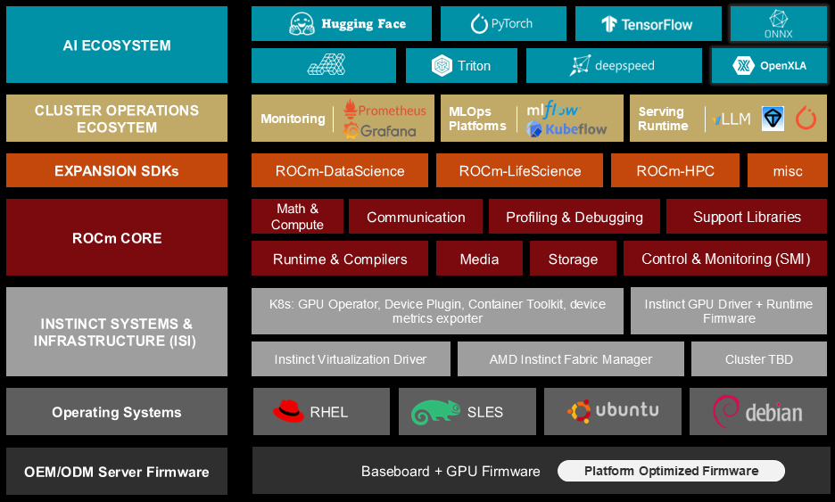

<!---
Copyright (c) 2025 Advanced Micro Devices, Inc. (AMD)

Permission is hereby granted, free of charge, to any person obtaining a copy
of this software and associated documentation files (the "Software"), to deal
in the Software without restriction, including without limitation the rights
to use, copy, modify, merge, publish, distribute, sublicense, and/or sell
copies of the Software, and to permit persons to whom the Software is
furnished to do so, subject to the following conditions:

The above copyright notice and this permission notice shall be included in all
copies or substantial portions of the Software.

THE SOFTWARE IS PROVIDED "AS IS", WITHOUT WARRANTY OF ANY KIND, EXPRESS OR
IMPLIED, INCLUDING BUT NOT LIMITED TO THE WARRANTIES OF MERCHANTABILITY,
FITNESS FOR A PARTICULAR PURPOSE AND NONINFRINGEMENT. IN NO EVENT SHALL THE
AUTHORS OR COPYRIGHT HOLDERS BE LIABLE FOR ANY CLAIM, DAMAGES OR OTHER
LIABILITY, WHETHER IN AN ACTION OF CONTRACT, TORT OR OTHERWISE, ARISING FROM,
OUT OF OR IN CONNECTION WITH THE SOFTWARE OR THE USE OR OTHER DEALINGS IN THE
SOFTWARE.
--->

# ROCm 7.9 Technology Preview: ROCm Core SDK and TheRock Build System

AMD is delighted to announce the availability of the [ROCm Core SDK 7.9.0](https://rocm.docs.amd.com/en/docs-7.9.0/about/release-notes.html), with a new build system, called [TheRock](https://github.com/ROCm/TheRock).
The Core SDK is a slimmed down version of the traditional ROCm release, focusing on foundational components for running high performance AI workloads on AMD GPUs.
[TheRock](https://github.com/ROCm/TheRock) introduces a streamlined uniform system for building and testing these core components.
TheRock manages dependencies between packages, so changes affecting several ROCm components can be coordinated automatically.
Python releases built using TheRock can be easily installed in virtual environments, so developers can try new ROCm versions and features quickly without making system changes.

In this blog, you'll learn how ROCm has evolved and adapted with advances in machine learning and AI,
leading to the design of the ROCm Core SDK, a methodical restructuring of ROCm to focus on critical components.
We'll review ROCm’s architecture and delivery process, and explain how TheRock interacts with the different component layers.
You can then try out a few small examples, showing how TheRock can already be used to install, build, and test ROCm libraries.

## Our Roadmap to Revamp ROCm

ROCm has grown since its release in 2016, and today includes core communication drivers,
compilers, profilers, and advanced mathematical tools used throughout machine learning and AI.
Making ROCm open source enables these components to be improved and combined by developers,
but assembling, building, and testing these combinations can be complex and error-prone.
If a change affected multiple GitHub repositories, multiple pull-requests needed to be coordinated,
and industry-wide ROCm releases needed exact combinations of all these projects to be prepared.

The ROCm software ecosystem has expanded dramatically over the past few years. Our single monolithic release targeting multiple industries and use cases often leaves our users installing more software than they need.
We understand this trend is not sustainable, and have already introduced [ROCm-DataScience](https://rocm.blogs.amd.com/software-tools-optimization/introducing-rocm-ds-revolutionizing-data-processing-with-amd-instinct-gpus/README.html) and [ROCm-LifeScience](https://rocm.blogs.amd.com/software-tools-optimization/rocm-ls-intro/README.html) as separate entities.
However, the entire ROCm toolkit is still too big, and the ROCm Core SDK slims it down to the parts necessary to run common AI workloads.
This means moving groups of related packages to market specific expansion packs such as HPC, or moving standalone projects into the miscellaneous category. These changes will land in early 2026 with ROCm 8.

Before TheRock, the centralized build system was a collection of bash scripts invoking CMake or make as necessary to build the core ROCm toolkit. Passing CMake build flags across a single build often required manual intervention.
TheRock brings a pure CMake based build system, streamlining the propagation of build flags and configurations across different stages and components of the build.
Python and github are used for dependency management.

[ROCm 7.9 (TODO: update link)](https://advanced-micro-devices-rocm-internal--586.com.readthedocs.build/en/586/about/release-notes.html) is a technology preview release built by TheRock. We intend to continue supporting the current build process for ROCm until the switch over to TheRock in mid-2026.
For more on ROCm 7 including new features, changes, and general improvements, see the [ROCm 7.0 release blog](https://rocm.blogs.amd.com/ecosystems-and-partners/rocm-7.0-blog/README.html).

The diagram below shows an overview of the entire software stack that powers an AMD GPU.
Thanks to ROCm 7 improvements including TheRock, the ROCm components are now available for Radeon as well as Instinct GPUs.



* Instinct is AMD’s data-center GPU family for accelerated compute. Once the OS driver is installed and the device shows up, you’re ready to run ROCm on top.
* Radeon is AMD’s workstation/consumer GPU family. With the supported AMD GPU driver in place, TheRock enables the same ROCm user-space flow here too.
* ROCm is the user space software collection including runtimes, libraries and prebuilt binaries to compile and run user applications on the GPU.
* ROCm expansion toolkits can be built independently using ROCm components. They have their own release cycles, and can come from various contributors.

The diagram below provides a deeper look at ROCm's internal architecture.


Within the AMD stack, ROCm takes care of system runtime, monitoring and communication, and increasingly sophisticated collections of math operations used in machine learning and AI.
This is a large and varied set of responsibilities, and it's part of TheRock's job to make sure it all works together.

## Centralizing Source Code in GitHub through Super-Repos

As part of simplifying the ROCm Core SDK, key projects are being collected into a few overarching git repositories, called super-repos.
These include:

* [rocm-systems](https://github.com/ROCm/rocm-systems/)
  * System libraries including [rocm-core](https://github.com/ROCm/rocm-core), [rocminfo](https://github.com/ROCm/rocminfo), [rocprofiler](https://github.com/ROCm/rocprofiler), and more.
  * The full list is in the rocm-systems super-repo at [rocm-systems/projects](https://github.com/ROCm/rocm-systems/tree/develop/projects).
  * These are mapped into TheRock's ROCm build at locations including [TheRock/base](https://github.com/ROCm/TheRock/tree/main/base), [TheRock/core](https://github.com/ROCm/TheRock/tree/main/core) and [TheRock/profiler](https://github.com/ROCm/TheRock/tree/main/profiler).

* [rocm-libraries](https://github.com/ROCm/rocm-libraries/)
  * Math and ML libraries including [hipBLAS](https://github.com/ROCm/hipblas), [rocRAND](https://github.com/ROCm/rocRAND), [ComposableKernel](https://github.com/ROCm/composable_kernel/), [MIOpen](https://github.com/ROCm/miopen), and more.
  * The full list is in the rocm-libraries super-repo at [rocm-libraries/projects](https://github.com/ROCm/rocm-libraries/tree/develop/projects).
  * Fully-migrated projects are mapped into TheRock's ROCm build at locations including the `rocm-libraries` submodule of [TheRock](https://github.com/ROCm/TheRock/tree/main) itself. Some are included at [TheRock/math-libs](https://github.com/ROCm/TheRock/tree/main/math-libs) and [TheRock/ml-libs](https://github.com/ROCm/TheRock/tree/main/ml-libs).

Our [blog post on ROCm 7.0](https://rocm.blogs.amd.com/ecosystems-and-partners/rocm-7.0-blog/README.html#math-compute-libraries) gives a full list of math and communication libraries, with descriptions and links.

Some ROCm projects including self-contained tools such as [TransferBench](https://github.com/ROCm/TransferBench) are not included in the super-repos.
ROCm expansion SDKs including
[ROCm-DS: ROCm Toolkit for Data Sciences](https://instinct.docs.amd.com/latest/data-science/index.html),
[ROCm-LS: ROCm Toolkit for Life Sciences](https://instinct.docs.amd.com/latest/life-science/index.html) will also be supported.
These levels of the stack can include third-party contributions without needing to be integrated into TheRock's CICD pipelines.

## Key Features of the New Build Process

TheRock provides ROCm with a single build, testing, and CI/CD pipeline, [documented here](https://github.com/ROCm/TheRock/blob/main/docs/development/build_system.md).
In previous versions up to 6.4, the ROCm build processes were implemented using a [custom shell script](https://github.com/ROCm/ROCm/tree/3573239728060542369f8990df434567f049b34b/tools/rocm-build) for each major package. TheRock makes this much simpler to orchestrate.

There is a single CMake project at the top level which coordinates sub-project CMake builds.
Instead of scripts using environment variables and guessing where other subprojects will be built/installed,
CMake toolchain files are generated that explicitly propagate all dependencies.
This enables the CMake superproject to leverage common tooling including incremental builds, build bootstrapping, and compiler caching.
The [overall build architecture](https://github.com/ROCm/TheRock/blob/main/docs/development/development_guide.md#overall-build-architecture) shows how the pieces fit together.

Features of the new build process include:

* Library package sources are fetched and organized into TheRock's local source tree.
  * This is implemented using git to track changes across multiple projects.
* TheRock builds the assembled projects and dependencies using common [CMake](https://cmake.org/) build and test commands.
  * Incremental builds are optimized using [Ninja](https://ninja-build.org/), to rebuild only changed packages and those affected.
  * This is much more convenient and reliable than trying to coordinate builds using different install scripts in just the right order.
* TheRock's cross-project build enables [continuous integration](https://github.com/ROCm/TheRock/actions/workflows/ci.yml?query=branch%3Amain) testing throughout the ROCm stack.
  * Early integration and testing across ROCm projects supports faster, more reliable release cycles.
* Operating system support for multiple Linux distributions and native Windows using the same tooling.

Eventually TheRock will be able to seamlessly coordinate and submit pull requests to several super-repo projects, through a process that automatically includes continuous integration testing of dependencies.

## Installing ROCm from Nightly Releases

TheRock so far has been used for both testing within AMD and for early developer previews of the latest changes to ROCm through CD (continuous delivery) [nightly releases](https://github.com/ROCm/TheRock/blob/main/RELEASES.md). Looking beyond ROCm 7, the advantages of this unified open source build system will make their way to more parts of ROCm build/test/release processes so all developers working with ROCm can benefit.

You can use these releases already to try out the latest ROCm improvements quickly, using containers and virtual environments,
to try new ROCm releases without needing any system-level installation or changes.
If you're using a machine that already has ROCm GPUs available, you can try this right now.

Before you begin, check that you can run `rocm-smi` as usual, and note the current state of your GPUs.
Then start a basic new docker container. For example, you can run

```console
docker run -it --group-add=video --privileged --device /dev/kfd --device /dev/dri ubuntu:latest
```

If you try to run `rocm-smi` in this container, you should see an error message saying that the command is not recognized.

To install ROCm, in your new container, start by setting up system packages and a new python environment.
(The python environment is optional here, though using it will avoid warnings.)

```console
apt update
apt install automake cmake g++ gfortran git git-lfs libegl1-mesa-dev libtool ninja-build patchelf pip pkg-config python3-dev python3-venv xxd
python3 -m venv .rockenv
source .rockenv/bin/activate
```

Next, you need to find the appropriate build target for your GPU
(see [therock_amdgpu_targets.cmake](https://github.com/ROCm/TheRock/blob/main/cmake/therock_amdgpu_targets.cmake) and the [nightly releases](https://github.com/ROCm/TheRock/blob/main/RELEASES.md)
instructions). For example, on MI308, MI300X, and MI300A, you would use `gfx94X-dcgpu`.

You can now install ROCm in this environment using one pip install command:

```console
python3 -m pip install --index-url https://rocm.nightlies.amd.com/v2/gfx94X-dcgpu/ rocm
```

You can try some of the examples suggested at [Using ROCm Python packages](https://github.com/ROCm/TheRock/blob/main/RELEASES.md#using-rocm-python-packages).
For example, `rocm-sdk version` will give the SDK version, and `rocm-sdk test` runs basic tests on your installation.

Now if you run `rocm-smi` you should see the GPUs on the host system.

```console
rocm-smi

============================================ ROCm System Management Interface ============================================
====================================================== Concise Info ======================================================
Device  Node  IDs              Temp        Power     Partitions          SCLK     MCLK    Fan  Perf  PwrCap  VRAM%  GPU%
              (DID,     GUID)  (Junction)  (Socket)  (Mem, Compute, ID)
==========================================================================================================================
0       2     0x74a8,   26712  43.0°C      187.0W    NPS1, SPX, 0        1785Mhz  900Mhz  0%   auto  650.0W  90%    0%
1       3     0x74a8,   16641  41.0°C      178.0W    NPS1, SPX, 0        112Mhz   900Mhz  0%   auto  650.0W  0%     0%
2       4     0x74a8,   26921  43.0°C      180.0W    NPS1, SPX, 0        112Mhz   900Mhz  0%   auto  650.0W  0%     0%
3       5     0x74a8,   16496  41.0°C      182.0W    NPS1, SPX, 0        111Mhz   900Mhz  0%   auto  650.0W  0%     0%
4       6     0x74a8,   51257  42.0°C      175.0W    NPS1, SPX, 0        112Mhz   900Mhz  0%   auto  650.0W  0%     0%
5       7     0x74a8,   57696  42.0°C      177.0W    NPS1, SPX, 0        112Mhz   900Mhz  0%   auto  650.0W  0%     0%
6       8     0x74a8,   51528  43.0°C      180.0W    NPS1, SPX, 0        112Mhz   900Mhz  0%   auto  650.0W  0%     0%
7       9     0x74a8,   57361  39.0°C      176.0W    NPS1, SPX, 0        112Mhz   900Mhz  0%   auto  650.0W  0%     0%
==========================================================================================================================
```

Congratulations! Hopefully you've set up a ROCm system in just a few minutes.
You can check that the path to the `rocm-smi` binary is within the python virtual environment that you just installed:

```console
which rocm-smi
/.rockenv/bin/rocm-smi
```

## HIPCC Hello World Example

You can even use this environment to compile and run new HIP programs from scratch.
First, find the path to the AMD HIP shared library file, using:

```console
find .rockenv/ -name libamdhip*
.rockenv/lib/python3.12/site-packages/_rocm_sdk_core/lib/libamdhip64.so.7
```

The path to this directory will be used in your `LD_LIBRARY_PATH` variable.
You can copy the path manually, or extract it and set it to a variable using a command such as:

```console
ROCM_LIB_DIR=$(find .rockenv/ -name 'libamdhip*' | head -n1 | xargs dirname)
```

Now, `echo $ROCM_LIB_DIR` should give the path, in this case, `.rockenv/lib/python3.12/site-packages/_rocm_sdk_core/lib`.
Next, copy the [hello_hip.cpp](./src/hello_hip.cpp) source code to your container.
Now compile and run using:

```console
hipcc hello_hip.cpp -o hello_hip
LD_LIBRARY_PATH=$ROCM_LIB_DIR ./hello_hip
```

On a system with 4 GPUs, the program should give the following output:

```console
HIP found 4 devices
HIP found device 0
HIP found device 1
HIP found device 2
HIP found device 3
```

If you'd like to further verify that your ROCm setup is functioning correctly, feel free to explore additional sample programs available in the [ROCm examples repository](https://github.com/rocm/rocm-examples).

## Building ROCm Packages with TheRock

TheRock's release artifacts are already a bonus for developer agility, but TheRock's main purpose is building and testing ROCm from source.
This isn't something many developers would try before, but with TheRock you can get started with an end-to-end example in a few minutes.
For instructions on building ROCm using TheRock see [building from source](https://github.com/ROCm/TheRock?tab=readme-ov-file#building-from-source).

You can keep using the same container above, or start a new container and use the same `apt install` commands as above.
Clone TheRock repository, and install its requirements in another python virtual environment.

```console
git clone https://github.com/ROCm/TheRock.git
cd TheRock
python3 -m venv .rockenv2 && source .rockenv2/bin/activate
pip install -r requirements.txt
```

Fetch local copies of the ROCm projects you want to work with. This pulls in 16-17GB of sources, and flags for configuring this are under development.

```console
python ./build_tools/fetch_sources.py
```

For TheRock's [build configuration](https://github.com/ROCm/TheRock?tab=readme-ov-file#build-configuration),
you will again need your GPU target or family, listed in [TheRock AMDGPU Targets](https://github.com/ROCm/TheRock/blob/main/cmake/therock_amdgpu_targets.cmake).
This goes in the `-DTHEROCK_AMDGPU_TARGETS` or `-DTHEROCK_AMDGPU_FAMILIES` CMake argument.

You can choose which ROCm components to build. This is supported using the component feature flags at
TheRock [build configuration](https://github.com/ROCm/TheRock?tab=readme-ov-file#build-configuration).

This example makes and tests a build in the `hipbuild` directory, including required core ROCm components, and the HIP runtime, for MI300X.

```console
cmake -B hipbuild -GNinja . -DTHEROCK_AMDGPU_TARGETS=gfx942 -DTHEROCK_ENABLE_ALL=OFF -DTHEROCK_ENABLE_HIP_RUNTIME=ON
cmake --build hipbuild
ctest --test-dir hipbuild
```

When the build and tests are complete, your console should say something like `100% tests passed, 0 tests failed out of 24`.
More extensive test scripts for various projects are also gathered in [test_executable_scripts](https://github.com/ROCm/TheRock/tree/main/build_tools/github_actions/test_executable_scripts).

You can now use the binaries you've just built to interact with ROCm-enabled GPUs.
For example, you should be able to check out their current status using `./hipbuild/dist/rocm/bin/rocm-smi`, one of the tools you just built above.

## Improvements and Future Directions

TheRock enables ROCm itself to be built both faster and more reliably.
The examples above are small demonstrations of how TheRock can help end-users get started with ROCm.
More comprehensively, TheRock will help enable build and test support for the Instinct and Radeon catalogue, as outlined in the [project roadmap](https://github.com/ROCm/TheRock/blob/main/ROADMAP.md).
Project initiatives include working with downstream projects like PyTorch, JAX, llama.cpp, and more to bring this software to more users.
The main starting point to explore these features is the project's [README page](https://github.com/ROCm/TheRock/blob/main/README.md).

Areas TheRock is already supporting ROCm development include the following.

### Developer Feature Management

TheRock was used in the example above to import and build ROCm components from source.
ROCm developers can also edit these imported source projects, to build and test new features.
Once changes are built and tested locally, the changes can be synced back to their original source repositories
to make pull requests for inclusion in the main ROCm packages.
In cases where all the changed sources come from the same super-repo, this can be done in a single pull request.
This feature is currently in alpha testing, as part of the overall consolidation of core ROCm components in super-repos.

### CI/CD and Accelerated Releases

TheRock is responsible for running several [github workflows](https://github.com/ROCm/TheRock/actions/) that test
each pull request, and its effects across ROCm projects and release builds.

ROCm uses these workflows in an accelerated CI/CD (Continuous Integration, Continuous Delivery) pipeline.
Breaking changes can be caught and rolled back quickly, making continual deployment of tested features more reliable.

### Cross-Platform Support

TheRock builds packages in a [manylinux](https://github.com/pypa/manylinux) container, and those packages can be used inside or outside of containers.
This provides a convenient way to distribute Python extensions that are compatible with major Linux platforms.
This reduces the amount of last-mile support that has sometimes been needed to complete ROCm installation on different Linux operating systems.

Special considerations for Windows are tracked in the file [windows_support.md](https://github.com/ROCm/TheRock/blob/main/docs/development/windows_support.md).

Over the course of ROCm 7, TheRock will be used to build and test out-of-the-box deployment for all device families on relevant platforms,
supporting ongoing compatibility across AMD products and throughout the wider ecosystem.

## Summary

The ROCm Core SDK is a carefully structured collection of foundational libraries, and TheRock is a centralized build system that systematically gathers, builds, and tests these components.
ROCm has made tremendous progress over the past decade, but to deliver ROCm solutions faster in an increasingly complex ecosystems, we rebuilt the build system to allow us to accelerate our journey.
The Core SDK and TheRock are key parts of AMD's strategy for delivering AI software solutions that get the most out of the next generation of GPU hardware.

ROCm 7.9 is a technology preview release, formally introducing the ROCm Core SDK and TheRock available to developers. The keyhighlights of TheRock are as follows:

* Consolidation of source code into core super repositories: systems, libraries
* ManyLinux_2_28 support in our Python wheels and ROCm binaries
* Nightly artitacts open for all to try the latest builds
* An intuitive build from source process using standard CMake

We encourage you to check out ROCm announcements and releases over the coming months as we transition to this new build technology.

## Disclaimers

Third-party content is licensed to you directly by the third party that owns the
content and is not licensed to you by AMD. ALL LINKED THIRD-PARTY CONTENT IS
PROVIDED “AS IS” WITHOUT A WARRANTY OF ANY KIND. USE OF SUCH THIRD-PARTY CONTENT
IS DONE AT YOUR SOLE DISCRETION AND UNDER NO CIRCUMSTANCES WILL AMD BE LIABLE TO
YOU FOR ANY THIRD-PARTY CONTENT. YOU ASSUME ALL RISK AND ARE SOLELY RESPONSIBLE
FOR ANY DAMAGES THAT MAY ARISE FROM YOUR USE OF THIRD-PARTY CONTENT.
