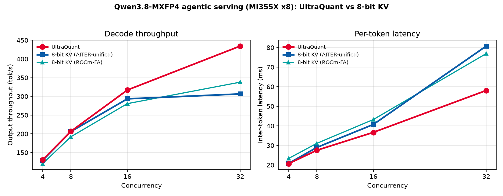
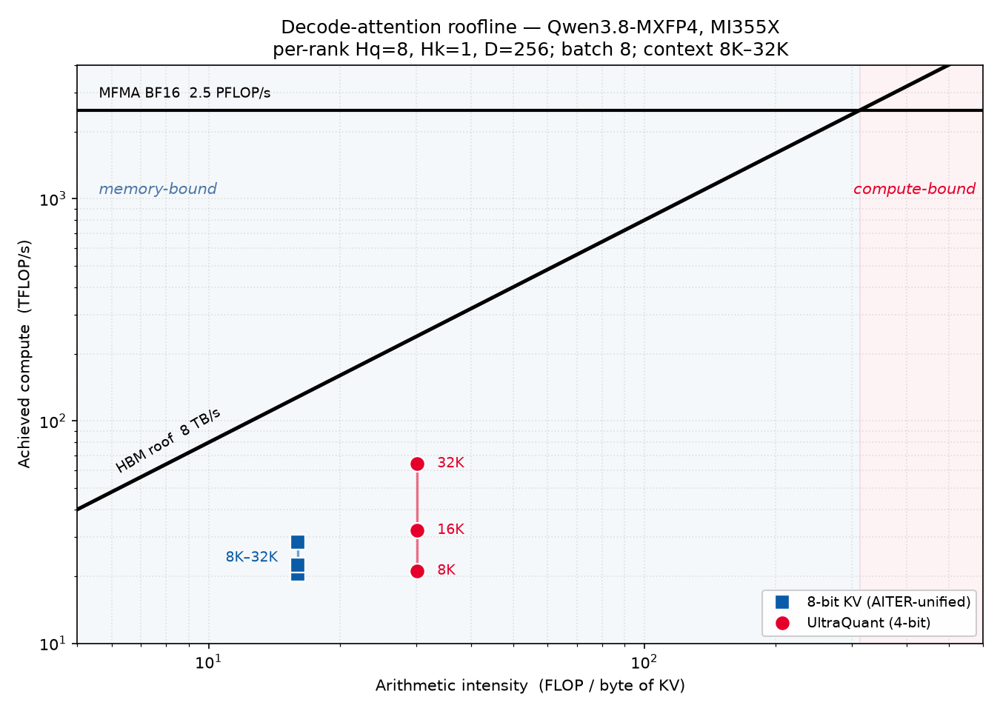
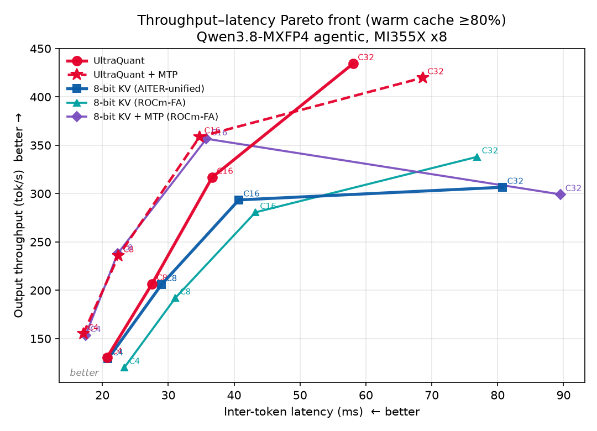
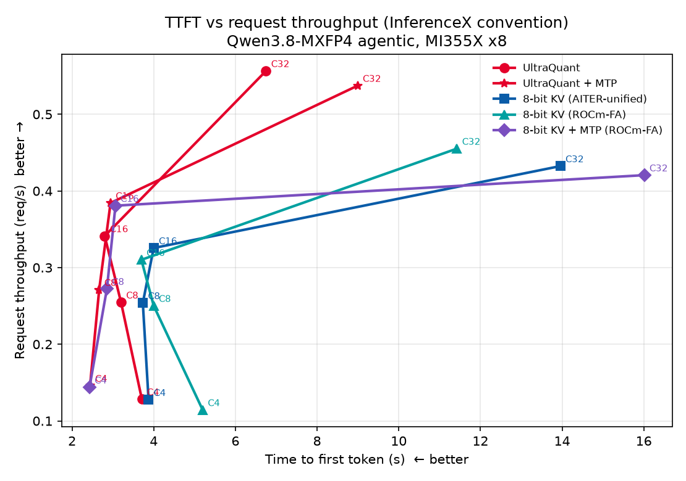

<!---
Copyright (c) 2026 Advanced Micro Devices, Inc. (AMD)

Permission is hereby granted, free of charge, to any person obtaining a copy
of this software and associated documentation files (the "Software"), to deal
in the Software without restriction, including without limitation the rights
to use, copy, modify, merge, publish, distribute, sublicense, and/or sell
copies of the Software, and to permit persons to whom the Software is
furnished to do so, subject to the following conditions:

The above copyright notice and this permission notice shall be included in all
copies or substantial portions of the Software.

THE SOFTWARE IS PROVIDED "AS IS", WITHOUT WARRANTY OF ANY KIND, EXPRESS OR
IMPLIED, INCLUDING BUT NOT LIMITED TO THE WARRANTIES OF MERCHANTABILITY,
FITNESS FOR A PARTICULAR PURPOSE AND NONINFRINGEMENT. IN NO EVENT SHALL THE
AUTHORS OR COPYRIGHT HOLDERS BE LIABLE FOR ANY CLAIM, DAMAGES OR OTHER
LIABILITY, WHETHER IN AN ACTION OF CONTRACT, TORT OR OTHERWISE, ARISING FROM,
OUT OF OR IN CONNECTION WITH THE SOFTWARE OR THE USE OR OTHER DEALINGS IN THE
SOFTWARE.
--->

# UltraQuant on AMD Instinct: More Efficient Agentic Serving for Qwen3.8-MXFP4

UltraQuant can raise decode throughput and cut latency under load without a measurable drop in reasoning accuracy. In this blog, we will show you how to bring that to long-context and agentic LLM serving on AMD Instinct GPUs with Qwen3.8-2.4T MXFP4. Once agent prompts reach hundreds of thousands of tokens, the key-value (KV) cache is the limiter and not compute. Multi-turn agents (long shared prefixes, short generations, high concurrency) hit this wall hardest.

We pair the MXFP4 Qwen3.8 checkpoint from AMD Quark with UltraQuant on vLLM. The two are independent: MXFP4 shrinks the model weights, UltraQuant shrinks the KV cache to 4-bit. On a real agentic replay, UltraQuant serves more traffic at lower latency than a standard 8-bit cache under load, while keeping accuracy intact.

## Key Results

- Faster under load: At concurrency C=32 (32 in-flight requests) UltraQuant serves 29% more tokens per second at 24% lower per-token latency than the fastest 8-bit KV backend and returns the first token 1.7× sooner. At light load the two are even; the gap opens as concurrency rises, because UltraQuant moves half the memory each decode step reads.
- MTP runs on top: Qwen3.8's Multi-Token Prediction head now works with UltraQuant, cutting inter-token latency a further 12–22% up to C=16. At C=32 it slows things down, so leave MTP on at modest concurrency and turn it off under heavy load.
- Accuracy holds: GPQA-Diamond and SWE-bench Lite both land within sampling noise of the 8-bit cache, with or without MTP. Per-benchmark numbers are below.
- Recommendation: Use UltraQuant for long-context agentic serving of Qwen3.8-MXFP4 on AMD Instinct, and add MTP only for latency-sensitive, lower-concurrency deployments.

## The Model: Qwen3.8-2.4T-A95B, MXFP4

Qwen3.8 is a 2.4-trillion-parameter Mixture-of-Experts model (~95B active per token) with a 262K context window. A couple of details make it an interesting test for KV-cache work:

- It's a hybrid model: only 23 of its 92 layers keep a traditional KV cache; the rest use a lightweight recurrent state, so KV compression has a smaller footprint to work on, yet still matters at long context because those 23 layers have a large per-token cache.
- The weights are MXFP4 (AMD Quark), which runs natively on the MI355X.
- It ships an MTP head for speculative decoding, which we test separately below.

## What Is UltraQuant?

UltraQuant is AMD's 4-bit KV-cache method for context-heavy agents (arXiv:2606.20474 (https://arxiv.org/abs/2606.20474)). It stores keys and values on the FP4 grid the MI355X already understands, with one shared power-of-two scale per group of 32 channels. A group costs 17 bytes, against 32 for an 8-bit cache, so every decode step reads roughly half the memory.

Getting to 4 bits takes one preparatory step: a Walsh–Hadamard rotation, which spreads outlier channels so a 4-bit grid can represent the distribution well. The paper covers that step and the accuracy analysis behind it.

What makes the format practical is that nothing has to be unpacked before the matmul. On MI355X (CDNA4), the matrix core accepts FP4 values directly as MFMA operands, and because the MXFP4 scale is a power of two, applying it is absorbed into the scaled-MFMA instruction itself rather than a separate dequantization step.  So the K/V tensors stay in FP4 all the way into the matrix core. Compression schemes built on fitted codebooks give up this property: their levels are arbitrary, so the kernel must gather them through a lookup table and rebuild keys and values in registers before it can multiply. UltraQuant keeps decode on the native FP4 path and avoids the lookup table detour, which is helpful when the step is memory-bound.

The model weights stay MXFP4 in every experiment and only the KV cache changes. On Qwen3.8's hybrid design UltraQuant applies to the 23 full-attention layers that actually hold a cache.

## Agentic Serving

### Workload and Setup

We replay a real SemiAnalysis (InferenceX) agentic trace: long shared prefixes (prompts routinely in the tens to hundreds of thousands of tokens), short outputs, many turns per session. Both setups see the exact same trace and use the same sampling settings from the Qwen3.8 model card, only the serving configuration differs. We run on AMD Instinct MI355X ×8 with vLLM v0.19.2rc0 plus the UltraQuant kernels used in this post, AITER 0.1.16.post3, and FlyDSL 0.2.0, 262K context, prefix caching on, sweeping concurrency C = 4, 8, 16, 32. Prefix-cache hit rates stayed at 91–95% across setups.

We compare UltraQuant (the 4-bit KV cache) against 8-bit KV (the standard FP8 cache). The 8-bit cache can run on more than one attention backend, so we ran it on both of ROCm's AITER kernels, unified and FA, and compare UltraQuant against whichever is stronger at a given load.

### UltraQuant vs 8-bit KV

Figure 1 sweeps concurrency from 4 to 32. We show the 8-bit cache on both of ROCm's AITER attention backends, unified and FA, so the comparison is against the better of the two at every point.

At light load all three curves sit on top of each other. The gap opens as load rises: UltraQuant keeps climbing while both 8-bit backends fall behind, and the two of them trade places on the way. Unified is ahead at C=16 but flattens out after it, while FA holds up better at the C=32 stress point. UltraQuant leads both across the upper half of the sweep.

Figure 1: Decode throughput (left) and inter-token latency (right) vs concurrency, for UltraQuant and for the 8-bit cache on each AITER backend.

At C=32 UltraQuant reaches 434 tok/s at 58 ms against ROCm-FA, the typically faster 8-bit backend (338 tok/s at 77 ms). UltraQuant achieves 29% more throughput and 24% lower per-token latency. Against AITER-unified (307 tok/s at 81 ms) UltraQuant achieves 41% more throughput and 28% lower per-token latency.

### Why UltraQuant Pulls Ahead of 8-bit KV

The advantage has two parts. First, capacity: UltraQuant uses 17 bytes per 32 cached values where FP8 uses 32, a 47% reduction (1.88× more values per byte). More long-lived agent contexts can remain resident before HBM becomes the constraint. Second, bandwidth: every new token re-reads the whole cache, so a smaller cache means less to fetch.

Compression alone is not enough: if the kernel must unpack every value in software, the bandwidth you saved is spent on lookup. UltraQuant preserves the saving by mapping FP4 codes and UE8M0 scales to native CDNA4 operations. That is why Figure 1 is even at C=4–8, when there is leftover compute to hide the extra traffic, and why UltraQuant pulls away at C=32, which is where many long context sessions are decoding at once and memory bandwidth becomes the constraint. A kernel-level roofline shows the mechanism. Figure 2 profiles the decode-attention step alone as context grows from 8K to 32K.

Figure 2: Decode-attention roofline on MI355X, per-rank geometry (Hq=8, Hk=1, D=256), batch 8. Arithmetic intensity uses each format's KV footprint; achieved compute uses measured median kernel time.

Fewer bytes per value means more attention math per byte of cache, so UltraQuant sits on a higher memory roof. As context grows it climbs that roof, tripling its achieved compute, while the 8-bit cache stays flat. Neither saturates HBM; the advantage is simply having fewer bytes to wait on. At a 32k context length, the decode-attention step is 2.25x faster.

Prefix-cache hits were already high and similar (91–95% on Figure 1), so the C=32 gap is not 8-bit KV being evicted and re-prefilled. Both formats stayed resident, and we did not use KV offload in this sweep as it was not needed. Decode is faster because the attention kernel moves fewer bytes per token on the native FP4 path (Figure 2: 2.25× at 32K). Qwen3.8 also caps the upside since only 23 of 92 layers have a KV cache.

### The Throughput–Latency Trade-Off

Since throughput and per-token latency are a natural trade-off, the fairest comparison is the Pareto front: the highest possible decode throughput at any given inter-token latency. Figure 3 plots that trade-off for UltraQuant and UltraQuant + MTP against the 8-bit cache on ROCm-FA, AITER-unified, and ROCm-FA + MTP. Up and to the left is better, and each label marks a concurrency level.

Figure 3: Decode throughput vs inter-token latency (warm cache ≥80%). Labels mark concurrency. The 8-bit MTP arm runs on ROCm-FA, matching its non-MTP counterpart.

MTP helps most at modest concurrency. A verification step adds work, but it commits ≈2.3 tokens instead of one. Up to C=16, UltraQuant + MTP is the lowest-latency config we ran, 12–22% below plain UltraQuant, with requests finishing about 30% faster at C=4.

At C=32 both MTP arms regress, UltraQuant and 8-bit alike. Each verify step scores three positions and keeps ≈2.3 tokens, so it does more work per emitted token than a single-token decode. At low concurrency that extra work is cheap and fewer steps win; at C=32 it is not. Acceptance length stays ≈2.3 and prefix-cache hit rates were 91–95% on every arm, so the drafts and the cache are not the cause.

The UltraQuant + MTP path measured here is functional but not yet a fused multi-token decode implementation. vLLM expands each verification batch into B×K single-token query rows. The rows share one paged KV cache and execute together, but UltraQuant's current decode kernel processes them as independent queries, so it does not reuse a cache read across the K candidate positions. By contrast, the 8-bit MTP path uses AITER's fused K-query unified_attention kernel. MTP still wins with UltraQuant at C≤16 because accepting ≈2.3 tokens per verification step removes enough sequential decode rounds to outweigh the unfused attention work. A fused K-query UltraQuant kernel could share cache reads across candidate positions and is an opportunity for further optimization.

Beyond decode throughput and inter-token latency, agentic serving also depends on how quickly each request returns its first token and how many requests the system can sustain. Figure 4 plots time-to-first-token against request throughput across all backends and concurrencies; up-and-to-the-left is better, and each label marks a concurrency level.

Figure 4: Time-to-first-token vs request throughput.

## Accuracy: GPQA-Diamond

We evaluate reasoning quality on GPQA-Diamond (198 questions), holding weights and sampling fixed and varying only the KV cache. UltraQuant lands within sampling noise of the 8-bit baseline.

Methodology. All accuracy and SWE-bench runs use temperature = 1.0 from the Qwen3.8 model card, with identical sampling on every arm. We report accuracy and resolved-rate, and judge gaps against sampling noise. Where a config was run on more than one seed, we report the mean across seeds; where the same seed was repeated, we report the mean across those runs.

| Configuration | Accuracy |
| --- | --- |
| 8-bit KV | 94.4% (187/198) |
| 8-bit KV + MTP | 92.9% (184/198) |
| UltraQuant | 92.9% (184/198) |
| UltraQuant + MTP | 91.4% (181/198) |

UltraQuant scores 92.9% against 94.4% for the 8-bit cache, a delta of 1.5 points, or 3 of 198 questions. Enabling MTP costs the same 1.5 points on both formats. The four arms span 3 points in total, which is smaller than the 4-question gap between the two UltraQuant + MTP seeds, so the spread is consistent with sampling variance and GPQA-Diamond does not separate the KV formats at this sample size.

## Accuracy: SWE-bench Lite

SWE-bench Lite grades end-to-end software-engineering task resolution. For each GitHub issue the agent inspects the repository, edits over multiple turns, and submits a patch scored by project tests. We evaluate the same four KV configurations as the serving sweep on a fixed 100-task subset and report resolved-rate (resolved / 100).

| Configuration | no MTP | + MTP |
| --- | --- | --- |
| 8-bit KV | 78 | 81 |
| UltraQuant | 81 | 88 |

UltraQuant resolves 81/100 tasks against 78/100 for the 8-bit cache, exceeding the 8-bit baseline by 3 tasks despite storing the cache at half the per-token budget. With MTP enabled the two formats reach 81/100 and 88/100, so the 4-bit cache is level or ahead in both settings and no configuration falls below the 8-bit baseline. Each entry is a single pass over the fixed cohort, and the gaps of 3 to 7 tasks are comparable to the seed-to-seed variation we measured on GPQA-Diamond, so we treat the four configurations as equivalent on task resolution.

## Summary

In this blog, you saw how UltraQuant brings a native 4-bit KV cache to long-context agentic serving of Qwen3.8-MXFP4 on AMD Instinct, and how it holds up against a standard 8-bit cache on a real agentic workload. In short, you serve more traffic at lower latency without giving up reasoning accuracy. At C=32, UltraQuant delivered **+29% decode throughput** and **−24% per-token latency** against the strongest 8-bit backend, returned the first token **1.7× sooner**, and ran the decode-attention step alone **2.25× faster at 32K context**. Layering Qwen3.8's MTP head on top cut inter-token latency a further **12–22% at C≤16**, with no systematic accuracy cost. Across both GPQA-Diamond and SWE-bench Lite, the 4-bit cache stayed within sampling noise of 8-bit, with or without MTP.

So where does UltraQuant fit in your stack? UltraQuant is a strong default for long-context agentic serving of Qwen3.8-MXFP4 on AMD Instinct, and if your workload is latency-sensitive and runs at lower concurrency, UltraQuant + MTP is the top configuration to reach for.

Several directions remain open for future work:

- Fused multi-token UltraQuant decode, so MTP verification can reuse each cache read across candidate positions instead of expanding multiple single-token queries.
- Upstreaming UltraQuant into vLLM so the kernels and serving path measured here land in the public tree.
- Repeating the sweep on full-attention models, where more layers hold a cache.

## Acknowledgements

We thank our colleagues across the AMD kernel, quantization, and inference-serving teams, and the open-source vLLM community, whose upstream work and technical discussions made this study possible.

## Disclaimers

Third-party content is licensed to you directly by the third party that owns the content and is not licensed to you by AMD. ALL LINKED THIRD-PARTY CONTENT IS PROVIDED "AS IS" WITHOUT A WARRANTY OF ANY KIND. USE OF SUCH THIRD-PARTY CONTENT IS DONE AT YOUR SOLE DISCRETION AND UNDER NO CIRCUMSTANCES WILL AMD BE LIABLE TO YOU FOR ANY THIRD-PARTY CONTENT. YOU ASSUME ALL RISK AND ARE SOLELY RESPONSIBLE FOR ANY DAMAGES THAT MAY ARISE FROM YOUR USE OF THIRD-PARTY CONTENT.

The information presented in this document is for informational purposes only and may contain technical inaccuracies, omissions, and typographical errors. The information contained herein is subject to change and may be rendered inaccurate for many reasons, including but not limited to product and roadmap changes, component and motherboard version changes, new model and/or product releases, product differences between differing manufacturers, software changes, BIOS flashes, firmware upgrades, or the like. Any computer system has risks of security vulnerabilities that cannot be completely prevented or mitigated. AMD assumes no obligation to update or otherwise correct or revise this information. However, AMD reserves the right to revise this information and to make changes from time to time to the content hereof without obligation of AMD to notify any person of such revisions or changes.

THIS INFORMATION IS PROVIDED "AS IS." AMD MAKES NO REPRESENTATIONS OR WARRANTIES WITH RESPECT TO THE CONTENTS HEREOF AND ASSUMES NO RESPONSIBILITY FOR ANY INACCURACIES, ERRORS, OR OMISSIONS THAT MAY APPEAR IN THIS INFORMATION. AMD SPECIFICALLY DISCLAIMS ANY IMPLIED WARRANTIES OF NON-INFRINGEMENT, MERCHANTABILITY, OR FITNESS FOR ANY PARTICULAR PURPOSE. IN NO EVENT WILL AMD BE LIABLE TO ANY PERSON FOR ANY RELIANCE, DIRECT, INDIRECT, SPECIAL, OR OTHER CONSEQUENTIAL DAMAGES ARISING FROM THE USE OF ANY INFORMATION CONTAINED HEREIN, EVEN IF AMD IS EXPRESSLY ADVISED OF THE POSSIBILITY OF SUCH DAMAGES.

AMD, the AMD Arrow logo, AMD Instinct, ROCm, and combinations thereof are trademarks of Advanced Micro Devices, Inc. Other product names used in this publication are for identification purposes only and may be trademarks of their respective companies. vLLM is a trademark of vLLM Project. All other trademarks and product names referenced in this publication, including UltraQuant, Qwen, FlyDSL, Quark, AITER, SemiAnalysis, InferenceX, GPQA, and SWE-bench, are the property of their respective owners.

© 2026 Advanced Micro Devices, Inc. All rights reserved.
