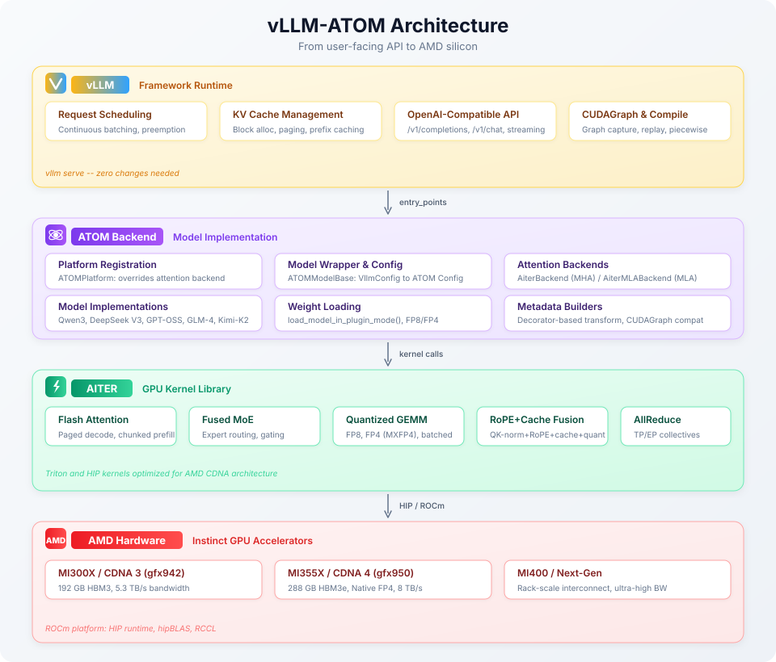

<!---
Copyright (c) 2026 Advanced Micro Devices, Inc. (AMD)

Permission is hereby granted, free of charge, to any person obtaining a copy
of this software and associated documentation files (the "Software"), to deal
in the Software without restriction, including without limitation the rights
to use, copy, modify, merge, publish, distribute, sublicense, and/or sell
copies of the Software, and to permit persons to whom the Software is
furnished to do so, subject to the following conditions:

The above copyright notice and this permission notice shall be included in all
copies or substantial portions of the Software.

THE SOFTWARE IS PROVIDED "AS IS", WITHOUT WARRANTY OF ANY KIND, EXPRESS OR
IMPLIED, INCLUDING BUT NOT LIMITED TO THE WARRANTIES OF MERCHANTABILITY,
FITNESS FOR A PARTICULAR PURPOSE AND NONINFRINGEMENT. IN NO EVENT SHALL THE
AUTHORS OR COPYRIGHT HOLDERS BE LIABLE FOR ANY CLAIM, DAMAGES OR OTHER
LIABILITY, WHETHER IN AN ACTION OF CONTRACT, TORT OR OTHERWISE, ARISING FROM,
OUT OF OR IN CONNECTION WITH THE SOFTWARE OR THE USE OR OTHER DEALINGS IN THE
SOFTWARE.
--->

# vLLM-ATOM: Unlocking Native AMD Performance in the vLLM Ecosystem

This blog walks you through vLLM-ATOM, the AMD-optimized plugin that supercharges vLLM on Instinct GPUs.

We'll break down:

- Why vLLM-ATOM was built, and which real-world serving challenges it is designed to address.
- How ATOM integrates with vLLM as a plugin backend, including the key architecture and runtime execution flow.
- What you can use today: supported models, a quick-start setup, and the ATOM benchmark dashboard for latency, throughput, and quality validation.

By the end, you'll know exactly where this plugin fits in your stack, how to test it safely, and what metrics to track before scaling.

LLM inference faces a classic tradeoff: you want hardware-specific speedups, but don't want to give up the reliability of frameworks like [vLLM](https://github.com/vllm-project/vllm). vLLM is the industry standard for production LLM serving, loved for its smart scheduling, solid memory management, and broad API support. vLLM-ATOM solves this by bringing AMD Instinct GPUs' full performance potential to vLLM, without the hassle of rewriting your stack.

## Why vLLM-ATOM: Key Benefits and Ecosystem Impact

[ATOM](https://github.com/ROCm/ATOM), a high-performance inference engine purpose-built for AMD Instinct GPUs, resolves this conflict with its dual-mode architecture. It can run as a standalone inference server or integrate seamlessly into vLLM as a plugin backend, delivering the AMD-native model and kernel optimizations without any modifications to vLLM’s core codebase.

Not a fork, nor a replacement for vLLM, vLLM-ATOM acts as a collaborative bridge connecting AMD hardware innovation to the open-source vLLM ecosystem, rooted in the spirit of co-evolution rather than competition. As the universal standard for LLM serving, vLLM forms the backbone of inference infrastructure for startups and hyperscalers alike, who rely on its mature APIs, continuous batching capabilities, and full suite of operational tools. Switching serving frameworks entails steep learning curves, migration risks, and heavy operational overhead—users should never have to choose between a trusted production framework and full hardware performance.

Integrating ATOM as a vLLM plugin creates a win-win for all stakeholders, offering five core advantages:

- **Zero learning curve:** Full compatibility with existing vLLM commands, APIs, and end-to-end workflows. ATOM runs transparently in the background, requiring no new tools or complex configurations—while delivering enhanced kernel performance while preserving a consistent user experience.

- **Instant access to AMD innovation:** Leverage cutting-edge AMD hardware features (e.g., FP4 on the MI355X GPU) and top-tier kernel optimizations (e.g., AITER fused attention, custom AllReduce) out of the box, without waiting for upstream integration into the main vLLM codebase. This drastically shortens the time-to-value for the new AMD GPUs.

- **Agile innovation sandbox:** A fast validation layer for new technical ideas, hardware enablement, and kernel library testing (e.g., AITER). The plugin aligns flexibly with the AMD product roadmap, including new GPU releases, FP8/FP4 precision support, and next-gen attention mechanisms—unconstrained by vLLM’s upstream release cycles.

- **vLLM as a production-grade foundation for ROCm:** As the community-standard serving framework, vLLM provides the enterprise-grade stability, broad model coverage, and production-critical features needed to deploy ROCm-based infrastructure at scale.

- **Mature optimizations upstreamed for all:** ATOM serves as a temporary proving ground for new optimizations; once stabilized, kernels, optimization strategies, and new features are upstreamed to vLLM’s native ROCm backend, benefiting the entire ROCm software user community and strengthening the open-source LLM ecosystem.

This plugin enables a closed, iterative innovation cycle: **new hardware/ideas/libraries** → **rapid validation via ATOM** → **upstream integration into vLLM core when mature** → **universal access for all ROCm software users**. This approach accelerates the delivery of AMD hardware advantages to end users through ATOM, while long-term technical improvements flow back to the broader open-source community via vLLM. The sections below walk through the design, architecture, and technical implementation of the vLLM-ATOM system.

## Architecture Overview

Framework development teams (vLLM) focus on cross-backend scheduling, batching logic, and API design; hardware teams (AMD) drive kernel-level optimizations but do not need to rewrite an entire serving framework from scratch. vLLM’s native plugin registration mechanism bridges this divide—and ATOM adheres to the same established integration pattern used by other accelerator vendors, enabling a clean three-layer separation of concerns that clarifies responsibilities across the stack:

| Layer | Responsibility |
|-------|---------------|
| **vLLM** | Request scheduling, KV cache management, continuous batching, OpenAI-compatible API |
| **ATOM Plugin** | Platform registration, optimized model implementation, attention backends routing, kernel-level optimization tuning |
| **AITER** | Low-level GPU kernels — fused MoE, flash attention, quantized GEMM, RoPE fusion |

For a comprehensive technical reference—covering configuration translation, attention integration internals, installation steps, and environment variable settings — refer to the [vLLM-ATOM User Guide](https://rocm.github.io/ATOM/docs/vllm_plugin_backend_guide.html).

The vLLM-ATOM system is composed of four interconnected subsystems that form a cohesive architecture stack, as shown in Figure 1 below.

<div align="center">



Figure 1. ATOM vLLM Architecture Stack

</div>

## Execution Details

Figure 2 below illustrates the end-to-end execution flow—from `vllm serve` startup through ATOM platform discovery, model construction, and a single serving step—showing how vLLM and ATOM interact at each stage.

<div align="center">



Figure 2. vLLM-ATOM execution flow

</div>

The execution flow is divided into four core phases: **plugin discovery** (Steps 1–5), **attention backend selection** (Steps 6–7), **model construction** (Steps 8–9), and **inference serving** (Steps 10–11). The following subsections break down the key technical implementation details for each phase.

### Entry Point Registration (Steps 1–5)

The ATOM plugin is activated through Python's standard `entry_points` mechanism, with the following registration configuration:

```toml
[project.entry-points."vllm.platform_plugins"]
atom = "atom.plugin.vllm.register:register_platform"

[project.entry-points."vllm.general_plugins"]
atom_model_registry = "atom.plugin.vllm.register:register_model"
```

- `register_platform()` returns the `ATOMPlatform` class (Step 3);
- `register_model()` overrides vLLM's model registry with ATOM's optimized wrappers (Step 5). Both hooks are no-ops when `ATOM_DISABLE_VLLM_PLUGIN=1` is set.

### Attention Backend Selection (Steps 6–7)

`ATOMPlatform` extends `RocmPlatform` and overrides the `get_attn_backend_cls()` method to route all attention computations to AITER-backed optimized implementations:

```python
class ATOMPlatform(RocmPlatform):
    @classmethod
    def get_attn_backend_cls(cls, selected_backend, attn_selector_config, num_heads):
        if attn_selector_config.use_mla:
            return "atom.model_ops.attentions.aiter_mla.AiterMLABackend"
        return "atom.model_ops.attentions.aiter_attention.AiterBackend"
```

Two specialized attention backends are supported:

- **AiterBackend (MHA)** — Translates vLLM's `CommonAttentionMetadata` into a three-phase format (decode / extend / prefill) with chunk-based context processing, optimized for standard multi-head attention workloads.
- **AiterMLABackend (MLA)** — Purpose-built for DeepSeek V2/V3-style latent attention. It features fused QK-RoPE-Cache-Update operations, batched FP4/FP8 GEMM for V-projection, persistent metadata buffers for CUDAGraph acceleration, and distributed context parallelism. When the plugin is active, ATOM patches the vLLM’s `MLAAttention.forward_impl` method at import time, delegating all MLA computations to its optimized implementation.

### Model Construction and Weight Loading (Steps 8–9)

The `ATOMModelBase` wrapper fully implements vLLM's model interface while delegating all core computations to ATOM's native model implementations. It handles three critical tasks:

- **Config translation** — Seamlessly converts vLLM’s `VllmConfig` to ATOM’s native `Config`, preserving CUDAGraph settings while applying ATOM’s optimized compile policies for AMD GPUs.
- **Model construction** — Instantiates the ATOM model class and initializes AITER’s distributed backend for multi-GPU/rack-scale inference.
- **Weight loading** — Uses ATOM’s `load_model_in_plugin_mode()` method to load models in ATOM-specific formats and support AMD-optimized quantization schemes, ensuring optimal weight utilization on Instinct GPUs.

### Inference Serving (Steps 10–11)

Once the model is constructed and weights are loaded, vLLM drives the serving loop. During each forward pass, vLLM’s scheduler assembles a batch of requests and invokes `ATOMModelBase.forward()`, which delegates to ATOM’s native model implementation. The attention layers execute through ATOM’s AITER-backed kernels (AiterBackend or AiterMLABackend), while vLLM retains full control over request scheduling, KV cache allocation, and output sampling. This clear separation ensures that ATOM handles the performance-critical compute path while vLLM manages the production-critical serving infrastructure.

## Supported Models

vLLM-ATOM supports both LLMs and VLMs through a unified serving pipeline, covering text-only LLM models and conditional-generation VLM models (including both dense and Mixture-of-Experts (MoE) variants such as Qwen3.5 and Kimi-K2.5). The table below lists the supported model architectures, types, representative examples, and their corresponding ATOM model classes:

| Architecture | Type | Representative Models | ATOM Model Class |
|-------------|------|----------------------|-----------------|
| Qwen3MoeForCausalLM | MoE | Qwen/Qwen3-235B-A22B-Instruct-2507-FP8 | `atom.models.qwen3_moe` |
| DeepseekV3ForCausalLM | MoE (MLA) | deepseek-ai/DeepSeek-R1-0528 (FP8), amd/DeepSeek-R1-0528-MXFP4, amd/Kimi-K2-Thinking-MXFP4 | `atom.models.deepseek_v2` |
| GptOssForCausalLM | MoE | openai/gpt-oss-120b | `atom.models.gpt_oss` |
| Glm4MoeForCausalLM | MoE (MLA) | zai-org/GLM-4.7-FP8 | `atom.models.glm4_moe` |
| Qwen3NextForCausalLM | Hybrid MoE | Qwen/Qwen3-Next-80B-A3B-Instruct-FP8 | `atom.models.qwen3_next` |
| Qwen3_5ForConditionalGeneration | Dense (Text/VLM) | Qwen/Qwen3.5-35B-A3B-FP8 | `atom.models.qwen3_5` |
| Qwen3_5MoeForConditionalGeneration | MoE (Text/VLM) | Qwen/Qwen3.5-397B-A17B-FP8 | `atom.models.qwen3_5` |
| KimiK25ForConditionalGeneration | MoE (Text/VLM) | amd/Kimi-K2.5-MXFP4 | `atom.models.kimi_k25` |

> **Note:** Kimi-K2 (`amd/Kimi-K2-Thinking-MXFP4`) shares the DeepSeek V3-style MLA+MoE architecture and is served through the same `DeepseekV3ForCausalLM` pathway with `--trust-remote-code`.
>
> **Kimi-K2.5 support:** In the latest vLLM-ATOM code, `KimiK25ForConditionalGeneration` is explicitly registered in the plugin model registry, and `amd/Kimi-K2.5-MXFP4` is served through the dedicated Kimi-K2.5 conditional-generation path with multimodal (text/image/video) processing.

For step-by-step deployment guides—including Docker environment setup, server launch commands, performance benchmarking, and accuracy validation—refer to the [vLLM-ATOM Recipes](https://github.com/ROCm/ATOM/tree/v0.1.2/recipes/atom_vllm).

### Quick Start

Pull the pre-built Docker image and launch a vLLM server with ATOM in just two commands:

```bash
docker pull rocm/atom-dev:vllm-latest

vllm serve ${model} \
    --tensor-parallel-size 8 \
    --trust-remote-code \
    --gpu_memory_utilization 0.9
```

ATOM activates automatically when installed alongside vLLM—no additional configuration is needed. For the full set of server options, refer to the [official vLLM documentation](https://docs.vllm.ai/en/latest/).

> **Version compatibility:** vLLM-ATOM is tested against vLLM v0.17.x. Pre-built Docker images for specific vLLM versions are available on [Docker Hub](https://hub.docker.com/r/rocm/atom-dev/tags?name=vllm).

## Performance Characteristics

To enable transparent performance and quality tracking in production-like environments, ATOM provides a live benchmark dashboard (**Dashboard URL:** [vLLM-ATOM Benchmark Dashboard](https://rocm.github.io/ATOM/benchmark-dashboard)).

The dashboard serves as a single pane of glass for monitoring and validating the plugin’s performance, with core features including:

- **Throughput vs Latency:** Compare output throughput and end-to-end latency metrics under different load conditions to evaluate efficiency-quality tradeoffs.
- **Performance Trends:** Track real-time performance changes over time, enabling quick identification of regressions or improvements after kernel updates, model changes, or runtime upgrades.
- **Accuracy Monitoring:** Review benchmarked model quality metrics alongside performance data, ensuring optimization decisions balance inference speed and model correctness.
- **Data Export:** Export benchmark artifacts (via Data & Trace / Download JSON) for offline analysis, experiment reproducibility, and CI/CD report integration.

In practice, the dashboard is an essential tool for release validation: after every ATOM or vLLM plugin update, teams can quickly verify that throughput, latency, and model accuracy remain within expected production ranges.

## Summary

In this blog you followed **vLLM-ATOM** on AMD Instinct GPUs—how vLLM and ATOM/AITER divide work at runtime, which models are in scope, how to try the Docker quick start, and how the benchmark dashboard backs release checks. **Takeaway:** keep your existing vLLM APIs and batching paths, enable AMD-native attention and MoE through the plugin, and validate latency, throughput, and accuracy before you scale traffic.

vLLM-ATOM proves that hardware-specific optimization and framework compatibility are not mutually exclusive. By leveraging vLLM’s out-of-the-box plugin mechanism, ATOM delivers AMD-native kernel optimizations—including fused attention, quantized GEMM, and optimized MoE routing—while preserving the full feature set of vLLM that production LLM deployments rely on.

Beyond immediate performance gains, the plugin’s architecture serves as a critical proving ground for AMD’s hardware and software innovations: optimizations validated in ATOM’s plugin mode are gradually upstreamed to vLLM’s native ROCm backend, benefiting the entire ROCm and open-source LLM community. For end users, this means immediate access to the latest AMD hardware capabilities without waiting for slow upstream integration cycles—creating a virtuous cycle of co-evolution between AMD hardware innovation and the vLLM serving ecosystem.

## Additional Resources

1. [ATOM Documentation](https://rocm.github.io/ATOM/docs/)
2. [vLLM-ATOM Guide](https://rocm.github.io/ATOM/docs/vllm_plugin_backend_guide.html)
3. [RFC: Enable ATOM as vLLM out-of-tree Platform](https://github.com/ROCm/ATOM/issues/201)
4. [ATOM Repository](https://github.com/ROCm/ATOM)
5. [AITER - AMD Inference Tensor Engine for ROCm](https://github.com/ROCm/aiter)
6. [vLLM-ATOM Recipes](https://github.com/ROCm/ATOM/tree/v0.1.2/recipes/atom_vllm)
7. [Docker Hub - ATOM + vLLM Images](https://hub.docker.com/r/rocm/atom-dev/tags?name=vllm)

## Disclaimers

Third-party content is licensed to you directly by the third party that owns the
content and is not licensed to you by AMD. ALL LINKED THIRD-PARTY CONTENT IS
PROVIDED "AS IS" WITHOUT A WARRANTY OF ANY KIND. USE OF SUCH THIRD-PARTY CONTENT
IS DONE AT YOUR SOLE DISCRETION AND UNDER NO CIRCUMSTANCES WILL AMD BE LIABLE TO
YOU FOR ANY THIRD-PARTY CONTENT. YOU ASSUME ALL RISK AND ARE SOLELY RESPONSIBLE
FOR ANY DAMAGES THAT MAY ARISE FROM YOUR USE OF THIRD-PARTY CONTENT.
